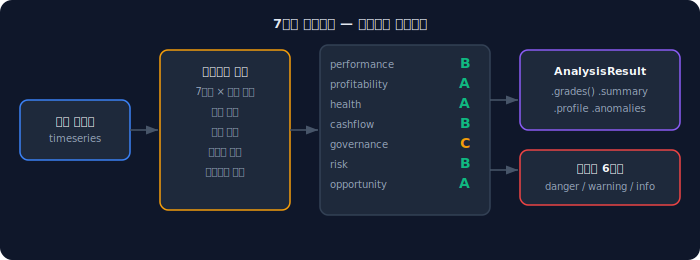
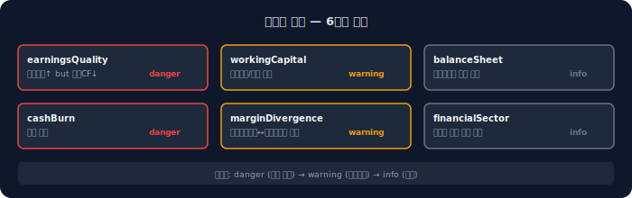
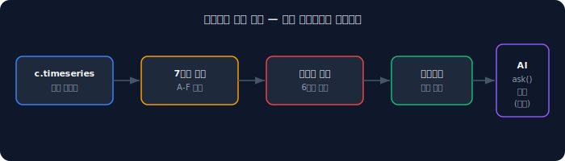

재무제표 숫자를 꺼내는 것과 그 숫자가 "좋은 건지 나쁜 건지" 판단하는 것은 전혀 다른 일이다. ROE 15%가 좋은 건가? 부채비율 120%는 위험한 건가? 답은 업종, 규모, 추세에 따라 다르다.

dartlab의 인사이트 엔진은 이 판단을 자동화한다. 7개 영역(실적·수익성·건전성·현금흐름·지배구조·리스크·기회)을 A-F 등급으로 매기고, 이상치를 감지하고, 기업의 프로파일을 분류한다.

## 7영역 등급이 어떻게 만들어지는가

`c.insights`를 호출하면 7영역 분석이 즉시 실행된다.

```python
from dartlab import Company

c = Company("005930")
result = c.insights

result.grades()
# {'performance': 'B', 'profitability': 'A', 'health': 'A',
#  'cashflow': 'B', 'governance': 'C', 'risk': 'B', 'opportunity': 'A'}
```

각 영역은 독립적으로 채점된다. 영역별로 여러 지표를 점수화하고, 합산 점수를 등급으로 변환한다.



## 7개 영역이 보는 것

| 영역 | 라벨 | 보는 것 |
|---|---|---|
| performance | 실적 성장성 | 매출·이익 성장률, 3년 CAGR, 분기 추세 |
| profitability | 수익성 | ROE, ROA, 영업이익률, 순이익률, EBITDA 마진 |
| health | 재무건전성 | 부채비율, 유동비율, 이자보상배수, 자기자본비율 |
| cashflow | 현금흐름 | FCF, 영업CF마진, 영업CF/순이익, 설비투자비율 |
| governance | 지배구조 | 감사의견, 대주주 지분 변동, 내부거래 |
| risk | 리스크 종합 | 재무 리스크 플래그 종합 |
| opportunity | 기회 종합 | 성장 기회 플래그 종합 |

## 등급 변환 기준

점수(score)를 등급으로 바꾸는 기준은 단순하다.

| 등급 | 조건 | 의미 |
|---|---|---|
| **A** | score ≥ 80% of max | 우수 |
| **B** | score ≥ 50% of max | 양호 |
| **C** | score ≥ 20% of max | 보통 |
| **D** | score ≥ 0 | 주의 |
| **F** | score가 0 미만 | 위험 |
| **N** | 데이터 없음 | 평가 불가 |


## 한 영역을 깊이 파고들기

각 영역의 상세 정보는 `InsightResult` 객체로 접근한다.

```python
health = result.health

health.grade      # 'A'
health.summary    # '부채비율 54.8%로 업종 평균 대비 양호. 유동비율 2.1배.'
health.details    # ['부채비율 54.8% ...', '유동비율 211% ...', ...]
health.risks      # [Flag(text='이자보상배수 하락 추세', severity='warning')]
health.opportunities  # [Flag(text='순현금 보유', severity='positive')]
```

`details`는 해당 영역의 모든 분석 텍스트를 리스트로 담고 있다. `risks`와 `opportunities`는 해당 영역에서 감지된 플래그다.

## 이상치 탐지 — 6가지 규칙

인사이트 엔진은 등급 외에 6가지 이상치(anomaly)를 자동으로 감지한다.

```python
result.anomalies
# [Anomaly(severity='warning', category='earningsQuality',
#          text='영업이익 증가에도 영업현금흐름 감소', value=-0.15)]
```



| 규칙 | 감지 내용 | 심각도 |
|---|---|---|
| earningsQuality | 영업이익↑ but 영업CF↓ | warning~danger |
| workingCapital | 유동자산/부채 급변 | warning |
| balanceSheet | 재무상태표 구조 변화 | info~warning |
| cashBurn | 현금 급감 | warning~danger |
| marginDivergence | 매출총이익률과 영업이익률 괴리 | info~warning |
| financialSector | 금융업 특화 이상 징후 | info~warning |

심각도는 3단계다: `danger`(즉시 주의), `warning`(모니터링), `info`(참고).

## 프로파일과 요약

```python
result.profile   # '안정 성장형' — 기업 유형 분류
result.summary   # '삼성전자는 수익성과 재무건전성이 우수하며...'
```

`profile`은 등급 조합을 기반으로 기업을 유형 분류한 결과다. `summary`는 7영역을 종합한 한 문장 요약이다.

## AI 분석과의 관계

`c.insights`는 순수 정량 엔진이다. LLM을 사용하지 않고 재무 데이터만으로 등급을 매긴다. `dartlab ask`를 사용하면 이 등급 결과가 LLM 컨텍스트에 자동으로 포함되어, AI가 등급의 의미를 해석하고 설명한다.

```python
import dartlab

# 정량 등급만
c = Company("005930")
c.insights.grades()

# AI가 등급을 해석
dartlab.ask("삼성전자", "인사이트 등급 분석해줘")
```

## 어디에서 왜곡이 생기나

**금융업 특수성.** 은행·보험은 일반 제조업 지표(유동비율, 재고회전율 등)가 의미 없다. 인사이트 엔진은 금융업을 자동 감지해서 해당 지표를 N/A 처리하지만, 일부 영역의 등급이 N으로 나올 수 있다.

**데이터 부족.** 신규 상장사나 XBRL 제출이 불완전한 종목은 일부 영역의 등급이 N(평가 불가)으로 나온다.

**governance 영역.** 현재 governance는 공시 텍스트 기반 분석이므로, 정량 지표 기반인 다른 영역보다 평가 범위가 제한적이다.

## 놓치기 쉬운 예외

**등급 N은 F가 아니다.** N은 데이터가 없어서 평가할 수 없다는 뜻이다. F는 데이터가 있지만 나쁘다는 뜻이다. 혼동하지 말아야 한다.

**이상치가 있어도 등급은 좋을 수 있다.** earningsQuality 이상이 감지되어도 profitability 등급이 A일 수 있다. 이상치는 등급과 독립적인 보조 신호다.

**EDGAR(미국) 기업도 지원한다.** 같은 인사이트 엔진이 EDGAR 데이터에도 적용된다.

## 빠른 점검 체크리스트

- [ ] `Company("005930")` 생성 후 `c.insights` 확인
- [ ] `result.grades()` — 7영역 등급 dict
- [ ] `result.health.details` — 영역별 상세 확인
- [ ] `result.anomalies` — 이상치 리스트 확인
- [ ] `result.profile` — 기업 유형 분류
- [ ] `result.summary` — 종합 요약

## FAQ

### 등급이 매일 바뀌나요?

아니다. 등급은 DART에 제출된 XBRL 재무제표 기반이다. 분기 보고서가 새로 제출되면 바뀔 수 있지만, 일일 주가 변동과는 무관하다.

### 등급 기준(임계값)을 바꿀 수 있나요?

현재는 고정된 기준을 사용한다. 커스텀 기준이 필요하면 `c.timeseries`로 원본 데이터를 꺼내서 직접 평가 로직을 만들 수 있다.

### A등급이 "매수 신호"인가요?

아니다. 인사이트 등급은 재무 건전성 분석이지 투자 추천이 아니다. 주가 밸류에이션, 시장 상황, 업종 전망 등은 별도로 판단해야 한다.

### 전체 상장사 등급을 한번에 볼 수 있나요?

`dartlab.screen()`이 비율 기반 스크리닝을 제공한다. 등급 기반 대량 스크리닝은 현재 지원하지 않지만, `screen()`의 필터 조건이 인사이트 등급의 기저 지표와 동일하다.

### governance 영역은 어떤 데이터를 쓰나요?

감사보고서 의견, 대주주 지분 변동, 내부거래 등 공시 텍스트 기반 데이터를 사용한다. 뉴스나 외부 데이터는 사용하지 않는다.

### 이상치 탐지는 몇 개까지 나오나요?

6가지 규칙 각각이 독립적으로 실행된다. 규칙당 0~1개의 이상치가 나오므로, 최대 6개까지 나올 수 있다. 일반적으로 0~2개가 나온다.

### EDGAR 기업의 governance 등급은 어떤가요?

현재 governance는 DART 공시 텍스트에 특화되어 있다. EDGAR 기업은 governance 영역이 N으로 나올 가능성이 높다.

## 참고 자료

- [dartlab 재무제표 가이드](/blog/dartlab-finance-ratios-one-line) — 인사이트의 기반이 되는 재무 데이터
- [dartlab ask — AI 분석](/blog/dartlab-ask-ai-disclosure-analysis) — 인사이트 등급을 AI가 해석
- [dartlab 스크리닝 가이드](/blog/dartlab-screen-benchmark-2700-stock-screening) — 비율 기반 시장 스크리닝

## 핵심 구조 요약



dartlab 인사이트의 구조는 세 문장으로 요약된다.

1. **7영역 × A-F 등급** — 실적, 수익성, 건전성, 현금흐름, 지배구조, 리스크, 기회를 독립적으로 채점한다.
2. **6가지 이상치 탐지** — 등급만으로 보이지 않는 위험 신호를 자동으로 감지한다.
3. **LLM 없는 정량 엔진** — 재무 데이터만으로 동작하므로 API 키 없이 즉시 사용 가능하다.
