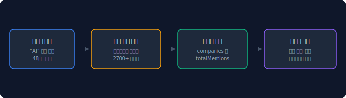
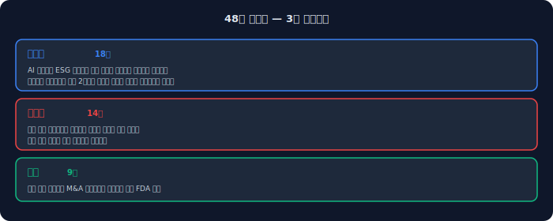
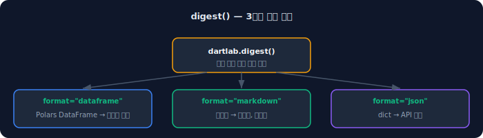
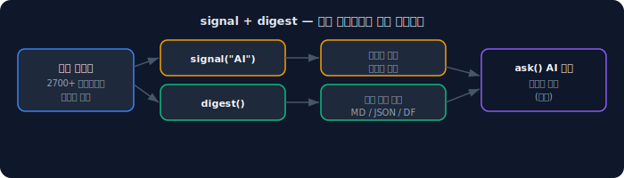

사업보고서에 "AI"라는 단어가 얼마나 자주 등장하는지, "ESG"가 언제부터 급증했는지, "구조조정"이 올해 얼마나 많이 나왔는지 — 이런 질문에 답하려면 수천 건의 공시를 직접 읽어야 한다.

dartlab의 `signal()`은 48개 키워드의 연도별 등장 빈도를 전체 상장사 공시에서 추적한다. `digest()`는 시장 전체의 공시 변화를 요약해서 돌려준다. 공시 텍스트가 말하는 시장의 방향을 코드 한 줄로 읽는 도구다.

## signal() — 키워드별 연도 트렌드

```python
import dartlab

df = dartlab.signal("AI")
# DataFrame: year, keyword, category, companies, totalMentions
```

특정 키워드를 넣으면, 해당 키워드가 연도별로 몇 개 기업의 공시에서 언급되었는지, 총 몇 번 등장했는지를 돌려준다.



## 48개 키워드 — 3개 카테고리

키워드를 지정하지 않으면 48개 전체의 트렌드를 반환한다.

```python
df = dartlab.signal()  # 48개 전체
```



### 트렌드 (18개)
| 키워드 | 주제 |
|---|---|
| AI, 인공지능 | 인공지능 |
| ESG, 탄소중립 | 지속가능경영 |
| 수소, 전기차, 자율주행 | 미래모빌리티 |
| 메타버스, 블록체인 | 디지털 기술 |
| 클라우드, 데이터센터 | 인프라 |
| 로봇 | 자동화 |
| 2차전지, 배터리, 반도체 | 핵심 부품 |
| 바이오 | 헬스케어 |
| 디지털전환, 플랫폼 | 비즈니스 모델 |

### 리스크 (14개)
환율, 금리, 인플레이션, 경기침체, 공급망, 원자재, 유가, 지정학, 규제, 소송, 유동성, 파산, 구조조정, 감사의견

### 기회 (9개)
수출, 수주, 신규사업, M&A, 시장점유율, 해외진출, 신약, FDA, 특허

## 결과 해석하기

```python
df = dartlab.signal("AI")
```

| year | keyword | category | companies | totalMentions |
|---|---|---|---|---|
| 2020 | AI | 트렌드 | 120 | 340 |
| 2021 | AI | 트렌드 | 185 | 580 |
| 2022 | AI | 트렌드 | 310 | 1,240 |
| 2023 | AI | 트렌드 | 580 | 3,100 |
| 2024 | AI | 트렌드 | 820 | 5,400 |

`companies`는 해당 키워드를 한 번 이상 언급한 기업 수, `totalMentions`는 전체 등장 횟수다. AI 키워드가 2020년 120개사에서 2024년 820개사로 급증한 것이 보인다.

## digest() — 시장 전체 변화 요약

```python
result = dartlab.digest(format="markdown")
print(result)
```

digest()는 시장 전체의 공시 변화를 요약한다. 세 가지 출력 형식을 지원한다.

| format | 반환 타입 | 용도 |
|---|---|---|
| `"dataframe"` | Polars DataFrame | 데이터 분석 |
| `"markdown"` | 문자열 | 보고서, 블로그 |
| `"json"` | dict | API 연동 |



## 섹터 필터와 종목 지정

```python
# 특정 섹터만
dartlab.digest(sector="반도체", format="markdown")

# 특정 종목들만
dartlab.digest(stock_codes=["005930", "000660", "035420"], format="markdown")

# 상위 N개만
dartlab.digest(top_n=10, format="dataframe")
```

`sector`로 특정 업종만 볼 수 있고, `stock_codes`로 관심 종목만 지정할 수 있다. `top_n`은 변화가 큰 상위 N개만 추린다.

## signal()과 digest()의 차이

| | signal() | digest() |
|---|---|---|
| **입력** | 키워드 | 없음 (전체 스캔) |
| **출력** | 키워드별 연도 트렌드 | 시장 전체 변화 요약 |
| **관점** | "이 키워드가 얼마나 퍼졌나" | "시장에서 무엇이 바뀌었나" |
| **용도** | 특정 테마 추적 | 시장 전체 모니터링 |

둘을 함께 쓰는 것이 효과적이다. digest()로 전체 그림을 보고, signal()로 관심 키워드를 깊이 추적한다.

## 어디에서 왜곡이 생기나

**키워드 단순 매칭.** signal()은 형태소 분석이 아닌 단순 문자열 매칭이다. "AI"가 "FAIR"의 일부로 매칭될 수 있고, "인공지능"과 "AI"가 별도로 카운트된다. 이를 보완하기 위해 관련 키워드를 같은 카테고리에 묶었다.

**공시 제출 시차.** 연도별 데이터는 해당 연도에 제출된 공시 기준이다. 2024년 사업보고서가 2025년 3월에 제출되면, 2024년이 아닌 2025년에 반영될 수 있다.

**digest() 범위.** 현재 digest()는 사업보고서 텍스트를 기반으로 한다. 수시공시, IR 자료 등은 포함되지 않는다.

## 놓치기 쉬운 예외

**영문 키워드 대소문자.** "AI"와 "ai"는 구분된다. 키워드 목록에 있는 정확한 형태를 사용해야 한다.

**없는 키워드를 넣으면.** 48개 목록에 없는 키워드를 넣으면 빈 결과가 반환된다. 커스텀 키워드 추가는 현재 지원하지 않는다.

**메모리 사용량.** 전체 상장사 공시 텍스트를 스캔하므로, signal()은 상당한 메모리를 사용한다. 다른 무거운 작업과 동시 실행은 피하는 것이 좋다.

## 빠른 점검 체크리스트

- [ ] `dartlab.signal("AI")` — 키워드 트렌드 DataFrame 확인
- [ ] `dartlab.signal()` — 48개 전체 트렌드 확인
- [ ] `dartlab.digest(format="markdown")` — 마크다운 요약 확인
- [ ] `dartlab.digest(format="dataframe")` — DataFrame 확인
- [ ] `dartlab.digest(sector="반도체")` — 섹터 필터 확인

## FAQ

### 커스텀 키워드를 추가할 수 있나요?

현재는 48개 고정 키워드만 지원한다. 커스텀 키워드 검색이 필요하면 `c.docs.sections`에서 원문 텍스트를 직접 검색할 수 있다.

### signal()로 특정 기업만 추적할 수 있나요?

signal()은 전체 시장 대상이다. 특정 기업의 키워드 추적은 `Company("005930")`에서 `c.docs.sections`를 검색하는 방식으로 가능하다.

### digest()가 AI를 쓰나요?

아니다. digest()는 통계 기반 요약이다. LLM을 사용하지 않고, 공시 텍스트의 변화를 정량적으로 집계한다. AI 해석이 필요하면 `dartlab.ask()`에서 digest 결과를 참조하게 할 수 있다.

### 데이터는 얼마나 자주 갱신되나요?

공시 데이터가 업데이트될 때마다 갱신된다. 분기 보고서 시즌(3월, 5월, 8월, 11월)에 가장 큰 변화가 생긴다.

### 트렌드 키워드 18개가 충분한가요?

현재 키워드 목록은 가장 보편적인 산업 트렌드를 커버한다. 틈새 키워드(예: "양자컴퓨팅", "mRNA")는 향후 확대 계획이 있다.

### signal()과 ask()를 함께 쓸 수 있나요?

signal()로 트렌드를 파악한 후, `dartlab.ask("삼성전자", "AI 사업 현황 분석해줘")`로 특정 기업의 맥락을 AI에게 해석시킬 수 있다.

### EDGAR(미국) 공시에서도 signal()을 쓸 수 있나요?

현재 signal()은 DART(한국) 공시 전용이다. EDGAR 기반 signal은 향후 지원 예정이다.

## 참고 자료

- [dartlab ask — AI 분석](/blog/dartlab-ask-ai-disclosure-analysis) — signal 결과를 AI가 해석
- [dartlab 스크리닝 가이드](/blog/dartlab-screen-benchmark-2700-stock-screening) — 재무비율 기반 스크리닝
- [dartlab 네트워크](/blog/dartlab-network-group-relation-visualization) — 기업 간 관계망 분석

## 핵심 구조 요약



dartlab signal의 구조는 세 문장으로 요약된다.

1. **48개 키워드 × 3카테고리** — 트렌드(18), 리스크(14), 기회(9)로 시장 전체 공시 텍스트를 스캔한다.
2. **signal()은 추적, digest()는 요약** — signal로 특정 테마의 연도별 확산을 추적하고, digest로 시장 전체 변화를 한눈에 본다.
3. **정량 스캔 → AI 해석** — 통계 기반 결과를 ask()에 넘기면 맥락과 의미를 AI가 해석한다.
