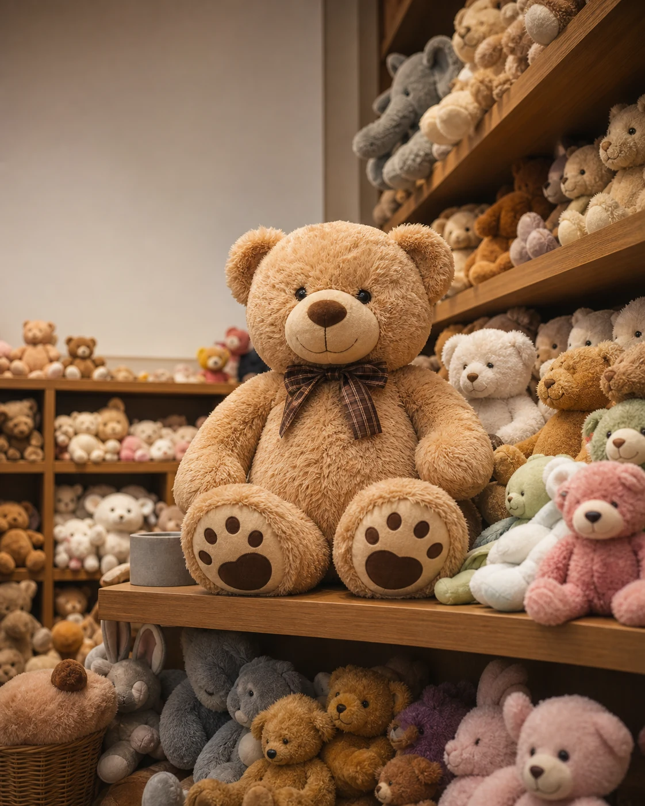
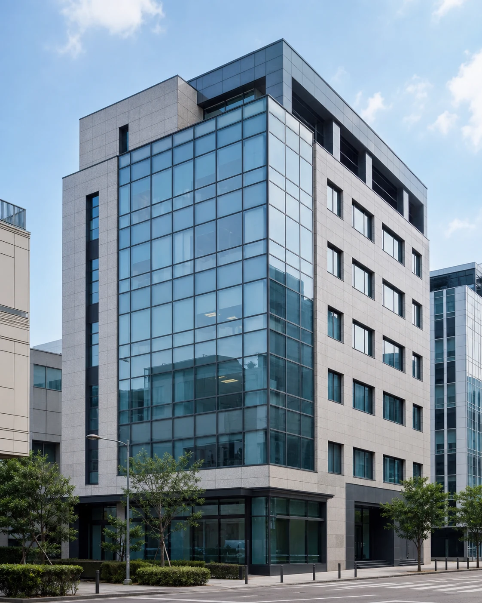
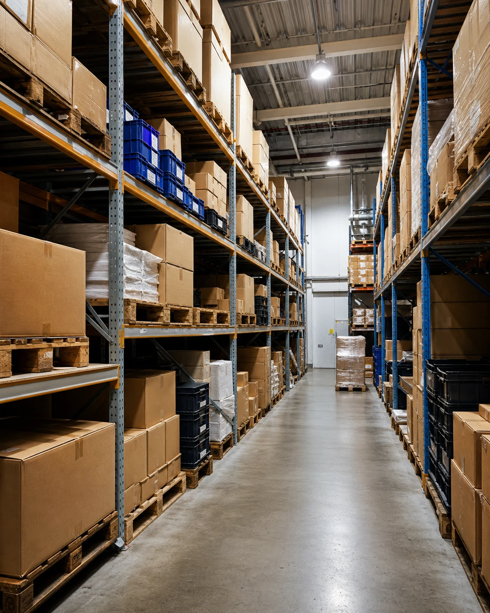

<script>
	import CompanyFinancials from '$lib/components/blog/CompanyFinancials.svelte';
</script>



봉제완구 오로라월드의 재무상태표에는 이상한 줄이 하나 있다. '투자부동산 1,274억원'. 임대료나 시세차익을 노리고 들고 있는 부동산이라는 뜻이다. 이 한 줄이, 이 회사 시가총액(약 2,300억원)의 절반을 넘는다. 인형을 파는 회사가, 인형과 무관한 부동산을 시가총액의 절반만큼 깔고 앉아 있는 것이다.

이상한 줄은 하나 더 있다. 2026년 1분기, 오로라는 분기 기준 사상 최대 매출 975억원을 찍었다. 그런데 같은 분기 영업활동으로 회사에 들어온 현금은 마이너스 115만원, 사실상 0원이었다. 가장 많이 판 분기에 현금은 한 푼도 남지 않았다.

주가는 이 두 줄과 정반대로 움직였다. 2025년 오로라 주가는 약 5,000원에서 22,000원 부근까지 1년 사이 4배 넘게 올랐다(52주 범위 5,150원~21,950원, 외부 시세 기준). 시장은 이 회사를 '캐릭터 IP가 잘 팔리는 장난감 성장주'로 값 매겼다.

이 요약이 틀린 것은 아니다. 오로라의 캐릭터는 실제로 더 잘 팔리고 있고, 마진도 올라왔다. 다만 이 요약은 재무제표의 첫 장, 손익계산서까지만 읽은 그림이다. 손익계산서는 회사가 한 해 얼마를 벌었는지를 보여주고, 거기서 오로라는 화려하다. 그러나 재무제표에는 두 장이 더 있다. 회사가 지금 무엇으로 이루어져 있는지를 보여주는 재무상태표, 그리고 그 이익이 실제 현금으로 들어왔는지를 보여주는 현금흐름표다. 이 두 장을 마저 넘기면, 방금 본 성장주 위에 전혀 다른 회사의 윤곽이 겹쳐 떠오른다. 빚으로 자산을 쌓아 올린, 시가총액만큼 무거운 몸을 가진 회사다.

그래서 이 글이 끝까지 붙드는 질문은 하나다. 지금 당신이 산 것은 인형 회사인가, 아니면 빚으로 지어 올린 부동산인가. 이 글의 모든 숫자는 dartlab로 오로라월드(039830)의 DART 공시를 직접 읽어 계산했다.

## 오로라는 무엇을 파는가, 그리고 무엇을 쌓았는가

먼저 회사를 짧게 세운다. 오로라월드(구 상호 '오로라')는 봉제완구와 캐릭터 IP를 만드는 회사다. 자체 캐릭터 브랜드로 만든 봉제 완구를 국내보다 해외에서 더 많이 파는 수출 중심 기업이고, KOSDAQ에 상장돼 있다. 최근의 실적 반등을 미국 시장 성장이 이끌었다는 설명이 많은데, 이 부분은 회사가 재무제표에 지역별로 나눠 밝히지 않아 외부 자료에 의존하는 이야기다. 그래서 이 글은 그 서사를 배경으로만 두고, 확인되는 숫자만 따라간다.

확인되는 것부터 보자. 오로라의 손익 구조는 봉제인형치고 특이하다. 2025년 매출총이익률이 55.7%였다. 매출 100원을 팔면 원가를 뺀 55.7원이 남는다는 뜻이다. 원단과 솜을 꿰매 파는 사업이라면 나오기 어려운 마진이다. 인형 제조는 노동과 원자재가 무거운 사업이라, 순수 제조만으로는 매출총이익률이 이 절반에도 못 미치는 게 보통이다. 그런데 55%가 나온다는 건, 오로라가 파는 것이 봉제 원단이 아니라 아이가 이름을 기억하는 캐릭터라는 사실을 말해준다. 캐릭터라는 무형의 가치가 원가 위에 얹히고, 그 위에 브랜드가 붙어야 만들어지는 마진이다. 손님은 인형 한 개의 원가를 사는 게 아니라 그 인형이 대표하는 캐릭터를 사는 것이고, 그 차액이 마진으로 남는다. 여기까지만 보면 시장의 그림이 정확히 맞다. 고마진 IP를 파는 성장주.

그런데 시선을 손익계산서에서 재무상태표로 옮기면 그림이 통째로 바뀐다. 손익계산서가 '이 회사가 한 해 얼마를 벌었나'를 보여준다면, 재무상태표는 '이 회사가 지금 무엇으로 이루어져 있나'를 보여준다. 그리고 오로라의 재무상태표는 장난감 회사의 것이 아니다.

2026년 1분기 오로라의 자산총계는 6,002억원이다. 이 중 당장 팔거나 굴리는 유동자산(현금·재고·매출채권 등)은 2,066억원뿐이고, 나머지 3,936억원이 비유동자산이다. 전체 자산의 66%가 1년 안에 현금이 되지 않는 장기 자산이라는 뜻이다. 봉제완구 회사의 자산 3분의 2가 인형 재고가 아니라 건물과 땅과 설비에 담겨 있는 것이다. 게다가 이 비유동자산은 10년 전 1,109억원에서 3.5배로 불었다. 회사가 지난 10년 동안 벌고 빌린 돈의 상당 부분을, 매출을 늘리는 데가 아니라 장기 자산의 몸집을 키우는 데 썼다는 뜻이다.

파는 것은 가벼운 인형인데, 몸은 무겁다. 이 괴리가 오로라를 이해하는 열쇠다. 그리고 이 괴리는 세 개의 질문으로 이어진다. 그 무거운 자산은 정확히 무엇인가. 어떻게 그렇게 커졌나. 그리고 그 무게가 지금 회사에 이득인가 짐인가. 이 셋을 차례로 열어보면, 시장이 값 매긴 '성장주'와 재무제표가 보여주는 '무거운 회사' 사이의 거리가 드러난다.

미리 말해두면, 이 글은 오로라가 좋은 회사인지 나쁜 회사인지를 판정하려는 것이 아니다. 이 회사가 시장이 부르는 이름(캐릭터 성장주)과 실제 생김새(빚으로 자산을 쌓은 무거운 회사)가 다르다는 것을 보이고, 그 다름을 아는 사람과 모르는 사람이 완전히 다른 것을 사게 된다는 점을 짚으려는 것이다. 재무제표는 회사가 스스로에 대해 하는 가장 정직한 진술이다. 그 진술을 손익계산서 윗줄에서 멈추지 않고 재무상태표와 현금흐름표까지 읽어 내려가면, 같은 회사가 전혀 다르게 보인다. 오로라가 바로 그런 회사다.

## 자산의 정체: 시가총액을 넘는 부동산

그 3,936억원의 비유동자산을 열어보면, 두 개의 큰 덩어리가 나온다. 하나는 영업에 쓰는 유형자산(토지·건물·설비) 2,210억원이고, 다른 하나가 앞서 말한 투자부동산 1,274억원이다.

이 둘의 성격은 다르다. 유형자산은 인형을 만들고 유통하는 데 실제로 쓰는 시설이다. 회사가 돌아가려면 필요한 몸이다. 반면 투자부동산은 회계에서 특별한 지위를 가진다. 영업에 직접 쓰지 않고, 임대수익이나 시세차익을 노리고 보유하는 부동산이 여기로 분류된다. 즉 오로라는 인형을 파는 데 꼭 필요하지 않은 부동산을, 자산으로 굴리기 위해 따로 들고 있는 것이다. 장난감을 팔아 번 돈의 상당 부분을 이렇게 부동산으로 바꿔 쌓아왔다.



이 구분이 중요한 이유가 있다. 회사가 공장을 하나 더 지으면 그것은 인형을 더 만들기 위한 유형자산이고, 언젠가 매출로 돌아온다. 그러나 임대용 건물을 사면 그것은 인형 사업과 직접 연결되지 않는 별도의 자산 운용이다. 봉제완구 회사가 이런 임대 부동산을 시가총액의 절반만큼 들고 있다는 것은, 이 회사가 순수한 장난감 회사라기보다 장난감 사업과 부동산 보유를 겸한 두 겹의 회사에 가깝다는 뜻이다. 투자자가 오로라 주식을 하나 살 때, 그 값의 절반 이상은 인형이 아니라 이 부동산 운용에 매겨진 값인 셈이다. 회사를 캐릭터 성장주로만 보고 사면, 정작 자기가 산 것의 절반을 못 보고 사는 것이다.

왜 인형 회사가 이런 부동산을 쌓았을까. 여기서부터는 재무제표만으로 단정하기 어렵고 해석의 영역이지만, 방향은 몇 가지로 좁혀진다. 오래 사업을 해온 제조 기업이 번 돈으로 토지와 건물을 사 두는 것은 한국에서 드물지 않은 자산 운용 방식이다. 브랜드로 벌어 유형자산과 부동산에 쌓는다는 점에서는 [아모레퍼시픽](/blog/090430-amorepacific)이나 [대상](/blog/001680-daesang) 같은 전통 소비재 기업과도 겹치는 구석이 있다. 본업의 경기 변동에 흔들리지 않는 자산을 확보해 회사의 하방을 단단히 하려는 보수적 선택일 수도 있고, 부동산 그 자체를 장기 투자처로 본 판단일 수도 있다. 어느 쪽이든, 주주가 던져야 할 질문은 그 선택의 동기가 아니라 결과다. 그 부동산이 회사의 자본을 효율적으로 굴리고 있는가, 아니면 고마진 본업에 쓰였으면 더 컸을 자본을 완만한 자산에 묶어두고 있는가. 이 질문의 답은, 그 부동산이 만들어내는 현금과 그것을 사기 위해 진 빚의 이자를 나란히 놓고 봐야 나온다. 그 두 숫자가 다음 이야기다.

이 구성은 dartlab에서 계정 단위로 바로 확인된다.

```python
import dartlab
c = dartlab.Company("039830")            # 오로라월드
c.select("BS", ["투자부동산", "유형자산", "비유동자산", "자산총계"], freq="Q")
# 2026Q1: 투자부동산 1,274억 + 유형자산 2,210억, 비유동자산 3,936억 = 자산총계 6,002억의 66%
```

규모를 시가총액과 견주면 그 무게가 실감난다. 임대 목적 투자부동산 1,274억원만으로 이 회사 시가총액(약 2,300억원)의 55%다. 여기에 영업용 유형자산 2,210억원까지 더한 부동산성 자산 3,484억원은 시가총액의 1.5배다. 다시 말해, 지금 오로라 주식을 사면 인형 사업과 함께 시가총액을 웃도는 부동산·설비를 함께 사는 셈이다.

이 사실은 두 얼굴을 가진다. 한 얼굴은 숨은 자산이다. 부동산은 보통 취득 원가로 장부에 남기 때문에, 오래 보유한 부동산의 실제 시세는 장부가보다 높을 수 있다. 임대수익이라는 별도의 현금원이 있고, 언젠가 팔면 큰 현금이 한 번에 들어온다. 손익이 흔들려도 자산이 든든하니 크게 무너지지 않는다는 논리가 하방을 받쳐준다. 시장이 오로라의 주가 하방을 얕게 보는 이유 중 하나가 이 자산일 수 있다.

다만 숨은 자산에는 함정이 하나 있다. 장부에 적힌 부동산 가치는 회사가 그것을 실제로 팔거나 임대해 현금을 만들기 전까지는 종이 위의 숫자에 머문다. 시세가 장부가보다 높아도, 그 차익은 매각이라는 사건이 일어나야 비로소 현금이 된다. 그리고 회사가 그 부동산을 팔 이유가 없거나 팔 생각이 없으면, 숨은 가치는 영원히 숨은 채로 남는다. 주주 입장에서 종이 위의 자산 가치는 위안은 되지만 배당이나 주가로 돌아오지는 않는다. 그래서 '시가총액보다 큰 자산'이라는 안심은, 그 자산이 실제로 현금이나 주주 환원으로 이어지는 통로가 있을 때만 값을 갖는다. 오로라의 경우 그 통로가 아직 열려 있지 않다. 배당은 사실상 없고, 부동산 매각이나 대규모 임대수익 실현도 확인되지 않는다. 숨은 자산은 있으되, 그것이 주주에게 닿는 길은 아직 보이지 않는 상태다.

다른 얼굴은 닻이다. 그 많은 자본이 부동산에 잠겨 있는 동안, 그것은 인형 사업을 키우는 데 쓰이지 못한 돈이다. 캐릭터 하나를 더 키우거나 유통을 넓히는 데 쓸 수 있었던 자본이 건물로 굳어 있는 것이다. 부동산은 안정적이지만 성장하지 않는다. 고마진 캐릭터 사업에 재투자됐다면 더 큰 이익을 낳았을 자본이, 임대료라는 완만한 수익에 묶여 있다는 뜻이기도 하다. 성장주의 자본이 부동산에 잠겨 있다는 것은, 뒤집어 보면 그만큼 성장에 덜 쓰였다는 신호다.

한국 상장사에서 이런 구조가 드문 것은 아니다. 오래된 제조·수출 기업이 번 돈으로 사옥과 토지를 사 모으고, 그것이 세월이 지나며 본업보다 큰 자산이 되는 경우가 있다. 시장은 이런 회사를 '자산주'라 부르며, 본업의 부진을 자산 가치가 받쳐준다고 본다. 문제는 그 자산이 순수한 여윳돈으로 산 것이냐, 빚을 내서 산 것이냐다. 여윳돈으로 샀다면 그 부동산은 순수한 방석이다. 그러나 빚으로 샀다면, 그 부동산 뒤에는 매 분기 갚아야 할 이자가 따라붙는다. 방석인 줄 알았던 것이 사실은 이자를 먹는 무게일 수 있는 것이다.

오로라의 부동산과 설비는 후자에 가깝다. 뒤에서 숫자로 보겠지만, 이 자산은 회사가 자기 돈만으로 지은 것이 아니라 빚으로 지었다. 그 순간 숨은 자산이라는 얼굴 뒤에 이자라는 청구서가 따라붙는다. 그래서 '시가총액을 웃도는 자산이 하방을 받쳐준다'는 안심과 '그 자산이 이자를 먹으며 성장을 잠근다'는 우려가 같은 부동산 위에 겹쳐 있다. 어느 얼굴이 진짜인지가 이 회사 가치의 절반을 가른다. 그 답을 얻으려면, 이 부동산이 어떻게 지어졌는지부터 봐야 한다.

## 이 무거운 몸은 빚으로 지어졌다

부동산과 설비를 어떻게 시가총액의 1.5배까지 쌓았을까. 인형을 팔아 번 돈만으로는 부족했다. 나머지는 빚이었다.

먼저 배경을 알아야 한다. 오로라는 오랫동안 조용한 회사였다. 2016년부터 2020년까지 5년 동안 매출은 1,434억원에서 1,416억원으로 사실상 제자리였다. 파는 양도, 버는 돈도 거의 늘지 않던 시절이다. 그러다 2021년을 기점으로 회사가 움직이기 시작했다. 매출이 뛰기 시작한 것도, 자산을 본격적으로 짓기 시작한 것도 이 무렵이다. 정체돼 있던 회사가 무언가를 결심하고 몸집을 키우기로 한 전환점이 2021년 언저리에 있었던 셈이다. 그 결심의 대가가 지금의 무거운 재무상태표다.

시간을 되짚어보면 뚜렷한 건설기가 보인다. 2020년부터 2023년까지 오로라는 매년 수백억원을 투자활동에 쏟아부었다. 자산을 짓는 시기였다. 그 재원은 대부분 밖에서 끌어왔다. 같은 기간 재무활동으로 매년 500억원에서 720억원을 조달했다. 빌리거나 새로 자본을 끌어와, 그 돈을 부동산과 설비에 부은 것이다. 아래 표가 그 시간표다.

| 연도 | 투자활동현금흐름 | 유형자산 취득(capex) | 재무활동현금흐름 |
|---|---:|---:|---:|
| 2020 | -394억 | 374억 | +257억 |
| 2021 | -679억 | 71억 | +721억 |
| 2022 | -275억 | 314억 | +522억 |
| 2023 | -718억 | 706억 | +508억 |
| 2024 | -292억 | 255억 | +73억 |
| 2025 | -79억 | 84억 | -47억 |

2023년이 정점이었다. 그해 유형자산 취득에만 706억원을 썼다. 매출의 3분의 1에 가까운 돈을 건물과 설비에 부은 것이다. 2021년은 조금 다른 방식이었다. 유형자산 취득 자체는 적었지만 투자활동 전체로 679억원이 빠졌고, 특히 2분기에 큰 투자가 집행되면서 같은 분기 재무활동으로 575억원을 끌어왔다. 큰돈을 조달해 큰 투자를 집행한 이 장면이 오로라의 성장 시동에 해당한다.

이 시기를 어떻게 읽을지는 관점에 달렸다. 우호적으로 보면, 이것은 5년간 정체돼 있던 회사가 미래를 위해 감행한 선투자다. 생산능력을 늘리고 자산 기반을 확장해 다음 성장을 준비한 것이다. 실제로 이 건설기가 지난 뒤 매출과 이익이 뛰었으니, 베팅은 일단 결과를 냈다. 비판적으로 보면, 이것은 고마진 캐릭터 사업이 벌어들인 현금만으로는 감당할 수 없는 규모의 자산을, 빚을 크게 늘려 산 무리한 확장이다. 성장을 자기 현금흐름이 아니라 차입으로 산 것이다. 어느 쪽이든 결과는 같다. 회사의 자산은 커졌고, 그 대가로 부채도 함께 커졌다.

그 대가가 부채다. 부채총계는 2016년 초 1,087억원에서 2026년 1분기 4,159억원으로 3.8배가 됐다. 같은 기간 자기자본은 878억원에서 1,843억원으로 2.1배 느는 데 그쳤다. 빚이 자본보다 훨씬 빠르게 불었다는 뜻이고, 그 결과 부채비율은 2016년 124%에서 2023년 274%까지 치솟았다. 성장기 회사가 미래를 위해 빚을 내는 것 자체는 정상적인 전략이지만, 그 빚이 이 정도로 커지면 회사의 몸은 근본적으로 무거워진다. 캐릭터·완구 업종의 다른 상장사와 견주면 그 무게가 얼마나 유별난지 보인다.

이 4년의 건설이 앞서 본 비유동자산 3,936억원의 정체다. 인형을 팔아 번 돈만으로는 부족했으니, 나머지는 빚으로 채운 것이다. 그 무게를 캐릭터·완구 업종의 다른 상장사와 견주면 더 뚜렷해진다.

| 회사 | 2026Q1 매출 | 영업이익률 | 부채비율 | 신용(dCR) |
|---|---:|---:|---:|---|
| **오로라월드 (039830)** | 975억 | 14.6% | 226% | dCR-B+ |
| 대원미디어 (048910) | 1,025억 | 1.9% | 83% | dCR-BBB- |
| 손오공 (066910) | 384억 | 적자 | 116% | dCR-BB- |

수익성만 보면 오로라가 이 판의 챔피언이다. 영업이익률 14.6%는 대원미디어(1.9%)의 일곱 배가 넘고, 손오공은 적자다. 그런데 표의 오른쪽 두 칸을 보라. 오로라의 부채비율 226%는 대원미디어(83%)의 세 배에 가깝고, 신용등급은 오로라가 B+로, 투자등급(BBB-)인 대원미디어보다 낮다. 가장 잘 버는 회사가 재무 건전성은 가장 뒤진다.

이 대비가 오로라의 정체를 압축해서 보여준다. 대원미디어는 이익률은 낮지만 몸이 가볍고, 그래서 신용평가에서 투자등급을 받는다. 오로라는 훨씬 잘 벌지만 몸이 무겁고, 그래서 더 낮은 등급을 받는다. 두 회사가 재무 건전성 평가에서 자리를 맞바꾼 것은 심사자가 수익성을 무시해서가 아니라, 신용이라는 잣대가 '얼마나 버느냐'만큼 '얼마나 무겁고 빚에 기댔느냐'를 함께 보기 때문이다. 손익계산서는 오로라를 챔피언으로 그리지만, 재무상태표까지 함께 본 신용평가는 그 챔피언에게 무거운 몸이라는 꼬리표를 단다. 이 역설이, 손익계산서만 보면 절대 보이지 않는 오로라의 무게다. dartlab의 신용 스코어카드에서도 오로라의 일곱 개 평가 축 가운데 현금흐름 축이 가장 낮게 나오는데, 이는 잘 버는 회사가 정작 현금은 잘 못 쥔다는 사실을 기계가 같은 방식으로 짚은 것이다.

## 자산을 지은 값을, 지금 갚는 중이다

빚으로 자산을 지으면, 그 빚의 이자가 매 분기 청구서로 돌아온다. 오로라의 순이익이 매년 널을 뛰는 이유가 여기 있다.

장면 하나를 보자. 2024년 오로라의 영업이익은 310억원이었다. 그런데 그해 순이익은 42억원. 영업으로 번 돈의 87%가 주주 몫으로 내려오기 전에 사라졌다. 손익계산서에서 영업이익 아래로는 금융손익과 세금이 차례로 붙는데, 이 구간에서 약 268억원이 증발한 것이다. 가장 큰 몫이 이자다. 부동산과 설비를 짓느라 진 4,000억원대 빚에 붙는 이자가 매 분기 이익을 갉는다.

여기에 수출 회사 특유의 환율이라는 층이 하나 더 얹힌다. 오로라는 매출의 큰 부분을 해외에서 벌고, 그 대금과 일부 부채가 외화로 잡혀 있다. 그래서 원달러 환율이 움직이면 외화 자산과 부채의 평가액이 바뀌고, 그 차이가 순이익 아래에서 이익으로도 손실로도 잡힌다. 이것은 회사가 인형을 얼마나 잘 팔았느냐와는 무관한 변수다. 환율이 유리하게 움직인 해에는 순이익이 부풀고, 불리하게 움직인 해에는 쪼그라든다. 즉 오로라의 순이익은 인형 사업의 실력 위에, 이자라는 고정된 무게와 환율이라는 흔들리는 무게가 겹쳐 결정된다. 영업이익까지는 회사의 실력이지만, 그 아래는 자본구조와 환율이 함께 쓰는 이야기인 것이다. 영업이익률이 개선되는 것과 그 개선이 순이익까지 살아 내려오는 것은 전혀 다른 문제라는 사실을, 오로라가 매년 보여준다.

영업이익이 순이익으로 얼마나 살아 내려오는지는 두 계정을 나란히 부르면 바로 보인다.

```python
c.select("IS", ["영업이익", "당기순이익"], freq="Y")
# 2024: 영업이익 310억 -> 순이익 42억  (전환율 13%, 약 268억이 이자·환율·세금으로 증발)
# 2025: 영업이익 445억 -> 순이익 210억 (전환율 47%로 회복)
```

그래서 오로라의 순이익은 2016년 63억, 2021년 95억, 2022년 76억, 2023년 61억, 2024년 42억으로 몇 년째 아래로 눌려 있었다. 매출이 두 배로 크는 동안에도 순이익은 오히려 줄어드는 구간이 있었다. 이것을 실적 부진으로 읽으면 절반만 맞다. 정확히는, 자산을 짓느라 진 빚의 그림자다. 매출과 영업이익은 잘 나왔지만, 그 이익이 이자와 환율이라는 문을 지나면서 얇아진 것이다. 회사가 무거운 자산을 짓는 대가를 손익계산서 아랫줄에서 치르고 있었던 셈이다.

이 유출의 크기를 감각하려면 두 해를 견주면 된다. 2024년에는 영업이익 310억 가운데 268억이 순이익 아래에서 사라졌고, 2025년에는 영업이익 445억 가운데 235억가량이 사라졌다. 두 해 모두 영업으로 번 돈의 절반 이상이 이자와 환율, 세금이라는 문을 지나며 깎였다는 뜻이다. 이 정도 규모가 매년 반복된다는 것은, 오로라의 이익 구조에서 본업의 실력만큼이나 자본구조가 결과를 좌우한다는 신호다. 아무리 인형을 잘 팔아 영업이익을 키워도, 그 위에 얹힌 4,000억원대 부채의 이자가 그대로면 주주에게 도달하는 몫은 계속 절반 언저리에 머문다. 그래서 이 회사의 이익이 두꺼워지는 가장 확실한 길은 매출을 더 늘리는 것이 아니라, 빚을 줄여 이 문을 좁히는 것이다.

이 구조는 밸류에이션에도 그대로 얹힌다. 주가를 순이익과 견주는 PER로 이 회사를 재려 하면, 분모인 순이익 자체가 매년 두세 배씩 출렁이기 때문에 배수가 아무 의미를 갖지 못한다. 2024년 순이익 42억으로 계산한 PER과 2025년 210억으로 계산한 PER은 다섯 배가 차이 난다. 같은 회사인데 이익 기준 밸류에이션이 해마다 뒤집히는 것이다. 이런 회사를 이익 배수로만 값 매기면 함정에 빠지기 쉽다. 그래서 오로라 같은 회사는 순이익보다, 이자를 내기 전 단계인 영업이익이 얼마나 안정적으로 늘어나는지, 그리고 그 이익 중 얼마가 이자를 넘어 주주에게 도달하는지를 함께 봐야 한다.

2025년에 이 그림자가 옅어졌다. 순이익이 210억원으로 전년의 다섯 배로 튀었고, 영업이익 445억원 대비 전환율이 47%로 올라왔다. 이것이 주가 급등의 실질적 연료였다. 그런데 냉정하게 볼 것이 있다. 이 반등이 영업의 개선만큼이나 전년의 바닥(42억)이 워낙 낮았던 기저효과와 그해 환율의 방향에도 기댄다는 점이다. 순이익이 매년 이렇게 크게 널을 뛴다는 사실 자체가, 오로라의 이익이 아직 안정적으로 자리 잡지 못했다는 신호다. 이자라는 청구서가 얼마나 무거운지에 따라 순이익이 출렁이는 구조이기 때문이다. 이 청구서를 가볍게 만드는 유일한 길은 빚을 줄이는 것인데, 그것이 가능해지려면 앞서 본 투자 건설기가 끝나야 한다. 뒤에서 볼 대목이 바로 그 지점이다.

아래는 오로라의 분기·연간 재무를 dartlab에서 직접 불러온 표다. 분기 손익의 리듬과 재무상태표의 무게를 함께 볼 수 있다.

<CompanyFinancials code="039830" />

## 이익과 따로 노는 현금

이자를 넘어 순이익까지 왔다고 해서 끝이 아니다. 장부상의 이익이 실제 통장의 현금으로 바뀌는 마지막 길목에서, 오로라는 한 번 더 샌다. 이건 이자보다 더 구조적인 문제다.

다시 처음의 이상한 줄로 돌아가자. 2026년 1분기, 순이익 73억원을 낸 그 분기에 영업활동현금흐름은 사실상 0이었다. 회계상 이익이 났는데 통장에는 현금이 들어오지 않았다는 뜻이다. 이 둘이 갈리는 이유가 운전자본이다.

봉제완구 수출 사업의 흐름을 그려보면 왜 그런지 보인다. 오로라가 미국에서 인형을 팔려면, 그 인형은 몇 달 전에 만들어져 있어야 한다. 주문을 받고 나서 만들어 보내면 성수기를 놓치기 때문에, 회사는 팔릴 것을 예상해 미리 대량으로 생산하고 배에 실어 해외 창고에 쌓아둔다. 이 미리 쌓아둔 인형이 재고다. 그리고 소매업체에 넘길 때는 대금을 그 자리에서 받는 게 아니라 외상으로 넘긴 뒤 몇 달 뒤에 받는다. 이 받을 돈이 매출채권이다. 즉 오로라는 팔기 몇 달 전에 생산비를 먼저 쓰고, 판 뒤에도 몇 달 뒤에야 대금을 받는다. 그 시차 동안의 현금을 회사가 자기 주머니에서 메워야 한다.

이 부담의 크기는 재고가 매출로 도는 속도로 가늠할 수 있다. 2026년 1분기 재고 927억원은 회전일수로 따지면 약 233일치다. 회사가 지금 쌓아둔 인형을 다 파는 데 여덟 달 가까이 걸린다는 뜻이다. 계절을 타는 완구 사업이라 성수기를 대비한 재고가 많은 것은 자연스럽지만, 여덟 달치 재고는 그만큼의 자본이 창고에서 팔리기를 기다리며 잠들어 있다는 뜻이기도 하다. 그 자본은 인형이 실제로 팔려 현금으로 바뀌기 전까지는 회사의 통장에 없는 돈이다.

문제는 이 부담이 성장할수록 커진다는 것이다. 더 많이 팔려면 더 많이 미리 만들어야 하고, 더 많이 외상으로 넘겨야 한다. 매출이 뛰는 분기일수록 재고와 매출채권이 함께 부풀고, 그만큼 현금이 그 안으로 빨려 들어간다. 실제로 2026년 1분기 재고자산은 927억원으로 1년 전보다 233억이 늘었고, 매출채권도 580억원까지 불었다. 매출이 사상 최대였던 바로 그 분기에 현금이 0이었던 것은 우연이 아니라, 가장 많이 팔기 위해 가장 많이 미리 쓰고 가장 많이 외상으로 넘긴 결과다. 이익은 손익계산서에 찍히지만, 그 돈은 창고의 인형과 거래처의 외상에 묶여 통장에는 없다.



이 패턴은 최근만의 일이 아니다. 오로라의 영업현금흐름은 성장과 반대로 움직여 왔다. 매출이 가장 빠르게 뛰던 2021~2022년, 영업현금흐름은 2021년 34억으로 쪼그라들었다가 2022년에는 마이너스 19억으로 돌아섰다. 회사가 가장 빠르게 클 때 현금이 가장 말랐다. 2022년을 분기로 쪼개보면 상반기에 현금이 집중적으로 빠졌는데, 그 시기가 바로 재고를 공격적으로 채우던 국면이다. 반대로 성장이 잠시 안정된 해에는 영업현금흐름이 회복됐다. 성장할 때 마르고 숨 고를 때 채워지는, 톱니 같은 현금이다.

이 톱니는 오로라 경영의 실수가 아니라, 봉제완구를 미리 만들어 해외에 파는 사업의 구조에서 나온다. 운전자본이 큰 제조·수출 성장기업이라면 정도의 차이는 있어도 대개 이 성질을 갖는다. 실제로 수출로 급성장한 [삼양식품](/blog/003230-samyang-foods)이나 해외 매출 비중이 큰 [오리온](/blog/271560-orion) 같은 소비재도, 빠르게 크는 국면에서는 재고와 외상이 현금을 눌러 잉여현금이 얇아지는 같은 현상을 겪었다. 그러나 구조적이라고 해서 투자자에게 편한 것은 아니다. 오히려 성가시다. 실적이 좋은 분기일수록 현금은 비어 보이고, 그 비어 보이는 현금이 재무 부담과 겹치면 시장이 회사를 실제보다 더 불안하게 볼 수 있기 때문이다. 그래서 오로라를 볼 때는 '이번 분기 얼마 벌었나'와 '그 돈이 현금으로 들어왔나'를 반드시 나눠 봐야 한다. 이 둘이 오래 벌어져 있으면 이익의 질이 낮은 것이고, 좁혀지면 회사가 성장과 현금을 동시에 손에 쥐기 시작한 것이다.

여기에 단기 유동성까지 빠듯하다. 2026년 1분기 유동자산은 2,066억원인데 유동부채는 3,095억원이다. 1년 안에 갚아야 할 부채가, 1년 안에 현금화할 수 있는 자산보다 1,000억원 넘게 많다. 유동비율로는 0.67로, 통상 안전선으로 보는 1을 밑돈다. 게다가 그 유동자산 안에서도 현금은 일부일 뿐 대부분이 앞서 본 재고와 외상에 묶여 있다. 성장할 때 오히려 현금화가 더뎌지는 자산이다. 정리하면 오로라는 단기 상환 부담을 재고와 외상, 그리고 새 차입으로 굴려가고 있다. 부동산이라는 큰 담보가 있어 지금은 굴러가지만, 성장이 멈추거나 자금 시장이 굳는 국면에서는 이 빠듯한 유동성이 약한 고리가 된다. dartlab의 신용 스코어카드에서 오로라의 7개 축 중 현금흐름 축 점수가 가장 낮게 나오는 것도 같은 곳을 가리킨다.

이 대목이 앞서 본 부동산 자산과 묘하게 얽힌다. 시가총액을 웃도는 부동산은 최악의 경우 팔아서 빚을 갚을 수 있는 방석이라고 했다. 그런데 그 방석이 실제로 필요해지는 순간은, 바로 이 빠듯한 유동성이 무너지는 순간이다. 다시 말해 오로라의 자산 backing은 평상시에는 잠자고 있다가 위기 때 쓰이는 보험에 가깝다. 보험이 있다는 것은 안심이지만, 보험을 꺼내 써야 하는 상황 자체는 좋은 상황이 아니다. 그래서 이 회사를 볼 때 부동산의 존재는 하방을 받쳐주는 안전판인 동시에, 그 안전판이 정말 필요해질 만큼 본업의 현금이 빠듯하다는 사실을 함께 상기시킨다. 자산이 든든하다는 안도와 현금이 마른다는 불안이 같은 재무상태표 위에 이렇게 겹쳐 있다. 결국 이 겹침을 푸는 것은 하나뿐이다. 본업이 스스로 현금을 만들어내기 시작해, 부동산이라는 보험을 꺼낼 일이 영영 오지 않게 하는 것이다.

## 그런데 방향이 바뀌었다: 투자 사이클이 끝난 자리

여기까지는 무거운 회사의 이야기다. 빚으로 자산을 짓고, 그 이자에 순이익이 눌리고, 성장할 때마다 현금이 마르는 회사. 그런데 앞의 투자 시간표 아래 두 줄에, 방향이 바뀐 신호가 있다.

2024년부터 투자의 강도가 확 꺾인다. 유형자산 취득은 2023년 706억에서 2024년 255억, 2025년 84억으로 줄었다. 투자활동현금흐름 전체도 2023년 마이너스 718억에서 2025년 마이너스 79억으로 급감했다. 자산을 짓던 4년의 건설기가 대체로 끝나가고 있다는 뜻이다. 그리고 결정적인 줄이 하나 있다. 2025년, 재무활동현금흐름이 처음으로 마이너스로 돌아섰다. 돈을 빌려 자산을 짓던 회사가, 이제 오히려 빚을 갚기 시작했다는 신호다.

이 전환은 부채비율에도 나타난다. 2023년 274%로 정점을 찍었던 부채비율은 2024년 269%, 2025년 228%, 2026년 1분기 226%로 내려왔다. 여전히 높지만, 방향은 확실히 감축 쪽으로 틀었다.

이 구도는 몇 년의 대규모 투자를 끝내고 빚을 줄이며 이익의 질을 되찾아 간 [두산에너빌리티](/blog/034020-doosan-enerbility)의 디레버리징 궤적과 닮았다. 무거운 투자 사이클의 끝은 어느 회사에나 재무의 전환점이 된다.

이 전환이 왜 중요한지는 앞의 두 이야기와 이어보면 분명해진다. 그동안 오로라의 현금은 두 곳으로 새고 있었다. 하나는 영업이익을 순이익으로 깎는 이자였고, 다른 하나는 벌어들인 현금을 통째로 삼키던 대규모 투자였다. 이 둘의 뿌리가 같았다. 빚으로 자산을 짓느라, 그 빚의 이자가 이익을 먹고, 그 건설이 현금을 먹은 것이다. 그런데 건설이 끝나면 이 사슬이 반대로 돈다. 대규모 투자가 멈추면 벌어들인 현금이 남고, 그 남는 현금으로 빚을 갚으면 이자 부담이 줄고, 이자가 줄면 영업이익이 순이익으로 더 많이 내려온다. 자산을 짓던 회사가 자산을 거두는 회사로 넘어가는 순간, 무거웠던 몸이 조금씩 가벼워지기 시작하는 것이다. 2025년 순이익이 210억원으로 반등한 것도 이 사슬의 초입으로 볼 수 있다. 이자를 짓누르던 투자 부담이 잦아들자, 그동안 눌려 있던 이익이 고개를 든 것이다.

주주 입장에서 이 전환은 특별한 의미를 갖는다. 오로라는 최근 10년간 사실상 배당을 하지 않았다. 번 돈을 주주에게 나눠주는 대신 전부 자산을 짓고 빚을 굴리는 데 썼다는 뜻이다. 그동안 주주가 손에 쥔 현금은 없었고, 주가 4배는 어디까지나 기대가 매긴 값이다. 그런데 빚을 갚기 시작했다는 것은, 회사가 벌어들인 현금을 처음으로 미래의 자산이 아니라 지금의 부담을 더는 데 쓰기 시작했다는 신호다. 배당은 아직 없지만, 부채를 줄이는 것도 넓게 보면 주주 가치를 늘리는 일이다. 빚이 줄면 이자가 줄고, 이자가 줄면 순이익이 두꺼워지며, 그만큼 회사의 몸이 배당이나 재투자를 감당할 수 있는 상태에 가까워지기 때문이다. 디레버리징은 화려하지 않지만, 무거운 회사가 주주에게 돌아가는 길의 첫걸음이다.

이것이 이 회사에서 가장 희망적인 대목이다. 다만 그대로 믿기 전에 짚어둘 것이 있다. 첫째, 이것은 지금까지의 흐름일 뿐이고 회사가 다시 대형 투자를 결정하면 사슬은 언제든 반대로 돌 수 있다. 성장을 위해 또 한 번 빚을 내 자산을 지으면, 방금 본 디레버리징은 멈춘다. 둘째, 방향이 좋아졌다고 자리가 안전해진 것은 아니다. 부채비율 226%와 유동비율 0.67은 여전히 높고 빠듯한 자리다. 자산 짓기는 끝나가는데, 그 자산이 스스로 충분한 현금을 벌어 이자를 감당하고 빚을 줄여가는 선순환이 몇 분기씩 이어지는 것까지는 아직 증명되지 않았다. 한두 분기의 순상환은 우연일 수 있고, 추세는 여러 분기가 쌓여야 확인된다. 방향은 좋아졌지만, 도착은 아직이다.

## 인형 회사인가, 부동산인가

이제 처음 질문으로 돌아가자. 봉제완구를 파는 회사가 왜 시가총액의 절반이 넘는 부동산을 깔고 앉았고, 매출 사상 최대인 분기에 왜 현금이 0이었나. 답은 이제 분명하다. 오로라는 인형으로 벌어들인 돈과 빌린 돈을 부동산과 설비에 쌓아온, 시가총액의 1.5배짜리 자산을 짊어진 무거운 회사이기 때문이다. 그 자산을 짓느라 진 빚의 이자가 순이익을 눌렀고, 성장할 때마다 재고와 외상이 현금을 삼켰다.

그래서 오로라를 '인형이 잘 팔리는 성장주'로만 보면 절반을 놓친다. 이 회사에는 두 개의 값이 겹쳐 있기 때문이다. 하나는 캐릭터가 더 팔릴 것이라는 성장 스토리에 매기는 값이고, 다른 하나는 시가총액을 웃도는 부동산과 설비라는 자산에 매기는 값이다. 시장이 1년에 4배를 매길 때는 앞의 성장 스토리를 산 것이고, 하방이 얕다고 안심할 때는 뒤의 자산을 믿는 것이다. 문제는 이 둘이 서로를 끌어당긴다는 데 있다. 성장 스토리가 진짜라면 그 이익이 현금으로 들어와 빚을 갚아 자산이 가벼워져야 하고, 자산이 든든하다면 그것이 임대료든 매각이든 현금을 만들어 성장에 재투자돼야 한다. 지금까지 오로라는 두 값을 다 주장했지만, 둘을 잇는 다리(이익이 현금이 되고 그 현금이 빚을 갚는 흐름)는 아직 증명하지 못했다. 그 다리가 놓이는지가 4배 주가의 다음을 결정한다.

이 회사의 다음 장은 인형이 얼마나 더 팔리느냐가 아니라, 시가총액만큼 쌓아 올린 이 무거운 자산이 스스로 현금을 벌어 빚을 갚기 시작하느냐에서 갈린다. 그 답은 매출 증가율이 아니라 재무상태표와 현금흐름표의 몇 줄에 있다. 다음 공시에서 이 세 가지를 순서대로 보면 된다.

첫째, 영업현금흐름이 순이익을 따라오는가. 이것이 가장 중요한 한 줄이다. 성장하는 분기에도 영업현금흐름이 순이익에 붙어 있으면, 오로라가 드디어 성장과 현금창출을 동시에 해내는 것이고, 그때 비로소 이익이 '진짜 내 것'이 된다. 반대로 매출이 뛰는 분기마다 현금이 다시 0이나 마이너스로 빠지면, 성장의 과실이 여전히 재고와 외상으로 흘러 들어가는 것이다. 좋은 실적 뉴스가 나온 분기에 현금흐름표를 함께 열어봐야 하는 이유가 여기 있다. 매출과 이익만 보면 화려하지만, 그 화려함이 통장까지 오는지는 현금흐름표에만 적혀 있다.

둘째, 부채비율과 유동비율이 계속 개선되는가. 부채비율 226%가 더 내려오고 재무활동의 순상환이 여러 분기 이어지면, 투자 사이클이 끝나고 회사가 자기 힘으로 몸을 가볍게 만드는 것이다. 여기에 유동비율이 1에 다가가면 단기 유동성의 빠듯함도 풀린다. 반대로 부채비율이 다시 오르기 시작하면, 성장을 여전히 빚으로 사는 것이고, 앞서 본 이자의 그림자가 다시 짙어진다.

셋째, 투자부동산 1,274억원이 현금을 만드는가. 이것이 이 회사의 정체를 가르는 마지막 질문이다. 이 부동산이 임대수익이나 매각으로 실제 현금을 만들어내면, 시가총액을 받치던 숨은 자산이 진짜 자산으로 바뀌는 순간이다. 그때 오로라는 인형 사업과 부동산 수익을 함께 가진 튼튼한 회사가 된다. 그러나 이 부동산이 장부에만 있는 닻으로 남으면, 그것은 인형 사업에 쓰이지 못한 채 이자만 먹는 무게로 남는다. 같은 1,274억원이 방석이 될지 닻이 될지는, 그 부동산이 현금을 만드느냐에 달렸다.

이 세 가지는 사실 하나의 질문이다. 무거운 자산을 짊어진 회사가 그 무게를 스스로 감당하며 가벼워지고 있는가. 세 지표가 함께 좋아지면(현금이 이익을 따라오고, 빚이 줄고, 부동산이 현금을 만들면) 오로라는 빚으로 지은 자산을 성공적으로 자기 것으로 만든 회사가 된다. 셋 중 하나라도 어긋나면(현금이 다시 마르거나, 빚이 다시 늘거나, 부동산이 계속 잠자면) 그 무게는 짐으로 남는다. 흥미로운 점은, 이 판단에 매출 성장률이나 캐릭터 인기 같은 화려한 지표가 하나도 들어가지 않는다는 것이다. 오로라의 다음은 얼마나 잘 파느냐가 아니라, 이미 벌어들인 것을 얼마나 잘 회수하고 정리하느냐로 결정된다. 성장주의 얼굴을 하고 있지만, 실제 관전 포인트는 자산 정리에 가까운 회사인 것이다.

여기서 한 가지는 분명히 해두자. 이 글은 오로라의 무게를 문제로만 그리지 않았다. 무거운 몸이 반드시 나쁜 것은 아니다. 시가총액을 웃도는 자산은 최악의 국면에서 회사를 지탱하는 방석이 될 수 있고, 투자 사이클이 끝나고 디레버리징이 시작된 지금의 방향은 그 방석 위에서 몸이 가벼워지는 이상적인 전환일 수 있다. 만약 앞으로 몇 분기 동안 영업현금흐름이 이익을 따라오고, 부채가 꾸준히 줄고, 부동산이 임대나 매각으로 현금을 만들기 시작하면, 오로라는 캐릭터라는 성장 엔진과 부동산이라는 자산 방석을 함께 가진 드문 회사가 된다. 그 조합은 성장주에도 자산주에도 다 매력적이다.

문제는 그 조합이 아직 가능성일 뿐 증명은 아니라는 것이다. 지금까지 확인된 것은 방향이지 도착이 아니고, 방향은 한두 분기 만에 뒤집힐 수 있다. 회사가 또 한 번 대형 투자를 결정하면 빚은 다시 늘고, 성장이 다시 빨라지면 현금은 다시 마르고, 부동산이 계속 잠들어 있으면 숨은 자산은 계속 숨은 채로 남는다. 그래서 오로라를 사는 것은 '인형이 잘 팔릴 것'에 거는 베팅이 아니라, '무거운 몸이 스스로 가벼워지는 전환이 계속될 것'에 거는 베팅이다. 이 둘은 완전히 다른 베팅이고, 무엇에 걸었는지 모르고 사면 다음 공시에서 엉뚱한 숫자를 보고 놀라게 된다.

오로라월드는 나쁜 회사가 아니다. 캐릭터라는 고마진 자산을 쥐고 있고, 시가총액을 웃도는 부동산이라는 든든한 뒷배가 있으며, 빚으로 자산을 짓던 국면을 지나 이제 그 빚을 줄이기 시작했다. 다만 이 글이 처음부터 끝까지 붙든 한 문장은 이것이다. 지금 오로라를 사는 사람은 인형 회사가 아니라, 빚으로 지어 시가총액만큼 쌓아 올린 부동산과 설비를 함께 사는 것이다. 그 무거운 자산이 스스로 현금을 벌어 가벼워지기 시작하는지, 그것 하나가 이 회사의 다음을 결정한다.

## 검증표

본문의 모든 수치는 dartlab로 오로라월드(039830)의 DART 공시를 직접 읽어 계산했다. 단위는 억원, 연간 값은 4개 분기 합산, 비율은 해당 기간 기준이다.

| 항목 | 값 | 출처 |
|---|---|---|
| 투자부동산 / 유형자산 (2026Q1) | 1,274억 / 2,210억 | dartlab panel BS |
| 시가총액 대비 투자부동산 / 부동산성 자산 | 55% / 150%(1.5배) | 투자부동산·유형자산 ÷ 시총 2,300억(외부) |
| 자산총계 / 비유동자산 (2026Q1) | 6,002억 / 3,936억 (66%) | dartlab panel BS |
| 매출 (2016 / 2020 / 2025) | 1,434억 / 1,416억 / 3,281억 | dartlab panel IS, 분기 합산 |
| 매출 (2026Q1) | 975억 (분기 사상 최대) | dartlab panel IS |
| 영업이익률 / 매출총이익률 (2025) | 13.6% / 55.7% | dartlab panel IS |
| 영업이익 → 순이익 (2024) | 310억 → 42억 (전환율 13%) | dartlab panel IS |
| 순이익 (2024 / 2025) | 42억 / 210억 | dartlab panel IS, 분기 합산 |
| 영업현금흐름 (2022 / 2026Q1) | -19억 / 약 0원(-115만원, 순이익 73억) | dartlab panel CF·IS |
| 재고자산 / 재고회전일 (2026Q1) | 927억 / 약 233일 | dartlab panel BS |
| 유동자산 / 유동부채 / 유동비율 (2026Q1) | 2,066억 / 3,095억 / 0.67 | dartlab panel BS |
| capex (2023 / 2025) | 706억 / 84억 | dartlab panel CF |
| 투자·재무 CF (2023 / 2025) | 투자 -718억 / -79억, 재무 +508억 / -47억(순상환) | dartlab panel CF |
| 부채비율 (2016 / 2023 / 2026Q1) | 124% / 274% / 226% | dartlab panel BS |
| 피어 영업이익률 (오로라 / 대원미디어 / 손오공, 2026Q1) | 14.6% / 1.9% / 적자 | dartlab PeerCompareN |
| 신용 dCR (오로라 / 대원미디어) | dCR-B+ / dCR-BBB- | dartlab creditDcr |

외부 맥락(dartlab 미검증): 주가 52주 범위 약 5,150원~21,950원과 1년 4배 상승, 시가총액 약 2,300억원은 외부 시세 기준이며 시점에 따라 변한다. 캐릭터 IP의 자체 브랜드 여부, 미국 법인 주도 성장, OEM에서 자체 브랜드로의 전환 서사는 회사가 지역·부문별로 재무제표에 나누어 밝히지 않아 외부 공개 정보에 기댄 해석이다. 이 글은 그 서사를 배경으로만 두고, 재무상태표와 현금흐름표에서 직접 확인되는 숫자로 판단한다. 원문 공시는 [DART 전자공시시스템](https://dart.fss.or.kr)에서, 시세·컨센서스는 [Google Finance](https://www.google.com/finance/quote/039830:KOSDAQ), [Investing.com](https://kr.investing.com/equities/aurora-world-corp-earnings), [딥서치](https://invest.deepsearch.com/stock/039830/)에서 교차 확인할 수 있다.

이 글은 특정 종목의 매수·매도를 권유하지 않는다. 판단의 근거는 다음 분기 공시에 찍힐 영업현금흐름과 부채비율, 그리고 투자부동산이 만드는 현금이다. dartlab에서 직접 보려면 [터미널에서 039830을 열거나](https://eddmpython.github.io/dartlab/terminal?sym=039830) 아래처럼 부른다.

```python
import dartlab
c = dartlab.Company("039830")            # 오로라월드
c.select("BS", ["투자부동산", "유형자산", "재고자산"], freq="Q")  # 무엇에 자본이 묶였나
c.select("CF", ["영업활동현금흐름", "투자활동현금흐름", "재무활동현금흐름"], freq="Q")  # 자산을 짓고, 거두기 시작한 궤적
```
