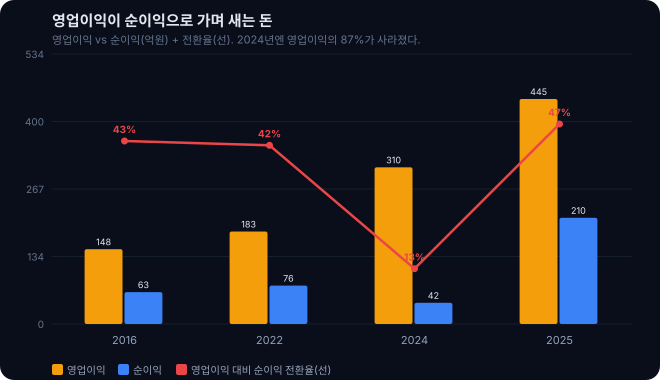
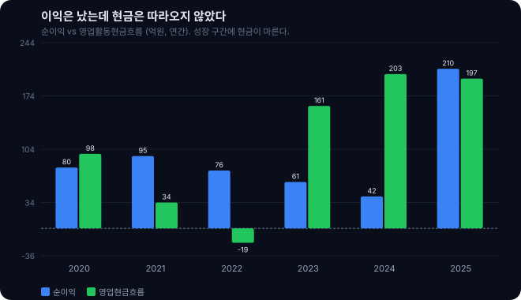
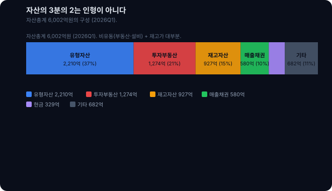
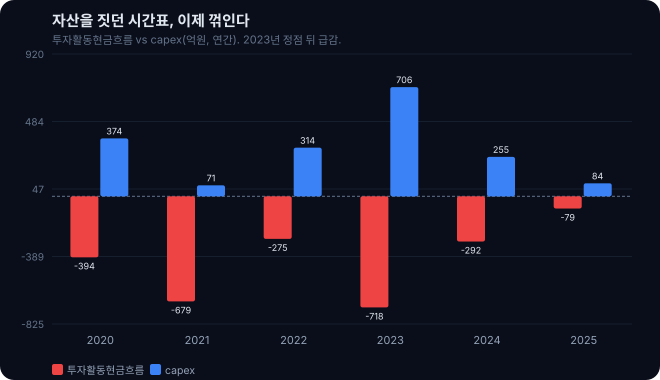
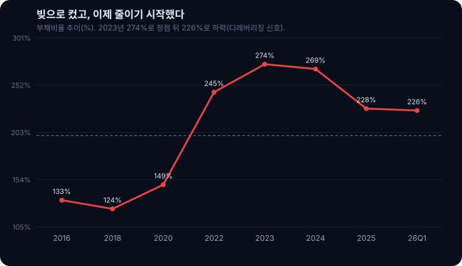

<script>
	import CompanyFinancials from '$lib/components/blog/CompanyFinancials.svelte';
</script>

2016년 오로라월드의 순이익은 63억원이었다. 그해 매출은 1,434억원. 8년이 지난 2024년, 매출은 2,757억원으로 거의 두 배가 됐는데 순이익은 42억원으로 오히려 줄었다. 매출을 두 배로 키운 회사가 어떻게 더 적게 남길 수 있을까. 이 한 줄의 모순이 이 글의 출발점이다.

그런데 시장은 정반대로 움직였다. 2025년 오로라월드 주가는 1년 사이 약 5,000원에서 22,000원 부근까지, 4배 넘게 올랐다(52주 범위 5,150원~21,950원, 외부 시세 기준). 봉제인형 회사에 무슨 일이 있었길래 실적표의 순이익은 흔들리는데 주가는 폭발했을까.

답은 손익계산서의 윗줄과 아랫줄, 그리고 재무상태표 사이의 거리에 있다. 결론부터 말하면 오로라의 성장은 진짜다. 캐릭터는 실제로 더 잘 팔리고 있고, 마진도 올라왔다. 다만 그 성장이 통장의 현금이 되기까지 두 번 걸러진다. 한 번은 영업이익이 순이익으로 내려오는 길목에서, 또 한 번은 순이익이 현금으로 바뀌는 길목에서. 이 글은 그 두 개의 누수를 하나씩 열어본다. 그리고 그 끝에서, 오로라 같은 성장주를 볼 때 매출과 영업이익률이 아니라 무엇을 봐야 하는지 한 문장으로 남긴다.

이 글의 모든 숫자는 dartlab로 오로라월드의 DART 공시를 직접 읽어 뽑았다. 회사 하나를 이렇게 세 개의 표로 부르는 것에서 시작한다.

```python
import dartlab
c = dartlab.Company("039830")  # 오로라월드
c.select("IS", freq="Q")       # 분기 손익계산서
c.select("BS", freq="Q")       # 분기 재무상태표
c.select("CF", freq="Q")       # 분기 현금흐름표
```

## 오로라월드는 무엇을 파는 회사인가

먼저 회사를 짧게 세운다. 오로라월드(구 상호 '오로라')는 봉제완구와 캐릭터 IP를 만드는 회사다. 자체 캐릭터 브랜드 'YooHoo & Friends'와 'Palm Pals' 같은 봉제 완구 라인을 보유하고, 국내보다 해외 매출 비중이 큰 수출 중심 기업이다(브랜드·수출 구조는 외부 공개 정보 기준). KOSDAQ 상장사이고, 시가총액은 2025년 말 기준 2,300억원대다. 최근의 실적 반등을 이끈 것은 미국 법인의 성장으로 알려져 있는데, 이 부분은 회사가 재무제표에 지역별로 명시하지 않아 외부 자료에 의존한다.

봉제인형은 흔한 물건이지만, 오로라의 손익 구조는 흔하지 않다. 2025년 매출총이익률이 55.7%였다. 매출 100원을 팔면 원가를 뺀 55.7원이 남는다는 뜻이다. 이건 단순 인형 제조로는 나오지 않는 숫자다. 원단과 솜을 꿰매 파는 사업이라면 원가율이 훨씬 높아야 정상이다. 55%가 넘는 매출총이익률은, 오로라가 파는 것이 봉제 원단이 아니라 아이가 이름을 기억하는 캐릭터라는 뜻이다. 캐릭터라는 무형의 IP가 원가 위에 얹히고, 그 위에 브랜드 프리미엄이 붙어야 만들어지는 마진이다. 수출로 큰 소비재라는 점에서는 [삼양식품](/blog/003230-samyang-foods)이나 [오리온](/blog/271560-orion) 같은 브랜드 회사와 결이 비슷하다.

이 마진 구조를 머리에 넣어두면 뒤가 이해된다. 캐릭터가 잘 팔리면 매출총이익률이 높으니 성장의 초입은 화려하다. 그런데 캐릭터를 팔려면 그 캐릭터를 담은 인형을 미리 대량으로 만들어 창고에 쌓아둬야 하고(재고), 그 인형을 만들 공장과 유통을 위한 시설이 필요하며(유형자산), 해외에서 팔면 대금이 들어오기까지 시간이 걸린다(매출채권). 고마진 IP 사업이라는 얼굴 뒤에, 사실은 자본이 무겁게 묶이는 제조·수출 사업이 함께 있는 것이다. 오로라의 이야기는 이 두 얼굴이 어떻게 어긋나는지에 대한 이야기다. 손익계산서의 화려함이 순이익과 현금까지 그대로 내려오느냐, 바로 그 지점에서 오로라는 두 번 샌다.

## 손익계산서만 보면 완벽한 성장주다

윗줄부터 보자. 매출은 2016년 1,434억원에서 2025년 3,281억원으로 2.3배가 됐다. 9년에 걸친 완만한 성장으로 보이지만, 그 안을 나눠 보면 최근 4년의 기울기가 유독 가파르다. 2016년부터 2020년까지 매출은 1,434억에서 1,416억으로 사실상 제자리였다. 5년 동안 거의 크지 않았다는 뜻이다. 그런데 2021년 1,781억을 기점으로 그래프가 꺾여 올라간다. 2022년 2,317억, 2024년 2,757억, 2025년 3,281억. 2021년부터 2025년까지 4년 만에 1.84배, 연 16.5%씩 커졌다. 정체된 회사가 성장 회사로 바뀐 변곡점이 2021년 언저리에 있다.

가속은 지금도 진행 중이다. 2026년 1분기 매출은 975억원으로, 분기 기준 사상 최대다. 전년 동기(2025년 1분기 797억원)보다 22% 더 컸다. 성장은 식기는커녕 오히려 빨라졌다. 봉제완구는 계절을 타는 사업이라(연말·홀리데이 시즌이 성수기다) 분기별 매출에 리듬이 있는데, 그 리듬을 감안해도 2026년의 출발은 이례적으로 높다.

마진도 같이 올라왔다. 영업이익률은 2020~2021년 코로나 국면의 6%대에서 2025년 13.6%로 두 배가 됐다. 2026년 1분기에는 14.6%까지 찍었다. 더 근본적인 변화는 매출총이익률에서 나타난다. 2021년 44.4%였던 매출총이익률이 2023년 53.0%, 2025년 55.7%로 11%포인트 넘게 뛰었다. 이 개선은 단순히 많이 팔아서가 아니다. 매출이 커지는 과정에서 원가율이 낮은 자체 브랜드·고부가 라인의 비중이 올라갔다고 보는 것이 자연스럽다. 여기에 매출이 판관비보다 빠르게 늘면서 영업 단계의 이익률이 한 번 더 개선됐다. 캐릭터가 팔릴수록 마진이 좋아지는, 성장주가 보여줘야 할 전형적인 레버리지가 손익계산서 윗부분에서 작동한 것이다.

이 정도면 캐릭터·완구 업종에서 독보적이다. 같은 판을 쓰는 상장사와 붙여보면 격차가 선명하다. 아래는 dartlab로 뽑은 2026년 1분기 기준 세 회사 비교다.

| 회사 | 분기 매출 | 영업이익 | 영업이익률 | 부채비율 | dCR 등급 |
|---|---:|---:|---:|---:|---|
| **오로라월드 (039830)** | 975억 | 142억 | **14.6%** | 226% | dCR-B+ |
| 대원미디어 (048910) | 1,025억 | 19억 | 1.9% | 83% | dCR-BBB- |
| 손오공 (066910) | 384억 | -7억 | 적자 | 116% | dCR-BB- |

매출 규모는 대원미디어와 비슷한데, 영업이익은 오로라가 142억으로 대원(19억)의 7배가 넘는다. 손오공은 영업 적자다. 수익성만 놓고 보면 오로라는 이 판의 챔피언이다. dartlab의 peer 백분위에서도 오로라의 영업이익·순이익 순위는 세 회사 중 1위(백분위 1.0)로 나온다. 여기까지가 시장이 본 오로라다. 주가가 4배 오른 이유가 이 표의 왼쪽 세 칸에 다 있다.

그런데 표의 오른쪽 두 칸을 보자. 부채비율 226%는 대원미디어(83%)의 세 배에 가깝고, 신용 등급을 나타내는 dCR은 오로라가 B+로, 투자등급(BBB-)인 대원미디어보다 낮다. 매출도 비슷하고 오로라가 훨씬 더 잘 버는데, 재무 건전성 평가는 오히려 뒤진다. 수익성 1등이 재무 건전성은 꼴찌라는 이 역설이, 손익계산서만 보면 절대 보이지 않는 오로라의 다른 얼굴이다. 여기서부터가 이 글의 본론이다.

## 첫 번째 누수: 영업이익에서 순이익으로 가는 길

영업이익까지는 좋았다. 문제는 그다음이다. 영업이익이 순이익으로 내려오는 구간에서 오로라는 크게 샌다.



숫자로 보자. 2024년 오로라의 영업이익은 310억원이었다. 그런데 그해 순이익은 42억원. 영업이익의 87%가 순이익에 도달하기 전에 사라졌다. 손익계산서에서 영업이익 아래로는 금융손익, 기타손익, 법인세가 차례로 붙는데, 이 구간에서 268억원이 증발한 것이다. 2016년만 해도 영업이익 148억원 중 순이익이 63억원으로 43%가 남았는데, 2024년에는 남은 비율이 13%로 쪼그라들었다. 매출이 두 배가 되는 동안, 영업이익을 순이익으로 바꾸는 효율은 오히려 나빠졌다. 이 전환율은 dartlab에서 두 계정을 나란히 불러 바로 확인된다.

```python
# 영업이익이 순이익으로 얼마나 살아 내려오는가 (첫 번째 누수)
c.select("IS", ["영업이익", "당기순이익"], freq="Y")
# 2024: 영업이익 310억 -> 순이익 42억  (전환율 13%)
# 2025: 영업이익 445억 -> 순이익 210억 (전환율 47%)
```

무엇이 그 사이를 먹었을까. 가장 큰 몫은 이자다. 뒤에서 자세히 보겠지만 오로라는 성장의 상당 부분을 빚으로 조달했고, 부채총계가 4,000억원대에 이른다. 이 빚에 붙는 이자비용이 매 분기 영업이익을 갉는다. 여기에 수출 회사 특유의 변수가 더해진다. 오로라는 매출의 큰 부분을 해외에서 벌기 때문에, 달러·원 환율이 흔들리면 외화 자산·부채의 평가손익과 결제 환차손익이 순이익 아래에서 출렁인다. 영업 단계에서 아무리 잘 벌어도, 자본구조(이자)와 환율(외환손익)이라는 두 개의 문을 통과하고 나면 남는 게 확 줄어드는 구조다. 영업이익률이 개선되는 것과, 그 개선이 순이익까지 살아 내려오는 것은 별개의 문제라는 사실을 오로라가 보여준다.

2025년에는 이 누수가 눈에 띄게 나아졌다. 영업이익 445억원에 순이익 210억원으로, 전환율이 47%로 회복됐다. 순이익이 전년의 다섯 배로 튄 것이다. 이것이 2025년 주가 급등의 실질적 연료였다. 매출과 영업이익이 충분히 커지면서, 드디어 이익이 이자와 환율이라는 두 관문을 넉넉히 넘어설 만큼 두꺼워지기 시작한 첫 신호다. 다만 냉정하게 짚어둘 것이 있다. 이 회복은 영업의 개선만큼이나, 전년의 바닥(42억)이 워낙 낮았던 기저효과와 그해 환율·일회성 항목의 방향에도 함께 기댄다. 순이익이 2021년 95억, 2022년 76억, 2023년 61억, 2024년 42억, 2025년 210억으로 매년 이렇게 널을 뛴다는 사실 자체가, 오로라의 이익이 아직 안정적으로 '내 것'이 되지 못했다는 신호다.

이 첫 번째 누수의 교훈은 간단하다. 오로라를 볼 때 영업이익률만 보면 안 된다. 그 영업이익 중 몇 퍼센트가 순이익까지 살아 내려오는지, 즉 영업이익 대비 순이익 전환율을 같이 봐야 한다. 그 비율이 40%대에 자리 잡으면 이익의 질이 개선되는 것이고, 다시 그 아래로 내려간다면 매출과 영업이익이 아무리 좋아도 주주에게 돌아오는 몫은 얇아진다. 2025년의 47%가 우연한 반등인지 구조적 개선인지가, 오로라의 다음 장을 가르는 첫 번째 관문이다.

## 두 번째 누수: 순이익에서 현금으로 가는 길

순이익까지 왔다고 끝이 아니다. 장부상의 이익이 실제 통장의 현금으로 바뀌는 마지막 구간에서 오로라는 한 번 더 샌다. 이건 오히려 첫 번째 누수보다 더 구조적이다.



가장 극적인 장면은 가장 최근에 있다. 2026년 1분기, 오로라는 순이익 73억원을 냈다. 그런데 같은 분기 영업활동현금흐름은 마이너스 115만원, 사실상 0원이었다. 이익은 73억이 났는데, 그 분기에 영업으로 들어온 현금은 없었다는 뜻이다. 매출이 전년보다 22% 뛴 바로 그 분기에 현금이 증발한 것은 우연이 아니다.

돈이 어디로 갔는지는 재무상태표가 말해준다. 2026년 1분기 재고자산은 927억원으로, 1년 전(694억)보다 233억이 늘었다. 매출채권도 580억원까지 불었다. 이 둘의 메커니즘은 이렇다. 성장하는 회사가 더 많이 팔려면 그만큼 더 많이 만들어 창고에 미리 쌓아야 한다. 봉제완구는 주문에서 생산, 해외 배송까지 시간이 걸리기 때문에 성수기 판매를 대려면 몇 달 전부터 재고를 쌓아둬야 한다. 파는 만큼 외상(매출채권)도 늘어난다. 결국 매출이 뛸수록 재고와 매출채권이라는 운전자본이 현금을 빨아들인다. 이익은 손익계산서에 찍히지만, 그 돈은 창고의 인형과 거래처의 외상으로 묶여 통장에는 없다. 회계 이익과 현금의 시차가 벌어지는 것이다. 매출채권 580억원을 분기 매출(975억)로 나누면 약 54일치다. 판 물건의 대금이 평균 두 달 가까이 뒤에 들어온다는 뜻이고, 그동안 회사는 그만큼의 현금을 스스로 메워야 한다. 재고 233일에 이 매출채권 54일을 더하면, 원재료가 인형이 되어 팔리고 그 대금이 통장에 꽂히기까지의 시간이 얼마나 긴지가 드러난다.

이건 2026년만의 일이 아니다. 연도별로 순이익과 영업현금흐름을 나란히 놓으면 패턴이 보인다.

| 연도 | 매출 | 영업이익 | 순이익 | 영업현금흐름 | 영업CF/순이익 |
|---|---:|---:|---:|---:|---:|
| 2020 | 1,416억 | 88억 | 80억 | 98억 | 1.22 |
| 2021 | 1,781억 | 106억 | 95억 | 34억 | 0.36 |
| 2022 | 2,317억 | 183억 | 76억 | **-19억** | -0.24 |
| 2023 | 2,326억 | 284억 | 61억 | 161억 | 2.66 |
| 2024 | 2,757억 | 310억 | 42억 | 203억 | 4.87 |
| 2025 | 3,281억 | 445억 | 210억 | 197억 | 0.94 |

2021년과 2022년을 보라. 매출이 1,781억에서 2,317억으로 가장 빠르게 뛰던 바로 그 2년 동안, 영업현금흐름은 34억으로 쪼그라들었다가 2022년에는 마이너스 19억으로 돌아섰다. 회사가 가장 빠르게 성장할 때 현금은 가장 말랐다. 2022년을 분기로 쪼개보면 상반기(1분기 -50억, 2분기 -26억)에 현금이 집중적으로 빠졌는데, 이 시기가 바로 재고를 공격적으로 채우던 국면이다. 반대로 성장이 잠시 안정된 2023~2024년에는 영업현금흐름이 161억, 203억으로 회복됐다. 이때 비율이 1을 크게 넘는 것은 현금창출이 특별히 좋아서라기보다 순이익 자체가 이자에 눌려 낮았던 탓이 크다. 그리고 다시 매출이 튀는 2026년 1분기, 현금은 또 0으로 돌아왔다.

정리하면 오로라의 영업현금흐름은 성장과 반대로 움직인다. 빠르게 클 때 마르고, 숨 고를 때 채워진다. 이 톱니 같은 패턴은 운전자본이 큰 제조·수출 성장기업의 전형이지만, 투자자 입장에서는 성가신 성질이다. 좋은 실적 뉴스가 나온 분기에 오히려 현금이 비어 보일 수 있기 때문이다. dartlab의 신용 스코어카드(dCR)에서 오로라의 7개 축 중 현금흐름 축 점수가 17.5로 가장 낮게 나오는 것도 이 때문이다. 채무상환능력(56.5)이나 자본구조(70.5)는 중간은 가는데, 현금흐름만 유독 바닥이다. 사람이 아니라 기계가 매긴 점수도 같은 곳을 가리킨다.

아래 표는 오로라의 최근 분기·연간 재무를 dartlab 데이터에서 직접 불러온 것이다. 분기 손익의 리듬과 재무상태표의 무게를 함께 볼 수 있다.

<CompanyFinancials code="039830" />

## 자산의 3분의 2는 인형이 아니다

두 번째 누수를 이해하려면 마지막 질문에 답해야 한다. 순이익도 얇고 영업현금흐름도 자주 마르는 회사가, 어떻게 자산을 6,000억원까지 불렸을까. 답을 보면 오로라의 진짜 정체가 드러난다.



2026년 1분기 오로라의 자산총계는 6,002억원이다. 이 중 유동자산(현금·재고·매출채권 등)은 2,066억원뿐이고, 비유동자산이 3,936억원으로 전체의 66%를 차지한다. 봉제완구 회사의 자산 3분의 2가 당장 팔거나 굴리는 자산이 아니라 장기 고정자산이라는 뜻이다. 이 비유동자산은 10년 전 1,109억원에서 3.5배로 불었다. 성장의 상당 부분이 매출이 아니라 자산의 몸집을 키우는 데 쓰였다는 신호다. 그 안을 열어보면, 계정 단위로도 dartlab에서 바로 확인된다.

```python
# 자산의 구성: 무엇에 자본이 묶였나
c.select("BS", ["유형자산", "투자부동산", "재고자산"], freq="Q")
# 2026Q1: 유형자산 2,210억 + 투자부동산 1,274억 + 재고 927억
```

| 비유동자산 구성 (2026년 1분기) | 금액 |
|---|---:|
| 유형자산 (토지·건물·설비) | 2,210억 |
| 투자부동산 | 1,274억 |
| 사용권자산·장기금융자산·기타 | 약 450억 |
| **비유동자산 합계** | **3,936억** |

핵심은 투자부동산 1,274억원이다. 투자부동산은 회계상 특별한 지위를 가진다. 회사가 영업에 직접 쓰는 공장·사무실(유형자산)과 달리, 임대수익이나 시세차익을 노리고 보유하는 부동산이 투자부동산으로 분류된다. 즉 오로라는 장난감을 파는 데 꼭 필요하지 않은 부동산을, 자산으로 보유하기 위해 들고 있는 것이다. 오로라는 장난감을 팔아 번 돈의 상당 부분을 이런 부동산으로 바꿔 쌓아왔다. 이 투자부동산 1,274억원은 이 회사 시가총액(약 2,300억원)의 절반이 넘는다. 여기에 영업용 유형자산 2,210억원까지 더하면 부동산성 자산만 3,484억원, 시가총액의 1.5배다.

이 사실은 양면을 가진다. 한쪽 면은 숨은 자산이다. 부동산은 보통 취득 원가로 장부에 남기 때문에, 오래 보유한 부동산의 실제 시세는 장부가보다 높을 수 있다. 임대수익이라는 별도의 현금원이 있고, 언젠가 팔면 큰 현금이 한 번에 들어온다. 실제로 시장이 오로라를 볼 때, 시가총액을 넘는 부동산 자산은 하방을 받쳐주는 안전판으로 읽힐 수 있다. 손익이 흔들려도 자산이 든든하니 크게 무너지지 않는다는 논리다.

다른 쪽 면은 닻이다. 그 많은 자본이 부동산에 묶여 있는 동안, 그것은 장난감 사업의 성장에 쓰이지 못한 돈이다. 캐릭터 하나를 더 키우거나 미국 유통을 넓히는 데 쓸 수 있었던 자본이 건물로 잠겨 있는 것이다. 게다가 그 부동산과 재고를 채우느라 회사는 빚을 냈고, 그 빚의 이자가 앞서 본 첫 번째 누수를 만들었다. 자산은 늘었지만, 그 자산이 스스로 충분한 현금을 벌어 이자를 감당하고 성장에 재투자되는 선순환까지는 아직 증명되지 않았다.

어느 쪽으로 읽든, 한 가지는 분명하다. 오로라를 '가벼운 IP 성장주'로 보면 틀린다. 이 회사는 매출의 대부분을 캐릭터에서 벌지만, 자산의 대부분은 부동산과 재고에 담겨 있다. 손익계산서는 캐릭터 회사를 그리고, 재무상태표는 자산이 무거운 회사를 그린다. 브랜드로 벌어 유형자산과 부동산에 쌓는다는 점에서는 [아모레퍼시픽](/blog/090430-amorepacific)이나 [대상](/blog/001680-daesang) 같은 전통 소비재 회사와도 겹치는 구석이 있다. 이 두 그림이 다르다는 것, 그것이 오로라를 단순한 성장주로 값 매기기 어렵게 만드는 지점이다.

## 돈은 어디로 갔나: 자산을 지은 시간표

앞의 두 누수와 무거운 재무상태표는 따로 노는 이야기가 아니다. 현금흐름표의 투자활동을 연도별로 늘어놓으면, 오로라가 지난 6년 동안 무엇을 했는지 한눈에 보인다.



| 연도 | 투자활동현금흐름 | 유형자산 취득(capex) | 재무활동현금흐름 |
|---|---:|---:|---:|
| 2020 | -394억 | 374억 | +257억 |
| 2021 | -679억 | 71억 | +721억 |
| 2022 | -275억 | 314억 | +522억 |
| 2023 | -718억 | 706억 | +508억 |
| 2024 | -292억 | 255억 | +73억 |
| 2025 | -79억 | 84억 | -47억 |

2020년부터 2023년까지, 오로라는 매년 300억에서 700억원을 투자활동에 쏟아부었다. 2023년에는 유형자산 취득에만 706억원을 썼다. 그해 매출(2,326억)의 3분의 1에 가까운 돈을 공장·건물·설비에 투자한 것이다. 2021년에는 유형자산 취득은 71억으로 적었지만 투자활동 전체로는 679억이 빠졌는데, 2분기에만 592억원이 유형자산이 아닌 다른 투자로 나갔다. 같은 분기 재무활동으로 575억원을 조달한 것과 짝을 이룬다. 즉 2021년 2분기에 큰돈을 끌어와 큰 투자를 집행한 것이 이 회사의 성장 시동 장면이다.

이 4년의 투자가 앞서 본 비유동자산 3,936억원의 정체다. 장난감을 팔아 번 돈만으로는 부족하니, 재무활동으로 매년 500~720억원을 빌리거나 조달해 그 재원을 자산에 부었다. 성장의 몸집을 빚과 증자로 지은 것이다. 부채가 3.8배로 불어난 것도, 첫 번째 누수인 이자 부담이 커진 것도, 모두 이 시간표에서 나온 결과다.

그런데 표의 아래 두 줄이 중요하다. 2024년부터 투자의 강도가 확 꺾인다. 유형자산 취득은 2023년 706억에서 2024년 255억, 2025년 84억으로 줄었다. 투자활동현금흐름 전체도 -718억에서 -79억으로 급감했다. 그리고 2025년, 재무활동현금흐름이 처음으로 마이너스(-47억)로 돌아섰다. 돈을 빌려 자산을 짓던 회사가, 이제 오히려 빚을 갚기 시작했다는 뜻이다.

이것은 이 글에서 가장 희망적인 신호다. 무거운 투자 사이클이 대체로 끝나가고 있다면, 앞으로 벌어들이는 영업현금흐름은 더 이상 대규모 capex에 먹히지 않고 부채 상환과 잉여현금으로 남을 여지가 생긴다. 두 번째 누수(현금)의 한 축인 대규모 투자 지출이 잦아드는 국면인 것이다. 이 구도는 몇 년간의 대규모 투자를 끝내고 부채를 줄이며 이익의 질을 되찾은 [두산에너빌리티](/blog/034020-doosan-enerbility)의 궤적과도 닮았다. 물론 이것은 지금까지의 흐름이고, 회사가 다시 대형 투자를 결정하면 언제든 바뀔 수 있다. 다만 자산을 다 지은 회사가 그 자산으로 현금을 회수하는 단계로 넘어가는 중이라면, 오로라의 다음 몇 년은 지난 몇 년과 질적으로 다를 수 있다.

## 성장의 연료는 빚이었고, 유동성은 빠듯하다

부동산과 재고를 채우는 데 쓴 돈은 어디서 났을까. 상당 부분이 빚이다. 그리고 이 빚이 앞서 본 첫 번째 누수(영업이익에서 순이익으로 가는 이자 손실)의 근원이다. 두 누수는 사실 하나의 뿌리에서 나온다.



부채총계는 2016년 1분기 1,087억원에서 2026년 1분기 4,159억원으로 3.8배가 됐다. 같은 기간 지배주주지분(자본)은 878억원에서 1,843억원으로 2.1배 늘었다. 자본보다 빚이 훨씬 빠르게 불었다는 뜻이고, 그 결과 부채비율은 2016년 124%에서 2023년 274%까지 치솟았다. 다만 앞 장에서 본 투자 사이클의 마무리와 함께, 부채비율은 2026년 1분기 226%로 내려왔다. 여전히 캐릭터·완구 피어인 대원미디어(83%)의 세 배에 가깝지만, 방향은 개선 쪽으로 틀었다. 성장기 회사가 미래 매출을 위해 설비·재고·부동산에 선투자하고 그 재원을 빌려오는 것 자체는 정상적인 전략이다. 문제는 그 빚의 비용이 지금 손익계산서에 매 분기 청구되고 있다는 점이다. 부채 4,000억원대에 붙는 이자가, 영업이익 310억원을 순이익 42억원으로 깎은 주범이다. 성장의 연료로 빌린 돈이, 성장의 과실을 먹는 구조다.

더 눈여겨볼 것은 단기 유동성이다. 2026년 1분기 유동자산은 2,066억원인데 유동부채는 3,095억원이다. 1년 안에 갚아야 할 부채가, 1년 안에 현금화할 수 있는 자산보다 1,000억원 넘게 많다. 유동비율로는 0.67로, 통상 안전선으로 보는 1을 밑돈다. 유동자산 안에서도 현금은 329억원뿐이고 나머지는 재고(927억)와 매출채권(580억)에 묶여 있다. 앞서 본 대로 이 재고와 매출채권은 성장할 때 오히려 늘어나 현금화가 더뎌지는 자산이다. 즉 오로라는 단기 상환 부담을 재고와 외상, 그리고 새로운 차입으로 굴려가고 있는 셈이다. 이것이 위험 신호냐 하면, 반드시 그렇지는 않다. 부동산이라는 큰 담보 자산이 있고 은행과의 관계가 안정적이면 이런 구조도 굴러간다. 다만 성장이 멈추거나 자금 시장이 경색되는 국면에서는 이 빠듯한 유동성이 약한 고리가 될 수 있다.

배당을 보면 이 회사가 지금 어디에 서 있는지 더 분명해진다. 오로라는 최근 10년간 사실상 배당을 하지 않았다(현금흐름표상 배당금지급이 거의 모든 분기에 0이다). 번 돈을 주주에게 나눠주는 대신 전부 재고·부동산·부채 상환에 돌렸다는 뜻이다. 성장에 모든 것을 재투자하는 회사의 전형이지만, 뒤집어 보면 아직 주주가 현금으로 회수한 것은 없다는 뜻이기도 하다. 주가 4배는 시장의 기대이고, 배당 0은 회사의 현실이다. 이 간극이 좁혀지려면, 성장이 마침내 잉여현금을 만들어 배당이든 부채 감축이든 눈에 보이는 형태로 주주에게 돌아와야 한다.

## 그래서 무엇을 봐야 하나

이제 처음 질문으로 돌아가자. 매출이 두 배가 되는 동안 순이익이 63억(2016)에서 42억(2024)으로 줄어든 이유는, 이제 분명하다. 잘 팔았지만, 번 돈이 이자와 운전자본과 부동산이라는 관문을 지나면서 새어나갔기 때문이다. 그리고 2025년에 순이익이 210억으로 튄 것은, 매출이 충분히 커지면서 영업이익이 이자를 넘어설 만큼 두꺼워진 첫 신호다. 주가 4배는 이 반전이 계속된다는 데 건 값이다.

그렇다면 이 베팅이 옳았는지는 무엇으로 확인할까. 오로라의 다음 장은 손익계산서 윗줄이 아니라, 그 이익이 순이익과 현금으로 얼마나 새지 않고 도착하느냐에서 갈린다. 다음 분기 공시에서 이 다섯 개를 순서대로 보면 된다.

1. **영업이익 대비 순이익 전환율.** 2024년 13%에서 2025년 47%로 올라왔다. 이게 50%를 넘어 자리 잡으면 이자를 이긴 것이고, 다시 40% 아래로 빠지면 성장의 과실이 여전히 이자에 먹히는 것이다. 첫 번째 누수가 막혔는지를 보는 자리다.
2. **영업현금흐름 대비 순이익(현금전환).** 성장하는 분기에도 이 비율이 1에 붙어 있으면, 오로라가 드디어 성장과 현금창출을 동시에 해내는 것이다. 또 0이나 마이너스로 떨어지면 운전자본이 여전히 현금을 삼키는 것이다. 두 번째 누수가 막혔는지를 보는 자리다.
3. **재고회전.** 2026년 1분기 재고는 927억원, 회전일수로 약 233일이다. 이 숫자가 줄어들면 파는 속도가 쌓는 속도를 앞선 것이고, 더 늘면 창고에 자본이 더 묶이는 것이다.
4. **부채비율과 유동비율.** 부채비율 226%가 더 꺾이고 유동비율이 1에 가까워지면 성장이 자기 힘으로 돌기 시작한 것이고, 다시 악화되면 성장을 여전히 빚으로 사는 것이다.
5. **투자부동산의 역할.** 1,274억원의 부동산이 임대수익이나 매각으로 실제 현금을 만들어내는지, 아니면 장부에만 있는 닻으로 남는지. 숨은 자산이 진짜 자산이 되는 순간이 있다면 그것도 이 항목에서 확인된다.

오로라월드는 좋은 회사다. 캐릭터라는 고마진 자산을 쥐고 있고, 미국이라는 큰 시장에서 실제로 더 많이 팔고 있으며, 부동산이라는 든든한 자산 backing도 있다. 게다가 자산을 짓느라 빚을 늘리던 국면이 지나가고, 이제 그 빚을 줄이기 시작했다. 다만 이 글이 처음부터 끝까지 붙들고 온 한 문장은 이것이다. 오로라의 성장은 손익계산서 윗줄에서 시작해 순이익과 현금이라는 두 개의 관문을 지나야 완성되고, 그 두 관문에서 이자와 재고와 부동산이 지금도 조금씩 새고 있다. 그래서 이 회사는 '얼마나 잘 파느냐'가 아니라, '번 돈이 통장에 얼마나 도착하느냐'로 봐야 한다. 매출과 영업이익률은 이미 좋다. 다음에 증명해야 할 것은 그 이익이 현금이 된다는 것, 오직 그것 하나다. 그 증명이 시작되는 곳이 다음 분기의 현금흐름표다.

## 검증표

본문의 모든 수치는 dartlab로 오로라월드(039830)의 DART 공시를 직접 읽어 계산했다. 단위는 억원, 연간 값은 4개 분기 합산, 비율은 해당 기간 기준이다.

| 항목 | 값 | 출처 |
|---|---|---|
| 매출 (2016 / 2020 / 2025) | 1,434억 / 1,416억 / 3,281억 | dartlab panel IS, 분기 합산 |
| 매출 (2026년 1분기) | 975억 (전년 동기 797억, +22%) | dartlab panel IS |
| 영업이익률 (2021 / 2025 / 2026Q1) | 6.0% / 13.6% / 14.6% | dartlab panel IS |
| 매출총이익률 (2021 / 2023 / 2025) | 44.4% / 53.0% / 55.7% | dartlab panel IS |
| 순이익 (2016 / 2024 / 2025) | 63억 / 42억 / 210억 | dartlab panel IS, 분기 합산 |
| 영업이익 (2024 / 2025) | 310억 / 445억 | dartlab panel IS, 분기 합산 |
| 영업이익 대비 순이익 전환율 (2016 / 2024 / 2025) | 43% / 13% / 47% | 순이익 ÷ 영업이익 |
| 영업현금흐름 (2022 / 2024 / 2025) | -19억 / 203억 / 197억 | dartlab panel CF, 분기 합산 |
| 영업현금흐름 (2026년 1분기) | 약 0원 (-115만원), 순이익 73억 | dartlab panel CF·IS |
| 자산총계 / 비유동자산 (2026Q1) | 6,002억 / 3,936억 (66%) | dartlab panel BS |
| 유형자산 / 투자부동산 (2026Q1) | 2,210억 / 1,274억 | dartlab panel BS |
| 재고자산 / 재고회전일 (2026Q1) | 927억 / 약 233일 | dartlab panel BS, 2025년 매출원가 기준 |
| 유동자산 / 유동부채 / 유동비율 (2026Q1) | 2,066억 / 3,095억 / 0.67 | dartlab panel BS |
| 투자·capex (2023 / 2025) | 투자 -718억·capex 706억 / 투자 -79억·capex 84억 | dartlab panel CF |
| 부채비율 (2016 / 2023 / 2026Q1) | 124% / 274% / 226% | dartlab panel BS |
| dCR 신용등급 / 현금흐름 축 | dCR-B+ / 17.5 (7축 중 최저) | dartlab creditDcr |
| 피어 영업이익률 (오로라 / 대원미디어 / 손오공, 2026Q1) | 14.6% / 1.9% / 적자 | dartlab PeerCompareN |

외부 맥락(dartlab 미검증): 주가 52주 범위 약 5,150원~21,950원과 1년 4배 상승, 미국 법인 주도 성장, 자체 브랜드 'YooHoo & Friends'·'Palm Pals'는 외부 공개 정보 기준이다. 원문 공시는 [DART 전자공시시스템](https://dart.fss.or.kr)에서, 시세·컨센서스는 [Google Finance](https://www.google.com/finance/quote/039830:KOSDAQ), [Investing.com](https://kr.investing.com/equities/aurora-world-corp-earnings), [딥서치](https://invest.deepsearch.com/stock/039830/)에서 교차 확인할 수 있다. 시가총액(약 2,300억원)은 외부 시세 기준이며 시점에 따라 변한다.

이 글은 특정 종목의 매수·매도를 권유하지 않는다. 판단의 근거는 다음 분기 공시에 찍힐 순이익과 현금흐름의 숫자다. dartlab에서 직접 확인하려면 [터미널에서 039830을 열거나](https://eddmpython.github.io/dartlab/terminal?sym=039830) 아래처럼 부른다.

```python
import dartlab
c = dartlab.Company("039830")
c.select("CF", ["영업활동현금흐름", "투자활동현금흐름"], freq="Q")  # 두 번째 누수를 직접 확인
```
