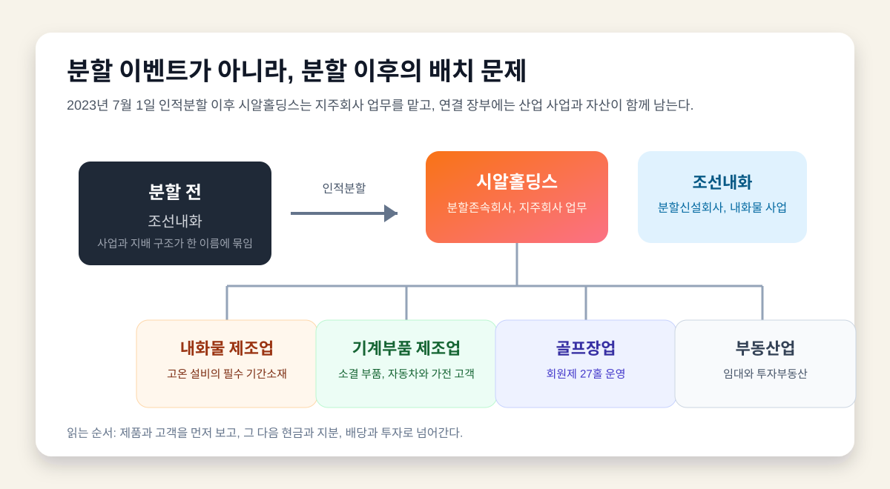
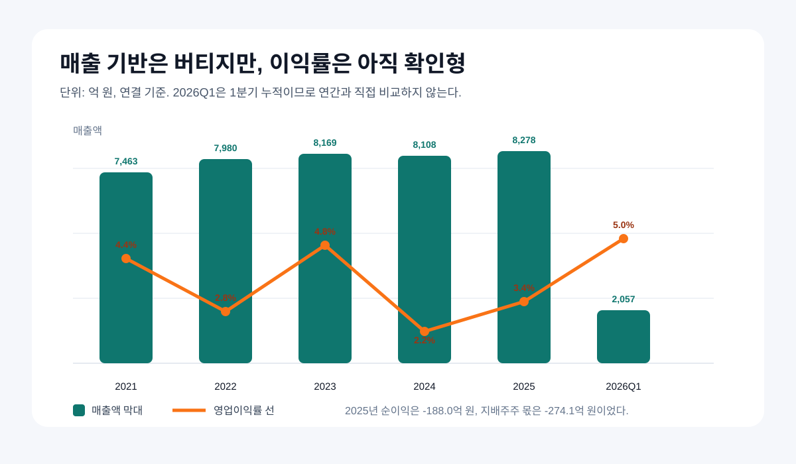
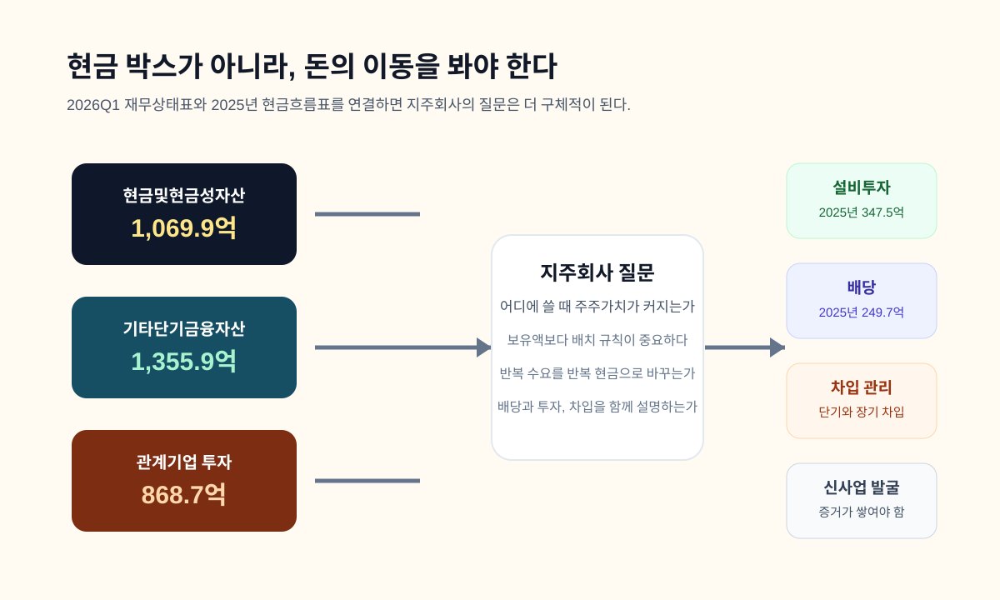
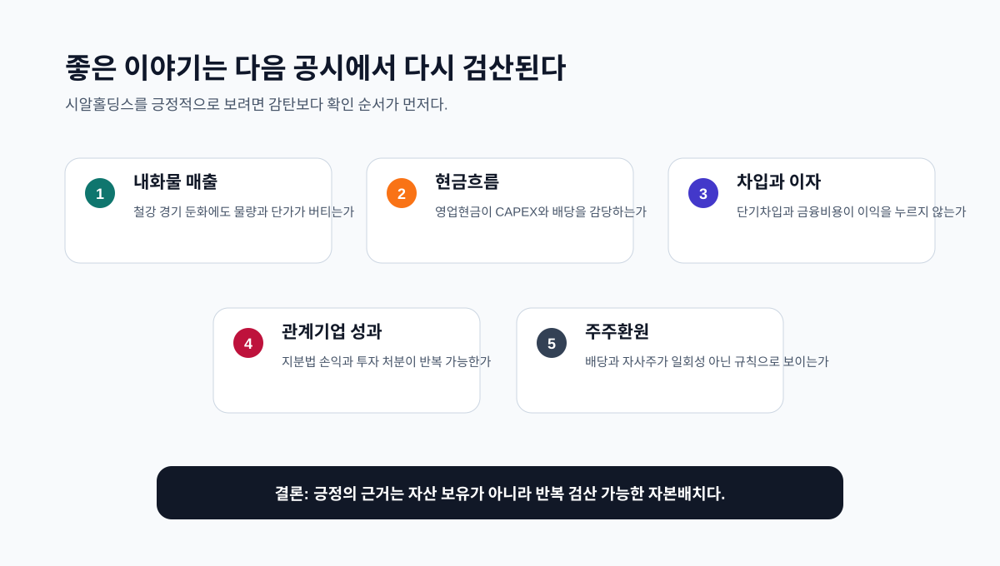

<script>
  import CompanyFinancials from '$lib/components/blog/CompanyFinancials.svelte';
</script>

> **데이터 기준**: 2026-07-09 dartlab 실측, 시알홀딩스(000480) 연결 재무제표(CFS)와 2026년 1분기 DART 사업보고 토픽 기준. DART 원문은 2026년 1분기보고서의 `II. 사업의 내용`, `주요 제품 및 서비스`, `매출 및 수주상황`을 중심으로 확인했다.
>
> **핵심 숫자**: 2025년 연결 매출 **8,277.5억 원**, 영업이익 **278.2억 원**, 순손실 **188.0억 원**. 2026년 1분기 연결 매출 **2,056.9억 원**, 영업이익 **102.0억 원**, 순이익 **80.2억 원**. 2026년 1분기 자산총계 **1조5,889.9억 원**, 현금및현금성자산 **1,069.9억 원**, 기타단기금융자산 **1,355.9억 원**.

## 프롤로그 - 분할 뒤에 남은 질문

시알홀딩스를 긍정적으로 보려면 먼저 이름부터 조금 느리게 읽어야 한다. 이 회사는 원래 조선내화라는 이름으로 더 익숙했다. 2023년 7월 1일을 분할기일로 인적분할을 했고, 사업회사 조선내화가 새로 생겼으며, 남은 회사는 시알홀딩스가 되어 지주회사 업무를 맡았다. 이 한 문장 때문에 시장은 보통 두 갈래로 나뉜다. 하나는 사업회사를 더 본다. 다른 하나는 남은 지주회사를 할인한다.

그 반응은 자연스럽다. 투자자는 공장과 제품이 보이는 회사를 더 편하게 이해한다. 지주회사는 늘 한 겹 더 돌아간다. 자회사 지분, 배당, 투자부동산, 금융자산, 차입, 비지배주주 몫, 관계기업 손익이 섞인다. 손익계산서 한 줄로는 잘 안 보인다. 그래서 지주회사는 대개 재미없고, 복잡하고, 할인받는 존재로 취급된다.

그런데 시알홀딩스는 그 할인에서 끝내기에는 조금 아깝다. 이유는 단순히 현금이 있어서가 아니다. 현금만 있으면 좋은 회사라는 말은 너무 쉽고 위험하다. 이 회사의 장부 안에는 내화물이라는 오래된 산업 소재가 있고, 자동차와 가전으로 이어지는 소결 부품이 있고, 골프장과 부동산도 있다. 무엇보다 내화물은 한 번 팔고 끝나는 유행 상품이 아니라, 뜨거운 공정이 돌아가는 동안 계속 교체되고 검증되는 기간소재다.

이 글의 관점은 약간 긍정형이다. 하지만 결론을 먼저 정하지 않는다. 시알홀딩스를 "숨은 현금 박스"라고 부르지 않는다. "지주회사 재평가가 명확하다"라고도 쓰지 않는다. 대신 이렇게 묻는다. **조선내화가 갈라진 뒤 남은 이 지주회사는 반복 수요를 가진 산업 장부 위에서 자본을 제대로 배치할 수 있는가.**


사진처럼 보이는 건 공장 안쪽의 내화벽이다. 내화물은 화려하지 않다. 소비자가 제품명을 외우지도 않는다. 하지만 제철, 제강, 시멘트, 유리 같은 고온 공정에서는 이런 재료가 멈추면 설비가 멈춘다. 기업 이야기에 좋은 소재는 꼭 신기술일 필요가 없다. 오히려 너무 평범해서 사람들이 지나치는 소재가 더 깊은 질문을 만든다.

시알홀딩스의 이야기도 그렇다. 이 회사는 새롭고 빠른 회사라기보다, 오래된 산업의 반복성을 지주회사 장부로 옮긴 회사다. 장점은 그 느림에 있고, 위험도 그 느림에 있다. 철강 경기가 나쁘면 내화물 수요도 눌린다. 고객 설비 가동률이 낮아지면 교체 속도도 둔해진다. 그러나 설비가 돌아가는 한 내화물은 완전히 사라지지 않는다. 이 애매하지만 단단한 문장이 이 글의 출발점이다.

## 기획 루프 - 먼저 의심한 뒤 긍정한다

이번 글은 일부러 긍정적으로 시작했다. 하지만 긍정형 글일수록 기획에서 더 많이 의심해야 한다. 긍정은 한 문장으로 쓰기 쉽다. "반복 수요가 있다", "현금이 많다", "자산이 크다", "지주회사라 재평가될 수 있다" 같은 말은 그럴듯하다. 그러나 그 말들은 혼자 있으면 투자 서사가 아니라 포장지가 된다.

그래서 기획 루프의 첫 질문은 이랬다. "시알홀딩스는 정말 사업이 있는 지주회사인가, 아니면 사업회사 분할 뒤 남은 할인 대상인가." 두 번째 질문은 더 날카로웠다. "내화물 반복 수요는 안정성의 근거인가, 아니면 철강 경기 의존도를 부드럽게 말한 것뿐인가." 세 번째 질문은 자본으로 갔다. "현금과 금융자산이 주주에게 돌아오는가, 아니면 장부 안에서만 좋은 숫자로 남는가."

초안은 지주회사 할인과 자사주 이야기에 너무 끌렸다. 그 길로 가면 글은 빨라진다. 분할, 지배구조, 할인, 재평가를 말하면 독자의 관심은 쉽게 붙는다. 그러나 그 길은 너무 흔하다. 그리고 너무 쉽게 과장된다. 시알홀딩스의 더 좋은 이야기는 자사주 마법이 아니라, **뜨거운 산업 소재와 차가운 자본배치가 같은 장부에서 만나는 장면**이다.

두 번째 루프에서 중심을 바꿨다. 내화물은 왜 반복 수요인가. 소결 부품은 왜 단순 기계부품보다 기술 설명이 필요한가. 2025년 순손실은 왜 긍정 서사의 걸림돌인가. 2026년 1분기 흑자는 어느 정도까지만 읽어야 하는가. 현금, 기타단기금융자산, 관계기업 투자, 유형자산 취득, 배당금 지급이 한 장의 자본배치 지도로 연결되는가.

마지막 루프의 결론은 이렇다. 시알홀딩스의 긍정 포인트는 "싸다"가 아니다. 현재 주가를 놓고 목표가를 말하는 글도 아니다. 그건 [기술적 분석이란 무엇인가](/blog/technical-analysis-foundations) 같은 투자이야기 카테고리에서 따로 해야 한다. 이 글은 기업이야기다. 주가가 아니라 사업 구조, 현금흐름, 장부의 배치 능력을 본다.

이 구분이 중요하다. 기업이야기는 회사의 정체를 묻는다. 투자이야기는 가격과 행동의 언어를 묻는다. 기술이야기는 특정 기술이 산업 사슬에서 어떤 병목을 만드는지 묻는다. 시알홀딩스는 이 셋 중 기업이야기다. 다만 기술이야기의 냄새가 있다. 내화물과 소결 부품은 기술 서사가 가능한 산업 소재이기 때문이다.

## 1막 - 내화물은 왜 식지 않는가

DART 2026년 1분기보고서의 사업의 개요는 시알홀딩스의 핵심 사업부문을 내화물 제조업, 기계부품 제조업, 골프장업, 부동산업 등으로 구분한다. 그중 가장 먼저 봐야 할 것은 내화물 제조업이다. 조선내화는 1947년 설립 이후 내화물 생산과 기술 개발을 해 온 국내 종합내화물 제조업체로 설명된다. 여기서 내화물은 고온에서 용해되지 않고 고열에 견디는 무기재료다.

이 정의는 평범하지만 강하다. 내화물은 제품명이 아니라 공정의 조건이다. 제철소의 용광로, 전기로, 래들, 가열로 같은 고온 설비는 안쪽에 내화재가 있어야 돌아간다. 뜨거운 쇳물과 슬래그, 열충격, 마모, 화학 반응을 버텨야 한다. 단순히 "벽돌"이라고 부르기에는 너무 중요한 벽돌이다. 벽이 무너지면 제품 불량이 아니라 조업 사고가 된다.

그래서 내화물 산업은 두 얼굴을 가진다. 하나는 경기 민감성이다. 공시도 내화물 매출이 중화학공업, 특히 제철과 제강 부문과 밀접하다고 말한다. 철강 경기와 고객 가동률이 나빠지면 내화물 수요도 영향을 받는다. 이건 숨길 수 없다. 다른 하나는 진입장벽이다. 수요처는 안정적인 조업을 위해 품질과 기술 검증을 요구한다. 후발업체가 가격만 낮춰 들어가기 쉽지 않다.

투자자가 좋아하는 말로 바꾸면 "반복 수요와 검증 장벽"이다. 그러나 여기서 멈추면 안 된다. 반복 수요는 구독 매출이 아니다. 고객이 매달 자동 결제하는 구조가 아니다. 철강 공정이 줄면 교체도 줄 수 있고, 원재료 가격이 움직이면 마진도 흔들린다. 그러니 내화물을 안정 산업이라고 말하려면 반드시 "철강 사이클 안에서"라는 단서를 붙여야 한다.

그래도 이 반복성은 무시하기 어렵다. 소비재 유행은 사라질 수 있다. 플랫폼 트래픽도 옮겨갈 수 있다. 그러나 고온 공정은 물리 법칙을 바꾸지 못한다. 쇳물을 다루는 설비는 여전히 뜨겁고, 그 안쪽은 여전히 버텨야 한다. 시알홀딩스의 긍정적 내러티브는 바로 이 지점에서 시작한다. 너무 빠르지도, 너무 새롭지도 않지만, 산업이 계속 돌아가는 동안 필요성이 사라지기 어려운 소재.

이 관점은 [HBM은 왜 쌓을까](/blog/hbm-stack-packaging-test)에서 다룬 공정 소재와도 닮았다. HBM 글의 핵심은 칩 하나가 아니라 쌓고 붙이고 검사하는 공정의 병목이었다. 내화물도 마찬가지다. 화려한 최종재가 아니라 공정이 멈추지 않게 하는 뒤쪽 소재다. 돈은 때로 완제품보다 공정을 지키는 부품과 소재에서 조용히 생긴다.

## 2막 - 반복 수요의 숫자

DART 주요 제품 및 서비스 표를 보면 2026년 1분기 시알홀딩스 연결 매출 2,056.9억 원 안에서 내화물 제조업 합계는 내부거래 제거 전 기준 1,550.97억 원으로 표시된다. 정형 내화물, 부정형 내화물, 기타 내화물, 상품과 기타 매출이 포함된다. 같은 표에서 기계부품 제조업 합계는 587.01억 원이다. 내부거래 288.59억 원이 제거되며 총계가 2,056.93억 원으로 내려온다.

이 숫자를 너무 정밀한 가치평가로 쓰면 안 된다. 공시 표의 사업부문 매출은 내부거래 제거 전후가 섞여 있고, 연결 기준에서 회사별 귀속을 다시 봐야 한다. 그러나 방향은 선명하다. 시알홀딩스의 장부는 빈 지주사가 아니다. 내화물과 기계부품이 매출을 만들고, 골프장과 부동산이 작은 비중으로 들어오며, 기타 사업과 내부거래 조정이 붙는다.

2025년 전체 연결 매출은 8,277.5억 원이다. 2024년 8,108.3억 원, 2023년 8,169.0억 원, 2022년 7,980.4억 원과 비교하면 매출 규모는 크게 무너지지 않았다. 이 점은 긍정적으로 볼 수 있다. 사업이 폭발적으로 성장했다는 말은 아니다. 하지만 분할 이후에도 연결 장부가 일정 규모의 산업 매출을 유지하고 있다는 사실은 중요하다.

다만 이익률은 얌전하지 않다. 2025년 영업이익은 278.2억 원, 영업이익률은 3.4%다. 2024년은 2.2%, 2023년은 4.8%, 2022년은 2.8%, 2021년은 4.4%였다. 2026년 1분기는 5.0%로 좋아 보이지만 한 분기만으로 연간을 확정할 수 없다. 숫자는 "버틴다"와 "높은 수익성이다" 사이에서 정확히 멈춘다. 시알홀딩스는 고마진 소프트웨어 회사가 아니다. 낮은 마진의 산업 장부 위에 자산과 지분을 얹은 회사다.



이 구조도에서 가장 중요한 것은 화살표의 방향이다. 투자자는 분할 전 조선내화라는 이름에서 출발하지만, 분할 뒤에는 시알홀딩스와 조선내화, 그리고 연결 사업부를 나눠 봐야 한다. 이름 하나로 이해하면 헷갈린다. 사업회사는 제품을 만들고, 지주회사는 지분과 자본을 배치한다. 연결 장부는 둘의 흔적을 함께 보여준다.

이때 긍정적 해석은 이렇게 정리된다. 시알홀딩스는 매출이 사라진 빈 지주사가 아니다. 연결 기준으로 내화물과 기계부품에서 반복 매출이 있고, 자산에는 현금, 금융자산, 관계기업 투자, 투자부동산이 있다. 반대로 부정적 해석도 함께 따라온다. 이 반복 매출은 높은 마진을 보장하지 않고, 연결 장부는 주주가 실제로 받을 몫을 흐리게 만들 수 있다.

좋은 기업 글은 이 두 문장을 동시에 붙들어야 한다. 하나만 쓰면 홍보가 되고, 다른 하나만 쓰면 회의론이 된다. 시알홀딩스는 그 사이에서 읽어야 한다. 그래서 이 글의 긍정형은 강한 매수 문장이 아니라, 긍정적 관찰을 검증 가능한 질문으로 바꾸는 방식이다.

## 3막 - 지주회사로 바뀌면 무엇이 달라지나

사업회사를 볼 때 투자자는 제품, 고객, 원가, CAPEX, 가동률, 마진을 본다. 지주회사를 볼 때는 질문이 바뀐다. 지분을 어떻게 들고 있는가. 자회사에서 받은 배당을 어떻게 쓰는가. 현금과 금융자산은 어느 정도인가. 차입은 어떤 만기로 쌓여 있는가. 투자부동산과 관계기업 투자는 수익을 내는가. 주주환원은 일회성인가, 규칙인가.

시알홀딩스는 이 질문이 모두 필요한 회사다. 2026년 1분기 자산총계는 1조5,889.9억 원이다. 현금및현금성자산은 1,069.9억 원, 기타단기금융자산은 1,355.9억 원이다. 둘을 단순 합산하면 2,425.8억 원이다. 이 숫자는 작지 않다. 하지만 이 숫자만 보고 "현금이 많으니 안전하다"고 말하면 바로 틀린다.

왜냐하면 연결 장부의 현금은 모두 지주회사 주주에게 자유롭게 배당 가능한 현금이 아니기 때문이다. 종속회사 운영자금, 운전자본, 차입 상환, 설비투자, 세금, 배당 정책, 비지배주주 몫이 있다. 게다가 2026년 1분기 부채총계는 7,640.7억 원이고, 자본총계는 8,249.2억 원이다. 부채비율은 약 92.6%다. 위험하다고 단정할 수준은 아니지만, 현금만 따로 떼어 안전판이라고 부르기도 어렵다.

여기서 지주회사 글의 핵심이 나온다. 시알홀딩스의 가치는 현금을 얼마나 갖고 있느냐가 아니라, 그 돈을 어디로 보내느냐에서 생긴다. 배당으로 나가면 주주환원이다. 설비투자로 들어가면 사업 경쟁력 유지다. 관계기업 투자로 들어가면 미래 지분 가치와 지분법 손익의 문제다. 차입 상환으로 들어가면 재무 안정성이다. 신사업으로 들어가면 증거가 필요하다.

이 자본배치 관점은 [포스코인터내셔널 기업이야기](/blog/047050-posco-international)에서 본 현금흐름 독법과도 연결된다. 연결 매출이 큰 회사는 손익계산서만 보면 놓치는 것이 많다. 현금이 실제로 들어왔는지, 운전자본이 어떻게 움직였는지, 투자와 차입이 어떤 속도로 바뀌었는지 같이 봐야 한다. 시알홀딩스도 매출보다 돈의 길이 더 중요해지는 순간이 있다.

그리고 이 대목에서 지주회사 할인도 다시 보인다. 지주회사가 할인받는 이유는 시장이 복잡함을 싫어해서만은 아니다. 돈이 어디로 흘러갈지 예측하기 어렵고, 주주에게 돌아오는 몫이 희석될 수 있고, 자산 가치가 장부에 있어도 실현 방식이 불명확하기 때문이다. 반대로 지주회사가 프리미엄을 받으려면 배치 규칙이 보여야 한다. 규칙 없는 현금은 숫자고, 규칙 있는 현금은 신뢰다.

## 4막 - 숫자는 아직 완성형이 아니라 확인형이다

긍정형으로 쓰기 위해 더 먼저 봐야 할 숫자가 있다. 2025년 순손실이다. 2025년 시알홀딩스 연결 매출은 8,277.5억 원이고 영업이익은 278.2억 원이었다. 그런데 당기순손실은 188.0억 원이었다. 지배주주지분 당기순손실은 274.1억 원이었다. 즉 영업으로는 흑자를 냈지만, 맨 밑줄과 지배주주 몫은 적자였다.

이 숫자는 글의 톤을 정직하게 만든다. 매출이 버틴다는 말과 순손실이 있었다는 말은 함께 있어야 한다. 영업이익률 3.4%도 높지 않다. 2025년 금융비용은 패널상 516.9억 원으로 잡힌다. 금융이익 181.5억 원을 넘어선다. 지주회사와 산업 장부가 섞인 회사에서 금융비용은 그냥 지나칠 수 없는 항목이다.

그러나 여기서도 너무 부정적으로만 읽으면 놓친다. 2026년 1분기에는 매출 2,056.9억 원, 영업이익 102.0억 원, 순이익 80.2억 원을 냈다. 한 분기 흑자 전환은 긍정적 신호다. 다만 한 분기만으로 추세 전환을 선언하진 않는다. 1분기와 연간은 다르고, 내화물과 기계부품은 고객 가동률과 수주, 원재료 가격에 따라 분기 변동이 생길 수 있다.

그래서 이 회사의 숫자는 완성형이 아니라 확인형이다. 이미 증명된 고수익 지주회사가 아니라, 증명해야 할 지주회사다. 이 표현이 중요하다. 증명해야 할 회사는 나쁜 회사가 아니다. 오히려 좋은 글감이다. 이미 모두가 아는 회사는 서사가 짧다. 아직 시장이 덜 이해했고, 숫자가 일부는 좋고 일부는 찜찜한 회사가 깊은 이야기를 만든다.



그래프의 메시지는 단순하다. 매출은 2021년 7,462.9억 원에서 2025년 8,277.5억 원까지 크게 무너지지 않았다. 그러나 영업이익률은 2%대에서 5% 사이를 오간다. 안정적 매출 기반과 낮은 수익성의 조합이다. 이 조합은 투자자가 좋아하기도 하고 싫어하기도 한다. 좋아하는 쪽은 하방의 반복성을 본다. 싫어하는 쪽은 낮은 수익률과 자본 효율을 본다.

시알홀딩스를 깊게 보려면 이 두 감정을 동시에 가져야 한다. 내화물이 식지 않는다고 해서 이익률이 자동으로 오른다는 뜻은 아니다. 현금이 있다고 해서 주가가 자동으로 재평가된다는 뜻도 아니다. 다만 이런 산업과 자산 구조가 지주회사 자본배치와 만나면, 느리지만 의미 있는 변화를 만들 수 있는 여지는 있다.

그 여지가 바로 약간 긍정형의 이유다. 큰 폭발은 아직 보이지 않는다. 하지만 장부가 텅 비어 있지 않고, 사업이 사라지지 않았고, 현금과 금융자산이 있으며, 배당과 설비투자와 관계기업 투자가 실제로 움직인다. 이 네 가지가 같은 방향으로 정렬될 때 이야기는 깊어진다.

## 5막 - 자본배치의 세 갈래

시알홀딩스의 자본배치는 세 갈래로 읽을 수 있다. 첫째는 사업 유지와 경쟁력이다. 2025년 유형자산 취득은 347.5억 원이다. 2024년 275.3억 원, 2023년 401.9억 원, 2022년 329.4억 원, 2021년 746.3억 원이었다. 내화물과 기계부품 같은 제조업은 설비와 품질 관리가 필요하다. CAPEX가 너무 적으면 경쟁력이 약해질 수 있고, 너무 많으면 현금흐름을 압박한다.

둘째는 주주환원이다. 2025년 배당금 지급은 249.7억 원이다. 2024년 307.8억 원, 2023년 176.3억 원, 2022년 187.8억 원, 2021년 169.2억 원이다. 배당은 지주회사 글에서 중요한 증거다. 말로는 주주가치를 말하기 쉽다. 실제 현금이 밖으로 나갔는지는 현금흐름표가 말한다. 다만 연결 기준 배당금 지급에는 종속회사와 비지배주주 관련 흐름이 섞일 수 있어 별도와 연결을 함께 봐야 한다.

셋째는 투자와 지분이다. 2026년 1분기 관계기업등지분관련투자자산은 868.7억 원이다. 2025년은 831.1억 원, 2024년은 1,397.1억 원이었다. 지분법 손익과 투자 처분, 추가 취득은 지주회사 성격을 강하게 만든다. 이 영역은 긍정과 위험이 동시에 있다. 잘하면 자본배치 능력이고, 못하면 복잡한 투자자산이다.


이 이미지는 일부러 공장과 책상을 같이 놓았다. 시알홀딩스를 단순 산업회사로 보면 자본배치를 놓치고, 단순 지주회사로 보면 산업 기반을 놓친다. 이 회사는 둘 사이에 있다. 고온 공정의 소재와 금융자산의 숫자가 한 장부에서 만난다.

2025년 영업활동현금흐름은 324.4억 원이었다. 같은 해 유형자산 취득은 347.5억 원, 배당금 지급은 249.7억 원이었다. 단순히 보면 영업현금만으로 CAPEX와 배당을 모두 덮기에는 부족해 보인다. 그러나 투자활동현금흐름과 금융자산 처분, 차입 변화가 함께 움직인다. 그래서 이 회사를 보려면 한 해 숫자 하나가 아니라 돈의 출처와 사용처를 이어 봐야 한다.



이 지도에서 가장 중요한 박스는 가운데다. "어디에 쓸 때 주주가치가 커지는가." 시알홀딩스가 앞으로 좋은 이야기가 되려면 이 질문에 답해야 한다. 내화물 사업이 벌어오는 돈을 경쟁력 유지에 쓰는가. 금융자산과 투자부동산이 안정적 현금흐름으로 연결되는가. 차입을 줄여 금융비용을 낮추는가. 배당은 일회성이 아니라 규칙으로 보이는가. 신사업은 이름만 있는가, 아니면 숫자가 붙는가.

이 관점에서 [삼성물산 기업이야기](/blog/028260-samsung-cnt) 같은 복합 자산 회사도 참고가 된다. 복합 기업은 어느 한 사업만으로 설명되지 않는다. 건설, 상사, 패션, 바이오 지분 같은 서로 다른 자산이 한 장부에 들어오면, 투자자는 손익계산서보다 자본배치의 질을 더 많이 봐야 한다. 시알홀딩스는 규모는 다르지만 질문의 종류는 비슷하다.

현금흐름표를 읽는 순서도 여기서 정해진다. 첫째, 영업활동현금흐름이 순이익과 얼마나 다른지 본다. 2025년은 순손실이 있었지만 영업현금흐름은 플러스였다. 이 차이는 손익 조정과 운전자본 변동에서 나온다. 둘째, 투자활동현금흐름의 성격을 본다. 유형자산 취득은 사업 유지와 경쟁력에 가깝고, 금융자산 처분과 취득은 유동성과 투자 선택에 가깝다. 셋째, 재무활동현금흐름을 본다. 차입을 늘렸는지, 갚았는지, 배당을 얼마나 지급했는지에 따라 지주회사의 성격이 달라진다.

이 세 줄을 이어 읽으면 시알홀딩스의 장점과 숙제가 동시에 보인다. 장점은 선택지가 많다는 것이다. 제조업 현금흐름, 금융자산, 투자부동산, 관계기업 투자, 배당 정책이 있다. 숙제는 선택지가 많을수록 설명 책임도 커진다는 것이다. 단순 제조업은 제품 마진만 좋아지면 이야기가 간단해질 수 있다. 지주회사는 그렇지 않다. 어떤 돈이 어디서 나와 어디로 갔는지를 계속 설명해야 한다. 그래서 시알홀딩스의 좋은 공시는 매출 증가 공시 하나가 아니라, 현금흐름표와 주석이 함께 납득되는 공시다.

## 6막 - 자사주 마법보다 어려운 질문

인적분할 회사 이야기를 하다 보면 자사주와 지배구조 이야기가 빠르게 등장한다. 이것은 중요하다. 분할 구조에서 자사주가 어떤 지배력 효과를 만드는지, 공개매수나 현물출자 구조가 소액주주에게 어떤 결과를 주는지는 반드시 봐야 한다. 그러나 이 글의 중심은 거기에만 두지 않는다. 이유는 간단하다. 자사주 마법은 한 번의 이벤트를 설명하지만, 기업 가치는 그 뒤의 반복 행동이 설명한다.

시알홀딩스의 더 어려운 질문은 이렇다. 분할 뒤 남은 지주회사가 실제로 어떤 배치 규칙을 만들고 있는가. 배당을 꾸준히 하는가. 차입을 관리하는가. 관계기업 투자에서 손실보다 이익의 증거가 더 많이 쌓이는가. 투자부동산이 단순 장부 가치인지, 현금흐름의 원천인지. 내화물 사업의 수익성이 낮아질 때 다른 자산이 방어해 주는지.

이 질문은 시간이 걸린다. 그래서 시장은 싫어한다. 시장은 빠른 촉매를 좋아한다. 공개매수, 배당 확대, 자사주 소각, 자회사 상장, 자산 매각 같은 단어는 즉각적이다. 반면 자본배치 규칙은 여러 공시를 지나야 보인다. 2025년, 2026년 1분기, 2026년 반기, 2026년 사업보고서가 쌓여야 한다. 이 느림이 지주회사 할인의 원인이지만, 동시에 좋은 관찰자의 기회이기도 하다.

조금 긍정적으로 말하면, 시알홀딩스는 아직 시장이 모든 것을 가격에 녹였다고 단정하기 어려운 회사다. 너무 복잡하고, 너무 조용하고, 산업도 화려하지 않다. 그러나 장부에는 볼 것이 있다. 내화물 반복 수요, 소결 부품 고객, 현금과 단기금융자산, 투자부동산, 관계기업 투자, 배당 지급, CAPEX가 있다. 이것이 전부 좋은 방향으로 작동한다는 뜻은 아니다. 하지만 볼 것이 있다는 것 자체가 기업이야기의 출발점이다.

여기서 [한화에어로스페이스 기업이야기](/blog/012450-hanwha-aerospace)와는 다른 결이 나온다. 한화에어로스페이스는 수주잔고와 방산 수요가 강한 외형 서사를 만든다. 시알홀딩스는 그런 폭발적 서사가 아니다. 대신 오래된 소재 산업과 지주회사 장부가 느리게 만나는 서사다. 두 회사는 모두 산업의 뒤쪽을 읽어야 하지만, 속도와 검증 방식은 다르다.

## 7막 - 기술 서사: 고온 소재와 소결 부품

시알홀딩스에서 혁신적인 기술 내러티브를 억지로 만들 필요는 없다. 내화물은 반도체 EUV 장비나 AI 가속기처럼 시장이 흥분하는 기술이 아니다. 그러나 기술 서사가 없다고도 할 수 없다. 기술 서사는 "새롭다"가 아니라 "고객이 쉽게 바꾸기 어렵다"에서 나온다. 내화물은 바로 그쪽에 가깝다.

내화물의 기술은 고온 저항, 열충격 저항, 내식성, 내마모성, 시공성, 수명 예측, 보수 대응에서 생긴다. 고객은 단가만 보지 않는다. 설비를 세우면 손실이 크고, 품질 문제가 나면 사고가 된다. 따라서 고객사는 검증된 공급처와 기술 대응 능력을 중시한다. 공시는 내화물 산업이 상당한 기술력과 자본을 요구하고, 수요처가 엄격한 품질과 기술력 검증을 요구한다고 설명한다. 이 문장이 기술 서사의 핵심이다.

기계부품 제조업도 볼 만하다. 공시는 대한소결금속과 삼한이 소결 기술을 보유한다고 설명한다. 소결은 금속 등의 미세한 분말을 혼합하고 금형에서 성형한 뒤, 용융 온도 이하로 가열해 합금화하는 공법이다. 복잡한 형상 제품과 복합 재료 제품을 만들 수 있다. 주요 제품은 자동차 엔진, 트랜스미션, ABS 부품, 냉장고 컴프레서 부품, 산업기계용 소결부품이다.

이런 기술은 겉으로 보기엔 작은 부품이다. 그러나 고객은 현대자동차, 기아, LG전자 같은 제조업체로 이어진다. 자동차와 가전 고객에 들어가는 부품은 가격만으로 결정되지 않는다. 품질 안정성, 납기, 인증, 라인 적합성, 장기 공급 관계가 필요하다. 이것 역시 "반복"의 다른 이름이다.

다만 이 기술 서사도 과장하면 안 된다. 내화물과 소결 부품이 있다고 해서 시알홀딩스를 첨단 성장주로 부를 수는 없다. 기술은 방어력과 고객 관계를 설명하는 근거이지, 폭발적 성장률을 보장하는 근거가 아니다. 이 균형이 중요하다. 좋은 소재 기업은 종종 조용하다. 조용하다고 가치가 없는 것은 아니지만, 조용하다고 마진이 자동으로 높아지는 것도 아니다.

이 관점은 [HD현대일렉트릭과 AI 전력난](/blog/267260-hd-hyundai-electric-ai-power) 글과 대비된다. 전력기기는 AI 데이터센터라는 큰 수요 서사가 가격에 빠르게 반영될 수 있다. 내화물은 그렇게 빠른 테마가 아니다. 대신 고객 공정 깊숙이 들어간다. 전자는 수요 폭발을 봐야 하고, 후자는 교체와 검증의 반복을 봐야 한다.

## 8막 - 긍정형의 조건

시알홀딩스를 약간 긍정형으로 쓰는 이유는 세 가지다. 첫째, 내화물과 소결 부품이 단순 테마가 아니라 실제 산업 공정에 들어간다. 둘째, 연결 매출이 8천억 원대에서 유지되고 있고 2026년 1분기에도 매출과 영업이익이 잡힌다. 셋째, 현금, 금융자산, 관계기업 투자, 투자부동산, 배당과 CAPEX라는 자본배치 재료가 있다.

하지만 이 긍정은 조건부다. 2025년 순손실이 반복되면 이야기는 약해진다. 금융비용이 계속 이익을 누르면 현금 보유의 의미가 줄어든다. 내화물 매출이 철강 경기 둔화에 따라 크게 꺾이면 반복 수요의 방어력도 재평가해야 한다. 배당이 줄고 투자 성과도 보이지 않으면 지주회사 가치는 할인에서 벗어나기 어렵다. 관계기업 투자와 투자부동산이 현금흐름을 만들지 못하면 장부는 무거워진다.

그래서 결론은 "좋다"가 아니라 "좋아질 수 있는 구조가 있고, 그 구조는 아직 증명 중이다"에 가깝다. 이 말이 약해 보일 수 있지만, 기업 분석에서는 오히려 강한 문장이다. 확정하지 않기 때문이다. 시알홀딩스는 이미 완성된 성장주가 아니다. 그러나 무심히 지나치기에는 장부 안에 산업과 자본배치의 실마리가 있다.

투자자가 여기서 가져갈 교양은 지주회사 읽는 법이다. 지주회사를 볼 때 자산총계만 보면 안 된다. 현금만 봐도 안 된다. 연결 매출만 봐도 안 된다. 자회사와 관계기업, 차입, 배당, CAPEX, 투자부동산, 금융비용을 하나의 흐름으로 봐야 한다. 특히 지배주주 몫과 비지배주주 몫을 구분해야 한다. 연결 장부의 돈이 모두 내 몫은 아니다.

이 구분은 시알홀딩스에서 특히 중요하다. 2026년 1분기 자본총계는 8,249.2억 원이고, 지배주주지분은 5,713.1억 원이다. 단순 계산하면 자본총계의 약 69.3%가 지배주주 몫이다. 2025년에도 지배주주지분 비중은 약 69.5%였다. 이 말은 연결 장부를 볼 때 자산총계와 순이익을 그대로 보통주 주주의 몫으로 가져오면 안 된다는 뜻이다. 지주회사 글에서 자주 생기는 착시가 바로 여기 있다. 연결 매출은 크게 보이고, 연결 자산도 크게 보이지만, 실제 주주에게 귀속되는 경제적 몫은 지배력, 지분율, 배당 정책을 거쳐야 한다.

따라서 시알홀딩스의 긍정 조건은 더 엄격해진다. 내화물 사업이 좋다는 것만으로 부족하다. 그 사업에서 생긴 이익과 현금이 연결 내부에 머무는지, 지주회사 주주에게 귀속되는지, 다시 경쟁력 있는 투자로 배치되는지 봐야 한다. 지배주주 몫 순이익이 2025년에 -274.1억 원이었다는 사실은 그래서 중요하다. 연결 순손실 -188.0억 원보다 지배주주 몫의 적자가 더 컸다. 2026년 1분기에 지배주주 몫 순이익이 64.2억 원으로 돌아섰다는 점은 긍정적이지만, 반기와 연간으로 이어져야 한다.

또 하나 봐야 할 것은 투자부동산이다. 2026년 1분기 투자부동산은 4,455.4억 원으로 잡힌다. 2025년 4,396.6억 원, 2024년 3,963.1억 원보다 커졌다. 투자부동산은 지주회사 서사에서 달콤한 단어가 될 수 있다. 장부에 자산이 있고, 임대 수익 가능성이 있고, 필요하면 처분 가치도 상상할 수 있기 때문이다. 그러나 이 역시 검증이 필요하다. 임대 수익이 얼마나 안정적인지, 감정평가와 실제 거래가 얼마나 가까운지, 담보나 차입과 연결되어 있는지, 유지비와 세금이 어떤지 봐야 한다. 좋은 자산은 숫자로만 큰 자산이 아니라, 현금흐름과 선택권을 주는 자산이다.

이 지점에서 시알홀딩스의 내러티브는 더 깊어진다. 내화물은 산업의 반복성을 만들고, 소결 부품은 고객 관계의 반복성을 만들고, 투자부동산과 금융자산은 자본배치의 선택권을 만든다. 이 세 반복이 한 방향으로 움직이면 지주회사 할인은 줄어들 수 있다. 반대로 서로 따로 놀면 복잡한 장부가 된다. 긍정형으로 보되, 바로 이 연결을 끝까지 확인해야 한다.

그리고 기업이야기와 주가 판단도 분리해야 한다. 이 글은 현재 주가가 지지선 위인지, 저항선을 뚫었는지, 이동평균선이 정배열인지 말하지 않는다. 그런 질문은 투자이야기에서 다룰 문제다. 여기서는 회사의 이야기가 성립하는지 본다. 이야기가 성립해야 가격 판단도 의미를 갖는다.

## 이 이야기가 틀리는 조건

강한 이야기는 깨지는 조건을 가져야 한다. 시알홀딩스의 긍정형 내러티브는 다음 조건에서 약해진다.

첫째, 내화물 매출과 수익성이 동시에 흔들리는 경우다. 철강 고객의 가동률이 둔화되고, 단가 전가가 어렵고, 원재료 부담이 커지면 반복 수요는 방어력이 아니라 낮은 마진의 고정비가 될 수 있다. 반복은 늘 좋은 단어가 아니다. 낮은 수익이 반복되면 그것도 구조다.

둘째, 금융비용과 차입이 계속 이익을 누르는 경우다. 2025년은 순손실이 있었고 금융비용이 크게 잡혔다. 단기차입금과 장기차입금의 변화, 이자지급, 금융비용은 계속 봐야 한다. 현금이 있어도 부채가 함께 크면 순현금 착시가 생긴다.

셋째, 배당과 투자 사이의 균형이 깨지는 경우다. 배당은 좋지만 사업 유지 CAPEX를 과하게 줄이면 미래 경쟁력이 약해진다. 반대로 투자를 많이 하는데 투자 성과가 보이지 않으면 주주환원 기대가 낮아진다. 지주회사에 필요한 것은 배당과 투자 중 하나의 극단이 아니라 설명 가능한 균형이다.

넷째, 관계기업 투자와 투자부동산이 장부 숫자로만 남는 경우다. 자산은 현금흐름이 되거나, 가치 상승이 실현되거나, 전략적 의미가 있어야 한다. 그렇지 않으면 장부를 무겁게 만드는 숫자일 뿐이다. 투자자는 자산 규모가 아니라 자산의 작동 방식을 봐야 한다.

다섯째, 지배구조 이벤트가 반복 행동을 가리는 경우다. 자사주, 분할, 지분 교환 같은 이야기는 중요하지만, 그것만으로 기업 가치가 계속 올라가지는 않는다. 이벤트 뒤에 배당, 투자, 차입 관리, 사업 수익성이 따라오지 않으면 서사는 빠르게 식는다.



이 그림은 결론이 아니라 검사표다. 시알홀딩스를 좋게 보려면 다음 공시에서 이 다섯 가지를 다시 열어야 한다. 내화물 매출, 현금흐름, 차입과 이자, 관계기업 성과, 주주환원. 이 다섯 줄이 한 방향으로 좋아질 때 비로소 지주회사 할인 이야기는 달라질 수 있다.

## 2026년에 봐야 할 다섯 가지

1. **내화물 제조업 매출과 단가**. 2026년 1분기 DART 표에서 내화물 제조업은 가장 큰 사업부문으로 보인다. 정형과 부정형 내화물의 수량, 단가, 매출을 같이 봐야 한다. 특히 제철과 제강 고객의 가동률 둔화가 실제 매출에 어떻게 반영되는지 확인해야 한다.

2. **영업현금흐름과 운전자본**. 2025년 영업활동현금흐름은 324.4억 원이었다. 2026년 1분기는 40.0억 원이다. 분기 숫자는 계절성과 운전자본 변동이 크므로 반기와 연간으로 다시 봐야 한다. 매출이 유지돼도 매출채권과 재고, 운전자본이 나쁘게 움직이면 현금은 약해진다.

3. **금융비용과 차입 만기**. 시알홀딩스는 현금과 금융자산을 보유하지만 차입도 있다. 단기차입금, 장기차입금, 이자지급, 금융비용이 어떻게 움직이는지 봐야 한다. 좋은 지주회사는 현금을 들고 있는 회사가 아니라, 현금과 부채의 균형을 설명할 수 있는 회사다.

4. **관계기업 투자와 지분법 손익**. 2026년 1분기 관계기업등지분관련투자자산은 868.7억 원이다. 투자자산이 줄거나 늘 때 그 이유가 무엇인지, 지분법 이익과 손실이 어디서 생기는지 봐야 한다. 지주회사 프리미엄은 투자자산의 크기가 아니라 투자 성과의 반복성에서 나온다.

5. **배당과 주주환원 규칙**. 2025년 배당금 지급은 249.7억 원이었다. 배당은 실제 현금 유출이다. 그러나 배당이 좋아 보이려면 지속 가능성이 필요하다. 영업현금흐름, CAPEX, 차입 상환, 배당이 함께 설명될 때 주주환원은 신뢰를 얻는다.

이 다섯 가지를 체크하면 시알홀딩스의 이야기는 더 분명해진다. 지주회사 할인은 감정이 아니라 검산의 문제다. 시장이 할인하는 이유를 하나씩 제거하면 재평가의 여지가 생긴다. 반대로 할인 이유가 그대로 남으면 자산 규모가 커도 주가는 오래 답답할 수 있다.

## 검증표

본문의 핵심 숫자는 아래 호출로 재현했다. 단위는 억 원으로 환산했고, 연결 재무제표 기준이다. DART 원문 토픽은 XML 태그를 제거해 읽었다.

```python
from dartlab import Company

c = Company("000480")
print(c.corpName, c.stockCode)
print(c.panel.shape)
print(c.panel("1. 사업의 개요"))
print(c.panel("2. 주요 제품 및 서비스"))
print(c.panel("4. 매출 및 수주상황"))
```

```python
from dartlab import Company

c = Company("000480")
is_y = c.panel("IS", freq="Y")
bs_y = c.panel("BS", freq="Y")
cf_y = c.panel("CF", freq="Y")

for panel in (is_y, bs_y, cf_y):
    print(panel.select(["snakeId", "항목", "2026Q1", "2025", "2024", "2023", "2022", "2021"]))
```

```python
from dartlab import Company

c = Company("000480")
periods = ["2026Q1", "2025", "2024", "2023", "2022", "2021"]

def won_to_eok(df, key, period):
    row = df.filter(df["snakeId"] == key)
    if row.height == 0:
        return None
    value = row[period][0]
    return None if value is None else float(value) / 100000000

is_y = c.panel("IS", freq="Y")
bs_y = c.panel("BS", freq="Y")
cf_y = c.panel("CF", freq="Y")

for p in periods:
    sales = won_to_eok(is_y, "sales", p)
    op = won_to_eok(is_y, "operating_profit", p)
    liab = won_to_eok(bs_y, "total_liabilities", p)
    equity = won_to_eok(bs_y, "total_stockholders_equity", p)
    ocf = won_to_eok(cf_y, "operating_cashflow", p)
    capex = won_to_eok(cf_y, "purchase_of_property_plant_and_equipment", p)
    div = won_to_eok(cf_y, "dividends_paid", p)
    print(p, sales, op / sales * 100 if sales else None, liab / equity * 100 if equity else None, ocf, capex, div)
```

| 항목 | 2026Q1 | 2025 | 2024 | 2023 | 2022 | 2021 |
|---|---:|---:|---:|---:|---:|---:|
| 매출액 | 2,056.9 | 8,277.5 | 8,108.3 | 8,169.0 | 7,980.4 | 7,462.9 |
| 영업이익 | 102.0 | 278.2 | 174.4 | 394.2 | 226.0 | 331.4 |
| 영업이익률 | 5.0% | 3.4% | 2.2% | 4.8% | 2.8% | 4.4% |
| 당기순이익 | 80.2 | -188.0 | 24.7 | 268.6 | 495.8 | 334.0 |
| 지배주주 몫 순이익 | 64.2 | -274.1 | -23.4 | 4.0 | 409.2 | 250.6 |
| 자산총계 | 15,889.9 | 15,651.9 | 16,977.0 | 16,218.0 | 16,204.4 | 13,493.4 |
| 현금및현금성자산 | 1,069.9 | 1,014.4 | 1,861.2 | 937.0 | 1,321.5 | 1,168.3 |
| 기타단기금융자산 | 1,355.9 | 1,371.4 | 812.4 | 637.4 | 556.2 | 503.5 |
| 부채총계 | 7,640.7 | 7,569.9 | 8,355.9 | 7,951.2 | 7,933.8 | 5,606.6 |
| 자본총계 | 8,249.2 | 8,081.9 | 8,621.1 | 8,266.8 | 8,270.6 | 7,886.8 |
| 영업활동현금흐름 | 40.0 | 324.4 | 810.7 | 281.9 | 90.6 | 547.3 |
| 유형자산 취득 | 46.8 | 347.5 | 275.3 | 401.9 | 329.4 | 746.3 |
| 배당금 지급 | 59.0 | 249.7 | 307.8 | 176.3 | 187.8 | 169.2 |

검증상 주의할 점도 있다. dartlab의 재무 패널은 공시 원문 계정 표준화 결과를 제공한다. 일부 계정은 표준 계정명과 회사 표기가 다를 수 있다. 그래서 본문은 계정별 방향성과 대표 수치만 썼고, 세부 판단은 DART 원문과 함께 보도록 남겼다. 특히 투자부동산, 관계기업 투자, 비지배주주 몫, 금융비용은 별도 주석 확인이 필요하다.

<CompanyFinancials code="000480" />

## 공시 / Filings

- [DART 전자공시 시알홀딩스 검색](https://dart.fss.or.kr/navi/searchNavi.do?naviCode=A002&naviCrpCik=00148984&naviCrpNm=CR%ED%99%80%EB%94%A9%EC%8A%A4)
- [시알홀딩스 공식 투자정보](https://www.crholdings.co.kr/pages/investor4.do)
- [시알홀딩스 공식 홈페이지](https://www.crholdings.co.kr/)
- [WiseReport 000480 기업 개요와 관계회사](https://comp.wisereport.co.kr/company/c1020001.aspx?cmp_cd=000480&cn=)
- [BizWatch, 조선내화 인적분할 관련 기사](https://news.bizwatch.co.kr/article/market/2023/06/26/0029)
- [OpenDART 공시정보 활용 안내](https://opendart.fss.or.kr/)

## 재무제표 - 최근 5 개년

시알홀딩스의 최근 숫자는 한 문장으로 요약되지 않는다. 매출 기반은 비교적 버티지만 마진은 낮고, 2025년에는 순손실이 있었으며, 2026년 1분기는 흑자로 돌아섰다. 자산은 크지만 부채도 함께 있고, 현금과 단기금융자산은 매력적이지만 그 돈이 모두 자유 현금은 아니다. 이 조합 때문에 시알홀딩스는 빠른 결론보다 느린 검산이 어울린다.

이 글의 최종 렌즈는 다음 문장이다. **시알홀딩스를 볼 때 핵심은 자사주 마법이 있었나에서 멈추는 것이 아니라, 식지 않는 내화물 수요 위에서 지주회사가 자본을 얼마나 정직하고 생산적으로 배치할 수 있는지를 묻는 것이다.** 그 답은 다음 기사 제목이 아니라 다음 공시의 현금흐름표, 재무상태표, 주석, 배당 정책에서 다시 나온다.

좋은 기업이야기는 종목 의견이 아니라 확인 순서를 남긴다. 시알홀딩스의 확인 순서는 명확하다. 내화물 매출이 버티는지, 영업현금이 투자와 배당을 감당하는지, 금융비용이 낮아지는지, 관계기업 투자와 투자부동산이 실제 성과를 내는지, 주주환원이 규칙으로 자리 잡는지. 이 다섯 가지가 함께 좋아질 때, 지주회사 할인은 단순한 꼬리표가 아니라 재평가의 출발점이 될 수 있다.

다음 분기 공시에서도 같은 순서로 다시 읽으면 된다. 숫자가 좋아졌는지보다, 돈의 길이 더 선명해졌는지가 먼저다. 이 순서가 글의 결론이다.
