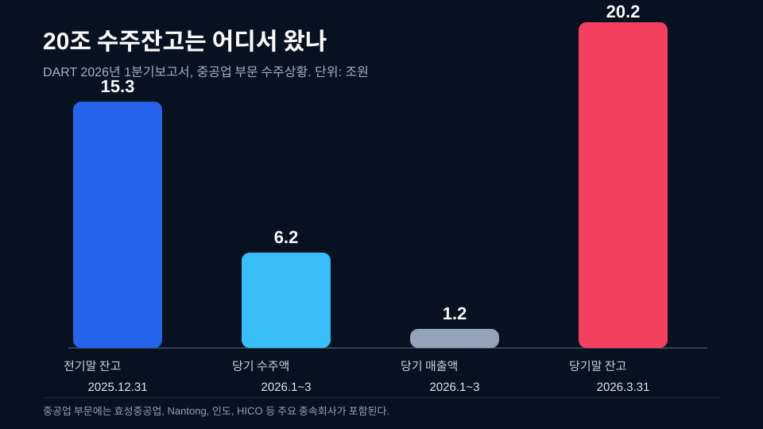
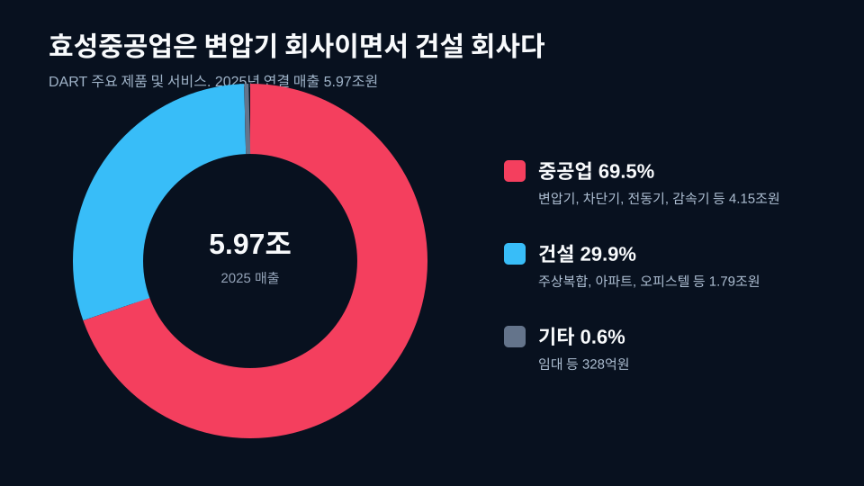
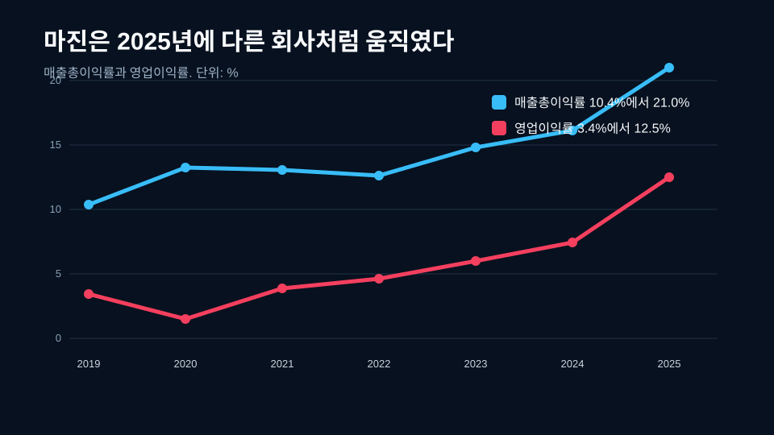
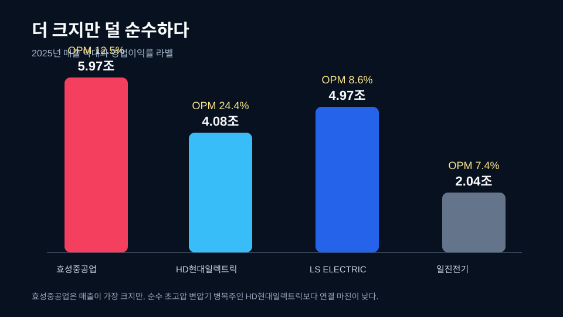
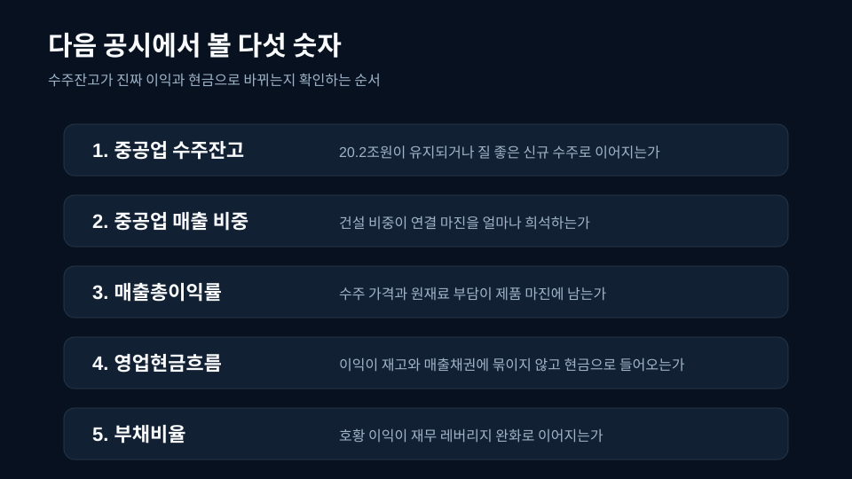

<script>
	import CompanyFinancials from '$lib/components/blog/CompanyFinancials.svelte';
</script>

> **주의**: 이 글은 투자 권유가 아니다. 목표가를 제시하지 않는다. 효성중공업이 오른다거나 내린다는 결론이 아니라, AI 전력 수요가 이 회사의 수주잔고, 마진, 현금흐름으로 어떻게 내려오는지 보는 글이다.
>
> **데이터 기준**: 2026-07-10 dartlab 실측, 효성중공업 2025년 사업보고서, 2026년 1분기보고서.
>
> **핵심 숫자**: 2025년 매출 **5.97조원** · 영업이익 **7,470억원** · 영업이익률 **12.5%** · 2026년 1분기 중공업 수주잔고 **20.2조원** · 2025년 부채비율 **190.3%**.

AI가 전기를 먹는다는 말은 너무 많이 쓰여서 이제 거의 배경음처럼 들린다. 데이터센터가 늘면 전력이 필요하고, 전력이 필요하면 변압기가 필요하다는 문장도 익숙하다. 그런데 효성중공업을 볼 때는 그 익숙한 문장 하나로 끝내면 안 된다. 이 회사의 2026년 1분기보고서에는 훨씬 더 큰 숫자가 찍혀 있다. **중공업 부문 수주잔고 20.2조원**.

이 숫자는 2025년 효성중공업 연결 매출 5.97조원의 3배가 넘는다. 단순히 "전력기기 수혜"라고 부르기에는 크기가 다르다. 하지만 동시에 조심해야 한다. 20.2조원은 연결 전체 매출이 아니고, 당장 손익계산서에 들어온 돈도 아니다. DART 2026년 1분기보고서의 "4. 매출 및 수주상황"에 있는 중공업 부문 당기말 수주잔고다. 즉 이미 계약된 일감이지만 앞으로 납품, 검수, 원가, 환율, 운전자본을 거쳐야 매출과 현금이 된다.


그래서 이 글의 질문은 하나다. **AI 전력난이 효성중공업의 20조 수주잔고와 현금흐름에는 어떻게 찍히는가.** 답은 단순하지 않다. 효성중공업은 변압기 회사이지만, 순수 변압기 회사는 아니다. 2025년 연결 매출에서 중공업은 69.5%, 건설은 29.9%다. 변압기와 차단기와 전동기가 좋아져도 건설이 섞인다. 수주잔고가 커져도 구리와 전기강판 가격을 지나야 한다. 영업이익이 늘어도 재고와 매출채권을 통과해야 현금이 된다.

이 복잡함이 오히려 효성중공업을 쓸 만한 기업이야기로 만든다. [전력기기 4사 비교](/blog/power-equipment-supercycle)에서는 효성중공업이 HD현대일렉트릭, LS ELECTRIC, 일진전기와 함께 비교 대상이었다. 이번 글은 다르다. 효성중공업 하나만 놓고, 20조 수주잔고가 어떤 사업 구조에서 나왔고, 2025년 마진 개선이 얼마나 진짜이며, 다음 공시에서 무엇을 확인해야 하는지 끝까지 따라간다.

## 1막. AI 전력난이 만든 숫자: 20조 수주잔고

효성중공업의 2026년 1분기보고서에서 가장 먼저 눈에 걸리는 표는 수주상황이다. 중공업 부문은 2025년 말 수주잔고 15.28조원에서 출발했다. 2026년 1분기에 새로 받은 수주액은 6.23조원, 같은 기간 매출로 인식된 금액은 1.23조원이다. 그 결과 2026년 3월 31일 중공업 부문 수주잔고는 **20.20조원**이 된다.



| 구분 | 금액 |
|---|---:|
| 중공업 전기말 수주잔고 | 15.28조원 |
| 중공업 2026년 1분기 수주액 | 6.23조원 |
| 중공업 2026년 1분기 매출액 | 1.23조원 |
| 중공업 2026년 1분기 말 수주잔고 | 20.20조원 |

표면만 보면 대단히 좋은 숫자다. 3개월 동안 6.23조원을 새로 수주했고, 1.23조원을 매출로 인식했는데도 잔고가 4.92조원 늘었다. 수주액이 매출 인식액을 훨씬 앞질렀기 때문이다. 주문이 들어오는 속도가 매출로 빠지는 속도보다 빠르면 수주잔고는 쌓인다. 수주 산업에서 이것은 미래 매출의 가시성이다.

초보 투자자라면 여기서 "매출의 몇 배"라는 말에만 반응하기 쉽다. 하지만 수주 산업에서 더 중요한 것은 유입 속도와 소진 속도다. 2026년 1분기 중공업 수주액 6.23조원은 같은 기간 중공업 매출액 1.23조원의 약 5.1배다. 이를 영어로는 book-to-bill에 가까운 감각으로 읽을 수 있다. 주문장이 매출 인식보다 훨씬 빨리 두꺼워진 것이다. 이 숫자가 높으면 납기와 가격 협상력이 좋아졌을 가능성을 생각할 수 있지만, 동시에 생산능력과 운전자본 부담도 같이 커진다.

수주잔고는 세 가지 층으로 나눠 읽으면 이해가 쉽다. 첫째는 계약량이다. 고객이 효성중공업에 맡긴 일감이 얼마나 남아 있는가다. 둘째는 생산 슬롯이다. 공장과 시험설비와 인력이 그 일감을 얼마나 빨리 처리할 수 있는가다. 셋째는 손익의 질이다. 원재료와 물류비와 환율을 지나도 매출총이익률이 유지되는가다. 20조 수주잔고라는 숫자는 첫째 층을 크게 보여준다. 투자자는 둘째와 셋째 층을 다음 공시에서 확인해야 한다.

대형 변압기와 초고압 전력기기는 주문을 받았다고 바로 매출이 되는 물건이 아니다. 고객 사양에 맞춘 설계, 철심과 권선, 절연, 탱크 제작, 시험, 운송, 설치, 검수가 붙는다. 제품이 무겁고 납기가 길며, 고객이 유틸리티나 데이터센터처럼 전력 안정성을 중시하는 곳이라면 품질 검수도 느슨할 수 없다. 그래서 수주잔고가 큰 회사는 공장 안의 시간표가 곧 재무제표의 시간표가 된다. 생산 슬롯이 막히면 매출은 늦어지고, 원재료가 먼저 들어오면 재고와 현금흐름이 먼저 움직인다.

하지만 수주잔고는 돈이 아니다. 수주잔고는 아직 매출도 아니고, 이익도 아니고, 현금도 아니다. 특히 변압기와 차단기 같은 전력기기는 제품별 설계, 원재료 조달, 제작, 시험, 운송, 설치, 검수 시간이 길다. 장기 프로젝트일수록 수주 당시의 원가 가정과 납품 시점의 원가가 달라질 수 있다. 그래서 수주잔고가 큰 회사일수록 손익계산서와 현금흐름표를 같이 봐야 한다.

이 지점이 효성중공업의 첫 번째 긴장이다. 제목의 20조 수주잔고는 강한 숫자다. 동시에 그 숫자는 "좋다"에서 끝나지 않는다. 오히려 더 큰 질문을 만든다. 이 20조가 어느 제품에서 나왔는가. 어느 지역 고객에게 팔리는가. 매출로 넘어올 때 매출총이익률은 유지되는가. 재고와 매출채권이 얼마나 늘어나는가. 부채비율은 내려오는가.

전력기기 산업의 최근 배경은 이미 선행 글에서 다뤘다. [AI 전력망 기술 이야기](/blog/ai-power-transformer-supercycle)는 데이터센터 수요가 변압기, 전선, 차단기 병목으로 내려가는 구조를 설명했다. 이번 글은 그 기술 이야기를 효성중공업의 공시 숫자로 옮긴다. 전력망 병목은 기술 글에서는 변압기라는 물건으로 보이고, 기업 글에서는 수주잔고와 매출총이익률과 영업현금흐름으로 보인다.

효성중공업이 이 테마에서 흥미로운 이유는 제품과 지역이 동시에 잡히기 때문이다. DART 수주상황 표는 중공업 부문에 효성중공업 본사뿐 아니라 Nantong Hyosung Transformer, Hyosung T India, Hyosung HICO, HICO America Sales 등을 함께 적는다. 창원, 중국 Nantong, 인도 Pune, 미국 Memphis가 한 수주표 안에 들어온다. 전력망 수요가 한 지역의 유행이 아니라 글로벌 인프라 투자로 번지고 있다는 장면이다.

특히 Hyosung HICO는 미국 생산거점으로 읽힌다. 회사는 HICO America Sales를 통한 미국 내 주요 전력청 대상 판매, 기존 고객과의 장기공급계약, 현지 생산체제 구축, 품질 강화와 고객 서비스 활동을 설명한다. 2025년 HICO의 주 고객으로는 Eversource Energy 23%, American Electric Power 19%, Intersect Power 16%, Georgia Power 8%가 적혀 있다. 전력기기 수요가 막연한 AI 뉴스가 아니라 미국 전력망 고객 이름으로 내려온다.

이 고객 이름들은 이야기의 결을 바꾼다. 전력기기 수요는 단순히 반도체 기업이 데이터센터를 더 짓는다는 뉴스 하나로 움직이지 않는다. 유틸리티는 노후 송배전망을 바꾸고, 데이터센터 개발사는 전력 인입을 확보해야 하며, 재생에너지 프로젝트는 계통 접속을 기다린다. Intersect Power처럼 전력 프로젝트 개발과 맞닿은 고객이 보이고, Eversource나 American Electric Power 같은 유틸리티 이름이 보이면 효성중공업의 수주는 AI 테마와 전력망 보강이 겹치는 곳에 놓인다. 이 겹침이 수주잔고의 내러티브를 만든다.


이 지도처럼 보면 20조 수주잔고는 단순히 큰 숫자가 아니라 생산 거점의 시간표가 된다. 창원은 국내 핵심 생산 기반이고, Nantong과 Pune은 아시아 생산 축이며, Memphis의 HICO는 미국 고객 대응의 상징이다. 수주잔고가 커질수록 중요한 것은 "어디서 만들고, 누가 검수하고, 어느 고객에게 언제 납품하는가"다. 효성중공업의 내러티브가 괜찮은 이유도 여기에 있다. AI 전력난이라는 큰 말이 공장 위치, 고객 이름, 수주잔고, 가동률로 내려오기 때문이다.

이제 중요한 것은 방향이다. 수주잔고 20.2조원이 쌓였다는 사실만으로 글을 끝내면 주식 게시판 문장에 머문다. 기업이야기는 한 단계 더 들어가야 한다. 수주잔고가 어떤 사업부에서 나왔고, 연결 손익 안에서 어떤 마진으로 바뀌는지 봐야 한다.

## 2막. 효성중공업은 변압기 회사이면서 건설 회사다

효성중공업을 "변압기 회사"라고만 부르면 절반만 맞다. DART 2026년 1분기보고서의 주요 제품 및 서비스 표를 보면 2025년 연결 매출 5.97조원 중 중공업 부문은 4.15조원, 비중 69.5%다. 건설 부문은 1.79조원, 비중 29.9%다. 기타는 328억원, 0.6%다.



| 사업부문 | 주요 제품과 서비스 | 2025년 매출 | 비중 |
|---|---|---:|---:|
| 중공업 | 변압기, 차단기, 전동기, 감속기 등 | 4.15조원 | 69.5% |
| 건설 | 주상복합, 아파트, 오피스텔 등 | 1.79조원 | 29.9% |
| 기타 | 임대 등 | 328억원 | 0.6% |
| 합계 | 연결 기준 | 5.97조원 | 100.0% |

이 표가 중요하다. 효성중공업은 전력기기 수혜를 받지만 연결 영업이익률은 중공업만의 마진이 아니다. 건설 매출이 섞이고, 기타 매출이 섞인다. 그래서 HD현대일렉트릭과 같은 방식으로 읽으면 안 된다. HD현대일렉트릭은 초고압 변압기와 전력기기 병목이 손익계산서에 더 직접적으로 찍히는 회사다. 효성중공업은 중공업이 중심이지만 건설을 함께 들고 가는 복합 회사다.

이 구조는 장점과 단점을 동시에 만든다. 장점은 매출 규모다. 2025년 효성중공업 연결 매출은 5.97조원이다. 전력기기 4사 비교에서 매출만 보면 효성중공업이 가장 크다. HD현대일렉트릭 4.08조원, LS ELECTRIC 4.97조원보다 크다. 중공업과 건설이 함께 있기 때문이다.

단점은 순도다. 전력기기 슈퍼사이클이 아무리 강해도 연결 숫자에는 건설 부문이 들어온다. 건설은 전력기기와 다른 사업이다. 고객, 원가, 현금 회수, 프로젝트 리스크가 다르다. 따라서 효성중공업을 볼 때는 "전력기기 수혜주"라는 큰 이름 아래에 중공업과 건설을 반드시 나눠야 한다.

2026년 1분기에는 이 믹스가 조금 흔들린다. 2026년 1분기 연결 매출 1.36조원 중 중공업은 8,810억원으로 64.9%, 건설은 4,713억원으로 34.7%다. 2025년보다 건설 비중이 올라왔다. 한 분기만 보고 구조가 바뀌었다고 말할 수는 없다. 다만 연결 영업이익률을 해석할 때 분기별 사업부 믹스를 봐야 한다는 사실은 분명하다.

여기서 두 번째 긴장이 나온다. 효성중공업의 중공업 부문은 매우 좋아 보인다. 2026년 1분기 중공업 수주잔고가 20조원을 넘었고, 해외 거점도 있다. 그러나 연결 투자자가 실제로 보는 숫자는 중공업만이 아니라 전체 손익이다. 그러므로 이 회사의 질문은 "변압기 수혜인가"가 아니다. 더 정확한 질문은 이렇다. **중공업 수주잔고가 연결 손익 안에서 건설의 희석을 이기고, 얼마나 높은 마진으로 남는가.**

별도 기준 매출을 보면 수출 방향도 보인다. 2025년 별도 기준 중공업 부문 매출은 2.87조원이고, 이 중 수출은 1.64조원이다. 별도 중공업 수출 비중은 약 57.1%다. 2026년 1분기에는 별도 중공업 매출 6,496억원 중 수출이 4,170억원으로 약 64.2%다. 한 분기 수치이지만 수출 비중이 높은 방향은 확인된다.

전력기기 호황은 내수만으로 설명되지 않는다. 미국 전력망, 데이터센터, 재생에너지 접속, 노후 설비 교체가 동시에 움직인다. 그래서 효성중공업의 수출 비중, 미국 HICO 매출처, 해외 생산거점은 단순 부가 정보가 아니라 본문이다. 이 회사의 중공업 실적은 한국 아파트 경기만 보는 회사가 아니라 글로벌 전력망 투자와 연결된다.

다만 해외 수출이 늘면 좋은 점만 있는 것은 아니다. 환율, 운송, 현지 인건비, 고객 검수, 품질 비용이 같이 들어온다. 특히 대형 전력기기는 제품을 만든 뒤 끝나는 것이 아니라 납품과 설치와 서비스까지 이어진다. 그래서 중공업 부문의 성장성은 매출총이익률과 영업현금흐름으로 확인해야 한다.

건설 부문도 그냥 빼고 보면 안 된다. 건설은 전력기기 호황을 가리는 잡음처럼 보일 수 있지만, 실제 연결 회사에서는 자금 소요와 이익 변동성을 함께 만든다. 주상복합, 아파트, 오피스텔은 수주와 공정 진행, 원가율, 분양과 입주, 매출채권 회수의 리듬이 전력기기와 다르다. 전력기기는 고객 검수와 납품이 중요하고, 건설은 현장 진행률과 원가 관리가 중요하다. 두 리듬이 한 손익계산서에 섞이면 영업이익률을 한 숫자로 해석하기 어려워진다.

그래서 효성중공업을 읽는 좋은 습관은 "중공업이 얼마이고 건설이 얼마인가"를 먼저 묻는 것이다. 2025년에는 중공업 비중이 69.5%였고, 2026년 1분기에는 64.9%였다. 만약 다음 공시에서 중공업 수주잔고는 강한데 건설 비중이 크게 올라가면 연결 매출은 좋아 보여도 전력기기 순도는 낮아질 수 있다. 반대로 중공업 비중이 다시 70% 안팎으로 올라가고 매출총이익률이 유지되면, 전력기기 수주가 연결 실적으로 더 깨끗하게 내려온다고 볼 수 있다.

제품 안에서도 한 번 더 나눠야 한다. 중공업 부문에는 변압기만 있는 것이 아니라 차단기, 전동기, 감속기, 발전기, 산업기계가 함께 있다. AI 전력망 이야기가 가장 강하게 붙는 것은 초고압 변압기와 관련 전력기기지만, 연결 표에는 여러 제품이 섞인다. 그래서 "효성중공업은 변압기를 한다"는 문장은 출발점일 뿐이다. 다음 질문은 "어떤 제품군이 수주잔고를 늘렸고, 그 제품군의 원가와 가격 조건이 어떤가"다. 이 질문을 해야 숫자가 테마에서 사업으로 내려온다.

## 3막. 마진은 2025년에 다른 회사처럼 움직였다

효성중공업의 2019~2025년 손익계산서를 보면 2025년에 숫자가 한 단계 바뀐다. 2019년 매출은 3.78조원, 영업이익은 1,303억원, 영업이익률은 3.4%였다. 2025년 매출은 5.97조원, 영업이익은 7,470억원, 영업이익률은 12.5%다. 매출은 58% 늘었지만 영업이익은 5.7배가 됐다.



| 연도 | 매출 | 매출총이익률 | 영업이익 | 영업이익률 | 순이익 |
|---|---:|---:|---:|---:|---:|
| 2019 | 3.78조원 | 10.4% | 1,303억원 | 3.4% | 160억원 |
| 2020 | 2.98조원 | 13.3% | 441억원 | 1.5% | -193억원 |
| 2021 | 3.09조원 | 13.1% | 1,201억원 | 3.9% | 765억원 |
| 2022 | 5.22조원 | 12.6% | 2,414억원 | 4.6% | 291억원 |
| 2023 | 4.30조원 | 14.8% | 2,578억원 | 6.0% | 731억원 |
| 2024 | 4.89조원 | 16.2% | 3,625억원 | 7.4% | 2,229억원 |
| 2025 | 5.97조원 | 21.0% | 7,470억원 | 12.5% | 5,028억원 |

여기서 핵심은 영업이익률보다 매출총이익률이다. 매출총이익률은 매출에서 매출원가를 뺀 뒤 남는 비율이다. 판관비 절감이나 회계적 일회성보다 제품의 가격과 원가 구조에 더 가깝다. 효성중공업의 매출총이익률은 2019년 10.4%에서 2025년 21.0%로 올라왔다. 두 배다.

영업이익률도 같은 방향으로 움직였다. 2019년 3.4%, 2024년 7.4%, 2025년 12.5%다. 2025년의 점프가 특히 크다. 매출총이익률이 16.2%에서 21.0%로 올라가고, 영업이익률이 7.4%에서 12.5%로 올라갔다. 판관비만 줄인 숫자가 아니라 제품 마진 자체가 좋아진 숫자다.

이 변화는 전력기기 슈퍼사이클의 흔적이다. 변압기와 차단기 수요가 커지고, 납기가 길어지고, 고객이 높은 가격을 받아들이면 매출총이익률이 먼저 움직인다. [HD현대일렉트릭 AI 전력 후속](/blog/267260-hd-hyundai-electric-ai-power)에서 본 것처럼 병목 제품의 가격결정력은 손익계산서 위쪽에 먼저 찍힌다. 효성중공업도 같은 방향을 보였다. 다만 폭은 다르다.

왜 폭이 다를까. 사업부 믹스 때문이다. HD현대일렉트릭은 2025년 영업이익률 24.4%를 기록했다. 효성중공업은 12.5%다. 둘 다 전력기기 호황을 받았지만 연결 손익의 순도가 다르다. 효성중공업에는 건설이 섞이고, 중공업 안에서도 변압기, 차단기, 전동기, 감속기 등 여러 제품이 섞인다. 따라서 효성중공업의 12.5%는 낮은 숫자가 아니라, 복합 회사의 연결 기준으로는 꽤 강한 숫자다.

2025년 분기 흐름도 눈에 띈다. 2025년 1분기 영업이익률은 9.5%, 2분기 10.8%, 3분기 13.5%, 4분기 14.9%다. 2026년 1분기는 11.2%로 내려왔지만 여전히 2024년 연간 7.4%보다 높다. 한 분기 변동으로 결론을 내리면 안 되지만, 2025년 전체의 마진 레벨업은 분명하다.

```python
import dartlab

c = dartlab.Company("298040")
c.select("IS", ["sales", "gross_profit", "operating_profit", "net_profit"], freq="Y")
```

| 항목 (억원) | 2019 | 2020 | 2021 | 2022 | 2023 | 2024 | 2025 |
|---|---:|---:|---:|---:|---:|---:|---:|
| 매출액 | 37,814 | 29,840 | 30,947 | 52,233 | 43,006 | 48,950 | 59,685 |
| 매출총이익 | 3,926 | 3,954 | 4,043 | 6,581 | 6,375 | 7,918 | 12,527 |
| 영업이익 | 1,303 | 441 | 1,201 | 2,414 | 2,578 | 3,625 | 7,470 |
| 당기순이익 | 160 | -193 | 765 | 291 | 731 | 2,229 | 5,028 |

위 호출로 글의 손익계산서 숫자를 재현할 수 있다. 금액은 원 단위 원천값을 조원과 억원으로 환산했고, 비율은 `gross_profit / sales`, `operating_profit / sales`로 계산했다.

이 표를 천천히 보면 2022년과 2025년의 차이가 보인다. 2022년에도 매출은 5.22조원까지 커졌다. 하지만 매출총이익률은 12.6%, 영업이익률은 4.6%였다. 매출은 컸지만 주주에게 남는 질은 아직 약했다. 2025년은 다르다. 매출은 5.97조원으로 2022년보다 14% 정도 커졌지만, 매출총이익은 1.25조원으로 거의 두 배가 됐다. 그래서 2025년의 핵심은 매출 성장이 아니라 매출총이익의 레벨업이다.

초보 투자자는 영업이익률만 보는 경우가 많다. 그러나 수주 산업에서 매출총이익률은 더 앞단의 신호다. 매출총이익률이 오른다는 것은 제품 가격, 원가 전가, 생산 믹스, 납기 조건이 좋아졌을 가능성을 뜻한다. 영업이익률은 그 뒤에 판관비와 연구개발비와 본사 비용을 지나 나온다. 효성중공업의 2025년은 매출총이익률과 영업이익률이 함께 올라왔기 때문에 단순 비용 절감보다 제품 손익 개선으로 읽을 여지가 크다.

물론 매출총이익률이 올랐다고 곧바로 장기 지속을 확정하면 안 된다. 대형 전력기기 가격은 수급이 좋을 때 강해지지만, 고객의 발주 공백, 원재료 급등, 경쟁사 증설, 납기 지연이 겹치면 다시 흔들릴 수 있다. 그래서 2026년 1분기 매출총이익률 19.9%가 중요하다. 2025년 연간 21.0%보다는 낮지만, 2024년 16.2%보다는 높은 레벨이다. 다음 분기에도 20% 안팎을 유지하는지가 효성중공업 마진 내러티브의 첫 번째 시험대다.

마진이 좋아졌다는 말은 쉬워 보이지만, 효성중공업에서는 한 번 더 확인해야 한다. 좋은 마진이 좋은 현금으로 바뀌었는가. 좋은 현금이 부채비율을 낮췄는가. 수주잔고가 더 쌓이면서 재고가 얼마나 늘었는가. 이 질문으로 넘어가야 기업이야기가 된다.

## 4막. 좋은 수주는 구리와 재고를 지나야 현금이 된다

수주잔고가 20조원을 넘는 회사에서 가장 위험한 착각은 "수주가 크니 이익도 자동으로 크다"는 생각이다. 현실은 더 물리적이다. 변압기를 만들려면 전기강판과 구리가 필요하다. 제품을 만드는 동안 재고가 쌓이고, 납품 뒤에는 매출채권이 생긴다. 이익이 잡혀도 현금이 바로 들어오지 않을 수 있다.

효성중공업의 원재료 표는 이 점을 분명히 보여준다. 2026년 1분기 중공업 주요 원재료 매입액은 강판 191억원, 구리 446억원이다. 가격 표에서는 강판이 2026년 1분기 kg당 2,688원, 2025년 kg당 2,699원으로 큰 변화가 없었다. 반면 구리는 2024년 kg당 11,366~14,185원, 2025년 13,432~17,727원, 2026년 1분기 19,386~19,861원으로 올라왔다.

| 원재료 | 2024년 가격 | 2025년 가격 | 2026년 1분기 가격 |
|---|---:|---:|---:|
| 강판 | kg당 2,705원 | kg당 2,699원 | kg당 2,688원 |
| 구리 | kg당 11,366~14,185원 | kg당 13,432~17,727원 | kg당 19,386~19,861원 |

구리는 전력기기에서 피할 수 없는 재료다. 구리 가격이 오르면 원가가 올라간다. 좋은 수주라도 원가 전가 조항이 약하거나, 납품 기간이 길거나, 환율과 물류비가 예상과 다르면 마진이 흔들릴 수 있다. 회사도 원재료 가격변동 원인에서 구리 가격이 미국 관세 이슈와 광산 사고에 따른 공급 차질 영향으로 상승세를 보였다고 설명한다.

재고도 같이 봐야 한다. 효성중공업의 재고자산은 2019년 3,060억원에서 2025년 1.28조원으로 늘었다. 2026년 1분기에는 1.50조원이다. 매출과 수주가 커지면 재고가 늘어나는 것은 자연스럽다. 문제는 속도다. 재고가 매출 증가에 필요한 준비라면 나쁘지 않다. 하지만 재고가 너무 빠르게 쌓이고 매출과 현금 회수가 따라오지 않으면 운전자본 부담이 된다.

현금흐름은 2025년에 좋아졌다. 효성중공업의 2025년 영업현금흐름은 4,930억원이다. 같은 해 영업이익 7,470억원보다 작지만, 2022년 -459억원과 비교하면 확실히 개선됐다. 2026년 1분기 영업현금흐름도 2,350억원으로 양수다. 한 분기만으로 연간을 예단할 수는 없지만, 수주잔고가 커지는 국면에서 현금흐름이 양수라는 점은 중요하다.

여기서 영업현금흐름을 어렵게 생각할 필요는 없다. 손익계산서가 "얼마를 벌었다고 회계상 인식했는가"를 보여준다면, 영업현금흐름은 "그 영업에서 실제 현금이 얼마나 남았는가"에 더 가깝다. 성장하는 제조 회사는 이익이 늘어도 현금이 잠길 수 있다. 재고를 미리 사야 하고, 고객에게 납품한 뒤 돈을 나중에 받을 수 있으며, 프로젝트 진행 중 선급금과 매출채권이 움직이기 때문이다. 그래서 수주잔고가 커지는 회사에서 영업현금흐름은 품질 검사표다.

효성중공업의 재고자산 증가는 그 검사표를 더 중요하게 만든다. 2019년 재고자산 3,060억원은 2025년 1.28조원이 됐다. 같은 기간 매출은 3.78조원에서 5.97조원으로 늘었다. 매출이 58% 늘 때 재고는 네 배 이상 커졌다. 이것을 단순히 나쁘다고 말할 수는 없다. 수주잔고가 커졌고, 납품할 제품이 많아졌다면 재고 증가는 자연스럽다. 다만 재고가 매출과 현금으로 빠지는 속도를 확인하지 않으면, 호황기 준비가 운전자본 부담으로 바뀌는 순간을 놓칠 수 있다.

부채비율도 이 맥락에서 봐야 한다. 효성중공업의 부채비율은 2022년 325.4%에서 2025년 190.3%로 내려왔다. 이것은 좋은 방향이다. 다만 2026년 1분기에는 209.7%로 다시 올라왔다. 성장 국면에서는 원재료, 재고, 설비투자, 매출채권이 모두 자금을 요구한다. 수주잔고가 커질수록 운전자본이 같이 커질 수 있기 때문에, 부채비율 하락이 계속되는지는 효성중공업 내러티브의 두 번째 시험대다.

| 연도 | 영업이익 | 영업현금흐름 | 부채비율 | 재고자산 |
|---|---:|---:|---:|---:|
| 2019 | 1,303억원 | 1,373억원 | 303.9% | 3,060억원 |
| 2020 | 441억원 | 3,866억원 | 282.5% | 3,190억원 |
| 2021 | 1,201억원 | 724억원 | 287.9% | 4,131억원 |
| 2022 | 2,414억원 | -459억원 | 325.4% | 6,287억원 |
| 2023 | 2,578억원 | 4,547억원 | 288.9% | 7,258억원 |
| 2024 | 3,625억원 | 4,121억원 | 202.5% | 8,854억원 |
| 2025 | 7,470억원 | 4,930억원 | 190.3% | 1.28조원 |

부채비율은 낮아지는 방향이다. 2022년 325.4%였던 부채비율은 2025년 190.3%로 내려왔다. 여전히 낮다고 말하기는 어렵다. 하지만 방향은 중요하다. 전력기기 호황이 단순히 손익계산서의 이익으로만 끝나지 않고 자본구조 개선으로 이어지는지 봐야 하기 때문이다.

dartlab dCR은 효성중공업을 dCR-A+로 본다. 건강성 점수는 82.38, 추정 부도확률은 0.04%로 표시된다. 다만 dCR 설명에는 캡티브 금융자회사 연결로 인해 연결 차입금에 금융자회사 대출 원금이 포함된다는 주의가 붙는다. 이 말은 연결 부채비율을 볼 때 사업부의 실제 제조 리스크와 금융 성격 부채를 분리해 읽어야 한다는 뜻이다.

```python
import dartlab

c = dartlab.Company("298040")
c.credit("등급")
```

여기서 글의 핵심 인사이트가 나온다. 효성중공업은 "수주잔고가 많다"로 끝나는 회사가 아니다. **좋은 수주가 구리, 재고, 매출채권, 부채비율을 지나 현금으로 바뀌는 속도를 봐야 하는 회사**다. 수주잔고 20조원은 강한 출발점이지만, 투자자가 실제로 받는 것은 수주잔고가 아니라 현금흐름과 자기자본 증가다.


이 그림이 이 글의 내러티브를 가장 짧게 보여준다. 수주는 출발점이고, 설계와 원재료와 생산은 병목이며, 매출과 현금 회수는 검증이다. 그래서 효성중공업을 볼 때는 수주잔고 하나만 외우면 안 된다. 수주잔고가 늘어도 구리 가격이 급등하고, 재고가 더 빠르게 쌓이고, 매출채권 회수가 늦어지면 시장은 "좋은 수주인가"를 다시 묻는다. 반대로 매출총이익률과 영업현금흐름과 부채비율이 함께 좋아지면, 20조 수주잔고는 단순 테마가 아니라 재무제표를 바꾸는 힘이 된다.

## 5막. 미국 Memphis, 중국 Nantong, 인도 Pune: 효성의 생산 지도

효성중공업의 전력기기 이야기는 창원 공장 하나로 끝나지 않는다. DART 생산설비 표에는 창원, Nantong 중국, Pune 인도, Memphis 미국이 함께 나온다. 중공업 부문 주요 제품은 변압기, 차단기, 전동기 등이고, 2026년 1분기 생산능력은 9,461억원, 생산실적은 8,960억원이다. 회사가 단순 기준으로 계산한 가동률은 94.70%다.

2025년으로 보면 생산능력 3.13조원, 생산실적 3.26조원, 가동률 104.15%다. 2024년에도 생산능력 2.54조원, 생산실적 2.60조원, 가동률 102.37%다. 회사는 가동률이 생산실적을 생산능력으로 단순히 나눈 값이라 실제 법인별, 제품별 가동률과 차이가 발생한다고 설명한다. 그럼에도 이 숫자는 한 가지를 보여준다. 이미 설비가 꽤 바쁘게 돌아가고 있었다는 점이다.

| 구분 | 2024년 | 2025년 | 2026년 1분기 |
|---|---:|---:|---:|
| 중공업 생산능력 | 2.54조원 | 3.13조원 | 9,461억원 |
| 중공업 생산실적 | 2.60조원 | 3.26조원 | 8,960억원 |
| 단순 가동률 | 102.37% | 104.15% | 94.70% |

이 표가 20조 수주잔고와 연결된다. 수주잔고가 커졌는데 생산능력이 충분하지 않으면 매출 인식은 늦어진다. 반대로 생산능력이 늘어나면 수주잔고가 매출로 넘어오는 속도가 빨라질 수 있다. 그래서 생산능력 확장은 성장의 조건이면서 실행 리스크다. 공장만 늘리면 끝나는 것이 아니라 시험실, 품질, 인증, 숙련 인력, 고객 승인까지 맞아야 한다.

미국 HICO 투자 계획도 눈에 띈다. 2026년 1분기보고서에는 Hyosung HICO의 생산 증대를 위한 설비 및 공장 증설 투자 두 건이 적혀 있다. 하나는 2025년 1월~2026년 12월 투자로 총투자액 6,427.9만 달러, 기투자액 2,881.8만 달러, 향후투자액 3,546.1만 달러다. 다른 하나는 2025년 7월~2028년 6월 투자로 총투자액 1억 5,661.1만 달러, 기투자액 2,580.9만 달러, 향후투자액 1억 3,080.2만 달러다.

HICO 투자는 효성중공업의 이야기를 미국 전력망 쪽으로 더 강하게 당긴다. 미국은 땅이 넓고 송전망 노후화 이슈가 크며, 데이터센터와 제조 리쇼어링이 전력 수요를 밀어 올린다. 변압기는 부피가 크고 운송이 까다롭기 때문에 현지 생산과 현지 서비스가 고객 신뢰에 영향을 준다. 그래서 Memphis 거점은 단순 생산기지가 아니라 미국 고객에게 납기, 품질, 대응 속도를 설명하는 증거가 된다.

하지만 설비투자는 항상 양면이다. 공장이 늘면 수주잔고를 매출로 바꿀 수 있는 능력이 커진다. 반대로 투자 기간에는 현금이 나가고, 초기 가동률이 낮으면 고정비 부담이 생긴다. 새 설비가 고객 인증과 품질 검수를 거쳐 정상 생산에 들어가기 전까지는 비용이 먼저 보일 수 있다. 그래서 HICO 투자는 좋은 뉴스인 동시에 실행 점검 대상이다. 앞으로 볼 것은 투자 발표가 아니라 생산능력, 수주잔고, 매출총이익률, 영업현금흐름이 같은 방향으로 움직이는지다.

이 숫자는 효성중공업의 전력기기 호황이 단순 한국 수출이 아니라 미국 현지 생산능력 확장으로 이어지고 있음을 보여준다. 미국 전력망과 데이터센터 수요가 강하다면 현지 고객과 현지 생산거점의 가치가 커진다. 대형 변압기는 무겁고, 운송과 납기와 서비스가 중요하다. 미국 고객 입장에서는 현지 생산과 서비스 역량을 가진 공급자가 더 안정적으로 보일 수 있다.

연구개발 표도 같은 방향이다. 2025년 연구개발비는 536억원, 매출액 대비 0.90%다. 2026년 1분기는 133억원, 매출액 대비 0.98%다. 비율만 보면 높지 않다. 그러나 연구개발 과제의 내용은 전력기기 기술 방향을 보여준다. SF6 Free 145kV 40kA GIS, 친환경 절연유 변압기, 저소음 초고압 변압기, 400kV 친환경유 변압기, Phase Shifting 변압기, ESS용 PCS 등이 적혀 있다.

여기서 효성중공업을 단순 철강 가공 회사처럼 보면 안 된다. 변압기와 차단기는 신뢰와 인증이 중요한 전력 인프라 장비다. 고객은 한 번 사고 끝나는 소비자가 아니라 전력청, 유틸리티, 데이터센터, 산업 고객이다. 제품이 고장 나면 비용이 크다. 그래서 공급자의 납품 이력, 기술 인증, 품질, 현장 서비스가 진입 장벽이 된다.

다만 기술 과제를 많이 적었다고 모두 매출이 되는 것은 아니다. 기술 개발은 필요 조건이다. 충분 조건은 아니다. 실제 매출로 바뀌려면 고객 수주, 납품, 검수, 반복 발주까지 이어져야 한다. 그래서 다음 공시에서 기술 항목보다 먼저 볼 것은 수주잔고와 매출총이익률이다. 기술은 설명이고, 수주와 마진은 검증이다.

## 6막. HD현대일렉트릭과 다른 점: 더 크지만 덜 순수하다

효성중공업을 가장 잘 이해하는 방법은 HD현대일렉트릭과 비교하는 것이다. 두 회사 모두 AI 전력망 테마에 걸려 있다. 둘 다 변압기와 전력기기를 만든다. 둘 다 2025년에 마진이 좋아졌다. 하지만 손익계산서는 다르다.



| 기업 | 2025년 매출 | 매출총이익률 | 영업이익률 | 영업현금흐름 | 부채비율 |
|---|---:|---:|---:|---:|---:|
| 효성중공업 | 5.97조원 | 21.0% | 12.5% | 4,930억원 | 190.3% |
| HD현대일렉트릭 | 4.08조원 | 34.1% | 24.4% | 9,596억원 | 134.6% |
| LS ELECTRIC | 4.97조원 | 21.2% | 8.6% | 2,999억원 | 131.5% |
| 일진전기 | 2.04조원 | 13.7% | 7.4% | 869억원 | 159.2% |

효성중공업은 매출이 가장 크다. 그러나 영업이익률은 HD현대일렉트릭의 절반 수준이다. 매출총이익률도 21.0%로 LS ELECTRIC과 비슷하고, HD현대일렉트릭의 34.1%에는 못 미친다. 이 차이가 투자자의 해석을 바꾼다.

HD현대일렉트릭은 더 순수한 병목주에 가깝다. 초고압 변압기 공급 부족이 매출총이익률과 영업이익률에 선명하게 찍힌다. 그래서 2025년 영업이익률 24.4%라는 숫자가 나온다. 반면 효성중공업은 중공업 수주잔고가 크지만 연결 손익 안에는 건설이 섞인다. 중공업 안에서도 변압기 외 제품이 있다. 마진의 순도가 다르다.

그렇다고 효성중공업이 약하다는 뜻은 아니다. 오히려 효성중공업은 다른 질문을 요구한다. HD현대일렉트릭의 질문이 "초고압 변압기 병목 프리미엄이 얼마나 오래 가는가"라면, 효성중공업의 질문은 "20조 중공업 수주잔고가 연결 손익 안에서 얼마나 빠르게 고마진 매출과 현금으로 바뀌는가"다. 서로 사는 것이 다르다.

LS ELECTRIC과 비교하면 또 다른 모습이 보인다. LS ELECTRIC은 2025년 매출 4.97조원, 영업이익률 8.6%다. 자동화와 배전, 전력 인프라가 넓게 섞인 회사다. 효성중공업은 LS보다 영업이익률이 높고, 수주잔고 숫자의 폭발력이 크다. 하지만 부채비율은 LS의 131.5%보다 높다. 즉 효성중공업은 LS보다 더 강한 수주 레버리지를 갖지만, 재무 레버리지도 더 크게 봐야 한다.

일진전기는 하위 공급망의 속도를 보여준다. 매출은 2.04조원으로 작고 영업이익률은 7.4%다. 빠르게 성장하지만 매출총이익률은 13.7%로 낮다. 이 비교는 전력기기 테마를 한 단어로 묶으면 안 된다는 사실을 다시 보여준다. 같은 전력 수요라도 제품 위치와 사업 믹스에 따라 주주에게 남는 이익률이 다르다.

효성중공업은 이 네 회사 중 가장 복합적인 자리에 있다. 매출은 크다. 수주잔고는 강하다. 마진은 개선됐다. 하지만 순수 변압기 병목주는 아니다. 건설이 섞이고, 부채비율이 높고, 원재료와 운전자본을 통과해야 한다. 그래서 이 회사는 쉽게 좋다거나 나쁘다고 말하기보다 "검증할 숫자가 많은 회사"로 읽는 편이 맞다.

이 차이는 시장이 붙이는 이야기에도 영향을 준다. 순수한 병목주는 설명이 쉽다. "전력망이 부족하고, 변압기가 부족하고, 이 회사가 그 물건을 판다"로 끝난다. 효성중공업은 설명이 한 문장 더 필요하다. "전력기기 수주잔고는 강하지만, 건설이 섞인 연결 회사라서 마진과 현금 전환을 같이 봐야 한다"가 붙는다. 단기적으로는 이 복잡함이 할인 요인이 될 수 있다. 반대로 숫자가 계속 확인되면, 복합 회사라는 의심이 재평가 여지가 된다.

그래서 효성중공업의 내러티브는 "숨은 2등"보다 "번역이 필요한 전력망 수혜주"에 가깝다. 수주잔고는 이미 크다. 독자가 봐야 할 것은 그 수주잔고가 어떤 언어로 재무제표에 번역되는가다. 매출총이익률로 번역되면 가격결정력 이야기다. 영업현금흐름으로 번역되면 회수 품질 이야기다. 부채비율 하락으로 번역되면 호황이 재무구조를 바꾸는 이야기다. 이 세 번역이 동시에 일어나면 효성중공업의 20조 수주잔고는 단순 숫자가 아니라 기업 가치의 근거가 된다.

이런 회사는 좋은 이야기가 있을 때 더 조심해야 한다. 20조 수주잔고는 강한 이야기다. 하지만 시장이 결국 확인하려는 것은 수주잔고 자체가 아니라 매출총이익률과 영업현금흐름이다. 수주잔고가 계속 커져도 매출총이익률이 낮아지거나 영업현금흐름이 따라오지 않으면 해석은 달라진다.

## 7막. 이 이야기가 깨지는 조건

강한 이야기는 깨지는 조건을 같이 가져야 한다. 효성중공업의 긍정적 내러티브는 "AI 전력난이 글로벌 전력기기 수요를 키우고, 효성중공업의 20조 중공업 수주잔고가 고마진 매출과 현금으로 바뀐다"는 문장이다. 이 문장이 맞으려면 다섯 조건이 필요하다.

첫째, 중공업 수주잔고가 질을 유지해야 한다. 2026년 1분기 말 20.2조원은 훌륭한 숫자다. 그러나 다음 공시에서 볼 것은 단순 증가율만이 아니다. 신규 수주가 고마진 제품과 고객에서 나오는지, 납기가 무리하지 않은지, 원가 전가 조건이 좋은지 봐야 한다. 수주잔고가 늘어도 저마진 수주라면 주주에게 남는 것은 작을 수 있다.

둘째, 중공업 매출 비중이 중요하다. 2025년에는 중공업 69.5%, 건설 29.9%였다. 2026년 1분기에는 중공업 64.9%, 건설 34.7%다. 건설 매출이 늘면 연결 매출은 커질 수 있지만, 전력기기 호황이 연결 마진에 찍히는 순도는 낮아질 수 있다. 효성중공업은 건설 회사의 얼굴을 같이 갖고 있다는 점을 잊으면 안 된다.

셋째, 매출총이익률이 유지돼야 한다. 2025년 매출총이익률 21.0%는 2019년 10.4%와 비교하면 큰 변화다. 그러나 2026년 1분기 매출총이익률은 19.9%로 2025년 연간보다 낮다. 한 분기 수치만으로 판단할 필요는 없지만, 다음 분기에도 20% 아래로 내려가면 "고마진 수주가 계속 매출로 잡히는가"라는 질문이 생긴다.

넷째, 영업현금흐름이 따라와야 한다. 2025년 영업현금흐름 4,930억원은 좋지만 영업이익 7,470억원보다 작다. 성장기에 재고와 매출채권이 늘 수 있다는 점을 감안해야 한다. 다만 이 차이가 계속 벌어지면 시장은 이익보다 현금을 먼저 보게 된다. 수주 산업에서 현금흐름은 사후 검증표다.

다섯째, 부채비율이 더 내려와야 한다. 2025년 부채비율 190.3%는 2022년 325.4%보다 많이 낮아졌지만, 여전히 부담이 있다. 2026년 1분기에는 209.7%로 다시 올라왔다. 분기말 자산과 부채 변동, 수주와 운전자본 영향이 섞였을 수 있다. 그래도 방향은 확인해야 한다. 호황 이익이 자본구조 개선으로 이어지지 않으면 사이클 둔화 때 부담이 커질 수 있다.



이 다섯 조건 중 하나가 흔들린다고 바로 결론이 바뀌지는 않는다. 그러나 두세 개가 동시에 흔들리면 이야기는 달라진다. 수주잔고는 크지만 매출총이익률이 내려가고, 영업현금흐름이 약해지고, 부채비율이 올라가면 20조 수주잔고는 기대보다 부담으로 보일 수 있다. 반대로 중공업 비중이 높아지고, 매출총이익률이 20% 안팎에서 버티고, 영업현금흐름이 따라오면 효성중공업은 전력기기 슈퍼사이클의 또 다른 얼굴로 인정받을 수 있다.

여기서 투자자에게 필요한 것은 단순한 낙관이나 비관이 아니다. 순서다. 다음 공시를 열면 먼저 수주잔고를 보고, 그 다음 중공업 비중을 보고, 그 다음 매출총이익률을 보고, 그 다음 영업현금흐름과 부채비율을 본다. 이 순서를 지키면 "AI 전력 수혜"라는 큰 말에 휩쓸리지 않고, 효성중공업이라는 회사의 실제 변화 속도를 볼 수 있다.

## 결론. 20조 수주잔고가 현금으로 바뀌는 속도가 진짜 이야기다

효성중공업의 이야기는 한 문장으로 정리된다. **AI가 전기를 먹자 효성중공업의 수주잔고가 깨어났지만, 주주가 실제로 봐야 할 것은 그 수주잔고가 현금으로 바뀌는 속도다.**

2025년 숫자는 분명히 좋아졌다. 매출 5.97조원, 영업이익 7,470억원, 영업이익률 12.5%, 순이익 5,028억원. 2019년 영업이익률 3.4%였던 회사를 생각하면 다른 회사처럼 보일 정도다. 매출총이익률도 10.4%에서 21.0%로 올라왔다. 전력기기 호황이 손익계산서에 남았다.

2026년 1분기 수주표는 더 강하다. 중공업 당기말 수주잔고 20.2조원. 전기말 잔고 15.3조원에서 3개월 만에 더 커졌다. 이것은 효성중공업을 계속 봐야 하는 이유다. 단기 실적 하나보다 더 큰 미래 매출 풀을 보여주기 때문이다.

하지만 이 회사는 단순한 순수 변압기주가 아니다. 연결 매출의 약 30%가 건설이고, 부채비율은 190.3%이며, 구리 가격과 재고와 현금흐름을 계속 확인해야 한다. 그래서 효성중공업은 HD현대일렉트릭과 같은 결론으로 읽으면 안 된다. HD현대일렉트릭은 병목 제품의 높은 순도가 핵심이고, 효성중공업은 큰 수주잔고와 복합 사업 구조의 번역 속도가 핵심이다.

좋은 기업이야기는 결국 다음 공시를 읽는 렌즈를 남겨야 한다. 효성중공업의 렌즈는 다섯 개다. 중공업 수주잔고, 중공업 매출 비중, 매출총이익률, 영업현금흐름, 부채비율. 이 다섯 숫자가 같은 방향으로 움직이면 20조 수주잔고는 진짜 이야기다. 하나씩 엇갈리기 시작하면 AI 전력 수혜라는 큰 말보다 재무제표의 마찰을 먼저 봐야 한다.

함께 읽을 글: [AI 전력망 기술 이야기](/blog/ai-power-transformer-supercycle) · [전력기기 4사 비교](/blog/power-equipment-supercycle) · [HD현대일렉트릭 AI 전력 후속](/blog/267260-hd-hyundai-electric-ai-power) · [LS ELECTRIC](/blog/010120-ls-electric) · [반도체 냉각 기술과 전력망](/blog/semiconductor-cooling-network)

## 다음 공시 체크리스트

| 순서 | 볼 숫자 | 왜 중요한가 | 좋아지는 신호 | 나빠지는 신호 |
|---|---|---|---|---|
| 1 | 중공업 수주잔고 | 제목의 20조가 유지되는지 확인 | 고마진 신규 수주와 잔고 유지 | 잔고 감소나 저마진 수주 증가 |
| 2 | 중공업 매출 비중 | 연결 마진의 순도를 결정 | 중공업 비중 70% 안팎 유지 | 건설 비중 급증 |
| 3 | 매출총이익률 | 가격결정력과 원가 전가 확인 | 20% 안팎 유지 또는 상승 | 18% 아래로 하락 |
| 4 | 영업현금흐름 | 이익이 현금으로 바뀌는지 검증 | 영업이익과 큰 차이 없이 양수 | 이익은 늘지만 OCF 약화 |
| 5 | 부채비율 | 호황 이익의 자본구조 개선 여부 | 190% 아래로 하락 | 200%대 재상승 지속 |

## 검증표

| 항목 | 수치 / 내용 | 기준 | 출처 |
|---|---:|---|---|
| 2025년 매출 | 5.97조원 | 연결 연간 | dartlab `Company("298040").select("IS", ...)` |
| 2025년 영업이익 | 7,470억원 | 연결 연간 | dartlab `operating_profit` |
| 2025년 영업이익률 | 12.5% | 연결 연간 | dartlab `operating_profit / sales` |
| 2025년 순이익 | 5,028억원 | 연결 연간 | dartlab `net_profit` |
| 2025년 매출총이익률 | 21.0% | 연결 연간 | dartlab `gross_profit / sales` |
| 2025년 영업현금흐름 | 4,930억원 | 연결 연간 | dartlab `operating_cashflow` |
| 2025년 부채비율 | 190.3% | 연결 연간 | dartlab `total_liabilities / total_stockholders_equity` |
| 2026년 1분기 매출 | 1.36조원 | 연결 분기 | dartlab `sales` |
| 2026년 1분기 영업이익 | 1,523억원 | 연결 분기 | dartlab `operating_profit` |
| 2026년 1분기 영업이익률 | 11.2% | 연결 분기 | dartlab `operating_profit / sales` |
| 2026년 1분기 영업현금흐름 | 2,350억원 | 연결 분기 | dartlab `operating_cashflow` |
| 2026년 1분기 부채비율 | 209.7% | 연결 분기 | dartlab `total_liabilities / total_stockholders_equity` |
| 2025년 중공업 매출 | 4.15조원, 69.5% | 연결 사업부 | DART 2026년 1분기보고서, 주요 제품 및 서비스 |
| 2025년 건설 매출 | 1.79조원, 29.9% | 연결 사업부 | DART 2026년 1분기보고서, 주요 제품 및 서비스 |
| 2026년 1분기 중공업 수주잔고 | 20.20조원 | 중공업 부문 | DART 2026년 1분기보고서, 매출 및 수주상황 |
| 2026년 1분기 중공업 수주액 | 6.23조원 | 중공업 부문 | DART 2026년 1분기보고서, 매출 및 수주상황 |
| 2026년 1분기 중공업 매출액 | 1.23조원 | 중공업 수주표 | DART 2026년 1분기보고서, 매출 및 수주상황 |
| 2025년 중공업 생산능력 | 3.13조원 | 회사 단순 기준 | DART 2026년 1분기보고서, 원재료 및 생산설비 |
| 2025년 중공업 생산실적 | 3.26조원 | 회사 단순 기준 | DART 2026년 1분기보고서, 원재료 및 생산설비 |
| 2025년 단순 가동률 | 104.15% | 회사 단순 기준 | DART 2026년 1분기보고서, 원재료 및 생산설비 |
| 2026년 1분기 구리 가격 | kg당 19,386~19,861원 | 원재료 가격 | DART 2026년 1분기보고서, 원재료 및 생산설비 |
| Hyosung HICO 투자 계획 | 6,427.9만 달러, 1억 5,661.1만 달러 | 미국 설비 증설 | DART 2026년 1분기보고서, 원재료 및 생산설비 |
| dCR 등급 | dCR-A+ | dartlab 정량 신용 | `Company("298040").credit("등급")` |

## 공시 / Filings

| 구분 | 원문 |
|---|---|
| 효성중공업 2026년 1분기보고서 | [DART 2026년 1분기보고서](https://dart.fss.or.kr/dsaf001/main.do?rcpNo=20260514001390) |
| 효성중공업 2025년 사업보고서 | [DART 2025년 사업보고서](https://dart.fss.or.kr/dsaf001/main.do?rcpNo=20260323001004) |
| 효성중공업 2024년 사업보고서 | [DART 2024년 사업보고서](https://dart.fss.or.kr/dsaf001/main.do?rcpNo=20250312000970) |

```python
import dartlab

c = dartlab.Company("298040")
c.filings().head(10)
```

## 재무제표 - 최근 7개년

| 연도 | 매출 | 매출총이익률 | 영업이익 | 영업이익률 | 순이익 | 영업현금흐름 | 부채비율 |
|---|---:|---:|---:|---:|---:|---:|---:|
| 2019 | 3.78조원 | 10.4% | 1,303억원 | 3.4% | 160억원 | 1,373억원 | 303.9% |
| 2020 | 2.98조원 | 13.3% | 441억원 | 1.5% | -193억원 | 3,866억원 | 282.5% |
| 2021 | 3.09조원 | 13.1% | 1,201억원 | 3.9% | 765억원 | 724억원 | 287.9% |
| 2022 | 5.22조원 | 12.6% | 2,414억원 | 4.6% | 291억원 | -459억원 | 325.4% |
| 2023 | 4.30조원 | 14.8% | 2,578억원 | 6.0% | 731억원 | 4,547억원 | 288.9% |
| 2024 | 4.89조원 | 16.2% | 3,625억원 | 7.4% | 2,229억원 | 4,121억원 | 202.5% |
| 2025 | 5.97조원 | 21.0% | 7,470억원 | 12.5% | 5,028억원 | 4,930억원 | 190.3% |

<CompanyFinancials code="298040" />
