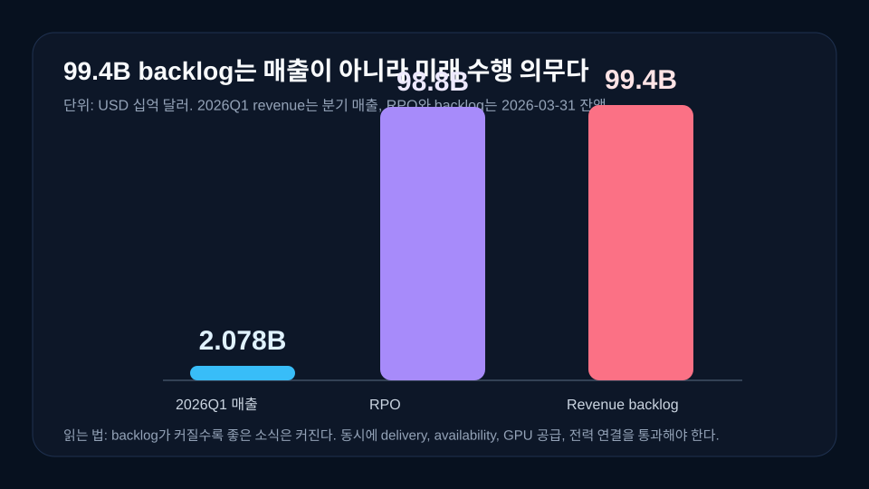
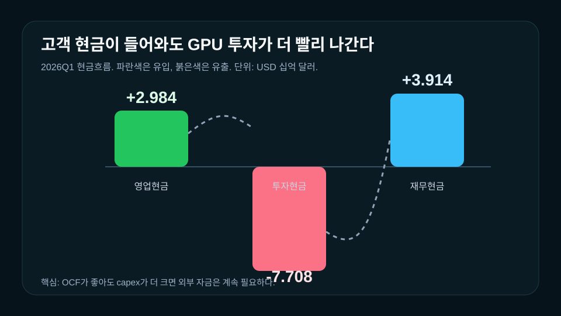
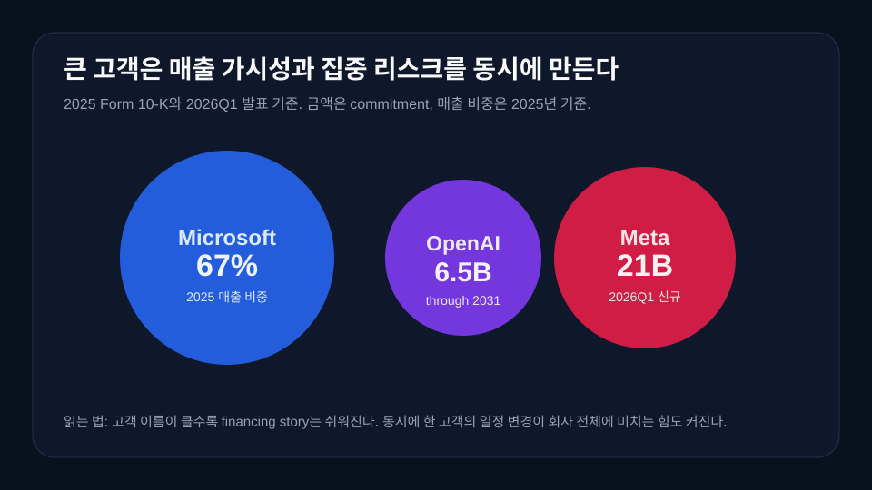
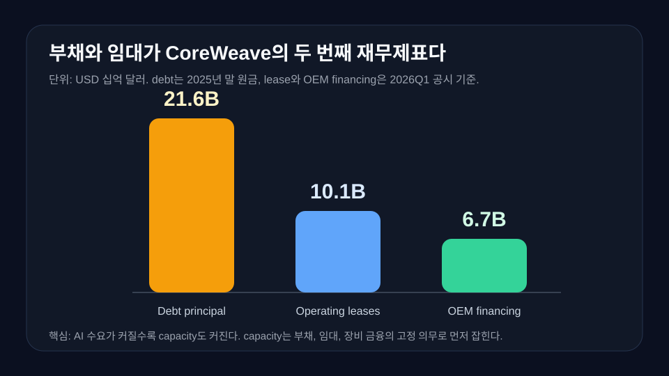
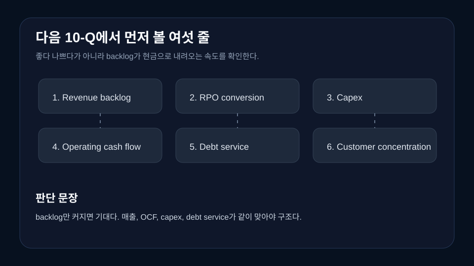

> **데이터 기준**: 2026-07-15 dartlab 실측 + CoreWeave 2025 Form 10-K + CoreWeave 2026 Q1 Form 10-Q + CoreWeave 2026 Q1 공식 실적 발표. 금액 단위는 USD, 본문 표기는 십억 달러(B)와 백만 달러(M)를 같이 쓴다.
>
> **핵심 숫자**: 2026Q1 매출 **2.078B** · 영업손실 **144M** · 이자비용 **536M** · 순손실 **740M** · 영업현금흐름 **2.984B** · 투자현금유출 **7.708B** · revenue backlog **99.4B**.
>
> **이 글의 용어**: revenue backlog = CoreWeave가 정의한 미래 매출 풀. RPO, 즉 아직 수행하지 않은 계약 의무와 기존 committed customer contracts에서 회사가 미래에 인식할 것으로 추정하는 금액을 합친 것이다. 매출이 아니다. 고객에게 compute capacity를 제공하고 availability 조건을 만족해야 매출이 된다.

---

## 프롤로그 - AI 수요는 계약서에 찍히지만, 먼저 장비로 산다

CoreWeave는 지금 가장 읽기 좋은 EDGAR 종목 중 하나다. 이유는 단순하다. 회사가 2025년 3월 Nasdaq에 CRWV로 상장했고, 2026년 1분기에는 AI 클라우드 수요가 공시 숫자로 크게 찍혔다. revenue backlog 99.4B, Meta 신규 21B commitment, NVIDIA 2B Class A common stock investment, active power 1GW 돌파. 숫자만 보면 "AI 인프라의 다음 주인공"이라는 말이 바로 나온다.

그런데 CoreWeave를 그렇게만 읽으면 가장 중요한 줄을 놓친다. 이 회사는 소프트웨어처럼 보이지만 몸은 데이터센터다. 고객이 AI 모델을 돌리려면 GPU 서버, 네트워크 장비, 스토리지, 전력, 냉각, 데이터센터 임대, 운영팀이 먼저 있어야 한다. 주문이 들어오면 매출이 바로 찍히는 구조가 아니다. CoreWeave가 먼저 장비와 전력을 확보하고, 그 장비를 고객이 쓰는 기간 동안 매출로 회수한다.


그래서 이 글의 질문은 하나다. **CoreWeave는 AI 수요가 폭발하는 회사인가, 아니면 그 수요를 먼저 빚으로 사오는 회사인가.** 둘 다 맞다. 수요는 크다. 하지만 그 수요를 매출로 바꾸려면 GPU와 데이터센터를 먼저 확보해야 한다. 그 과정에서 부채, 임대, 장비 금융, 고객 선급금, 대형 고객 집중이 한꺼번에 따라온다.

기존 기업이야기에서 [NVIDIA](/blog/NVDA-nvidia)는 GPU 공급의 최상단을 보여줬고, [Dell Technologies](/blog/DELL-dell-technologies)는 AI 서버 조립과 인프라 판매를 보여줬다. [GE Vernova](/blog/GEV-ge-vernova)는 데이터센터 전력 수요가 전력망과 터빈 backlog로 번역되는 장면을 보여줬다. CoreWeave는 그 사이에 있다. GPU를 사서 데이터센터에 묶고, 고객에게 AI 계산 시간을 파는 회사다.

이 위치가 흥미로운 이유는 재무제표가 한 방향으로만 움직이지 않기 때문이다. 2026년 1분기 매출은 2.078B로 전년 동기 982M보다 112% 늘었다. 하지만 영업손실은 144M, 순손실은 740M이다. 같은 분기 영업현금흐름은 2.984B로 커졌지만, 투자현금유출은 7.708B였다. 고객 계약은 크지만 투자도 더 크다. 바로 이 간격이 CoreWeave의 진짜 이야기다.

---

## 막1 - 99.4B backlog가 먼저 보인다

CoreWeave를 읽을 때 가장 먼저 보이는 숫자는 revenue backlog 99.4B다. 2026년 1분기 발표에서 회사는 March 31, 2026 기준 revenue backlog가 99.4B라고 밝혔다. 그 안에는 RPO 98.8B와 기존 committed customer contracts에서 미래에 인식할 것으로 추정한 0.6B가 들어 있다. 쉽게 말하면 "이미 고객과 약속해 둔 미래 매출 후보"에 가깝다.

이 숫자가 큰 이유는 고객 계약이 길고 크기 때문이다. CoreWeave는 2026년 1분기 Meta와 여러 신규 계약을 맺었고, 그중 March에 체결한 신규 commitment가 21B라고 밝혔다. Anthropic과도 multi-year agreement를 맺었다. 기존 고객과 AI native, enterprise 고객 확장도 같이 언급됐다. AI 수요가 공시 숫자로 보이는 장면이다.



하지만 여기서 바로 멈추면 안 된다. backlog는 매출이 아니다. 고객이 계약했다고 해서 바로 손익계산서에 매출로 들어오지 않는다. CoreWeave는 capacity를 제공해야 하고, 고객이 쓸 수 있는 상태를 만들어야 한다. delivery와 availability 조건을 충족해야 한다. 데이터센터가 늦어지거나 GPU 공급이 늦어지거나 전력 연결이 늦어지면, backlog는 숫자로 남아 있어도 매출 인식은 밀릴 수 있다.

2025년 Form 10-K도 같은 경고를 준다. 2025년 말 RPO는 60.7B였고, 회사는 이 중 43%가 2027년 12월 31일까지의 첫 24개월에 인식될 것으로 예상한다고 적었다. 나머지는 그 뒤 25~48개월, 49~84개월에 걸쳐 인식된다. 즉 backlog는 "곧장 매출"이 아니라 여러 해 동안 풀리는 시간표다.

그래서 CoreWeave의 99.4B를 볼 때 독자가 해야 할 질문은 "크다"가 아니다. **이 큰 약속을 실제 장비와 전력, 고객 사용량, 현금 회수로 바꾸는 속도가 충분한가**다. 좋은 backlog는 매출과 현금으로 내려온다. 나쁜 backlog는 장비 부족, 전력 부족, 고객 일정 변경, 높은 이자비용 앞에서 천천히 풀린다.

이 차이를 이해하면 CoreWeave가 단순한 AI 테마주가 아니라는 점이 보인다. 이 회사의 매력은 수요가 있다는 것이다. 이 회사의 위험은 수요를 실행하려면 먼저 돈과 장비를 크게 걸어야 한다는 것이다. 그래서 다음 막은 제품 소개가 아니라 이 회사의 몸을 보는 데서 시작해야 한다.

---

## 막2 - 제품은 클라우드지만 몸은 데이터센터다

CoreWeave 홈페이지를 보면 GPU compute, NVIDIA Blackwell, Hopper, bare metal servers, networking, object storage, managed Kubernetes, observability 같은 말이 나온다. 모두 클라우드 서비스처럼 들린다. 고객 입장에서는 맞다. 고객은 모델을 학습하고, inference를 돌리고, agentic AI workload를 운영하기 위해 CoreWeave의 cloud platform을 쓴다.

하지만 투자자가 재무제표를 읽을 때는 이 단어들을 원가 항목으로 번역해야 한다. GPU compute는 GPU 서버다. Networking은 스위치와 광케이블과 데이터센터 네트워크다. Storage는 장비와 소프트웨어 라이선스다. Managed Kubernetes와 observability도 결국 운영 인력과 소프트웨어 투자 위에서 돌아간다. 그리고 이 모든 것은 전력과 냉각 없이는 아무 의미가 없다.


2026년 1분기 발표에서 회사는 active power가 1GW를 넘었고, 2030년에는 8GW 이상으로 가는 길 위에 있다고 말했다. total contracted power도 3.5GW 이상으로 늘었다. GW라는 단위가 중요하다. 소프트웨어 회사는 보통 데이터 전송량이나 가입자 수를 말한다. CoreWeave는 전력을 말한다. 이 회사의 성장은 전기와 부동산과 장비 조달 위에서 선다.

손익계산서도 이 사실을 보여준다. 2026년 1분기 cost of revenue는 716M이었다. 회사는 이 증가가 데이터센터 rent expense, utilities and power spend, power installation and distribution systems의 depreciation and amortization 때문이라고 설명했다. 쉽게 말하면 데이터센터를 빌리고, 전기를 쓰고, 전력 설비를 깔고, 그 설비의 감가상각을 반영했다는 뜻이다.

Technology and infrastructure expense도 1.273B였다. 2025년 1분기 561M에서 127% 증가했다. 이 비용 증가는 platform, servers, switches, networking equipment fixed assets가 placed in service 되면서 발생한 depreciation and amortization과 연결된다. AI 클라우드가 잘 팔려도, 장비가 먼저 재무제표에 들어오는 구조다.

여기서 CoreWeave를 [Dell Technologies](/blog/DELL-dell-technologies)와 같이 보면 좋다. Dell은 AI 서버 수요를 장비 판매와 backlog로 본다. CoreWeave는 그 장비를 사서 고객에게 사용 시간과 capacity로 판다. 같은 AI 인프라라도 수익 모델이 다르다. Dell은 장비 판매의 margin과 운전자본이 중요하고, CoreWeave는 장비를 몇 년 동안 얼마나 높은 utilization과 가격으로 돌리느냐가 중요하다.

따라서 CoreWeave의 제품은 클라우드지만, 재무제표의 몸은 데이터센터다. 이 사실을 알면 다음 숫자가 바로 이해된다. 매출이 크게 늘어도 영업손실과 이자비용이 동시에 커질 수 있다. 고객이 늘어도 capex가 더 빨리 나갈 수 있다. 장비를 먼저 사야 매출이 나중에 온다.

---

## 막3 - 매출은 뛰지만 손익계산서는 아직 이자를 이기지 못한다

2026년 1분기 CoreWeave의 매출은 2.078B였다. 전년 동기 982M보다 112% 늘었다. 이 정도 성장률은 강하다. 회사는 기존 고객 확장과 신규 고객이 모두 기여했다고 설명했다. 약 38%의 증가분은 기존 고객 확장에서 왔고, 나머지는 신규 고객에서 왔다.

그런데 같은 손익계산서에서 영업손실은 144M이다. 매출총이익은 1.362B였지만, operating expenses가 2.222B로 더 컸다. cost of revenue 716M, technology and infrastructure 1.273B, sales and marketing 69M, general and administrative 164M이 합쳐진 결과다. 매출은 뛰는데 비용도 장비와 인프라 확장 속도에 맞춰 같이 뛴다.

이보다 더 중요한 줄은 이자비용이다. 2026년 1분기 interest expense, net은 536M이었다. 전년 동기 264M의 두 배가 넘는다. 회사는 증가 원인을 increased borrowing levels and total debt obligations라고 적었다. 쉽게 말해 더 많이 빌렸고, 그 빚의 비용이 손익계산서를 누른다는 뜻이다.

| 손익계산서 핵심 줄 | 2025Q1 | 2026Q1 | 해석 |
|---|---:|---:|---|
| Revenue | 982M | 2.078B | AI cloud demand가 매출로 확인됨 |
| Operating loss | -27M | -144M | 매출 증가에도 인프라 비용이 더 큼 |
| Interest expense, net | -264M | -536M | 차입과 장비 금융 비용이 커짐 |
| Net loss | -315M | -740M | 영업손실보다 이자비용 영향이 더 크게 보임 |

여기서 초보자가 헷갈리기 쉬운 점이 있다. "매출총이익이 이렇게 큰데 왜 적자지?"라는 질문이다. CoreWeave의 Q1 2026 gross profit은 1.362B다. 매출총이익률로 보면 약 65.5%다. 겉으로는 좋아 보인다. 하지만 이 회사는 매출원가 밑에 technology and infrastructure expense가 크게 들어간다. 서버와 네트워크, 플랫폼 인프라의 감가상각과 인력이 여기 있다. 그래서 gross margin만 보고 좋은 회사라고 결론 내리면 안 된다.

여기서 독자가 헷갈리기 쉬운 숫자가 adjusted EBITDA다. 2026년 1분기 adjusted EBITDA는 1.157B이고 margin은 56%였다. 이 숫자는 "이자와 감가상각을 빼고 보면 운영 규모가 얼마나 큰가"를 보여준다. 그래서 수요가 강하다는 신호로는 쓸 수 있다. 하지만 CoreWeave 같은 회사에서 이자와 감가상각은 주변 비용이 아니다. GPU와 데이터센터를 먼저 사기 때문에 생기는 핵심 비용이다. 따라서 adjusted EBITDA를 보고 "빚과 장비 부담을 이미 이겼다"고 읽으면 안 된다.

CoreWeave의 손익계산서는 성장과 부담을 동시에 말한다. 매출 성장률은 강하다. 매출총이익도 크다. 하지만 이 회사는 아직 영업이익으로 이자비용을 덮지 못한다. 그래서 다음에는 현금흐름표를 봐야 한다. 손익계산서는 약속을 못 푼다. 현금흐름표가 "고객이 실제로 돈을 먼저 냈는지, 회사가 그 돈보다 더 많이 투자했는지"를 보여준다.

---

## 막4 - 고객 선급금이 들어와도 GPU 투자가 더 빨리 나간다

2026년 1분기 CoreWeave의 영업현금흐름은 2.984B였다. 전년 동기 61M과 비교하면 엄청난 개선이다. 회사는 고객에게 받은 현금이 늘었고, 비용을 실제로 지급한 시점도 영향을 줬다고 설명했다. 쉽게 말해 고객 계약이 커지고, 일부 고객이 돈을 먼저 넣으면 영업현금흐름이 좋아질 수 있다.

하지만 현금흐름표는 여기서 끝나지 않는다. 같은 분기 투자현금유출은 7.708B였다. 회사는 이 증가가 GPU fleet, networking equipment, servers, switches, infrastructure asset security 등 higher capital investments 때문이라고 설명했다. 즉 고객에게서 현금이 들어왔지만, 그보다 더 큰 돈이 장비와 데이터센터 인프라로 나갔다.



이 구조를 쉽게 말하면 이렇다. 고객이 앞으로 AI workload를 돌리겠다고 큰 계약을 한다. CoreWeave는 그 고객을 위해 capacity를 확보해야 한다. capacity는 말로 생기지 않는다. GPU 서버를 사고, 데이터센터 공간을 확보하고, 전력 연결과 네트워크를 깔아야 한다. 그래서 고객 계약이 커질수록 투자현금유출도 커진다.

2025년 연간 현금흐름도 같은 그림이다. 영업현금흐름은 3.058B였지만, 투자현금유출은 10.271B였다. 회사는 2025년 투자현금유출 증가가 GPU fleet, networking equipment, servers, switches and other necessary equipment for infrastructure asset security에 대한 higher capital investments 때문이라고 설명했다. AI 수요가 클수록 먼저 사야 할 물건도 커진다.

그 결과 재무현금흐름이 필요하다. 2026년 1분기 net cash provided by financing activities는 3.914B였다. 2025년 연간으로도 재무현금흐름은 9.308B였다. 이 회사가 현금을 못 받는다는 뜻이 아니다. 고객에게서 현금이 들어와도, 성장 속도를 맞추려면 외부 자금이 계속 필요하다는 뜻이다.

여기서 CoreWeave의 좋은 점과 위험이 동시에 나온다. 좋은 점은 고객이 선급금과 장기 계약으로 회사에 cash visibility를 준다는 점이다. 위험은 그 현금이 자유롭게 남는 돈이 아니라, 장비와 데이터센터 투자로 바로 연결되는 돈이라는 점이다. 고객이 먼저 낸 돈은 축하금이 아니라 "이 capacity를 제때 만들어 달라"는 약속에 가깝다.

그래서 CoreWeave를 볼 때 free cash flow라는 단어를 조심해야 한다. 일반 소프트웨어 회사처럼 "영업현금흐름이 크니 곧 현금이 남겠지"라고 생각하면 틀릴 수 있다. 이 회사에서는 영업현금흐름과 설비투자를 같이 봐야 한다. 영업현금흐름이 좋아져도 GPU와 데이터센터에 나가는 돈이 더 빠르면, 회사는 계속 외부 자금이 필요하다.

---

## 막5 - 고객이 크다는 것은 장점이면서 약점이다

CoreWeave의 고객은 작지 않다. 2026년 1분기 발표에는 Meta 21B 신규 commitment, Anthropic multi-year agreement, Cohere, Jane Street, Mistral, Perplexity, World Labs 같은 이름이 나온다. AI labs와 hyperscalers가 고객이라는 것은 강한 신뢰 신호다. 작은 고객을 수천 개 모아야 하는 회사와 다르게, CoreWeave는 대형 고객 한 건이 수년치 매출 가시성을 만든다.

하지만 EDGAR 공시는 이 장점을 바로 위험으로 바꿔 적는다. 2025년 Form 10-K에 따르면 2025년 매출의 약 67%가 top customer인 Microsoft에서 나왔다. 2024년에는 top two customers가 매출의 약 77%를 차지했고, 2023년에는 top three customers가 약 73%를 차지했다. 이 회사의 매출은 대형 고객에게 크게 기대고 있다.



이것은 무조건 나쁜 일이 아니다. AI 인프라 시장에서 가장 큰 고객은 당연히 AI labs와 hyperscalers다. 그들이 장기 계약을 맺고 capacity를 예약하면 CoreWeave는 은행과 장비 공급자에게 더 설득력 있게 말할 수 있다. "우리는 고객이 있다. 이 capacity를 만들면 쓸 사람이 있다." 이 문장이 부채 조달과 장비 금융의 근거가 된다.

문제는 방향이 반대로도 작동한다는 점이다. 한 대형 고객이 자체 GPU 클라우드로 일부 workload를 옮기거나, 모델 학습 일정이 늦어지거나, inference 수요가 예상보다 천천히 늘면 CoreWeave의 capacity 계획이 흔들릴 수 있다. 공시는 top customers가 자체 서비스를 개발하거나, 기존 관계 때문에 구매 결정을 바꾸거나, 갱신과 사용량을 줄일 수 있다고 경고한다.

OpenAI와 Meta 이야기도 같은 방식으로 읽어야 한다. 2025년 10-K는 OpenAI가 2031년 5월 31일까지 약 6.5B를 지불하기로 committed했다고 적고, Meta도 2031년 12월까지 약 14.2B를 initially committed했다고 적었다. 2026년 1분기에는 Meta와 신규 21B commitment가 더해졌다. 이 숫자는 강하다. 동시에 이 숫자는 CoreWeave가 몇몇 초대형 고객 일정에 깊게 묶인다는 뜻이다.

초보자에게는 이렇게 정리하면 된다. 작은 고객이 많으면 한 고객이 떠나도 회사가 버틴다. 큰 고객이 많으면 성장 속도는 빠르지만, 그 고객의 일정이 회사의 일정이 된다. CoreWeave는 두 번째 유형에 가깝다. 그래서 고객 이름이 화려할수록, 다음 공시에서는 고객 집중도와 RPO 인식 속도를 함께 봐야 한다.

---

## 막6 - NVIDIA는 공급자이면서 주주이고 기준점이다

CoreWeave 이야기에 NVIDIA를 빼면 안 된다. 이 회사가 파는 것은 결국 NVIDIA GPU 위의 AI compute capacity에 가깝다. 2026년 1분기 발표에서 CoreWeave는 NVIDIA GB200 NVL72 inference의 NVIDIA Exemplar Cloud로 이름을 올렸고, NVIDIA가 2B Class A common stock investment를 했다고 밝혔다. 또한 2030년까지 5GW 이상의 AI factories build-out을 가속한다는 협력도 언급했다.

이것은 강한 장점이다. AI 인프라에서 GPU 공급 접근성은 제품 경쟁력이다. 고객은 최신 GPU를 빨리 쓰고 싶어 한다. CoreWeave가 NVIDIA 생태계와 가깝다는 것은 장비 조달, 성능 검증, 고객 신뢰 측면에서 유리하게 작동할 수 있다. 그래서 CoreWeave는 단순 호스팅 회사가 아니라 AI-native cloud라고 자신을 설명한다.


하지만 이 관계도 한쪽으로만 읽으면 안 된다. NVIDIA와 가까운 것은 강점이지만, 동시에 특정 GPU 세대와 공급망에 묶이는 일이다. 고객이 원하는 칩 세대가 바뀌면 CoreWeave는 장비를 계속 갱신해야 한다. 10-K는 infrastructure components의 useful life estimate와 redeployment 리스크를 언급한다. GPU는 영원히 같은 가격으로 같은 성능을 내는 자산이 아니다.

여기서 [NVIDIA 기업이야기](/blog/NVDA-nvidia)와 연결된다. NVIDIA는 AI 수요의 상단에서 칩과 플랫폼을 판다. CoreWeave는 그 칩을 데이터센터 capacity로 바꿔 판다. NVIDIA의 강한 제품 사이클은 CoreWeave에게 수요를 만들어 준다. 하지만 CoreWeave는 그 제품 사이클을 따라 장비를 사야 한다. 좋은 GPU는 좋은 상품이지만, 동시에 큰 설비투자다.

또한 CoreWeave는 GPU만으로 끝나지 않는다. 네트워크, 스토리지, Kubernetes, 관찰 도구, 작업 최적화, 고객 지원까지 붙어야 한다. 고객이 원하는 것은 칩 한 장이 아니라 대규모 AI 작업을 안정적으로 돌릴 수 있는 환경이다. 이 지점에서 CoreWeave는 대형 클라우드 기업과 경쟁하면서도 자신만의 틈을 만든다.

결론은 이렇다. NVIDIA와의 관계는 CoreWeave의 신뢰를 높인다. 하지만 그 관계가 수익성을 보장하지는 않는다. 핵심은 최신 GPU를 얼마나 좋은 조건으로 확보하고, 그 장비를 얼마나 빠르게 높은 utilization으로 돌리고, 이자와 감가상각을 이길 가격으로 팔 수 있느냐다.

---

## 막7 - 부채와 임대가 이 회사의 두 번째 재무제표다

CoreWeave의 진짜 긴장은 여기서 나온다. 2025년 말 total principal of debt는 21.615B였다. 이 중 2026년에 갚아야 할 current debt는 6.708B였다. total debt net of unamortized discount and issuance costs는 21.373B였다. 2024년 말 total debt net 7.926B에서 크게 늘었다.

2026년 1분기 공시는 더 직접적인 문장을 준다. 회사는 DDTL 4.0 Facility, 2030 Senior Notes, 2031 Senior Notes, 2031 Convertible Notes, April 2026 Additional 2031 Senior Notes와 2032 Convertible Notes를 설명한다. 그리고 debt 외에도 operating lease liabilities가 10.1B라고 적는다. 데이터센터를 임대해서 쓰는 회사라면 임대 의무도 사업의 일부다.



OEM and Software License Financing Arrangements도 있다. 2025년 말 aggregate notional balance는 5.2B였고, 2026년 1분기에는 6.7B로 늘었다. 이 이름이 어려우면 이렇게 보면 된다. 장비와 소프트웨어 라이선스를 사기 위해 별도 금융 arrangements를 쓴다는 뜻이다. GPU 클라우드는 제품이 빠르게 낡기 때문에 장비 금융 구조도 중요해진다.

이 부채 구조는 무조건 나쁘다는 뜻이 아니다. 고객 계약이 크고 장기라면, 그 계약을 담보로 장비를 확보하는 것은 자연스러운 성장 방식일 수 있다. 오히려 CoreWeave는 Q1 2026에 DDTL 4.0 Facility를 8.5B 규모로 secured했고, 회사는 이를 first-of-its-kind non-recourse investment grade rated delayed draw term loan facility라고 설명했다. 자본시장이 이 사업 구조를 어느 정도 인정했다는 뜻이다.

문제는 이 구조가 실수를 용서하지 않는다는 점이다. 2026년 1분기에 빚의 원금과 이자를 갚는 데 나간 현금은 1.8B였다. 그 안에는 원금 상환 1.3B와 이자 지급 459M이 포함됐다. 같은 분기 영업현금흐름이 3.0B였으니 버틸 수 있어 보인다. 하지만 설비투자와 원리금 상환이 동시에 커지면 여유는 빠르게 줄어든다.

10-Q는 high level of debt의 consequences를 직접 적는다. debt service obligations가 커지고, additional financing이 어려워질 수 있고, business opportunities와 competitive pressures에 대응하는 flexibility가 줄어들 수 있다. 특히 customer가 CoreWeave의 financial obligations를 걱정해 계약을 꺼릴 수도 있다고 적는다. 이것은 고객 신뢰가 재무구조와 연결된다는 뜻이다.

CoreWeave를 은행 빚 많은 회사로만 보면 또 틀린다. 이 회사의 부채는 고객 계약, GPU 구매, 데이터센터 capacity, 임대, 장비 금융과 붙어 있다. 문제는 debt 자체가 아니라 **debt가 만드는 capacity가 충분히 빨리 매출과 현금으로 바뀌는가**다. 이 질문 하나로 이 회사의 좋은 이야기와 나쁜 이야기가 갈린다.

---

## 막8 - 이 이야기가 틀리는 조건

CoreWeave의 좋은 이야기는 분명하다. AI labs와 hyperscalers가 더 많은 GPU capacity를 원하고, CoreWeave가 그 capacity를 빠르게 확보하며, 고객 계약이 revenue backlog로 쌓이고, backlog가 높은 utilization과 가격으로 매출화된다. 이 흐름이 이어지면 CoreWeave는 AI 인프라의 핵심 운영자가 될 수 있다.

하지만 이 이야기가 틀리는 조건도 분명하다. 첫째, backlog가 실제 매출로 늦게 풀리는 경우다. 고객 commitment가 크더라도 delivery, availability, 고객 프로젝트 일정이 맞지 않으면 매출 인식이 밀린다. RPO가 크다는 사실보다, 몇 분기 동안 revenue와 cash로 얼마나 내려오는지가 중요하다.

둘째, 설비투자가 매출보다 계속 더 빨리 커지는 경우다. 2026년 1분기 투자현금유출 7.708B는 매우 크다. 성장기에는 당연한 면이 있지만, 이 흐름이 반복되면 외부 자금 의존이 계속된다. 자본시장이 좋을 때는 괜찮다. 금리가 높거나 AI 관련 투자심리가 식으면 같은 전략이 더 비싸진다.

셋째, 고객 집중이 문제가 되는 경우다. Microsoft, OpenAI, Meta 같은 고객은 강한 장점이다. 그러나 고객이 소수라는 것은 그들의 일정, 전략, 자체 인프라 계획, 모델 수요 변화가 CoreWeave에 바로 영향을 준다는 뜻이다. 한 고객의 사용량 변경이 전체 성장을 흔들 수 있다.

넷째, GPU 세대 전환이 기존 장비의 경제성을 누르는 경우다. AI 인프라 시장은 빠르게 움직인다. 고객이 더 최신 GPU와 더 낮은 비용을 원하면, CoreWeave는 장비 갱신과 재배치 문제를 계속 풀어야 한다. useful life estimate가 틀리거나 redeployment가 어렵다면 감가상각과 asset write-down 위험이 커진다.

다섯째, 이자비용과 원리금 상환이 영업현금흐름을 따라잡는 경우다. Q1 2026 이자비용은 536M이었고 원금과 이자를 갚는 데 나간 현금은 1.8B였다. 영업현금흐름이 3.0B라면 지금은 감당 가능해 보인다. 하지만 설비투자, 임대 의무, 원금 상환이 같이 커지는 회사에서는 "매출 성장"만으로 안정성을 말할 수 없다.

이 다섯 조건이 CoreWeave의 체크리스트다. AI 수요가 강하다는 문장은 첫 줄일 뿐이다. 끝까지 봐야 할 것은 미래 계약이 실제 매출로 바뀌는 속도, 설비투자의 속도, 고객 집중, 장비 세대 전환, 원리금 상환이다.

---

## 막9 - 다음 10-Q에서 15분 안에 업데이트하는 법

CoreWeave의 다음 10-Q가 나오면 모든 줄을 다 볼 필요는 없다. 먼저 여섯 줄만 보면 된다. 첫 번째는 미래 계약 풀과 RPO다. 이 숫자가 늘었는지, 그리고 그 약속이 실제 매출로 얼마나 내려왔는지 본다. 계약 풀만 늘고 매출 전환이 느리면 기대만 커질 수 있다.

두 번째는 매출 성장과 영업손실이다. 매출이 계속 두 배 가까이 늘어도 영업손실이 같이 커지면 가격과 비용의 균형이 아직 약한 것이다. 반대로 매출 성장률이 낮아져도 영업손실이 줄면 사업이 조금씩 단단해지는 신호일 수 있다.

세 번째는 영업현금흐름이다. 고객 선급금과 장기 계약이 실제 현금으로 들어오는지 확인한다. 단, 이 숫자만 보면 안 된다. 네 번째 줄인 설비투자와 투자현금유출을 바로 옆에 둬야 한다. 영업현금흐름이 3B라도 설비투자가 8B이면 외부 자금 의존은 줄지 않는다.

다섯 번째는 원리금 상환과 이자비용이다. 영업이익이 아직 약한 회사에서 이자비용은 실제 부담이다. 이자비용이 매출보다 느리게 늘어나는지, 원금 상환이 영업현금흐름 안에서 감당되는지 본다.

여섯 번째는 고객 집중이다. Microsoft, OpenAI, Meta 같은 큰 고객의 약정이 늘면 좋다. 동시에 한 고객이 매출에서 차지하는 비중이 너무 높게 유지되면 위험도 같이 남는다. 고객이 많아지는지, 아니면 더 큰 몇 개 이름으로 더 좁아지는지 확인해야 한다.



| 확인 순서 | 봐야 할 줄 | 좋은 신호 | 나쁜 신호 |
|---|---|---|---|
| 1 | Revenue backlog와 RPO | RPO가 revenue로 꾸준히 내려옴 | backlog만 커지고 revenue conversion이 느림 |
| 2 | Revenue와 operating loss | 매출 증가와 손실 축소가 같이 나타남 | 매출은 늘지만 영업손실도 확대 |
| 3 | Operating cash flow | 고객 현금 유입이 반복적으로 강함 | 일회성 timing 효과에 의존 |
| 4 | Capex와 investing cash outflow | capacity 투자 후 utilization이 빠르게 올라감 | capex가 계속 revenue보다 앞질러 감 |
| 5 | 이자비용과 원리금 상환 | 영업현금흐름 안에서 이자와 원금 상환을 감당 | 이자비용과 상환액이 빠르게 커짐 |
| 6 | Customer concentration | 신규 고객과 기존 고객 확장이 균형 | 소수 고객 의존도가 더 커짐 |

이 표만 있으면 CoreWeave의 다음 발표를 빠르게 읽을 수 있다. 핵심은 "AI 수요가 있나"가 아니다. 이미 수요는 숫자로 보인다. 질문은 그 수요를 감당하는 재무 구조가 수요보다 더 빨리 무거워지는가, 아니면 매출과 현금이 그 무게를 따라잡는가다.

---

## 에필로그 - CoreWeave는 AI 수요의 통행료가 아니라 선불 공장이다

CoreWeave를 "AI 수요의 통행료를 받는 회사"처럼 말하면 쉽다. 고객이 GPU를 쓰고, 회사가 사용료를 받는다. 하지만 공시를 보면 더 정확한 문장은 따로 있다. **CoreWeave는 AI 수요를 먼저 장비와 전력과 임대로 사와서, 나중에 고객 사용량과 장기 계약으로 회수하는 선불 공장이다.**

이 문장이 중요한 이유는 투자자가 봐야 할 줄을 바꿔 주기 때문이다. 제목은 99.4B 미래 계약 풀이다. 본문은 설비투자, 차입금, 임대 의무, 고객 집중이다. 2026년 1분기 매출 2.078B와 영업현금흐름 2.984B는 강하다. 하지만 투자현금유출 7.708B와 이자비용 536M, 2025년 말 총부채 원금 21.615B는 이 회사가 어떤 방식으로 성장하는지 보여준다.

그래서 CoreWeave의 좋은 이야기는 계속 가능하다. AI workload가 늘고, inference 시장이 커지고, NVIDIA 최신 GPU capacity에 대한 수요가 높고, hyperscaler와 AI labs가 장기 계약을 유지하면 CoreWeave의 capacity는 매우 귀한 자산이 된다. 반대로 고객 일정이 밀리거나, GPU 세대 전환이 빠르거나, 자본 조달 비용이 올라가면 같은 capacity가 부담이 된다.

CoreWeave는 [NVIDIA](/blog/NVDA-nvidia), [Dell Technologies](/blog/DELL-dell-technologies), [GE Vernova](/blog/GEV-ge-vernova), [Micron](/blog/MU-micron), [반도체 냉각 기술 이야기](/blog/semiconductor-cooling-network)와 같이 읽으면 더 잘 보인다. AI 인프라는 한 회사가 아니라 여러 층의 재무제표에 나뉘어 찍힌다. NVIDIA에는 칩 마진이, Dell에는 서버 주문이, GE Vernova에는 전력 수주잔고가, Micron에는 메모리 사이클이, CoreWeave에는 GPU 클라우드 용량과 원리금 상환 부담이 남는다.

다음 CoreWeave 공시에서 먼저 볼 문장은 CEO 코멘트가 아니다. 미래 계약 풀, RPO의 매출 전환, 설비투자, 영업현금흐름, 이자비용, 원리금 상환, 고객 집중이다. 이 줄들이 같이 좋아지면 CoreWeave의 AI 클라우드 이야기는 실제 구조가 된다. 미래 계약만 커지고 설비투자와 부채가 더 빨리 무거워지면, 그것은 아직 기대다.

---

## 검증표

본문 인용 수치를 공식 공시와 dartlab 실측으로 분리한다. CoreWeave는 2025년 3월 상장한 최근 EDGAR 회사라 장기 시계열이 짧다. 그래서 연간 2023~2025 수치는 2025 Form 10-K, 최근 분기 수치는 2026 Q1 Form 10-Q와 dartlab CRWV panel을 기준으로 둔다.

| 본문 수치 | 출처 / 호출 | 결과 |
|---|---|---|
| 2025년 3월 Nasdaq CRWV public listing | [CoreWeave Investor Relations overview](https://investors.coreweave.com/overview/default.aspx) | 회사 공식 IR |
| 2026Q1 revenue 2.078B, 2025Q1 982M, 전년 대비 112% | [CoreWeave 2026 Q1 Form 10-Q](https://www.sec.gov/Archives/edgar/data/1769628/000176962826000222/crwv-20260331.htm) | 공식 공시 |
| 2026Q1 operating loss 144M, interest expense net 536M, net loss 740M | [CoreWeave 2026 Q1 Form 10-Q](https://www.sec.gov/Archives/edgar/data/1769628/000176962826000222/crwv-20260331.htm) | 공식 공시 |
| 2026Q1 adjusted EBITDA 1.157B, adjusted EBITDA margin 56% | [CoreWeave Q1 2026 results](https://investors.coreweave.com/news/news-details/2026/CoreWeave-Reports-Strong-First-Quarter-2026-Results/) | 회사 공식 IR, non-GAAP |
| 2026Q1 revenue backlog 99.4B | [CoreWeave Q1 2026 results](https://investors.coreweave.com/news/news-details/2026/CoreWeave-Reports-Strong-First-Quarter-2026-Results/) | 회사 공식 IR |
| 2026Q1 RPO 98.8B와 other future revenue 0.6B | [CoreWeave 1Q26 earnings presentation](https://s205.q4cdn.com/133937190/files/doc_financials/2026/q1/CoreWeave-1Q26-Earnings-Presentation.pdf) | 회사 공식 IR |
| 2026Q1 Meta 신규 21B commitment | [CoreWeave Q1 2026 results](https://investors.coreweave.com/news/news-details/2026/CoreWeave-Reports-Strong-First-Quarter-2026-Results/) | 회사 공식 IR |
| 2026Q1 active power 1GW 이상, contracted power 3.5GW 이상 | [CoreWeave Q1 2026 results](https://investors.coreweave.com/news/news-details/2026/CoreWeave-Reports-Strong-First-Quarter-2026-Results/) | 회사 공식 IR |
| 2026Q1 OCF 2.984B, investing cash outflow 7.708B, financing inflow 3.914B | [CoreWeave 2026 Q1 Form 10-Q](https://www.sec.gov/Archives/edgar/data/1769628/000176962826000222/crwv-20260331.htm) | 공식 공시 |
| 2026Q1 property and equipment purchase 7.695B | `dartlab.Company("CRWV").panel("CF")` | dartlab 실측 |
| 2025년 revenue 5.131B, 2024년 1.915B, 2023년 229M | [CoreWeave 2025 Form 10-K](https://www.sec.gov/Archives/edgar/data/1769628/000176962826000104/crwv-20251231.htm) | 공식 공시 |
| 2025년 net loss 1.167B, 2024년 net loss 863M | [CoreWeave 2025 Form 10-K](https://www.sec.gov/Archives/edgar/data/1769628/000176962826000104/crwv-20251231.htm) | 공식 공시 |
| 2025년 OCF 3.058B, investing cash outflow 10.271B, financing inflow 9.308B | [CoreWeave 2025 Form 10-K](https://www.sec.gov/Archives/edgar/data/1769628/000176962826000104/crwv-20251231.htm) | 공식 공시 |
| 2025년 RPO 60.7B, 이 중 43%가 2027년 말까지 첫 24개월에 인식될 것으로 예상 | [CoreWeave 2025 Form 10-K](https://www.sec.gov/Archives/edgar/data/1769628/000176962826000104/crwv-20251231.htm) | 공식 공시 |
| 2025년 top customer Microsoft revenue 약 67% | [CoreWeave 2025 Form 10-K](https://www.sec.gov/Archives/edgar/data/1769628/000176962826000104/crwv-20251231.htm) | 공식 공시 |
| OpenAI commitment up to 6.5B through May 31, 2031, Meta initial commitment up to 14.2B through December 2031 | [CoreWeave 2025 Form 10-K](https://www.sec.gov/Archives/edgar/data/1769628/000176962826000104/crwv-20251231.htm) | 공식 공시 |
| 2025년 말 total principal of debt 21.615B, current debt 6.708B, non-current debt 14.665B | [CoreWeave 2025 Form 10-K](https://www.sec.gov/Archives/edgar/data/1769628/000176962826000104/crwv-20251231.htm) | 공식 공시 |
| 2026Q1 operating lease liabilities 10.1B, OEM and software financing notional 6.7B | [CoreWeave 2026 Q1 Form 10-Q](https://www.sec.gov/Archives/edgar/data/1769628/000176962826000222/crwv-20260331.htm) | 공식 공시 |
| 2026Q1 debt service cash flows 1.8B, principal payments 1.3B, interest payments 459M | [CoreWeave 2026 Q1 Form 10-Q](https://www.sec.gov/Archives/edgar/data/1769628/000176962826000222/crwv-20260331.htm) | 공식 공시 |
숫자 해석의 경계는 분명하다. revenue backlog와 adjusted EBITDA는 회사가 제시한 non-GAAP 또는 보조 지표다. 본문에서는 GAAP 매출, 영업손실, 순손실, 영업현금흐름, 투자현금유출, 부채와 분리해서 썼다. CoreWeave를 볼 때는 "AI 수요"라는 말보다 그 수요가 실제 매출과 현금으로 내려오는 속도를 확인해야 한다.

---

## 공시 / Filings

CoreWeave는 최근 상장 회사라 장기 실적 비교보다 최근 공시의 정의와 범위가 더 중요하다. 특히 revenue backlog, adjusted EBITDA, DDTL, OEM financing, operating lease liabilities는 제목만 보고 읽으면 오해하기 쉽다.

- [CoreWeave Investor Relations](https://investors.coreweave.com/overview/default.aspx)
- [CoreWeave SEC filings](https://investors.coreweave.com/financials/sec-filings/default.aspx)
- [CoreWeave 2025 Form 10-K (SEC)](https://www.sec.gov/Archives/edgar/data/1769628/000176962826000104/crwv-20251231.htm)
- [CoreWeave 2026 Q1 Form 10-Q (SEC)](https://www.sec.gov/Archives/edgar/data/1769628/000176962826000222/crwv-20260331.htm)
- [CoreWeave Q1 2026 results](https://investors.coreweave.com/news/news-details/2026/CoreWeave-Reports-Strong-First-Quarter-2026-Results/)
- [CoreWeave 1Q26 earnings presentation](https://s205.q4cdn.com/133937190/files/doc_financials/2026/q1/CoreWeave-1Q26-Earnings-Presentation.pdf)
- [CoreWeave platform overview](https://www.coreweave.com/newsroom)

공시 원문을 읽을 때 가장 먼저 확인할 곳은 10-Q의 Results of Operations, Liquidity and Capital Resources, Cash Flows, Risk Factors다. 고객 집중은 10-K Risk Factors와 Notes의 Customer Concentration을 같이 본다. debt는 10-K Note 10 Debt와 10-Q Risk Factors를 같이 읽어야 current debt, non-current debt, lease liabilities, equipment financing을 섞지 않는다.

---

## 재무제표 - 최근 분기와 연간

> 단위는 USD 십억 달러 또는 백만 달러. 분기와 연간을 섞지 않기 위해 표를 나눴다. dartlab에서 직접 확인:
>
```python
import dartlab

c = dartlab.Company("CRWV")
incomeStatement = c.panel("IS")
cashFlow = c.panel("CF")
balanceSheet = c.panel("BS")
```

| 분기 핵심 ($B) | 2025Q1 | 2025Q2 | 2025Q3 | 2025Q4 | 2026Q1 |
|---|---:|---:|---:|---:|---:|
| Revenue | 0.982 | 1.213 | 1.365 | 1.572 | 2.078 |
| Gross profit | 0.719 | 0.900 | 0.996 | 1.063 | 1.362 |
| Operating income or loss | -0.027 | 0.019 | 0.052 | 자료 제한 | -0.144 |
| Interest expense | 0.257 | 0.256 | 0.283 | 0.351 | 0.427 |
| Net loss | -0.343 | -0.291 | -0.110 | -0.452 | -0.740 |

| 현금흐름 ($B) | 2025Q1 | 2025Q2 | 2025Q3 | 2025Q4 | 2026Q1 |
|---|---:|---:|---:|---:|---:|
| Operating cash flow | 0.061 | -0.251 | 1.689 | 1.559 | 2.984 |
| Investing cash flow | -1.433 | -2.442 | -2.470 | -3.926 | -7.708 |
| Property and equipment purchase | 1.407 | 2.453 | 2.389 | 4.060 | 7.695 |
| Financing cash flow | 1.854 | 2.229 | 1.696 | 3.529 | 3.914 |
| Debt repayment | 0.271 | 1.304 | 1.404 | 0.420 | 1.335 |

| 연간 핵심 ($B) | 2023 | 2024 | 2025 |
|---|---:|---:|---:|
| Revenue | 0.229 | 1.915 | 5.131 |
| Operating income or loss | -0.014 | 0.324 | -0.046 |
| Net loss | -0.594 | -0.863 | -1.167 |
| Operating cash flow | 1.833 | 2.749 | 3.058 |
| Investing cash flow | -3.148 | -8.658 | -10.271 |
| Financing cash flow | 1.788 | 7.464 | 9.308 |
| RPO or revenue backlog | 자료 제한 | 15.1 RPO | 60.7 RPO |

이 표의 핵심은 매출 성장률이 아니다. 매출이 커질수록 GPU fleet과 데이터센터 투자가 같이 커지고, 그 투자를 차입금, 임대 의무, 장비 금융이 받친다는 점이다. CoreWeave가 좋은 회사인지 보려면 99.4B backlog를 보고 박수칠 것이 아니라, 그 backlog가 다음 4~8분기 동안 매출과 영업현금흐름으로 내려오고 설비투자와 원리금 상환의 무게를 이기는지 봐야 한다.
