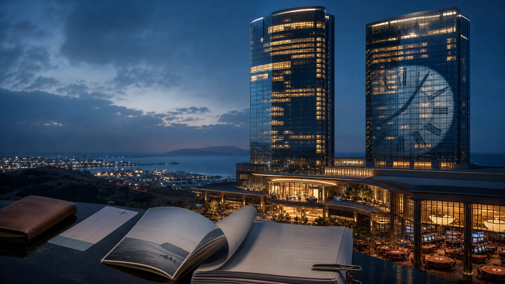
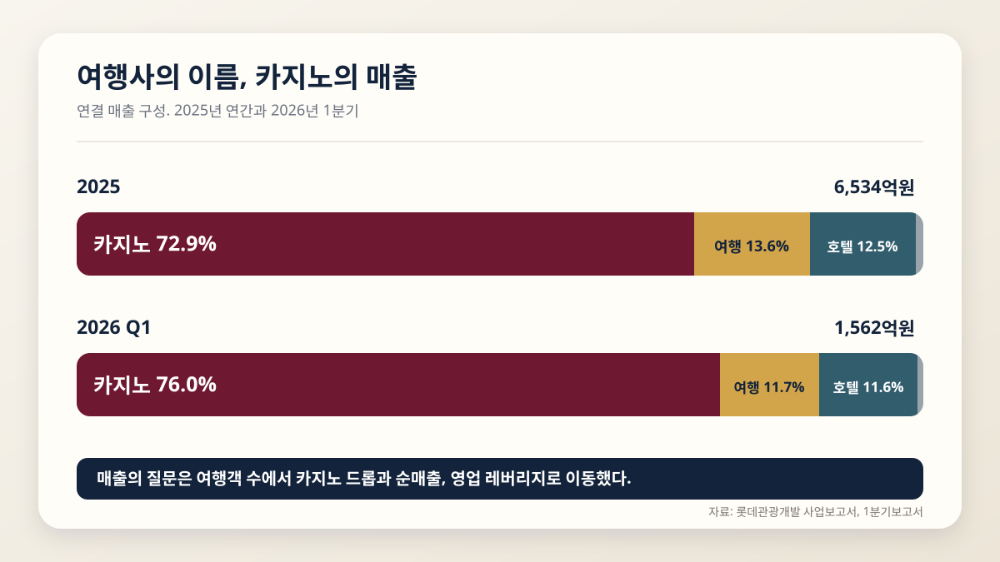
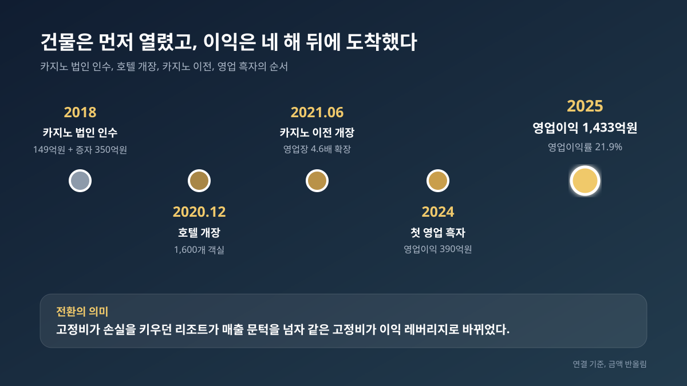
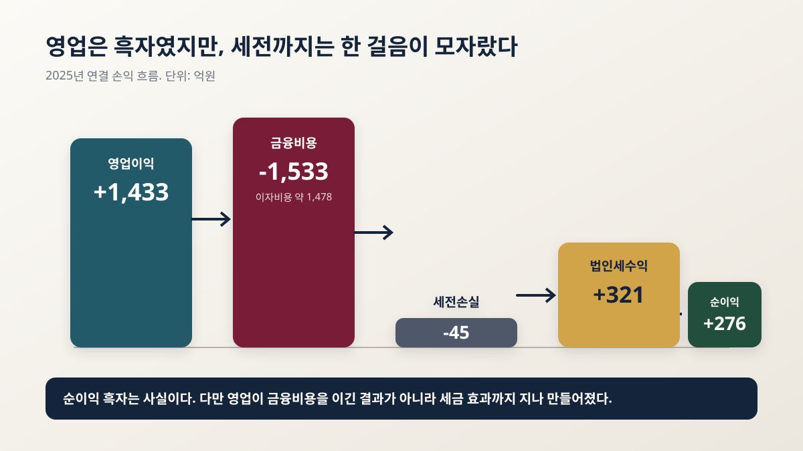
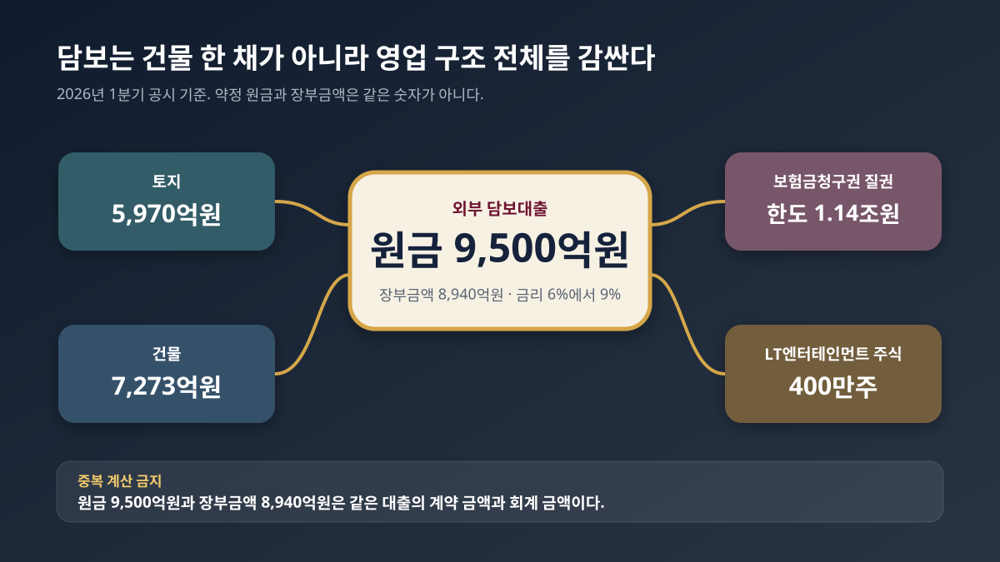
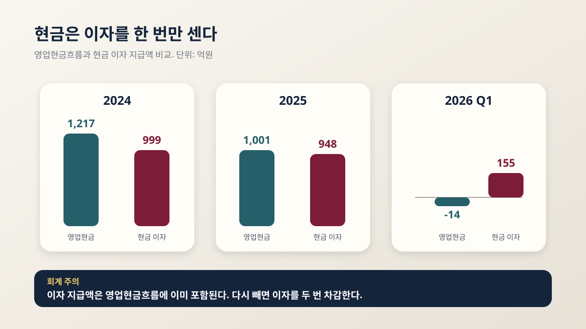
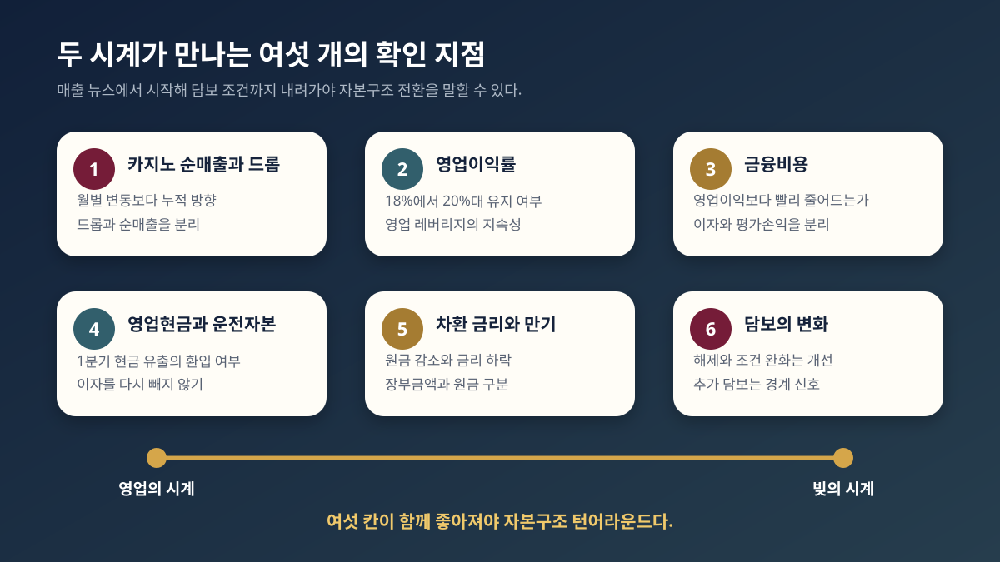

<script>
	import CompanyFinancials from '$lib/components/blog/CompanyFinancials.svelte';
</script>

> **주의**: 이 글은 투자 권유가 아니다. 목표가를 제시하지 않는다. 카지노 매출이 더 늘어난다는 예측이 아니라, 이미 좋아진 영업과 아직 무거운 자본구조를 같은 화면에서 읽는 글이다.
>
> **데이터 기준**: 2026-07-16 dartlab 실측, 롯데관광개발 2025년 사업보고서, 2026년 1분기보고서, 2026년 5월 월별 영업실적 공시. 재무 수치는 연결 기준이며 금액은 반올림했다.
>
> **핵심 숫자**: 2025년 매출 **6,534억원** · 카지노 비중 **72.9%** · 영업이익 **1,433억원** · 금융비용 **1,533억원** · 외부 담보대출 약정 원금 **9,500억원** · 2026년 1분기 순손실 **75억원**.

제주 도심의 38층 쌍둥이 타워는 밤이 되면 먼저 켜진다. 1,600개 객실과 식당, 쇼핑몰, 외국인 전용 카지노가 한 건물 안에서 손님을 기다린다. 호텔 로비의 시간은 객실 점유율로 흐르고, 카지노의 시간은 테이블 드롭과 순매출로 흐른다. 그런데 이 건물을 담은 재무제표에는 다른 시계도 있다. 이자와 만기, 담보와 차환으로 움직이는 빚의 시계다.



2025년 롯데관광개발의 영업 시계는 분명히 빨라졌다. 연결 매출은 6,534억원, 영업이익은 1,433억원이었다. 2024년 영업이익 390억원에서 1년 만에 1,043억원이 늘었다. 영업이익률은 8.3%에서 21.9%로 뛰었다. 여행객이 돌아왔다는 정도로는 설명되지 않는 변화다. 카지노 매출만 4,767억원이었고 전체 매출의 72.9%를 차지했다. 롯데관광개발은 이름은 여행사지만 손익계산서의 몸은 카지노 리조트가 됐다.

그런데 손익계산서 아래로 내려가면 장면이 바뀐다. 2025년 금융비용은 1,533억원이었다. 영업이익 1,433억원보다 100억원 많다. 세전손실은 45억원이었다. 법인세수익 321억원이 들어오면서 당기순이익은 276억원 흑자로 끝났다. 흑자 전환은 사실이지만, 그 흑자가 영업이 이자를 넉넉히 이긴 결과는 아니다.

2026년 1분기에도 같은 간격이 남았다. 매출 1,562억원, 영업이익 288억원, 영업이익률 18.4%였다. 카지노는 여전히 강했다. 그러나 금융비용 354억원이 영업이익을 넘어섰고, 세전손실 62억원과 순손실 75억원이 찍혔다. **이 회사의 질문은 카지노가 잘되느냐가 아니다. 카지노가 번 돈이 빚의 속도를 언제 앞지르느냐다.**

이 글은 그 두 시계를 분리해서 본다. 첫째, 1971년 여행사가 어떻게 2025년 카지노 중심 회사로 바뀌었는가. 둘째, 카지노 매출이 영업 레버리지를 어떻게 만들었는가. 셋째, 왜 영업이익이 늘어도 순이익과 현금은 덜 따라오는가. 넷째, 토지와 건물, 보험, 자회사 주식까지 묶인 담보 구조는 무엇을 요구하는가. 마지막으로 다음 공시에서 어떤 숫자가 두 시계의 간격이 좁아졌다고 말해 줄 것인가.

---

## 1막. 이름은 여행사인데 매출의 73%가 카지노다

롯데관광개발을 여행주로 분류하면 첫 단추부터 어긋난다. 2025년 연결 매출 6,534억원을 사업별로 나누면 카지노 4,767억원, 여행 891억원, 호텔 819억원, 기타 57억원이었다. 카지노 비중은 72.9%, 여행은 13.6%, 호텔은 12.5%다. 카지노 한 사업이 여행과 호텔을 합친 금액의 2.8배에 가깝다.



| 사업 | 2025년 매출 | 비중 | 2026년 1분기 매출 | 비중 |
|---|---:|---:|---:|---:|
| 카지노 | 4,767억원 | 72.9% | 1,186억원 | 76.0% |
| 여행 | 891억원 | 13.6% | 183억원 | 11.7% |
| 호텔 | 819억원 | 12.5% | 182억원 | 11.6% |
| 기타 | 57억원 | 0.9% | 10억원 | 0.7% |
| 합계 | 6,534억원 | 100.0% | 1,562억원 | 100.0% |

2026년 1분기에는 변화가 더 선명해졌다. 카지노 매출 비중이 76.0%로 올라갔다. 여행과 호텔은 각각 11%대였다. 한 분기 숫자만으로 영구적인 비중을 단정할 수는 없지만, 회사의 손익이 어떤 변수에 가장 민감한지는 충분히 말할 수 있다. 패키지여행 송출객보다 제주 카지노의 방문객과 드롭액, 홀드율, 고객 유치 비용이 훨씬 중요해졌다.

이 정체성 변화는 단순한 업종 변경이 아니다. 여행사는 대개 고객의 이동을 중개하고 수수료를 받는다. 카지노 리조트는 건물을 짓고 객실과 테이블을 운영한다. 전자는 비교적 가벼운 자산으로 사람을 보내는 사업이고, 후자는 거대한 고정자산에 사람을 불러오는 사업이다. 여행사는 항공 좌석과 호텔 객실을 조합하지만, 복합리조트는 객실과 테이블과 식음료 공간을 직접 채워야 한다.

그래서 매출 구조가 바뀌면 재무제표의 문법도 바뀐다. 여행 매출이 늘 때는 송객과 상품 마진을 본다. 카지노 매출이 늘 때는 큰 고정비를 넘긴 뒤 추가 매출이 얼마만큼 이익으로 남는지 본다. 호텔 매출은 객실 점유율과 평균 객실 단가, 카지노는 방문객과 테이블 드롭, 순매출의 관계를 본다. 그리고 리조트를 만들기 위해 조달한 돈의 이자도 같이 본다.

여기서 첫 번째 오독을 막아야 한다. 회사 이름에 롯데가 들어가지만 롯데그룹 계열사로 단순히 묶어 읽으면 안 된다. 중요한 것은 이름이 아니라 연결 재무제표가 보여주는 사업의 실체다. [롯데케미칼](/blog/011170-lotte-chemical)은 석유화학 사이클과 이자보상력을 읽는 회사이고, 롯데관광개발은 제주 복합리조트의 영업 레버리지와 담보 금융을 읽는 회사다. 같은 이름보다 다른 현금 구조가 먼저다.

정체성을 숫자로 바꾸면 질문도 달라진다. "여행 수요가 회복됐는가"만으로는 부족하다. 외국인 카지노 고객이 얼마나 들어왔는가. 그들이 테이블에 칩을 얼마나 샀는가. 그 금액 중 회계상 순매출은 얼마인가. 카지노와 호텔의 추가 매출이 고정비를 얼마나 빠르게 덮는가. 그리고 늘어난 영업이익이 금융비용을 넘는가. 앞으로의 모든 막은 이 네 질문에서 갈라진다.

---

## 2막. 1971년 여행사의 종이가 2021년 카지노 테이블로 접혔다

롯데관광개발의 시작은 1971년 여행사였다. 오랫동안 회사의 얼굴은 해외여행, 크루즈, 전세기, 패키지 상품이었다. 지금도 여행사업이 사라진 것은 아니다. 하지만 현재의 재무제표를 만든 결정적 장면은 여행상품 출시가 아니라 카지노 법인 인수와 제주 드림타워 개장이었다.

2018년 8월 회사는 파라다이스 제주롯데 카지노를 운영하던 법인을 149억원에 인수했다. 이후 법인 이름을 LT엔터테인먼트로 바꾸고 350억원 규모 유상증자에 참여했다. 작은 카지노 사업권을 사들인 뒤, 그것을 새 복합리조트로 옮겨 키우는 경로였다. 사업권만 산 것이 아니라 장차 건물 안에 들어갈 가장 중요한 수익 엔진을 먼저 확보한 셈이다.

2020년 12월 18일 제주 드림타워 호텔이 문을 열었다. 코로나19가 여행과 카지노 수요를 얼린 시기에 1,600개 객실의 대형 리조트가 운영을 시작했다. 2021년 6월 11일에는 카지노를 이전해 확장 개장했다. 영업장 면적은 1,176㎡에서 5,367㎡로 4.6배 커졌다. 38층, 높이 169m, 연면적 약 30만㎡의 건물 안에서 호텔과 카지노가 비로소 한 몸으로 움직이기 시작했다. 이 연혁과 시설 정보는 [2025년 사업보고서](https://kind.krx.co.kr/external/2026/03/19/001183/20260319004890/11011.htm)에서 확인할 수 있다.


이 장면은 회사의 기회와 부담을 동시에 설명한다. 카지노 사업권은 새 건물에 고객을 붙이는 엔진이 됐다. 호텔 객실은 카지노 고객을 오래 머물게 하고, 식음료와 쇼핑은 체류 시간을 소비로 바꾼다. 반대로 리조트는 손님이 적어도 감가상각, 인건비, 관리비, 금융비용이 나가는 큰 고정비 자산이다. 개장 초기의 낮은 가동률은 작은 적자가 아니라 큰 손실로 번진다.

실제로 2021년부터 2023년까지 손익은 개장 초기의 무게를 그대로 보여준다. 2021년 매출 1,071억원에 영업손실 1,312억원, 2022년 매출 1,837억원에 영업손실 1,187억원, 2023년 매출 3,135억원에 영업손실 606억원이었다. 매출은 매년 늘었지만 아직 고정비를 넘지 못했다. 같은 기간 금융비용은 2021년 718억원, 2022년 1,160억원, 2023년 1,279억원이었다. 영업 적자와 이자 부담이 동시에 재무제표를 눌렀다.

이 시기를 단순히 코로나 적자로만 부르면 부족하다. 코로나는 고객을 막았고, 건물은 이미 완성됐으며, 금융의 시간은 멈추지 않았다. 여행 수요가 사라져도 대출 이자는 달력대로 움직였다. 호텔과 카지노가 이제 막 가동률을 올려야 할 때 자본구조는 먼저 성숙해 있었다. 영업 시계는 출발선에 있었고 빚의 시계는 이미 몇 바퀴를 돈 상태였다.

2024년에 처음으로 균형이 뒤집혔다. 매출 4,715억원, 영업이익 390억원이었다. 2025년에는 매출 6,534억원, 영업이익 1,433억원으로 올라섰다. 개장 후 손실을 키웠던 고정비가 매출 증가와 함께 영업 레버리지로 방향을 바꿨다. 복합리조트의 위험은 손님이 적을 때 고정비가 손실을 키운다는 것이고, 가능성은 손님이 일정 수준을 넘으면 추가 매출이 이익으로 빠르게 남는다는 것이다.



여기서 두 번째 오독을 막아야 한다. 2025년의 영업 흑자는 일회성 이벤트가 아니라 매출 규모가 고정비 문턱을 넘은 결과에 가깝다. 그러나 한 해의 이익만으로 자본구조까지 정상화됐다고 말할 수는 없다. 운영의 전환점과 재무의 전환점은 같은 날짜에 오지 않는다. 다음 막에서 두 시계의 속도를 숫자로 비교해야 하는 이유다.

---

## 3막. 매출 1,820억원이 늘 때 영업이익은 1,043억원 늘었다

2024년에서 2025년 사이 매출은 4,715억원에서 6,534억원으로 1,820억원 늘었다. 영업이익은 390억원에서 1,433억원으로 1,043억원 늘었다. 늘어난 매출의 약 57%가 영업이익 증가로 이어진 셈이다. 정확한 증분 마진을 사업부 하나의 수익성으로 오해하면 안 되지만, 큰 고정비를 가진 리조트에서 매출 확대가 얼마나 강한 영업 레버리지를 만들었는지는 보여준다.

| 연결 손익 | 2023년 | 2024년 | 2025년 | 2026년 1분기 |
|---|---:|---:|---:|---:|
| 매출 | 3,135억원 | 4,715억원 | 6,534억원 | 1,562억원 |
| 영업이익 | -606억원 | 390억원 | 1,433억원 | 288억원 |
| 영업이익률 | -19.3% | 8.3% | 21.9% | 18.4% |
| 금융비용 | 1,279억원 | 1,673억원 | 1,533억원 | 354억원 |
| 세전손익 | -1,976억원 | -1,486억원 | -45억원 | -62억원 |
| 순손익 | -2,023억원 | -1,166억원 | 276억원 | -75억원 |

영업이익률이 21.9%까지 올라온 이유를 카지노의 매출 구조에서 찾을 수 있다. 카지노는 테이블과 슬롯, 딜러와 보안, 마케팅 조직, 건물 공간을 먼저 준비해야 한다. 고객이 적어도 상당한 비용이 나간다. 반대로 운영 기반을 갖춘 뒤 고객과 드롭액이 늘면 모든 추가 매출이 같은 비율로 비용을 끌고 오지는 않는다. 2025년은 바로 그 구간에 들어간 해였다.

호텔도 카지노와 연결된다. 외국인 고객이 제주에 들어와 객실에 머물면 카지노 방문과 식음료 소비가 한 건물 안에서 이어질 수 있다. 호텔 객실은 카지노 고객 획득 비용의 일부이면서 동시에 별도 매출원이다. 카지노가 고객을 끌고 호텔이 체류를 늘리는 선순환이 만들어지면, 복합리조트의 각 공간은 따로 운영될 때보다 높은 매출을 낼 수 있다.

그러나 카지노 매출은 일반 소매 매출처럼 읽으면 안 된다. 회사의 월별 공시에서 카지노 매출은 한국채택국제회계기준에 따라 에이전트 수수료 등을 차감한 순매출이다. 테이블 드롭은 고객이 게임을 위해 칩을 구매한 총액에 가까우며 매출이 아니다. 드롭이 늘어도 홀드율이 변하면 순매출 증가율은 다를 수 있다. 월별 숫자는 방향을 보는 신호이지 분기 손익을 그대로 복제하는 계산기가 아니다.

2026년 5월 공시에서 카지노 순매출은 494억원이었다. 2025년 5월 414억원보다 19.5% 늘었다. 2026년 1월부터 5월 누적 순매출은 2,170억원으로 전년 동기 1,588억원보다 36.7% 증가했다. 같은 기간 테이블 드롭은 9,868억원으로 전년 동기보다 22.9% 늘었다. 호텔의 1월부터 5월 누적 매출도 329억원으로 12.9% 증가했다. 숫자의 정의와 월별 실적은 [2026년 5월 영업실적 공시](https://kind.krx.co.kr/external/2026/06/01/001049/20260601000761/99626.htm)에서 확인된다.

이 최신 흐름은 영업 엔진이 꺼지지 않았다는 증거다. 다만 1월부터 5월 누적 카지노 순매출을 2025년 사업부 매출과 바로 더하면 안 된다. 기간이 다르고, 공시 목적이 다르며, 분기 연결 손익에는 다른 사업과 연결 조정이 함께 들어간다. 월별 공시는 카지노 수요의 속도를 보고, 분기보고서는 전체 이익과 현금으로 번역됐는지를 확인하는 식으로 역할을 나눠야 한다.

이 점에서 [호텔신라](/blog/008770-hotel-shilla)와 비교하면 차이가 선명하다. 호텔신라는 면세 매출이 커도 송객수수료와 공항 임대료가 이익을 밖으로 흘려보내는 구조를 갖는다. 롯데관광개발은 카지노 매출이 고정비 문턱을 넘으면서 이익률이 빠르게 올라가는 구조다. 둘 다 외국인 관광객이 중요하지만, 한 회사는 채널 비용이 마진을 누르고 다른 회사는 가동률 상승이 마진을 들어 올린다.

영업의 방향은 이제 비교적 명확하다. 카지노와 호텔의 매출이 늘면 영업이익이 더 빠르게 늘 수 있다. 하지만 영업이익 아래에는 다른 비용이 기다린다. 2025년 매출 증가가 영업 레버리지를 증명했다면, 다음 질문은 그 레버리지가 금융 레버리지를 이길 만큼 충분했느냐다.

---

## 4막. 영업이익 1,433억원 아래 금융비용 1,533억원이 있었다

2025년 손익계산서를 위에서 아래로 내려가면 회사의 두 시계가 한 화면에 만난다. 영업이익은 1,433억원이다. 금융수익 114억원을 더하고 금융비용 1,533억원을 빼면, 다른 영업외 항목을 거쳐 세전손실 45억원이 된다. 영업 단계에서는 큰 흑자였지만 금융비용을 통과한 뒤 세전 기준으로 다시 적자가 됐다.



금융비용 1,533억원을 모두 현금 이자로 보면 또 다른 오독이 생긴다. 2025년 사업보고서 주석을 보면 실제 이자비용이 약 1,478억원으로 대부분을 차지한다. 외환차손 약 31억원, 공정가치평가손실 약 12억원, 채무조정손실 약 8억원, 거래원가와 기타 비용이 나머지다. 즉 금융비용의 중심이 실제 이자라는 판단은 맞지만, 손익계산서의 금융비용과 현금흐름표의 이자 지급액은 같은 숫자가 아니다.

2024년 금융비용은 1,673억원으로 2025년보다 컸다. 그 안에는 이자비용 약 1,516억원과 외화환산손실 약 137억원이 있었다. 2025년에는 환산손실이 줄면서 총 금융비용도 139억원 감소했다. 이 개선은 의미가 있지만, 이자비용 자체는 여전히 영업이익과 비슷한 규모였다. 환율 평가가 좋아진 것과 이자 부담을 구조적으로 낮춘 것은 구분해야 한다.

2026년 1분기에도 같은 구조가 반복됐다. 영업이익 288억원에 금융비용 354억원이었다. 금융수익 17억원을 더해도 세전손실 62억원, 순손실 75억원이었다. 카지노 매출 비중이 76%까지 올라가고 영업이익률이 18.4%를 기록했는데도 최종 손익은 적자였다. 2025년 한 해만의 회계적 우연이 아니라, 금융비용 문턱이 아직 영업이익 바로 위에 있다는 뜻이다.

영업이익과 금융비용을 단순히 나눈 이자보상배율도 주의해서 써야 한다. 금융비용에는 이자 외 항목이 섞이고, 이자수익과 자본화된 차입원가의 처리도 확인해야 한다. 그래도 거친 경계선은 보인다. 2025년 영업이익 1,433억원이 금융비용 1,533억원보다 작았고, 2026년 1분기에도 288억원이 354억원보다 작았다. 영업이 좋아졌지만 아직 넉넉한 완충 구간은 아니다.

좋은 시나리오는 단순하다. 카지노와 호텔 매출이 유지되거나 늘면서 영업이익이 금융비용보다 빠르게 커지고, 차환이나 원금 상환으로 이자비용이 내려오는 것이다. 그러면 두 방향이 동시에 간격을 좁힌다. 나쁜 시나리오는 영업이익이 정체되는데 금리와 차입 규모가 그대로 남는 것이다. 이때는 매출이 좋아도 최종 손익과 현금이 쉽게 흔들린다.

금리 민감도를 거칠게 상상해 보면 이 구조가 더 잘 보인다. 9,500억원 원금에 금리가 1%p 달라지면 연간 95억원의 차이가 생긴다. 물론 이것은 모든 트랜치 잔액과 금리가 동시에 움직인다고 가정한 단순 계산이다. 실제 이자비용은 상환 일정, 각 트랜치의 조건, 발행비용, 다른 차입과 사채 때문에 다르게 나온다. 그럼에도 95억원은 2025년 세전손실 45억원보다 두 배 이상 크다. 차환 금리의 작은 변화가 최종 손익의 방향을 바꿀 수 있다는 규모감은 남는다.

반대로 영업 쪽의 1%p도 가볍지 않다. 2025년 매출 6,534억원에서 영업이익률 1%p는 약 65억원이다. 영업이익률이 몇 %p 오르내리는 변화와 대출 금리가 1%p 움직이는 변화가 세전손익에서 서로 맞부딪친다. 카지노 고객 증가만 볼 것이 아니라 홀드율과 고객 유치 비용, 인건비, 차환 금리를 같은 손익 다리 위에 놓아야 하는 이유다.

그래서 다음 공시에서 가장 먼저 볼 숫자는 매출 증가율이 아니다. 영업이익과 이자비용의 간격이다. 카지노 순매출 뉴스가 강해도 이 간격이 벌어지지 않으면 자본구조의 전환점은 오지 않은 것이다. 반대로 매출 성장률이 조금 낮아져도 금융비용이 크게 줄고 영업이익이 유지되면 회사의 질은 좋아질 수 있다.

---

## 5막. 2025년 순이익 276억원은 세금 효과를 떼고 읽어야 한다

2025년 롯데관광개발은 276억원의 당기순이익을 기록했다. 2024년 1,166억원 순손실에서 흑자로 바뀌었으니 표면적인 전환은 크다. 그러나 세전손익은 45억원 적자였다. 순이익이 세전손익보다 좋아진 이유는 321억원의 법인세수익이 들어왔기 때문이다.

법인세수익은 세금을 현금으로 321억원 돌려받았다는 뜻과 다르다. 사업보고서 주석의 구성에는 당기법인세와 이연법인세, 자본에 직접 반영되는 항목과 관련된 세금 효과가 섞여 있다. 2025년에는 당기법인세비용 약 37억원이 있었지만, 이연법인세수익 약 173억원과 자본 직접 반영 관련 세금 효과 약 184억원 등이 더 크게 작용했다. 회계상 세금 효과가 순이익을 끌어올린 것이다.

이 구분이 중요한 이유는 순이익이 회사의 이자 지급 능력을 과장할 수 있기 때문이다. 카지노가 번 영업이익이 금융비용을 완전히 덮고 남아서 순이익 276억원이 생긴 것이 아니다. 영업이익보다 금융비용이 컸고, 세전으로는 손실이었다. 그 아래 법인세수익이 들어와 최종 줄을 흑자로 바꿨다.

[같은 이익, 다른 세금](/blog/same-profit-different-tax)에서 본 것처럼 법인세비용은 단순히 세전이익에 세율을 곱한 숫자가 아니다. 과거 결손금, 이연법인세자산의 인식 가능성, 세무조정, 자본에 직접 반영된 항목이 모두 영향을 준다. 특히 큰 누적손실을 지나 흑자로 돌아서는 회사에서는 세금 효과가 순손익을 크게 흔들 수 있다.

그렇다고 2025년 순이익을 가짜라고 부를 수는 없다. 연결 재무제표에 인식된 정식 회계 숫자다. 다만 무엇이 개선됐는지를 정확히 나눠야 한다. 영업은 크게 개선됐다. 금융비용은 여전히 컸다. 세전손익은 거의 손익분기까지 올라왔다. 법인세수익이 최종 순이익을 흑자로 만들었다. 이 네 문장을 하나로 뭉개면 흑자 전환의 질을 놓친다.

2026년 1분기는 이 경계를 다시 보여줬다. 영업이익 288억원에도 세전손실 62억원과 순손실 75억원이 났다. 세금 효과가 매 분기 같은 방향으로 반복된다고 가정하면 안 된다. 결국 지속 가능한 순이익은 영업이익이 금융비용을 충분히 넘고, 세금 효과 없이도 세전이익이 남을 때 만들어진다.

투자자가 가져갈 결론은 간단하다. 2025년의 가장 강한 숫자는 순이익 276억원이 아니라 영업이익 1,433억원이다. 동시에 가장 무거운 숫자는 금융비용 1,533억원이다. 순이익은 두 숫자 사이의 긴장을 세금 효과가 잠시 덮은 결과다. 다음 해의 질은 이 덮개 없이도 흑자를 낼 수 있는지로 판정해야 한다.

---

## 6막. 9,500억원 대출은 토지와 건물만 담보로 잡지 않았다

롯데관광개발의 자본구조를 가장 선명하게 보여주는 것은 담보 목록이다. 외부 금융기관과 체결한 담보대출 약정의 원금은 9,500억원이다. 2025년 말 재무상태표에 반영된 장기차입금 장부금액은 약 8,830억원, 2026년 1분기 말에는 약 8,940억원이었다. 원금과 장부금액의 차이는 발행비용과 유효이자율 회계 등에서 생긴다. 두 숫자를 별개의 대출처럼 더하면 안 된다.


차입 약정의 금리는 트랜치별로 연 6%에서 9% 범위로 공시됐다. 단순히 9,500억원에 하나의 금리를 곱해 이자비용을 계산할 수는 없다. 각 트랜치의 잔액과 조건, 기간, 수수료, 다른 금융상품이 함께 작용하기 때문이다. 다만 2025년 이자비용 1,478억원과 현금 이자 지급액 948억원이 왜 큰지를 이해하는 배경은 된다.

담보는 한 겹이 아니다. 2025년 말 기준 담보로 제공된 토지 장부금액은 약 5,970억원, 건물은 약 7,273억원으로 합계 약 1조 3,243억원이다. 여기에 보험금청구권에 대한 질권이 설정돼 있고, 카지노 운영 종속회사 LT엔터테인먼트 주식 400만주도 담보로 제공됐다. 우선수익권 한도와 보험금청구권 질권 한도는 각각 1조 1,400억원 수준으로 공시됐다. 구체적인 대출과 담보 내역은 [2026년 1분기보고서](https://kind.krx.co.kr/external/2026/05/14/000846/20260514001863/11013.htm)에서 확인할 수 있다.



| 담보 또는 금융 항목 | 공시 금액 | 읽는 법 |
|---|---:|---|
| 외부 담보대출 약정 원금 | 9,500억원 | 대출 계약상 원금 |
| 2026년 1분기 장기차입금 장부금액 | 8,940억원 | 유효이자율과 발행비용 등이 반영된 재무상태표 금액 |
| 담보 토지 장부금액 | 5,970억원 | 제주 드림타워 관련 토지 |
| 담보 건물 장부금액 | 7,273억원 | 제주 드림타워 관련 건물 |
| 우선수익권 한도 | 1조 1,400억원 | 원금과 같은 개념이 아닌 담보권 한도 |
| LT엔터테인먼트 주식 | 400만주 | 카지노 운영 종속회사 지분 담보 |

이 담보 구조가 말하는 것은 명확하다. 대출자는 건물의 물리적 가치만 본 것이 아니다. 리조트가 훼손될 때 받을 보험금과, 카지노 영업을 수행하는 자회사의 지분까지 함께 묶었다. 자산과 영업권이 서로 떨어지지 않도록 금융 계약이 설계된 것이다. 카지노가 리조트의 핵심 현금 엔진인 만큼, 그 엔진의 소유권도 담보 패키지 안에 들어갔다.

이것을 곧바로 위기라고 부르면 과장이다. 대형 부동산 개발과 복합리조트 금융에서 토지, 건물, 보험, 지분 담보는 흔히 쓰이는 구조다. 중요한 것은 담보가 있다는 사실 하나가 아니라, 영업현금이 이 금융 구조를 얼마나 여유 있게 지탱하는가다. 담보는 정상 상환이 이어질 때는 계약의 안전장치이고, 차환이 막힐 때는 회사의 선택지를 좁히는 장치다.

재무상태표의 크기도 같이 봐야 한다. 2026년 1분기 말 연결 자산은 2조 1,513억원, 부채는 1조 7,928억원, 자본은 3,585억원이었다. 현금및현금성자산은 539억원이었다. 장기차입금만 8,940억원으로 자본의 약 2.5배다. 단기 유동성은 현금 한 줄만으로 판정할 수 없지만, 카지노가 벌어들이는 현금과 차환 조건이 왜 중요한지는 충분히 드러난다.

자본 3,585억원은 손실을 흡수하는 완충 장치다. 그런데 장기차입금과 비교하면 두껍지 않다. 영업이익이 커지면 이 완충 장치는 이익잉여금으로 다시 쌓일 수 있다. 반대로 순손실이 반복되면 자본이 줄어 차입금의 상대적 무게가 더 커진다. 2025년 순이익 흑자 한 해가 중요한 이유도 여기에 있다. 다만 2026년 1분기 자본이 2025년 말 3,682억원에서 3,585억원으로 줄었다는 점은 아직 누적 회복을 말하기 이르다는 신호다.

복합리조트는 자산을 쉽게 쪼개 팔아 원금을 갚는 사업도 아니다. 호텔 객실, 카지노, 식음료와 쇼핑 공간이 한 건물 안에서 서로 고객을 보낸다. 일부 공간만 떼어 내면 통합 운영의 가치가 약해질 수 있다. 그래서 가장 좋은 상환 재원은 자산 매각이 아니라 리조트가 반복해서 만드는 영업현금이다. 담보가 크다는 사실보다 영업현금의 반복 가능성이 더 중요한 이유다.

또 하나 주의할 숫자가 있다. 주석에는 종속회사와 지배회사 사이의 2,030억원 대여금 관계도 보인다. 그러나 연결 재무제표에서는 내부 거래가 제거된다. 이 금액을 외부 담보대출 9,500억원이나 연결 장기차입금에 더하면 그룹 바깥에 진 실제 빚을 중복 계산하게 된다. 연결과 별도, 외부 차입과 내부 대여를 구분해야 담보의 무게를 과장하지 않는다.

결국 담보 목록은 공포의 목록이 아니라 조건의 목록이다. 카지노 영업이 계속 좋아지고 금융비용이 내려가면 담보는 뒤로 물러난다. 영업이 흔들리고 차환 비용이 올라가면 담보가 이야기의 앞으로 나온다. 이 회사의 자본구조를 읽는다는 것은 바로 그 등장 순서를 지켜보는 일이다.

---

## 7막. 영업현금흐름에서 이자를 다시 빼면 안 된다

2025년 영업현금흐름은 1,001억원이었다. 2024년 1,217억원보다 216억원 줄었다. 영업이익은 1,043억원 늘었는데 영업현금흐름은 오히려 줄었다. 손익 개선이 곧바로 현금 증가로 번역되지 않았다는 뜻이다.

가장 큰 이유 중 하나는 운전자본이다. 2025년 운전자본 조정은 약 -485억원이었다. 고객과 거래처의 결제 시점, 미수금과 미지급금, 선수금과 기타 영업 항목이 현금을 묶었다. 복합리조트는 제조업처럼 거대한 재고를 쌓는 회사는 아니지만, 매출 인식과 현금 회수, 비용 지급의 시차가 영업현금흐름을 움직인다.



| 현금흐름 핵심 줄 | 2024년 | 2025년 | 2026년 1분기 |
|---|---:|---:|---:|
| 영업현금흐름 | 1,217억원 | 1,001억원 | -14억원 |
| 운전자본 증감 효과 | 별도 확인 | -485억원 | -387억원 |
| 현금 이자 지급액 | 999억원 | 948억원 | 155억원 |

여기서 가장 중요한 회계 주의가 있다. 롯데관광개발의 현금흐름표에서 이자 지급액은 영업활동 현금흐름 안에 이미 반영돼 있다. 따라서 영업현금흐름 1,001억원에서 현금 이자 948억원을 다시 빼고 "이자를 내고 53억원만 남았다"고 쓰면 이자를 두 번 차감하는 오류가 된다. 두 숫자는 부담의 크기를 비교할 수는 있지만, 단순 뺄셈으로 잉여현금흐름을 만들 수는 없다.

같은 이유로 손익계산서의 금융비용 1,533억원과 현금 이자 948억원을 일치시키려고 하면 안 된다. 금융비용에는 비현금 평가 항목과 발생주의 이자가 섞이고, 현금 이자는 실제 지급 시점을 따른다. 자본화된 이자와 미지급 이자의 변동도 둘 사이를 벌릴 수 있다. 손익계산서는 기간의 비용을, 현금흐름표는 실제로 움직인 현금을 말한다.

그럼에도 비교가 유용한 이유는 규모감 때문이다. 2025년 영업현금흐름 1,001억원과 현금 이자 지급 948억원은 거의 같은 크기였다. 이자를 다시 빼지는 않더라도, 본업에서 만든 현금 대부분이 금융비용의 영향을 강하게 받는 구조라는 판단은 가능하다. 설비 보수와 세금, 리스, 원금 상환, 주주환원 같은 다른 현금 수요까지 생각하면 완충 여력이 넓다고 보기는 어렵다.

2026년 1분기는 더 조심해야 한다. 영업현금흐름이 -14억원이었고 운전자본 효과가 -387억원이었다. 현금 이자는 155억원 지급됐다. 한 분기는 계절성과 결제 시점에 크게 흔들리므로 연간 추세로 곧장 확대하면 안 된다. 다만 영업이익 288억원이 났는데 현금흐름이 음수였다는 사실은 다음 분기의 회수 여부를 확인할 이유가 된다.

[흑자인데 현금이 없는 회사들](/blog/profit-without-cash)의 핵심도 부호 하나로 회사를 낙인찍지 않는 데 있다. 영업현금흐름이 나쁜 이유가 성장 준비인지, 회수 지연인지, 비용 지급인지, 구조적 손실인지 분해해야 한다. 롯데관광개발은 2025년 영업 흑자와 영업현금흐름 흑자를 모두 냈지만, 운전자본과 이자 부담 때문에 두 숫자 사이의 여유가 얇았다.

앞으로 좋은 변화는 세 줄에 같이 나타나야 한다. 카지노 매출이 유지되면서 영업이익이 늘고, 운전자본 유출이 완화돼 영업현금흐름이 따라오고, 차환과 원금 감소를 통해 현금 이자와 손익상 이자비용이 내려와야 한다. 이 세 줄이 같이 움직이면 영업의 시계가 빚의 시계를 따라잡는다. 하나만 좋아지면 아직 반쪽 전환이다.

---

## 8막. 2026년 5월의 매출보다 다음 차환 조건이 더 중요하다

2026년 5월까지 월별 실적은 강했다. 카지노 5월 순매출 494억원, 1월부터 5월 누적 2,170억원, 누적 테이블 드롭 9,868억원이었다. 호텔 누적 매출도 329억원이었다. 외국인 고객 유입과 카지노 영업의 방향만 보면 2025년의 전환이 이어지고 있다고 해석할 수 있다.

하지만 월별 매출 공시에는 금융비용과 운전자본, 세금, 차환 조건이 없다. 카지노 영업이 좋아지는 속도는 보여주지만 그 성과가 최종 손익과 현금으로 얼마나 남는지는 보여주지 않는다. 따라서 6월 매출, 7월 매출을 따라가는 것만으로는 이 기업 이야기를 업데이트할 수 없다.



첫 번째 체크포인트는 카지노 순매출과 테이블 드롭을 분리해서 보는 것이다. 드롭이 늘고 순매출도 안정적으로 늘면 고객 기반이 커진 신호다. 드롭만 늘고 순매출이 크게 흔들리면 홀드율과 월별 변동성을 의심해야 한다. 월별 한 번의 대박이나 부진보다 누적 흐름이 중요하다.

두 번째는 영업이익률이다. 2025년 21.9%, 2026년 1분기 18.4%였다. 매출이 늘어도 영업이익률이 계속 내려가면 고객 유치 비용이나 운영비가 커졌을 수 있다. 반대로 18%에서 20%대의 이익률을 유지하면 리조트의 영업 레버리지가 계속 작동하고 있다는 뜻이다.

세 번째는 금융비용이다. 2025년 1,533억원, 2026년 1분기 354억원이었다. 카지노 매출이 아무리 좋아도 금융비용이 영업이익보다 크면 세전손익은 약하다. 다음 분기에는 영업이익이 금융비용을 얼마나 넘었는지, 실제 이자비용과 외환 평가 항목이 어떻게 나뉘는지 봐야 한다.

네 번째는 영업현금흐름과 운전자본이다. 2026년 1분기 영업현금흐름 -14억원이 다음 분기에 회복되는지 확인해야 한다. 1분기 운전자본 유출이 결제 시점의 일시적 현상이라면 반대 방향의 현금 유입이 뒤따를 수 있다. 그렇지 않고 매출 증가와 함께 미수금과 운전자본이 계속 늘면 이익의 현금 전환이 약하다는 뜻이다.

다섯 번째는 차입금 장부금액과 차환 금리다. 담보대출 약정 원금 9,500억원을 한 번에 없애기는 어렵다. 현실적인 개선은 더 낮은 금리와 더 긴 만기로 차환하거나, 영업현금으로 일부 원금을 줄이면서 이자비용을 낮추는 것이다. 차입금이 그대로여도 금리가 내려가면 시계가 느려지고, 차입금이 줄어도 차환 금리가 오르면 효과가 약해진다.

여섯 번째는 담보의 변화다. 토지와 건물, 보험금청구권, LT엔터테인먼트 주식의 담보가 일부 해제되거나 조건이 완화되면 자본구조가 실제로 좋아졌다는 강한 신호다. 반대로 추가 담보와 우선권이 붙으면 영업 개선에도 금융기관의 요구가 여전히 크다는 뜻이다.

체크포인트를 세 가지 시나리오로 묶을 수도 있다. 강한 개선은 카지노 누적 순매출 증가, 20% 안팎 영업이익률, 금융비용 감소, 영업현금흐름 회복이 동시에 나타나는 경우다. 중립은 영업은 유지되지만 차입금과 금융비용이 거의 그대로인 경우다. 악화는 카지노 순매출이 둔화하고 영업이익률이 내려가는데 차환 금리가 오르거나 담보가 추가되는 경우다. 중요한 것은 어느 한 숫자의 절대값보다 네 방향이 같은 쪽을 향하는가다.

이 여섯 칸을 순서대로 보면 뉴스의 강도를 구분할 수 있다. 카지노 순매출 증가는 영업의 좋은 뉴스다. 영업이익률 유지가 붙으면 수익성의 좋은 뉴스가 된다. 영업현금흐름 회복이 붙으면 현금의 좋은 뉴스다. 금융비용 하락과 담보 완화까지 붙어야 자본구조의 좋은 뉴스가 된다. 롯데관광개발의 다음 장은 첫 칸에서 마지막 칸까지 얼마나 멀리 내려오느냐에 달렸다.

---

## 이 이야기가 틀리는 조건

강한 서사는 깨지는 조건을 함께 가져야 한다. 이 글의 결론은 "카지노 영업은 이미 돌아섰지만, 담보 금융의 부담을 이겼다고 말하기에는 이르다"는 것이다. 다음 조건이 확인되면 이 결론은 약해지거나 바뀐다.

첫째, 영업이익이 금융비용을 안정적으로 크게 넘는 상태가 여러 분기 이어지는 경우다. 한 분기의 환율 효과나 세금 효과가 아니라 영업이익 자체가 이자비용을 충분히 덮고 세전이익을 남겨야 한다. 이때 빚의 시계는 더 이상 이야기의 주인공이 아니다.

둘째, 영업현금흐름이 영업이익을 꾸준히 따라오고 운전자본 유출이 되돌아오는 경우다. 2026년 1분기의 -14억원이 계절성에 그치고 이후 큰 폭의 현금 유입이 나타나면 현금 전환에 대한 우려는 약해진다.

셋째, 낮은 금리의 장기 차환과 원금 감소가 함께 확인되는 경우다. 금융비용이 눈에 띄게 줄고 담보 조건이 완화되면 영업의 성과가 주주와 회사 안에 더 많이 남는다. 이때 9,500억원이라는 원금 숫자만으로 부담을 설명하는 것은 낡은 해석이 된다.

넷째, 반대 방향도 있다. 카지노 순매출과 드롭이 둔화하고 영업이익률이 급락하는데 금융비용은 그대로라면 이 글의 결론은 더 강해진다. 복합리조트의 영업 레버리지는 매출이 오를 때 이익을 키우지만, 매출이 내려갈 때는 고정비와 이자가 동시에 손실을 키운다.

다섯째, 월별 공시와 분기 연결 실적의 관계가 깨지는 경우다. 월별 카지노 순매출은 강한데 분기 영업이익과 현금흐름이 따라오지 않으면 고객 유치 비용, 호텔 비용, 연결 조정, 운전자본에서 새는 곳을 찾아야 한다. 매출 뉴스만으로는 그 누수를 설명할 수 없다.

---

## 15분 업데이트 방법

이 글은 다음 분기 공시가 나오면 짧게 다시 검증할 수 있다.

1. 월별 카지노 공시에서 누적 순매출과 누적 테이블 드롭 증가율을 적는다.
2. 분기보고서에서 카지노와 호텔, 여행의 사업별 매출 비중을 갱신한다.
3. 영업이익과 금융비용, 세전손익을 한 줄로 놓고 영업이 금융을 넘었는지 본다.
4. 금융비용 주석에서 실제 이자비용과 외환, 평가손익을 분리한다.
5. 현금흐름표에서 영업현금흐름, 운전자본, 현금 이자 지급액을 확인한다. 이자를 영업현금흐름에서 다시 빼지 않는다.
6. 차입금 주석에서 담보대출 장부금액, 약정 원금, 금리, 만기, 담보 목록의 변화를 확인한다.

이 순서가 중요한 이유는 매출에서 시작해 현금과 담보로 끝나기 때문이다. 월별 카지노 매출만 보고 끝내면 영업 시계만 본다. 차입금만 보고 시작하면 좋아진 영업을 놓친다. 두 시계를 같은 순서로 매번 갱신해야 회사가 어느 쪽으로 이동하는지 보인다.

---

## 에필로그. 불빛이 켜진 뒤에도 시계는 남는다

롯데관광개발의 변화는 이미 일어났다. 1971년 여행사가 2018년 카지노 법인을 샀고, 2020년 호텔과 2021년 카지노를 열었다. 2025년에는 카지노가 매출의 72.9%를 차지했고 영업이익은 1,433억원에 도달했다. "여행사가 카지노가 될 수 있는가"라는 질문에는 재무제표가 이미 그렇다고 답했다.

남은 질문은 다른 것이다. 그 카지노가 리조트를 세우기 위해 빌린 돈의 시간을 이길 수 있는가. 2025년 금융비용 1,533억원, 외부 담보대출 약정 원금 9,500억원, 현금 이자 지급 948억원은 아직 답이 끝나지 않았다고 말한다. 토지와 건물, 보험금청구권, 카지노 자회사 주식이 담보로 이어진 구조도 같은 말을 한다.

그렇다고 이 회사를 빚 하나로만 보는 것도 틀리다. 2024년 390억원이던 영업이익이 2025년 1,433억원으로 늘었고, 2026년 5월까지 카지노 순매출도 강하게 증가했다. 운영의 전환은 숫자로 확인됐다. 과거처럼 영업 적자와 이자가 함께 쌓이던 단계는 지났다.

그래서 가장 정확한 문장은 낙관도 비관도 아니다. **영업의 시계는 빚의 시계를 따라잡기 시작했지만 아직 추월하지 못했다.** 추월은 매출 증가 하나로 완성되지 않는다. 영업이익이 금융비용을 넘고, 이익이 현금으로 바뀌며, 차환 금리가 내려가고, 담보가 가벼워져야 한다.

제주의 쌍둥이 타워는 밤마다 같은 자리에서 빛난다. 그러나 투자자가 볼 것은 불빛의 밝기가 아니다. 건물 안에서 현금이 만들어지는 속도와 건물 아래 금융 계약이 시간을 세는 속도다. 두 시계의 간격이 좁아지는 순간, 롯데관광개발의 이야기는 카지노 턴어라운드에서 자본구조 턴어라운드로 넘어간다.

함께 읽을 글: [호텔신라](/blog/008770-hotel-shilla) · [흑자인데 현금이 없는 회사들](/blog/profit-without-cash) · [같은 이익, 다른 세금](/blog/same-profit-different-tax) · [롯데케미칼](/blog/011170-lotte-chemical)

---

## 검증표

| 주장 | 기준과 범위 | dartlab 및 공시 출처 | 판정 |
|---|---|---|---|
| 2025년 매출 6,534억원, 영업이익 1,433억원 | 연결, 연간 | dartlab, 2025년 사업보고서 | 확인 |
| 2025년 카지노 매출 4,767억원, 비중 72.9% | 연결 사업부, 연간 | 2025년 사업보고서 | 확인 |
| 2025년 금융비용 1,533억원, 실제 이자비용 약 1,478억원 | 연결 주석, 연간 | 2025년 사업보고서 | 확인 |
| 2025년 세전손실 45억원, 법인세수익 321억원, 순이익 276억원 | 연결, 연간 | dartlab, 2025년 사업보고서 | 확인 |
| 2026년 1분기 영업이익 288억원, 금융비용 354억원, 순손실 75억원 | 연결, 분기 | dartlab, 2026년 1분기보고서 | 확인 |
| 외부 담보대출 약정 원금 9,500억원 | 외부 금융기관 약정 | 2026년 1분기보고서 | 확인 |
| 2026년 1분기 장기차입금 장부금액 8,940억원 | 연결 재무상태표 | dartlab, 2026년 1분기보고서 | 확인 |
| 담보 토지와 건물 장부금액 합계 약 1조 3,243억원 | 연결 주석 | 2025년 사업보고서 | 확인 |
| 2025년 영업현금흐름 1,001억원, 현금 이자 지급 948억원 | 연결 현금흐름표, 이자는 영업활동에 포함 | dartlab, 2025년 사업보고서 | 확인 |
| 2026년 1월부터 5월 카지노 순매출 2,170억원, 전년 동기 대비 36.7% 증가 | 월별 잠정 영업실적, IFRS 순매출 | 2026년 5월 영업실적 공시 | 확인 |

## 출처

- [롯데관광개발 2025년 사업보고서](https://kind.krx.co.kr/external/2026/03/19/001183/20260319004890/11011.htm)
- [롯데관광개발 2026년 1분기보고서](https://kind.krx.co.kr/external/2026/05/14/000846/20260514001863/11013.htm)
- [롯데관광개발 2026년 5월 카지노 및 호텔 영업실적](https://kind.krx.co.kr/external/2026/06/01/001049/20260601000761/99626.htm)
- [DART 롯데관광개발 공시 검색](https://dart.fss.or.kr/dsab007/main.do?option=corp&textCrpNm=032350)
- [롯데관광개발 IR 자료실](https://ir.lottetour.com/kor/IrPresentationA)

---

## 재무제표로 직접 확인하기

아래 표는 롯데관광개발 연결 재무제표를 같은 기준으로 다시 확인하기 위한 것이다. 연간 숫자는 정규화된 분기 값을 합산했고, 재무상태표는 각 기말 값을 사용했다.

손익계산서에서는 영업이익과 금융비용이 만나는 지점을 먼저 확인한다.

```python
import dartlab

c = dartlab.Company("032350")
c.select(
    "IS",
    ["sales", "operating_profit", "finance_income", "finance_costs", "net_profit"],
    freq="Y",
)
```

| 항목 (억원) | 2025 |
|---|---:|
| 매출액 | 6,534.5 |
| 영업이익 | 1,433.3 |
| 금융이익 | 114.2 |
| 금융비용 | 1,533.3 |
| 당기순이익 | 276.0 |

현금흐름표에서는 영업현금흐름과 실제 이자 지급액을 나란히 본다. 이자 지급액은 영업현금흐름에서 다시 빼지 않는다.

```python
import dartlab

c = dartlab.Company("032350")
c.select("CF", ["operating_cashflow", "interest_paid"], freq="Y")
```

| 항목 (억원) | 2025 |
|---|---:|
| 영업활동현금흐름 | 1,000.9 |
| 이자지급(-) | 948.4 |

재무상태표에서는 현금과 장기차입금, 부채, 자본의 상대적 크기를 확인한다.

```python
import dartlab

c = dartlab.Company("032350")
c.select(
    "BS",
    ["cash_and_cash_equivalents", "total_liabilities", "longterm_borrowings", "total_stockholders_equity"],
    freq="Y",
)
```

| 항목 (억원) | 2025 |
|---|---:|
| 현금및현금성자산 | 621.3 |
| 부채총계 | 17,994.2 |
| 장기차입금 | 8,830.4 |
| 자본총계 | 3,682.2 |

<CompanyFinancials code="032350" />
