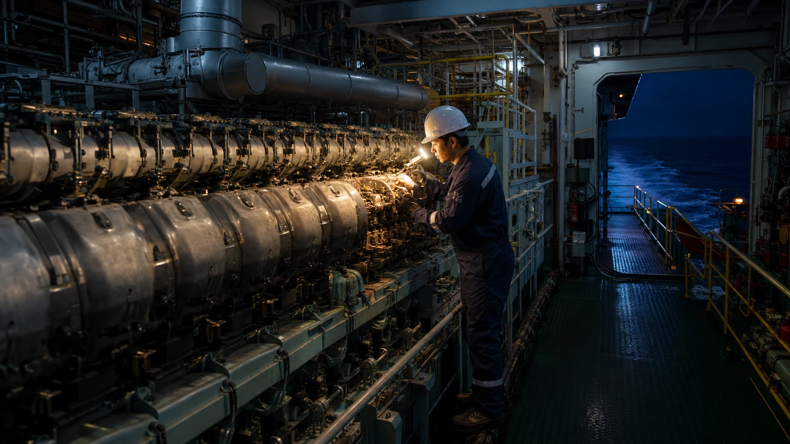
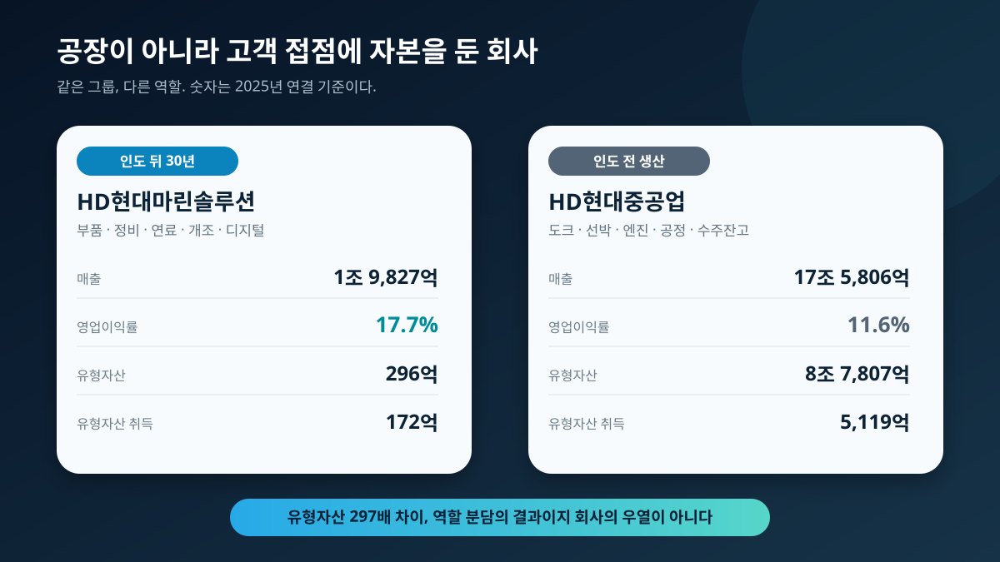
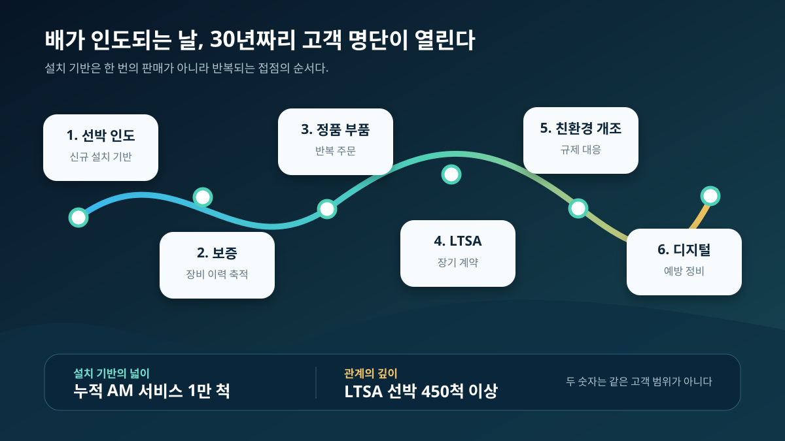
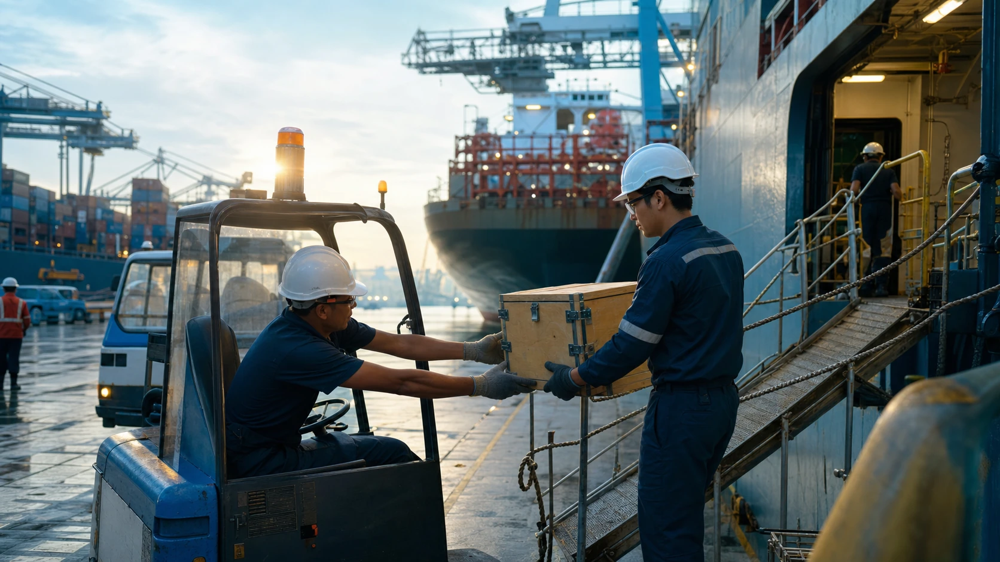
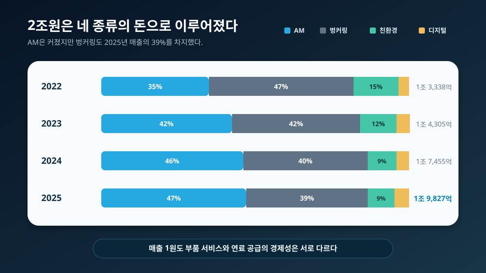
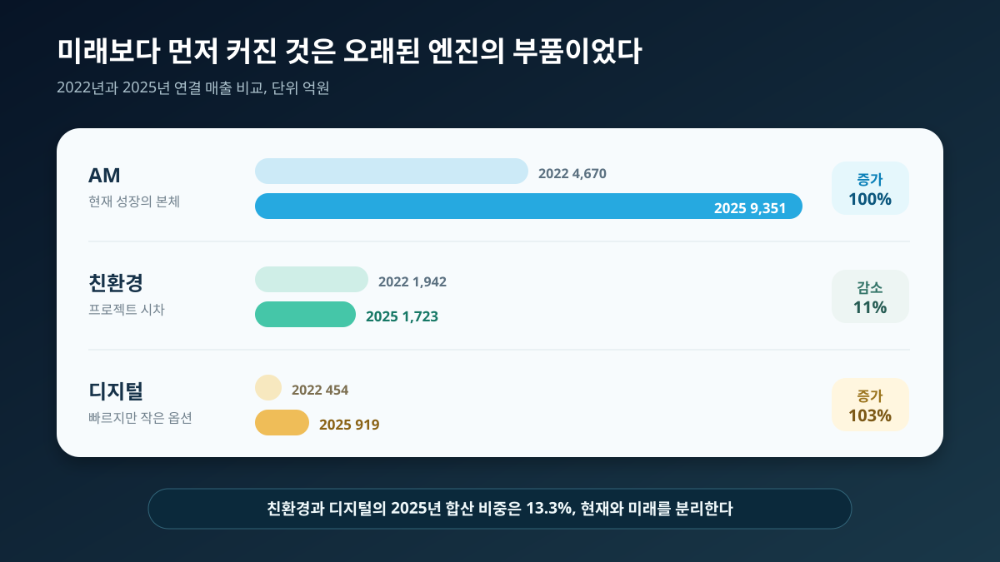
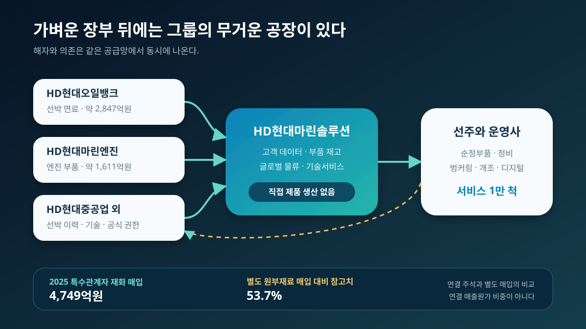
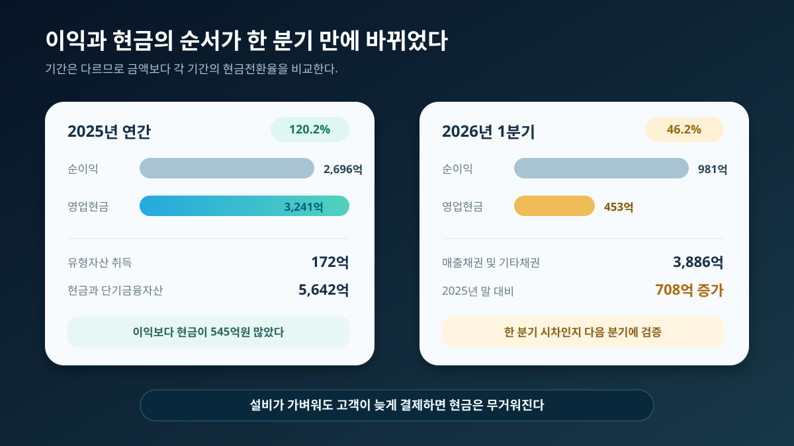
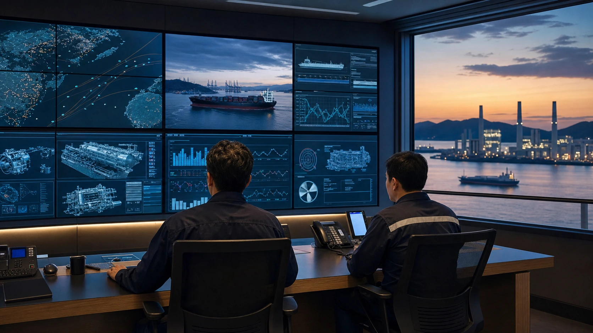
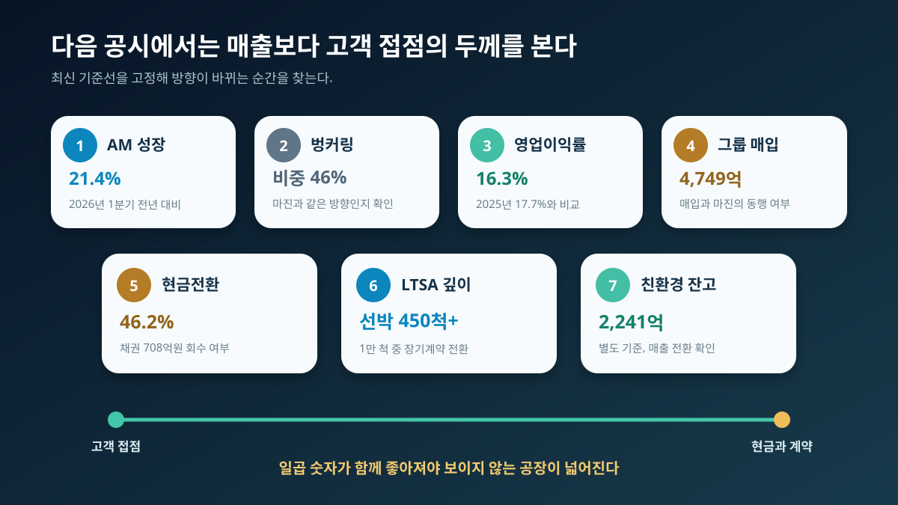

<script>
	import CompanyFinancials from '$lib/components/blog/CompanyFinancials.svelte';
</script>

> **주의**: 이 글은 투자 권유가 아니다. 목표가를 제시하지 않는다. 높은 영업이익률을 곧바로 독점력으로 번역하지 않고, 공식 부품 권한과 그룹 공급망 의존, 벙커링의 큰 매출 분모를 함께 검증한다.
>
> **데이터 기준**: 2026-07-16 dartlab 실측, HD현대마린솔루션 2025년 사업보고서와 2026년 1분기보고서, HD현대 공식 발표. 재무 수치는 연결 기준이며, 원부재료와 수주잔고처럼 별도 기준인 숫자는 문장과 표에서 따로 표시했다. 금액은 반올림했다.
>
> **핵심 숫자**: 2025년 매출 **1조 9,827억원** · 영업이익 **3,501억원** · 영업이익률 **17.7%** · 유형자산 **296억원** · AM 매출 **9,351억원** · 벙커링 매출 **7,834억원** · 2026년 1분기 누적 AM 서비스 **1만 척**.

조선소에서 새 배가 인도되는 날, 조선회사의 매출은 큰 고비를 넘긴다. 계약금을 받고 공정률에 따라 매출을 쌓은 뒤 선주에게 배를 넘긴다. 거대한 도크와 크레인이 맡은 일은 여기서 일단 끝난다. 그러나 그 배의 엔진룸에서는 다른 회사의 시간이 시작된다.



선박은 보통 25~30년을 쓴다. 항해하는 동안 엔진 부품이 닳고, 고장이 생기며, 보증 서비스와 정기 정비가 필요하다. 환경 규제가 바뀌면 기존 선박을 개조하고, 연료 효율을 높이며, 운항 데이터를 육상에서 감시해야 한다. 새 배 한 척을 파는 사건은 한 번이지만, 그 배가 운항하는 동안 생기는 서비스 기회는 수십 년간 반복된다.

HD현대마린솔루션은 이 반복을 사업으로 만든 회사다. 흥미로운 점은 사업보고서가 회사에 대해 **"직접 제품 생산을 수행하지 않는다"**고 밝힌다는 사실이다. 배도 만들지 않고, 엔진도 직접 생산하지 않는다. 그런데 2025년 연결 매출은 1조 9,827억원, 영업이익은 3,501억원이었다. 영업이익률은 17.7%다. 같은 해 연결 유형자산은 296억원, 유형자산 취득액은 172억원에 불과했다.

공장이 없어서 돈을 번다는 말은 절반만 맞다. 회사가 공장을 들고 있지 않은 것은 사실이지만, 공장 없이 아무것도 만들지 않는 인터넷 플랫폼은 아니다. HD현대마린엔진과 HD현대중공업이 만든 엔진, HD현대오일뱅크가 공급하는 연료, 물류창고에 쌓인 부품, 세계 항만의 서비스 인력이 있어야 매출이 난다. 무거운 생산설비가 회사 장부 밖, 특히 그룹 계열사 안에 놓여 있을 뿐이다.

그래서 이 회사의 진짜 질문은 단순하지 않다. **배도 엔진도 직접 만들지 않는 회사가 어떻게 17.7% 영업이익률을 내는가. 그 수익성은 1만 척 설치 기반이 만든 독립된 해자인가, 아니면 HD현대 공급망에 기대어 얻은 결과인가.**

이 글은 공장 없음이라는 문장에서 출발해 배가 인도된 뒤 30년을 따라간다. AM, 벙커링, 친환경, 디지털이라는 네 종류의 매출을 분리하고, 부품의 출발점인 그룹 계열사까지 거슬러 올라간다. 마지막에는 이익이 현금으로 바뀌는 속도와 바다의 엔진 명단이 육상 발전으로 확장될 가능성을 확인한다. 높은 마진을 칭찬하는 글이 아니라, 그 마진이 어디에서 오고 어느 지점에서 깨질 수 있는지 밝히는 글이다.

---

## 1막. 공장은 없는데 영업이익은 3,501억원이었다

2025년 사업보고서의 생산설비 항목에는 이 회사를 이해하는 가장 짧은 문장이 있다. 회사는 고객이 요청한 제품을 주요 제조사에서 구매해 공급하고, 친환경 개조와 디지털 솔루션을 제공하기 때문에 직접 제품을 생산하지 않는다고 설명한다. 제조업 계열 회사의 사업보고서에서 공장 가동률과 생산능력이 아니라 직접 생산 없음이 먼저 나오는 것은 드문 장면이다.

그 문장 옆에 손익계산서를 놓으면 대비가 더 커진다. 연결 매출 1조 9,827억원, 매출총이익 4,549억원, 판매관리비 1,047억원, 영업이익 3,501억원이다. 매출총이익률은 22.9%, 판매관리비율은 5.3%, 영업이익률은 17.7%였다. 상품을 사 와서 공급하고 기술서비스를 붙이는 구조인데도 매출총이익의 상당 부분이 영업이익으로 남았다.

재무상태표는 더 가볍다. 2025년 말 연결 자산 1조 2,723억원 가운데 유형자산은 296억원, 무형자산은 51억원이었다. 현금및현금성자산 3,779억원과 단기금융자산 1,863억원을 합치면 5,642억원이다. 현금성 자산의 합이 유형자산의 약 19배다. 이 비율 자체가 표준 수익성 지표는 아니지만, 회사가 어디에 자본을 묶고 어디에는 묶지 않는지 보여준다.



같은 그룹의 HD현대중공업과 비교하면 사업모델의 차이가 선명하다. 2025년 HD현대중공업의 연결 매출은 17조 5,806억원, 영업이익률은 11.6%, 유형자산은 8조 7,807억원이었다. HD현대마린솔루션보다 매출은 8.9배 크지만 유형자산은 약 297배 크다. 유형자산 취득액도 HD현대중공업 5,119억원, HD현대마린솔루션 172억원으로 약 30배 차이가 난다.

| 2025년 연결 기준 | HD현대마린솔루션 | HD현대중공업 | 읽는 법 |
|---|---:|---:|---|
| 매출 | 1조 9,827억원 | 17조 5,806억원 | 생산회사의 외형이 8.9배 크다 |
| 영업이익률 | 17.7% | 11.6% | 서비스와 공식 부품 권한의 마진이 더 높다 |
| 유형자산 | 296억원 | 8조 7,807억원 | 도크와 공장은 중공업 장부에 있다 |
| 유형자산 취득 | 172억원 | 5,119억원 | 자본을 묶는 방식이 다르다 |

이 표를 두 회사의 우열로 읽으면 안 된다. HD현대중공업이 배와 엔진을 먼저 만들지 않으면 마린솔루션이 서비스할 설치 기반도 생기지 않는다. 반대로 배를 인도한 뒤 생기는 작은 주문과 긴 유지보수 관계를 조선소가 모두 직접 관리하면 생산과 서비스의 운영 문법이 충돌할 수 있다. 한쪽은 수조원짜리 수주잔고와 공정률, 다른 쪽은 수만 건의 부품 주문과 세계 항만의 배송 속도를 관리한다.

[HD현대중공업 기업이야기](/blog/329180-hd-hyundai-heavy)는 지금의 매출이 2~3년 전 수주에서 도착하는 생산회사의 시간을 설명한다. HD현대마린솔루션은 그 반대편이다. 과거에 인도된 배가 오늘의 부품 주문이 된다. 생산회사의 손익은 수주와 원가의 시차를 타고, 애프터마켓 회사의 손익은 설치 기반의 나이와 고객 접촉 빈도를 탄다.

공장 없음은 결과이지 원인이 아니다. 높은 마진의 원인은 고객이 꼭 필요한 시점에 맞는 부품과 기술을 공급할 권한, 그 주문을 빠르게 처리할 데이터와 물류, 이미 깔린 엔진에 대한 이해다. 그 원인을 찾으려면 새 배가 조선소를 떠난 다음 날부터 봐야 한다.

---

## 2막. 배가 진수되는 날, 30년짜리 고객 명단이 열린다

HD현대마린솔루션은 2016년 11월 HD현대중공업의 선박, 엔진, 전기전자 애프터서비스 사업을 현물출자해 만들어졌다. 2024년 5월 유가증권시장에 상장했으므로 상장회사로서의 재무 이력은 짧다. 하지만 사업의 고객 관계는 상장일에 시작되지 않았다. 그룹이 수십 년간 인도한 선박과 엔진, 보증 서비스 이력이 출발 자산이었다.

선박 한 척의 생애를 따라가면 설치 기반의 뜻이 보인다. 첫 단계는 인도 뒤 보증이다. 신조선에서 발생한 문제를 접수하고 조선소, 기자재 업체, 선주 사이에서 책임과 수리 일정을 조정한다. 회사의 SmartCare 소개에 따르면 누적 4,000척 이상의 보증 서비스를 수행했고 연간 4만건 이상의 클레임을 다룬다. 이것은 단순한 비용 처리 업무가 아니다. 어느 배에 어떤 장비가 설치됐고, 어떤 부품에서 문제가 반복되는지 쌓이는 첫 고객 접점이다.

두 번째는 순정부품이다. 엔진은 운항을 멈추면 선주에게 큰 손실이 생긴다. 가격이 조금 싸다는 이유만으로 규격이 불확실한 부품을 쓰기 어렵다. HD현대마린솔루션은 힘센엔진의 유일한 정품 부품 공급사라고 설명하고, 대형엔진에서는 EVERLLENCE와 WinGD의 애프터서비스 라이선스를 보유한다고 밝힌다. 연간 주문 5만건, 배송 8만건 이상이라는 운영 규모는 거대한 완제품 몇 개가 아니라 작은 주문을 반복 처리하는 사업임을 보여준다.

세 번째는 장기 유지보수계약이다. LTSA는 선주가 문제가 생길 때마다 부품을 따로 주문하는 대신, 여러 해의 정비 일정과 비용을 묶는 방식이다. 회사가 공개한 누적 실적은 고객 50곳 이상, 선박 450척 이상, 엔진 1,300기 이상이다. 설치 기반 전체에 비하면 아직 일부지만, 일회성 주문을 예측 가능한 장기 관계로 바꾸는 층이라는 점이 중요하다.



네 번째는 개조다. 환경 규제가 강화되면 선주는 기존 선박을 폐기하기보다 친환경 연료 대응, 에너지 효율 개선, 배출 저감 장치를 붙이는 선택을 할 수 있다. 신조선 계약이 없어도 기존 설치 기반에서 큰 공사 매출이 생기는 지점이다. 다섯 번째는 디지털이다. 선박 데이터를 육상에서 보고 연료 소비와 장비 상태를 관리하면, 부품 판매가 고장 뒤 대응에서 고장 전 예방으로 이동할 수 있다.

이 순서는 하나의 고객 깔때기다. 보증 서비스를 통해 배와 장비를 알고, 순정부품으로 반복 접촉하며, 신뢰가 쌓이면 장기 정비와 개조, 디지털로 관계를 넓힌다. 배 한 척이 25~30년 운항한다면 신규 선박 인도는 앞으로 수십 년간 서비스할 고객 명단을 추가하는 사건이다. 조선업 호황이 당장 AM 매출로 전부 잡히지는 않아도 미래 설치 기반을 늘리는 이유다.



글로벌 물류는 이 깔때기를 현실로 만든다. 배는 특정 공장 옆에 머물지 않고 세계 항만을 이동한다. 부품이 늦으면 선주는 운항 일정과 용선료를 잃는다. 회사는 한국, 유럽, 미국, 싱가포르, 두바이 등에 물류 거점을 두고 있다. 2026년 가동한 싱가포르 물류 허브는 1만개 이상의 핵심 부품을 보관하고 200개 선사와 600개 항만을 연결하는 구조다. 회사는 배송 기간을 최대 16일, 비용을 최대 38% 줄일 수 있다고 기대한다. 이는 회사의 목표치이므로 실제 효과는 이후 재고회전과 마진, 고객 반응으로 검증해야 한다.

2026년 1분기 회사는 AM 서비스를 누적으로 1만 척에 제공했다고 발표했다. 이 숫자는 강한 후크지만 과장해서는 안 된다. 1만 척이 모두 매년 돈을 내는 구독 고객도 아니고, 모두 LTSA를 맺은 선박도 아니다. 한 번 이상 서비스를 받은 범위와 장기계약 450척 이상은 다른 층이다. 설치 기반의 넓이는 1만 척, 관계의 깊이는 LTSA와 반복 주문으로 나눠 봐야 한다.

설치 기반은 자동으로 매출을 보장하는 독점 목록도 아니다. 선주는 제3자 부품과 지역 정비업체를 선택할 수 있고, 장비별 보증과 라이선스 범위도 다르다. 다만 정확한 장비 이력, 정품 부품 권한, 세계 배송망이 함께 있을 때 고객이 다른 공급자로 옮길 비용과 위험이 커진다. 그 조합이 공장보다 가벼운 해자를 만든다.

그러나 1만 척이라는 숫자만 보고 2025년 매출 2조원 전부를 고마진 서비스로 생각하면 큰 오독이 생긴다. 매출표를 열어 보면 거의 절반은 부품과 정비가 아니라 선박 연료다.

---

## 3막. 매출의 39%는 서비스가 아니라 선박 연료였다

HD현대마린솔루션은 사업을 AM, 벙커링, 친환경, 디지털 네 부문으로 나눈다. 2025년 연결 매출은 AM 9,351억원, 벙커링 7,834억원, 친환경 1,723억원, 디지털 919억원이었다. 비중은 각각 47%, 39%, 9%, 5%다. 회사 이름과 공식 부품 사업을 떠올리면 AM이 전부처럼 보이지만, 벙커링이 매출의 5분의 2에 가깝다.

| 연결 매출 | 2022년 | 2023년 | 2024년 | 2025년 |
|---|---:|---:|---:|---:|
| AM | 4,670억원 | 6,072억원 | 8,059억원 | 9,351억원 |
| 벙커링 | 6,272억원 | 5,955억원 | 7,055억원 | 7,834억원 |
| 친환경 | 1,942억원 | 1,685억원 | 1,634억원 | 1,723억원 |
| 디지털 | 454억원 | 623억원 | 707억원 | 919억원 |
| 합계 | 1조 3,338억원 | 1조 4,305억원 | 1조 7,455억원 | 1조 9,827억원 |



AM은 선박과 엔진 부품, 보증, 정비, 장기 서비스가 중심이다. 고객이 요구하는 규격과 납기가 중요하고 공식 권한과 데이터가 차별화 요소가 된다. 벙커링은 선박 연료를 조달해 공급하는 거래다. 연료 자체의 매입액이 크고 가격 변동이 외형을 움직인다. 같은 매출 1원이라도 부품과 기술서비스에서 남는 가치와 연료를 구매해 전달하며 남는 가치가 같다고 보기 어렵다.

회사는 사업부별 영업이익을 공시하지 않는다. 따라서 AM의 정확한 이익률이나 벙커링의 정확한 이익률을 외부에서 계산할 수 없다. 벙커링을 무조건 저마진이라고 숫자로 단정하면 안 된다. 다만 원유와 석유제품을 큰 금액으로 매입해 공급하는 거래 구조상, 공식 부품 권한과 기술서비스보다 매출총이익률이 낮을 가능성이 있다는 해석은 합리적이다. 이것은 공시 이익률이 아니라 사업 구조에 근거한 추론이다.

이 차이는 회사 전체 영업이익률을 읽을 때 중요하다. 벙커링 가격이 올라 매출만 커져도 회사의 외형은 성장해 보일 수 있다. 반대로 연료 매출 비중이 낮아지고 AM과 디지털 비중이 높아지면 총매출 증가율이 낮아도 이익의 질은 좋아질 수 있다. 매출액 하나보다 부문 믹스와 전체 영업이익률을 같이 봐야 하는 이유다.

2026년 1분기는 이 경고를 바로 보여준다. 연결 매출 5,746억원 가운데 AM 2,624억원과 벙커링 2,632억원이 각각 46%였다. 친환경은 226억원, 디지털은 265억원으로 각각 약 4%였다. AM과 벙커링을 합치면 분기 매출의 92%다. 서비스 기반 회사라는 서사와 함께 연료 유통의 큰 분모를 놓치면 매출 구조의 절반만 보게 된다.

수출 비중도 같이 봐야 한다. 2026년 1분기 매출 5,746억원 가운데 수출은 4,651억원으로 80.9%였다. 세계 선박을 상대하는 사업이므로 자연스러운 구조지만 환율과 글로벌 해운 활동, 연료 가격에 민감하다는 뜻도 된다. 상위 5개 고객 매출은 1,723억원, 전체의 30.0%였고 가장 큰 고객은 13.1%였다. 특정 한 고객이 절대적인 구조는 아니지만 상위 고객과 대형 프로젝트의 시차가 분기 믹스를 움직일 수 있다.

[HMM 기업이야기](/blog/011200-hmm)는 해운사의 실적이 운임과 선복 사이클에 어떻게 흔들리는지 설명한다. HD현대마린솔루션은 그 해운사의 뒤에서 연료와 부품을 공급한다. 해운 시황이 좋아 선박 운항이 늘면 서비스 기회가 늘 수 있지만, 연료 가격과 운항량이 벙커링 외형을 움직이므로 해운 사이클과 완전히 분리된 회사도 아니다.

결국 2025년 매출 1조 9,827억원을 하나의 반복 서비스 매출처럼 부르면 안 된다. AM에는 설치 기반과 공식 부품 권한이 있고, 벙커링에는 연료 가격과 큰 매입액이 있다. 친환경은 프로젝트 시차가 크고, 디지털은 빠르게 성장하지만 아직 작다. 네 부문의 시간표를 따로 봐야 성장의 진짜 주인공이 나타난다.

---

## 4막. 친환경보다 먼저 커진 것은 오래된 엔진의 부품이었다

2022년부터 2025년까지 회사 전체 매출은 1조 3,338억원에서 1조 9,827억원으로 늘었다. 연평균 성장률은 약 14.1%다. 네 부문 중 절대액 증가가 가장 컸던 것은 AM이었다. 4,670억원에서 9,351억원으로 4,681억원 늘었고, 3년 연평균 성장률은 약 26.0%다. 기존 엔진의 부품과 서비스가 전체 성장을 끌었다.

디지털도 454억원에서 919억원으로 두 배가 됐다. 연평균 성장률은 약 26.6%로 AM과 비슷하다. 그러나 2025년 매출 비중은 5%다. 성장률은 빠르지만 회사 손익 전체를 지배할 절대액은 아직 아니다. 작은 사업의 높은 성장률과 큰 사업의 이익 기여를 분리해야 한다.

반대로 친환경 매출은 2022년 1,942억원에서 2025년 1,723억원으로 11.2% 감소했다. 매년 일직선으로 줄어든 것은 아니지만 2022년 수준을 회복하지 못했다. 친환경 선박 개조와 연료 전환이 산업의 장기 방향이라는 사실과, 이 회사의 현재 매출에서 친환경이 성장 엔진이 아니라는 사실은 동시에 참일 수 있다.



| 부문 | 2022년 대비 2025년 변화 | 2025년 비중 | 현재 역할 |
|---|---:|---:|---|
| AM | 100.2% 증가 | 47% | 현재 성장과 수익성의 중심 |
| 벙커링 | 24.9% 증가 | 39% | 큰 매출 분모와 고객 접점 |
| 친환경 | 11.2% 감소 | 9% | 프로젝트 시차가 큰 미래 옵션 |
| 디지털 | 102.7% 증가 | 5% | 빠르게 크지만 아직 작은 옵션 |

2026년 1분기에도 같은 순서가 이어졌다. 회사 발표 기준 AM 매출은 전년 동기 대비 21.4%, 디지털은 33.3% 늘었다. 연결 전체 매출은 18.3%, 영업이익은 12.5% 증가했다. 영업이익률은 17.1% 수준이던 전년 동기에서 16.3%로 낮아졌다. 외형이 이익보다 빨리 늘었다는 사실은 벙커링 비중과 프로젝트 믹스를 함께 확인할 이유가 된다.

친환경 1분기 매출이 작았다고 사업이 사라진 것은 아니다. 회사는 전년 동기의 대형 개조공사 기저효과를 설명했고, 2026년 1분기 말 별도 기준 친환경 수주잔고는 2,241억원이었다. 수주잔고는 미래 매출 후보이지 같은 분기의 매출이 아니다. 공사 일정과 원가, 검수 시점에 따라 실제 손익 반영 속도가 달라진다.

이 회사가 연구개발비를 쓰는 방식도 사업모델을 보여준다. 2025년 사업보고서상 연구개발비는 74억원, 매출의 약 0.38%였다. 자체 연구조직의 크기만으로 디지털과 친환경 역량을 판단할 수는 없다. 그룹 조선소와 엔진 회사의 기술, 외부 장비업체의 제품, 고객 선박 데이터를 결합해 솔루션을 제공하는 구조이기 때문이다. 낮은 연구개발비율은 자산 경량성을 보여주지만, 동시에 기술 원천의 상당 부분이 그룹과 파트너에 있다는 점도 말해 준다.

따라서 친환경과 디지털을 현재 이익의 주인공으로 앞세우는 것은 시기상조다. 2025년 둘을 합친 매출은 2,643억원, 전체의 13.3%다. 반면 AM과 벙커링은 1조 7,185억원, 86.7%다. 미래 서사는 중요하지만 오늘의 손익은 오래전에 깔린 엔진 부품과 선박 연료가 만든다.

AM이 왜 이렇게 빨리 컸는지를 더 깊이 보려면 부품의 실제 생산자를 찾아야 한다. 마린솔루션이 직접 만들지 않는다면 누군가 공장을 돌려 엔진과 연료를 공급한다. 그 공급자의 이름을 따라가면 높은 마진의 해자와 의존이 같은 자리에서 보인다.

---

## 5막. HD현대 공급망은 해자이면서 동시에 목줄이다

HD현대마린솔루션의 가장 강한 권한은 그룹의 생산 역사에서 왔다. HD현대중공업이 인도한 선박과 엔진의 서비스 조직이 분리돼 회사를 만들었고, 힘센엔진 순정부품을 공식적으로 공급한다. 고객은 배에 맞는 부품을 찾고, 회사는 장비 이력과 공식 조달망을 이용해 주문을 처리한다. 생산설비는 없지만 어떤 부품을 누구에게 어떻게 보낼지 아는 권한과 데이터가 남았다.

그런데 손익계산서의 가벼움은 공급망 전체의 가벼움을 뜻하지 않는다. 2025년 연결 주석에서 특수관계자로부터의 재화 매입은 4,749억원이었다. HD현대오일뱅크에서 약 2,847억원, HD현대마린엔진에서 약 1,611억원, HD현대일렉트릭에서 약 235억원을 매입했다. 연료와 엔진 부품, 전기장비를 만드는 무거운 생산 기반이 그룹 안에 존재한다.

사업보고서의 별도 기준 원부재료 매입은 AM 3,718억원, 벙커링 3,997억원, 친환경 672억원, 디지털 459억원으로 합계 8,845억원이었다. 연결 주석의 특수관계자 재화 매입 4,749억원을 이 별도 기준 원부재료 매입과 단순 비교하면 53.7%다. 범위가 완전히 같은 회계 비율은 아니므로 연결 매출원가에서 관련자 매입이 차지하는 비중처럼 쓰면 안 된다. 다만 회사가 조달하는 부품과 연료에서 그룹 공급망의 규모가 얼마나 큰지 보는 참고 비교로는 유용하다.



| 2025년 거래 | 금액 | 범위 | 의미 |
|---|---:|---|---|
| 특수관계자 재화 매입 | 4,749억원 | 연결 주석 | 그룹 공급망에서 산 부품과 연료 |
| 전체 원부재료 매입 | 8,845억원 | 별도 사업보고서 | 네 사업부의 원부재료 매입 합계 |
| 참고 비교 | 53.7% | 서로 다른 범위의 단순 비교 | 연결 원가 비중으로 해석 금지 |
| 특수관계자 매출 | 1,717억원 | 연결 주석 | 그룹 안에서 발생한 매출도 존재 |

이 구조는 해자다. 힘센엔진 정품 부품의 유일한 공급 권한, 대형엔진 애프터서비스 라이선스, 조선소에서 이어진 보증 데이터는 경쟁사가 짧은 시간에 복제하기 어렵다. 고객은 부품의 규격과 품질을 신뢰할 수 있고, 회사는 설치 장비를 이미 알기 때문에 탐색 비용을 줄인다. 그룹 조선소가 새 배와 엔진을 더 많이 인도할수록 미래 서비스 대상도 늘어난다.

동시에 이 구조는 의존이다. 핵심 제품의 생산과 기술 원천, 신규 설치 기반의 상당 부분이 그룹 계열사에 있다. 공급 가격과 납기, 계열사의 전략이 바뀌면 마린솔루션의 조달과 마진에도 영향을 줄 수 있다. 회사가 독립적으로 고객을 쥐고 있어도 공식 부품을 만들어 주는 공장과 완전히 분리돼 있지는 않다.

관련자 거래가 많다는 사실만으로 불공정 거래를 뜻하지는 않는다. 같은 그룹의 엔진과 연료를 공식 서비스 회사가 조달하는 것은 사업 구조상 자연스럽고 공급 안정성의 원천일 수 있다. 중요한 검증 질문은 거래의 존재가 아니라 조건이다. 외부 공급자와 고객을 얼마나 넓히는지, 관련자 매입 비중이 커질 때 마진이 유지되는지, 공식 권한이 갱신되고 확대되는지를 봐야 한다.

지배구조도 이 이해관계와 연결된다. 2025년 말 HD현대 지분은 55.32%, Global Vessel Solutions LP 지분은 23.98%였다. 최대주주가 그룹 지배회사인 만큼 그룹의 생산회사와 서비스 회사 사이 역할 분담은 장기 전략의 일부다. [HD한국조선해양 기업이야기](/blog/009540-hd-ksoe)를 함께 보면 조선 자회사와 지주 역할 사이에서 이익과 자본이 어떻게 나뉘는지 더 넓게 볼 수 있다.

공장 밖에서 태어난 마진이라는 표현도 수정해야 한다. 정확히는 **공장을 직접 보유하지 않은 회사가 그룹의 공장, 공식 권한, 고객 데이터를 묶어 만든 마진**이다. 가벼운 자산은 진짜지만 무거운 생산설비가 사라진 것은 아니다. 그 설비의 비용과 위험을 다른 계열사가 부담하고, 마린솔루션은 고객 관계와 물류, 기술서비스에 자본을 집중한다.

이 분업이 강한 사업모델인지 판정하려면 현금흐름을 봐야 한다. 공장을 갖지 않아 설비투자가 적다면 회계 이익이 현금으로 잘 바뀌어야 한다. 2025년에는 그 약속이 지켜졌지만 2026년 1분기에는 잠시 순서가 뒤집혔다.

---

## 6막. 2025년에는 이익보다 현금이 많았고, 2026년 1분기에는 반대였다

2025년 연결 당기순이익은 2,696억원, 영업현금흐름은 3,241억원이었다. 영업현금흐름이 순이익의 120.2%였다. 이익보다 545억원 많은 현금이 본업에서 들어왔다. 유형자산 취득은 172억원으로 매출의 0.87%였다. 공장을 직접 보유하지 않는 사업모델이 현금흐름표에서도 드러난 해다.

연말 재무상태표에는 현금 3,779억원, 단기금융자산 1,863억원, 합계 5,642억원이 있었다. 부채는 4,476억원, 자본은 8,247억원이었다. 재고자산은 2,707억원, 매출채권 및 기타채권은 3,178억원이었다. 자산 경량 회사라도 고객에게 받을 돈과 세계 각지에 준비해 둘 부품, 벙커링 거래에 필요한 운전자본은 가볍지 않다.

2026년 1분기에는 방향이 달라졌다. 연결 순이익은 981억원이었지만 영업현금흐름은 453억원이었다. 현금전환율은 46.2%로 내려왔다. 매출채권 및 기타채권이 2025년 말 3,178억원에서 1분기 말 3,886억원으로 708억원 늘어난 것이 가장 눈에 띄는 변화다. 같은 기간 재고는 약 28억원 증가에 그쳤다.



| 연결 기준 | 2025년 | 2026년 1분기 | 읽는 법 |
|---|---:|---:|---|
| 순이익 | 2,696억원 | 981억원 | 분기는 연간과 기간이 다르다 |
| 영업현금흐름 | 3,241억원 | 453억원 | 1분기에는 순이익의 46.2% |
| 영업현금흐름 대 순이익 | 120.2% | 46.2% | 현금 회수 속도가 달라졌다 |
| 매출채권 및 기타채권 | 3,178억원 | 3,886억원 | 3개월 동안 708억원 증가 |

한 분기의 현금전환율만으로 구조적 악화를 선언하면 안 된다. 대형 부품과 개조 프로젝트는 납품, 검수, 결제 시점이 분기를 넘을 수 있다. 1분기 매출이 전년 동기 대비 18.3% 늘어난 만큼 거래 규모 증가가 채권을 키웠을 가능성도 있다. 실제 판단은 2분기와 하반기에 매출채권이 현금으로 회수되는지 확인한 뒤 내려야 한다.

그럼에도 이 항목이 중요한 이유는 자산 경량 회사의 핵심 약속이 현금전환이기 때문이다. 공장과 설비에 큰돈을 쓰지 않아도 고객이 늦게 결제하면 현금은 묶인다. 부품을 미리 사 두고 연료를 조달하며 프로젝트 비용을 먼저 지급하면 운전자본이 늘어난다. 설비투자가 적다는 사실과 운전자본 부담이 작다는 말은 같은 뜻이 아니다.

배당도 이 현금 구조와 함께 봐야 한다. 2025년 현금배당 총액은 1,771억원, 연결 현금배당성향은 65.7%, 주당배당금은 3,950원이었다. 회사는 향후 3년 동안 별도 당기순이익의 50~70%를 배당하는 목표를 제시했다. 현금 창출력이 좋은 자산 경량 회사라는 자신감이 반영된 정책이다.

그러나 높은 배당은 공짜가 아니다. 싱가포르 물류 허브처럼 서비스 범위를 넓히려면 창고와 재고, 인력, 정보시스템에 돈이 필요하다. AM 고객이 늘면 받을 돈과 준비할 부품도 늘 수 있다. 배당 후에도 순현금과 운전자본 여력이 충분한지 봐야 성장과 주주환원이 충돌하지 않는다. 배당 목표는 별도 순이익 기준이고 2025년 65.7%는 연결 기준이므로 같은 분모처럼 비교해서도 안 된다.

현금의 두 장면을 함께 놓으면 결론은 균형적이다. 2025년 연간 현금전환은 매우 좋았고 설비투자 부담도 작았다. 2026년 1분기에는 채권 증가로 현금이 늦어졌다. 아직 위기 신호도 아니고 무시할 숫자도 아니다. 다음 분기에 708억원의 채권 증가가 되돌아오는지가 사업모델의 현금 약속을 검증한다.

회사가 다음 설치 기반을 바다 밖에서 찾고 있다는 사실도 현금 검증과 연결된다. 선박에서 축적한 엔진 서비스 역량을 육상 발전소와 데이터센터에 옮기면 고객 명단이 넓어질 수 있다. 다만 계약과 기대를 같은 매출로 합쳐서는 안 된다.

---

## 7막. 바다의 엔진 명단을 데이터센터와 발전소로 옮길 수 있을까

힘센엔진은 선박에만 쓰이지 않는다. 분산형 발전과 비상전원 같은 육상 전력에도 설치된다. 엔진을 직접 만드는 곳은 HD현대중공업과 관련 생산회사지만, 설치 뒤 부품과 정비, 장기 서비스는 마린솔루션의 사업이 될 수 있다. 바다에서 만든 애프터마켓 깔때기를 육상으로 복제하는 시도다.

2026년 2월 회사는 에콰도르 국영 전력기업과 5,600만달러 규모의 발전소 정비자재 공급계약을 체결했다고 발표했다. 대상은 총 400MW 규모의 화력발전소 8곳이며, 정비에 필요한 자재를 다음 해 초까지 공급하는 내용이다. 선박 한 척의 부품 주문이 아니라 국가 전력시설 여러 곳을 묶은 계약이라는 점에서 육상 AM의 실체가 확인된 사례다.

2026년 5월에는 미국 AEG와 데이터센터 전력용 힘센엔진의 장기 유지보수와 운영 협력을 위한 업무협약을 맺었다. 배경에는 684MW급 발전설비에 들어갈 힘센엔진 33기가 있다. 데이터센터는 가동 중단 비용이 크므로 장기 유지보수와 예비부품, 운영 신뢰성이 중요하다. 선박 엔진에서 쌓은 서비스 역량이 맞닿는 지점이다.



두 발표는 단계가 다르다. 에콰도르는 금액과 납품 범위가 있는 계약이다. 미국 데이터센터는 장기계약을 추진하기 위한 업무협약이다. 업무협약을 33기 전체의 확정 유지보수 매출로 계산하면 안 된다. 계약으로 전환되는지, 기간과 서비스 범위, 매출 인식 시점이 어떻게 정해지는지를 이후 공시에서 확인해야 한다.

이 구분은 AI 데이터센터라는 강한 단어 때문에 더 중요하다. 2026년 1분기 AM 성장의 중심은 여전히 선박용 대형엔진과 힘센엔진 부품이었다. 데이터센터는 현재 실적의 설명이 아니라 기존 역량을 새로운 설치 기반에 적용하는 미래 옵션이다. [한화엔진 기업이야기](/blog/082740-hanwha-engine)는 선박 엔진이 왜 데이터센터 전력 앞으로 불려가는지 산업의 반대편을 설명한다.

육상 확장이 좋은 이유는 단순히 시장이 커서가 아니다. 같은 엔진 부품과 정비 지식, 물류망, 장기계약 문법을 재사용할 수 있기 때문이다. 새 공장을 지어 전혀 다른 제품을 만드는 다각화가 아니라 이미 가진 서비스 시스템에 새 사용처를 붙이는 인접 확장이다. 성공하면 자산 경량성을 유지하면서 설치 기반의 분모를 늘릴 수 있다.

위험도 같은 곳에 있다. 발전소와 데이터센터는 선박과 운전 조건, 고객의 조달 절차, 서비스 수준 계약이 다르다. 현지 규제와 부품 재고, 장기간의 성능 책임이 붙을 수 있다. 매출을 따내기 위해 보증과 운전자본을 크게 제공하면 외형은 늘어도 현금전환이 낮아질 수 있다. 2026년 1분기의 채권 증가와 함께 봐야 하는 이유다.

디지털 사업도 이 확장을 보완할 수 있다. 회사의 통합 스마트십 솔루션은 500척 이상에 설치됐다고 공개돼 있다. 선박 장비를 실시간으로 관찰하고 육상에서 상태를 관리하는 경험은 육상 엔진의 예방 정비와 연결될 수 있다. 하지만 2025년 디지털 매출은 919억원, 전체의 5%다. 화면에 데이터가 보인다고 곧바로 소프트웨어 구독회사로 바뀐 것은 아니다.

육상 AM이 실제 두 번째 성장축이 되려면 세 단계가 확인돼야 한다. 첫째, 업무협약이 금액과 기간이 있는 계약으로 전환돼야 한다. 둘째, 단발성 자재 공급이 장기 유지보수계약으로 이어져야 한다. 셋째, 매출 증가가 매출채권과 보증 부담만 키우지 않고 영업현금으로 회수돼야 한다. 발표의 이름보다 계약의 깊이와 현금의 속도가 중요하다.

---

## 8막. 다음 공시에서는 매출보다 고객 접점의 두께를 본다

HD현대마린솔루션을 업데이트할 때 첫 줄에 전체 매출 증가율을 놓으면 안 된다. 벙커링 가격과 물량이 외형을 크게 움직일 수 있기 때문이다. 공장 없는 애프터마켓의 질을 판정하려면 고객 접점, 믹스, 마진, 공급망, 현금의 순서로 내려가야 한다.



첫 번째는 AM 매출 증가율이다. 2025년 AM은 9,351억원, 2026년 1분기는 전년 동기 대비 21.4% 늘었다. 기존 선박과 엔진에서 반복 주문이 계속 나오는지 보여주는 가장 직접적인 숫자다. 신규 조선 수주보다 과거 설치 기반의 실제 서비스 주문을 먼저 본다.

두 번째는 벙커링 비중이다. 2025년 39%에서 2026년 1분기 46%로 높아졌다. 벙커링 비중이 오르면서 전체 매출은 빠르게 늘고 영업이익률이 내려가면 외형의 질이 약해졌을 가능성이 있다. 반대로 AM과 디지털 비중이 오르며 마진이 유지되면 설치 기반의 경제성이 두꺼워진다.

세 번째는 영업이익률이다. 2025년 17.7%, 2026년 1분기 16.3%였다. 한 분기 하락만으로 구조 변화를 말할 수는 없지만, AM 성장에도 마진이 계속 낮아진다면 연료 믹스와 조달 가격, 신규 사업 원가를 확인해야 한다. 매출과 마진의 방향을 함께 본다.

네 번째는 특수관계자 매입이다. 2025년 재화 매입 4,749억원이 전체 외형과 함께 어떻게 움직이는지 본다. 관련자 매입이 늘어도 마진과 공급 안정성이 좋아지면 그룹 해자가 작동한 것이다. 매입이 매출보다 빨리 늘고 마진이 낮아지면 조달 의존의 비용이 커졌을 수 있다.

다섯 번째는 매출채권 및 기타채권과 영업현금흐름이다. 2026년 1분기에 채권이 708억원 늘고 현금전환율이 46.2%로 내려왔다. 다음 분기에 채권이 회수되고 영업현금이 순이익을 따라오면 결제 시점의 문제였다. 같은 흐름이 반복되면 자산 경량 모델의 현금 품질을 다시 평가해야 한다.

여섯 번째는 LTSA 계약 선박과 엔진 수다. 누적 서비스 1만 척은 넓이를 보여주지만 장기계약 450척 이상은 깊이를 보여준다. 1만 척이 늘어나는 것보다 그중 반복 서비스와 장기 정비로 들어오는 비율이 높아지는 것이 더 강한 신호다. 회사가 정기적으로 이 수치를 업데이트하는지부터 확인한다.

일곱 번째는 친환경 수주잔고와 육상 계약이다. 2026년 1분기 별도 친환경 수주잔고 2,241억원이 실제 매출과 이익으로 전환되는지 본다. 미국 데이터센터 업무협약은 계약으로 넘어가는지, 에콰도르 계약은 납품과 현금 회수가 계획대로 진행되는지 따로 추적한다.

| 점검 순서 | 최신 기준선 | 좋아지는 신호 | 다시 볼 신호 |
|---|---:|---|---|
| AM 성장 | 2026년 1분기 21.4% | 두 자릿수 성장과 반복 주문 | 설치 기반 증가에도 둔화 |
| 벙커링 비중 | 2026년 1분기 46% | AM과 디지털 비중 확대 | 비중 상승과 마진 하락 동반 |
| 영업이익률 | 2026년 1분기 16.3% | 2025년 17.7% 부근 회복 | 여러 분기 연속 하락 |
| 관련자 재화 매입 | 2025년 4,749억원 | 매입 증가보다 빠른 이익 증가 | 조달액이 매출보다 빠르게 증가 |
| 현금전환 | 2026년 1분기 46.2% | 채권 회수와 영업현금 회복 | 채권과 이익의 간격 확대 |
| LTSA | 선박 450척 이상 | 설치 기반이 장기계약으로 전환 | 누적 서비스만 늘고 깊이는 정체 |
| 친환경 수주잔고 | 2,241억원 | 매출과 현금으로 순차 전환 | 지연, 원가 상승, 잔고 감소 |

배당은 이 일곱 숫자의 결과를 주주에게 돌리는 마지막 단계다. 2025년 연결 배당성향 65.7%와 향후 별도 순이익 50~70% 목표는 높은 환원 의지를 보여준다. 다만 AM 물류망과 육상 확장에 필요한 재투자, 운전자본이 커질 때도 같은 수준을 유지할 수 있는지 봐야 한다. 배당을 많이 한다는 사실과 사업이 오래 성장한다는 판단은 별도로 검증해야 한다.

이 회사의 공장은 재무상태표에서 잘 보이지 않는다. 대신 세계를 운항하는 선박과 육상 엔진, 부품 창고, 공식 라이선스, 고객 데이터가 분산된 생산기반처럼 작동한다. 다음 공시의 일곱 숫자는 그 보이지 않는 공장이 더 넓어지고 깊어지는지 보여준다.

---

## 이 이야기가 틀리는 조건

이 글의 결론은 HD현대마린솔루션의 높은 마진이 설치 기반과 공식 부품 권한에서 나오지만, 벙커링의 큰 분모와 그룹 공급망 의존을 떼고 볼 수 없다는 것이다. 다음 조건이 확인되면 이 결론은 수정돼야 한다.

첫째, 회사가 대규모 제조시설을 인수하거나 직접 생산을 내재화해 유형자산과 설비투자가 급증하는 경우다. 그때는 공장 없는 애프터마켓이라는 틀보다 제조와 서비스의 통합 경제성을 봐야 한다. 2025년 유형자산 296억원과 설비투자 172억원은 더 이상 적절한 기준선이 아닐 수 있다.

둘째, AM 비중이 낮아지고 벙커링 비중이 계속 높아지는데 영업이익률도 여러 분기 하락하는 경우다. 이때 매출 성장은 설치 기반의 질이 아니라 연료 거래의 큰 분모가 만든 것으로 해석해야 한다. 반대로 벙커링 비중이 높아져도 마진과 현금전환이 유지된다면 벙커링을 낮은 질의 매출로 본 해석을 약화해야 한다.

셋째, 특수관계자 매입이 줄어도 정품 부품 권한과 납기, 마진이 유지되는 경우다. 외부 공급망이 넓어지고 제3자 엔진과 선박 고객이 늘면 그룹 의존이라는 결론은 약해진다. 반대로 관련자 매입이 커지며 조달 조건과 마진이 악화되면 의존에 대한 경고는 더 강해진다.

넷째, 2026년 1분기의 현금 둔화가 다음 분기에 완전히 회복되는 경우다. 채권 708억원 증가가 결제 시점에 불과했고 영업현금흐름이 다시 순이익을 웃돈다면 현금 품질 우려는 제거해야 한다. 채권이 계속 늘고 영업현금이 이익의 절반에도 못 미치면 구조적 문제로 판정을 바꿔야 한다.

다섯째, 친환경과 디지털의 합산 매출 비중이 25% 이상으로 커지고 이익 기여가 확인되는 경우다. 현재의 AM과 벙커링 중심 틀은 낡아진다. 이때 회사는 부품 애프터마켓에 미래 옵션이 붙은 회사가 아니라, 개조와 데이터가 손익의 한 축인 회사로 다시 정의해야 한다.

여섯째, 미국 데이터센터 업무협약이 장기계약으로 전환되지 않거나 에콰도르 계약의 납품과 회수가 지연되는 경우다. 육상 확장은 아직 검증된 두 번째 축이 아니다. 반대로 여러 지역에서 장기계약과 반복 매출이 쌓이면 바다의 설치 기반만으로 회사를 설명하는 것도 틀리게 된다.

---

## 15분 업데이트 방법

이 글은 다음 분기보고서가 나오면 같은 순서로 짧게 다시 검증할 수 있다.

1. 주요 제품 및 서비스 표에서 AM, 벙커링, 친환경, 디지털 매출과 비중을 갱신한다.
2. 연결 손익계산서에서 매출 증가율과 영업이익률을 놓고 믹스 변화가 마진에 미친 방향을 본다.
3. 재무상태표에서 매출채권 및 기타채권, 재고, 현금을 직전 분기와 비교한다.
4. 현금흐름표에서 영업현금흐름을 순이익과 비교하고 채권 증가가 회수됐는지 확인한다.
5. 특수관계자 주석에서 재화 매입과 매출, 주요 거래 상대의 변화를 적는다.
6. LTSA 계약 선박, 누적 서비스 선박, 친환경 수주잔고, 육상 계약의 단계 변화를 확인한다.
7. 배당 공시에서 별도 순이익 기준 목표와 실제 연결 배당성향을 섞지 않고 적는다.

dartlab에서는 재무 세 줄을 먼저 확인할 수 있다.

```python
import dartlab

c = dartlab.Company("443060")
c.panel("IS", freq="Y")
c.panel("BS", freq="Y")
c.panel("CF", freq="Y")
```

이 순서의 목적은 매출 뉴스에서 시작해 현금과 계약의 깊이로 끝내는 것이다. 전체 매출만 보면 벙커링이 AM처럼 보이고, 1만 척만 보면 일회성 서비스가 장기계약처럼 보인다. 믹스와 마진, 채권과 현금, 설치 기반과 LTSA를 짝지어야 공장 없는 회사의 경제성을 제대로 업데이트할 수 있다.

---

## 에필로그. 이 회사의 공장은 바다 위에 흩어져 있다

HD현대마린솔루션은 배를 만들지 않는다. 엔진도 연료도 직접 생산하지 않는다. 2025년 유형자산은 296억원뿐이다. 그런데 매출 1조 9,827억원과 영업이익 3,501억원을 냈다. 숫자만 놓으면 공장 없는 고마진 회사라는 한 문장으로 끝내기 쉽다.

하지만 그 문장 뒤에는 30년의 시간이 있다. HD현대가 만든 배와 엔진이 세계 항만을 돌아다니고, 보증과 부품, 정비와 개조를 요구한다. 1만 척의 서비스 이력과 힘센엔진 정품 부품 권한, 대형엔진 라이선스, 물류망이 그 요구를 매출로 바꾼다. 공장 대신 고객의 장비 이력과 공식 권한을 가진 회사다.

또 그 문장 아래에는 그룹의 무거운 설비가 있다. 2025년 특수관계자 재화 매입은 4,749억원이었다. HD현대오일뱅크가 연료를 공급하고 HD현대마린엔진과 HD현대중공업이 엔진과 부품의 원천을 만든다. 마린솔루션의 장부는 가볍지만 공급망 전체가 가벼운 것은 아니다. 해자와 의존은 서로 반대되는 결론이 아니라 같은 분업의 양면이다.

매출도 하나가 아니다. AM 47%에는 설치 기반의 반복이 있고, 벙커링 39%에는 연료의 큰 분모가 있다. 친환경 9%와 디지털 5%는 미래 가능성이지만 현재 손익의 주인공은 아니다. 그래서 전체 매출 증가율보다 네 부문의 믹스와 영업이익률을 함께 봐야 한다.

현금은 이 모델의 마지막 시험이다. 2025년 영업현금흐름은 순이익보다 많았고 설비투자도 작았다. 2026년 1분기에는 채권이 708억원 늘면서 현금전환율이 46.2%로 내려왔다. 한 분기의 시차일 수 있지만, 가벼운 회사가 고객에게 받을 돈 때문에 무거워질 수 있다는 사실을 보여준다.

가장 정확한 결론은 이렇다. **HD현대마린솔루션은 공장이 없어서 높은 마진을 내는 회사가 아니다. 그룹의 공장이 만든 1만 척의 설치 기반에서 30년짜리 고객 관계를 이어 가기 때문에 공장을 직접 보유하지 않고도 높은 마진을 내는 회사다.** 그 관계가 해자인지는 AM과 LTSA의 성장으로, 의존의 비용은 관련자 매입과 마진으로, 경제성은 영업현금으로 계속 검증해야 한다.

배가 조선소를 떠나면 생산의 장면은 끝난다. 그러나 엔진룸에서는 부품의 시간이 시작된다. HD현대마린솔루션의 공장은 재무상태표 한 줄에 서 있지 않다. 세계 바다 위에 흩어진 배와 엔진, 그리고 그것들을 다시 회사로 연결하는 고객 명단 속에 있다.

함께 읽을 글: [HD현대중공업](/blog/329180-hd-hyundai-heavy) · [HD한국조선해양](/blog/009540-hd-ksoe) · [한화엔진](/blog/082740-hanwha-engine) · [HMM](/blog/011200-hmm)

---

## 검증표

> **dartlab thesis 판정**: "설치 기반과 공식 부품 권한이 높은 마진의 핵심이다"라는 가설은 2024년 2분기부터 2026년 1분기까지 매출 성장과 두 자릿수 영업이익률이 이어진 점에서 지지됐다. 다만 분기 재무만으로 인과를 증명할 수 없으므로, 사업보고서의 직접 생산 없음, 공식 부품 권한, 부문 매출, 관련자 매입으로 원인을 교차 검증했다.

| 주장 | 기준과 범위 | dartlab 및 공시 출처 | 판정 |
|---|---|---|---|
| 2025년 매출 1조 9,827억원, 영업이익 3,501억원, 순이익 2,696억원 | 연결, 연간 | dartlab, 2025년 사업보고서 | 확인 |
| 회사는 직접 제품 생산을 수행하지 않는다 | 사업 내용 | 2025년 사업보고서 생산설비 항목 | 확인 |
| 2025년 유형자산 296억원, 유형자산 취득 172억원 | 연결, 연간 | dartlab 재무상태표와 현금흐름표 | 확인 |
| 2025년 AM 9,351억원, 벙커링 7,834억원, 친환경 1,723억원, 디지털 919억원 | 연결 부문 매출, 연간 | 2025년 사업보고서 | 확인 |
| AM 매출은 2022년 4,670억원에서 2025년 9,351억원으로 증가 | 연결 부문 매출 | 2025년 사업보고서 | 확인 |
| 친환경 매출은 2022년 1,942억원에서 2025년 1,723억원으로 감소 | 연결 부문 매출 | 2025년 사업보고서 | 확인 |
| 선박 사용연령 25~30년, 2026년 1분기 누적 AM 서비스 1만 척 | 사업 내용과 회사 발표 | 2026년 1분기보고서, HD현대 공식 발표 | 확인 |
| LTSA 누적 선박 450척 이상, 엔진 1,300기 이상 | 회사 서비스 소개 | HD현대마린솔루션 공식 사이트 | 확인 |
| 2025년 특수관계자 재화 매입 4,749억원 | 연결 주석, 연간 | 2025년 사업보고서 | 확인 |
| 2025년 원부재료 매입 8,845억원과 비교한 53.7%는 참고치 | 별도 원부재료와 연결 주석의 혼합 비교 | 2025년 사업보고서 | 범위 주의 |
| 2025년 영업현금흐름 3,241억원, 순이익 대비 120.2% | 연결, 연간 | dartlab, 2025년 사업보고서 | 확인 |
| 2026년 1분기 영업현금흐름 453억원, 순이익 대비 46.2% | 연결, 분기 | dartlab, 2026년 1분기보고서 | 확인 |
| 2026년 1분기 매출채권 및 기타채권은 2025년 말보다 708억원 증가 | 연결 재무상태표 | dartlab, 2026년 1분기보고서 | 확인 |
| 에콰도르 5,600만달러는 정비자재 계약 | 계약 발표 | HD현대 공식 뉴스룸 | 확인 |
| 미국 데이터센터 엔진 33기는 장기 유지보수 업무협약 단계 | 업무협약 발표, 확정 매출 아님 | HD현대 공식 뉴스룸 | 확인 |
| 2025년 현금배당성향 65.7%, 향후 별도 순이익의 50~70% 배당 목표 | 연결 실제치와 별도 목표 구분 | 2025년 사업보고서, 2026년 1분기보고서 | 확인 |

## 출처

- [HD현대마린솔루션 2025년 사업보고서](https://dart.fss.or.kr/dsaf001/main.do?rcpNo=20260316001512)
- [HD현대마린솔루션 2026년 1분기보고서](https://dart.fss.or.kr/dsaf001/main.do?rcpNo=20260515000974)
- [HD현대 2026년 1분기 실적 발표](https://www.hd.com/kr/newsroom/media-hub/press/view?detailsKey=4089)
- [HD현대 에콰도르 발전소 정비계약 발표](https://www.hd.com/kr/newsroom/media-hub/press/view?detailsKey=3989)
- [HD현대 미국 데이터센터 엔진 서비스 업무협약 발표](https://www.hd.com/kr/newsroom/media-hub/press/view?detailsKey=4126)
- [HD현대마린솔루션 엔진 애프터마켓 소개](https://www.hd-marinesolution.com/kr/business/aftermarket/engine/contents)
- [HD현대마린솔루션 SmartCare 소개](https://www.hd-marinesolution.com/kr/business/aftermarket/smart-care/contents)
- [HD현대마린솔루션 LTSA 소개](https://www.hd-marinesolution.com/kr/business/aftermarket/LTSA/contents)
- [HD현대마린솔루션 벙커링 소개](https://www.hd-marinesolution.com/kr/business/aftermarket/bunkering/contents)
- [HD현대마린솔루션 스마트십 소개](https://www.hd-marinesolution.com/kr/business/digital/smartship/contents)

---

## 재무제표로 직접 확인하기

손익계산서에서는 매출과 영업이익, 순이익의 크기를 먼저 확인한다.

```python
import dartlab

c = dartlab.Company("443060")
c.select("IS", ["sales", "gross_profit", "operating_profit", "profit_before_tax", "net_profit"], freq="Y")
```

| 항목 | 2025년 연결 |
|---|---:|
| 매출 | 1조 9,827.0억원 |
| 매출총이익 | 4,548.5억원 |
| 영업이익 | 3,501.4억원 |
| 세전이익 | 3,548.0억원 |
| 순이익 | 2,695.7억원 |

재무상태표에서는 생산설비보다 현금과 운전자본에 자산이 놓인 구조를 본다.

```python
import dartlab

c = dartlab.Company("443060")
c.select(
    "BS",
    ["cash_and_cash_equivalents", "shortterm_financial_assets", "trade_and_other_receivables", "inventory", "property_plant_and_equipment", "total_assets"],
    freq="Y",
)
```

| 항목 | 2025년 말 연결 |
|---|---:|
| 현금및현금성자산 | 3,779.2억원 |
| 단기금융자산 | 1,862.5억원 |
| 매출채권 및 기타채권 | 3,177.8억원 |
| 재고자산 | 2,706.9억원 |
| 유형자산 | 295.6억원 |
| 자산총계 | 1조 2,723.2억원 |

현금흐름표에서는 이익의 현금 전환과 작은 설비투자를 함께 확인한다.

```python
import dartlab

c = dartlab.Company("443060")
c.select("CF", ["operating_cashflow", "purchase_of_property_plant_and_equipment"], freq="Y")
```

| 항목 | 2025년 연결 |
|---|---:|
| 영업활동현금흐름 | 3,241.3억원 |
| 유형자산 취득 | 171.6억원 |
| 영업현금흐름 대 순이익 | 120.2% |

<CompanyFinancials code="443060" />
