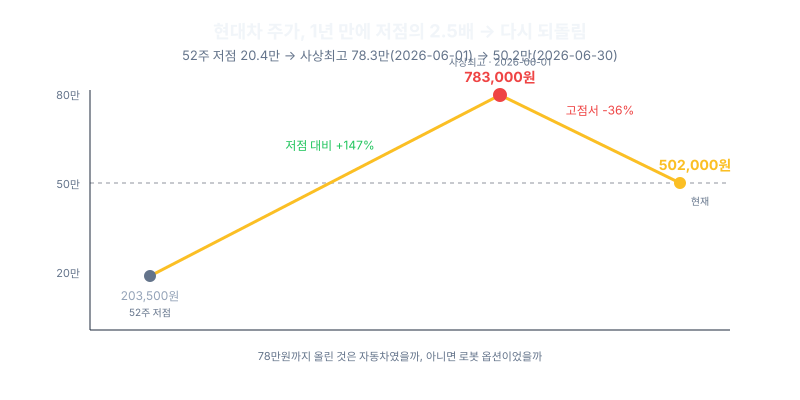
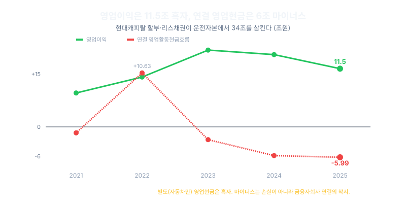
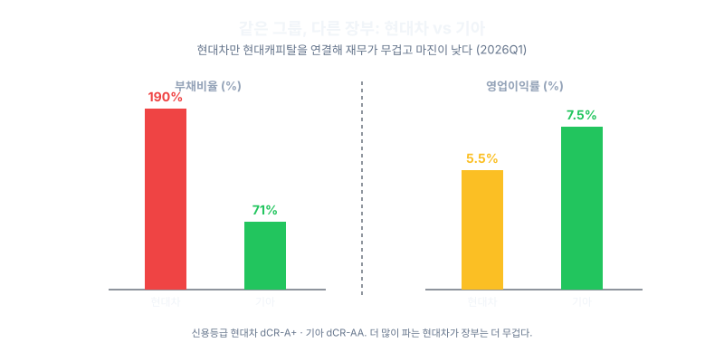
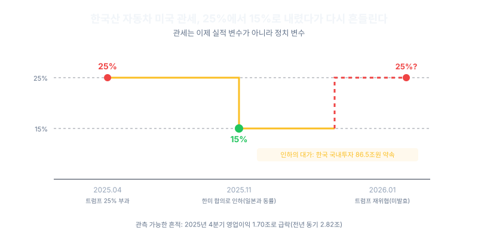
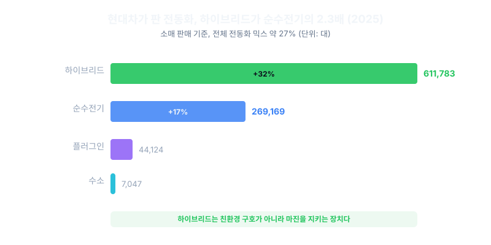
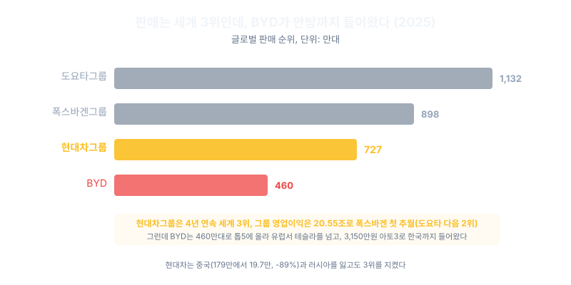
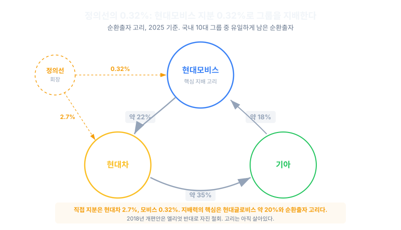
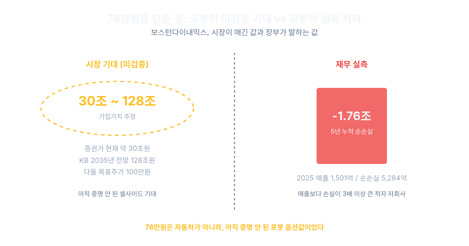

<script>
	import CompanyFinancials from '$lib/components/blog/CompanyFinancials.svelte';
import HFDataLink from '$lib/components/blog/HFDataLink.svelte';
</script>


> **사이클** | 자동차 > 완성차 | 2026-07-03 dartlab 실측
> 같은 시리즈: [SK하이닉스](/blog/000660-skhynix) · [삼양식품](/blog/003230-samyang-foods) · [두산에너빌리티](/blog/034020-doosan-enerbility) · [알테오젠](/blog/196170-alteogen) · [HMM](/blog/011200-hmm) · [셀트리온](/blog/068270-celltrion) · [한화에어로스페이스](/blog/012450-hanwha-aerospace) · [HD현대일렉트릭](/blog/267260-hd-hyundai-electric) · [고려아연](/blog/010130-korea-zinc) · [에이피알](/blog/278470-apr) · [크래프톤](/blog/259960-krafton) · [달바글로벌](/blog/483650-dalba-global) · [경동나비엔](/blog/009450-kyungdong-navien) · [대한조선](/blog/439260-daehan-shipbuilding) · [현대글로비스](/blog/086280-hyundai-glovis) · [농심](/blog/004370-nongshim) · [한온시스템](/blog/018880-hanon-systems) · [LG이노텍](/blog/011070-lg-innotek) · [금호석유화학](/blog/011780-kumho-petrochemical) · [HDC현대산업개발](/blog/294870-hdc-hyundai-dev) · [현대모비스](/blog/012330-hyundai-mobis) · [SKT](/blog/017670-skt) · [GS건설](/blog/006360-gs-engineering) · [현대코퍼레이션](/blog/011760-hyundai-corp) · [한국전력](/blog/015760-kepco) · [에코프로](/blog/086520-ecopro) · [쿠팡](/blog/CPNG-coupang) · [기업이야기 시리즈 전체](/blog/series/company-reports)


<HFDataLink code="005380" />

---

> **연결 영업이익 11.47조인데 영업현금은 마이너스 5.99조. 주가는 20만원에서 78만원을 찍고 50만원으로. 세계 판매 3위 현대차의 재무 기계장치를 한 겹씩 연다.**

---

## 제1막: 11.47조를 벌고 5.99조가 빠져나간 회사, 그리고 40년 전의 조롱

왜 한 해에 11조 넘게 벌었다는 회사의 통장에서, 오히려 6조에 가까운 현금이 빠져나갔을까.

울산 바닷가의 공장에서는 지금도 쉬지 않고 완성차가 조립 라인 끝을 빠져나온다. 2025년 한 해 현대차그룹이 세계에 판 차는 727만대. 이 숫자만 보면 현금이 강물처럼 쌓여야 할 것 같다. 그런데 장부는 정반대의 말을 한다.


2026년 7월 3일, 현대차의 지난해 성적표를 펼치면 두 숫자가 서로를 노려본다. 하나는 2025년 연결 영업이익 11.47조원. 자동차를 팔아 벌었다고 장부에 적힌 돈이다. 다른 하나는 같은 해 연결 영업활동현금흐름 마이너스 5.99조원. 영업을 거쳐 실제로는 현금이 들어온 게 아니라 나갔다는 뜻이다. 벌었다는데 빠졌다. 오타가 아니라 둘 다 사실이다. 이 막은 그 역설을 닫지 않고 활짝 열어두는 데서 시작한다.

### 영업이익 11.47조인데 영업현금은 마이너스 5.99조

한 해만 보면 특이한 사고처럼 보인다. 지난 5년을 나란히 세우면, 이 어긋남이 우연이 아니라 이 회사의 체질이라는 게 드러난다.

| 연도 | 영업이익(조) | 영업CF(조) | 이익-현금(조) | OPM |
|---|---:|---:|---:|---:|
| 2021 | 6.68 | -1.18 | 7.86 | 5.7% |
| 2022 | 9.82 | +10.63 | -0.81 | 6.9% |
| 2023 | 15.13 | -2.52 | 17.65 | 9.3% |
| 2024 | 14.24 | -5.66 | 19.90 | 8.1% |
| 2025 | 11.47 | -5.99 | 17.46 | 6.2% |

읽는 법은 단순하다. 분명히 흑자를 낸 회사인데, 영업으로 들어온 현금은 5년 중 4년이 마이너스였다. 2022년 한 해만 현금이 이익을 넘겼고, 왜 하필 그 해만 예외였는지는 다음 막의 몫이다. 영업이익률(매출 대비 영업이익 비율)이 9.3%까지 올랐던 2023년에도 현금은 2.52조원이 빠졌다. 이익과 현금의 괴리는 2025년에만 17.46조원(11.47조에서 마이너스 5.99조를 뺀 값)에 이른다.

dartlab으로 두 숫자를 직접 불러보면 이렇게 마주 선다.

```python
import dartlab
c = dartlab.Company("005380")  # 현대차, IFRS 연결

c.select("IS", ["영업이익"], freq="Y")           # 2025 11.47조
c.select("CF", ["영업활동현금흐름"], freq="Y")   # 2025 -5.99조
```

여기서 성급하게 "적자 회사 아니냐"고 읽으면 안 된다. 영업이익은 5년 내내 검은 글씨였다. 현금이 어디로 갔는지, 그게 손실인지 아닌지는 2막에서 기계를 열어 확인한다. 이 막에서 붙잡을 것은 하나다. "많이 팔면 현금이 쌓인다"는 상식이 이 회사 앞에서 깨진다.

### 203,500원에서 783,000원, 다시 502,000으로 되돌린 주가

장부만 헷갈리는 게 아니다. 시장이 이 회사에 매긴 가격표는 더 노골적으로 흔들렸다.

| 시점 | 주가(원) | 기준 대비 |
|---|---:|---|
| 52주 저점 | 203,500 | 기준점 |
| 2026-06-01 사상최고 | 783,000 | 저점 대비 +285% |
| 2026-06-30 현재 | 502,000 | 6월 고점 대비 -36% / 1년 +126% |

지난 1년 사이 주가는 저점에서 사상 최고가까지 세 배 넘게 치솟았다가, 그 상승분의 절반 가까이를 다시 반납했다. 2026년 6월 30일 현재 502,000원, 시가총액은 121조에서 128조원 사이다. 주가수익비율(주가를 주당순이익으로 나눈 값)은 약 15.3, 주가순자산비율(주가를 주당 장부가로 나눈 값)은 약 0.9다. 지금 이 회사는 장부가 근처에서 거래된다. 사상 최고가였던 783,000원에서는 그 값이 약 1.4까지 올라가 있었다.



기억해 둘 것이 하나 있다. 이 회사가 자기 장부가의 반값에 팔리던 시절이 있었다. 2024년부터 2025년 초까지다. 지금은 그 반값에서 장부가 근처까지 다시 매겨지는 재평가의 한복판이다. 그러니 78만원까지 갔다가 50만원으로 되돌린 이 왕복은 단순한 변덕이 아니라, 시장이 무언가를 얹었다가 다시 덜어낸 흔적일 수 있다. 무엇을 덜어냈는지는 뒤에서 밝혀진다.

### 판매 727만대로 세계 3위, 이익 20.55조로 2위

규모만 놓고 보면 이 회사가 헷갈릴 이유는 전혀 없어 보인다. 완성차 판매와 영업이익을 세계 상위권과 나란히 세워 보자. 여기서부터는 그룹 전체 숫자이며, 앞서 본 현대차 단독 11.47조원과는 반드시 구분해서 읽어야 한다. 이 글에서 현대차 단독이라 부르는 숫자는 그룹 합산이 아닌 개별 상장사 005380의 연결 실적이며, 현대캐피탈을 떼어낸 별도 실적이 아니다.

| 메이커 | 판매(만대) | 영업이익(조) |
|---|---:|---:|
| 도요타 | 1132 | 40.2 |
| 현대차그룹 | 727 | 20.55 |
| 폭스바겐 | 898 | 15.3 |

2025년 현대차그룹은 727만대(현대차 413.8만, 기아 313.6만)를 팔아 4년 연속 세계 판매 3위에 올랐다. 그 위로는 도요타(1132만대)뿐이다. 그런데 이익 순위는 한 칸 더 높다. 그룹 영업이익 20.55조원으로 폭스바겐(15.3조원)을 연간 기준 처음으로 앞질렀다. 폭스바겐은 현대차그룹보다 더 많이 팔고도(898만대) 덜 벌었다. 판매 순위는 3위인데 이익 순위는 2위인 어긋남. 검증된 현금엔진은 분명히 실재한다.

### 40년 전엔 싸구려로 조롱받던 회사가 지금 벌어들이는 돈

이 규모가 처음부터 있었던 건 아니다. 1986년, 현대차는 엑셀을 앞세워 미국 시장의 문을 두드렸다. 지금으로부터 꼭 40년 전이다. 그 무렵부터 1990년대까지 미국에서 이 회사는 싸구려로 조롱받던 이름이었다. 품질에 찍힌 낙인은 오래갔다.

그래서 이 이야기를 수출신화나 3대에 걸친 위인전으로 포장하고 싶은 유혹이 생긴다. 하지만 그렇게 읽으면 정작 중요한 것을 놓친다. 이건 신화가 아니라 재무 기계장치의 이야기다. 조롱받던 회사가 세계 3위, 이익 2위가 된 것은 사실이지만, 시장은 바로 그 회사를 한때 장부가 반값에 매겼고 지금도 그 값을 확신하지 못한 채 왕복하고 있다.

여기서 통념 하나를 접어두자. 1980년대의 저평가와 2024년의 저평가를 나란히 놓고 "그때 시장이 틀렸으니 지금도 싸다"고 이으면 안 된다. 두 저평가는 원인이 전혀 다르다. 하나는 품질 낙인이었고, 다른 하나는 지금부터 우리가 한 겹씩 뜯어볼 재무 구조의 문제다.

그래서 질문은 이렇게 선다. 세계 3위, 이익 2위인 회사가 왜 한동안 자기 장부가의 반값이었나. 78만원과 50만원을 오간 주가는 시장의 실수였나, 아니면 검증된 현금엔진에 아직 검증되지 않은 무언가가 뒤섞여 매겨진 정당한 가격이었나. 어쩌면 이번엔 시장이 옳았을 수도 있다.

그 답을 찾으려면 가장 먼저 열어야 할 상자가 정해진다. 벌었다는 11.47조가, 대체 어디로 5.99조나 새어나갔는가.

---

## 제2막: 많이 파는데 왜 현금은 마이너스인가

왜, 세계에서 차를 세 번째로 많이 파는 회사가 정작 영업에서 현금을 까먹을까. 장면 하나를 그려보자. 전시장에서 고객이 새 차 키를 받아 문을 나선다. 그런데 차값 전액이 그 순간 현대차 통장에 꽂히는 게 아니다. 많은 고객이 할부나 리스로 산다. 계약서에 서명하는 순간, 현대차그룹의 금융 자회사인 현대캐피탈이 사실상 그 차값을 고객에게 빌려준다. 회사 손에 남는 건 목돈이 아니라, 앞으로 몇 년에 걸쳐 나눠 받을 권리, 즉 대출채권 한 장이다. 이 한 장면이 오늘 막의 전부다. 마이너스의 진짜 범인은 손실이 아니라 이 채권 더미다.

### 영업이익 11.47조 흑자인데 영업현금은 -5.99조

먼저 손익계산서부터 펴자. 2025년 현대차는 연결 기준 매출 186.3조에 영업이익 11.47조, 당기순이익 10.36조를 남겼다. 어느 줄을 봐도 튼튼한 흑자다. 그런데 같은 해 현금흐름표로 넘어가면 영업활동에서 들어온 현금이 마이너스 5.99조다. 벌었다는 이익과 실제로 들어왔다는 현금이 17조 넘게 어긋난다. 이건 2025년 한 해만의 사고가 아니다. 지난 5년을 나란히 놓으면 어긋남에도 규칙이 있다.

아래는 그 5년의 손익과 현금이다(단위 조원, 연결 기준).

| 연도 | 영업이익 | 순이익 | 영업현금 | 운전자본증감 |
|---|---|---|---|---|
| 2021 | 6.68 | 10.66 | -1.18 | - |
| 2022 | 9.82 | 13.46 | +10.63 | - |
| 2023 | 15.13 | 10.07 | -2.52 | - |
| 2024 | 14.24 | 13.23 | -5.66 | -35.16 |
| 2025 | 11.47 | 10.36 | -5.99 | -34.33 |

5년 중 4년이 마이너스고, 흑자로 솟은 해는 2022년 단 하나뿐이다. 여기서 첫 번째 반전이 온다. 이 마이너스는 현금을 불태워 없앤 흔적이 아니다. 대출을 실행해서 '받을 자산'으로 바꿔 쌓아 올린 흔적이다. 대출채권은 담보를 낀 수익 자산이지, 구멍이 아니다. 코드로 직접 확인하면 이렇게 나온다.

```python
import dartlab
c = dartlab.Company("005380")
c.select("CF", ["영업활동현금흐름", "투자활동현금흐름", "재무활동현금흐름"], freq="Y")
# 2025 영업활동현금흐름 = -5.99조
# 매출 186조, 영업이익 11.5조 흑자 회사가 영업에서 현금을 까먹는다.
```



### 순이익 13조대 두 해, 영업현금은 +10.63조와 -5.66조로 갈렸다

그럼 무엇이 현금의 방향을 정하는가. 2022년과 2024년을 겹쳐 보면 답이 튀어나온다. 두 해 순이익은 각각 13.46조와 13.23조로 거의 붙어 있다. 이익만 보면 쌍둥이다. 그런데 영업현금은 한쪽이 플러스 10.63조, 다른 쪽이 마이너스 5.66조다. 같은 이익에서 현금이 약 16조나 반대로 갈린 것이다.

이 스윙을 만든 주어는 손익이 아니다. 표 맨 오른쪽 칸, 운전자본(사업을 굴리는 데 묶이는 돈)의 증감이다. 2024년과 2025년에 이 항목은 각각 마이너스 35.16조, 마이너스 34.33조다. 현대캐피탈 같은 금융 자회사의 할부·리스채권이 그만큼 불어났고, 회계는 채권 증가를 현금 유출로 계상한다. 차를 잘 팔수록 채권이 쌓이고, 채권이 쌓일수록 연결 영업현금은 아래로 눌린다. 반대로 채권 증가가 잦아든 해(2022년)에는 현금이 정상적으로 올라온다. 이익이 아니라 이 금융채권의 팽창과 수축이 방향타를 쥐고 있다는 뜻이다. 부문별 현금흐름이 따로 공개되지는 않지만, 규모로 보면 이 마이너스는 완성차 제조가 아니라 금융 대출자산을 키운 결과가 지배적이다. 본업이 현금을 까먹었다고 읽으면 방향이 어긋난다.

### 부채비율 190% vs 71%, 같은 차 파는데 장부는 2.7배 무겁다

이게 착시라는 걸 증명할 대조군이 마침 같은 그룹 안에 있다. 기아다. 판매 대수로 보면 2025년 현대차가 413.8만대, 기아가 313.6만대로 현대차가 더 많이 판다. 상식대로라면 더 많이 파는 쪽 장부가 더 무겁겠거니 싶다. 그런데 대차대조표를 나란히 놓으면 정반대다.

2026년 1분기 기준, 세 회사의 장부는 이렇게 갈린다.

| 회사 | 부채비율 | OPM | 신용 | 연결에 얹은 것 |
|---|---|---|---|---|
| 현대차 | 190% | 5.5% | dCR-A+ | 캐피탈(할부·리스) |
| 기아 | 71% | 7.5% | dCR-AA | 동급 캡티브금융 미부담 |
| 현대모비스 | 46% | - | dCR-AA | 부품, 캡티브금융 없음 |

여기서 부채비율은 자본 대비 부채의 비율이고, 표 헤더의 OPM은 영업이익률(매출 대비 영업이익 비율)이다. 더 많이 파는 현대차의 부채비율이 190%로, 기아의 71%보다 약 2.7배 무겁다. 두 회사 차이는 딱 하나다. 현대차는 고객에게 직접 할부·리스를 대주는 캡티브 금융을 연결 장부에 통째로 얹었고, 기아는 같은 규모의 그 짐을 연결로 짊어지지 않는다. 부채비율 격차의 주어는 자동차가 아니라 캐피탈 연결이다. 그러니 이 190%를 재무 위기로 읽으면 오독이다. 위기가 아니라, 담보를 낀 대출자산을 얹어 부풀어 보이는 착시다.



### 이자지급 1.9조에서 7.0조로, 4년새 약 4배

착시라는 건 이해했다. 그런데 공짜 착시는 없다. 그 많은 할부·리스채권을 고객에게 내주려면, 회사는 먼저 그 돈을 어딘가에서 조달해 와야 한다. 그 조달의 흔적이 이자지급에 고스란히 찍힌다.

지난 5년 이자로 나간 현금은 이렇게 늘었다(단위 조원).

| 2021 | 2022 | 2023 | 2024 | 2025 |
|---|---|---|---|---|
| 1.9 | 2.7 | 4.2 | 5.9 | 7.0 |

2021년 1.9조에서 2025년 7.0조로, 4년 만에 약 4배로 뛰었다. 같은 기간 연결 자산은 234조에서 369조로 불었다. 금융자산을 키우려 차입을 늘렸고, 늘어난 차입이 이자로 되돌아온 것이다. 이 대목이 중요하다. 마이너스 영업현금, 무거운 부채비율, 불어난 이자는 각각 따로 노는 사고가 아니라, 캐피탈 연결이라는 하나의 톱니에서 함께 돌아가는 세 바늘이다.

### 3년 연속 마이너스 영업현금인데 신용은 dCR-A+

마지막으로, 이 구조를 가장 냉정하게 채점하는 눈이 무엇을 봤는지 확인하자. 신용이다. 상식으로는 3년 연속 영업현금이 마이너스인 회사라면 신용에 금이 가 있어야 한다. 그런데 현대차의 dartlab 신용등급은 dCR-A+, 건전성 점수 72.9에 부도확률 0.04%, 전망은 긍정적이다. 마이너스인데 멀쩡하다.

모순이 아니다. 신용모델은 그 마이너스를 부실이 아니라 담보부 대출자산의 증가로 읽어낸다. 태워 없앤 현금과 대출로 바꿔 쌓은 채권을 구분할 줄 아는 것이다. 즉 시장의 채점기는 이미 착시를 걷어내고 본업의 현금 창출력을 인정하고 있다. 손익은 흑자, 마이너스는 자산 증가, 신용은 A+, 그리고 판매는 세계 3위. 여기까지가 검증된 현금엔진의 실체다.

그렇다면 이렇게 무겁고 정교한 몸, 완성차와 금융을 한 장부에 겹쳐 놓은 이 구조는 대체 어디서, 어떻게 만들어진 것일까.

---

## 제3막: 이 무거운 몸은 어디서 왔나

왜 이 회사의 몸은 이렇게까지 무거울까. 답을 찾으려면 1998년 6월의 판문점으로 가야 한다. 소 1001마리를 실은 트럭들이 줄을 지어 군사분계선을 넘던 날이다. 소년 시절 아버지가 소를 판 돈을 몰래 들고 집을 나섰던 한 노인이, 반세기가 지나 그 소를 갚으러 북으로 가는 길이었다. 지극히 사적인 부채 청산이었다. 그런데 정작 이 회사의 장부에 쌓인 무게는 그런 낭만이 아니다. 소가 아니라 결정들이 켜켜이 굳어 만든 무게이고, 그 결정들은 지금도 재무제표에 그대로 앉아 있다.

### 부채비율 189%, 무게의 정체는 자동차가 아니다

현대차가 정말 자동차 때문에 무거운지 확인하는 가장 빠른 방법은 옆에 형제를 세워보는 것이다. 같은 그룹 안에서 같은 차를 만들고 같은 부품을 나눠 쓰는 회사들의 2026년 1분기 지표다.

| 회사 | 부채비율 | OPM | 신용등급 |
|---|---|---|---|
| 현대차 | 190% | 5.5% | dCR-A+ |
| 기아 | 71% | 7.5% | dCR-AA |
| 현대모비스 | 46% | - | dCR-AA |

부채비율(자기자본 대비 갚아야 할 빚의 비율)이 현대차만 190퍼센트다. 기아는 71퍼센트, 모비스는 46퍼센트. 같은 차를 파는데 현대차 혼자 두세 배 무겁다. 이 차이는 자동차에서 오지 않는다. 현대차가 완성차와 함께 캡티브 금융(현대캐피탈처럼 자동차 할부와 리스를 굴리는 금융 자회사)을 연결로 끌어안고 있기 때문이다. 금융회사의 자산은 원래 빚으로 굴러간다. 그 빚이 통째로 현대차 장부에 얹히니 부채비율이 뛴다. 앞선 막에서 본 운전자본 34조 유출과 영업현금흐름 마이너스 5.99조도 같은 뿌리다. 부실이 아니라 구조다.

```python
import dartlab
for code in ["005380", "000270", "012330"]:   # 현대차, 기아, 현대모비스
    c = dartlab.Company(code)
    print(code, c.credit("등급")["grade"])
# 현대차 dCR-A+ / 기아 dCR-AA / 현대모비스 dCR-AA
# 부채비율은 c.select("BS")의 부채총계 / 자본총계로: 현대차 190% / 기아 71% / 모비스 46%
```

### 그룹 20.55조인데 현대차 단독은 11.47조, 두 몸통은 1998년에 붙었다

이 무게의 절반은 1998년 가을에 시작됐다. 정몽구가 부도난 기아를 떠안은 그 결정이다. 오늘 우리가 아는 현대와 기아, 그리고 제네시스로 이어지는 골격이 그때 하나로 붙었다. 결과는 숫자로 드러난다. 2025년 현대차그룹은 727만대를 팔아 세계 3위다. 현대차가 413만대, 기아가 313만대. 그룹 영업이익은 20조5500억인데, 여기서 현대차 하나만 떼어내면 11조4700억이다. 뒤 막들에서 이 두 숫자를 헷갈리면 안 되는 이유가 바로 여기 있다. 하나는 두 몸통을 합친 그룹이고, 하나는 캐피탈까지 짊어진 현대차 단독이다. 20.55조와 11.47조의 구분은 그날의 인수에서 태어났다.

한때 이 회사는 미국에서 싸구려의 대명사였다. 1986년 엑셀로 미국에 상륙했지만 1980년대 말과 90년대 내내 품질이 낮다는 조롱을 들었다. 그 낙인을 지운 자리에 지금은 제네시스라는 고급 브랜드가 서 있다.


그런데 싸구려에서 럭셔리로 건너오는 다리는 공짜가 아니었다.

### 세타2 누적 8조688억, 신뢰를 돈으로 샀다

그 다리의 이름은 보증이었다. 1999년 정몽구는 미국 시장에 '10년 10만 마일 보증'을 내걸었다. 못 믿겠으면 10년을 책임지겠다는 선언이다. 소비자에겐 신뢰였지만, 회계로 보면 미래의 수리비를 미리 약속한 것이다. 차를 팔 때마다 언젠가 고쳐줄 돈을 제품보증충당부채라는 이름으로 장부에 쌓아둬야 한다. 그렇게 쌓인 약속이 세타2 엔진에서 한꺼번에 터졌다.

| 항목 | 값 | 시점/성격 |
|---|---|---|
| 그룹 누적 충당금 | 8조688억 | 2022년 3분기 기준 |
| 현대차분 | 4조6254억 | 2022년 3분기 |
| 기아분 | 3조4434억 | 2022년 3분기 |
| 미국 집단소송 합의 | 13억달러 | 2021년 5월 최종승인 |
| 대상 차량 | 396만대(현대 230 + 기아 180) | |
| 2020년 3분기 연결 영업손익 | -3138억 | IFRS 후 첫 분기적자 |
| 그중 세타2 충당금 | 2조1352억 | 적자 직접원인 |

그룹이 세타2 하나로 쌓은 충당금이 누적 8조688억이다. 현대차가 4조6254억, 기아가 3조4434억. 미국에서만 396만대가 대상이었고 집단소송은 13억달러에 합의했다([ClassAction.org, 2021.5 최종승인](https://www.classaction.org/blog/hyundai-kia-engine-fires-class-action-1.3-billion-settlement-given-final-approval)). '품질경영'이라는 구호 뒤에 이만한 청구서가 조용히 붙어 있었다.

### 2020년 3분기 영업손익 -3138억, 신뢰의 청구서가 도착한 날

이 청구서가 한꺼번에 날아든 분기가 있다. 2020년 3분기, 현대차 연결 영업손익이 마이너스 3138억을 찍었다. IFRS 회계를 도입한 이래 첫 분기 적자였다. 원인은 딱 하나, 그 분기에 세타2 충당금 2조1352억을 한번에 반영했기 때문이다.

```python
import dartlab
c = dartlab.Company("005380")
c.select("IS", ["영업이익"], freq="Q")
# 2020Q3 = -0.31조. 세타2 충당금 2.14조 반영, IFRS 도입 후 첫 분기적자.
```

여기서 이 막의 반전이 나온다. 현대차를 싸구려에서 구해낸 바로 그 보증이, 20년 뒤 첫 분기 적자를 만든 결정과 같은 결정이다. 신뢰는 공짜가 아니라 장부에 남는 비용이었다.

무게는 여기서 끝나지 않는다. 1998년 확장기에 얽힌 순환출자 고리도 아직 풀리지 않았다. 모비스가 현대차 지분 21~22퍼센트를 쥐고, 현대차가 기아를 34~35퍼센트, 기아가 다시 모비스를 17~18퍼센트 쥐는 원형 구조다. 국내 10대 그룹 중 순환출자가 남은 곳은 여기뿐이다. 2018년 이 고리를 풀려던 개편안은 주주들의 반대로 자진 철회됐다. 복잡함 그 자체가 또 하나의 무게다.

결국 이 무거운 몸은 신화가 아니다. 두 몸통을 붙인 인수, 캐피탈을 끌어안은 연결, 신뢰를 돈으로 산 보증, 그리고 풀지 못한 순환 고리. 전부 사람이 내린 결정의 잔여물이고 지금도 장부에 앉아 있다. 정주영도 정몽구도 정의선도 이 이야기의 주어가 아니라, 그 결정을 내린 손이었을 뿐이다. 그렇다면 이 금융의 무게를 걷어내고 순수하게 자동차만 남기면 어떤 마진이 보일까. 한때 9.3퍼센트였던 그 마진이, 지금 깎이고 있다.

---

## 제4막: 9.3%에서 깎이는 중

왜 이 회사는 4년 만에 매출을 60% 가까이 불렸는데, 정작 한 대를 팔아 남기는 몫은 얇아졌을까. 앞의 막들은 "많이 판다"를 봤다. 이 막은 다른 축을 본다. 잘 버는가. 조립 라인 끝에서 완성차가 쉬지 않고 굴러 나오는 장면은 그대로인데, 그 차 한 대가 회사에 남기는 이익은 2023년을 꼭대기로 조용히 줄고 있다. 매출이라는 겉면은 계속 부풀었지만, 그 아래 마진이라는 속살은 산을 넘어 내려오는 중이다. 먼저 그 산의 정점을 숫자로 찍어보자.

### 영업이익률 9.3%에서 6.2%로, 정점은 2023년이었다

영업이익률(매출 대비 영업이익 비율)은 회사가 물건을 팔아 얼마를 실제로 남기는지 재는 자다. 이 자를 5년에 걸쳐 세워보면 곡선이 딱 산 모양이다. 2021년 5.7%에서 오르기 시작해 2023년 9.3%로 꼭대기를 찍고, 2024년 8.1%, 2025년 6.2%, 그리고 2026년 1분기엔 5.47%까지 내려왔다. 영업이익 절대액도 같은 궤적을 그린다. 2023년의 15.13조가 정점이었고, 2025년엔 11.47조까지 물러섰다. 이 11.47조는 현대캐피탈까지 안은 연결 숫자다. 그룹 전체 20.55조와도, 완성차만 떼어낸 별도 개념과도 다른, 현대차 연결 기준이라는 점을 짚어둔다.

매출은 커지는데 이익률은 내려오는 이 어긋남을 한 장에 겹쳐 보면 이렇다.

| 연도 | 매출(조) | 영업이익(조) | OPM | GPM |
|---|---|---|---|---|
| 2021 | 117.6 | 6.68 | 5.7% | |
| 2022 | 142.5 | 9.82 | 6.9% | |
| 2023 | 162.7 | 15.13 | 9.3% | 20.6% |
| 2024 | 175.2 | 14.24 | 8.1% | |
| 2025 | 186.3 | 11.47 | 6.2% | 18.4% |
| 2026Q1 | 45.9 | 2.51 | 5.47% | |


### 매출총이익률 -2.2%p, 판관비율 +0.9%p, 합이 곧 하락폭

이 압축은 신비한 일이 아니라 산수로 쪼개진다. 영업이익률은 매출총이익률에서 판관비율을 뺀 값이다. 매출총이익률(매출에서 원가를 뺀 몫의 비율)은 2023년 20.6%에서 2025년 18.4%로 2.2%포인트 내렸다. 원가와 판매 믹스가 위에서 눌렀다는 신호다. 판관비율(매출 대비 판매관리비 비율)은 2023년 11.3%에서 2025년 12.2%로 올랐다. 여기서 12.2%는 판관비 22.7조를 매출 186.3조로 나눈 실측값이고, 11.3%는 매출총이익률 20.6%에서 영업이익률 9.3%를 뺀 산술 파생값이다. 원가 쪽에서 2.2%포인트, 판관비 쪽에서 0.9%포인트, 합쳐 3.1%포인트가 빠진다. 영업이익률이 9.3%에서 6.2%로 떨어진 그 3.1%포인트와 소수점까지 맞아떨어진다. 마진이 깎인 자리는 미스터리가 아니라 원가율 상승과 판관비율 상승의 합, 딱 그만큼이다.

### 2024년 4분기 2.82조가 2025년 4분기 1.70조로

왜 연간 곡선은 완만해 보이는데, 실제 충격은 급성이었나. 관세가 특정 분기에 몰아쳐 들어왔기 때문이다. 2025년 4월 3일 미국이 수입차에 25% 관세를 매겼고, 그 타격이 고스란히 드러난 곳이 4분기다. 관세가 아직 없던 2024년 4분기 영업이익은 2.82조였다. 그 자리가 2025년 4분기엔 1.70조로 주저앉았다. 한 분기 만에 40% 가까이 꺾인 것이다. 회사는 관세로 얼마를 뜯겼는지 총액을 밝히지 않았으므로, 지어내지 않는다. 우리가 정직하게 들 수 있는 증거는 이 분기 급락뿐이다. 이 급락에는 제품 믹스나 환율 변동도 섞였겠지만, 관세 총액이 공개되지 않아 요인별로 가를 수는 없다.

| 분기 | 영업이익(조) | 상황 |
|---|---|---|
| 2024Q4 | 2.82 | 관세 부과 전 |
| 2025Q4 | 1.70 | 관세 국면, 40% 급락 |
| 2026Q1 | 2.51 | 15%로 인하된 뒤 |

되돌아온 2026년 1분기의 2.51조를 떠받친 건 2025년 11월 1일의 완화다. 미국이 한국산 관세를 25%에서 15%로, 그것도 소급해 내렸다([Korea Herald](https://www.koreaherald.com/article/10628014)). 대가는 가벼운 게 아니었다. 그룹이 2026년부터 2030년까지 미국에 865억 달러를 투자하겠다고 발표했다. 그러니 1분기 회복을 "이겨냈다"로 단정하긴 이르다. 2026년 1월 말 미국은 다시 25%를 위협했고, 이건 아직 법으로 발효되진 않았다. 지금 마진을 받치는 그 15%가 언제든 되돌아갈 수 있다는 뜻이다.



### 미국 점유율 11.3% 사상최고, 마진을 갈아 산 것

여기서 판단을 한 번 뒤집는 숫자가 나온다. 마진이 깎인 바로 그 2025년에, 미국 시장 점유율은 사상 최고를 찍었다. 현대차와 기아, 제네시스를 합쳐 184만 대, 점유율 11.3%다. 마진이 내려간 해에 점유율은 올라간 해. 이건 우연이 아니다. 관세를 가격에 다 얹어 소비자에게 떠넘기는 대신, 상당 부분을 회사가 마진으로 삼켜 점유율을 지키고 늘린 선택의 결과다. 사상 최고 점유율은 승리의 트로피가 아니라 청구서였다. 수익성을 갈아 점유율을 산 것이고, 그게 "많이 파는데 왜 덜 버나"라는 질문의 한복판이다.

### 기아 7.5% vs 현대차 5.5%, 같은 관세인데 벌어지는 2%포인트

관세 하나로 다 설명된다면, 같은 그룹의 형제도 똑같이 눌려야 한다. 그런데 2026년 1분기, 기아의 영업이익률은 7.5%, 현대차는 5.5%다. 같은 관세를 맞은 두 회사 사이에 2%포인트가 벌어져 있다. 부채비율도 현대차 190%에 기아 71%, 현대모비스 46%로 결이 다르다.

| 지표 | 현대차 | 기아 | 현대모비스 |
|---|---|---|---|
| OPM | 5.5% | 7.5% | |
| 부채비율 | 190% | 71% | 46% |
| dCR | A+ | AA | AA |

이 격차가 말해주는 건, 현대차 마진 열위의 일부는 외부 관세가 아니라 현대차 자신의 몫이라는 것이다. 판매 믹스든 구조든, 형제보다 덜 남기는 이유가 회사 안에 있다는 신호다. 다만 그 원인을 특정 숫자로 쪼갤 재료는 우리 손에 없으므로, 여기까지는 가설로 둔다.

이 곡선 전체는 손으로 그린 게 아니라 재무제표에서 그대로 뽑은 것이다.

```python
import dartlab
c = dartlab.Company("005380")   # 현대차, IFRS 연결

# 손익 6행 연간 시계열
c.select("IS", ["매출액", "매출원가", "매출총이익",
                "판매비와관리비", "영업이익", "당기순이익"], freq="Y")
# 영업이익률 = 영업이익/매출, 매출총이익률 = 매출총이익/매출
# → 2023년 9.3% 정점, 2025년 6.2%, 매출총이익률 20.6%→18.4% 확인

# 관세 급락은 분기 해상도로 한 번 더
c.select("IS", ["매출액", "영업이익"], freq="Q")   # 2024Q4 2.82조 → 2025Q4 1.70조
```

마지막으로, 정점 복귀를 기대하기 어려운 이유 하나. 9.3%로 돌아가자는 목표를 회사 스스로 접었다. 과거 10%를 걸었던 중장기 영업이익률 목표를 2027년 7~8%, 2030년 8~9%로 낮춰 잡았다(회사가 제시한 미래 목표값이다). 경영진조차 단기간 안에 옛 정점으로 돌아간다고 보지 않는다는 뜻이다.

그렇다면 이 깎이는 마진을 회사는 어디서 방어하고 있을까. 그 방어선의 이름이 하이브리드인데, 다음 막은 그것이 전동화라는 미래 서사가 아니라 지금 마진을 지키는 원가의 기계장치임을 뜯어본다.

---

## 제5막: 하이브리드는 전동화 서사가 아니라 마진 방어 기계다

왜 현대차는 순수 전기차보다 하이브리드를 두 배 넘게 팔았을까.

장면 하나. 2025년 미국 조지아의 새 공장 라인 위로 차가 흘러나온다. 그런데 라인을 더 자주 채우는 건 큰 배터리를 통째로 안은 순수 전기차가 아니라, 기존 엔진차에 작은 배터리 하나를 얹은 하이브리드다. 세상은 이 장면을 "전동화가 빨라진다"고 읽는다. 그런데 회사의 판매 장부를 열면 정반대 이야기가 나온다.

2025년 한 해 현대차가 소매로 판 하이브리드는 611,783대, 순수 전기차는 269,169대였다. 하이브리드가 전기차의 약 2.27배다. 늘어난 속도도 갈렸다. 하이브리드가 32% 늘어날 때 전기차는 17% 느는 데 그쳤다. 전동화 차종을 다 합쳐도 전체 판매의 27%인데, 그 안에서 무게추가 하이브리드 쪽으로 확 쏠린 것이다.

### 하이브리드 611,783대, 전기차의 2.27배

두 차종이 실제로 어떻게 갈렸는지 한 표로 보면 이렇다.

| 구분 | 2025 소매(대) | 전년비 | 비고 |
|---|---|---|---|
| 하이브리드(HEV) | 611,783 | +32% | 전기차의 약 2.27배 |
| 전기차(BEV) | 269,169 | +17% | 성장 속도 절반 수준 |
| 전동화 믹스 | 27% | - | 무게추는 하이브리드 |



왜 이렇게 기울었을까. 여기서 원가 이야기가 나온다. 순수 전기차는 큰 배터리 팩 하나가 차값 원가에서 큰 몫을 차지한다. 공장에 이미 깔아둔 설비를 재활용하지도 못하고, 한 대 더 팔수록 그 배터리 값이 이익을 눌러 남기기가 어렵다. 반대로 하이브리드는 기존 내연기관 라인에 작은 배터리를 하나 얹는 구조다. 엔진 공장이며 금형이며 이미 돈을 들여 깔아둔 자산을 그대로 다시 쓴다. 같은 한 대를 팔아도 손에 남는 몫이 다르다. 이게 원가 레버리지다. 없던 걸 새로 짓는 대신, 있던 걸 다시 쓰는 데서 이익이 나온다.

### 영업이익률 9.3%에서 6.2%로, 이 기계가 지키는 전선

그럼 현대차는 왜 하필 지금 원가가 헐한 쪽으로 물량을 실었나. 지키려는 게 있기 때문이다. 영업이익률이 2023년 9.3%에서 2024년 8.1%, 2025년 6.2%로 3년째 깎였다. 물건을 팔아 남기는 몫인 매출총이익률도 2023년 20.6%에서 2025년 18.4%로 내려앉았다. 이 눌리는 이익률이 바로 하이브리드 기계가 방어하려는 전선이다.

이 압축은 dartlab에서 연결 손익 표를 그대로 열어 재현한다.

```python
import dartlab
c = dartlab.Company("005380")
c.select("IS", ["매출액", "영업이익"], freq="Q")
# 2024Q4 영업이익 2.82조, 2025Q4 1.70조 (관세 반영)
```

압축의 손끝을 가장 선명하게 보여준 건 2025년 4분기다. 영업이익이 1.70조로 주저앉았다. 한 해 전 같은 분기의 2.82조와 나란히 놓으면 어디서 새는지가 보인다. 2025년 4월 3일 미국이 수입차에 25% 관세를 물리면서, 바다 건너 실어 보낸 차마다 관세가 이익을 갉아먹은 것이다.

### 조지아 50만대, 관세벽 안쪽으로 옮겨지는 하이브리드

그래서 원가 레버리지라는 제품 차원의 방어에, 두 번째 방어가 곱해진다. 어디서 만드느냐다. 배로 실어 보내면 관세를 맞지만, 관세벽 안쪽에서 만들면 그 비용 자체가 구조적으로 사라진다. 현대차의 조지아 공장(메타플랜트)은 2024년 10월 7일 아이오닉5로 실제 가동에 들어갔고, 2025년 3월 26일 준공식을 치렀다. 연 최대 50만대 규모다. 그리고 2026년 6월 2일, 이 공장에서 그룹의 첫 하이브리드인 기아 스포티지가 양산에 들어갔다. 원가가 헐한 제품을, 관세를 피하는 자리에 옮겨 놓는 순간이다.

지리와 정책이 마진을 어떻게 흔들었는지 시간 순서로 보면 이렇다.

| 시점 | 이벤트 | 마진 함의 |
|---|---|---|
| 2024.10.7 | 조지아 공장 가동(아이오닉5) | 미국 현지생산 개시 |
| 2025.4.3 | 수입차 관세 25% | 4분기 영업이익 1.70조로 급락 |
| 2025.9.30 | 연방 전기차 세액공제 7,500달러 폐지 | 전기차 수요 지지 제거 |
| 2025.11.1 | 관세 25%에서 15%로(소급) | 부담 일부 완화 |
| 2026.6.2 | 조지아 첫 하이브리드(기아 스포티지) 양산 | 하이브리드가 관세벽 안쪽으로 |

여기서 반전이 하나 더 붙는다. 방어 순풍의 일부는 회사가 만든 게 아니다. 2025년 9월 30일 미국이 전기차 한 대당 붙여주던 세액공제 7,500달러를 없앴다(2025년 7월 4일 서명된 법에 담겼다. [CNBC](https://www.cnbc.com/2025/07/01/trump-big-beautiful-bill-axes-7500-ev-tax-credit-after-september.html)). 전기차를 싸게 만들어주던 버팀목이 빠지자, 제품 무게추는 자연히 하이브리드 쪽으로 더 기울었다. 정책이 등을 밀어준 셈이다.

### 목표를 10%에서 7~8%로 내린 이유

그런데 이 기계가 잘 돈다고 옛 영광이 돌아오는 건 아니다. 회사는 중장기 영업이익률 목표를 과거 10%에서 2027년 7~8%, 2030년 8~9%로 스스로 낮춰 잡았다. 하이브리드 방어가 작동해도 경영진조차 9%대 정점을 다시 겨냥하지 않는다는 뜻이다. 하이브리드는 전선을 지키는 기계이지, 잃은 고지를 되찾는 기계가 아니다.

| 기준 | 영업이익률(OPM) 목표 |
|---|---|
| 과거 | 10% |
| 2027 | 7~8% |
| 2030 | 8~9% |

더 불편한 건 방어 레버의 절반이 현대차 손 밖에 있다는 점이다. 4분기 이익을 1.70조로 때린 것도 관세였고, 그걸 25%에서 15%로 소급해 풀어준 것도 관세였다. 전기차 수요를 받쳐주던 세액공제를 없앤 것도 워싱턴이었다. 마진을 지키는 기계는 실재하지만, 그 스위치의 일부는 현대차가 아니라 미국 정부가 쥐고 있다.

그래서 하이브리드 급증을 전동화 승전보로 읽으면 절반을 놓친다. 이건 이익이 눌리는 국면에서 원가가 헐한 쪽으로 물러선 방어 행위이고, 그 방어 자체는 원가 레버리지라는 물리로 설명되는 진짜 기계장치다. 다만 이 기계는 지금 서 있는 전선을 지킬 뿐, 이미 잃어버린 시장까지 되찾아주지는 못한다. 그리고 현대차가 어느 거대시장을 잃었는지, 안방에는 누가 밀고 들어왔는지는 다음 장면의 몫이다.

---

## 제6막: BYD가 안방까지, 그리고 두 거대시장을 잃고도

왜 세계 판매 3위 회사의 지도는 해마다 좁아지는가. 펼쳐 보면 영락없는 후퇴다. 2016년 중국에서 현대차그룹은 179만 대를 팔았다. 그 해 중국 점유율은 7.5퍼센트, 베이징 외곽 공장들은 밤에도 라인이 돌았다. 아홉 해가 지난 2025년, 같은 자리에서 팔린 차는 19만 7천 대다. 점유율은 0.83퍼센트로 내려앉았고, 아홉 해 만에 89퍼센트가 증발했다. 공장은 하나씩 팔려 나갔다. 베이징 1공장은 2021년에, 충칭 공장은 2023년에 약 2990억 원에 넘어갔고, 지금은 베이징 2공장과 3공장만 남았다.

후퇴의 지도는 중국에서 멈추지 않는다. 러시아 상트페테르부르크 공장은 2023년 12월에 단돈 1만 루블, 우리 돈으로 약 14만 원에 팔렸다. 사실상 명목상의 가격이다. 2년짜리 되사기 옵션이 붙어 있었지만 2025년 12월에 그 권리를 포기하면서 러시아에서는 완전히 발을 뺐다. 인도는 좀 더 미묘하다. 오랫동안 마루티에 이은 2위였는데, 2025년에는 마힌드라와 타타에 밀려 3위로 내려앉았다. 다만 인도에서는 짐을 싸는 대신, 2024년 10월 현지법인을 인도 증시 사상 최대 규모로 상장시키며 지분 17.5퍼센트를 팔아 약 4조 5천억 원을 본사 금고로 당겨왔다.

### 중국 179만대에서 19.7만대로, 89% 증발한 지도

세 시장에서 벌어진 일을 성격까지 붙여 한 화면에 놓으면 이렇게 정리된다.

| 시장 | 과거 | 2025년 | 성격 |
|---|---|---|---|
| 중국 | 2016년 179만 대 (7.5%) | 19.7만 대 (0.83%), -89% | 공장 순차 매각, 저수익 정리 |
| 러시아 | 상트페테르부르크 공장 | 1만 루블 명목 매각, 완전철수 | 되사기 옵션 2025.12 포기 |
| 인도 | 2024년 2위 | 2025년 3위(마힌드라·타타) | 지분 17.5% 매각, 4.5조 본사로 |
| (대비) 미국 | | 184만 대, 점유율 11.3% | 사상 최고 |

여기서 첫 번째 반전이 온다. 표 맨 아랫줄, 미국이다. 같은 2025년에 현대와 기아와 제네시스는 미국에서 183만 6172대를 팔았다. 점유율 11.3퍼센트, 사상 최고치다. 두 거대시장을 잃는 동안, 정작 돈을 버는 시장에서는 역대 가장 큰 몫을 차지했다.

### 판매는 3위인데 이익은 2위, 폭스바겐 15.3조를 처음 넘었다

그룹 전체로 시야를 넓히면 후퇴 서사는 더 흔들린다. 2025년 현대차그룹은 727만 대를 팔았다. 현대차 413만 8천 대에 기아 313만 6천 대를 더한 숫자이고, 도요타(1132만 대)와 폭스바겐(898만 대)에 이은 세계 3위다. 4년 연속 3위. 그런데 이익 순위는 판매 순위와 어긋난다.

판매 등수와 이익 등수가 어떻게 벌어지는지를 나란히 놓아 본다.

| | 판매(만 대) | 영업이익(조 원) |
|---|---|---|
| 도요타 | 1,132 (1위) | 40.2 (1위) |
| 현대차그룹 | 727 (3위) | 20.55 (2위) |
| 폭스바겐 | 898 (2위) | 15.3 (3위) |



판매는 3위인데 영업이익은 2위다. 그룹 영업이익 20조 5500억 원은 판매 2위 폭스바겐의 15조 3천억 원을 연간 기준으로 처음 넘어선 숫자다. 영업이익률로 따지면 6.6퍼센트. '많이 파는데 못 번다'는 말은 적어도 그룹 장부에서는 성립하지 않는다. 오히려 적게 파는 폭스바겐보다 많이 벌었다. 그러니 문제는 회사 전체가 아니라 한 칸 안쪽, 현대차 단독 재무구조로 좁혀진다.

### 그룹 20.55조와 현대차 단독 11.47조, 무게는 실력이 아니다

여기서 숫자 하나를 반드시 구분해야 한다. 방금 본 그룹 영업이익 20조 5500억 원과, 현대차 단독 영업이익 11조 4700억 원은 다른 숫자다. 둘 다 IFRS 연결 기준이지 별도 실적이 아니다. 그룹은 판매 3위에 이익 2위인데, 현대차 하나만 떼어내면 2025년 매출은 6.3퍼센트 늘고도 영업이익은 오히려 19.5퍼센트 줄었다. 판매는 늘고 이익은 준 그 역설이 단독 장부에서 벌어졌다.

이 무게가 실력 부족인지 확인하는 데는 2막에서 이미 열어본 톱니로 충분하다. 현대차만 부채비율이 190퍼센트로 기아(71퍼센트)와 모비스(46퍼센트)의 두세 배인데, 그 격차는 자동차가 아니라 현대캐피탈 연결에서 온다. 영업현금 마이너스 5조 9900억 원도, 운전자본에서 빠진 34조 3300억 원도 손실이 아니라 할부와 리스 채권이 불어난 자리다. 무거워 보이는 것과 위험한 것은 다르다. 신용등급은 dCR-A플러스, 부도확률 0.04퍼센트로 멀쩡하다. 시장이 오래 현대차를 '무거운 회사'로 본 것은 신화가 아니라 이 대차대조표였고, 그 무게 위로 관세와 믹스가 마진을 더 눌렀다.

### 아토3 3150만원, BYD 시총 1160억 달러가 안방으로

지금까지의 후퇴에는 공통점이 있었다. 중국도 러시아도 인도도, 현대가 스스로 선택해서 빠졌거나 지분을 팔아 현금을 챙긴 자리였다. 그런데 마지막 벡터는 방향이 반대다. 현대가 빠질 수 없는 자리, 바로 안방으로 들어온다. 2025년 1월, 중국 BYD의 전기차 아토3가 한국에 3150만 원짜리 가격표를 달고 상륙했다. 같은 해 BYD는 전 세계에서 460만 대를 팔아 판매 톱5에 진입했고, 2025년 4월에는 유럽 월간 순수 전기차 판매에서 테슬라를 처음으로 앞질렀다([JATO Dynamics](https://www.jato.com/resources/media-and-press-releases/byd-outsells-tesla-in-europe-for-the-first-time-as-registrations-surge-in-april)).

두 회사의 벡터를 나란히 놓으면 결이 다르다.

| 축 | BYD | 현대차 |
|---|---|---|
| 한국 안방 | 아토3 3,150만 원(2025.1) | 방어하는 쪽 |
| 글로벌 판매 | 460만 대 톱5 | 그룹 727만 대 3위 |
| 유럽 전기차 | 테슬라 첫 추월(2025.4) | 하이브리드로 방어 |
| 시가총액 | 약 1160억 달러 | 약 121~128조 원 |
| 재무 벡터 | 저가 전기차, 캐피탈 무게 없음 | 하이브리드 방어 + 캐피탈 연결 무게 |

시가총액을 보자. BYD는 2026년 7월 기준 약 1160억 달러다. 현대차는 2026년 6월 말 약 121조에서 128조 원 사이. 환율과 시점이 서로 달라 정밀 비교는 아니지만, 대략 1달러 1380원에 맞춰 환산하면 현대차는 880억에서 930억 달러쯤 된다. 시장은 지금 BYD를 현대차보다 대략 1.25배에서 1.3배 무겁게 값매기고 있다. BYD는 저가 전기차로 밀고 들어오면서, 앞서 본 캐피탈 연결 같은 대차대조표의 무게가 없다. 가볍다. 현대는 그 공세를 하이브리드 마진 방어로 받아내는 중이다.

여기까지 오면 반전은 두 겹으로 겹쳐 있다. 두 거대시장을 잃고도 그룹은 판매 3위, 이익 2위, 미국 사상 최고였다. 잃은 시장들은 애초에 못 벌던 자리의 정리였다. 진짜 리스크는 지도 위의 상실이 아니라 현대차 단독 장부의 무게이고, 그 무게 위로 관세와 믹스가 마진을 눌렀다. 통제된 후퇴는 이렇게 끝났지만, 스스로 고를 수 없는 경쟁 벡터가 안방에서 막 시작됐다. 이 다툼의 진짜 압력은 밖이 아니라 안에서 오는데, 그 현금이 어디로 새는지 그리고 누가 단 0.32퍼센트로 그룹 전체를 쥐고 있는지가 이제 남은 질문이다.

---

## 제7막: 번 현금은 세 곳으로 새고, 0.32%가 지배한다

왜, 주주에게 배당과 자사주로 한 해 4조 넘는 현금을 돌려준 회사가, 정작 그해 영업으로 손에 쥔 현금은 마이너스였을까. 회의실 한쪽에서는 배당 3조 6900억원을 내보내는 결재가 오가고, 다른 쪽에서는 자기 회사 주식을 7100억원어치 사들이라는 지시가 떨어진다. 그런데 같은 해, 영업활동으로 실제 회사 통장에 들어온 현금(팔아서 손에 남긴 진짜 현금)은 5조 9900억원 마이너스다. 곳간은 비었는데 잔치가 벌어지고 있었다. 앞선 막에서 완성차 엔진이 그룹 영업이익 20조가 넘게, 현대차 단독으로도 11조 4700억원을 벌었다는 건 확인했다. 그렇게 번 현금은 대체 어디로 갔을까. 답은 세 갈래 물줄기에 있다.

### 5.9조에서 11.1조로, 관세를 피하려 지은 공장이 첫 번째 물줄기

첫 번째 물줄기는 공장이다. 설비투자(공장과 설비, 그리고 소프트웨어 같은 무형자산에 쏟아부은 돈)는 2021년 5조 9000억원에서 2025년 11조 1000억원으로 불었다. 4년 만에 거의 두 배다. 왜 하필 이 시점에 투자를 두 배로 늘렸을까. 앞 막에서 본 관세가 여기에 걸려 있다. 미국이 수입차에 25% 관세를 물리자, 이를 피하는 길은 미국 안에서 만드는 것뿐이었다. 조지아의 메타플랜트가 그렇게 섰고, 인도 현지생산이 그렇게 커졌다. 관세를 피하려면 현금을 먼저 땅에 묻어야 한다. 이게 첫 번째 유출이다.

### -34.33조, 캐피탈이 삼킨 운전자본이 두 번째 물줄기

두 번째 물줄기는 눈에 잘 안 보인다. 현대차는 차만 파는 회사가 아니다. 차를 살 돈을 빌려주는 현대캐피탈을 연결로 안고 있다. 고객이 할부로 차를 사면, 그 할부채권은 현대차 장부에서 '나간 현금'처럼 잡힌다. 2025년 이 운전자본 항목에서 빠져나간 현금이 34조 3300억원, 2024년에는 35조 1600억원이었다. 손실이 아니다. 돈을 떼인 게 아니라, 고객에게 빌려준 채권이 그만큼 늘어난 것이다. 하지만 장부에서는 완성차가 번 현금을 딱 그만큼 가린다. 1막과 2막에서 던진 '영업현금 마이너스 5조 9900억원'이라는 수수께끼가, 여기 자본배분의 관점에서 다시 얼굴을 내민다.

이 세 갈래를 한 장에 모으면, 번 현금과 쓴 현금의 어긋남이 눈에 들어온다. 아래는 모두 연결 기준 실측값이다.

| 연도 | 영업CF | 설비투자 | 배당지급 | 자사주취득 | 이자지급 | 운전자본증감 |
|---|---|---|---|---|---|---|
| 2021 | -1.18 | 5.9 | 1.19 | - | 1.9 | (미제공) |
| 2022 | +10.63 | 5.7 | 1.35 | - | 2.7 | (미제공) |
| 2023 | -2.52 | 8.9 | 2.50 | - | 4.2 | (미제공) |
| 2024 | -5.66 | 10.4 | 3.91 | - | 5.9 | -35.16 |
| 2025 | -5.99 | 11.1 | 3.69 | 0.71 | 7.0 | -34.33 |

(단위 조원)

### 1.9조에서 7.0조로, 이자가 계단처럼 오른 진짜 이유

여기서 반전이 나온다. 이자로 나간 현금은 2021년 1조 9000억원에서 2025년 7조원으로, 4년 만에 약 네 배가 됐다. 그런데 이 이자의 주된 동인은 배당이 아니다. 같은 기간 연결 자산이 234조원에서 369조원으로 불었고, 그 대부분은 현대캐피탈의 대출자산이다. 금융북을 키우려 차입을 늘렸고, 늘어난 차입이 이자로 되돌아온 것이다. 물론 영업으로 들어온 연결 현금이 마이너스인 상태에서 공장과 배당과 자사주가 함께 빠져나가니, 부족분은 어디선가 조달된다. 다만 완성차 자체의 현금이 배당을 대는지 아닌지는 부문별 현금흐름이 공개되지 않아 단정할 수 없다. 확실한 것은 이 회사가 금융을 키우는 만큼 이자도 함께 커지는 구조라는 점이다. 부채비율은 189%, 자산 369조원에 자본 128조원이다.

이 어긋남은 dartlab로 직접 불러 한 화면에서 확인할 수 있다.

```python
import dartlab
c = dartlab.Company("005380")   # 현대차, IFRS 연결
c.select("CF", ["영업활동현금흐름", "유형자산의취득", "무형자산의취득",
                "배당금지급", "자기주식의취득", "이자지급(-)"], freq="Y")
# 2025 (조원): 영업현금 -5.99 / 설비투자(유형+무형) 11.1 / 배당 3.69 / 자사주 0.71 / 이자 7.0
# 벌지 못한 현금을 차입이 메우고, 이자가 계단처럼 뛴다
```

### 0.32%가 그룹 전체를 지배한다, 밸류업과 승계는 한 몸

이 현금기계 위에 또 하나의 장치가 얹혀 있다. 지배구조다. 정의선 회장이 그룹의 핵심 회사인 현대모비스에 가진 지분은 0.32%, 현대차 지분도 2.6에서 2.7% 남짓이다. 이 작은 숫자로 어떻게 그룹 전체를 움직일까. 열쇠는 고리다. 현대모비스가 현대차의 21에서 22%를 쥐고, 현대차가 기아의 34에서 35%를, 기아가 다시 현대모비스의 17에서 18%를 쥔다. 원을 그리며 서로가 서로를 붙드는 순환출자다. 국내 10대 그룹 가운데 이 고리가 남은 곳은 현대차그룹뿐이다. 정의선 회장은 이 원 안에서 개인 지분율이 약 20%로 가장 높은 현대글로비스를 지렛대 삼아 정점에 선다. 소량의 지분이 그룹 전체를 드는 지렛대인 셈이다.



이 고리를 풀려는 시도가 없던 건 아니다. 2018년 5월 22일, 현대모비스를 분할해 합치는 개편안이 나왔지만, 행동주의 펀드 엘리엇과 의결권 자문사의 반대로 자진 철회됐고, 엘리엇은 2020년 초 지분을 정리하고 떠났다. 고리는 그대로 남았다.

여기서 두 번째 반전. 앞서 본 주주환원과 이 지배구조는 대립하지 않는다. 오히려 같은 현금흐름, 같은 지렛대 위에 있다. 2024년 8월 28일 '현대 웨이'라는 이름의 계획이 나왔는데, 한때 '현대차는 자사주에 소극적'이라던 통념을 그대로 뒤집는 내용이었다.

| 구분 | 내용 | 성격 |
|---|---|---|
| 총주주수익률 2025~2027 | 최소 35% | 목표 |
| 배당성향 | 지배주주 순이익의 25% 이상 | 목표 |
| 자사주 | 3년간 최대 4조 매입·소각 | 목표 |
| 최소배당 | 주당 1만원, 분기 2500원 | 정책 |
| 자사주 소각 | 2025.4.24 약 9160억 실행 | 실측 |
| 자사주 취득 | 2025년 0.71조 | 실측 |

말이 아니라 실행이었다. 그렇다면 이 주주환원의 재원은 어디서 오나. 한 교차점이 2024년 10월 22일 인도에 있었다. 현대차 인도법인이 인도 증시 사상 최대 규모로 상장했는데, 신주를 한 주도 찍지 않고 현대차가 들고 있던 지분 17.5%를 통째로 파는 100% 구주매출이었다. 그렇게 손에 쥔 약 4조 5000억원, 33억달러는 전부 본사로 흘러들어왔다([JPMorgan](https://www.jpmorgan.com/insights/banking/investment-banking/hyundai-motor-india-record-ipo)). 소액주주에게 지분을 팔아 만든 현금이 본사의 자본배분 재원이 되고, 동시에 오너 승계의 재원과 겹친다. 밸류업(소액주주의 편익)과 승계(0.32%로 그룹을 쥐는 구조의 유지)는 서로 맞서는 게 아니라, 한 통장 위에서 같이 움직이는 한 몸이다.

판단은 이렇다. 완성차 엔진은 분명히 현금을 번다. 하지만 그 현금은 벌자마자 공장과 캐피탈 채권과 주주에게 세 갈래로 새고, 부족분은 빚으로 메워 이자가 4년새 네 배로 뛰었다. 밸류업이 계속 가느냐는 결국 이 완성차 현금엔진이 캐피탈 자산 증가와 설비투자를 이겨내느냐에 달려 있다. 그런데 2026년 6월 1일, 이 회사 주가는 78만 3000원까지 치솟았다. 지금까지 따라온 현금 장부 그 어디에도 없는 값이 그 안에 섞여 있었고, 그 값의 정체는 자동차가 아니었다.

---

## 제8막: 78만원의 정체는 자동차가 아니라 로봇이었다

왜 자동차 회사의 주가가, 정작 그 자동차가 가장 힘들 때 사상 최고를 찍었을까.

2026년 6월 1일, 현대차 주가는 783,000원을 찍었다. 상장 이래 가장 높은 값이다. 그런데 같은 시기의 완성차는 웃고 있지 않았다. 앞선 막들에서 확인한 대로, 2025년 연결 영업이익은 11.47조로 전년보다 19.5% 줄었고, 영업이익률은 6.2%까지 눌려 있었다. 관세와 믹스가 마진을 깎는 한복판이었다. 자동차가 가장 힘겨운 순간에 주가는 가장 높았다. 이 어긋남이 이번 막의 질문이다. 78만원을 밀어올린 것은 대체 무엇이었나.

### 783,000원인데 자동차 영업이익은 -19.5%, 프리미엄은 자동차가 아니다

먼저 장부가부터 소환해 보자. dartlab로 자동차의 실체를 꺼낸다.

```python
import dartlab
c = dartlab.Company("005380")
c.select("IS", ["매출액", "영업이익", "당기순이익"], freq="Y")  # 2025: 186.3 / 11.47 / 10.36 (조원)
c.select("BS", ["자본총계"], freq="Y")                         # 2025 자본총계 128조 = 장부가
# 시장가(2026-06-30): 시총 121~128조 → 주가순자산비율 약 0.9 (장부가 근처)
```

자본총계, 곧 장부가가 128조다. 2026년 6월 30일 기준 시가총액은 121조에서 128조 사이. 주가순자산비율이 약 0.9다. 딱 장부가 근처. 검증된 현금엔진을 시장은 장부만큼만 매긴 셈이다. 이건 실측으로 방어된다.

그런데 783,000원에서는 이야기가 달라진다. 그 값에서 주가순자산비율은 약 1.4였다. 장부가 위로 절반가량 프리미엄이 얹혔다는 뜻이다. 문제는 그 프리미엄을 정당화할 무언가가 자동차 쪽엔 없었다는 것이다. 자동차는 오히려 영업이익이 뒷걸음치는 중이었으니까.



### 로봇 매출 1,501억, 연결 매출의 0.08%, 재무제표엔 거의 안 보인다

프리미엄의 촉매는 자동차가 아니었다. 로봇이었다. 정확히는 보스턴다이내믹스, 현대차그룹이 2021년에 소프트뱅크에서 사들인 로봇 회사다. 그런데 이 회사를 현대차 연결 재무제표에서 찾으려 하면, 반올림 오차 수준으로만 보인다.

숫자로 확인해 보자. 보스턴다이내믹스의 2025년 매출은 1,501억원이다. 현대차 연결 매출 186.3조와 나란히 놓으면 얼마나 될까.

```python
bd_rev  = 0.15     # 보스턴다이내믹스 2025 매출 1,501억 (조원)
grp_rev = 186.3    # 005380 연결 매출 (조원)
print(bd_rev / grp_rev)   # ≈ 0.0008 → 연결 매출의 0.08%
# 보스턴다이내믹스 2025 순손실 5,284억 = 연결 순이익 10.36조의 약 5%를 잠식
```

연결 매출의 0.08%. 자동차가 천 원을 팔 때 로봇은 팔십 전을 판 셈이다. 게다가 이익이 아니라 손실이다. 2025년 순손실 5,284억으로, 매출보다 손실이 세 배 넘게 크다. 5년을 합치면 누적 순손실이 약 1.76조. 검증된 잣대로만 보면, 78만원을 만들었다는 그 자산이 정작 재무제표에는 거의 존재하지 않는다.

### 증권가 30조, KB 128조, 목표가 100만원, 전부 아직 재무사실이 아니다

78만원을 정당화하며 불려나온 숫자들은 하나같이 "기대"였다. 증권가는 보스턴다이내믹스의 기업가치를 약 30조로 추정한다. 2021년 인수 당시의 약 24배다. 다만 이건 증권가 추정일 뿐 확정된 값이 아니다. KB증권은 2035년 최대 128조까지 본다. 휴머노이드 시장을 15.6% 차지한다는 가정 위에 세운 미래 그림이고, 검증된 재무사실이 아니다. 다올투자증권은 2026년 6월 2일 목표주가를 100만원으로 제시했는데, 그 근거가 자동차가 아니라 바로 이 로봇이었다. 역시 아직 검증되지 않은 셀사이드 기대다. 매수 의견 26곳의 평균 목표주가도 약 74.9만원으로 지금 주가 위쪽을 본다.

78만원의 근거로 인용된 숫자들과, 로봇 회사의 실제 장부를 나란히 놓아 보자.

| 항목 | 값 | 성격 |
|---|---:|---|
| 보스턴다이내믹스 2025 매출 | 1,501억(+29%) | 실측 |
| 보스턴다이내믹스 2025 순손실 | -5,284억(+20%) | 실측 |
| 5년 누적 순손실 | 약 -1.76조 | 실측 |
| 2021 인수가(기업가치) | 8.8억달러(약 1.25조) | 실측 |
| 2026.6 잔여 9.65% 인수가 | 3.25억달러(약 4,500~5,000억) | 실측 |
| 증권가 현재 기업가치 | 약 30조 | 증권가 추정, 미확정 |
| KB증권 2035 전망 | 최대 128조 | 미검증 미래가정 |
| 다올 목표주가(근거=로봇) | 100만원 | 미검증 셀사이드 |

증권가가 매긴 30조는 현대차 시가총액(중간값으로 약 124.5조)의 약 4분의 1이다. 매출이 연결의 0.08%인 적자 자회사에 시가총액의 4분의 1을 배정한 셈이다. 이 프리미엄이 자동차의 재평가로 읽혔지만, 그 아래를 받치는 실체는 아직 데모와 전망이다. CES 2026에서 1월 5일 공개된 전기구동 아틀라스 양산형([Engadget](https://www.engadget.com/big-tech/boston-dynamics-unveils-production-ready-version-of-atlas-robot-at-ces-2026-234047882.html))도, 보스턴의 연 3만대 로봇공장 계획도, 지금은 매출이 아니라 약속이다.

### 잔여 9.65%를 3.25억달러에, 진짜 촉매는 실적이 아니라 승계 실탄

진짜 촉매의 성격은 운영가치가 아니라 지배구조였다. 2026년 6월 22일, 현대차그룹은 소프트뱅크가 들고 있던 보스턴다이내믹스 잔여 지분 9.65%를 3.25억달러, 우리 돈 약 4,500억에서 5,000억에 사들였다. 이로써 그룹과 정의선 회장이 지분 100%를 확보했다. 2021년 계약에 걸어둔 풋옵션, 곧 정해진 기한 안에 상장하지 못하면 소프트뱅크가 되팔 수 있는 권리가 행사된 것이다.

왜 100% 확보가 그렇게 중요했을까. 2021년 인수 당시 정의선 회장은 개인 자격으로 보스턴다이내믹스 지분 20%를 직접 들고 있었다. 7막은 정의선 회장의 현대모비스 지분이 0.32%라는 데서 닫혔다. 현대차 지분도 2.6%에서 2.7% 수준이다. 순환출자 고리 위에 올라탄 얇은 지배력이다. 이 얇음을 메울 실탄이 어디서 나오나. 시장이 주목한 답이 로봇 상장이다. 보스턴다이내믹스는 2027년 나스닥 상장이 거론된다. 아직 공식 서류는 없고 관측일 뿐이지만, 상장이 성사되면 개인 지분 20%는 승계와 지배력 확보의 자금이 된다. 78만원이 "자동차의 미래"로 읽혔을 때, 그 아래에서 실제로 움직인 건 승계 시계였다.

### 78만원에서 50만원으로 -36%, 시장이 옳을 수도 있다

여기서 대칭을 지켜야 한다. 78만원의 정체가 미검증 옵션과 승계 기대의 뒤섞임이었다면, 78만원에서 50만원으로 36% 되돌린 하락도 비합리적 소음이 아니다. 2026년 6월 30일 현재 주가는 502,000원, 주가순자산비율은 다시 약 0.9로 내려왔다. 52주 저점 203,500원에서는 147% 오른 자리이면서, 6월 고점에서는 36% 내린 자리다.

1년의 궤적을 한 줄로 눌러 보면 이렇다.

| 시점 | 주가(원) | 주가순자산비율 | 성격 |
|---|---:|---:|---|
| 반값 국면(2024~2025초) | 정성 서술 | 약 0.5 | 장부가 반값, 출발점 |
| 52주 저점 | 203,500 | 미부여 | 최근 1년 바닥 |
| 사상최고(2026-06-01) | 783,000 | 약 1.4 | 로봇 옵션 최대 반영 |
| 현재(2026-06-30) | 502,000 | 약 0.9 | 장부가 근처, 재평가 |

이 되돌림은 시장이 검증된 엔진과 미검증 옵션을 다시 떼어낸 결과일 수 있다. 장부가 근처의 현대차 본체에, 적정하게 할인된 로봇 옵션을 얹은 값. 50만원이 오히려 정직한 값일지 모른다. 물론 반대편도 열려 있다. 보스턴다이내믹스가 연 3만대 공장과 양산형 아틀라스로 실제 매출과 이익을 내기 시작하면, 그때 옵션은 기대에서 검증으로 옮겨가고 프리미엄은 정당해진다. 지금은 아직 옵션이다. 확인할 지표는 세 가지다. 1,501억짜리 로봇 매출이 의미 있는 성장과 흑자로 돌아서는가, 상장 서류가 실제로 나오는가, 정의선 회장 개인 지분 20%가 어떤 경로로 현금이 되는가.

검증된 현금엔진과 눌리는 마진, 그리고 미검증 로봇 옵션. 이 세 렌즈가 78만원에서 억지로 하나로 포개졌다가 50만원에서 다시 흩어졌으니, 남은 질문은 이 셋을 끝내 하나로 합칠 수 있느냐다.

---

## 제9막: 세 렌즈를 하나로 못 합친 궤적

왜 같은 회사를, 같은 해에, 시장은 장부가 반값에 던졌다가 장부가의 1.4배까지 끌어올렸을까. 2026년 6월 30일 전광판에는 502,000원이 찍혀 있었다. 1년 전 52주 저점은 203,500원. 그런데 6월 1일에는 사상 최고 783,000원을 찍었다. 저점에서 사상 최고가까지 세 배 넘게 치솟았다가, 그 6월 고점에서 다시 36퍼센트를 게워냈다. 한 회사의 값이 이렇게 출렁이는 건, 시장이 이 회사를 끝내 하나로 보지 못했기 때문이다.

이 주가 하나가 성격이 전혀 다른 셋을 동시에 매겨야 한다. 완성차가 돌리는 마진 엔진, 그 엔진이 번 현금을 장부에서 가리는 금융 자회사, 그리고 아직 매출이라 부를 것도 없는 로봇. 세 개는 저울이 서로 다르다. 그런데 값은 하나로만 나온다. 78만 3천에서 50만 2천으로의 왕복은, 이 셋을 하나로 못 합친 궤적의 흔적이다.

### 502,000원 하나가 세 개를 동시에 매긴다

세 개가 무엇인지, 저울부터 표로 세워보자.

| 렌즈 | 정체 | 맞는 저울 | 핵심 검증 숫자 |
|---|---|---|---|
| A 완성차 마진엔진 | 현금의 원천 | 이익배수 | OPM 6.2%(2025), 2026Q1 5.47% |
| B 금융장부(캐피탈) | 장부 부풀림·현금 가림 | 장부가 | 영업익 11.47조 vs 영업CF -5.99조 |
| C 로봇옵션(BD) | 매출 없는 미래 | 옵션가 | 2025 매출 1501억, 순손실 5284억 |

A는 이익에 배수를 곱해 값을 매긴다. B는 배수가 아니라 장부가로 봐야 한다. 돈을 굴려 자산을 불리는 금융 자회사에 마진 배수를 갖다 대면 왜곡된다. C는 아예 이익이 없으니 배수도 장부가도 못 쓰고, 성공하면 거대하고 실패하면 0인 옵션으로만 값이 선다. 세 저울은 호환되지 않는다. 그런데 주가순자산배수(주가를 주당 장부가로 나눈 값)는 0.9 하나, 주가수익배수(주가를 주당 순이익으로 나눈 값)는 15.3 하나로만 찍힌다. 하나의 배수에 세 저울을 억지로 접으면, 반드시 어딘가 튄다.

### -5.99조는 상처가 아니라 캐피탈 장부다

가장 무섭게 보이는 숫자부터 떼어내자. 2025년 현대차는 연결 기준 영업이익 11.47조를 벌었다. 그런데 같은 해 영업활동 현금흐름은 마이너스 5.99조였다. 번 돈이 통째로 사라진 것처럼 보인다. 반전은 원인에 있다. 운전자본 증감이 마이너스 34.33조, 전년도도 마이너스 35.16조였다. 이건 손실이 아니라 현대캐피탈의 할부·리스 채권이 불어난 자리다. 완성차가 판 차를 금융 자회사가 할부로 받쳐주고, 그 채권이 연결 장부에 자산으로 쌓이며 현금을 끌어당긴다.

```python
# 렌즈 분리 ① 연결 손익 vs 현금 (캐피탈 렌즈)
import dartlab
c = dartlab.Company("005380")
c.select("IS", ["영업이익"], freq="Y")            # 2025 영업이익 11.47조
c.select("CF", ["영업활동현금흐름"], freq="Y")     # 2025 영업현금 -5.99조, 운전자본증감 -34.33조
# 영업이익 흑자인데 영업현금 마이너스 = 현대캐피탈 할부·리스채권 증가, 손실 아님
```

옆 회사와 대보면 이 렌즈가 선명해진다. 같은 2026년 1분기에 기아는 부채비율 71퍼센트, 현대모비스는 46퍼센트인데 현대차는 190퍼센트다. 무거운 장부다. 그런데 신용 저울은 dCR-A플러스, 건전성 72.9, 부도확률 0.04퍼센트로 멀쩡하다. 무거운 건 병이 아니라, 캐피탈을 안고 있는 몸집이다.

### 9.3%에서 6.2%로, 로봇이 78만원에 섞였다

완성차 엔진만 떼어놓으면 이야기는 마진 하나다. 영업이익률이 어떻게 움직였는지 보자.

| 연도 | OPM | 표시 |
|---|---|---|
| 2021 | 5.7% | |
| 2022 | 6.9% | |
| 2023 | 9.3% | 정점 |
| 2024 | 8.1% | |
| 2025 | 6.2% | 관세 반영 |
| 2026E | 6.3~7.3% | 가이던스 |
| 2027E | 7~8% | 목표 |
| 2030E | 8~9% | 목표(과거 10%서 하향) |

2023년 9.3퍼센트가 정점이었다. 2025년 6.2퍼센트로 깎였고, 2025년 4분기 영업이익은 1.70조로 주저앉았다. 1년 전 같은 분기 2.82조에서 관세가 반영되며 떨어진 자리다. 2026년 1분기도 영업이익률 5.47퍼센트에 그쳤다. 엔진은 식는 중이다.

그런데 주가는 이 식는 엔진과 반대로 6월 1일 78만 3천원까지 뛰었다. 반전의 정체는 자동차가 아니었다. 6월 2일 한 증권사가 목표가 100만원을 냈는데, 근거가 완성차가 아니라 보스턴다이내믹스였다(미검증 셀사이드 기대일 뿐 재무사실 아님). 이 로봇 자회사의 2025년 매출은 1501억, 순손실은 5284억, 5년 누적 순손실은 1조 7558억이다. 매출보다 손실이 세 배 넘게 큰 적자 회사다. 그런데도 증권가는 값을 약 30조로 추정하고(미검증 추정), KB증권은 2035년 최대 128조까지 그린다(미검증 미래 가정). 인수할 때 기업가치가 약 1.25조였던 회사다. 78만 3천원에는 검증된 현금엔진 위에 이 미검증 옵션이 얹혀 있었다.

```python
# 렌즈 ④ 로봇 옵션 격리 (실측 vs 미검증 옵션가 라벨)
# 실측:  BD 2025 매출 1501억 / 순손실 5284억 · 5년누적 순손실 1조7558억
# 옵션가(미검증): 인수시 1.25조 → 증권가 추정 ~30조 → KB 2035 최대 128조
# 주가 혼입: 다올 목표 100만원 근거 = 보스턴다이내믹스 [미검증 셀사이드]
```

그리고 6월 고점에서 36퍼센트가 빠졌다. 시장이 로봇 옵션을 다시 떼어내며 검증된 엔진의 공정 범위로 수렴한 자리다. 애널리스트 스물여섯 명의 평균 목표 74만 9천원이 78만 3천과 50만 2천 사이에 앉아 있는 게 그 되돌림의 닻이다.

여기서 한쪽으로 기울면 안 된다. 시장이 현금엔진을 한 번도 제대로 못 매겼다고 말하고 싶어진다. 판매 3위에, 그룹 영업이익은 20.55조로 폭스바겐(15.3조)을 처음 앞질렀으니까(이건 그룹 숫자이고, 현대차 단독 연결 영업이익은 11.47조다). 하지만 반대 저울도 똑같이 정당하다. 부채비율 190퍼센트, 순환출자 꼭대기에서 정의선 회장이 현대모비스 지분 0.32퍼센트로 그룹을 쥔 지배구조, 9.3에서 6.2로 눌린 주기성, 관세로 주저앉은 4분기, 중국 판매 89퍼센트 증발과 러시아 철수. 자기자본이익률(자본 대비 순이익 비율) 8.1퍼센트에 부채비율 190퍼센트짜리 장부라면, 주가순자산배수 1 근처가 오히려 논리적이다. 반값은 2024년에서 2025년 초의 출발점이지 지금의 상태가 아니다. 시장은 엔진을 못 매긴 게 아니라, 리스크를 정당하게 할인했을 수도 있다. 이번엔 시장이 옳을 수도 있다.

### 총인건비 9.5조, 다음 마진 시험대는 노무비

엔진의 다음 시험대는 관세가 아니라 원가 곡선이고, 그 곡선의 다음 압박점은 인건비다. 2024년 총인건비는 약 9.5조로 10조를 코앞에 뒀다. 직원 평균 연봉은 약 1억 2400만원. 2026년 6월 24일 파업 찬반 투표는 조합원 86.65퍼센트 찬성으로 가결돼 합법 파업권을 확보했다. 다만 7월 3일 현재 실제 파업엔 들어가지 않았다. 사건이 아니라 국면이다. 요구가 새롭다. 성과급으로 전년 순이익의 30퍼센트(약 3.1조), 정년 최장 65세, 그리고 휴머노이드·인공지능 고용보장. 로봇 프리미엄을 정당화하는 바로 그 자동화를, 노조가 고용보장으로 묶겠다는 것이다. 옵션가치와 노무 요구가 서로를 상쇄한다. 생산직 평균 49.2세, 근속 22.7년, 50세 이상이 43.7퍼센트다. 이 원가 곡선 위에서 2026년 가이던스 6.3~7.3퍼센트, 2030년 목표 8~9퍼센트가 시험대에 오른다.

### 502,000원 앞에서, 다음 공시의 다섯 숫자

요약은 하지 않겠다. 전광판에 502,000원이 찍힌 채로, 다음 공시에서 확인할 다섯 개만 놓고 간다.

| # | 지표 | 현재 기준값 | 무엇을 판별하나 |
|---|---|---|---|
| 1 | 미국 현지생산 비중 | HMGMA 연 최대 50만대, 관세 25→15%(2025.11 소급) | 관세 노출 축소 실효 (렌즈 A) |
| 2 | 연결 영업현금 방향 | -5.99조, 운전자본 -34.33조 | 캐피탈 렌즈 정상/이상 (렌즈 B) |
| 3 | 자사주 소각 지속 | 2025.4 약 9160억 소각, 3년 최대 4조 | 밸류업 진정성 |
| 4 | 로봇 IPO 실체 | 나스닥 2027 관측, S-1 없음, 순손실 5284억 | 로봇 렌즈 검증/붕괴 (렌즈 C) |
| 5 | 노무비·파업 | 총인건비 약 9.5조, 파업권 확보 | 원가곡선 압박 |

1번과 5번이 완성차 엔진을, 2번이 캐피탈 장부를, 4번이 로봇을, 3번이 셋 위에 선 진정성을 가른다. 이 다섯이 어디로 움직이느냐에 따라 세 저울은 다시 벌어지거나 처음으로 하나에 가까워진다. 40년 전 미국에서 싸구려라 조롱받던 회사가 판매 3위에 올라선 궤적이 신화가 아니라 재무 기계장치였듯, 반값이 재평가로 바뀐 이번 궤적도 신화가 아니다. 전광판의 50만 2천원이 비싼지 싼지는, 당신이 이 다섯 숫자를 어느 저울에 올리느냐에 달렸다.

---

## 검증표 (본문 수치 출처)

이 글의 강한 수치는 두 갈래다. 하나는 dartlab로 직접 실측한 현대차(005380) 연결 재무, 다른 하나는 시점을 명기한 외부 인용이다. 본문의 숫자 중 아래 표에 없는 것은 쓰지 않았다.

### dartlab 실측 (005380 연결, 데이터 기준 2026-07-03)

| 수치 | dartlab 호출 | 검증 |
|------|------|------|
| 매출 186.3조 / 영업이익 11.47조 / 순이익 10.36조 (2025) | `c.select("IS", [...], freq="Y")` | O |
| 영업이익률 9.3%(2023) 에서 6.2%(2025), 2026Q1 5.47% | `c.select("IS")` 파생 | O |
| 매출총이익률 20.6% 에서 18.4% / 판관비 22.7조(12.2%) | `c.select("IS")` | O |
| 2025Q4 영업이익 1.70조 / 2024Q4 2.82조 | `c.select("IS", freq="Q")` | O |
| 2020Q3 영업손익 -0.31조 (첫 분기적자) | `c.select("IS", freq="Q")` | O |
| 자산 369조 / 자본 128조 / 부채비율 189% (2025) | `c.select("BS")` | O |
| 영업활동현금흐름 -5.99조(2025), 5년 중 4년 마이너스 | `c.select("CF")` | O |
| 운전자본증감 -34.33조(2025) / -35.16조(2024) | `c.select("CF")` | O |
| 설비투자 5.9 에서 11.1조 / 배당 1.19 에서 3.69조 / 자사주 0.71조(2025) / 이자 1.9 에서 7.0조 | `c.select("CF")` | O |
| ROE 8.1% (2025) | `c.select` 파생 | O |
| 신용 dCR-A+ (건전성 72.9, 부도확률 0.04%, 전망 긍정적) | `c.credit("등급")` | O |
| 기아 부채비율 71% / 영업이익률 7.5% / dCR-AA, 현대모비스 46% / dCR-AA (2026Q1) | `PeerCompareN` | O |

### 외부 인용 (시점 명기)

| 수치 | 출처 | 시점 |
|------|------|------|
| 주가 502,000원 / 52주 203,500~783,000 / 사상최고 783,000 / PER 15.3 / PBR 0.9 / 시총 121~128조 | Investing.com, Morningstar, FnGuide | 2026-06-30 |
| 그룹 판매 727만대 세계 3위 (현대 413.8만 + 기아 313.6만) | 한국경제, ZDNet | 2025 연간 |
| 그룹 영업이익 20.55조, 폭스바겐(15.3조) 연간 첫 추월, 도요타 40.2조 | 경향신문, 한국경제 | 2025 연간 |
| 미국 관세 25%(2025.4) 에서 15%(2025.11.1 소급), 2026.1 재위협(미발효) | Korea Herald, CNBC, Autonews | 2025~2026 |
| 한국 국내투자 $86.5B (관세 인하 대가) | CBT News | 2026~2030 |
| 세타2 누적충당금 8조688억 (현대 4.63 + 기아 3.44) | 뉴데일리, 경향, 아시아경제 | 2022Q3 |
| 미 집단소송 13억달러 / 396만대 / 단기블록 평생보증 | PRNewswire, ClassAction.org | 2021.5 최종승인 |
| 미국 판매 184만대(1,836,172) / 점유율 11.3% 사상최고 | Korea Herald, Autoblog | 2025 |
| 하이브리드 611,783(+32%) / 순수전기 269,169(+17%) / 전동화 믹스 27% | 현대차 IR 뉴스룸 | 2025 소매 |
| 조지아 HMGMA 가동 2024.10.7 / 준공 2025.3.26 / 첫 하이브리드(기아 스포티지) 2026.6.2 | 현대차 뉴스룸, PRNewswire | 2024~2026 |
| 미 연방 전기차 세액공제 $7,500 폐지 2025.9.30 | CNBC, CBT News | 2025 |
| 중국 179만대(2016, 7.5%) 에서 19.7만대(2025, 0.83%), -89% | 시사저널e, 서울신문 | 2016~2025 |
| 러시아 상트페테르부르크 공장 1만루블 명목 매각 | 뉴스핌, 한국경제 | 2023.12 |
| 인도 3위(마힌드라·타타에 밀림), 인도법인 IPO 100% 구주매출 지분 17.5% 약 4.5조 | 현대차 뉴스룸, JPMorgan | 2024~2026 |
| BYD 아토3 3,150만원 / 2025 글로벌 460만대 / 유럽 테슬라 첫 추월 / 시총 약 $116B | Fortune, Bloomberg, JATO | 2025~2026 |
| 밸류업 TSR 최소 35% / 자사주 3년 최대 4조 / 주당 최소배당 1만원, 2025.4.24 소각 9160억 | 현대차 뉴스룸, 뉴시스 | 2024~2025 |
| 정의선 지분 현대차 2.6~2.7% / 현대모비스 0.32% / 현대글로비스 약 20%, 순환출자 고리 | EKN, 금감원 전자공시 | 2024~2025 |
| 2018 지배구조 개편안 엘리엇 반대로 자진철회 | thevaluenews, CNBC | 2018.5.22 |
| 보스턴다이내믹스 2021 인수가 $880M(기업가치 약 1.25조), 2026.6 잔여 9.65% 3.25억달러 인수로 100% 확보 | 보스턴다이내믹스·소프트뱅크 공식, 녹색경제 | 2021~2026 |
| BD 2025 매출 1,501억 / 순손실 5,284억 / 5년 누적손실 약 1.76조 | 뉴시스, 블로터 | 2025 |
| BD 기업가치 약 30조(증권가 추정, 미검증) / KB증권 2035 전망 최대 128조(미검증 미래가정) | 서울경제, KB증권 | 2026 |
| 다올 목표주가 100만원(근거 BD, 미검증 셀사이드) / 매수 26곳 평균 목표 74.9만 | 다올투자증권 | 2026.6 |
| CES 2026 전기구동 아틀라스 양산형 / 연 3만대 로봇공장 / 나스닥 IPO 2027 관측(S-1 미제출) | 보스턴다이내믹스, Engadget | 2026 |
| 2026 파업 찬반 86.65% 가결(합법 파업권, 7.3 현재 미돌입) | 파이낸셜뉴스 | 2026.6.24 |
| 총인건비 약 9.5조 / 평균연봉 1.24억 / 정년 65세·휴머노이드 고용보장 요구 / 생산직 평균 49.2세·근속 22.7년 | greened.kr, 사업보고서, 서울신문 | 2024~2026 |
| 2026 가이던스 영업이익률 6.3~7.3% / 2027 7~8% / 2030 8~9%(과거 10%서 하향) | 현대차 CEO 인베스터데이 | 2025~2026 |

> 미검증 라벨이 붙은 보스턴다이내믹스 기업가치와 증권사 목표주가는 재무사실이 아니라 시장 기대다. 실측은 현대차 연결 재무와 보스턴다이내믹스 공시 손익뿐이다.

---

> **전체 공시 목록은 dartlab에서 확인:**
> ```python
> import dartlab
> c = dartlab.Company("005380")
> c.filings()
> ```


---

<CompanyFinancials code="005380" />
