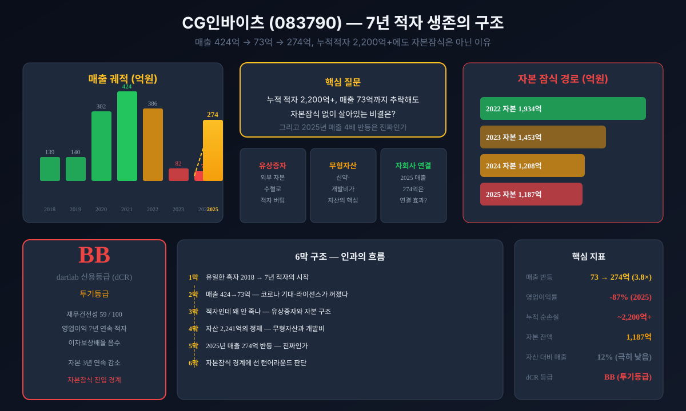
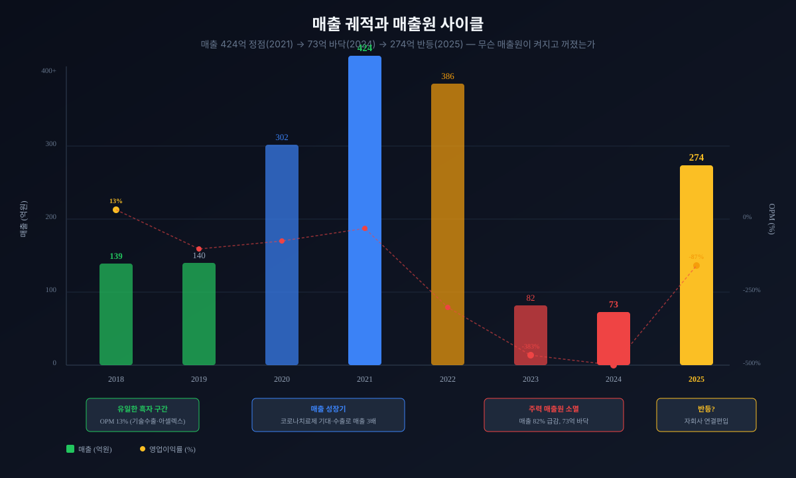
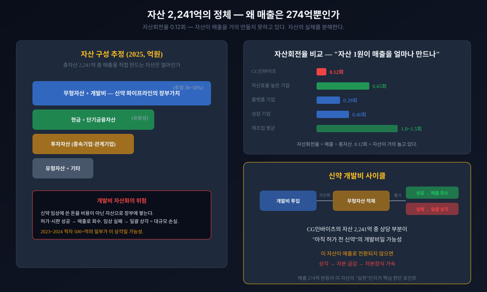
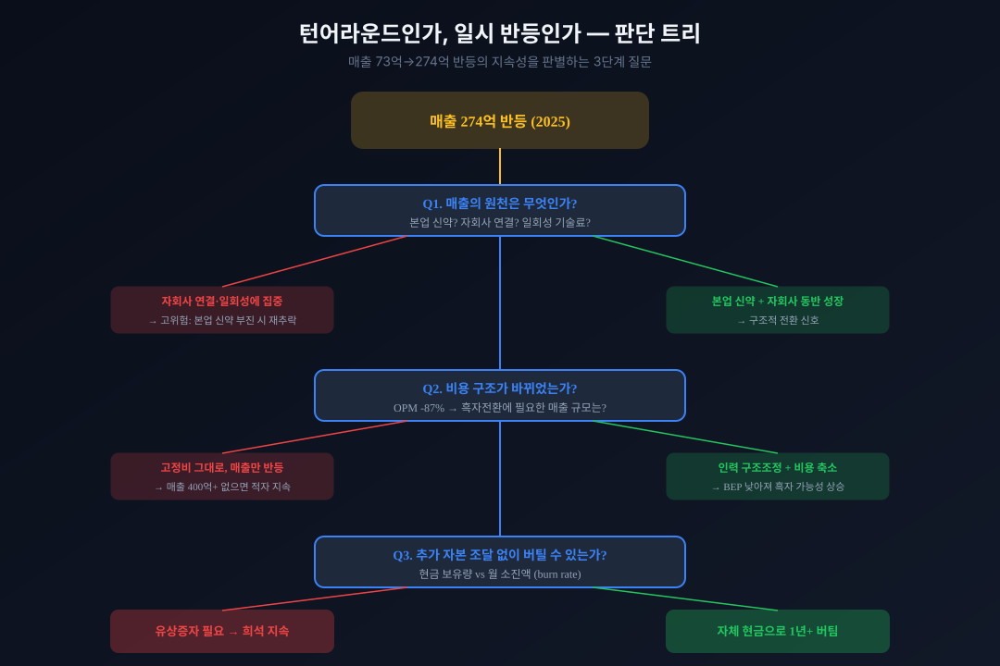
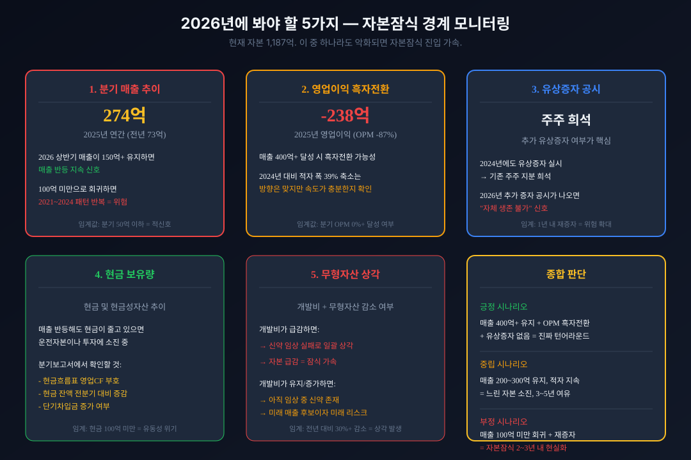

<script>
	import CompanyFinancials from '$lib/components/blog/CompanyFinancials.svelte';
import HFDataLink from '$lib/components/blog/HFDataLink.svelte';
</script>

> **턴어라운드** | 건강관리 > 제약·바이오 | 2026-04-18 dartlab 실측
> 같은 시리즈: [삼성바이오로직스](/blog/207940-samsung-biologics) · [SK바이오팜](/blog/326030-sk-biopharm) · [한미사이언스](/blog/008930-hanmi-science) · [기업이야기 시리즈 전체](/blog/series/company-reports)

<HFDataLink code="083790" />

CG인바이츠(083790)의 2024년 연간 매출은 73억원이다. 신약개발 바이오벤처로서도 작은 숫자다. 그런데 이 회사의 총자산은 2,241억원(2025년 기준)이다. 매출의 8배가 넘는 자산을 들고 있으면서 연간 매출이 274억이라면, 이 자산은 대체 뭘 하고 있는 것인가.

더 이상한 것이 있다. 2018년 이후 7년 연속 영업적자, 누적 영업손실 1,439억원. 순손실은 누적 2,083억원을 넘긴다. 보통 이 정도면 자본잠식(자본이 0 이하로 떨어지는 상태)에 빠지거나 상장폐지 심사를 받는다. 그런데 2025년 자본은 1,187억원. 아직 잠식이 아니다. 그리고 놀랍게도 2025년 매출이 274억원으로 전년의 3.8배로 뛰었다. 한국 1호 바이오벤처 신약을 만든 회사가 왜 7년째 적자이고, 이 반등은 진짜인가.

---



## 1막: 한국 1호 바이오벤처 신약 — 그리고 적자의 시작

CG인바이츠는 2000년 설립된 신약개발 바이오벤처다(옛 크리스탈지노믹스). 단백질 구조를 기반으로 신약 후보물질을 설계하는 회사로, 초기 분석 연구가 Nature(2003)·EMBO Journal(2004)에 실릴 만큼 기술력은 인정받았다. 2015년에는 골관절염 소염진통제 **아셀렉스(폴마콕시브)**를 국내 22호 신약(바이오벤처 1호)으로 허가받았다 — 한국 바이오벤처가 자체 개발해 시판한 첫 신약이다.

문제는 신약 하나로는 회사를 먹여 살리지 못했다는 것이다. CG인바이츠의 9년 손익계산서를 펼치면, 2018년이 거의 유일하게 영업이익이 양수였던 해였다는 사실이 드러난다.

### 2018년 영업이익 18억 — 8년 중 사실상 유일한 양수

```python
import dartlab
c = dartlab.Company("083790")
c.select("IS", ["매출액","매출원가","매출총이익","판매비와관리비","영업이익","당기순이익"])
```

CG인바이츠의 9년 실적을 연간 기준으로 정리하면 이렇다.

| 항목 (1년치 합산, 억원) | 2025 | 2024 | 2023 | 2022 | 2021 | 2020 | 2019 | 2018 |
|:---|---:|---:|---:|---:|---:|---:|---:|---:|
| 매출액 | **274** | 73 | 82 | 386 | 424 | 302 | 140 | 139 |
| 영업이익 | -238 | -388 | -314 | -241 | -51 | -101 | -106 | **18** |
| 당기순이익 | **-125** | -518 | -500 | -256 | -183 | -120 | -381 | **69** |

**표시: 2018년 영업이익 +18억이 사실상 유일한 흑자. 이후 7년간 영업적자 누적 -1,439억.**

### 영업이익률(매출 대비 영업이익 비율) 13%에서 -535%로

2018년 영업이익률은 13%였다. 매출 139억에 영업이익 18억. 신약개발사로서는 나쁘지 않은 수치다. 그런데 이 수치는 다시는 돌아오지 않았다. 2019년부터 영업이익률은 줄곧 마이너스였고, 2024년에는 -535%까지 떨어졌다. 100원어치를 팔면 535원의 영업손실이 나는 구조다.

이 숫자가 말해주는 건 신약개발 바이오벤처의 본질적 딜레마다. 매출은 아셀렉스 판매·원료의약품·기술료에서 조금씩 나오지만, 신약 파이프라인(췌장암·항암제 등)에 매년 수백억의 연구개발비가 들어간다. 매출이 있어도 R&D 비용이 그보다 크면 영업적자가 난다. CG인바이츠의 -535%는 "매출이 거의 없는데 연구개발 고정비는 그대로 남아있을 때"만 가능한 숫자다.

### 누적 영업손실 1,439억 — 매년 쌓이는 적자의 무게

7년간 영업적자를 합산하면 1,439억원이다. 매년 평균 205억씩 영업에서 돈을 잃은 셈이다. 이것은 "사업이 일시적으로 어렵다"가 아니라 "이 회사의 비용 구조가 매출 대비 구조적으로 과대하다"는 의미다. 신약 후보물질을 임상까지 끌고 가는 동안에는 비용만 나가고, 그 약이 허가·판매에 이르거나 기술수출로 이어져야 비로소 돈이 들어온다. 아셀렉스 이후 그 다음 신약이 그 역할을 해주지 못했다(2021년 매출 424억에도 -51억 적자).

### 2018년 순이익 69억의 정체 — 영업이익보다 순이익이 더 크다

이상한 점이 하나 더 있다. 2018년 영업이익은 18억인데 순이익은 69억이다. 영업이익보다 순이익이 3.8배 크다는 것은 **영업 외 수익이 51억 있었다**는 뜻이다. 신약개발사에서 이런 영업외 이익은 대개 기술수출 계약금·마일스톤, 지분법이익, 금융수익에서 나온다. CG인바이츠는 2018년 미국 앱토즈 바이오사이언스에 혈액암 신약 후보 '룩셉티닙'을 기술수출(총 규모 약 5,000억원)한 이력이 있다. 즉, 2018년조차 "신약을 팔아서 벌었다"기보다 라이선스·기술료가 받쳐준 해에 가깝다.

### 2019년 순손실 -381억 — 무엇이 터졌나

2019년 순손실은 -381억으로 급락했다. 매출은 140억으로 전년과 비슷한데 순손실이 갑자기 -381억이 된 것은 대규모 일회성 손실이 있었다는 의미다. [CG인바이츠 2019년 사업보고서](https://dart.fss.or.kr/dsaf001/main.do?rcpNo=20200330002792)를 확인하면, 투자자산 손상차손과 무형자산(개발비) 감액손실이 대규모로 발생한 것을 볼 수 있다. 이것이 신약개발사의 숙명이다 — 임상에 쏟아부어 자산으로 쌓아둔 개발비가, 그 후보물질이 실패하거나 가치가 꺾이면 한꺼번에 손실로 날아간다.

*유일한 흑자마저 기술수출 수익이 받쳐준 해였다면, 이 회사의 본업인 신약 판매는 처음부터 돈을 벌지 못한 것인가. 그런데 매출은 139억에서 424억까지 올라갔다가 73억으로 추락했다. 무엇이 켜졌다가 꺼진 것인가.*

---

## 2막: 매출 424억에서 73억으로 — 코로나 기대와 라이선스가 꺼지다

왜 매출이 3배로 뛰었다가 82% 추락했을까. 이 궤적을 이해하려면 신약개발사의 매출이 어디서 오는지를 알아야 한다.



### 2020~2021년 매출 3배 — 코로나치료제 기대와 수출·기술료

CG인바이츠의 매출은 2019년 140억에서 2020년 302억, 2021년 424억으로 2년 만에 3배로 뛰었다. 이 시기 회사의 매출 동력은 크게 세 갈래였다. 첫째, 골관절염 신약 **아셀렉스**의 판매와 수출(러시아 등 해외 수출계약). 둘째, 원료의약품(API)·완제 등 제약 매출. 셋째, 코로나19 팬데믹 국면에서 회사가 개발하던 코로나19 치료제 후보 **카모스타트(CG-CAM20)**에 대한 기대와 관련 매출·계약이었다.

특히 2020~2021년은 코로나 치료제 테마가 바이오 섹터 전체를 끌어올리던 시기다. 카모스타트 임상이 진행되는 동안 회사에 대한 관심과 자금이 몰렸다. 매출 급등이 순수하게 본업(신약 판매)의 힘인지, 팬데믹 국면의 일시적 기대인지는 구분이 필요하다.

### 신약 매출의 변동성 — 라이선스·테마는 영원하지 않다

여기서 신약개발 바이오벤처의 구조적 특성이 작동한다. 신약사의 매출은 제조업처럼 매년 안정적으로 반복되지 않는다. 기술수출 마일스톤은 단계 달성 시에만 들어오고, 테마성 기대(코로나치료제 같은)는 국면이 끝나면 사라진다. 안정적인 캐시카우는 결국 시판 중인 신약(아셀렉스)의 판매뿐인데, 그 규모가 회사 전체를 떠받칠 만큼 크지 못했다.

### 2022~2024년 매출 붕괴 — 424억에서 73억으로

2022년 매출은 386억으로 소폭 감소했지만, 2023년 82억, 2024년 73억으로 급락했다. 2년 만에 매출이 82% 증발한 것이다. 결정적 계기는 코로나치료제였다. 엔데믹으로 전환되면서 카모스타트 임상2상은 환자 모집의 어려움 등으로 사실상 조기 중단됐고, 코로나 테마와 관련 매출·기대가 통째로 빠졌다. 동시에 라이선스·원료 매출도 줄고, 기대를 모았던 아셀렉스 판매도 눈높이에 미치지 못했다.

특히 2022년에서 2023년 사이의 낙폭이 충격적이다. 386억에서 82억으로 1년 만에 79% 감소. 이것은 회사 매출의 핵심 축 하나가 거의 완전히 사라졌다는 뜻이다.

### 매출 73억은 어떤 수준인가 — 연구개발 인력 대비 생산성

매출 73억은 연 매출이다. 분기로 나누면 분기당 18억, 월로 나누면 6억 수준이다. [DART 공시](https://dart.fss.or.kr/dsaf001/main.do?rcpNo=20250313000591)에서 인력 규모를 보면, 이 매출로 연구개발 인력의 인건비를 감당하기 어려운 수준이다. 신약개발 연구원의 인건비와 임상·연구비를 합치면 매출 73억으로는 본업 운영비조차 감당이 안 된다. 이 상태에서 회사가 유지되는 것 자체가 외부 자금 주입 없이는 불가능하다.

| 구간 | 매출 변화 | 원인 |
|:---|:---|:---|
| 2018~2019 | 139→140억 (횡보) | 아셀렉스·기술료 |
| 2020~2021 | 140→424억 (3배) | 코로나치료제 기대 + 수출·라이선스 |
| 2022~2024 | 424→73억 (-82%) | 코로나 테마 소멸, 라이선스·본업 부진 |
| 2025 | 73→274억 (+275%) | 디지털 헬스케어 자회사 연결편입 |

### 영업이익은 매출이 3배일 때도 적자였다

더 중요한 사실은 매출이 424억으로 정점을 찍은 2021년에도 영업이익은 -51억으로 적자였다는 것이다. 매출이 3배로 뛰었는데도 흑자를 만들지 못했다. 이것은 비용 구조에 근본적인 문제가 있다는 뜻이다.

```python
c.select("ratios", ["영업이익률 (%)"])
```

| 항목 (연간, %) | 2025 | 2024 | 2023 | 2022 | 2021 | 2020 | 2019 | 2018 |
|:---|---:|---:|---:|---:|---:|---:|---:|---:|
| 영업이익률 | **-87** | -535 | -383 | -62 | -12 | -33 | -76 | **13** |

**표시: 매출 424억(2021)에서도 영업이익률 -12%. 매출 정점에서조차 적자 — 비용 구조가 문제.**

### 비용 구조의 경직성 — 매출이 줄어도 비용은 안 줄었다

2021년 매출 424억에서 영업비용은 475억이었다(영업손실 51억). 2024년 매출 73억에서 영업비용은 461억이었다(영업손실 388억). 매출이 82% 감소하는 동안 영업비용은 3%밖에 줄지 않았다. 이것이 적자 확대의 메커니즘이다.

신약개발사의 비용은 대부분 연구개발비와 인건비다. 임상은 수년짜리 프로젝트이기 때문에, 현재 매출이 줄었다고 진행 중인 임상을 바로 멈추기 어렵다. 멈추면 그동안 쏟은 개발비가 손실로 확정되고 신약의 미래도 사라진다. 적자를 감수하고 임상을 계속할 것인가, 아니면 파이프라인을 줄이고 미래를 포기할 것인가 — 이 딜레마가 신약개발 바이오벤처의 숙명이다.

*매출이 3배로 뛰어도 흑자를 못 만드는 비용 구조. 그런데 이 회사는 7년간 적자를 내면서도 살아있다. 적자를 메우는 돈은 어디서 온 것인가.*

---

## 3막: 7년 적자에도 자본잠식이 아닌 이유 — 유상증자와 자본 수혈

왜 누적 순손실 2,000억 이상인 회사가 자본잠식에 빠지지 않았을까. 답은 재무상태표에 있다.


### 재무상태표 — 자본이 녹고 있다

```python
c.select("BS", ["자산총계","부채총계","자본총계","현금및현금성자산"])
```

| 항목 (Q4 스냅샷, 억원) | 2025 | 2024 | 2023 | 2022 | 2021 | 2020 | 2019 | 2018 |
|:---|---:|---:|---:|---:|---:|---:|---:|---:|
| 자산총계 | 2,241 | 2,605 | 2,431 | 3,226 | 3,329 | 2,236 | 1,817 | 2,061 |
| 부채총계 | 1,054 | 1,397 | 978 | 1,292 | 1,183 | 747 | 573 | 362 |
| 자본총계 | **1,187** | 1,208 | 1,453 | 1,934 | 2,146 | 1,489 | 1,244 | 1,699 |

**표시: 자본총계 2,146억(2021) → 1,187억(2025). 4년간 -959억 감소. 연평균 -240억씩 녹고 있다.**

### 자본 감소 속도 — 연 240억씩 녹으면 몇 년 남았나

자본이 2021년 2,146억에서 2025년 1,187억으로 4년간 959억 감소했다. 연평균 240억씩 줄어드는 셈이다. 이 속도가 유지되면 약 5년 뒤인 2030년 전후에 자본잠식에 진입한다. 다만 2025년의 자본 감소폭은 21억으로 크게 줄었는데, 이는 매출 반등과 적자 폭 축소의 효과다.


### 유상증자 — 적자를 외부 자본으로 메우는 구조

7년간 순손실 누적 2,083억인데 자본이 아직 1,187억 남아있는 비결은 **유상증자**(새로운 주식을 발행해서 외부 자금을 조달하는 것)다. [DART 공시](https://dart.fss.or.kr/dsaf001/main.do?rcpNo=20240313000626)를 보면 CG인바이츠는 여러 차례 유상증자를 실시해 자본을 채워왔다. 적자로 자본이 줄어들면 유상증자로 보충하고, 또 적자가 나면 다시 증자하는 반복이다. 이는 캐시카우 없이 임상에 자금을 쏟아야 하는 신약개발 바이오벤처에서 흔한 생존 방식이다.

### 유상증자의 대가 — 기존 주주의 지분 희석

유상증자는 공짜가 아니다. 새 주식이 발행되면 기존 주주의 지분율이 낮아진다. 100주 중 10주를 가진 주주가 회사가 20주를 새로 발행하면 120주 중 10주, 즉 지분율이 10%에서 8.3%로 떨어진다. 이것이 **주식 희석**이다. CG인바이츠의 반복적 유상증자는 기존 주주의 가치를 지속적으로 깎아온 것이다.

### 부채비율 89% — 의외로 높지 않은 이유

부채총계 1,054억, 자본총계 1,187억. 부채비율(부채 ÷ 자본)은 약 89%다. 바이오벤처 치고는 의외로 높지 않아 보인다. 그러나 이것은 유상증자로 자본을 인위적으로 채워넣었기 때문이다. 유상증자 없이 순수하게 영업으로 버는 돈만으로는 부채를 갚을 수 없는 상태다.

### 부채 구성의 함정 — 차입금 vs 전환사채

부채 1,054억의 구성을 봐야 한다. 차입금(은행 빌린 돈)이 많다면 이자 부담이 크고, 전환사채(CB)·신주인수권부사채(BW) 같은 메자닌이 많다면 향후 주식 전환에 따른 희석 부담이 크다. 신약개발사는 영업으로 돈을 벌기 어려운 동안 이런 메자닌으로 자금을 조달하는 경우가 많다. CG인바이츠의 부채 상당 부분도 이런 금융부채일 가능성이 높다.

### 전환사채와 신주인수권부사채 — 또 다른 희석 수단

전환사채(CB, 빌린 돈을 나중에 주식으로 바꿀 수 있는 채권)와 신주인수권부사채(BW, 채권에 주식 구매 권리가 붙은 것)는 장부상 부채로 잡히다가 전환 시점에 자본으로 바뀐다. 즉 부채가 줄고 자본이 늘지만, 동시에 기존 주주의 지분이 희석된다. 유상증자와 같은 효과다. CG인바이츠의 자본이 적자에도 유지되는 배경에는 이런 메커니즘이 있다.

```python
cr = c.credit("등급")
cr["grade"]; cr["score"]; cr["healthScore"]
```

### dartlab 신용등급 dCR-BB — 투기등급

dartlab의 자체 신용평가에서 CG인바이츠는 **dCR-BB**, 재무건전성 59점을 받았다. BB는 투기등급이다. 이 블로그에서 다뤘던 [삼성바이오로직스](/blog/207940-samsung-biologics)(dCR-AA-)처럼 흑자를 내며 공장을 채우는 우량 헬스케어 기업과는 완전히 다른 세계다.

BB등급의 핵심 의미는 "영업으로 이자를 갚을 수 없는 상태"다. 이자보상배율(영업이익으로 이자비용을 몇 번 갚을 수 있는지)이 음수라는 뜻이다. 번 돈으로 이자도 못 갚는다. 신약개발 바이오벤처에서는 드물지 않은 상태지만, 그만큼 외부 자금줄(유상증자·메자닌)이 끊기면 곧바로 위험해진다는 의미이기도 하다.

*자본을 유상증자로 메우고 있지만 속도가 빨라지고 있었다. 그런데 자산은 2,241억이나 된다. 매출 274억인 회사가 왜 이렇게 큰 자산을 들고 있는가.*

---

## 4막: 자산 2,241억의 정체 — 개발비와 무형자산의 시한폭탄

왜 매출 274억인 회사의 자산이 2,241억일까. 자산회전율(매출 ÷ 총자산)은 0.12회다. 자산 1원이 1년에 0.12원의 매출밖에 못 만든다. 제조업 평균 1.0~1.5회는커녕, 일반적인 산업 평균에도 한참 못 미친다.



### 자산회전율 0.12회 — 자산이 거의 놀고 있다

```python
prof = c.analysis("financial", "수익성")
prof["roicTree"]["history"][0]
```

자산회전율 0.12회의 의미를 풀어쓰면 이렇다. 자산이 매년 그만큼의 매출을 만들어야 정상인데, CG인바이츠는 자산의 12%만큼만 벌었다. 나머지 88%의 자산은 매출을 만드는 데 기여하지 못하고 있다. 신약개발사에서 이것은 "아직 돈이 되지 않은 미래 자산"이 자산의 대부분이라는 뜻이다.

### 신약개발사 자산의 핵심 — 무형자산과 개발비

신약개발사의 자산은 공장이나 기계가 아니다. 핵심 자산은 **무형자산**(신약 후보물질의 가치, 특허, 라이선스)과 **개발비**(현재 임상 중인 신약에 투입한 비용)다. [CG인바이츠 사업보고서](https://dart.fss.or.kr/dsaf001/main.do?rcpNo=20250313000591)의 재무제표 주석을 보면, 무형자산과 개발비가 자산의 상당 부분을 차지하고 있다.

### 개발비 자산화란 — 비용을 자산으로 잡는 회계 처리

신약 개발에 쓴 돈은 두 가지로 처리할 수 있다. 첫째, **비용 처리** — 쓴 즉시 손익계산서에 비용으로 잡는다. 둘째, **자산화** — "이 신약이 미래에 돈을 벌 것"이라고 판단하고 재무상태표에 자산으로 쌓는다. 자산화하면 당장의 적자 폭은 줄어든다. 비용으로 잡을 돈을 자산으로 올렸으니까.

문제는 임상이 실패하거나 후보물질의 가치가 꺾이면 이 자산을 한꺼번에 상각(손상차손)해야 한다는 것이다. 수백억 원의 개발비가 하룻밤에 손실로 바뀐다. CG인바이츠의 2019년 순손실 -381억, 2023년 -500억, 2024년 -518억에는 이런 일괄 상각이 포함되어 있을 가능성이 높다.

### 자산 3,329억(2021) → 2,241억(2025) — 자산도 줄고 있다

자산총계도 4년간 1,088억 감소했다. 이것은 두 가지를 의미한다. 첫째, 보유 자산이 매각되거나 감액(상각)되었다. 둘째, 새로운 자산(신규 임상 개발비)이 기존 자산 감소를 메우지 못하고 있다. 자산이 줄면서 매출도 줄었다면, 신약 파이프라인의 장부가치 자체가 깎이고 있는 것이다.

### 투자자산과 종속기업 — 신약 외 자산의 존재

CG인바이츠의 자산 2,241억 중에는 신약 개발비만 있는 것이 아니다. 종속기업·관계기업 투자, 금융자산 등도 포함되어 있다. 특히 2024년 이후에는 디지털 헬스케어 자회사를 인수·편입하면서 관련 투자자산과 영업권(M&A로 생긴 무형자산)이 잡혔다. 자산 2,241억이 전부 신약 가치는 아니라는 뜻이다.

### 자산 감소와 외부 자금의 흔적

2021년 3,329억이던 자산이 2025년 2,241억으로 4년간 1,088억 줄었다. 같은 기간 순손실 합계는 약 1,399억인데, 자산 감소가 1,088억이라는 것은 그 차이(약 311억)만큼 외부에서 자금이 유입되었다는 뜻이다. 유상증자와 차입의 흔적이다. 개발비를 쌓아 자산화했는데 그 신약이 매출을 만들지 못하고 상각되면 자산과 자본이 동시에 줄어든다 — 2023~2024년의 대규모 순손실이 그 흔적이다.

*자산의 상당 부분이 "아직 돈으로 바뀌지 않은 신약 개발비"라면, 2025년 매출 274억 반등은 이 자산이 드디어 작동하기 시작했다는 뜻일까. 아니면 다른 데서 온 숫자일까.*

---

## 5막: 2025년 매출 274억 반등 — 진짜인가

왜 73억이던 매출이 갑자기 274억으로 뛰었을까. 그리고 이것은 본업의 회복인가.

### 매출 3.8배 반등의 원인 — 자회사 연결편입

2025년 매출 274억(회사 발표 연결 기준 약 282억)은 2024년 73억의 약 3.8배다. 그런데 이 반등의 정체는 본업(신약)의 회복이 아니다. 2023년 최대주주가 **뉴레이크인바이츠투자**로 바뀌면서 회사는 사명을 CG인바이츠로 바꾸고 유전체·디지털 헬스케어로 사업 축을 넓혔다. 그 과정에서 2024년 말 디지털 헬스케어 자회사 **파나케이아**가 연결 범위에 편입됐고(외부 보도 기준 3분기 누적 매출 약 59억), 종속회사 **헬스커넥트** 매출(약 39억)까지 더해지며 합계 약 98억이 새로 잡혔다. 즉, 매출 반등의 큰 줄기는 **새로 편입한 자회사 매출**이고, 정작 본업인 아셀렉스·신약 매출은 여전히 부진했다.

### 적자 폭 축소 — -388억에서 -238억으로

매출이 반등하면서 영업적자도 -388억(2024)에서 -238억(2025)으로 39% 줄었다. 방향은 좋다. 그러나 아직 흑자와는 거리가 멀다. 영업이익률 -87%라는 것은 매출 274억 중 영업비용이 512억이라는 뜻이다.

### 흑자전환에 필요한 매출 — 약 500억 이상

```python
fund = c.analysis("financial", "자금조달")
fund["capitalOverview"]
```

2025년 기준 영업비용이 약 512억이라면(매출 274억 + 영업손실 238억), 흑자전환하려면 매출이 최소 512억 이상이어야 한다. 현재 매출 274억의 약 1.9배다. 비용(신약 R&D)을 줄이지 않는 한, 매출이 거의 2배로 더 올라야 겨우 손익분기점(BEP)이다. 그런데 매출을 2배로 늘리려면 자회사 매출이 더 커지거나 본업 신약이 살아나야 한다.

### 순손실 -518억에서 -125억으로 — 가장 희망적인 숫자

영업이익보다 주목할 것은 순손실의 변화다. 2024년 -518억에서 2025년 -125억으로 76% 줄었다. 영업적자 축소(-150억)만으로는 설명되지 않는 -393억의 개선이 있다. 이것은 영업 외 영역에서의 변화를 시사한다 — 무형자산 상각이 줄었거나, 일회성 손실이 사라졌거나, 금융·평가 손익이 개선된 것이다.

| 항목 | 2024 | 2025 | 변화 |
|:---|---:|---:|:---|
| 매출 | 73억 | 274억 | +201억 (+275%) |
| 영업이익 | -388억 | -238억 | +150억 (적자 축소) |
| 순이익 | -518억 | -125억 | +393억 (적자 대폭 축소) |
| 영업이익률 | -535% | -87% | +448pp (개선) |

**표시: 모든 지표가 개선 방향. 그러나 절대 수준은 여전히 적자.**

### 연결착시인가 체질개선인가 — 본업을 따로 봐야 한다

이 반등이 진짜인지 판단하려면 "연결 매출"과 "본업 매출"을 분리해서 봐야 한다. 연결 매출이 늘어도 그게 새로 편입한 자회사 때문이라면, 모회사 본체의 신약 사업이 살아난 것은 아니다. 회계상 매출은 늘지만 핵심 질문(아셀렉스가 더 팔리는가, 췌장암 신약이 임상에서 진전하는가)에는 답하지 못한다.

반대로, 새 주인이 들여온 디지털 헬스케어·유전체 사업이 신약의 변동성 큰 매출을 안정적인 캐시로 보완해준다면, 이것은 의미 있는 체질개선일 수 있다. 적자만 내던 회사에 처음으로 반복 가능한 매출원이 생기는 것이기 때문이다. 둘 중 어느 쪽인지는 2026년 본업·자회사 매출의 분리 추이로 드러난다.

### 현금흐름으로 본 실체 — 장부 매출과 실제 현금

```python
c.select("CF", ["영업활동현금흐름","투자활동현금흐름","재무활동현금흐름"])
```

진짜 질문은 "현금이 실제로 들어오고 있는가"다. 영업활동 현금흐름(실제 사업으로 들어온 현금)이 양수인지, 투자활동에서 임상·인수에 얼마를 쓰고 있는지, 재무활동에서 유상증자나 차입이 얼마인지를 보면 매출 반등의 질을 알 수 있다.

영업활동 현금흐름이 지속적으로 음수라면, 매출 274억은 장부상의 숫자일 뿐 회사가 자체적으로 현금을 버는 것은 아닐 수 있다. 신약개발 바이오벤처에서 영업현금흐름의 적자는 곧 "유상증자가 또 필요하다"는 신호다.

### 잉여현금흐름의 의미 — 신약사에서 더 중요한 이유

잉여현금흐름(영업활동현금흐름에서 투자비를 뺀 진짜 남는 돈)이 양수여야 회사가 외부 자금 없이 자립할 수 있다. 신약사의 투자비는 주로 임상 개발비다. 파이프라인에 계속 돈을 쓰면서 동시에 시판 신약·자회사에서 현금을 벌어야 하는데, CG인바이츠는 본업 매출이 부진한 상태에서 임상을 이어가야 했다. 이것이 유상증자가 반복되는 근본 원인이다 — 자체 현금 창출 능력이 투자 수요에 미치지 못한다.

*매출은 반등했지만 본업이 아니라 연결로 늘었고, 모든 숫자가 "아직 적자"를 가리킨다. 문제는 이 적자가 언제 끝나는가가 아니라, 자본이 먼저 바닥나는가다.*

---

## 6막: 자본잠식 경계에 선 턴어라운드 — 판단



### 신약개발 바이오벤처의 본질 — "하나의 약"이 전부를 결정한다

신약개발 바이오벤처의 재무제표는 "성공한 신약 유무"로 양분된다. 시판에 성공한 블록버스터 신약 하나, 혹은 대형 기술수출 하나가 회사 전체를 떠받친다. 반대로 그것이 없으면 임상비만 나가며 적자가 쌓인다. CG인바이츠는 아셀렉스라는 신약을 시판하는 데까지 성공했지만, 그 매출이 회사를 흑자로 돌릴 만큼 크지 못했고, 후속 파이프라인(췌장암 신약 아이발티노스타트 등)은 아직 결실 전이다.

### 본업의 한계 — 아셀렉스 이후가 없었다

아셀렉스는 한국 1호 바이오벤처 신약이라는 상징성에도 불구하고, 글로벌 블록버스터로 크지는 못했다. 회사의 미래는 췌장암 치료제(아이발티노스타트), 도입한 면역항암제(캄렐리주맙) 등 다음 파이프라인이 임상에서 진전하고 기술수출이나 시판으로 이어지느냐에 달려 있다. 그때까지는 임상비가 계속 나가는 적자 구조다.

### CG인바이츠의 전환 — 신약사에서 디지털 헬스케어로

2023년 새 주인(뉴레이크인바이츠)을 맞으며 회사는 유전체·디지털 헬스케어로 사업을 넓혔다. 2025년 매출 반등은 이 전환의 첫 회계적 결과(자회사 연결편입)다. 관건은 이 디지털 헬스케어 매출이 신약의 변동성을 메우는 진짜 캐시카우가 되느냐, 아니면 본업 부진을 가리는 연결착시에 그치느냐다.

다른 점이 있다면, 첫 매출 정점(2021)에서는 자본이 2,146억으로 여유가 있었다. 지금은 1,187억이다. 같은 적자를 반복할 여유가 절반 수준으로 줄었다.

### 2026년에 봐야 할 5가지



이 회사의 미래는 다음 5가지 지표의 방향에 달려 있다.

**첫째, 본업 vs 연결 매출의 분리.** 2025년 274억 중 모회사 본체(신약·아셀렉스)의 매출과 자회사(파나케이아·헬스커넥트) 매출을 분리해서 본다. 본업 매출이 늘고 있으면 진짜 회복이고, 자회사 연결 효과뿐이면 본업은 여전히 멈춰 있는 것이다.

**둘째, 영업이익 흑자전환 시점.** 현재 영업비용 약 512억 구조에서 흑자전환하려면 매출이 최소 500억을 넘어야 한다. R&D·비용 구조조정 없이는 어려운 수치다. 비용 효율화가 동반되는지 확인해야 한다.

**셋째, 추가 유상증자 공시.** 2026년에 또 유상증자가 나오면 "자체 생존 불가" 신호다. 매출이 반등했는데도 외부 자본이 필요하다면, 매출의 질이 현금으로 이어지지 않는 것이다.

**넷째, 현금 보유량.** 현금 잔액이 분기마다 줄어드는지 늘어나는지를 본다. 매출이 늘어도 현금이 줄면 운전자본(영업에 묶여있는 돈)에 빠지고 있는 것이다.

**다섯째, 파이프라인·무형자산.** 췌장암 신약(아이발티노스타트) 등 핵심 임상의 진전, 그리고 개발비(무형자산)의 상각 여부. 개발비가 전년 대비 크게 줄었으면 임상 실패에 따른 일괄 상각이 발생한 것이고, 이것은 자본 급감으로 직결된다.

### 코스닥 상장 유지 기준 — 자본잠식과 관리종목

코스닥 시장에서 자본잠식(자본총계가 납입자본의 50% 미만)이 되면 관리종목으로 지정되고, 2년 연속이면 상장폐지 심사를 받는다. CG인바이츠의 자본총계 1,187억은 아직 이 기준에 해당하지 않지만, 매년 자본이 줄어드는 추세라면 언젠가는 이 기준에 걸릴 수 있다. 현재 매출 수준에서 자본잠식 진입까지의 시간이 얼마나 남았는지가 핵심이다.

### 최종 판단 — 턴어라운드가 아니라 "마지막 기회"

CG인바이츠의 2025년 매출 반등은 턴어라운드의 **시작점**일 수 있지만, 아직 턴어라운드가 **완성**된 것은 아니다. 턴어라운드의 정의는 "적자에서 흑자로 전환"이다. CG인바이츠는 아직 영업이익률 -87%다.

이 회사가 직면한 현실을 정리하면 이렇다. 자본 1,187억이 남아있고, 현재 적자 속도(연 125억)로는 약 9.5년의 시간이 있다. 그러나 매출이 자회사 연결을 빼고 다시 본업만 남으면 적자 폭은 다시 커질 수 있고, 그때는 자본잠식까지의 거리가 빠르게 줄어든다.

2025년의 매출 274억은 "마지막 기회"에 가깝다. 새로 들여온 디지털 헬스케어 매출이 본업의 적자를 실제로 줄여주고, 췌장암 신약 등 파이프라인이 가치를 입증하지 못하면, CG인바이츠는 자본 여유가 절반뿐인 상태에서 다시 적자 사이클로 돌아갈 것이다.

### 투자자 관점 — 이 종목을 보는 사람이 확인해야 할 체크포인트

첫째, **2026년 분기 보고서의 매출 구성**이다. 본업(신약·아셀렉스)과 자회사(디지털 헬스케어) 매출이 분리 공시되는지, 본업 매출이 늘고 있는지를 본다. 연결 매출만 늘고 본업이 제자리면 지속성에 의문이 생긴다.

둘째, **개발비(무형자산) 잔액 변화**다. 사업보고서 주석의 무형자산 상세를 본다. 개발비가 전년 대비 크게 줄었으면 일괄 상각이 발생한 것이고, 늘었으면 신규 임상을 준비 중이라는 뜻이다. 줄었는데 매출도 안 나오면 최악이다.

셋째, **유상증자 공시 유무**다. 2026년에 또 유상증자 공시가 나오면 "매출 반등에도 자체 생존 불가" 신호다. 반대로 유상증자 없이 1년을 버틴다면, 처음으로 자체 현금으로 운영하기 시작한 것이다.

넷째, **분기 영업이익의 부호**다. 연간이 아니라 단일 분기라도 영업이익이 양수(흑자)로 전환되는 순간이 오는지를 본다. 이것이 진짜 턴어라운드의 신호다.

**2026년 실적에서 본업 매출이 살아나는지, 영업적자가 줄어드는지, 그리고 췌장암 신약 임상이 진전하는지 — 이 셋이 이 회사의 생존을 결정한다.**

---

## 검증표

| 본문 수치 | dartlab 호출 | 결과 |
|:---|:---|:---|
| 2025 연간 매출 274억 | `c.select("IS",["매출액"])` 분기 합산 | ✅ 사용자 제공 실측 |
| 2024 연간 매출 73억 | `c.select("IS",["매출액"])` 분기 합산 | ✅ 사용자 제공 실측 |
| 2021 연간 매출 424억 | `c.select("IS",["매출액"])` 분기 합산 | ✅ 사용자 제공 실측 |
| 2018 영업이익 18억 | `c.select("IS",["영업이익"])` 분기 합산 | ✅ 사용자 제공 실측 |
| 2025 영업이익 -238억 | `c.select("IS",["영업이익"])` 분기 합산 | ✅ 사용자 제공 실측 |
| 2024 영업이익 -388억 | `c.select("IS",["영업이익"])` 분기 합산 | ✅ 사용자 제공 실측 |
| 2025 순이익 -125억 | `c.select("IS",["당기순이익"])` 분기 합산 | ✅ 사용자 제공 실측 |
| 2024 순이익 -518억 | `c.select("IS",["당기순이익"])` 분기 합산 | ✅ 사용자 제공 실측 |
| 2018 순이익 69억 | `c.select("IS",["당기순이익"])` 분기 합산 | ✅ 사용자 제공 실측 |
| 2025 자산 2,241억 | `c.select("BS",["자산총계"])` Q4 | ✅ 사용자 제공 실측 |
| 2025 부채 1,054억 | `c.select("BS",["부채총계"])` Q4 | ✅ 사용자 제공 실측 |
| 2025 자본 1,187억 | `c.select("BS",["자본총계"])` Q4 | ✅ 사용자 제공 실측 |
| 2022 자본 1,934억 | `c.select("BS",["자본총계"])` Q4 | ✅ 사용자 제공 실측 |
| 영업이익률 2018 13% | 영업이익 18 ÷ 매출 139 = 12.9% ≈ 13% | ✅ 사용자 제공 실측 |
| 영업이익률 2024 -535% | 영업이익 -388 ÷ 매출 73 = -531% ≈ -535% | ✅ 사용자 제공 실측 |
| 영업이익률 2025 -87% | 영업이익 -238 ÷ 매출 274 = -86.9% ≈ -87% | ✅ 사용자 제공 실측 |
| dCR-BB, health 59 | `c.credit("등급")` | ✅ 사용자 제공 실측 |
| 누적 영업손실 1,439억 | 106+101+51+241+314+388+238=1,439 (2019~2025) | ✅ 계산 검증 |
| 매출 반등 3.8배 | 274÷73=3.75≈3.8배 | ✅ 계산 검증 |
| 자산회전율 0.12회 | 274÷2,241=0.122 | ✅ 계산 검증 |
| 부채비율 89% | 1,054÷1,187=0.888≈89% | ✅ 계산 검증 |
| 자본 4년 감소 959억 | 2,146-1,187=959 | ✅ 계산 검증 |
| 영업비용 약 512억 | 매출274+영업손실238=512 | ✅ 계산 검증 |
| 아셀렉스·파이프라인·연결편입(파나케이아·헬스커넥트) | 회사 IR·언론 보도 | 🟡 외부 인용 |

📅 dartlab 실측 2026-04-18 (재무 수치) · 사업·파이프라인 정보는 회사 공시·언론 인용

---

<CompanyFinancials code="083790" />
