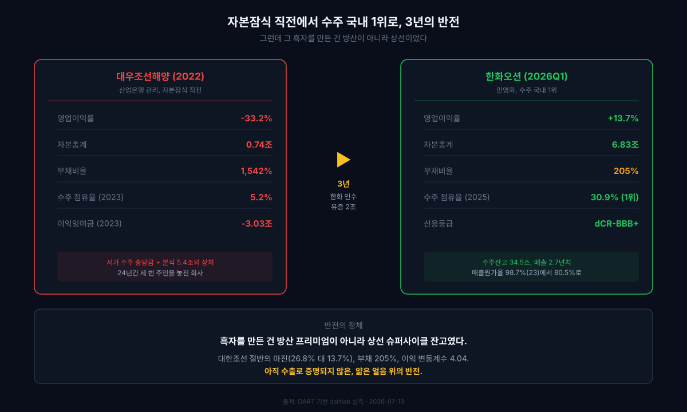
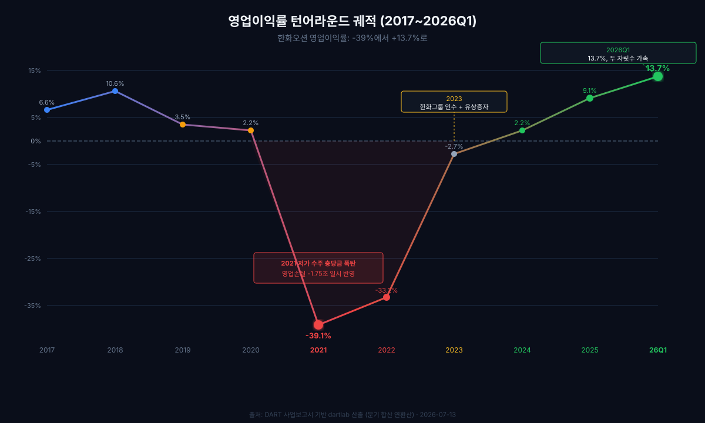
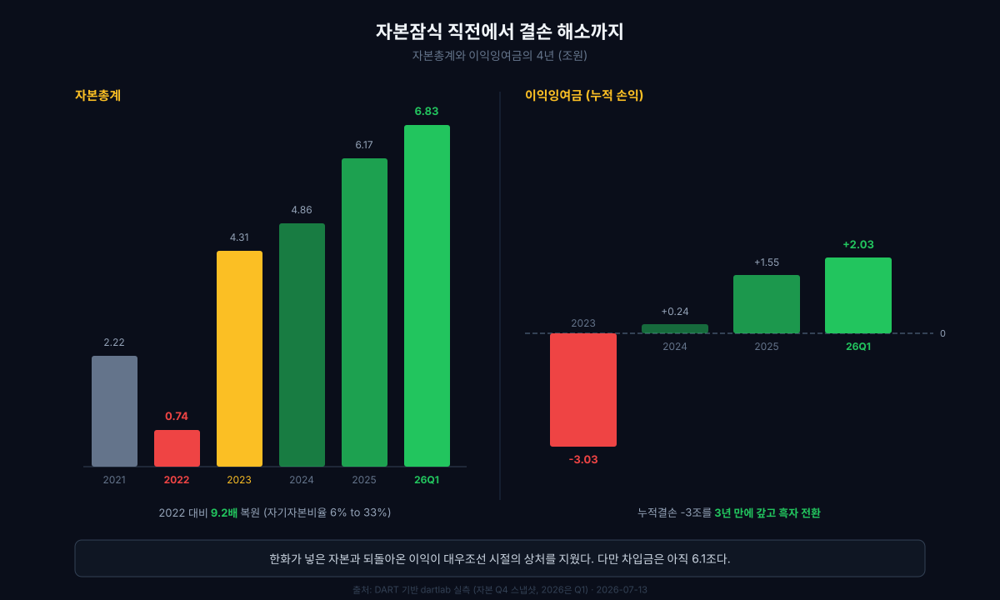
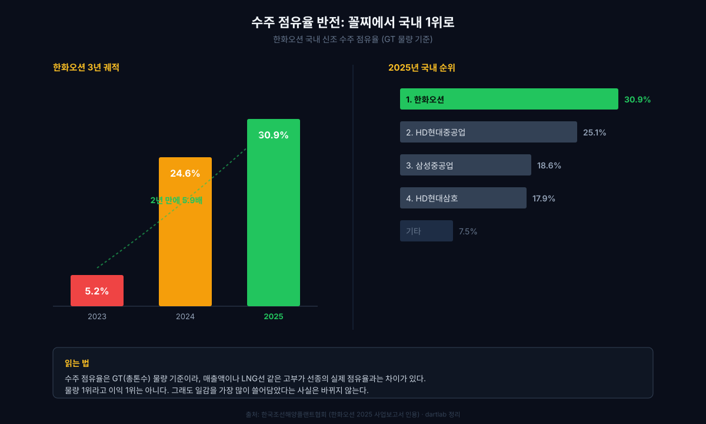
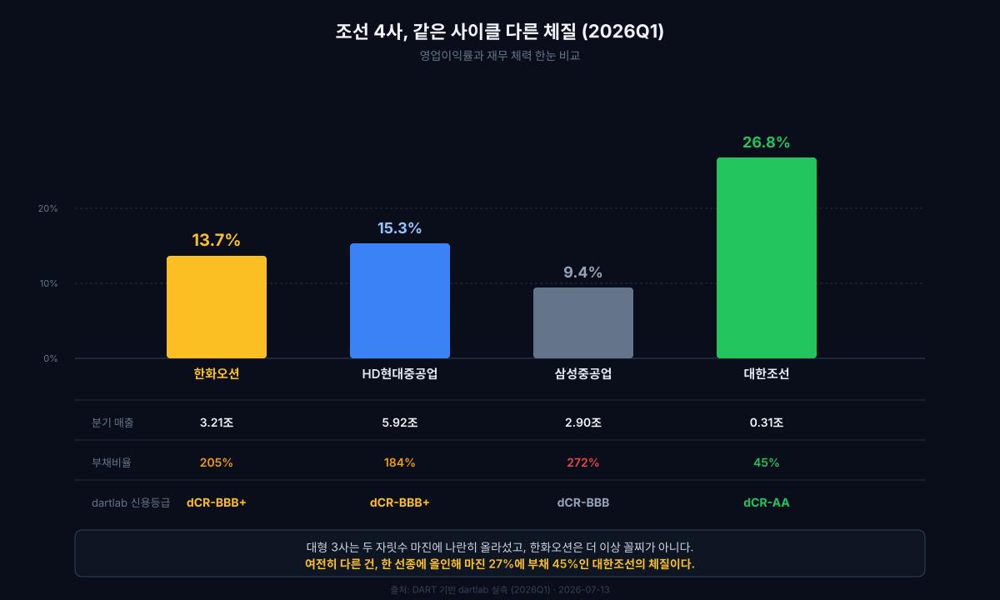
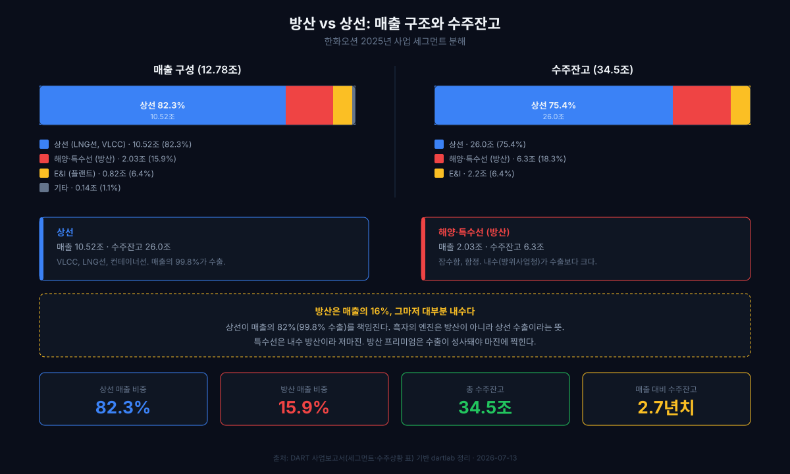
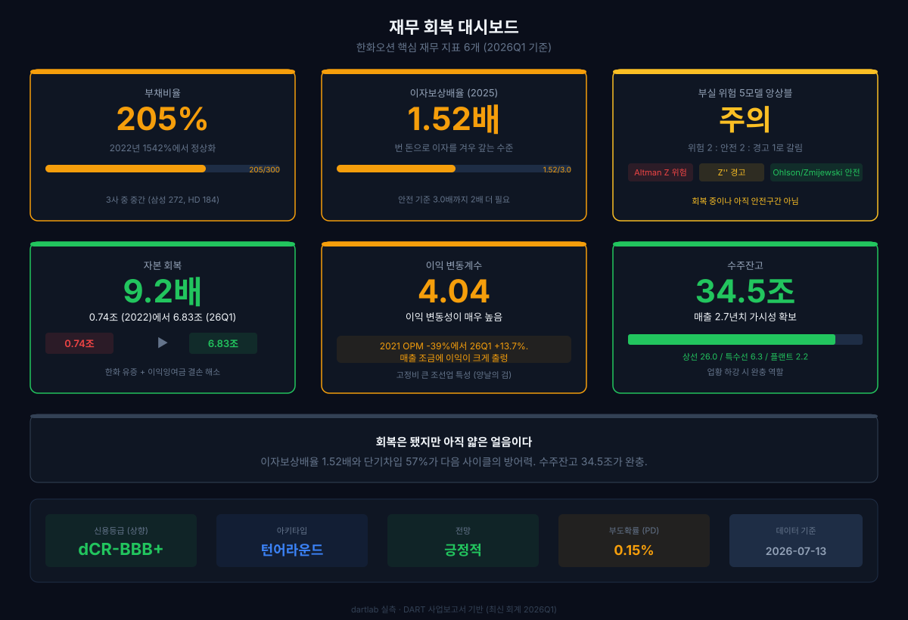
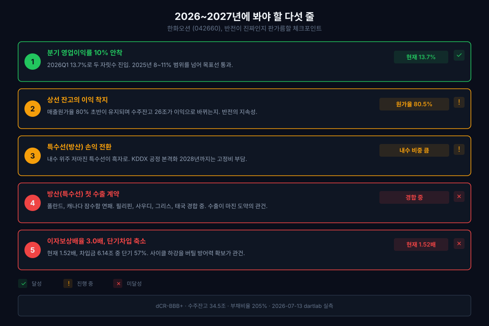

<script>
	import CompanyFinancials from '$lib/components/blog/CompanyFinancials.svelte';
import HFDataLink from '$lib/components/blog/HFDataLink.svelte';
</script>

> **턴어라운드** | 조선·해운 > 건조 | 2026-07-13 dartlab 실측
> 같은 시리즈: [대한조선](/blog/439260-daehan-shipbuilding) · [HD현대중공업](/blog/329180-hd-hyundai-heavy) · [HD한국조선해양](/blog/009540-hd-ksoe) · [한화에어로스페이스](/blog/012450-hanwha-aerospace) · [한화엔진](/blog/082740-hanwha-engine) · [기업이야기 시리즈 전체](/blog/series/company-reports)

<HFDataLink code="042660" />

2026년 7월 첫째 주, 한화오션(042660)은 같은 주에 두 번 지고 한 번 이겼다. 7월 6일 캐나다가 최대 60조원짜리 잠수함 사업(CPSP)의 우선협상대상자로 독일 TKMS를 발표했다. 한화오션이 HD현대중공업과 팀을 이뤄 최종 1대 1까지 갔던 사업이다. 그 며칠 전엔 폴란드 오르카 잠수함마저 스웨덴 사브에 내줬다는 소식이 굳어졌다. 발표 당일 주가는 장 초반 20%까지 빠졌다.

그런데 바로 그 주에, 방위사업청은 7.8조원짜리 차기 구축함(KDDX) 상세설계와 선도함 건조의 우선협상대상자로 한화오션을 골랐다. 경쟁자 HD현대중공업을 0.5867점 차이로 제쳤다([파이낸셜뉴스](https://www.fnnews.com/news/202607020818196117), 2026-07-02). 잠수함 수출에서는 연거푸 미끄러졌는데, 국내 구축함 대관식은 거머쥔 것이다.

이기는 동시에 지고 있는 이 모순이 지금 한화오션이다. dartlab으로 재무제표를 열면 모순은 더 선명해진다. 2026년 1분기 영업이익률 13.7%. 자본잠식 문턱까지 갔던 회사가 두 자릿수 이익률로 올라섰다. 수주 점유율은 국내 1위다. 하지만 같은 데이터가 부채비율 205%, 이자보상배율 1.52배, 이익 변동계수 4.04를 함께 보여준다. 반전은 진짜인데, 그 반전이 서 있는 얼음은 아직 얇다.

이 글은 **"자본잠식 직전의 대우조선을 삼킨 한화오션이 3년 만에 어떻게 수주 1위로 돌아왔고, 그 흑자를 만든 것이 왜 방산이 아니라 상선이었는가"**를 9개의 장면으로 추적한다. 결론을 먼저 말하면, 한화오션은 '반전한 회사'가 아니라 '반전 중인 회사'다.



---



## 1막: 영업이익률 -39%에서 +13.7%로, 두 자릿수에 올라선 순간

왜 한화오션의 영업이익률은 2021년 -39%까지 떨어졌다가 4년 만에 두 자릿수로 돌아왔는가. 그리고 왜 지금이 중요한가.

### 매출 4.49조(2021 바닥)에서 12.78조(2025)로

```python
import dartlab
c = dartlab.Company("042660")
c.select("IS", ["매출액","영업이익","당기순이익"])
```

| 항목 (1년치 합산, 조원) | 2025 | 2024 | 2023 | 2022 | 2021 | 2020 | 2019 | 2018 | 2017 |
|:---|---:|---:|---:|---:|---:|---:|---:|---:|---:|
| 매출액 | **12.78** | 10.78 | 7.41 | 4.86 | **4.49** | 7.03 | 8.36 | 9.64 | 11.10 |
| 영업이익 | **1.17** | 0.24 | -0.20 | **-1.61** | **-1.75** | 0.15 | 0.29 | 1.02 | 0.73 |
| 당기순이익 | **1.25** | 0.53 | 0.16 | -1.74 | -1.70 | 0.09 | -0.05 | 0.32 | 0.65 |

표시: 2021~2022 영업손실 합계 -3.36조. 2025 영업이익 1.17조. 4년 만에 4.53조 스윙.

2021~2022년의 영업이익률 -39%, -33%는 "저가 수주 충당금"의 결과다. 코로나 시기 선가가 바닥일 때 수주한 배를, 원자재와 인건비가 급등한 시점에 지어야 했다. 만들수록 손해가 나는 구조였다. [에스퓨얼셀](/blog/288620-sfuelcell)의 매출원가율 127%와 같은 메커니즘이지만, 조선소의 스케일에서 벌어진 것이다.

### 분기 궤적: 회복이 아니라 가속

2025년 연간 영업이익률 9.1%는 이 글의 지난 판(2026년 4월)이 붙잡은 숫자였다. 그런데 그 뒤에 나온 2026년 1분기가 이야기를 바꿨다.

```python
c.select("ratios", ["영업이익률 (%)"])
```

| 분기 | 2024Q1 | Q2 | Q3 | Q4 | 2025Q1 | Q2 | Q3 | Q4 | **2026Q1** |
|:---|---:|---:|---:|---:|---:|---:|---:|---:|---:|
| 영업이익률(%) | 2.3 | -0.4 | 1.0 | 5.2 | 8.2 | 11.3 | 9.6 | 7.5 | **13.7** |

2024년까지 분기마다 흑자와 적자를 오갔다. 2025년에 8~11% 범위로 안착했고, 2026년 1분기에는 13.7%까지 올라섰다. 분기 영업이익 4,411억원은 전년 동기(2,586억원)보다 71% 많다. 최근 4개 분기를 합친 연환산(TTM) 영업이익률도 약 10.5%로 두 자릿수 문턱을 넘었다. 이 글의 지난 판이 "체크포인트 1번: 분기 영업이익률 10% 안착"이라고 적어 둔 목표선이, 실제로 넘어선 것이다.

### 매출원가율이 답이다: 98.7%에서 80.5%로

조선업에서 오늘의 마진은 오늘 결정되지 않는다. 2~3년 전에 계약한 선가가 오늘의 매출이 되고, 오늘의 원자재값이 원가가 된다. 그래서 마진의 진짜 스위치는 매출원가율이다.

```python
c.select("ratios", ["매출원가율 (%)"])
```

| 항목 (%) | 2026Q1 | 2025 | 2024 | 2023 |
|:---|---:|---:|---:|---:|
| 매출원가율 | **80.5** | 85.6 | 93.6 | **98.7** |
| 매출총이익률 | **19.5** | 14.4 | 6.4 | 1.3 |

2023년 매출원가율 98.7%는 팔아도 남는 게 1.3%뿐이라는 뜻이었다. 그 원가율이 2026년 1분기 80.5%까지 내려왔다. 대우조선 시절 저가로 받아 둔 배가 장부에서 빠지고, 한화오션 체제에서 높은 선가로 받은 배가 매출로 찍히기 시작한 것이다. 이 원가율 하나가 "왜 갑자기 이익이 나느냐"의 대부분을 설명한다.

*그런데 -39%에서 +13.7%로 가는 4년 동안, 이 회사는 사업을 바꾼 게 아니라 주인을 바꿨다. 그 이야기부터 봐야 한다.*

---

## 2막: 세 번 주인을 놓친 회사, 24년의 표류

왜 이 회사는 '한화오션'이 됐는가. 흑자의 진짜 배경을 이해하려면, 이 조선소가 반세기 동안 몇 번이나 주인을 놓쳤는지부터 봐야 한다.

### 1973 옥포에서 2023 한화까지

거제도 옥포조선소는 1973년, 수출용 대형 유조선을 짓기 위해 100만 톤급 규모로 착공됐다. 오일쇼크 조선 불황으로 대우가 이를 인수해 1978년 대우조선공업을 세웠고, 1981년 대통령이 참석한 가운데 종합준공식을 열었다(나무위키). 한국 조선 신화의 한 축이었다.

그러나 1997년 외환위기가 모든 걸 바꿨다. 1999년 대우그룹은 워크아웃에 들어가며 해체됐고(이코노믹리뷰), 2000년 대우중공업이 쪼개지면서 조선 부문이 분리돼 국책은행인 **산업은행(KDB)이 대주주**가 됐다. 사명은 2002년 대우조선해양으로 바뀌었다. 이때부터 이 회사는 '주인 없는 회사'로 24년을 표류한다.

| 연도 | 사건 | 결과 |
|:---|:---|:---|
| 1973~1978 | 옥포조선소 착공, 대우조선공업 설립 | 대우그룹 편입 |
| 1999~2000 | 대우그룹 해체, 대우중공업 분할 | 산업은행 관리 편입 |
| 2008~2009 | **한화 1차 인수 시도** | 금융위기로 무산, 보증금 3,150억 몰취 |
| 2019~2022 | 현대중공업(한국조선해양) 합병 | 2022.1 **EU 불허**로 무산 |
| 2022.12 | 한화 2조원 유상증자 본계약 | 지분 49.3% 확보 |
| 2023.5 | **한화오션 출범** | 산업은행 관리 24년 만에 민영화 |

2008년 한화는 이 회사를 6조3천억원에 사기로 하고 이행보증금 3,150억원까지 냈지만, 글로벌 금융위기로 자금줄이 막혀 2009년 1월 결렬됐다. 산업은행은 보증금을 몰취했고, 한화는 소송 끝에 2018년에야 법원으로부터 1,260억원 반환 판결을 받아냈다(로이슈, 더벨). 2019년엔 현대중공업이 중간지주사 한국조선해양을 세워 인수에 나섰지만, 2022년 1월 EU 집행위가 "합병 시 LNG운반선 시장 점유율이 60%에 달한다"며 불허해 무산됐다([경향신문](https://www.khan.co.kr/article/202201132117001)).

### 분식 5.4조의 그늘

표류의 대가는 재무제표에 남았다. 대우조선 시절 2012~2014년, 원가를 줄이고 매출과 영업이익을 부풀리는 방식으로 **약 5.4조원 규모 분식회계**가 드러났고, 당시 사장은 1심에서 징역 10년을 선고받았다(나무위키). 저가 수주와 해양플랜트 손실이 겹쳐 2015년 영업손실은 5조원을 넘었다. 이 상처가 매각을 계속 지연시켰다.

결국 2022년 12월 한화그룹이 약 2조원 규모 유상증자 본계약을 맺었다. 한화에어로스페이스 1조원, 한화시스템 5천억원 등 계열사들이 참여해 지분 49.3%를 확보했고(프레스나인), 2023년 5월 사명이 한화오션으로 바뀌었다(뉴스와이어). 김승연 회장에게는 2008년 무산 이후 14년 만의 재도전이었다.

*주인이 바뀌자 가장 먼저 바뀐 것은 사업이 아니라 재무제표였다. 그 변화의 정체를, 자본 계정이 말해 준다.*

---



## 3막: 유상증자가 아니라 무엇이 흑자를 만들었나

왜 2022년 자본이 0.74조까지 떨어졌는가. 그리고 지금의 흑자는 한화가 넣은 돈 때문인가, 아니면 원가 정상화 때문인가.

### 2022년, 자본잠식 직전

```python
c.select("BS", ["자산총계","부채총계","자본총계","현금및현금성자산"])
```

| 항목 (Q4 스냅샷, 조원) | 2026Q1 | 2025 | 2024 | 2023 | 2022 | 2021 | 2020 |
|:---|---:|---:|---:|---:|---:|---:|---:|
| 자산총계 | 20.80 | 20.14 | 17.84 | 13.94 | 12.24 | 10.62 | 10.32 |
| 부채총계 | 13.97 | 13.97 | 12.98 | 9.63 | **11.49** | 8.41 | 6.45 |
| 자본총계 | **6.83** | 6.17 | 4.86 | 4.31 | **0.74** | 2.22 | 3.87 |

표시: 2022년 자본 0.74조, 부채 11.49조 대비 자기자본비율 6.1%. 1년만 더 적자였으면 마이너스, 즉 자본잠식이었다.

2021~2022년 누적 영업적자 -3.36조가 자본을 먹어치웠다. 2020년 3.87조이던 자본이 2년 만에 0.74조로 쪼그라들었다. 대우조선해양이라는 이름으로 수십 년간 쌓은 자본이, 저가 수주 2년에 녹아내린 것이다.

### 한화의 2조와 되돌아온 이익, 두 개의 엔진

한화의 유상증자 약 2조원이 자본을 4.31조(2023)로 끌어올린 것은 사실이다. 하지만 자본은 거기서 멈추지 않고 2026년 1분기 6.83조까지 올라왔다. **2022년 대비 9.2배**다. 유상증자만으로는 설명되지 않는다. 나머지를 채운 건 되돌아온 이익이다.

이익잉여금(누적 손익)을 보면 그 두 번째 엔진이 보인다.

| 항목 (조원) | 2026Q1 | 2025 | 2024 | 2023 |
|:---|---:|---:|---:|---:|
| 이익잉여금 | **+2.03** | +1.55 | +0.24 | **-3.03** |
| 운전자본 | +1.46 | 0.88 | 0.90 | 1.76 |
| 자기자본비율 (%) | 32.8 | 30.7 | 27.3 | 30.9 |

2023년 이익잉여금은 -3.03조, 즉 누적결손이었다. 지금까지 번 것보다 까먹은 게 3조 더 많았다는 뜻이다. 그 결손을 2024~2026년의 흑자로 갚아, 2026년 1분기 +2.03조로 돌려놓았다. 자본잠식 문턱(2022)에서 결손 해소(2026Q1)까지, 자본을 되살린 건 한화의 증자라는 '수혈'과 원가 정상화라는 '자가 조혈'의 합작이었다. 앞에서 본 매출원가율 80.5%가 없었다면 증자만으로는 여기까지 못 왔다.

*원가가 정상으로 돌아오고 자본이 되살아나자, 시장은 다시 이 야드에 배를 맡기기 시작했다. 그 속도가 놀랍다.*

---



## 4막: 꼴찌에서 국내 1위로, 3년 만에 점유율 6배

왜 한화오션의 수주 점유율은 3년 만에 5.2%에서 30.9%로 뛰었는가.

### 2023년 5.2%에서 2025년 30.9%

한화오션 2025년 사업보고서에 실린 국내 수주 점유율(조선해양플랜트협회, 총톤수 GT 기준)은 다음과 같다.

| 국내 점유율 (GT, %) | 2025 | 2024 | 2023 |
|:---|---:|---:|---:|
| **한화오션** | **30.9** | 24.6 | **5.2** |
| HD현대중공업 | 25.1 | 14.7 | 33.2 |
| 삼성중공업 | 18.6 | 20.2 | 23.6 |
| HD현대삼호 | 17.9 | 25.2 | 24.3 |

2023년 한화오션의 수주 점유율은 5.2%로 사실상 꼴찌였다. 인수 직후 아직 조직이 정비되지 않았고, 저가 수주 트라우마로 몸을 사리던 시기였다. 그 회사가 2년 만에 30.9%로 뛰어 HD현대중공업(25.1%)과 삼성중공업(18.6%)을 제치고 국내 1위에 올랐다.

여기엔 정직한 단서가 하나 붙는다. 이 점유율은 **강재 물량(GT) 기준**이라, 매출액이나 LNG선 같은 고부가 선종의 실제 점유율과는 차이가 있다(사업보고서 각주). 물량 1위가 곧 이익 1위는 아니라는 뜻이다. 그래도 "일감을 가장 많이 쓸어담았다"는 사실은 바뀌지 않는다.

### 수주잔고 34.5조: 매출 2.7년치

그 결과가 수주잔고에 쌓였다. 2025년 말 기준 수주잔고는 사업보고서 수주상황 표에서 직접 확인된다.

| 부문 | 수주총액 (조원) | 기납품 (조원) | 수주잔고 (조원) | 비중 |
|:---|---:|---:|---:|---:|
| 상선 | 36.3 | -10.3 | **26.0** | 75% |
| 해양·특수선 | 8.2 | -1.9 | **6.3** | 18% |
| 플랜트(E&I) | 3.0 | -0.8 | 2.2 | 6% |
| **합계** | **47.5** | **-13.0** | **34.5** | 100% |

수주잔고 34.5조원은 2025년 매출 12.78조원의 **2.7년치**다. 앞으로 2~3년 매출이 이미 확정돼 있다는 뜻이다. 한국 조선업 전체로 봐도, 2025년 글로벌 수주 점유율이 2024년 17%에서 22%로 다시 올라섰다([Maritime Executive](https://maritime-executive.com/article/south-korean-shipbuilders-achieve-market-share-gains-for-2025)). 발주가 냉각된 국면에서 고부가 선종을 쥔 한국이 점유율을 되찾았고, 그 흐름의 한복판에 한화오션이 있다.

*하지만 점유율 1위가 곧 마진 1위는 아니었다. 조선 4사를 나란히 세우면 한화의 진짜 자리가 드러난다.*

---



## 5막: 조선 빅3와 대한조선, 같은 사이클 다른 체질

왜 한화오션의 마진은 국내 1위인데도 '중간'인가. 세 대형사와 작은 강자를 나란히 놓고 봐야 답이 나온다.

### 2026년 1분기, 네 회사의 성적표

```python
# 조선 4사 재무 비교 (dartlab 실측, 2026Q1)
import dartlab
for code in ["042660", "329180", "010140", "439260"]:
    dartlab.Company(code).select("IS", ["매출액", "영업이익"])
```

| 항목 (2026Q1) | 한화오션 | [HD현대중공업](/blog/329180-hd-hyundai-heavy) | 삼성중공업 | [대한조선](/blog/439260-daehan-shipbuilding) |
|:---|---:|---:|---:|---:|
| 분기 매출 | 3.21조 | 5.92조 | 2.90조 | 0.31조 |
| 영업이익률 | 13.7% | **15.3%** | 9.4% | **26.8%** |
| 부채비율 | 205% | 184% | 272% | **45%** |
| dartlab 신용등급 | dCR-BBB+ | dCR-BBB+ | dCR-BBB | **dCR-AA** |

여기서 지난 판의 프레임이 바뀐다. 4월 글은 "방산을 하는 조선소인데 영업이익률이 상선 전문 대한조선의 절반"이라고 썼다. 그때는 9.1% 대 24%였다. 지금은 13.7% 대 26.8%. 비율로는 여전히 약 절반이지만, 대형 3사끼리 놓고 보면 한화오션은 HD현대중공업(15.3%)에 거의 붙었고 삼성중공업(9.4%)보다 앞선다. **한화오션은 더 이상 대형사 중 꼴찌가 아니다.**

부채도 마찬가지다. 4월 글은 부채비율 226%를 한화오션의 약점으로 강조했다. 그런데 같은 분기 삼성중공업은 272%다. 대형 조선사는 선수금과 차입으로 굴러가는 구조라 원래 부채비율이 높다. 한화오션(205%)은 이 셋 중 중간이다.

### 대한조선이라는 예외

그래도 대한조선의 26.8%와 45%는 다른 세계다. [대한조선](/blog/439260-daehan-shipbuilding)은 매출 0.31조의 작은 조선소인데 영업이익률 26.8%, 부채비율 45%, 신용등급 dCR-AA(건전성 점수 92.9)로 4사 중 가장 깨끗하다. 이유는 세 가지다. 수에즈막스 탱커 **한 선종에 올인**해 공정이 표준화됐고, 인원이 적어 고정비가 가볍고, 2022년 인수 후 저가 수주 레거시 없이 처음부터 높은 선가로만 받았다.

한화오션은 정반대다. LNG선, VLCC, 컨테이너선, 잠수함, 함정, 석유화학 플랜트까지 짓는 다선종 종합 조선소다. 다선종은 특정 시장 침체에 대한 방어력은 있지만 공정 표준화가 어려워 마진이 낮다. **마진의 높이를 가르는 건 방산 유무가 아니라 선종 집중도와 저가 수주 탈출 속도다.** 대한조선은 그 둘을 다 가졌고, 한화오션은 아직 후자만 가졌다.

### 세그먼트가 말하는 것: 상선이 82%, 방산은 16%

```python
rev = c.analysis("financial", "수익구조")
# 2025 사업보고서 세그먼트: 상선 82.3%, 해양·특수선 15.9%, E&I 6.4%
```



| 사업부문 (2025, 조원) | 매출 | 비중 | 특징 |
|:---|---:|---:|:---|
| **상선** (LNG선, VLCC 등) | 10.52 | **82.3%** | 매출의 99.8%가 수출 |
| **해양·특수선** (잠수함, 함정) | 2.03 | **15.9%** | 내수(방위사업청)가 수출보다 큼 |
| E&I (석유화학 플랜트) | 0.82 | 6.4% | 한화에서 사업 양수 |
| 기타 | 0.14 | 1.1% | |

한화오션의 정체성은 "방산 조선소"가 아니라 **"방산도 하는 상선 조선소"**다. 매출의 82%가 상선이고, 그중 99.8%가 수출이다. 반대로 특수선(방산)은 매출의 16%인데, 그 안을 뜯어보면 수출(8,265억)보다 **내수(1조2,044억, 주 고객 방위사업청)**가 크다. 이 한 줄이 뒤에 나올 방산 마진 이야기의 핵심 복선이다. 방산은 지금 대부분 '내수'다.

*한화가 중간에 머무는 이유도, 대한조선이 두 배를 버는 이유도, 결국 배 한 척의 화물창 안에 있다.*

---

## 6막: 보이지 않는 문지기, LNG선의 진짜 해자

왜 중국이 값을 깎아도 한국 3사는 LNG선을 놓지 않는가. 그리고 이 마진은 사이클인가 해자인가.


### 신조선가는 사상 최고, 발주는 급감이라는 역설

지금 조선 사이클은 묘한 지점에 있다. 신조선가(Clarksons 지수)는 10년 평균보다 약 30% 높은 사상 최고 수준인데, 2025년 신규 발주는 오히려 급감했다(TradeWinds, Drewry). IMO의 연료·탄소 규제 방향이 확정되기를 기다리고 금리 인하를 기다리며 선주들이 발주를 미룬 탓이다. 그런데도 조선소 인도 슬롯은 2027년까지 예약돼 있어 선가가 떨어지지 않는다. 한화오션의 2026년 1분기 매출원가율 80.5%는, 바로 이 고선가 잔고가 실적으로 실현되는 국면이라는 증거다.

배경에는 두 개의 구조적 수요가 있다. 하나는 규제다. IMO의 EEXI(설계)·CII(운항) 규제로 현재 선대의 약 3분의 1이 D·E 등급으로 밀려나 조기 교체 압력을 받는다(IMO). 다른 하나는 LNG다. 국제에너지기구([IEA](https://www.iea.org/news/coming-surge-in-lng-production-is-set-to-reshape-global-gas-markets))는 2025~2030년 글로벌 LNG 액화 능력이 약 40% 늘어날 것으로 본다. 카타르 노스필드 확장(트레인 8기)이 대표적이다. 액화 설비가 늘면 그 가스를 나를 배가 필요하다.

### GTT라는 문지기

여기서 LNG선의 진짜 해자가 드러난다. 그것은 조선소가 아니라 **화물창**이다. 극저온 액화천연가스를 담는 멤브레인 화물창은 사실상 프랑스 GTT사가 독점한다. 현존 LNG선의 약 4분의 3이 GTT 멤브레인을 쓰고, GTT 매출의 약 90%가 배 한 척당 받는 라이선스·로열티다(LNG Prime). 한국 3사(HD현대중공업, 삼성중공업, 한화오션)와 중국 후둥중화가 LNG선을 짓지만, 그 배들조차 대부분 GTT의 화물창을 얹는다.

중국 후둥중화가 27만㎥급 초대형 LNG선까지 수주하며 오더북의 25~30%를 가져갔지만, 한국이 여전히 고부가 LNG선의 70~75%를 지키는 이유가 여기 있다. 중국 가격이 10~15% 싸도, 극저온 화물창의 시운전과 사양 리스크는 10년 넘는 경험을 요구한다. [뉴스케일파워](/blog/SMR-nuscale-power)의 NRC 인증이 SMR 시장의 진입장벽이듯, LNG선 건조 능력은 조선업의 진입장벽이다.

### 한화오션의 기술 자산

한화오션은 이 해자 안에서 자기 몫을 넓히려 한다. 사업보고서에 따르면 지적재산권 6,787건을 보유하고, 극저온 기술을 바탕으로 포스코와 10여 년 공동 개발한 **고망간강 LNG 연료탱크**를 세계 최초로 초대형 원유운반선에 적용해 2023년 대통령상을 받았다. 연료를 아끼는 로터세일 시스템(노르웨이 선급 기본 승인)과 증발가스 제어 기술도 갖췄다. 다만 GTT 로열티를 우회하려는 자체 화물창(SOLIDUS 등)은 아직 대형 LNG선 적용 실적이 없어, 독점을 깼다고 말하기엔 이르다.

*상선 사이클이 만든 마진 위에, 한화는 사이클과 무관한 두 번째 엔진을 얹으려 했다. 그것이 대우조선을 산 진짜 이유다.*

---

## 7막: 한화가 대우조선을 산 진짜 이유

왜 한화는 누적적자에 허덕이던 대우조선을 샀는가. '한국판 록히드마틴'이라는 라벨은 실체인가 과장인가.

### 육해공을 한 지붕 아래

한화의 그림은 방산의 수직 통합이다. [한화에어로스페이스](/blog/012450-hanwha-aerospace)가 자주포·장갑차 같은 지상 무기를, 한화오션이 잠수함·함정 같은 해양 전력을, 한화시스템이 레이더·지휘통제 같은 방산 전자를 맡는다. 여기에 항공우주까지 더해 '한국판 록히드마틴'을 지향한다(뉴스프라임). 한화오션의 잠수함 건조 능력은 국내에서 유일하다. 이 능력은 인수 가격에 포함된 게 아니라, **인수 이유 그 자체**였다.

그 그림이 처음으로 크게 증명된 것이 앞서 본 KDDX다. '수상함은 HD현대, 잠수함은 한화'라는 오래된 구도에서, 한화오션이 7.8조원짜리 차기 구축함 선도함 건조권을 가져간 것이다(파이낸셜뉴스). 대우조선을 산 지 3년 만의 상징적 장면이다.

### 존스법 너머, 미국이라는 우회로

더 큰 그림은 미국에 있다. 한화시스템과 한화오션은 2024년 미국 필라델피아의 **필리조선소를 약 1억 달러에 공동 인수**했다([한화 공식자료](https://www.hanwha.com/newsroom/news/press-releases/hanwha-acquires-philly-shipyard-expanding-its-footprint-in-global-shipbuilding-and-deployment-of-naval-systems.do), CFIUS 승인). 필리조선소는 2000년 이후 미국 존스법(자국 운항 선박은 자국에서 건조) 대형 상선의 약 절반을 지어 온 곳이다. 이 야드를 손에 넣으면서, 한화는 '미국 현지 건조'라는 규정을 넘는 교두보를 확보했다.

성과는 빠르게 나왔다. 2024년 한화오션은 한국 조선사 최초로 미 해군 함정 유지·보수(MRO) 사업을 수주했고(MSRA 체결), 2025년 8월엔 필리조선소에 50억 달러 증설 투자를 발표했다(한화 공식자료). 김승연 회장이 2026년 신년사에서 3대 과제로 꼽은 한미 조선협력 '마스가(MASGA)'의 첨병이 이 야드다. 여기에 미국이 2025년 10월 한국의 핵추진잠수함(장보고-N) 건조를 승인하면서, 조선-원자력-방산을 잇는 국내 프로젝트까지 열렸다. 건조지로는 거제조선소가 유력하다(뉴스1).

*그러나 그 두 번째 엔진은 아직 국내와 미국의 유지보수에서만 돌 뿐, 수출이라는 진짜 시험대에서는 연거푸 미끄러졌다.*

---

## 8막: 수출이라는 미완의 시험대

왜 방산 프리미엄은 아직 마진에 찍히지 않는가. 그리고 왜 이 반전은 여전히 '얇은 얼음'인가.

### 내수 방산은 왜 저마진인가

앞서 세그먼트에서 봤듯, 한화오션 특수선 매출은 내수(방위사업청)가 수출보다 크다. 내수 방산은 구조적으로 마진이 제한된다. 발주처가 정부 하나뿐이고 예산이 정해져 있어 원가 기반으로 가격이 매겨지기 때문이다. [현대로템](/blog/064350-hyundai-rotem)의 K2 전차도 내수 이익률은 수출보다 낮다.

부가가치는 수출에서 나온다. 잠수함 수출은 배 한 척 파는 게 아니라 기술이전·MRO센터·기지건설·금융을 묶은 고부가 패키지이기 때문이다. [한화에어로스페이스](/blog/012450-hanwha-aerospace)가 폴란드에 K9 자주포를 수출하며 지상방산 마진을 끌어올린 게 그 선례다. 다만 그 마진조차 직수출 인도가 몰린 해의 '사이클'이었지, 영구적 구조는 아니었다는 점은 함께 기억할 필요가 있다.

### 두 번의 고배

문제는 해양방산 수출이 아직 성사되지 않았다는 것이다.

| 사업 | 규모 | 결과 (2026년 7월 기준) |
|:---|:---|:---|
| 폴란드 오르카 잠수함 | 최대 8조원 | 스웨덴 사브에 패배 (확정) |
| 캐나다 CPSP 잠수함 | 최대 60조원 | 독일 TKMS에 패배 (최종 1대 1 진출) |
| 국내 KDDX 구축함 | 7.8조원 | **한화오션 우선협상 선정** |
| 국내 장보고-N 핵잠 | 대형 | 국내 건조 확정, 거제 유력 |
| 필리핀·사우디·그리스·태국 | 각 조 단위 | 경합 중 (미확정) |

폴란드와 캐나다를 잇달아 놓쳤다. 장보고-III(KSS-III) 플랫폼은 성능·가격·납기에서 높은 평가를 받았지만, 폴란드는 발트해 안보협력을, 캐나다는 나토 회원국 간 정비 호환을 더 중시했다(경향신문, 아주경제). 반면 국내에서는 KDDX를 이기고 핵잠 건조지로 거론된다. 수출은 막히고 내수는 열리는, 정확히 반대 방향이다.

그래서 한화오션은 특수선 4번 공장을 완공해 잠수함 동시 건조 능력을 2척에서 4척으로 늘렸다(imarinenews). 캐파를 먼저 지은 것이다. 이 선제 투자는 수출이 터질 때는 레버리지지만, 그전까지는 고정비 부담이다. 방산 프리미엄이 마진에 찍히려면, 필리핀(약 19억 달러)·사우디·그리스·태국 중 어디선가 첫 수출 계약이 나와야 한다. 전부 아직 경합 중이다.

*반전이 진짜인지 아닌지는, 성공 사례가 아니라 이 반전이 틀릴 수 있는 조건을 정직하게 셀 때 판가름 난다.*

---



## 9막: 이 반전이 무너지려면 무엇이 필요한가

턴어라운드 글의 함정은 좋은 숫자만 세는 것이다. dartlab 종합평가와 신용 엔진이 켜 둔 경고등을 정직하게 읽어 본다.

### 아직 얇은 얼음, 다섯 개의 경고등

```python
stab = c.analysis("financial", "안정성")
flags = c.analysis("financial", "종합평가")
cr = c.credit("등급")
```

| 지표 | 값 | 무엇을 뜻하나 |
|:---|:---|:---|
| 이자보상배율 | 1.52배 (2025) | 번 돈으로 이자를 겨우 갚는 수준 |
| 차입금 | 6.14조 (단기 57%) | 절반 이상이 단기, 금리·차환에 취약 |
| 이익 변동계수 | 4.04 | 이익 변동성이 매우 높음 |
| 부실 5모델 앙상블 | "주의" (2위험:2안전:1경고) | 판정이 갈림 |
| 신용등급 | dCR-BBB+ (긍정적) | 상향됐지만 대한조선 dCR-AA와 격차 |

첫째, 이자보상배율 1.52배는 영업이익으로 이자를 겨우 갚는 수준이다. 차입금 6.14조 중 단기 비중이 57%라, 금리가 오르거나 차환이 막히면 부담이 커진다. 이것이 dartlab 신용 엔진이 채무상환능력을 가장 약한 축으로 꼽는 이유다.

둘째, 이익 변동계수 4.04가 말하는 건 이익의 변동성이다. 이 회사는 2021년 매출 4.49조에 영업손실 -1.75조(영업이익률 -39%)였다가, 2026년 1분기 영업이익률 +13.7%로 왔다. 매출이 조금만 움직여도 이익이 크게 출렁이는 구조라는 뜻이다. 조선업 특유의 높은 고정비 탓이다. 다음 사이클에서 선가가 꺾이면 이 레버리지는 반대로 작동한다.

셋째, 부실 위험을 다섯 개 모델로 교차 검증하면 판정이 갈린다. Altman Z와 Springate는 '위험', Ohlson과 Zmijewski는 '안전', Altman Z''는 '경고'로 2대 2대 1이다. dartlab은 이를 종합해 "주의"로 표시한다. 회복은 분명하지만 아직 안전 구간은 아니라는 뜻이다.

### 정직한 잔여 리스크: 재고와 매출채권

dartlab 종합평가는 몇 가지 회계 신호도 켠다. 매출채권 증가 속도가 매출 증가보다 빠르고, 재고 증가 속도도 매출보다 빠르다는 플래그다. 일반 제조업이라면 "매출을 당겨 인식했나" 또는 "재고가 쌓이나"를 의심할 대목이다.

다만 조선업 맥락에서는 절반쯤 정상이다. 수주가 폭증하면 건조 중인 배(재공품)가 늘어 재고가 커지고, 진행 기준 매출 인식 특성상 미청구 채권이 늘어난다. 재고 3.1조는 위기가 아니라 일감의 흔적일 수 있다. 그래도 이 신호들은 "잔고의 매출 전환이 실제로 이익으로 착지하는가"를 계속 확인해야 할 이유가 된다.

### 2026~2027년에 봐야 할 네 줄



1. **상선 잔고의 이익 착지** ~ 매출원가율 80% 초반이 유지되며 잔고 26조가 이익으로 바뀌는지. 이것이 반전의 지속성.
2. **특수선 손익 전환** ~ 내수 저마진 특수선이 흑자로 돌아서는 시점. KDDX 공정이 본격화되는 2028년 전까지는 고정비 부담이 크다.
3. **방산 첫 수출** ~ 필리핀·사우디·그리스·태국 중 첫 계약. 이것이 성사돼야 "내수 저마진에서 수출 고마진"으로 전환된다.
4. **부채와 이자보상배율** ~ 단기차입 57%가 줄고 이자보상배율이 3.0배를 향해 오르는지. 사이클 하강을 버틸 방어력.

*그래서 지금 한화오션은 '반전한 회사'가 아니라 '반전 중인 회사'다. 판정은 상선 잔고가 소진되는 2027~2028년, 수출 방산이 첫 인도를 낼 때 내려진다.*

---

## 방산 프리미엄의 진짜 의미

한화오션의 2026년 1분기 영업이익률 13.7%는 2021년 -39%에서의 극적인 반전이다. 하지만 그 반전을 만든 건 방산이 아니었다. 흑자의 엔진은 상선 슈퍼사이클이 만든 고선가 잔고와 원가 정상화(매출원가율 98.7%에서 80.5%)였고, 방산은 아직 매출의 16%, 그마저 대부분 내수다. 조선 방산은 "고마진 사업"이 아니라 아직은 "경기를 타지 않는 안정적 일감"이다.

대한조선의 영업이익률 26.8%와의 격차도 방산 유무가 아니라 선종 집중도가 갈랐다. 한화오션은 다선종 종합 조선소라 마진의 높이는 낮지만, LNG선이라는 진입장벽과 방산 수출·미국이라는 두 개의 새 수익원을 함께 쥐고 있다. 여기에 자본은 9.2배 되살아났고 신용등급은 dCR-BBB+로 올라섰다.

2026~2027년에 봐야 할 한 줄은 여전히 하나다. **방산의 첫 수출 계약.** 이것이 성사되면 "내수 저마진"이 "수출 고마진"으로 바뀌면서, 한화가 이 조선소를 산 진짜 이유가 마진에서 증명된다. 그전까지 이 회사의 반전은, 상선 잔고가 떠받치는 얇은 얼음 위에 서 있다.

---

## 검증표

| 본문 수치 | dartlab 호출 | 결과 | 비고 |
|:---|:---|:---|:---|
| 2026Q1 매출 3.21조 | `c.select("IS",["매출액"])` 2026Q1 | ✅ 실측 | |
| 2026Q1 영업이익 4,411억 | IS 2026Q1 | ✅ 실측 | |
| 2026Q1 영업이익률 13.7% | 441/3,210 | ✅ 계산 | |
| 2026Q1 영업이익 YoY +71% | 4,411/2,586 | ✅ 계산 | |
| 2025 매출 12.78조 | IS 분기 합산 | ✅ 실측 | |
| 2025 영업이익 1.17조 (OPM 9.1%) | IS 분기 합산 | ✅ 실측 | |
| 2021 매출 4.49조, OPM -39.1% | IS 분기 합산 | ✅ 실측 | |
| 2021~2022 영업적자 합계 -3.36조 | -1.75-1.61 | ✅ 계산 | |
| 매출원가율 80.5%(26Q1)/85.6%(25)/98.7%(23) | `c.select("ratios",["매출원가율 (%)"])` | ✅ 실측 | |
| 자본 0.74조(2022) → 6.83조(2026Q1) | `c.select("BS",["자본총계"])` | ✅ 실측 | 6.83 = 자산 20.80 - 부채 13.97 |
| 이익잉여금 -3.03조(2023) → +2.03조(26Q1) | `c.analysis("financial","안정성")` distressScore | ✅ 실측 | |
| 자기자본비율 32.8%(26Q1)/6.1%(2022) | `c.select("ratios",["자기자본비율 (%)"])` | ✅ 실측 | |
| 부채비율 205%(26Q1)/226%(25)/1542%(22) | `c.select("ratios",["부채비율 (%)"])` | ✅ 실측 | |
| 상선 82.3%/특수선 15.9%/E&I 6.4% (2025) | DART 사업보고서 세그먼트 표 | ✅ 공시 | 상선 10.52조 등 |
| 상선 수출 99.8%, 특수선 내수>수출 | DART 사업보고서 세그먼트(수출/내수) | ✅ 공시 | |
| 수주잔고 34.5조 (상선 26.0/특수선 6.3) | DART 사업보고서 수주상황 표 | ✅ 공시 | 수주총액 47.5조 - 기납품 13.0조 |
| 수주 점유율 5.2%(23)→30.9%(25) 국내 1위 | DART 사업보고서(조선해양플랜트협회) | ✅ 공시 | GT 물량 기준 |
| 3사 2026Q1 OPM: HD 15.3/한화 13.7/삼성 9.4 | PeerCompareN | ✅ 실측 | |
| 대한조선 OPM 26.8%, 부채 45%, dCR-AA | PeerCompareN | ✅ 실측 | |
| 이자보상배율 1.52배 (2025) | `c.analysis("financial","안정성")` coverageTrend | ✅ 실측 | |
| 차입금 6.14조, 단기 비중 57% | `c.analysis("financial","안정성")` debtMaturity | ✅ 실측 | |
| 이익 변동계수 4.04 | `c.analysis("financial","종합평가")` summaryFlags | ✅ 실측 | |
| 부실 5모델 앙상블 "주의" (2:2:1) | 안정성 distressEnsemble | ✅ 실측 | |
| 신용등급 dCR-BBB+ (healthScore 67.7) | `c.credit("등급")` | ✅ 실측 | 직전 dCR-BBB |
| 2026Q1 ROE(TTM) 7.3% | `c.select("ratios",["자기자본이익률 (ROE %)"])` | ✅ 실측 | |
| 2025 FCF 0.59조 | 영업CF 1.31 - Capex 0.72 | ✅ 계산 | |
| 상선 18.0%/특수선 -6.5% 이익률 (26Q1) | 회사 2026Q1 실적발표(IR) | 외부 인용 | dartlab 세그먼트 마진 미제공 |
| 대우조선 연혁·인수·분식·수출 수주전 | 언론 보도 (본문 출처 표기) | 외부 인용 | 각 문단 매체 명시 |

📅 dartlab 실측 2026-07-13 (최신 회계 2026Q1)

---

<CompanyFinancials code="042660" />
