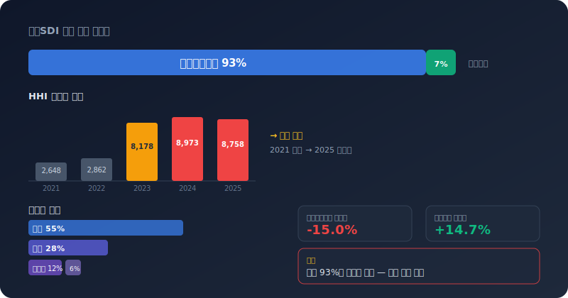
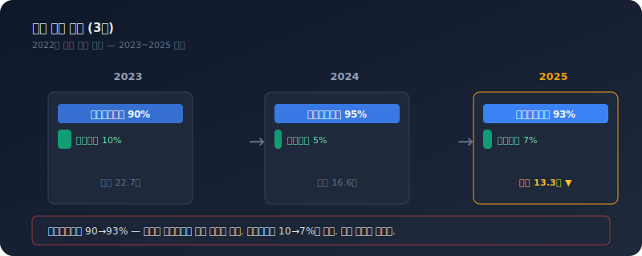
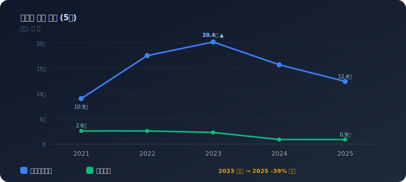
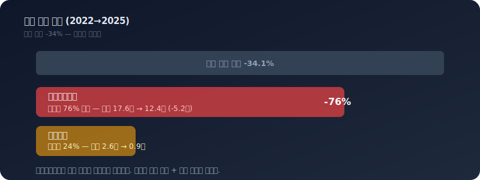
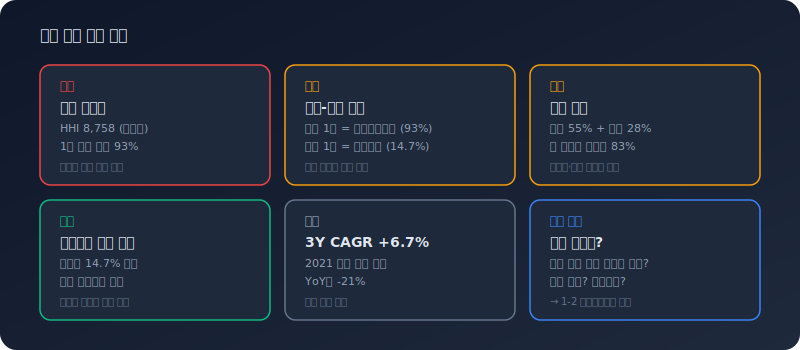

# 삼성SDI 수익 구조 분석 — 배터리 올인의 명과 암

삼성SDI는 배터리 회사인가, 소재 회사인가. 2025년 기준 에너지솔루션이 매출의 93%를 차지한다. 사실상 단일 사업 의존 구조다. 매출 HHI는 8,758로 고집중. 그런데 이 93%짜리 주력 부문이 적자다. 이익은 매출 7%인 전자재료에서 나온다.

이 글은 [수익 구조 읽기](/blog/revenue-structure-how-to-read)에서 정리한 프레임워크를 삼성SDI에 직접 적용한다. dartlab 코드 한 줄이면 이 분석을 재현할 수 있다.



---

## dartlab으로 수익 구조 꺼내기

```python
import dartlab
c = dartlab.Company("006400")  # 삼성SDI
c.review("수익구조")
```

이 한 줄이면 부문별 매출·이익 구성, 5년 추이, 지역별 매출, HHI 집중도, 성장 기여 분해, 매출 품질까지 한 번에 나온다. 이 글에서 다루는 모든 숫자는 이 명령의 결과에서 나왔다.

개별 계산 함수를 직접 쓸 수도 있다.

```python
from dartlab.analysis.strategy.revenue import (
    calcSegmentComposition,
    calcSegmentTrend,
    calcBreakdown,
    calcConcentration,
    calcGrowthContribution,
)

comp = calcSegmentComposition(c)
trend = calcSegmentTrend(c)
region = calcBreakdown(c, "region")
conc = calcConcentration(c)
gc = calcGrowthContribution(c)
```

---

## 부문 구성 — 에너지솔루션 93%, 전자재료 7%

삼성SDI의 보고 부문은 두 개뿐이다.

| 부문 | 매출 | 비중 | 이익률 |
|------|------|------|--------|
| 에너지솔루션 | 12.4조 | 93% | **-15.0%** |
| 전자재료 | 0.9조 | 7% | +14.7% |

매출의 93%를 차지하는 부문이 적자다. 전자재료가 유일한 흑자 부문이지만 규모가 너무 작아 전체 적자를 메울 수 없다. 이 구조에서 전체 영업이익은 에너지솔루션의 업황에 완전히 종속된다.

`calcSegmentComposition(c)`이 이 데이터를 반환한다. 함께 나오는 `compositionHistory`로 비중이 시간에 따라 어떻게 바뀌었는지 본다.

### 비중 변화 (3년)

| 연도 | 에너지솔루션 | 전자재료 |
|------|-------------|---------|
| 2023 | 90% | 10% |
| 2024 | 95% | 5% |
| 2025 | 93% | 7% |



비중 자체는 90~95% 사이에서 큰 변화가 없다. 하지만 절대 매출이 22.7조(2023) → 13.3조(2025)로 41% 줄었다. 비중이 유지되면서 매출이 줄었다는 것은, 두 부문이 동시에 축소되고 있다는 뜻이다.

---

## 부문별 매출 추이 — 2023 정점 후 급락

5년 추이를 보면 에너지솔루션의 사이클이 선명하게 드러난다.

| 부문 | 2021 | 2022 | 2023 | 2024 | 2025 | YoY |
|------|------|------|------|------|------|-----|
| 에너지솔루션 | 10.9조 | 17.6조 | **20.4조** | 15.7조 | 12.4조 | -21% |
| 전자재료 | 2.6조 | 2.6조 | 2.3조 | 0.9조 | 0.9조 | -2% |



에너지솔루션은 2021년 10.9조에서 2023년 20.4조까지 거의 두 배로 성장했다가, 2025년 12.4조로 되돌아왔다. 2년 만에 39% 하락. 배터리 가격 하락과 글로벌 EV 수요 둔화가 직격한 결과다.

전자재료는 2021~2022년 2.6조에서 2024~2025년 0.9조로 축소됐다. 이 부문의 축소는 부문 재편(EMC 분사 등)의 영향도 있어 단순 비교는 어렵지만, 현재 규모 자체가 작다.

`calcSegmentTrend(c)`이 이 5년 추이를 반환한다. 이전에는 최대 4년까지만 보여줬지만, 현재는 5년(가용 전 기간)을 사용한다.

---

## 매출 집중도 — HHI 2,648 → 8,758

HHI(허핀달-허슈만 지수)로 매출 집중도의 변화를 추적한다.

| 연도 | HHI | 수준 |
|------|-----|------|
| 2021 | 2,648 | 중간 집중 |
| 2022 | 2,862 | 중간 집중 |
| 2023 | 8,178 | **고집중** |
| 2024 | 8,973 | **고집중** |
| 2025 | 8,758 | **고집중** |

방향: **집중 심화**

2021~2022년에는 에너지솔루션과 전자재료가 각각 의미 있는 규모를 가졌기에 HHI가 2,600~2,800 수준이었다. 2023년부터 에너지솔루션의 매출이 급팽창하면서 HHI가 8,000대로 뛰었다. 이후 매출이 줄었지만 전자재료도 같이 줄면서 비중 격차는 유지되고 있다.

HHI 8,758은 사실상 단일 사업 의존이다. 에너지솔루션의 업황이 곧 삼성SDI의 실적이라는 뜻이다.

`calcConcentration(c)`이 HHI, 시계열, 방향(`집중 심화`/`다각화 진행`/`안정`)을 반환한다.

---

## 지역별 매출 — 중국 55%, 유럽 28%

| 지역 | 비중 |
|------|------|
| 중국 | 55% |
| 유럽 | 28% |
| 동남아시아 등 | 12% |
| 북미 | 6% |

중국과 유럽이 매출의 83%를 차지한다. 두 가지 리스크가 있다.

- **중국 55%**: 중국 로컬 배터리 업체(CATL, BYD)와의 경쟁 심화. 가격 경쟁에서 불리한 구조
- **유럽 28%**: 유럽 EV 보조금 축소와 규제 변화에 민감

북미 비중이 6%에 불과하다는 점도 주목할 만하다. IRA(인플레이션 감축법) 수혜를 받으려면 북미 생산 확대가 필요한데, 아직 매출 기여는 미미하다.

`calcBreakdown(c, "region")`이 이 데이터를 반환한다.

---

## 성장 기여 분해 — 감소의 76%가 에너지솔루션

2022년 대비 2025년, 전체 매출은 34% 줄었다. 이 감소가 어디에서 왔는지 분해하면:

- **에너지솔루션**: 감소의 76% 기여 (17.6조 → 12.4조, -5.2조)
- **전자재료**: 감소의 24% 기여 (2.6조 → 0.9조, -1.7조)



매출 감소의 대부분이 에너지솔루션에서 왔다. 단일 부문 의존 구조에서 그 부문이 역풍을 맞으면 전체 실적이 그대로 무너진다는 것을 보여주는 사례다.

`calcGrowthContribution(c)`이 3년 누적 기여도를 반환한다. 단순히 전년 대비가 아니라 3년 간격으로 비교하기 때문에, 한 분기의 노이즈에 휘둘리지 않는다.

---

## 수익 품질

- **영업CF/순이익**: -135% (위험) — 순이익 대비 영업현금흐름이 크게 부족
- **매출총이익률**: 11.0% — 배터리 가격 하락으로 마진 압축
- **총이익률 방향**: 개선 — 최저점에서 반등 신호

영업CF가 순이익보다 훨씬 부족하다는 것은, 회계상 이익이 현금으로 뒷받침되지 않는다는 뜻이다. 재고 증가나 매출채권 회수 지연이 원인일 수 있다. 이 부분은 [자금 구조](/blog/samsung-sdi-funding-structure) 분석에서 더 깊이 들여다봐야 한다.

---

## 진단 요약



삼성SDI의 수익 구조를 한 문장으로 요약하면: **매출의 93%를 차지하는 부문이 적자이고, 이 부문에 대한 의존도가 심화되고 있다.**

구체적으로:

- 에너지솔루션 93% 집중 (HHI 8,758 고집중)
- 주력 부문이 적자 (-15% 이익률), 흑자는 매출 7%인 전자재료에서
- 매출 2023년 정점 대비 -41% 하락
- 중국 55% + 유럽 28%로 지역도 집중
- 3Y CAGR +6.7%이나 YoY -21%로 방향 전환

다음 질문은 "이 적자를 어떻게 버티는가" — 자금 구조다. 부채비율, 차입 규모, 이자보상배율을 통해 현재의 역풍을 재무적으로 얼마나 버틸 수 있는지 확인해야 한다.

---

## 체크리스트

이 분석에서 확인한 수익 구조의 핵심 질문이다.

- 매출 비중 93%인 부문이 적자 — 이 적자가 일시적인가, 구조적인가?
- HHI가 3년 만에 2,600에서 8,700으로 뛰었다 — 사업 다각화가 역행하고 있는가?
- 중국 55% 매출 — 로컬 경쟁사 대비 가격 경쟁력이 있는가?
- 전자재료가 유일한 흑자인데 규모가 줄고 있다 — 이 방어선이 유지되는가?
- 3Y CAGR과 YoY가 반대 방향 — 2021 기저 효과가 끝나면 CAGR도 꺾이는가?

---

## 다음 글

이 글은 "무엇으로 돈을 버는가"에 대한 답이었다. 다음 글에서는 "돈을 어디서 조달하는가" — 자금 구조를 다룬다. 에너지솔루션의 적자를 버티기 위한 차입 구조, 부채비율 추이, 이자 부담을 삼성SDI 데이터로 직접 확인한다.

수익 구조의 이론적 프레임워크는 [이 회사는 무엇으로 돈을 버는가 — 수익 구조 읽기](/blog/revenue-structure-how-to-read)에서 정리했다. 세그먼트 공시 자체의 구조는 [세그먼트 공시 해석](/blog/segment-reporting-interpretation)을 참고한다.
