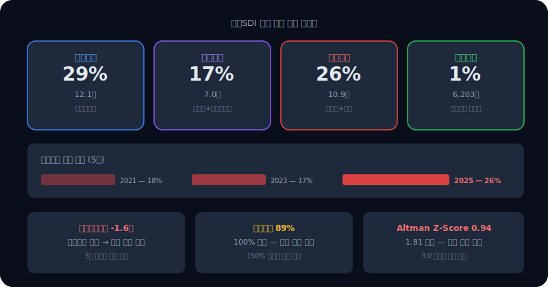
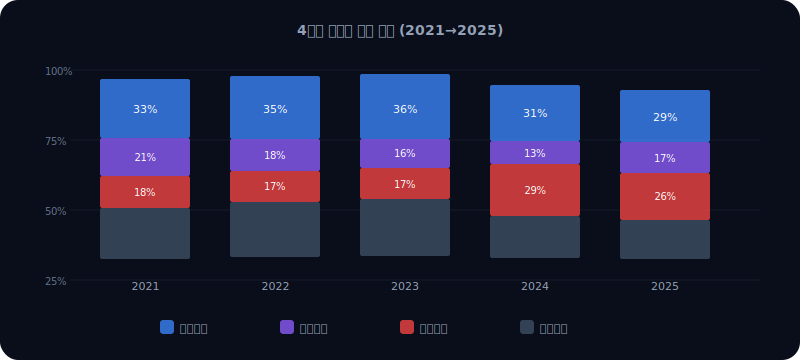
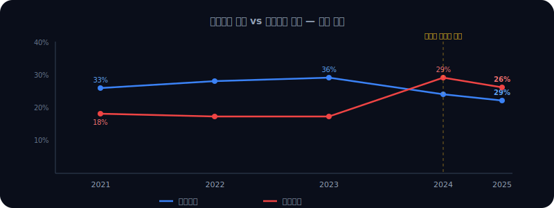
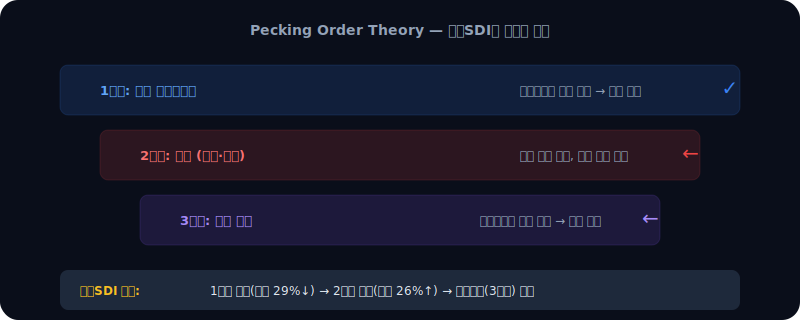
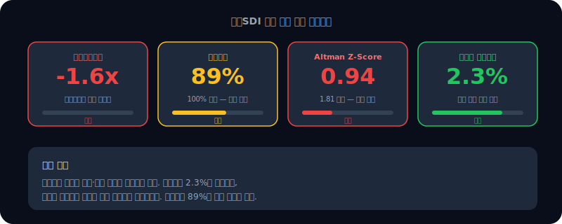

# 삼성SDI 자금 구조 분석 — 차입 급증의 의미를 읽는다

삼성SDI는 돈을 어디서 가져오는가. 2025년 기준 이익잉여금(내부유보)이 자산의 29%, 금융차입이 26%다. 5년 전에는 유보 33%, 차입 18%였다. 내부유보는 줄고 차입은 늘었다. 2024년에는 차입 비중이 유보를 역전했다.

문제는 돈의 출처만이 아니다. 영업이익이 적자다. 이자보상배율 -1.6배. 빌린 돈의 이자도 감당 못 하는 구조다. 유동비율 89%, Altman Z-Score 0.94. 세 지표 모두 경고를 보낸다.

이 글은 [수익 구조 분석](/blog/samsung-sdi-revenue-structure)의 후속이다. 수익 구조에서 "매출은 크지만 적자"라는 사실을 확인했다면, 이 글에서는 "적자인 회사가 돈을 어떻게 조달하고 있는가"를 본다.



---

## dartlab으로 자금 구조 꺼내기

```python
import dartlab
c = dartlab.Company("006400")  # 삼성SDI
c.review("자금조달")
```

이 한 줄이면 조달원 비중, 자본구조 시계열, 부채구조, 이자 부담, 유동성, 위험 신호까지 한 번에 나온다. 이 글에서 다루는 모든 숫자는 이 명령의 결과에서 나왔다.

---

## 4가지 조달원 — 돈은 어디서 오는가

기업이 자산을 구성하는 돈은 네 가지 출처에서 온다.

| 조달원 | 의미 | 삼성SDI (2025) |
|--------|------|----------------|
| **내부유보** | 이익잉여금 — 사업으로 번 돈 | 12.1조 (29%) |
| **주주자본** | 자본금+자본잉여금 — 주주가 넣은 돈 | 7.0조 (17%) |
| **금융차입** | 차입금+사채 — 이자 붙는 빚 | 10.9조 (26%) |
| **영업조달** | 매입채무·선수금 — 영업에서 자연 발생 | 6,203억 (1%) |

삼성SDI는 내부유보 29%, 금융차입 26%로 균형 조달 구조다. 하지만 5년 전과 비교하면 방향이 문제다.



---

## 5년 추이 — 유보는 줄고 차입은 늘었다

| 연도 | 내부유보 | 주주자본 | 금융차입 | 영업조달 |
|------|----------|----------|----------|----------|
| 2021 | 33% | 21% | 18% | 1% |
| 2022 | 35% | 18% | 17% | 1% |
| 2023 | 36% | 16% | 17% | 2% |
| 2024 | 31% | 13% | 29% | 2% |
| 2025 | 29% | 17% | 26% | 1% |

2023년까지 내부유보가 늘면서 "자기 힘으로 성장하는 회사"였다. 2024년부터 급변한다. 이익잉여금은 줄고, 금융차입이 +8pp 증가했다.

왜 그런가. 배터리 대규모 투자(헝가리·미국 공장)에 자금이 필요한데, 영업이익이 적자로 돌아서면서 내부에서 돈을 만들지 못했다. 결국 외부에서 빌렸다.

2025년에는 유상증자(3,740억 규모)까지 집행했다. 주주자본 비중이 13%에서 17%로 다시 올라간 건 이 때문이다.



---

## Pecking Order Theory로 읽기

재무학에서 가장 잘 알려진 자금조달 이론 중 하나가 **Pecking Order Theory**(자금조달 순서 이론)다. 기업은 정보비대칭 비용이 적은 순서대로 자금을 조달한다.

1. **내부유보** — 가장 저렴. 외부에 설명할 필요 없음
2. **부채** — 이자 비용이 있지만 세금 절감 효과
3. **주식 발행** — 가장 비쌈. 시장이 과대평가라는 신호로 읽힘

삼성SDI는 이 순서를 교과서처럼 밟고 있다. 1순위(유보)가 줄어들자 2순위(차입)가 급증했고, 2025년에는 3순위(유상증자)까지 집행했다.



문제는 1순위 원천이 회복되지 않으면 2순위·3순위 의존이 고착된다는 점이다. 영업이익이 흑자로 돌아와야 이 사이클이 정상화된다.

---

## 차입의 질 — 금리는 양호, 상환은 불가

삼성SDI의 암묵적 차입금리는 **2.3%**다. 시장 금리 대비 양호하다. 신용도가 높은 대기업이라 자금 조달 자체는 어렵지 않다.

하지만 이자를 갚을 능력이 없다. 이자보상배율이 **-1.6배**다. 영업이익이 적자이므로 이자비용을 영업에서 번 돈으로 감당하지 못한다. 기준선은 3배 이상이다.

---

## 유동성과 부실 위험

| 지표 | 수치 | 기준 | 판단 |
|------|------|------|------|
| 유동비율 | 89% | 150% 이상 안정 | 주의 |
| 당좌비율 | 59% | 100% 이상 안정 | 주의 |
| 현금비율 | 18% | 20% 이상 안정 | 경계 |
| Altman Z-Score | 0.94 | 1.81 미만 부실 경계 | 위험 |

유동비율 89%는 유동자산이 유동부채보다 적다는 뜻이다. 1년 안에 갚아야 할 빚이 1년 안에 현금화할 수 있는 자산보다 많다. Altman Z-Score 0.94는 1.81 미만으로 부실 경계 구간이다.



물론 삼성SDI는 삼성그룹이라는 배경이 있다. 단기 부도 위험은 낮다. 그러나 **독립적인 재무 건전성**만 보면 경고 신호가 겹쳐 있다. 이 구조에서 배터리 시장 회복이 늦어지면 추가 자금 조달(차환·유상증자)이 반복될 수밖에 없다.

---

## 삼성전자와 비교하면

같은 삼성그룹이지만 자금 구조는 정반대다.

| 항목 | 삼성전자 | 삼성SDI |
|------|----------|---------|
| 내부유보 | 71% | 29% |
| 금융차입 | 4% | 26% |
| 이자보상배율 | 양호 | -1.6배 |
| 진단 | 자기 힘으로 성장 | 균형 조달(악화 중) |

삼성전자는 이익잉여금이 자산의 71%다. 외부 자금에 거의 의존하지 않는다. 같은 반도체·전자 산업이지만, 사업 사이클과 투자 시점에 따라 자금 구조가 완전히 달라진다.

---

## 핵심 요약

1. **유보 감소 + 차입 증가** — 2023년까지 자기 힘으로 성장했으나, 2024년부터 외부 의존 구조로 전환
2. **Pecking Order 교과서** — 유보 → 차입 → 유상증자 순서를 그대로 밟고 있음
3. **차입금리 2.3% 양호** — 그러나 이자보상배율 -1.6배로 상환 능력 없음
4. **유동비율 89%, Z-Score 0.94** — 독립적 재무 건전성은 경고 수준
5. **관건은 영업이익 회복** — 배터리 시장 회복이 자금 구조 정상화의 열쇠

---

## 시리즈 안내

이 글은 **실전기업분석** 시리즈 3편이다. 같은 회사를 각도만 바꿔가며 분석한다.

- 1편: [수익 구조 읽기](/blog/revenue-structure-how-to-read) — 프레임워크
- 2편: [삼성SDI 수익 구조](/blog/samsung-sdi-revenue-structure) — 배터리 올인의 명과 암
- **3편: 삼성SDI 자금 구조** — 차입 급증의 의미 (이 글)

다음은 비용 구조와 현금흐름 분석으로 이어진다. 수익과 자금을 봤으니, 이제 "번 돈이 실제로 남는가"를 본다.

---

<details>
<summary>FAQ</summary>

**Q. 금융차입 26%면 위험한가?**

일반적으로 금융차입이 자산의 30% 이상이면 높은 수준이다. 삼성SDI의 26%는 아직 극단적이지는 않지만, 5년간 +8pp 증가 추세가 문제다. 더 중요한 건 이자를 갚을 영업이익이 없다는 점이다.

**Q. Altman Z-Score가 낮으면 바로 부도인가?**

아니다. Z-Score는 통계 모델이지 예언이 아니다. 삼성SDI처럼 대기업 그룹 계열사는 그룹 지원, 자산 매각, 자본시장 접근성이 있어 단기 부도 확률은 매우 낮다. 다만 "독립적으로 봤을 때 재무가 취약하다"는 신호로 읽어야 한다.

**Q. 유상증자를 했으면 자금 구조가 개선된 거 아닌가?**

유상증자는 주주자본을 늘린다. 2025년 주주자본 비중이 13%→17%로 올라간 게 그 효과다. 하지만 이건 "사업으로 번 돈"이 아니라 "주주에게 추가로 받은 돈"이다. Pecking Order에서 3순위 수단을 쓴 것이므로, 근본적인 이익 구조가 바뀌지 않으면 반복될 수밖에 없다.

**Q. dartlab에서 다른 회사도 같은 분석을 할 수 있나?**

```python
import dartlab
c = dartlab.Company("005930")  # 종목코드만 바꾸면 됨
c.review("자금조달")
```

어떤 상장사든 종목코드만 넣으면 동일한 4원천 분해, 시계열, 위험 지표를 볼 수 있다.

</details>
