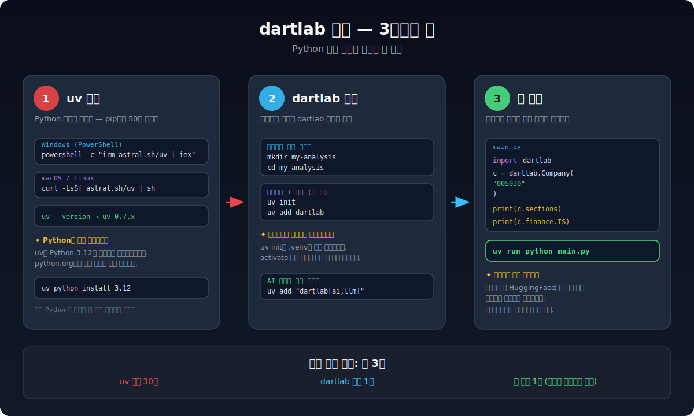
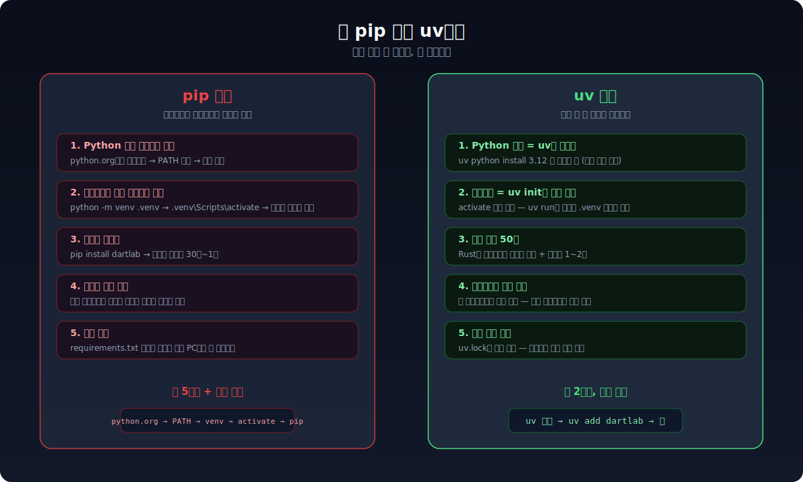
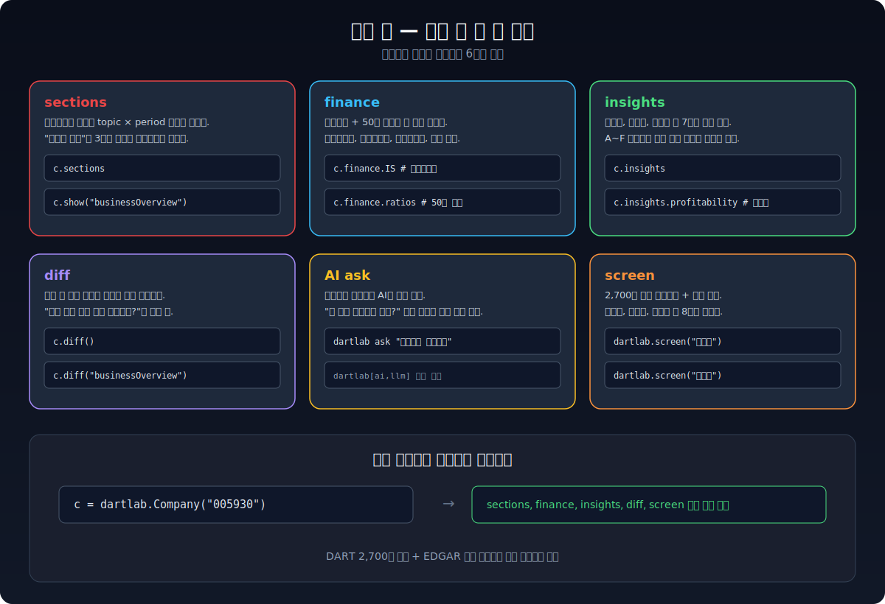

전자공시 데이터를 분석하고 싶은데, Python 설치부터 막힌다. `pip install`을 치면 뭔가 에러가 나고, 가상환경이 뭔지 모르겠고, PATH가 어쩌고 하는 문구를 보면 포기하고 싶어진다.

이 글은 **컴퓨터에 Python이 없어도** 3분 안에 dartlab을 설치하고 첫 분석을 실행하는 과정을 보여준다. 비결은 `uv`라는 도구다.



## uv가 뭔가

uv는 Python 패키지 관리자다. pip과 같은 역할을 하지만 **근본적으로 다르다**.

pip은 패키지를 설치하는 도구일 뿐이다. Python을 먼저 설치해야 하고, 가상환경을 직접 만들어야 하고, 의존성 충돌이 나면 직접 해결해야 한다. uv는 이 모든 걸 한 번에 해결한다.



정리하면 이렇다.

| 항목 | pip | uv |
|------|-----|-----|
| Python 설치 | python.org에서 직접 다운로드 | `uv python install 3.12` 한 줄 |
| 가상환경 | `python -m venv .venv` → `activate` 필요 | `uv init`이 자동 생성, activate 불필요 |
| 패키지 설치 | `pip install` (30초~1분) | `uv add` (1~2초) |
| 프로젝트 격리 | 직접 관리해야 함 | 프로젝트마다 자동 격리 |
| 환경 재현 | requirements.txt 수동 관리 | uv.lock 자동 생성 |

uv는 Rust로 만들어져서 pip보다 **10~100배 빠르다**. 하지만 속도보다 중요한 건 — **초보자가 밟을 함정이 거의 없다**는 점이다.

## 1단계: uv 설치

### Windows

PowerShell을 연다. 시작 메뉴에서 "PowerShell"을 검색하면 나온다.

```powershell
powershell -ExecutionPolicy ByPass -c "irm astral.sh/uv | iex"
```

이 한 줄이면 uv가 설치된다.

> **PowerShell은 어디서 여나?**
> 키보드에서 `Windows 키`를 누르고 "PowerShell"을 타이핑한 다음 `Enter`를 누른다. 파란색 창이 뜨면 그게 PowerShell이다.

### macOS

터미널을 연다. `Cmd + Space`로 Spotlight를 열고 "Terminal"을 검색하면 나온다.

```bash
curl -LsSf https://astral.sh/uv/install.sh | sh
```

### Linux

```bash
curl -LsSf https://astral.sh/uv/install.sh | sh
```

### 설치 확인

터미널을 **닫았다가 다시 열고** 아래를 입력한다.

```bash
uv --version
```

`uv 0.7.x` 같은 버전 번호가 나오면 성공이다.

> **중요: 터미널을 다시 열어야 한다.** uv를 설치한 직후에는 PATH가 반영되지 않는다. 터미널을 닫고 새로 열어야 `uv` 명령이 인식된다. 이걸 모르면 "명령을 찾을 수 없습니다" 에러를 만난다.

### Python도 알아서 설치된다

uv는 Python까지 관리한다. 시스템에 Python이 없어도 걱정할 필요 없다.

```bash
uv python install 3.12
```

이 한 줄로 Python 3.12가 설치된다. python.org에서 다운로드 → 설치 경로 설정 → PATH 등록 같은 과정이 전부 생략된다.

이미 Python 3.12 이상이 있다면 이 줄은 생략해도 된다. `uv python list`로 현재 설치된 버전을 확인할 수 있다.

## 2단계: dartlab 설치

### 프로젝트 폴더 만들기

분석 코드를 넣을 폴더를 만든다. 이름은 아무거나 상관없다.

```bash
mkdir my-analysis
cd my-analysis
```

### uv로 프로젝트 초기화 + dartlab 설치

```bash
uv init
uv add dartlab
```

이 두 줄이면 끝이다. `uv init`이 가상환경을 자동으로 만들고, `uv add dartlab`이 dartlab과 모든 의존성 패키지를 설치한다.


`uv init` 후에 폴더 안을 보면 여러 파일이 생겨 있다. 하지만 **직접 만지는 파일은 하나도 없다**. 분석 코드를 작성할 Python 파일만 하나 만들면 된다.

### pip으로도 설치할 수 있다

uv가 어색하다면 pip으로도 설치할 수 있다. 다만 가상환경은 직접 만들어야 한다.

```bash
# pip 방식 (가상환경 직접 관리)
python -m venv .venv

# Windows
.venv\Scripts\activate

# macOS/Linux
source .venv/bin/activate

pip install dartlab
```

되긴 되지만, 이 글에서는 uv 방식을 권장한다. 가상환경 activate를 잊어서 시스템 Python을 오염시키는 실수를 원천 차단할 수 있기 때문이다.

## 3단계: 첫 실행

### 분석 코드 작성

텍스트 에디터로 `main.py` 파일을 만든다. 메모장이든 VS Code든 상관없다.

```python
import dartlab

c = dartlab.Company("005930")  # 삼성전자

# 사업보고서 전체 지도
print(c.sections)

# 손익계산서
print(c.finance.IS)

# 재무상태표
print(c.finance.BS)
```

종목코드 `"005930"`은 삼성전자다. 다른 종목을 보고 싶으면 [KRX 종목코드](https://kind.krx.co.kr/)에서 6자리 코드를 찾아서 넣으면 된다.

### 실행

```bash
uv run python main.py
```

`uv run`이 중요하다. 이 명령은 `.venv` 안에 설치된 Python과 패키지를 자동으로 사용한다. `python main.py`로 직접 실행하면 dartlab을 못 찾을 수 있다.

첫 실행 시 HuggingFace에서 해당 종목의 공시 데이터를 자동으로 다운로드한다. 인터넷 속도에 따라 10~30초 정도 걸린다. 두 번째 실행부터는 캐시에서 즉시 로드되므로 2~3초면 끝난다.

### 실행 결과

```
         topic              2024Q4  2024Q2  2023Q4  ...
0   사업의내용     DART 원문 텍스트  ...    ...    ...
1   재무에관한사항   재무상태표, ...   ...    ...    ...
2   감사보고서     적정의견...       ...    ...    ...
...
```

`c.sections`는 사업보고서 전체를 **topic(항목) × period(기간)** 매트릭스로 보여준다. 한 화면에서 여러 기간의 공시 텍스트가 어떻게 바뀌었는지 파악할 수 있다.

## 설치 후 바로 해볼 수 있는 것들



종목코드 하나에서 시작하는 6가지 분석을 정리했다.

### 재무제표 한 줄로 꺼내기

```python
import dartlab

c = dartlab.Company("005930")

print(c.finance.IS)      # 손익계산서
print(c.finance.BS)      # 재무상태표
print(c.finance.CF)      # 현금흐름표
print(c.finance.ratios)  # 50개 재무비율
```

[dartlab 재무제표](/blog/dartlab-finance-ratios-one-line) 글에서 자세히 다룬다.

### 기업 건강 등급 확인

```python
print(c.insights)  # 7영역 자동 등급 (A~F)
```

수익성, 안정성, 성장성, 효율성, 배당, 밸류에이션, 규모까지 7영역을 자동으로 등급 매긴다. [dartlab 인사이트](/blog/dartlab-insights-7area-grading) 글에서 자세히 다룬다.

### 공시 텍스트 변화 감지

```python
print(c.diff())              # 전체 변화 요약
print(c.diff("사업의내용"))   # 특정 항목만
```

"지난 분기 대비 뭐가 바뀌었지?"라는 질문에 바로 답한다.

### AI에게 물어보기

AI 분석을 쓰려면 추가 패키지가 필요하다.

```bash
uv add "dartlab[ai,llm]"
```

그 다음 API 키를 설정한다.

```bash
uv run dartlab setup openai
# API key를 입력하면 로컬에 저장된다
```

이제 자연어로 질문할 수 있다.

```bash
uv run dartlab ask "삼성전자 재무건전성 분석해줘"
```

[dartlab ask](/blog/dartlab-ask-ai-disclosure-analysis) 글에서 자세히 다룬다.

### EDGAR (미국 기업)도 같은 방식

```python
import dartlab

c = dartlab.Company("AAPL")  # Apple
print(c.sections)
print(c.finance.IS)
```

DART 한국 종목과 완전히 같은 인터페이스다. 종목코드 대신 티커를 넣으면 된다.

## 자주 만나는 문제


### "uv: 명령을 찾을 수 없습니다"

터미널을 닫고 다시 열면 해결된다. uv 설치 직후에는 PATH가 반영되지 않기 때문이다. 그래도 안 되면 PC를 재시작한다.

### "Python 3.12 이상이 필요합니다"

```bash
uv python install 3.12
```

uv가 Python을 자동으로 다운로드한다. 기존 Python에 영향 없다.

### Windows에서 "Permission denied"

PowerShell을 관리자 권한으로 열고 실행 정책을 바꾼다.

```powershell
Set-ExecutionPolicy RemoteSigned -Scope CurrentUser
```

그 다음 uv 설치 명령을 다시 실행한다.

### 첫 실행이 30초 넘게 걸린다

정상이다. 첫 실행 시 HuggingFace에서 데이터를 다운로드하기 때문이다. 두 번째부터는 2~3초면 끝난다.

## 다음 단계

dartlab이 설치됐다면 아래 글에서 각 기능을 더 깊이 파볼 수 있다.

- [dartlab 재무제표](/blog/dartlab-finance-ratios-one-line) — 한 줄로 재무제표 꺼내고 50개 비율까지 자동 계산
- [dartlab 인사이트](/blog/dartlab-insights-7area-grading) — 7영역 등급으로 기업 건강 체크
- [dartlab ask](/blog/dartlab-ask-ai-disclosure-analysis) — GPT 하나로 전자공시 AI 분석
- [dartlab MCP](/blog/dartlab-mcp-claude-desktop-disclosure) — Claude Desktop에서 전자공시 바로 조회
- [dartlab 스크리닝](/blog/dartlab-screen-benchmark-2700) — 2,700개 종목 스크리닝 + 섹터 비교
- [dartlab network](/blog/dartlab-network-group-visualization) — 상장사 전체 관계망 시각화
