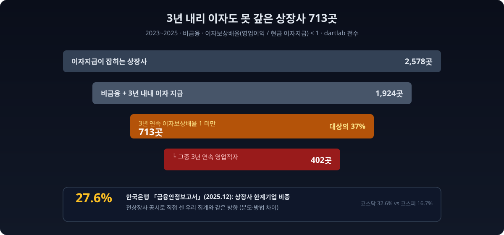
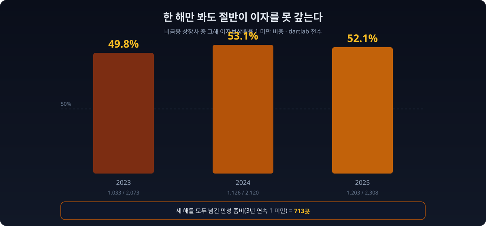
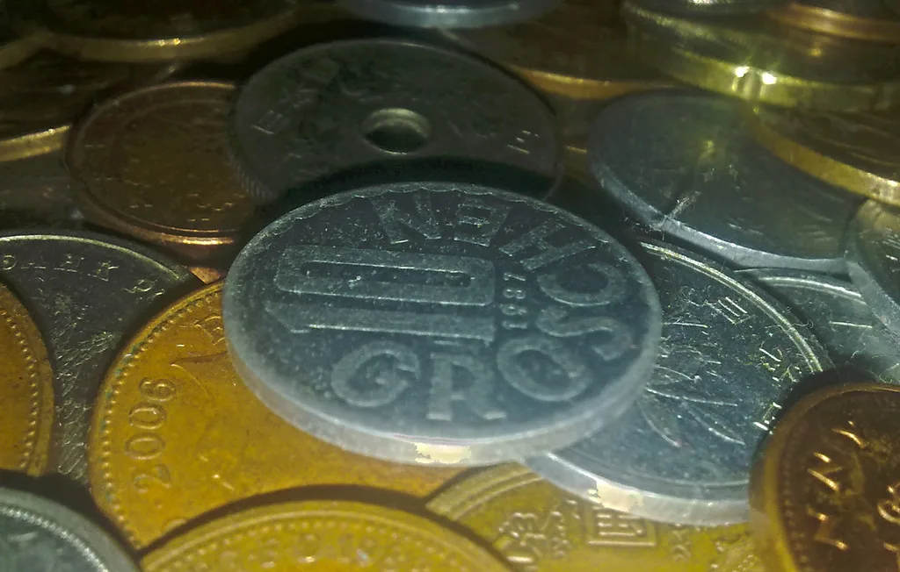
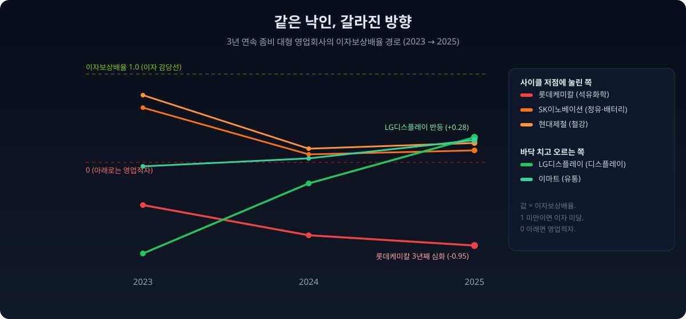
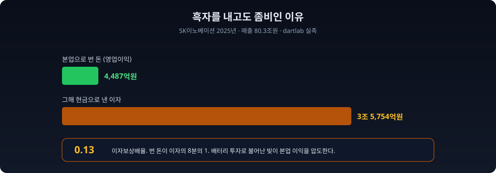
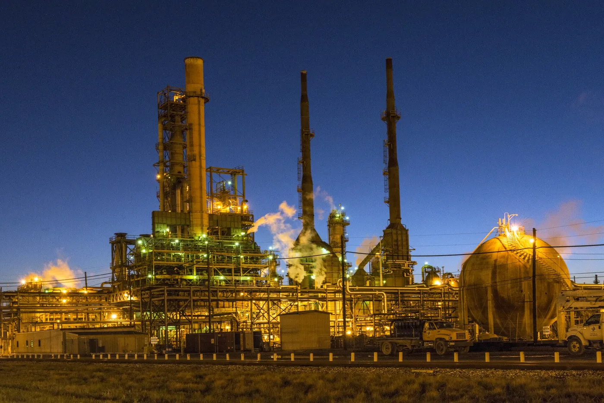
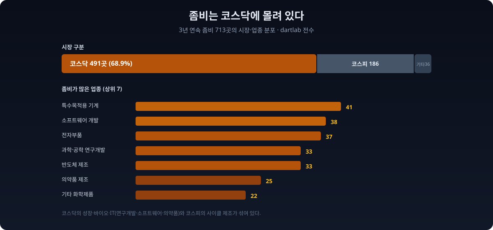
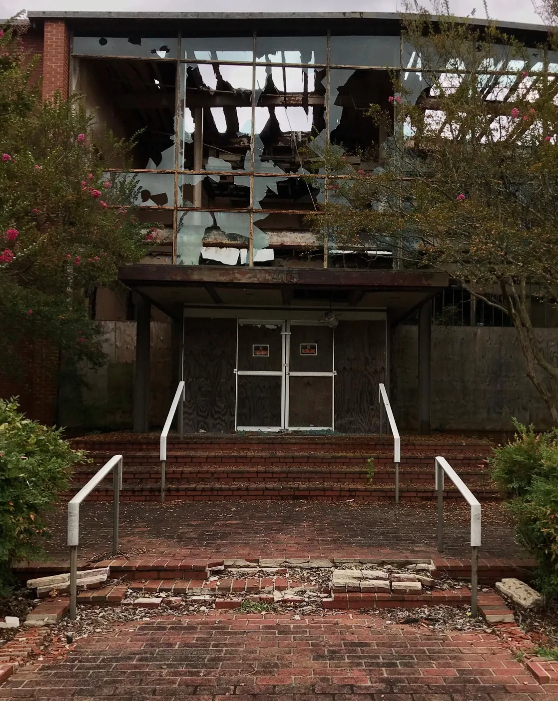

2025년 12월, 한국은행은 [「금융안정보고서」](https://www.bok.or.kr/portal/bbs/B0000502/view.do?menuNo=201265&nttId=10095309)에서 한 문장을 적었다. **국내 상장사의 27.6%가 한계기업이 됐다.** 2017년 11.8%에서 8년 만에 15.8%포인트가 뛰었고, 증가 속도는 주요국 가운데 가장 빨랐다. [신문은 "상장사 27.6%가 영업이익으로 이자도 못 냈다"](https://www.fnnews.com/news/202606291411538368)는 제목을 달았다.

그래서 dartlab으로 그 숫자를 직접 세어봤다. 남이 발표한 통계를 옮기는 대신, 전상장사 공시에서 영업이익과 이자를 꺼내 우리 손으로 집계했다. 이자를 무는 비금융 상장사 **1,924곳 중 713곳**이, 2023년부터 2025년까지 **3년 내리 영업이익으로 그해 낸 현금 이자조차 갚지 못했다.** 비금융 이자부담 기업의 37%, 전체 상장사로 넓혀 잡아도 약 27%. 한국은행이 본 그림과 같은 방향이었다.

그런데 713곳을 하나씩 펼치자 통계가 말하지 않던 게 보였다. **같은 "3년 연속 좀비"라는 낙인 아래, 회사들은 정반대 방향으로 움직이고 있었다.** 어떤 곳은 2025년 바닥을 치고 1을 향해 올라오고 있었고, 어떤 곳은 3년째 더 깊이 빠지고 있었다.



## "이자보상배율 1 미만"이 왜 위험 신호인가

숫자를 세기 전에, 무엇을 세는지부터 맞춰야 한다.

**이자보상배율(영업이익 / 이자비용)** 은 회사가 본업으로 번 돈(영업이익)이 그해 갚아야 할 이자보다 많은지를 재는 지표다. 이 값이 **1 미만이면 장사로 번 돈으로 이자조차 다 못 갚는다는 뜻**이다. 모자란 이자는 결국 남은 현금을 헐거나, 자산을 팔거나, 빚을 더 내서 메운다. 빚으로 이자를 갚는 구조가 굳어지면 그게 흔히 말하는 좀비다.

한 해 삐끗한 것과 만성적으로 못 갚는 것은 다르다. 그래서 한국은행과 정부, 국제기구는 **3년 연속** 이자보상배율이 1 미만인 기업을 **한계기업**으로 본다. 한 번의 불황이 아니라, 세 번의 결산을 지나도 이자를 못 버는 상태. 이 글이 세는 것도 정확히 이 정의다. 2023, 2024, 2025년 세 해를 모두 1 미만으로 넘긴 곳만 골랐다.

> **이 리포트가 숫자를 만든 방법 (읽고 넘어가도 되는 방법론)**
>
> - **분자 = 영업이익**, 연간(분기 4개 합산). **분모 = 현금흐름표의 이자지급액**(그해 실제로 현금으로 나간 이자, 절대값). 손익계산서의 별도 "이자비용" 줄은 대부분 기업이 "금융비용"에 환율손실과 파생손실까지 묶어 표기해 순수 이자를 분리할 수 없다. 실제 지급 이자에 가장 가깝고 전종목에서 채워지는 값이 현금흐름표 이자지급액이라, 이것을 이자보상배율의 분모로 썼다.
> - **금융업 제외.** 은행과 증권, 보험은 이자가 본업의 원가다. 이자보상배율 공식 자체가 성립하지 않아 뺐다.
> - **지주회사 12곳은 별도 표기.** 순수 지주는 자회사 지분법이익이 영업이익에 잡히지 않아 이자보상배율이 구조적으로 낮게 나온다. 집계에는 넣되 대표 사례에서는 뺐다.
> - **기준 시점** = 최신 정기보고서(2025년 연간). 데이터 기준: 2026-07-04 dartlab.

## 전상장사에 물었다: 713곳

dartlab의 `scan("account", ...)` 은 DART 정기보고서의 계정 하나를 전종목에서 한 번에 읽는다. 영업이익과 이자지급액을 각각 불러 연도별로 합치고, 나눠서 이자보상배율을 만들면 시장 전체가 한 장에 펼쳐진다.

```python
import dartlab
import polars as pl

oi = dartlab.scan("account", "영업이익")   # 전상장사 영업이익 (분기)
ip = dartlab.scan("account", "이자지급")   # 현금흐름표 이자지급액 (분기)
L  = dartlab.listing()                      # 상장사 업종·시장 분류

def annual(df, y):                          # 분기 4개를 1년치로 합산
    q = [f"{y}Q{i}" for i in (1, 2, 3, 4) if f"{y}Q{i}" in df.columns]
    return df.with_columns(
        pl.sum_horizontal([pl.col(c) for c in q]).alias(f"v{y}")
    ).select(["종목코드", f"v{y}"])

# 종목별로 연도별 영업이익·이자지급을 붙이고 이자보상배율을 만든 뒤
# 2023·2024·2025 세 해가 모두 1 미만인 곳(비금융)을 센다  →  713곳
```

집계 결과를 깔때기로 줄이면 이렇다.

| 구분 | 회사 수 | 비고 |
|---|---:|---|
| 이자지급이 잡히는 상장사 | 2,578 | 집계 출발점 |
| 비금융 + 3년 내내 이자 지급 | 1,924 | 이자보상배율 산출 대상 |
| └ **3년 연속 이자보상배율 1 미만** | **713** | **대상의 37%** |
| └ └ 그중 **3년 연속 영업적자** | **402** | 좀비의 56% |
| 코스닥 소속 | 491 | 좀비의 68.9% |
| 코스피(유가증권) 소속 | 186 | 좀비의 26.1% |

읽는 법은 단순하다. **이자를 무는 비금융 상장사 10곳 중 4곳 가까이(37%)가 3년 내리 장사로 이자를 다 못 갚았다.** 그중 402곳은 이자는커녕 **영업이익 자체가 3년 내리 마이너스**였다. 번 돈이 없어서 못 갚은 게 아니라, 애초에 벌지 못한 곳이 절반을 넘는다.

이 713곳이 짊어진 **총부채를 다 더하면 1,042조원**이다(영업부채까지 포함한 총부채 기준). 부채비율 중앙값은 **117.6%로, 좀비가 아닌 기업(65.1%)의 1.8배**다. 빚이 많은 회사가 이자를 못 갚는다는, 당연하지만 확인이 필요한 인과가 데이터에도 그대로 찍혀 있다.

## 한 해가 아니라 매년 절반이었다

"3년 연속"이라는 문턱이 높아 보이지만, 사실 **한 해만 놓고 봐도 상장사 절반이 이 선 아래에 있다.** 비금융 상장사의 단년도 이자보상배율 1 미만 비중을 3년치로 늘어놓으면 이렇다.



| 연도 | 이자 무는 비금융 상장사 | 이자보상배율 1 미만 | 비중 |
|---|---:|---:|---:|
| 2023 | 2,073 | 1,033 | **49.8%** |
| 2024 | 2,120 | 1,126 | **53.1%** |
| 2025 | 2,308 | 1,203 | **52.1%** |

3년 내내 절반 언저리다. 한국은행이 같은 지표를 "일시적 한계기업"으로 부르며 43.9%로 집계한 것과도 결이 같다. 배경은 다들 짐작하는 그대로다. 기준금리가 오른 뒤 이자 부담이 눌러앉았고, 경기 둔화로 영업이익은 얇아졌다. [한국은행 기업경영분석에서도 이자보상비율 100% 미만 기업 비율이 42.8%로 역대 최고](https://www.g-enews.com/article/Finance/2025/10/202510291438283899bbed569d68_1)를 찍었고, [KDI도 이자보상배율 취약기업 증가를 별도 보고서로 다뤘다](https://eiec.kdi.re.kr/policy/domesticView.do?ac=0000163200). **문제는 이게 한 해의 사고가 아니라 3년째 반복되는 상태라는 데 있다.**



단년도 분포는 코드로도 한 줄이다. 위에서 만든 이자보상배율 표를 연도별로 세기만 하면 된다.

```python
# 비금융 상장사 중 그해 이자보상배율 1 미만 비중
for y in (2023, 2024, 2025):
    u = nonfin.filter(pl.col(f"ie{y}") > 0)            # 그해 이자를 낸 곳
    lt1 = u.filter(pl.col(f"icr{y}") < 1).height        # 이자보상배율 1 미만
    print(y, lt1, u.height, round(100 * lt1 / u.height, 1))
# 2023 1033 2073 49.8 / 2024 1126 2120 53.1 / 2025 1203 2308 52.1
```

## 같은 낙인, 갈라진 방향

713곳을 규모순으로 세워 이름이 알려진 회사부터 보면, 통계로는 안 보이던 게 드러난다. 매출 조 단위의 대형 영업회사들도 이 명단에 있다. 그런데 3년의 궤적을 나란히 놓으면 **정반대 두 갈래**로 갈린다.



| 회사 (업종) | 매출(2025) | 2023 | 2024 | 2025 | 방향 |
|---|---:|---:|---:|---:|---|
| **롯데케미칼** (석유화학) | 18.6조 | -0.49 | -0.83 | **-0.95** | 심화 |
| **현대제철** (철강) | 22.7조 | 0.76 | 0.15 | **0.22** | 저점 |
| **SK이노베이션** (정유·배터리) | 80.3조 | 0.62 | 0.09 | **0.13** | 저점 |
| **한국가스공사** (도시가스) | 35.7조 | 0.37 | 0.73 | **0.57** | 등락 |
| **이마트** (유통) | 29.0조 | -0.05 | 0.04 | **0.25** | 회복 |
| **LG디스플레이** (디스플레이) | 25.8조 | -1.04 | -0.24 | **0.28** | 회복 |

표시: 값은 이자보상배율(영업이익 / 현금 이자지급). 1 미만이면 이자 미달, 마이너스면 영업적자.

**한쪽 끝은 [롯데케미칼](/blog/011170-lotte-chemical)이다.** 영업손실이 2023년 3,477억원에서 2024년 8,941억원, 2025년 9,375억원으로 3년 내리 커졌다. 같은 기간 현금으로 낸 이자는 7,169억원에서 9,887억원. 벌기는커녕 손실이 깊어지는데 이자는 매년 늘었다. 석유화학 자체가 중국 증설과 저가 공세에 눌린 구조 불황이라, [회사는 나프타분해시설 통폐합 같은 구조조정에 들어갔다](https://www.mt.co.kr/industry/2025/11/12/2025111217375662806). 증권가는 2026년에도 적자를 점친다. 이건 사이클의 바닥이 아니라 **바닥이 어디인지 아직 안 보이는** 경우다. 매출 18조 회사가 왜 3년째 적자인지는 [롯데케미칼 심층 리포트](/blog/011170-lotte-chemical)에서 따로 다뤘다.

**반대쪽 끝은 LG디스플레이다.** 2023년 영업손실 2조5,102억원, 이자보상배율 -1.04. 번 게 없으니 이자 근처도 못 갔다. 그런데 2024년 -0.24로 손실이 줄더니, 2025년 영업이익 5,170억원으로 돌아서며 이자보상배율이 +0.28까지 올라왔다. 아직 1에는 못 미쳐 여전히 "3년 연속 좀비" 명단에 있지만, **방향은 정확히 위**다. [이마트](/blog/139480-emart)도 같은 결이다. 2023년 -0.05에서 2025년 0.25로, 영업이익이 적자에서 3,225억원 흑자로 돌아섰다. 매출이 늘어도 이익과 현금이 안 따라오면 위험이 커진다는 건 [매출이 늘어도 위험한 이유](/blog/why-rising-sales-can-still-be-risky)에서 이미 짚었다.

그 사이에 SK이노베이션이 있다. 매출 80조원의 거함인데, 2025년 영업이익은 4,487억원. 반면 **현금으로 낸 이자만 3조5,754억원**이다. 번 돈이 이자의 8분의 1밖에 안 된다. 흑자를 내고도 이자보상배율이 0.13에 머무는 건, 배터리 자회사 투자로 불어난 빚의 무게가 본업 이익을 압도하기 때문이다. 흑자가 곧 안전은 아니라는 걸, 이 한 줄이 보여준다.



현대제철은 롯데케미칼과 결이 비슷하면서도 다르다. 2023년 이자보상배율 0.76으로 1에 가까웠던 회사가 2024년 0.15로 고꾸라졌다. 중국의 저가 철강이 밀려들고 건설 경기가 얼어붙자 영업이익이 급감한 탓이다. 2025년 0.22로 소폭 올랐지만 여전히 바닥권이다. 철강은 석유화학과 마찬가지로 과잉설비와 중국 변수에 갇힌 산업이라, 두 회사의 이자보상배율은 나란히 눌려 있다. 사이클이 돌아 제품 가격이 오르지 않는 한, 숫자만으로는 반등의 실마리가 보이지 않는다.

한국가스공사는 또 다른 유형이다. 2023년 0.37에서 2024년 0.73으로 뛰었다가 2025년 0.57로 다시 내렸다. 이 회사의 이자보상배율이 낮은 건 장사를 못해서라기보다, 원가에 못 미치는 요금과 그 사이 쌓인 미수금, 대규모 인프라 투자로 불어난 차입이 겹친 공기업 특유의 구조 때문이다. 요금이 오르면 이익이 돌아오지만, 그 결정은 회사가 아니라 정부가 쥐고 있다. 같은 좀비 명단이라도 민간 사이클 기업과 요금규제 공기업은 병의 원인이 전혀 다르고, 처방도 다르다.



**핵심은 이거다. "3년 연속 이자보상배율 1 미만"은 상태를 알려주지만 방향은 알려주지 않는다.** 같은 명단 안에 바닥을 파고드는 롯데케미칼과 바닥을 치고 오르는 LG디스플레이가 나란히 있다. 좀비라는 한 단어로 713곳을 뭉뚱그리는 순간, 이 갈림을 놓친다.

## 좀비는 코스닥에 몰려 있다

방향만 갈리는 게 아니라, 사는 동네도 다르다. 713곳의 **69%(491곳)가 코스닥**이다. 코스피(유가증권) 상장사는 26%(186곳)에 그친다. 한국은행도 코스닥 한계기업 비중을 32.6%로, 코스피(16.7%)의 두 배로 집계했다. 우리 데이터의 방향과 같다.



업종을 보면 두 얼굴이 겹쳐 있다.

| 업종 | 좀비 수 |
|---|---:|
| 특수 목적용 기계 | 41 |
| 소프트웨어 개발·공급 | 38 |
| 전자부품 | 37 |
| 자연과학·공학 연구개발 | 33 |
| 반도체 | 33 |
| 의약품 | 25 |
| 기타 화학제품 | 22 |

코스닥 상위에는 **소프트웨어, 연구개발, 바이오(의약품·연구개발)** 가 많다. 이들 상당수는 아직 이익을 내기 전인 성장 기업이라, 이자보상배율이 낮은 게 부실이라기보다 사업 단계의 특성일 수 있다. 반면 코스피의 대형 좀비는 **석유화학, 철강, 정유, 유통** 같은 사이클 산업이다. 한때 잘 벌었지만 다운사이클과 과잉설비, 그리고 그 위에 쌓인 빚이 이자보상배율을 끌어내렸다. **같은 "좀비"라도 코스닥의 좀비와 코스피의 좀비는 병의 이름이 다르다.**

그렇다고 코스닥 성장기업의 낮은 이자보상배율을 마냥 눈감아줄 수는 없다. 미래 성장을 위해 지금 적자를 감수하는 건 정상적 투자 단계다. 문제는 그 투자를 자기 현금이 아니라 빚으로 대고 있을 때다. 성장 서사가 3년 넘게 이익으로 증명되지 못한 채 이자만 쌓인다면, 그건 성장통이 아니라 만성 적자로 굳어가는 신호일 수 있다. 숫자 하나로 성장 투자와 부실을 가를 수는 없지만, 3년이라는 시간의 문턱이 그 경계를 조금씩 드러낸다. 한 해 적자는 베팅이고, 세 해 연속 적자는 상태다.

## 왜 이 숫자를 봐야 하나

한계기업이 늘면 그 회사만 아픈 게 아니다. 한국은행 분석에 따르면 **산업 내 한계기업 비중이 1%포인트 오르면, 같은 산업 정상기업의 투자와 고용 증가율이 0.14~0.18%포인트 낮아진다.** 부실 기업이 은행 대출과 정책자금을 붙들고 연명하는 동안, 멀쩡한 기업이 자금을 못 구하는 구축 효과다. 좀비가 자원을 선점하면 산업 전체의 신진대사가 느려진다. [유독 한국만 한계기업이 급증했다는 지적](https://biz.heraldcorp.com/article/10792774)이 나오는 이유다.



이 리포트가 [자사주를 사고도 소각하지 않는 상장사](/blog/treasury-stock-not-cancelled)를 짚은 지난 데이터 리포트와 이어지는 지점이 여기다. 밸류업이니 코리아 디스카운트니 하는 말의 바닥에는, 주주환원을 논하기 전에 **이자부터 감당해야 하는 기업이 상장사의 3분의 1을 넘는다는** 현실이 깔려 있다. 자사주를 소각할 여력을 따지기 전에, 이자를 벌 수 있는지가 먼저인 회사가 700곳이 넘는다.

2026년 시행되는 개정 상법은 상장사에 자사주를 1년 안에 소각하라고 압박하고, 밸류업 프로그램은 배당과 자본효율을 요구한다. 그러나 소각할 이익도, 나눠줄 배당도 없는 회사에는 그 요구가 남의 이야기다. 지수의 재평가는 시가총액 상위 몇 개 대형주가 이끄는 것처럼 보이지만, 정작 코리아 디스카운트의 무게는 이 700곳처럼 이자선 아래에 눌린 기업들이 만든다. 이들이 이자선 위로 올라오느냐, 아니면 계속 빚으로 이자를 돌려 막느냐가 시장 전체의 체질을 가른다. 통계 한 줄이 아니라 700곳의 방향을 하나씩 봐야 하는 이유가 여기에 있다.

## 이렇게 읽으면 안 된다

데이터는 한 방향으로만 읽으면 위험하다. 이 집계가 **말하지 않는 것**을 분명히 해둔다.

- **이자지급액은 순수 이자의 근사값이다.** 손익계산서의 별도 이자비용이 대부분 금융비용에 묶여 나와, [현금흐름표의 이자지급액](/blog/cashflow-how-to-read)을 대신 썼다. 리스 이자 등이 섞일 수 있어 개별 회사의 절대값은 회사 공시 주석과 다를 수 있다. 방향과 규모의 신호로 읽어야지, 소수점을 다투는 값은 아니다.
- **3년 연속 좀비 = 부실 확정이 아니다.** 특히 코스닥의 연구개발·바이오·소프트웨어 기업은 이익 실현 전 단계라 이자보상배율이 낮은 게 사업 특성일 수 있다. 성장 투자와 부실은 숫자 하나로 구분되지 않는다.
- **회복 중인 곳도 명단에 있다.** LG디스플레이와 이마트처럼 2025년에 흑자로 돌아섰지만 아직 1에 못 미쳐 "3년 연속"에 걸린 곳이 있다. 명단에 있다고 다 같은 위험이 아니다. **방향(3년 궤적)을 같이 봐야 한다.**
- **지주회사·분류 함정.** 순수 지주는 지분법이익이 영업이익에 안 잡혀 낮게 나온다(별도 표기해 대표 사례에서 제외했다). 또 다우데이타처럼 사실상 금융 자회사를 연결해 매출이 부풀지만 업종 코드는 비금융으로 잡히는 경우가 있어, 대표 사례에서는 손으로 걸렀다.
- **개별 회사를 한 해 단면으로 단정하지 않는다.** 이 글이 이름을 부른 회사도 3년 궤적과 업종 맥락 안에서만 언급했다. 집계는 시장의 구조를 말할 뿐, 특정 기업의 미래를 말하지 않는다.

이 글의 결론은 "어느 회사가 망한다"가 아니다. **"상장사 서너 곳 중 하나는 3년째 이자도 못 벌고 있고, 그 안에서 방향은 이미 둘로 갈렸다"** 는 것. 한국은행이 27.6%라는 숫자로 경고한 그 지형을, 우리는 전상장사 공시에서 직접 세어 확인하고 한 겹 더 들어가 봤다.

## 직접 확인해보라

이 글의 모든 숫자는 누구나 재현할 수 있다. dartlab을 설치하고 아래 몇 줄이면 같은 713이 나온다.

```python
import dartlab
import polars as pl

oi = dartlab.scan("account", "영업이익")
ip = dartlab.scan("account", "이자지급")
L  = dartlab.listing().select(["종목코드", "시장구분", "업종", "회사명"])

def annual(df, y):
    q = [f"{y}Q{i}" for i in (1, 2, 3, 4) if f"{y}Q{i}" in df.columns]
    return df.with_columns(pl.sum_horizontal([pl.col(c) for c in q]).alias(f"v{y}")).select(["종목코드", f"v{y}"])

def wide(df, p, absv=False):
    o = df.select(["종목코드"]).unique(subset=["종목코드"])
    for y in (2023, 2024, 2025):
        a = annual(df, y)
        if absv:
            a = a.with_columns(pl.col(f"v{y}").abs())
        o = o.join(a.rename({f"v{y}": f"{p}{y}"}), on="종목코드", how="left")
    return o

d = wide(oi, "oi").join(wide(ip, "ie", absv=True), on="종목코드", how="inner").join(L, on="종목코드", how="left")
for y in (2023, 2024, 2025):
    d = d.with_columns(pl.when(pl.col(f"ie{y}") > 0).then(pl.col(f"oi{y}") / pl.col(f"ie{y}")).alias(f"icr{y}"))

FIN = r"금융|은행|보험|증권|신탁|여신|카드|캐피탈|자산운용|저축|기타 금융|금융 지원"
nonfin = d.filter(~pl.col("업종").fill_null("").str.contains(FIN))
have = (pl.col("ie2023") > 0) & (pl.col("ie2024") > 0) & (pl.col("ie2025") > 0)
z3 = (pl.col("icr2023") < 1) & (pl.col("icr2024") < 1) & (pl.col("icr2025") < 1)
print(nonfin.filter(have & z3).height)   # 713
```

검증 가능하지 않은 숫자는 신뢰할 이유가 없다. dartlab의 모든 집계는 공시 데이터에서 직접 나오고, 코드가 곧 방법론이다.

## 검증표

본문의 모든 강한 수치와 dartlab 호출을 대응시킨다. 이 표에 없는 숫자는 본문에 싣지 않았다.

| 본문 수치 | 산출 방법 | 결과 |
|---|---|---|
| 3년 연속 이자보상배율 1 미만 713곳 | `scan("account","영업이익")` / `scan("account","이자지급")` 연간, 비금융 | 713 |
| 산출 대상 비금융 1,924곳 → 37% | 이자지급 3년 보유 비금융 | 1,924 |
| 3년 연속 영업적자 402곳 | 영업이익 3년 모두 0 미만 | 402 |
| 단년 1 미만 49.8 / 53.1 / 52.1% | 연도별 이자보상배율 1 미만 비중 | 1033/2073, 1126/2120, 1203/2308 |
| 코스닥 491 · 코스피 186 | `listing()` 시장구분 조인 | 491 / 186 |
| 총부채 합 1,042조 · 부채비율 중앙값 117.6% vs 65.1% | `debt("all")` 조인 | 1042조 / 117.6 / 65.1 |
| 롯데케미칼 영업손실 3,477 → 8,941 → 9,375억 | `scan("account","영업이익")` 011170 | 실측 |
| SK이노베이션 2025 영업이익 4,487억 · 이자 3조5,754억 | `scan` 096770 | 실측 |
| LG디스플레이 이자보상배율 -1.04 → -0.24 → 0.28 | `scan` 034220 | 실측 |
| 한국은행 상장사 한계기업 27.6% · 코스닥 32.6% | 금융안정보고서(2025.12) | 외부 인용 |
| 한계기업 1%p 증가 → 정상기업 투자·고용 -0.14~0.18%p | 한국은행 분석 | 외부 인용 |

> **방법론** 데이터 출처: DART 정기보고서(영업이익·이자지급액·총부채) + KRX 상장 분류(`listing`). 집계 단위: 이자를 무는 비금융 상장사 1,924곳, 2023~2025 3개년. 이자보상배율 = 연간 영업이익 / 연간 현금 이자지급액(절대값). 재현: `dartlab.scan("account", ...)`. 데이터 기준 2026-07-04.
>
> 외부 통계는 한국은행 「금융안정보고서」(2025년 12월)를 인용했으며, 우리 집계와 분모·이자 측정 방식이 달라 수치가 정확히 일치하지는 않는다(방향과 규모의 교차검증용).
>
> 본 글은 공시 데이터에 기반한 정보 제공이며, 특정 종목의 매수·매도를 권유하지 않는다.
