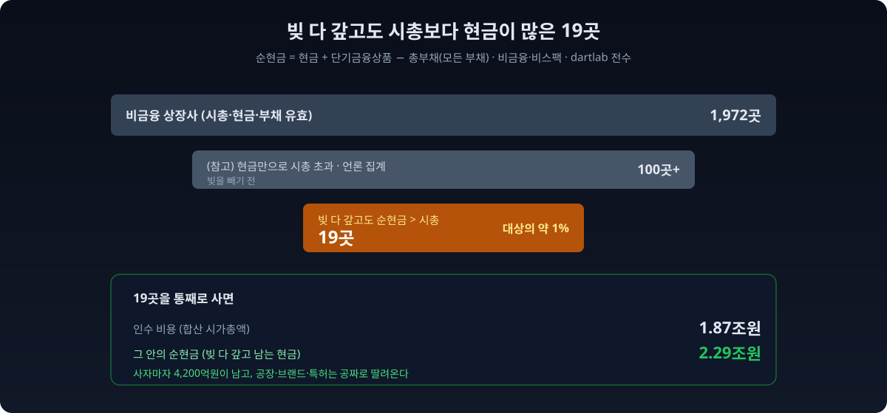
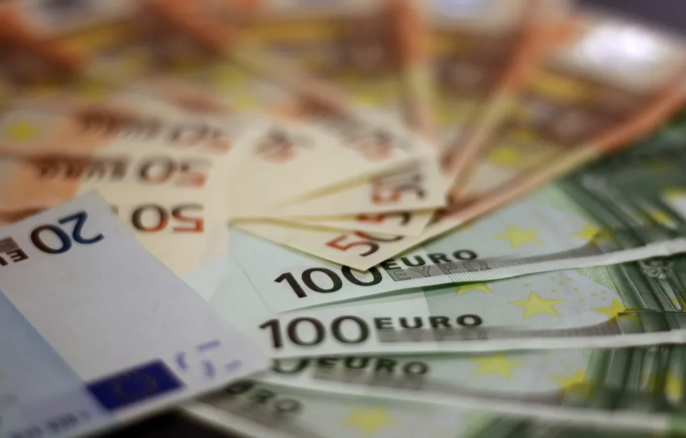
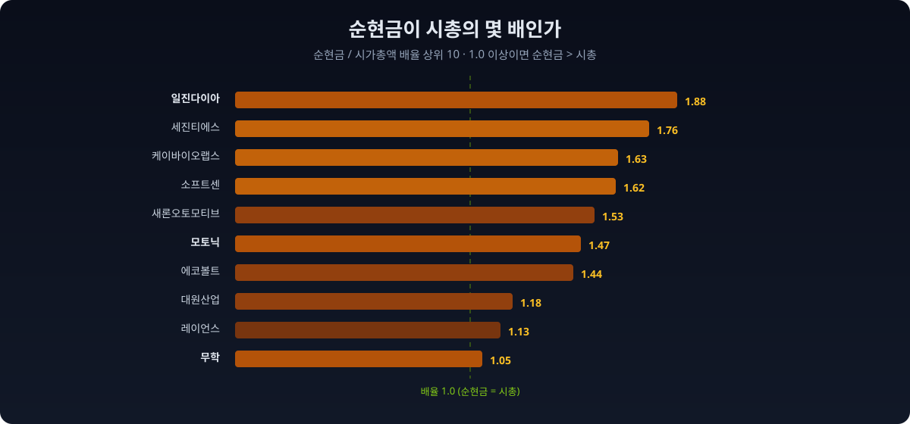
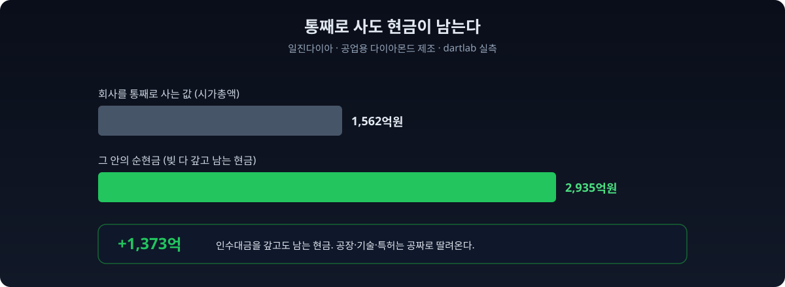
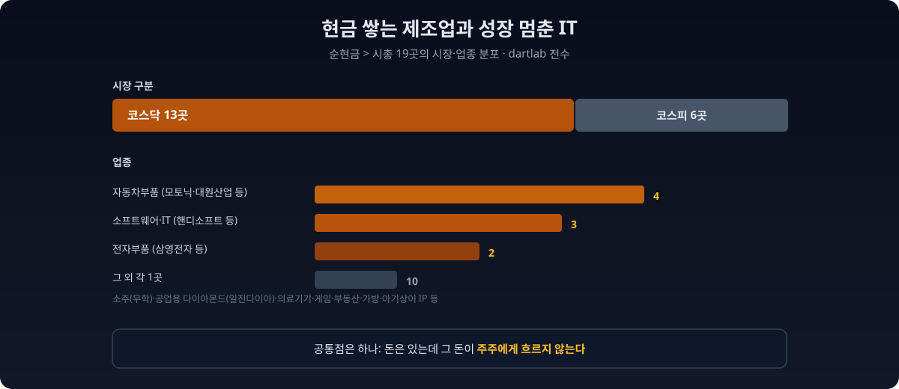

2026년 6월, 한 신문이 이렇게 썼다. [보유 현금이 시가총액보다 많은 상장사가 100곳을 넘어섰다.](https://www.newspim.com/news/view/20260630001084) 회사가 은행에 쌓아둔 현금만으로도 그 회사 주식을 통째로 살 수 있다는 뜻이다. 그런데 이 숫자에는 함정이 하나 있다. **빚을 빼지 않았다.** 현금이 아무리 많아도 그만큼 빚이 있으면 진짜 여유 돈은 없다.

그래서 dartlab으로 다시 셌다. 현금에서 **모든 빚을 갚게** 한 다음, 그래도 남는 순현금이 시가총액보다 많은 곳만 골랐다. 비금융 상장사 **1,972곳 중 단 19곳**이었다. 100곳이 19곳으로 줄었다.

이 19곳은 극단적인 경우다. **회사를 통째로 사서(시가총액), 그 안의 현금으로 모든 빚을 갚아도, 현금이 남는다.** 공장도 브랜드도 특허도 공짜로 얻고, 덤으로 현금까지 받는 셈이다. 코리아 디스카운트라는 말의 가장 날것 그대로의 증거다.



## "순현금 > 시가총액"이 왜 극단적인가

숫자를 세기 전에, 무엇을 세는지부터 맞춰야 한다.

**순현금**은 회사가 가진 현금성 자산에서 빚을 뺀, 진짜 여유 돈이다. 이 글에서는 가장 보수적으로 잡았다. **순현금 = 현금및현금성자산 + 단기금융상품 − 총부채(모든 부채)**. 즉 당장 현금화할 수 있는 자산(현금 + 1년 내 만기 금융상품)만 자산으로 인정하고, 갚아야 할 모든 빚(차입금뿐 아니라 외상값, 미지급금까지)을 다 뺐다.

이 순현금이 **시가총액**(주식 전부의 시장 가격)보다 크다는 건 이런 뜻이다. 회사를 통째로 인수하는 데 드는 돈(시가총액)보다, 인수 직후 회사 금고에서 빼올 수 있는 순현금이 더 많다. 사자마자 본전을 뽑고, 사업은 공짜로 딸려온다.



> **이 리포트가 숫자를 만든 방법 (읽고 넘어가도 되는 방법론)**
>
> - **순현금 = 현금및현금성자산 + 단기금융상품 − 총부채.** 시가총액은 최근 종가 기준, 재무는 최신 정기보고서(2025년) 기준이라 시점이 다르다(스크리닝의 통상 방식).
> - **왜 총부채(모든 부채)를 뺐나.** 차입금만 빼는 게 교과서적 순현금이지만, 개별 차입금 계정(단기차입금, 사채 등)은 회사마다 표기가 달라 한국전력, SK하이닉스 같은 거대 차입 기업조차 0으로 잡히는 구멍이 있다. 그래서 재무제표 맨 아래 줄인 총부채(모든 부채 합계)를 대신 뺐다. 이 값은 전종목에서 안정적으로 잡힌다. 결과적으로 이 글의 순현금은 교과서 순현금보다 더 깐깐하다.
> - **단기금융상품만 자산에 더했다.** 장기금융상품, 투자부동산, 매출채권 같은 다른 자산은 뺐다. 가장 유동적인 것만 인정한 보수적 집계다.
> - **금융업과 스팩(기업인수목적회사)은 제외.** 은행과 증권은 예금이 곧 본업 자산이라 순현금 개념이 안 맞고, 스팩은 상장 자금을 금고에 넣어두는 구조라 자동으로 이 조건에 걸린다. 둘 다 뺐다.
> - **기준 시점** = 데이터 기준 2026-07-04 dartlab.

## 전상장사에 물었다: 19곳

dartlab은 시가총액(`scan("valuation")`)과 재무 계정(`scan("account")`)을 전종목에서 한 번에 읽는다. 현금과 단기금융상품을 더하고 총부채를 뺀 순현금을, 시가총액과 나란히 놓으면 시장 전체가 한 장에 펼쳐진다.

```python
import dartlab
import polars as pl

val = dartlab.scan("valuation")                    # 종목코드, 종목명, 시가총액
def latestBS(target, alias):                       # BS 계정의 최신 분기값
    df = dartlab.scan("account", target)
    qs = [c for c in ["2025Q4","2025Q3","2025Q2","2025Q1"] if c in df.columns]
    return df.with_columns(pl.coalesce([pl.col(q) for q in qs]).alias(alias)).select(["종목코드", alias])

base = val.select(["종목코드","종목명","시가총액"])
base = base.join(latestBS("현금및현금성자산","현금"), on="종목코드", how="left")
base = base.join(latestBS("단기금융상품","단기금융"), on="종목코드", how="left")
debt = dartlab.Company("005930").debt("all").select(["stockCode","총부채"]).rename({"stockCode":"종목코드"})
base = base.join(debt, on="종목코드", how="left")

base = base.with_columns(
    (pl.col("현금").fill_null(0) + pl.col("단기금융").fill_null(0) - pl.col("총부채").fill_null(0)).alias("순현금")
)
# 금융·스팩 제외 후 순현금 > 시총 → 19곳
```

집계 결과를 깔때기로 줄이면 이렇다.

| 구분 | 회사 수 | 비고 |
|---|---:|---|
| 비금융 상장사 (시총·현금·부채 유효) | 1,972 | 집계 대상 |
| (참고) 현금만으로 시총 초과 | 100+ | 언론 집계, 빚 빼기 전 |
| └ **빚 다 갚고도 순현금 > 시총** | **19** | **대상의 약 1%** |
| 코스닥 소속 | 13 | |
| 코스피(유가증권) 소속 | 6 | |

읽는 법은 단순하다. **현금만 보면 100곳이 넘지만, 그 회사에 빚을 다 갚게 시키면 19곳만 남는다.** 나머지는 현금이 많아 보여도 그만큼(혹은 그보다 많이) 빚을 지고 있었다는 뜻이다. 19곳을 다 합치면 **시가총액 1.87조원, 순현금 2.29조원**이다. 19곳을 통째로 사는 데 1.87조가 드는데, 그 안에 든 순현금이 2.29조라, 사자마자 4,200억원이 남는다.

합산도 코드 몇 줄이다. 순현금이 시총보다 큰 곳만 걸러 두 열을 더하면 된다.

```python
# 19곳 합산: 통째로 사는 값(시총) vs 그 안의 순현금
nn = uni.filter(pl.col("순현금") > pl.col("시가총액"))
print(nn.height)                              # 19
print(round(nn["시가총액"].sum() / 1e12, 2))   # 1.87 (조원)
print(round(nn["순현금"].sum()   / 1e12, 2))   # 2.29 (조원)
```

## 이름을 불러도 되는 19곳

19곳은 적은 수라, 전부 이름을 부를 수 있다. 시가총액 순으로 늘어놓으면 이렇다.



| 회사 (업종) | 시가총액 | 순현금 | 배율 |
|---|---:|---:|---:|
| **일진다이아** (공업용 다이아몬드) | 1,562억 | **2,935억** | **1.88** |
| 세진티에스 (전자부품) | 176억 | 331억 | 1.76 |
| 케이바이오랩스 (도매) | 234억 | 380억 | 1.63 |
| 소프트센 (IT서비스) | 191억 | 309억 | 1.62 |
| 새론오토모티브 (자동차부품) | 537억 | 823억 | 1.53 |
| **모토닉** (자동차부품) | 2,186억 | 3,204억 | 1.47 |
| 에코볼트 (자동차부품) | 341억 | 490억 | 1.44 |
| 대원산업 (자동차시트) | 2,034억 | 2,394억 | 1.18 |
| 레이언스 (의료기기) | 1,063억 | 1,201억 | 1.13 |
| 디티씨 (부동산) | 500억 | 559억 | 1.12 |
| 테크엘 (반도체) | 375억 | 409억 | 1.09 |
| 핸디소프트 (소프트웨어) | 384억 | 419억 | 1.09 |
| SYTS (가방) | 1,547억 | 1,671억 | 1.08 |
| **무학** (소주) | 2,123억 | 2,226억 | 1.05 |
| 모비릭스 (게임) | 224억 | 234억 | 1.05 |
| 삼영전자공업 (전자부품) | 2,701억 | 2,787억 | 1.03 |
| 신도기연 (기계) | 306억 | 310억 | 1.01 |
| **더핑크퐁컴퍼니** (아기상어) | 1,665억 | 1,677억 | 1.01 |

표시: 배율 = 순현금 / 시가총액. 1.0 이상이면 순현금이 시총보다 많다는 뜻.

**가장 극단은 일진다이아다.** 일진그룹 계열의 공업용 다이아몬드(PCD) 제조사인데, 현금 270억에 단기금융상품 3,355억을 더하고 총부채 690억을 빼면 순현금이 **2,935억원**이다. 그런데 시가총액은 **1,562억원**. 이 회사를 통째로 사는 데 1,562억이면 되는데, 사자마자 금고에서 2,935억을 빼낼 수 있다. **인수대금을 갚고도 1,373억이 남고, 다이아몬드 공장과 기술은 공짜로 딸려온다.**



**아기상어의 회사도 여기 있다.** 더핑크퐁컴퍼니(옛 스마트스터디)는 전 세계 조회수 최다 영상 '아기상어'의 IP를 가진 회사다. 현금 1,480억 + 단기금융 397억 − 총부채 200억 = 순현금 1,677억. 시가총액 1,665억. 배율 1.01로 아슬아슬하지만, 시장은 아기상어 IP의 값을 사실상 0으로 매기고 있다는 뜻이다. 자산이 이렇게 현금에 쏠려 있는 회사를 읽는 법은 [자산 구조를 읽는 법](/blog/asset-structure-how-to-read)에서 따로 다뤘다.

**소주 회사 무학도 있다.** '좋은데이'로 알려진 경남 소주 1위 무학은 현금 3,585억 − 총부채 1,425억을 반영해 순현금 2,226억, 시가총액 2,123억(배율 1.05). 창원 공장과 소주 브랜드를 공짜로 얻고 103억을 얹어 받는 값이다.

이런 회사를 처음 주목한 건 가치투자의 원조 벤저민 그레이엄이다. 순유동자산보다 싸게 거래되는 주식을 사면 손실 위험이 구조적으로 낮다는 게 그가 말한 '담배꽁초' 투자였다. 문제는 이런 종목이 강세장에서는 거의 사라진다는 점이다. 시장이 웬만한 회사의 미래를 후하게 쳐주기 때문이다. 그런데 한국에서는 밸류업 2년 차, 지수가 오르는 국면에서도 순현금이 시총을 넘는 회사가 19곳이나 남아 있다. 시장이 이 19곳의 사업 가치를 사실상 마이너스로 보고 있다는 뜻이고, 그만큼 코리아 디스카운트가 특정 구석에 깊게 고여 있다는 신호다. 미국이나 유럽 증시에서 우량 제조사가 순현금 밑에서 거래되는 일은 좀처럼 없다.

## 두 얼굴: 현금 쌓는 오너 vs 성장 멈춘 캐시카우

19곳을 업종으로 보면 두 부류가 겹친다.



한쪽은 **자동차부품(4곳)** 과 **소주, 전자부품** 같은 전통 제조업이다. 모토닉, 대원산업, 새론오토모티브, 에코볼트가 자동차부품이고 무학이 소주다. 이들은 수십 년간 꾸준히 벌어 현금을 금고에 쌓아왔지만, 배당이나 자사주로 주주에게 크게 돌려주지 않았다. 오너 지분이 높은 곳이 많아, 현금을 나눠줄 유인도 압박도 약했다.

자동차부품이 4곳이나 되는 건 우연이 아니다. 이들은 대개 완성차에 부품을 대는 협력사다. 매출은 완성차 판매에 묶여 크게 늘지 않지만, 오랜 거래로 이익은 안정적이라 현금이 또박또박 쌓인다. 성장은 정체돼 시장이 미래 가치를 낮게 매기는데, 현금은 계속 불어나니 순현금이 시총을 넘어서는 구조가 만들어진다. 성장이 멈춘 알짜 회사가 배당에 인색하면 이 명단에 들어온다. 지배구조가 저평가의 진짜 원인이라는 지적, 예컨대 [주가순자산비율 0.23배까지 떨어진 대한제분이 뒤늦게 자사주 소각 카드를 꺼낸 사례](https://www.huffingtonpost.kr/article/258220)가 겨누는 지점도 여기다.

다른 한쪽은 **소프트웨어와 IT(3곳)** 다. 핸디소프트, 모비릭스, 소프트센 같은 회사는 한때 성장주로 주목받았지만, 성장이 멈추면서 시장이 미래 가치를 거의 매기지 않게 됐다. 남은 건 과거에 벌어둔 현금뿐이고, 그 현금이 시총을 넘어선다.

물론 싸다고 다 기회는 아니다. 성장이 멈춘 캐시카우는 '가치 함정'이 되기 쉽다. 현금이 많아도 그 현금이 새 사업으로도, 주주 배당으로도 가지 않고 금고에만 잠겨 있으면, 주가는 순현금 밑에서 몇 년이고 머문다. 시장이 낮게 매기는 건 종종 '이 회사는 이 현금을 영영 안 나눠줄 것'이라는 학습된 예상이다. 그 예상이 깨지는 방아쇠, 즉 배당 확대나 자사주 소각, 행동주의 펀드의 등장 같은 계기가 없으면 저평가는 저평가인 채로 굳는다. 그래서 이 명단은 '싼 주식 목록'이 아니라, 현금이 주주에게 흐르는지를 지켜볼 관찰 대상 목록에 가깝다.

**두 부류의 공통점은 하나다. 돈은 있는데, 그 돈이 주주 것이 아니다.** 현금이 회사 금고에 잠겨만 있고 배당이나 자사주 소각으로 나오지 않으면, 시장은 그 현금을 주주 몫으로 쳐주지 않는다. [자사주를 사고도 소각하지 않는 상장사](/blog/treasury-stock-not-cancelled)를 짚은 리포트에서 봤던 그 구조가, 여기서는 더 극단으로 나타난다. 주주환원에서 진짜 봐야 할 게 무엇인지는 [주주환원, 무엇을 봐야 하나](/blog/shareholder-return-what-matters)에서 정리했다.

## 왜 이 숫자를 봐야 하나

현금이 시총보다 많은데도 주가가 안 오르는 것, 이게 코리아 디스카운트의 핵심이다. [OECD는 한국의 저평가 기업(주가순자산비율 1배 미만이면서 수익성·배당 여력이 있는 곳)을 193곳으로 집계](https://www.nvp.co.kr/news/articleView.html?idxno=318538)했다. 홍콩 108곳, 일본 78곳을 크게 웃돈다. 밸류업 프로그램 2년 차에 [주주환원 규모가 92조원을 넘고 공시 참여가 718개사로 늘었지만](https://www.fnnews.com/news/202605271152562236), 이 19곳 같은 현금부자 저평가주는 여전히 [밸류업의 사각지대](https://www.newspim.com/news/view/20260630001084)에 남아 있다.


이유는 분명하다. 밸류업이 상장사에 배당과 자사주 소각을 요구하고, 2026년 개정 상법이 자사주를 1년 안에 소각하라고 압박해도, 정작 **현금을 쥐고도 안 나눠주는 회사는 그 압박의 바깥에 있다.** OECD도 배당·자사주만으로는 부족하고 지배구조 개선과 자본 배분이 함께 가야 한다고 지적했다. 이 19곳이 쌓아둔 현금이 주주에게 흐르기 시작하느냐가, 코리아 디스카운트가 진짜 풀리는지의 시금석이다.

시장의 반대편 끝에는 [3년 내리 이자도 못 갚는 좀비기업 713곳](/blog/interest-coverage-zombie-firms)이 있다. 한쪽은 빚에 눌려 이자도 못 벌고, 다른 한쪽은 현금을 쌓아두고 안 나눠준다. 코리아 디스카운트는 이 양극단이 함께 만든다.

일본은 앞서 이 길을 걸었다. 도쿄증권거래소가 2023년 주가순자산비율 1배 미만 기업에 개선 계획을 요구하자, 현금을 쌓아두던 회사들이 자사주 소각과 배당으로 방향을 틀었고 저평가주가 대거 재평가됐다. 한국의 밸류업은 그 벤치마크를 따라 시작됐지만, 아직 이 19곳 같은 소형 현금부자까지는 손이 잘 닿지 않았다. 대형주 위주로 주주환원이 늘어나는 동안, 시가총액 수백억짜리 현금부자는 관심 밖에 머물러 있다.

2026년 개정 상법이 이사에게 회사가 아니라 주주 전체에 대한 충실의무를 지운 것도 같은 맥락이다. 이사가 별다른 계획 없이 유휴 현금을 금고에 방치하는 것 자체가, 이론적으로는 주주 이익을 해치는 판단으로 다뤄질 여지가 생겼다. 물론 법이 곧바로 배당을 강제하지는 않는다. 다만 "왜 이 현금을 나눠주지 않는가"라는 질문에 회사가 답해야 하는 시대가 됐다는 점은 분명하다. 이 19곳은 그 질문이 가장 날카롭게 꽂히는 명단이다.

## 이렇게 읽으면 안 된다

데이터는 한 방향으로만 읽으면 위험하다. 이 집계가 **말하지 않는 것**을 분명히 해둔다.

- **"순현금 > 시총 = 무조건 저평가 = 사라"가 아니다.** 시장이 그 값을 낮게 매기는 데는 이유가 있을 수 있다. 성장이 멈췄거나, 현금을 영영 안 나눠주거나, 오너가 소액주주를 무시하는 지배구조이거나. 싼 데는 싼 이유가 있을 수 있고, 이 글은 매수를 권하지 않는다.
- **배율 1.0 근처는 경계선이다.** 더핑크퐁(1.01), 신도기연(1.01), 삼영전자(1.03), 무학(1.05)은 주가가 조금 오르거나 다음 분기 재무가 바뀌면 명단에서 빠진다. 19라는 숫자는 이 시점의 스냅샷이다.
- **총부채를 다 뺀 보수적 집계다.** 총부채에는 당장 갚을 필요가 낮은 영업부채(외상값 등)도 들어 있어, 실제보다 순현금을 낮게 잡았다. 교과서식 순현금(차입금만 차감)으로 보면 해당 기업은 더 많다.
- **현금엔 쓸 곳이 있을 수 있다.** 대규모 투자나 인수를 앞두고 쌓아둔 현금일 수도 있다. 금고에 잠긴 돈이라고 단정하지 않는다. 현금이 실제로 어떻게 드나드는지는 [현금흐름표 읽는 법](/blog/cashflow-how-to-read)에서 짚었다.
- **소형주가 대부분이다.** 19곳 다수가 시총 수백억 규모라 거래량이 적다. 숫자가 싸 보여도 실제로 사고팔기 어렵거나 주가가 그 값을 오래 무시할 수 있다. 그나마 큰 삼영전자공업(2,700억)이나 무학(2,100억)조차 대형주 기준으로는 소형에 속한다.

이 글의 결론은 "이 19곳을 사라"가 아니다. **"현금만 보면 100곳이 넘지만, 빚을 다 갚게 하면 19곳만 남고, 그 19곳조차 시장은 현금값도 안 쳐준다"** 는 것. 코리아 디스카운트가 숫자 하나로 어떻게 생겼는지를 전상장사 공시에서 직접 세어 확인했다.

앞으로 봐야 할 건 이 명단의 변화다. 다음 분기에 이 19곳 중 몇 곳이 배당을 늘리거나 자사주를 소각하는지, 그리고 명단이 19곳에서 줄어드는지가, 밸류업이 대형주를 넘어 시장 구석까지 닿았는지를 보여주는 온도계가 된다. 숫자가 줄면 잠겨 있던 현금이 주주에게 흐르기 시작했다는 뜻이고, 그대로 19곳에 머물면 코리아 디스카운트는 여전히 그 자리에 고여 있다는 뜻이다. 같은 코드를 분기마다 다시 돌리면 그 온도를 직접 잴 수 있다.

## 직접 확인해보라

이 글의 모든 숫자는 누구나 재현할 수 있다. dartlab을 설치하고 아래 몇 줄이면 같은 19가 나온다.

```python
import dartlab
import polars as pl

val = dartlab.scan("valuation").select(["종목코드","종목명","시가총액"])
def latestBS(t, a):
    df = dartlab.scan("account", t)
    qs = [c for c in ["2025Q4","2025Q3","2025Q2","2025Q1"] if c in df.columns]
    return df.with_columns(pl.coalesce([pl.col(q) for q in qs]).alias(a)).select(["종목코드", a])

L = dartlab.listing().select(["종목코드","업종","회사명"])
d = (val.join(latestBS("현금및현금성자산","현금"), on="종목코드", how="left")
        .join(latestBS("단기금융상품","단기금융"), on="종목코드", how="left")
        .join(dartlab.Company("005930").debt("all").select(["stockCode","총부채"]).rename({"stockCode":"종목코드"}), on="종목코드", how="left")
        .join(L, on="종목코드", how="left"))
d = d.with_columns((pl.col("현금").fill_null(0)+pl.col("단기금융").fill_null(0)-pl.col("총부채").fill_null(0)).alias("순현금"))

FIN = r"금융|은행|보험|증권|신탁|여신|카드|캐피탈|자산운용|저축|기타 금융|금융 지원"
spac = pl.col("회사명").fill_null("").str.contains("스팩|기업인수목적")
uni = d.filter((pl.col("시가총액")>0) & pl.col("현금").is_not_null() & ~pl.col("업종").fill_null("").str.contains(FIN) & ~spac)
print(uni.filter(pl.col("순현금") > pl.col("시가총액")).height)   # 19
```

검증 가능하지 않은 숫자는 신뢰할 이유가 없다. dartlab의 모든 집계는 공시 데이터에서 직접 나오고, 코드가 곧 방법론이다.

## 검증표

본문의 모든 강한 수치와 dartlab 호출을 대응시킨다. 이 표에 없는 숫자는 본문에 싣지 않았다.

| 본문 수치 | 산출 방법 | 결과 |
|---|---|---|
| 순현금 > 시총 19곳 | `scan("valuation")` 시총 vs `현금+단기금융−총부채` | 19 |
| 비금융·비스팩 유니버스 1,972곳 | listing 업종 필터 | 1,972 |
| 코스닥 13 · 코스피 6 | `listing()` 시장구분 | 13 / 6 |
| 19곳 합산 시총 1.87조 · 순현금 2.29조 | 합계 | 1.87 / 2.29 |
| 일진다이아 순현금 2,935억 · 시총 1,562억 | `scan` 081000 | 실측 |
| 무학 순현금 2,226억 · 시총 2,123억 | `scan` 033920 | 실측 |
| 더핑크퐁 순현금 1,677억 · 시총 1,665억 | `scan` 403850 | 실측 |
| 총부채 검증: 한국전력 206조 · SK하이닉스 58조 | `debt("all")` 총부채 | 실측 |
| 현금만으로 시총 초과 100곳+ | 뉴스핌(2026.6) | 외부 인용 |
| OECD 저평가 193곳 · 밸류업 주주환원 92조 | OECD · 파이낸셜뉴스 | 외부 인용 |

> **방법론** 데이터 출처: KRX 시가총액(`scan valuation`) + DART 정기보고서(현금및현금성자산·단기금융상품·총부채) + KRX 상장 분류(`listing`). 집계 단위: 비금융·비스팩 상장사 1,972곳, 최신 정기보고서(2025년) 기준. 순현금 = 현금및현금성자산 + 단기금융상품 − 총부채. 재현: `dartlab.scan(...)`. 데이터 기준 2026-07-04.
>
> 본 글은 공시 데이터에 기반한 정보 제공이며, 특정 종목의 매수·매도를 권유하지 않는다.
