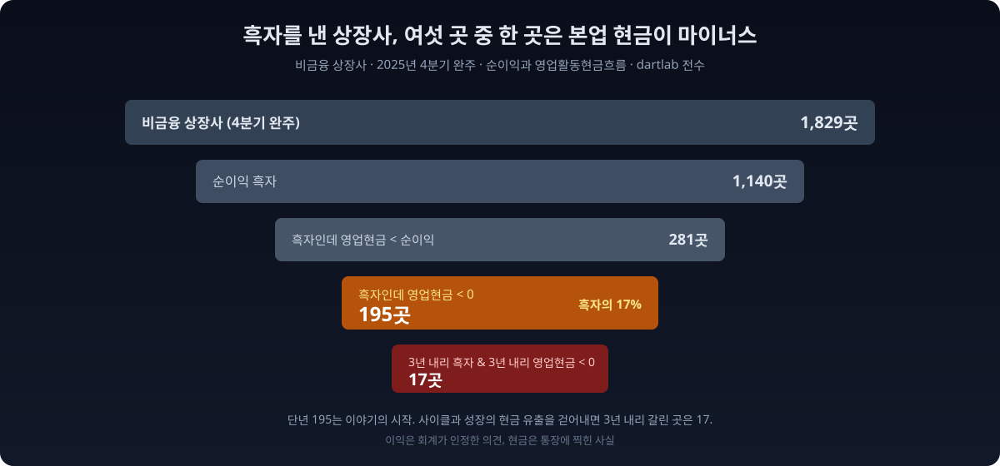
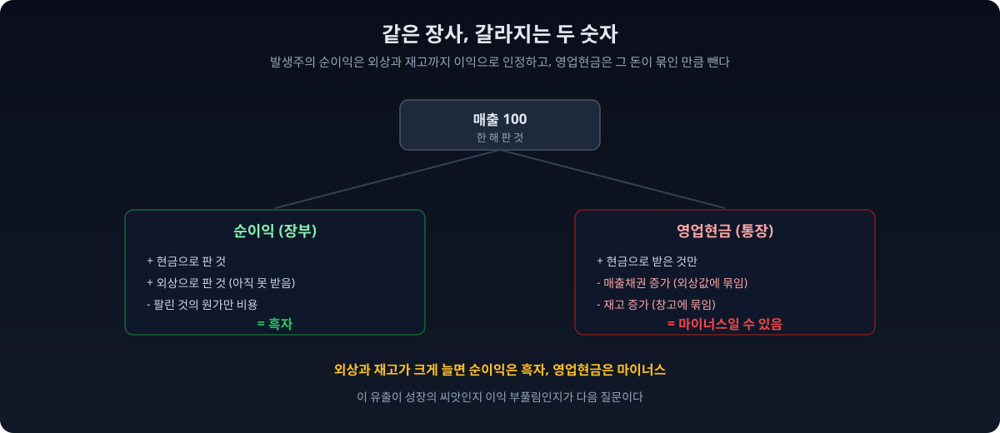
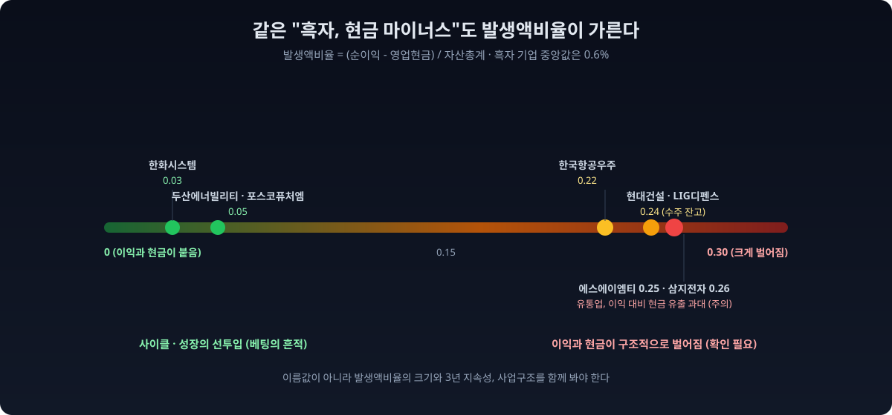
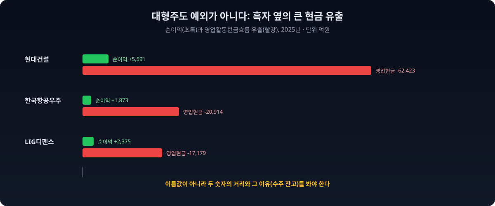

당신이 "이 회사 작년에 흑자 냈대"라는 말만 믿고 산 종목이 있다고 하자. 그 흑자는 통장에 찍힌 돈일까, 아니면 장부에만 적힌 숫자일까. 둘은 자주 다르다. **순이익은 발생주의 회계로 계산한 '벌었다고 인정한' 숫자**이고, **영업활동현금흐름은 그해 본업에서 실제로 들어오고 나간 현금**이다. 물건을 외상으로 팔면 매출과 이익에는 잡히지만 통장에는 아직 한 푼도 없다. 재고를 잔뜩 만들어 창고에 넣어두면, 그 돈은 나갔는데 손익계산서에는 비용으로 잡히지 않는다.

그래서 dartlab으로 물었다. 흑자를 낸 상장사들은 그해 본업으로 현금도 같이 벌었을까, 아니면 장부만 흑자였을까. 최근 회계연도(2025년)에 네 개 분기를 모두 보고한 **비금융 상장사 1,829곳**을 전수로 집계했다. 그중 순이익이 흑자였던 곳은 **1,140곳**. 그런데 이 흑자 기업 중 **195곳**은 그해 영업활동현금흐름이 마이너스였다. **흑자를 낸 여섯 곳 중 한 곳꼴로, 본업에서 현금을 벌기는커녕 오히려 현금이 빠져나갔다.**



이 195라는 숫자는 이야기의 출발점이지 결론이 아니다. 뒤에서 보겠지만 단년 마이너스의 상당수는 위험 신호가 아니라 성장과 사이클의 흔적이다. 조선소가 배를 짓는 동안, 방산업체가 무기를 납품하기 전까지, 배터리 회사가 새 공장을 돌리기 전까지는, 흑자를 내면서도 현금은 얼마든지 빠져나갈 수 있다. 진짜 위험을 가려내려면 한 해가 아니라 3년을 보고, 이익과 현금이 벌어진 폭(발생액)을 재야 한다. 이 글은 그 정제 과정을 숨기지 않고 그대로 보여준다. 숫자 하나를 던지고 끝내는 게 아니라, 그 숫자를 어떻게 걸러 읽는지가 데이터 리포트의 본론이기 때문이다.

## 이익은 의견, 현금은 사실

숫자를 세기 전에 두 숫자가 왜 갈리는지부터 맞춰야 한다. 회계를 처음 보는 사람도 이 한 문단만 이해하면 나머지는 쉽다.

**순이익**은 손익계산서 맨 아랫줄이다. 발생주의 회계는 "돈을 받았느냐"가 아니라 "벌었다고 볼 수 있느냐"로 수익을 인식한다. 12월에 100억어치를 외상으로 팔면, 현금은 내년 3월에 들어와도 그 매출과 이익은 올해 것으로 잡힌다. 반대로 재고를 만들어 창고에 쌓아두면, 그 원가는 실제로 팔리기 전까지 비용이 아니라 자산(재고자산)이라 이익을 깎지 않는다. 그래서 순이익은 "이 정도 벌었다고 회계가 인정해준 숫자"에 가깝다. 회사의 판단과 추정이 개입할 여지가 있다는 뜻이기도 하다.

**영업활동현금흐름**은 현금흐름표의 첫 덩어리다. 그해 본업에서 실제로 통장에 들어오고 나간 현금만 센다. 외상값(매출채권)이 한 해 동안 불어나면, 그만큼 매출은 잡혔지만 현금은 아직 안 들어온 것이라 빼준다. 재고가 쌓이면 그 돈은 창고에 묶인 것이라 빼준다. 그래서 영업현금은 추정이 끼어들 여지가 거의 없는, 통장에 찍힌 사실에 가깝다. [영업이익은 엄청난데 현금흐름은 마이너스인 회사](https://www.ttimes.co.kr/article/2020051915097725574)를 굳이 따로 읽어야 하는 이유가 여기 있다.



그래서 순이익이 흑자인데 영업현금이 마이너스라는 건, **장부로는 벌었는데 그 벌이가 아직(혹은 영영) 현금이 되지 못했다**는 뜻이다. 이 간극이 벌어질수록 이익의 질은 나빠진다. 회계 교과서가 [순이익과 현금흐름을 함께 읽으라](https://brunch.co.kr/@jongsiksong/5)고 반복해 강조하는 것도, [현금흐름표만 봐도 망하는 회사와 성장하는 회사가 갈리기](https://www.ttimes.co.kr/article/2020041417467778814) 때문이다. 순이익 한 줄만 보고 투자하면, 회사가 보여주고 싶은 얼굴만 보게 된다.

숫자로 한번 걸어보자. 어떤 회사가 한 해 동안 1,000억을 팔았는데 그중 800억이 외상이라고 하자. 원가와 비용을 빼고 남은 이익이 100억이면, 손익계산서에는 또렷하게 "순이익 100억, 흑자"라고 찍힌다. 그런데 통장을 보면, 실제로 들어온 현금은 200억뿐이고 800억은 아직 받지 못한 외상값으로 남아 있다. 여기에 내년 주문에 대비해 재고를 300억어치 더 만들어두었다면, 그 300억은 이미 원재료와 인건비로 나가버렸다. 결과적으로 이 회사는 흑자 100억을 냈지만 본업에서 현금은 오히려 크게 빠져나간 상태가 된다. 손익계산서만 보면 성공한 한 해이고, 현금흐름표를 보면 위태로운 한 해다. 같은 회사, 같은 일 년인데 두 장부가 정반대 이야기를 한다.

## 흑자도산은 남의 일이 아니었다

이 간극이 극단으로 벌어지면 [흑자도산](https://www.asiae.co.kr/article/2019081614510746893)이 된다. 이익을 내면서도 당장 결제할 현금이 없어 부도가 나는 것이다. 한국에서 흑자도산은 교과서 속 개념이 아니라 실제로 반복돼온 사건이다. 건설사가 대표적이었다. 공사는 수주해서 장부상 매출과 이익을 쌓는데, 미분양이 늘고 공사 대금 회수가 막히면 현금이 돌지 않아 흑자인 채로 무너졌다. 조선사도, 무리하게 외형을 키운 중견 제조사도 같은 길을 걸었다. 공통점은 하나였다. 무너지기 직전 해까지 손익계산서는 멀쩡한 흑자였다는 것이다.

[스타트업이 흑자도산에 특히 취약한 이유](https://www.psnews.co.kr/news/articleView.html?idxno=2023232)도 같다. 빠르게 성장하며 매출을 외상으로 늘리고 재고와 설비를 미리 확충하면, 장부 이익과 통장 잔고의 거리가 급격히 벌어진다. 그 거리를 차입이나 투자 유치로 메우는 동안은 괜찮지만, 자금 조달이 막히는 순간 흑자인 채로 현금이 마른다. 그래서 노련한 투자자와 대주는 손익계산서보다 현금흐름표를 먼저 편다. 이익은 회사가 만드는 이야기이고, 현금은 그 이야기가 진짜인지 판별하는 증거이기 때문이다.

물론 이 글의 195곳이 전부 흑자도산 위기라는 뜻은 절대 아니다. 오히려 대부분은 멀쩡하다. 다만, 흑자라는 단어 뒤에 숨은 현금의 실제 움직임을 보지 않으면, 가장 위험한 신호를 가장 늦게 알게 된다는 것이다. 그래서 우리는 195곳을 그냥 세는 데서 멈추지 않고, 어느 유출이 성장이고 어느 유출이 경고인지 끝까지 갈라본다.

> **이 리포트가 숫자를 만든 방법 (읽고 넘어가도 되는 방법론)**
>
> - **표본** = 최근 회계연도(2025년)에 1~4분기 재무제표를 모두 보고한 비금융 상장사 1,829곳. 금융업(은행, 보험, 증권)과 지주회사는 영업현금흐름의 정의가 달라 제외했다.
> - **연간값** = 각 계정의 4개 분기 값을 더해 만들었다. 삼성전자를 2024년으로 검산했을 때 순이익 34.45조가 공시 연간치와 정확히 일치해, 이 합산 방식이 맞음을 확인했다.
> - **핵심 조건** = 순이익이 흑자이면서 영업활동현금흐름이 마이너스.
> - **발생액비율** = (순이익 − 영업활동현금흐름) ÷ 자산총계. 이익과 현금이 벌어진 폭을 회사 규모로 나눈 값이다. 클수록 장부이익이 현금과 멀리 떨어져 있다는 뜻이고, 학계에서는 이 값이 높을수록 이후 수익성이 나빠지는 경향(발생액 이상현상, accrual anomaly)이 알려져 있다.
> - **기준 시점** = 데이터 기준 2026-07-05 dartlab. 시가총액은 최근 종가 기준.

## 전상장사에 물었다: 195곳

dartlab은 손익계산서의 당기순이익과 현금흐름표의 영업활동현금흐름을 전종목에서 한 번에 읽는다. 두 계정을 나란히 놓으면 흑자와 현금이 갈리는 지점이 시장 전체에 걸쳐 한 장에 드러난다. 언론이 한두 회사의 사례로 다루는 이야기를, 우리는 상장사 전부에 대고 세어보는 것이다.

```python
import dartlab
import polars as pl

def annual(label, year):                       # 4개 분기 합 = 연간 (전 분기 완주만)
    df = dartlab.scan("account", label)
    qs = [f"{year}Q{q}" for q in range(1, 5)]
    ok = pl.all_horizontal([pl.col(q).is_not_null() for q in qs])
    tot = pl.sum_horizontal([pl.col(q) for q in qs])
    return df.with_columns(pl.when(ok).then(tot).otherwise(None).alias("v")).select(["종목코드", "v"])

ni  = annual("당기순이익", 2025).rename({"v": "순이익"})
ocf = annual("영업활동현금흐름", 2025).rename({"v": "영업현금"})
L = dartlab.listing().select(["종목코드", "업종"])
FIN = r"금융|은행|보험|증권|신탁|여신|카드|캐피탈|자산운용|저축|지주"

d = ni.join(ocf, on="종목코드").join(L, on="종목코드", how="left")
d = d.filter(pl.col("순이익").is_not_null() & pl.col("영업현금").is_not_null()
             & ~pl.col("업종").fill_null("").str.contains(FIN))
print(d.filter(pl.col("순이익") > 0).height)                              # 1140 흑자
print(d.filter((pl.col("순이익") > 0) & (pl.col("영업현금") < 0)).height)  # 195
```

집계를 깔때기로 줄이면 이렇다.

| 구분 | 회사 수 | 비고 |
|---|---:|---|
| 비금융 상장사 (2025년 4분기 완주) | 1,829 | 집계 대상 |
| 순이익 흑자 | 1,140 | 흑자 기업 |
| └ 흑자인데 영업현금이 순이익 미만 | 281 | 벌이가 현금을 다 못 따라옴 |
| └ **흑자인데 영업현금이 마이너스** | **195** | **흑자의 17%, 약 6곳 중 1곳** |
| └└ 3년 내리 흑자이면서 3년 내리 영업현금이 마이너스 | 17 | 단년 노이즈 제거 |

읽는 법은 단순하다. **작년에 흑자를 낸 상장사 여섯 곳 중 한 곳은, 그해 본업으로 현금을 벌기는커녕 오히려 현금이 빠져나갔다.** 조건을 조금 느슨하게 잡아 "영업현금이 순이익에 못 미친 곳"까지 넓히면 281곳, 흑자 기업의 4분의 1이다. 다시 말해 흑자 기업 넷 중 하나는 장부에 적힌 이익만큼 현금을 벌지 못했다. 흔히 "흑자면 됐지"라고 넘기는 그 흑자가, 실제로는 절반만 현금인 경우가 이렇게 흔하다.

이 숫자가 놀라운 건 대상이 코스닥의 이름 없는 소형사가 아니라 상장사 전체라는 점이다. 상장사는 감사를 받고 분기마다 공시하는, 한국에서 가장 투명하게 관리되는 기업 집단이다. 그런 회사들 사이에서도 흑자와 현금이 갈리는 일이 여섯 곳 중 한 곳꼴로 나타난다. 뒤집어 말하면, 뉴스에서 "사상 최대 흑자"라는 헤드라인을 볼 때 그 흑자가 통장에 실제로 들어온 돈인지 아닌지는 헤드라인만으로는 알 수 없고, 현금흐름표를 따로 펴봐야만 알 수 있다는 뜻이다. 그리고 그 확인은 어렵지 않다. 회사가 분기마다 반드시 공시하는 숫자이기 때문이다.

## 왜 흑자에 현금이 안 들어오나

현금이 빠져나가는 통로는 대개 둘이다. **매출채권**과 **재고자산**이다. 둘 다 재무상태표의 자산 항목이라 회사가 커 보이게 만들지만, 정작 통장의 현금은 거기 묶여 나오지 못한다.

매출을 외상으로 크게 늘리면, 순이익에는 그 매출이 다 잡히지만 현금은 아직 받지 못한 외상값에 묶인다. 회사가 성장할 때 특히 심하다. 매출이 30% 늘면 매출채권도 대략 그만큼 늘고, 그 증가분은 고스란히 영업현금에서 빠진다. 수요가 폭발해 재고를 미리 잔뜩 만들어두는 경우도 마찬가지다. 그 원가는 팔리기 전까지 비용이 아니라 재고자산이라 이익을 깎지 않지만, 현금은 이미 원재료와 인건비로 나가버렸다. 두 경우 모두 순이익은 멀쩡한 흑자인데 영업현금은 마이너스가 된다. [매출이 늘어도 위험할 수 있는 이유](/blog/why-rising-sales-can-still-be-risky)를 짚은 글에서 봤듯, 늘어난 매출이 현금이 아니라 외상으로 쌓이면 그 성장은 아직 절반만 진짜다. [매출채권과 대손충당금을 어떻게 읽는지](/blog/receivables-and-allowance)가 이익의 질을 가르는 첫 관문인 이유다.

여기서 한 겹 더 들어가면, 이익 자체를 부풀리는 회계적 장치도 이 통로에 얹힌다. 매출채권 중 못 받을 것으로 보이는 금액은 대손충당금으로 미리 비용 처리해야 하는데, 이 충당금을 적게 잡으면 이익은 그만큼 커진다. 하지만 현금은 어차피 안 들어오므로 영업현금과의 간극은 더 벌어진다. 재고도 마찬가지다. 팔릴 가능성이 낮아진 재고는 평가손실로 깎아야 하는데, 이를 미루면 자산과 이익이 부풀려진 채로 남는다. 그래서 이익과 현금이 오래, 크게 벌어진 회사는 매출채권과 재고라는 두 계정을 회사가 후하게 평가하고 있는 건 아닌지 의심해볼 이유가 생긴다. 반대로 두 숫자가 붙어 있는 회사는 그런 재량이 개입할 여지가 애초에 작다는 뜻이다.

이 문제는 고금리 국면에서 특히 날카로워진다. 현금이 매출채권과 재고에 묶여 있는 동안에도 회사는 그 자금을 어디선가 조달해야 하고, 금리가 높으면 그 조달 비용이 이익을 갉아먹는다. 저금리 시절에는 흑자와 현금의 간극을 값싼 빚으로 메우며 버틸 수 있었지만, 금리가 오른 뒤로는 같은 간극이 훨씬 더 아프다. 이익은 나는데 현금이 안 도는 회사가 지금 더 눈여겨봐야 할 대상이 된 이유다.

여기서 결정적인 갈림길이 생긴다. **같은 현금 유출이라도 방향이 정반대**다. 수주가 밀려들어 미리 설비와 재고를 확충하느라 현금이 나간 것이라면, 그 유출은 미래 매출의 씨앗이다. 좋은 유출이다. 반대로 팔리지도 않는 재고가 쌓이고 못 받는 외상만 늘어 현금이 나간 것이라면, 그 유출은 이익이 부풀려졌다는 경고다. 나쁜 유출이다. 겉으로 드러난 숫자는 둘 다 똑같이 "흑자, 영업현금 마이너스"다. 손익계산서와 현금흐름표의 첫 줄만 봐서는 구분되지 않는다. 이 둘을 가르는 게 이 리포트의 진짜 본론이다.

## 단년의 함정: 195를 어떻게 정제했나

195라는 숫자를 그대로 "위험한 회사 195곳"으로 읽으면 틀린다. 단년 영업현금 마이너스에는 사이클과 성장의 정상적인 현금 유출이 잔뜩 섞여 있기 때문이다. 데이터 리포트가 큰 숫자 하나를 던지고 끝내지 않는 이유가 이것이다. 정제하지 않은 숫자는 오해를 부른다.



정제는 두 단계다.

**첫째, 3년을 본다.** 한 해만 마이너스인 건 사이클일 수 있으니, 2023년부터 2025년까지 3년 내리 흑자를 내면서 3년 내리 영업현금이 마이너스였던 곳만 남긴다. 195곳이 **17곳**으로 줄었다. 3년 연속 영업현금이 순이익에 못 미친 곳까지 넓혀도 **29곳**이다. 사이클 한 바퀴로는 설명되지 않는, 구조적으로 이익과 현금이 벌어진 회사들이다. 한 해는 우연이지만 세 해 연속은 구조다.

**둘째, 발생액비율로 폭을 잰다.** (순이익 − 영업현금)을 자산총계로 나눈 값이다. 전체 흑자 기업의 이 값은 중앙값이 0.6%에 불과하다. 즉 대부분의 회사는 이익과 현금이 거의 붙어 있다. 이 값이 크다는 건 장부이익이 현금에서 멀리 떨어져 있다는 뜻이고, 미국의 회계학자 리처드 슬론이 1996년에 밝혀낸 뒤로 널리 알려진 사실은, 이 발생액이 큰 회사일수록 다음 해 수익성이 나빠지는 경향이 있다는 것이다. 시장이 이익 숫자에 속아 잠깐 후하게 매기지만, 결국 현금이 진실을 드러낸다.

두 잣대를 대면 같은 "흑자, 현금 마이너스"가 두 부류로 갈린다.

| 회사 (업종) | 순이익 | 영업현금 | 발생액비율 | 읽는 법 |
|---|---:|---:|---:|---|
| 두산에너빌리티 (발전설비) | 2,052억 | −1조 500억 | **0.05** | 대형 프로젝트 운전자본, 사이클형 |
| 한화시스템 (방산) | 2,092억 | −986억 | **0.03** | 방산 수주 선투입, 사이클형 |
| 포스코퓨처엠 (배터리소재) | 365억 | −4,092억 | **0.05** | 증설 국면, 사이클형 |
| 에스에이엠티 (반도체유통) | 758억 | −2,666억 | **0.25** | 유통인데 현금이 계속 샌다, 주의 |
| 삼지전자 (전자유통) | 1,183억 | −3,499억 | **0.26** | 이익 대비 현금 유출 과대, 주의 |

표시: 발생액비율 = (순이익 − 영업현금) ÷ 자산총계. 낮을수록 이익과 현금이 붙어 있고, 높을수록 벌어져 있다.

**두산에너빌리티는 순이익의 다섯 배가 넘는 현금이 빠져나갔지만 발생액비율은 0.05에 그친다.** 회사 덩치(자산총계)에 견주면 이 유출은 작고, 원자력과 대형 발전설비라는 긴 사이클 사업에서 수주분을 미리 만드느라 묶인 현금이다. 몇 년 뒤 준공 대금이 들어오면 이 현금은 되돌아온다. 한화시스템, 포스코퓨처엠도 같은 결이다. 방산 수주와 배터리 소재 증설이라는, 미래 매출을 위한 선투입이다. 이건 부실이 아니라 **베팅의 흔적**이다. 오히려 수주가 늘고 있다는 방증일 수 있다.

반대로 에스에이엠티나 삼지전자처럼 유통이 본업인 회사가 이익 대비 현금이 크게 새면 결이 다르다. 물건을 떼다 파는 사업은 원래 현금 회전이 빨라야 정상인데, 이익은 나는데 현금이 계속 빠진다면 외상과 재고가 어디서 얼마나 묶이는지 따로 들여다봐야 한다. 에스에이엠티는 순이익 758억인데 영업현금이 −2,666억으로 이익의 세 배 넘게 빠졌고, 발생액비율도 0.25로 사이클형 대형주(0.03~0.05)의 다섯 배다. 유통업에서 이 정도 괴리는 순이익 숫자 하나만 보고 "흑자니까 안심"이라고 판단하면 안 된다는 신호다. (반대로 발생액비율이 극단적으로 튀는 종목은 데이터 자체를 의심해야 한다. 예컨대 위성 제조사 쎄트렉아이는 대형 프로젝트 계약자산의 회계 처리 때문에 영업현금 유출이 연매출을 웃돌 만큼 잡히는데, 이런 초장기 수주 회사는 발생액비율만으로 재단하면 오히려 오독한다.)

## 대형주도 예외가 아니다

시가총액 상위 흑자 기업 중에도 영업현금이 마이너스인 곳이 즐비하다. 현대건설(순이익 5,591억, 영업현금 −6.2조), 한국항공우주(순이익 1,873억, 영업현금 −2.09조), LIG디펜스앤에어로스페이스(옛 LIG넥스원, 순이익 2,375억, 영업현금 −1.72조)가 그렇다. 순이익은 흑자인데 현금 유출은 이익의 열 배, 스무 배에 달한다.



이들은 건설과 방산이라는 공통점이 있다. **수주산업**이다. 큰 공사와 무기 계약은 대금을 준공이나 인도 시점에 몰아 받고, 그 전까지는 재료와 인건비를 회사가 먼저 대야 한다. 그래서 일감이 늘어나는 국면일수록 이익은 나는데 현금은 빠진다. 이들의 발생액비율이 0.22~0.24로 앞의 순수 사이클형보다 높은 건, 그만큼 수주 잔고가 크게 쌓여 있다는 뜻이기도 하다. 방산과 건설은 지금 한국에서 손꼽히는 호황 업종이라, 이 현금 유출은 오히려 성장의 부산물에 가깝다. [사업보고서의 부문 정보](/blog/segment-reporting-interpretation)에서 수주잔고를 확인하면, 이 유출이 앞으로 몇 년에 걸쳐 현금으로 되돌아올 규모인지 가늠할 수 있다.

방산과 조선이 지금 이 명단에 유난히 많이 걸리는 건 시점 탓도 있다. 러시아와 우크라이나 전쟁 이후 세계적으로 방산 수요가 폭발했고, 한국 조선업도 고부가 선박 수주가 밀려들며 몇 년치 일감을 확보했다. 일감이 이렇게 몰리는 국면에서는 이익보다 현금이 뒤처지는 게 정상이다. 배와 무기를 먼저 만들어야 하고, 대금은 몇 년에 걸쳐 나눠 들어오기 때문이다. 그래서 이 회사들의 영업현금 마이너스는 사업이 나빠서가 아니라 사업이 잘돼서 생긴 것에 가깝다. 이 유출이 걷히는 시점, 즉 밀린 대금이 회수되기 시작하는 국면이 오면 영업현금은 반대로 크게 플러스로 돌아선다.

핵심은, **대형주라고 흑자와 현금이 저절로 붙는 건 아니라는 것**이다. 이름값이 아니라 두 숫자의 거리와 그 이유를 봐야 한다. [현금흐름표를 읽는 법](/blog/cashflow-how-to-read)에서 짚었듯, 영업현금이 마이너스인 흑자 기업을 만나면 던질 질문은 하나다. "이 현금은 미래 매출을 위해 나간 건가, 아니면 이익이 부풀려진 건가." 이 질문에 답하려면 매출채권과 재고가 왜 늘었는지, 그게 수주 때문인지 안 팔려서인지를 봐야 한다. 그게 이익의 질을 읽는 핵심이다.

## 3년 내리 갈린 17곳

단년 노이즈를 걷어낸 17곳은 이렇게 생겼다. 방산(한화시스템, 한국항공우주), 상사(현대코퍼레이션), 지주형 IT(다우기술, 다우데이타), 건설(HL D&I, 남광토건), 시스템통합(에스넷, 오픈베이스, 케이사인, 아이티센엔텍), 의류 OEM(호전실업), 전선(대원전선) 등이다.


공통점은 대부분 **대금 회수가 느리거나 프로젝트성인 사업구조**라는 점이다. 방산과 건설은 준공/인도까지 현금이 묶이고, 시스템통합은 대형 프로젝트 착수금과 잔금 사이가 길다. 상사는 거래 규모가 커 외상과 재고 회전에 현금이 크게 출렁인다. 의류 OEM은 원단을 먼저 사서 옷을 만들어 납품하고 대금을 나중에 받는다. 3년 내리 마이너스라는 건 이 구조가 일시적 사이클이 아니라 사업의 본질이라는 뜻이다.

흥미로운 건 이 17곳 안에도 결이 다른 회사가 섞여 있다는 점이다. 방산과 건설처럼 사업구조 자체가 현금을 늦게 돌려주는 곳이 있는가 하면, 상사나 유통처럼 거래 규모에 견줘 이익률이 얇아 조금만 회전이 느려져도 현금이 크게 출렁이는 곳도 있다. 그래서 같은 "3년 연속"이라도, 방산주의 현금 마이너스는 수주 잔고라는 미래 매출로 뒷받침되지만, 이익률이 얇은 유통주의 현금 마이너스는 그 완충이 약하다. 3년이라는 잣대로 걸러낸 뒤에도, 마지막에는 업종의 사업구조와 이익률을 함께 봐야 판단이 선다.

그래서 이 17곳을 "부실 명단"으로 읽으면 안 된다. 이들은 대개 흑자를 3년 내리 낸 멀쩡한 회사다. 다만 **이 회사들의 이익을 읽을 때는 순이익 숫자만으로 판단하면 안 되고, 그 이익이 언제 현금이 되는지(회수 주기)를 반드시 같이 봐야 한다**는 것이다. 예컨대 수주산업은 일감이 줄어드는 국면에서는 반대로 현금이 쏟아져 들어온다. 밀린 대금이 회수되기 때문이다. 그래서 이런 회사는 영업현금이 마이너스일 때가 아니라 갑자기 크게 플러스로 돌아설 때 오히려 성장 둔화를 의심해야 한다. 이익의 질을 [숫자 뒤 맥락](/blog/beyond-the-numbers)까지 읽어야 하는 대표적인 사례들이다.

## 실전: 흑자와 현금이 갈릴 때 던질 세 가지 질문

그래서 흑자인데 영업현금이 마이너스인 회사를 만나면, 세 가지를 순서대로 물으면 된다. 이 세 질문이 이 글 전체를 한 손에 쥐는 방법이다.

**첫째, 얼마나 벌어졌나(발생액비율).** 이익과 현금의 차이를 자산총계로 나눠본다. 흑자 기업의 중앙값은 0.6%다. 이 수준이면 이익과 현금이 붙어 있는, 건강한 회사다. 이 값이 0.1을 넘어가면 왜 그런지 반드시 이유를 찾아야 한다. 규모 대비 크게 벌어졌다는 뜻이기 때문이다.

**둘째, 몇 년째인가(지속성).** 한 해만 마이너스면 사이클이거나 일시적 대형 프로젝트일 가능성이 높다. 하지만 3년 내리 이익과 현금이 벌어졌다면, 그건 우연이 아니라 사업의 구조이거나 이익 인식이 계속 앞서 나간다는 신호다. 이 글이 195곳을 17곳으로 좁힌 잣대가 이것이다.

**셋째, 어디서 묶였나(매출채권 vs 재고).** 현금이 매출채권에 묶였다면 "못 받는 외상이 쌓이는가, 아니면 매출이 커져서 자연히 늘었는가"를 본다. 재고에 묶였다면 "안 팔려서 쌓이는가, 아니면 앞으로 팔려고 미리 만드는가"를 본다. 방향이 정반대다. 이 판단은 사업보고서의 주석에서 매출채권 연령분석과 재고 회전을 보면 대개 드러난다.

이 세 질문에 답이 나오면, 같은 "흑자, 현금 마이너스"라도 두산에너빌리티(좋은 유출)와 정밀 확인이 필요한 유통업(경계)이 자연스럽게 갈린다. 숫자 하나로 회사를 재단하는 대신, 숫자가 왜 그렇게 나왔는지를 읽는 것이 이익의 질을 보는 눈이다.

## 이렇게 읽으면 안 된다

데이터는 한 방향으로만 읽으면 위험하다. 이 집계가 **말하지 않는 것**을 분명히 해둔다. 이 글에서 가장 중요한 대목이다.

- **"흑자인데 영업현금 마이너스 = 나쁜 회사"가 아니다.** 이 글의 절반이 이 오독을 막는 데 쓰였다. 성장과 사이클의 선투입(두산에너빌리티, 한화시스템)과 이익 부풀림(정밀 확인이 필요한 유통업 일부)은 겉으로 같아 보여도 정반대다. 발생액비율의 크기와 3년 지속성, 그리고 업종의 사업구조를 반드시 함께 봐야 한다.
- **개별 회사 이름은 분식의 증거가 아니다.** 여기 적은 회사들은 이익의 질을 읽는 예시일 뿐, 회계부정을 뜻하지 않는다. 대부분 정상적인 사업구조에서 나온 현금 유출이다.
- **단년 195는 hook이고, 판정은 3년 17과 발생액비율로 한다.** 한 해 마이너스만으로 회사를 재단하지 않는다.
- **4개 분기를 모두 보고한 표본만 봤다.** 반기나 연간만 공시하는 일부 소형사는 빠졌고, 흑자 기준을 어떻게 잡느냐에 따라 195라는 숫자는 조금씩 달라질 수 있다.
- **영업현금 마이너스가 곧 유동성 위기는 아니다.** 차입이나 보유 현금으로 메우면 당장 문제는 없다. 다만 그게 몇 년 이어지면 결국 빚이나 증자로 이어진다. 그 끝에서 [이자도 못 갚는 상태로 몰리는 회사](/blog/interest-coverage-zombie-firms)가 나온다.

이 글의 결론은 "이 195곳을 피하라"가 아니다. **"흑자 헤드라인 옆에는 늘 영업활동현금흐름을 나란히 놓고 읽어라. 두 부호가 갈리면 왜 갈렸는지(성장 운전자본인가, 이익 부풀림인가)를 3년과 발생액으로 확인하라"** 는 것이다. 이익은 회계가 인정한 의견이고, 현금은 통장에 찍힌 사실이다. 의견과 사실이 오래 벌어지는 회사는, 언젠가 사실 쪽으로 정리된다.

지금 당신이 흑자라는 이유로 들고 있는 종목이 있다면, 오늘 그 회사의 현금흐름표 첫 줄(영업활동현금흐름)을 한번 펴보라. 그 숫자가 순이익과 같은 방향인지, 반대인지. 반대라면 그게 성장의 비용인지 이익의 착시인지. 그 한 줄을 확인하는 습관이, 흑자라는 단어에 속지 않는 가장 값싼 방법이다.

## 직접 확인해보라

이 글의 모든 숫자는 누구나 재현할 수 있다. dartlab을 설치하고 아래 몇 줄이면 같은 195와 17이 나온다. 먼저 3년치를 한 번에 만든 뒤, 단년과 3년 연속을 각각 센다.

```python
import dartlab
import polars as pl

def annual(label, year):
    df = dartlab.scan("account", label)
    qs = [f"{year}Q{q}" for q in range(1, 5)]
    ok = pl.all_horizontal([pl.col(q).is_not_null() for q in qs])
    return df.with_columns(pl.when(ok).then(pl.sum_horizontal([pl.col(q) for q in qs])).alias("v")).select(["종목코드","v"])

L = dartlab.listing().select(["종목코드","업종"])
FIN = r"금융|은행|보험|증권|신탁|여신|카드|캐피탈|자산운용|저축|지주"
def build(y):
    return (annual("당기순이익", y).rename({"v":f"ni{y}"})
            .join(annual("영업활동현금흐름", y).rename({"v":f"ocf{y}"}), on="종목코드"))

d = build(2025).join(build(2024), on="종목코드").join(build(2023), on="종목코드").join(L, on="종목코드", how="left")
d = d.filter(~pl.col("업종").fill_null("").str.contains(FIN))
one = d.filter(pl.col("ni2025").is_not_null() & pl.col("ocf2025").is_not_null())
print(one.filter((pl.col("ni2025")>0) & (pl.col("ocf2025")<0)).height)   # 195
three = one.filter(pl.all_horizontal([pl.col(f"ni{y}").is_not_null() & pl.col(f"ocf{y}").is_not_null() for y in (2023,2024,2025)]))
print(three.filter(pl.all_horizontal([(pl.col(f"ni{y}")>0) & (pl.col(f"ocf{y}")<0) for y in (2023,2024,2025)])).height)  # 17
```

발생액비율로 부류를 가르는 것도 한 줄이면 된다. 자산총계를 더해 나누기만 하면, 두산에너빌리티(0.05)와 쎄트렉아이(0.93)가 어떻게 갈리는지 직접 확인할 수 있다.

```python
asset = dartlab.scan("account", "자산총계")
aq = [c for c in ["2025Q4","2025Q3","2025Q2","2025Q1"] if c in asset.columns]
asset = asset.with_columns(pl.coalesce([pl.col(q) for q in aq]).alias("자산총계")).select(["종목코드","자산총계"])
bad = one.filter((pl.col("ni2025")>0) & (pl.col("ocf2025")<0)).join(asset, on="종목코드")
bad = bad.with_columns(((pl.col("ni2025")-pl.col("ocf2025"))/pl.col("자산총계")).alias("발생액비율"))
print(bad.sort("발생액비율", descending=True).select(["종목코드","발생액비율"]).head(10))
```

검증 가능하지 않은 숫자는 신뢰할 이유가 없다. dartlab의 모든 집계는 공시 데이터에서 직접 나오고, 코드가 곧 방법론이다.

## 검증표

본문의 모든 강한 수치와 dartlab 호출을 대응시킨다. 이 표에 없는 숫자는 본문에 싣지 않았다.

| 본문 수치 | 산출 방법 | 결과 |
|---|---|---|
| 비금융 4분기완주 표본 1,829 | `scan("account")` 4분기 합 유효 | 1,829 |
| 순이익 흑자 1,140 | 순이익 흑자 | 1,140 |
| 흑자인데 영업현금이 마이너스: 195 | 순이익 흑자 & 영업현금이 마이너스 | 195 |
| 흑자인데 영업현금이 순이익 미만: 281 | 순이익 흑자 & 영업현금이 순이익 미만 | 281 |
| 3년 연속 흑자 & 3년 연속 영업현금이 마이너스: 17 | 2023~2025 전부 | 17 |
| 3년 연속 영업현금이 순이익 미만: 29 | 2023~2025 전부 | 29 |
| 흑자기업 발생액비율 중앙값 0.6% | (순이익−영업현금)/자산총계 | 0.006 |
| 두산에너빌리티 순익 2,052억·영업현금 −1.05조·발생액 0.05 | `scan` 034020 | 실측 |
| 에스에이엠티 순익 758억·영업현금 −2,666억·발생액 0.25 | `scan` 031330 | 실측 |
| 현대건설 순익 5,591억·영업현금 −6.2조 | `scan` 000720 | 실측 |
| 한국항공우주 순익 1,873억·영업현금 −2.09조 | `scan` 047810 | 실측 |
| 삼성전자 2024 순이익 34.45조 (검산) | 4분기 합 | 34.45조 |
| 흑자도산·발생주의·발생액 이상현상 | 티타임즈·아시아경제 | 외부 인용 |

> **방법론** 데이터 출처: DART 정기보고서(당기순이익·영업활동현금흐름·자산총계) + KRX 상장 분류(`listing`). 집계 단위: 2025년 1~4분기를 모두 보고한 비금융 상장사 1,829곳. 연간값 = 4개 분기 합산(삼성전자 2024년 34.45조로 검산). 발생액비율 = (순이익 − 영업현금) ÷ 자산총계. 재현: `dartlab.scan("account", ...)`. 데이터 기준 2026-07-05.
>
> 본 글은 공시 데이터에 기반한 정보 제공이며, 특정 종목의 매수·매도를 권유하지 않는다. 언급된 기업은 이익의 질을 설명하기 위한 예시이며 회계부정을 뜻하지 않는다.
