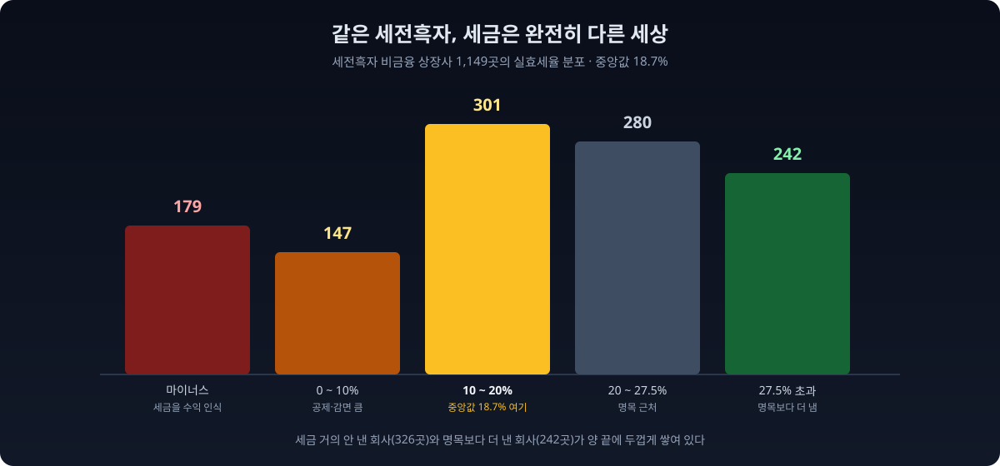
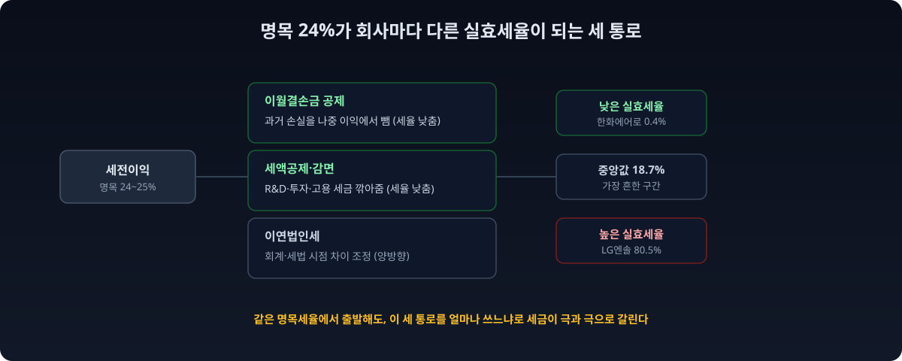
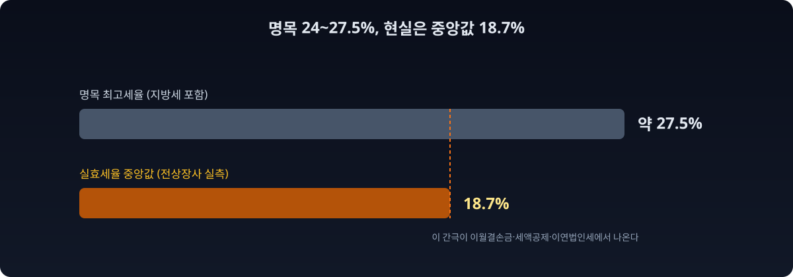
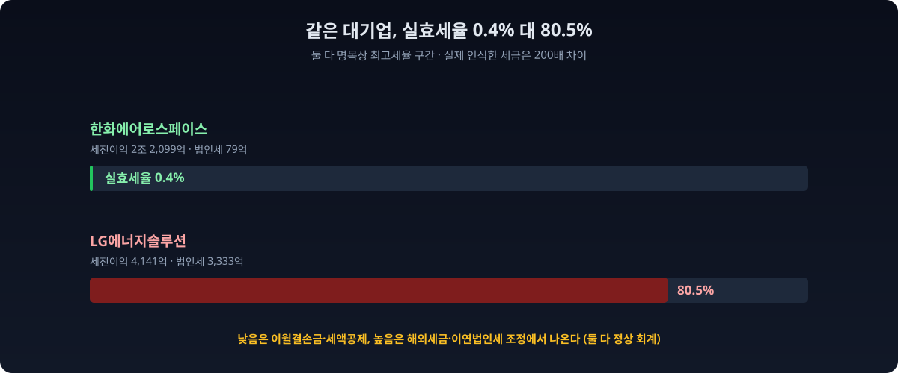
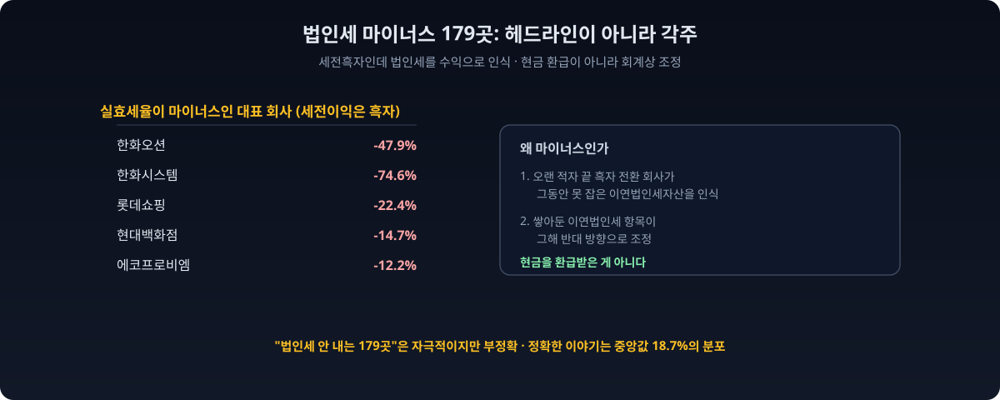

법인세율이 몇 퍼센트냐고 물으면, 많은 사람이 "대기업은 24%쯤"이라고 답한다. 틀린 말은 아니다. 한국의 법인세 최고세율은 과세표준 3천억원 초과분에 대해 24%이고, [2025년 개편으로 25%로 오르며](https://www.taxtimes.co.kr/news/article.html?no=270783), 여기에 지방소득세까지 붙이면 명목상 부담은 약 27%에 이른다. [국세청이 고시하는 세율](https://www.nts.go.kr/nts/cm/cntnts/cntntsView.do?cntntsId=7746&mi=2372)이 그렇다.

그런데 회사들이 실제로 손익계산서에 인식하는 세금은 이 숫자와 딴판이다. [한국세정신문은 10대 대기업의 실효세율이 15.8%로 중견기업보다도 낮다](https://www.taxtimes.co.kr/news/article.html?no=266269)고 보도했고, [삼성전자의 법인세비용은 영업이익의 10%에도 못 미친 해가 있었다](https://www.sejungilbo.com/news/articleView.html?idxno=57596). 그래서 dartlab으로 직접 물었다. 상장사들이 이익 대비 실제로 인식하는 세금은 얼마이고, 회사마다 얼마나 다른가.

세전이익이 흑자인 비금융 상장사 **1,149곳**을 전수로 집계했다. 실효세율(손익계산서의 법인세비용을 세전이익으로 나눈 값)의 **중앙값은 18.7%**였다. 명목 24%는 중앙값 어디에도 없었다. 더 놀라운 건 분포다. **326곳은 실효세율이 10% 미만**이었고, 그중 **179곳은 아예 마이너스**(법인세를 비용이 아니라 수익으로 인식)였다. 반대로 **242곳은 명목 최고세율(지방세 포함 약 27.5%)보다 더 많이** 냈다.



같은 이익을 낸 두 회사가, 하나는 세금을 절반 가까이 물고 다른 하나는 한 푼도 안 낸다. 그 차이가 어디서 갈리는지, 그리고 그 낮은 세금이 앞으로도 이어질지가 이 리포트의 질문이다. 세금은 순이익을 만드는 마지막 관문이라, 이 한 줄을 놓치면 회사의 진짜 벌이를 잘못 읽는다.

## 실효세율이란 무엇이고, 무엇이 아닌가

먼저 용어부터 맞춘다. 이 글에서 실효세율은 **손익계산서의 법인세비용을 세전이익(법인세비용차감전순이익)으로 나눈 값**이다. 회사가 "올해 이익에 대해 이 정도 세금을 부담으로 인식한다"고 장부에 적은 비율이다.

여기서 중요한 구분이 하나 있다. **이 값은 그해 국세청에 실제로 현금으로 낸 세금(현금 납부세액)과는 다르다.** 손익계산서의 법인세비용에는 당장 낼 세금(당기법인세)뿐 아니라, 회계와 세법의 시점 차이 때문에 미래에 내거나 돌려받을 세금(이연법인세)까지 포함된다. 그래서 장부상 실효세율과 실제 현금 세금은 갈릴 수 있다. 이 글이 재는 건 앞의 것, 즉 회사가 이익에 대응해 장부에 인식한 세금 부담이다.

명목세율과 실효세율이 벌어지는 이유는 세 가지다. **이월결손금 공제**(과거에 낸 손실을 나중 이익에서 빼주는 것), **세액공제·감면**(연구개발, 투자, 고용 등에 대해 세금을 깎아주는 것), 그리고 **이연법인세**(회계와 세법의 시점 차이를 조정하는 것)다. 이 세 통로를 얼마나 크게 쓰느냐에 따라 같은 이익이라도 세금이 완전히 달라진다. 대기업이 중견기업보다 실효세율이 낮은 것도, [세액공제·감면이 상위 기업에 집중되기](https://www.taxtimes.co.kr/news/article.html?no=266269) 때문이다.



> **이 리포트가 숫자를 만든 방법 (읽고 넘어가도 되는 방법론)**
>
> - **표본** = 최근 회계연도(2025년)에 1~4분기를 모두 보고한 비금융 상장사 중 세전이익이 흑자인 1,149곳. 금융업과 지주회사는 세무 구조가 달라 제외했다.
> - **실효세율** = 손익계산서의 법인세비용 ÷ 세전이익(법인세비용차감전순이익). 4개 분기 값을 각각 더해 연간으로 만들었다.
> - **손익 기준이지 현금 납부세액이 아니다.** 이연법인세를 포함한 장부상 세금 부담이다.
> - **명목 기준선** = 최고세율 24%(2025년 개편 25%), 지방소득세 포함 약 27.5%.
> - **기준 시점** = 데이터 기준 2026-07-05 dartlab.

## 전상장사에 물었다: 중앙값 18.7%

dartlab은 손익계산서의 세전이익과 법인세비용을 전종목에서 한 번에 읽는다. 둘을 나누면 시장 전체의 실효세율 분포가 한 장에 펼쳐진다.

```python
import dartlab
import polars as pl

def annual(label, year):                       # 4개 분기 합 = 연간
    df = dartlab.scan("account", label)
    qs = [f"{year}Q{q}" for q in range(1, 5)]
    ok = pl.all_horizontal([pl.col(q).is_not_null() for q in qs])
    return df.with_columns(pl.when(ok).then(pl.sum_horizontal([pl.col(q) for q in qs])).alias("v")).select(["종목코드", "v"])

pbt = annual("법인세비용차감전순이익", 2025).rename({"v": "세전이익"})
tax = annual("법인세비용", 2025).rename({"v": "법인세"})
L = dartlab.listing().select(["종목코드", "업종"])
FIN = r"금융|은행|보험|증권|신탁|여신|카드|캐피탈|자산운용|저축|지주"

d = pbt.join(tax, on="종목코드").join(L, on="종목코드", how="left")
d = d.filter((pl.col("세전이익") > 0) & pl.col("법인세").is_not_null()
             & ~pl.col("업종").fill_null("").str.contains(FIN))
d = d.with_columns((pl.col("법인세") / pl.col("세전이익")).alias("실효세율"))
print(round(d["실효세율"].median() * 100, 1))   # 18.7 (중앙값)
```

집계 결과를 분포로 늘어놓으면 이렇다. 표본 1,149곳이다.

| 실효세율 구간 | 회사 수 | 읽는 법 |
|---|---:|---|
| 마이너스 (법인세를 수익으로 인식) | 179 | 이월결손금 환입·이연법인세 인식 |
| 0 ~ 10% | 147 | 공제·감면을 크게 쓴 구간 |
| 10 ~ 20% | 301 | 중앙값 18.7%가 여기 |
| 20 ~ 27.5% | 280 | 명목 근처 |
| 27.5% 초과 | 242 | 명목 최고세율보다 더 냄 |

표시: 실효세율 = 법인세비용 ÷ 세전이익. 명목 최고세율(지방세 포함)은 약 27.5%.



읽는 법은 이렇다. **가장 흔한 구간은 명목세율이 아니라 10~20%이고, 중앙값은 18.7%다.** 명목 24%나 지방세 포함 27.5%를 그대로 내는 회사는 오히려 소수다. 그리고 분포가 한쪽으로 몰려 있지 않다. 세금을 거의 안 낸 회사(10% 미만 326곳)와 명목보다 더 낸 회사(242곳)가 양쪽 끝에 두껍게 쌓여 있다. 같은 "세전흑자 상장사"라는 이름 아래, 세금은 완전히 다른 세상에 산다.

## 같은 이익, 정반대의 세금

극단을 이름으로 불러보면 분포가 실감 난다. 실효세율이 가장 높은 쪽과 낮은 쪽에 각각 우리가 아는 대기업이 있다.



**높은 쪽 끝에는 LG에너지솔루션이 있다. 세전이익 4,141억에 법인세비용 3,333억, 실효세율 80.5%다.** 이익의 대부분을 세금으로 인식한 셈이다. 한국가스공사(66.6%), POSCO홀딩스(54.4%), 신세계(51.1%), 두산(49.1%), SK텔레콤(48.1%)도 명목의 두 배 가까운 실효세율을 인식했다. 이렇게 명목보다 훨씬 높은 실효세율은 대개 해외 자회사의 세금, 세무조정 항목, 또는 이연법인세의 반대 방향 조정에서 나온다. 이익을 낸 만큼만 내는 게 아니라, 회계와 세법의 시점 차이가 그해에 몰려 인식되면 세율이 튄다.

**낮은 쪽 끝에는 한화에어로스페이스가 있다. 세전이익 2조 2,099억에 법인세비용은 79억, 실효세율 0.4%다.** 2조가 넘는 이익에 세금을 사실상 안 낸 것으로 장부에 인식했다. 한화(0.9%), 에스엠(2.3%), SK네트웍스(2.9%), 동진쎄미켐(3.8%), 삼천당제약(3.9%)도 실효세율이 한 자릿수 초반이다. 이런 낮은 실효세율은 대개 과거 손실을 이월결손금으로 공제받거나, 연구개발·투자 세액공제를 크게 쓰거나, 이연법인세자산을 새로 인식하면서 나온다. 삼성전자가 [반도체 적자기에 법인세를 거의 안 냈다가 회복기에 다시 4조를 인식한 것](https://imnews.imbc.com/replay/2025/nwdesk/article/6685272_36799.html)도 같은 원리다. 손실을 본 해의 결손금이 이익을 낸 해의 세금을 깎아준다.

LG에너지솔루션과 한화에어로스페이스는 이익 규모가 5배 넘게 차이 나니, 정확히 "같은 이익"이라고 하긴 어렵다. 그래서 세전이익이 거의 같은 두 회사를 나란히 놓으면 이 리포트의 제목이 문자 그대로 증명된다. **팬오션과 두산에너빌리티는 2025년 세전이익이 각각 3,182억과 3,268억으로 사실상 같다. 그런데 실효세율은 팬오션 5.3%, 두산에너빌리티 37.2%로 일곱 배 차이가 난다.** 같은 3천억대 이익을 냈는데, 한 회사는 세금으로 169억을 인식하고 다른 회사는 1,216억을 인식했다. 해운사와 발전설비사라는 업종 차이, 그리고 각자의 이월결손금과 세액공제 이력이 이 간극을 만든다. 명목세율은 둘에게 똑같이 적용되는데, 손익에 찍히는 세금은 이렇게 갈린다.

이 극단과 쌍은 코드 몇 줄로 직접 뽑을 수 있다. 실효세율을 계산한 뒤 시가총액이 큰 회사만 정렬하면, 우리가 아는 대기업들이 양 끝에 늘어선다.

```python
# 실효세율 극단: 높은 쪽과 낮은 쪽 (시총 1조 이상)
val = dartlab.scan("valuation").select(["종목코드", "종목명", "시가총액"])
big = d.join(val, on="종목코드").filter(pl.col("시가총액") > 1e12)
big = big.with_columns((pl.col("etr") * 100).round(1).alias("실효%"))
print(big.sort("실효%", descending=True).select(["종목명", "실효%"]).head(5))   # LG엔솔 80.5 ...
print(big.sort("실효%").select(["종목명", "실효%"]).head(5))                     # 한화에어로 0.4 ...
```

여기서 데이터를 정직하게 읽어야 한다. **낮은 실효세율이 곧 탈세나 특혜라는 뜻은 아니다.** 이월결손금 공제는 과거에 손실을 본 회사가 나중에 이익을 낼 때 그만큼 세금을 덜 내는, 법이 정한 정상적인 제도다. 이 제도가 없으면, 사업 초기에 크게 투자하며 손실을 본 회사는 흑자로 돌아선 뒤 이중으로 불리해진다. 세액공제도 마찬가지다. 연구개발과 설비투자를 유도하려고 정부가 의도적으로 설계한 유인이라, 반도체나 배터리처럼 투자가 큰 산업일수록 크게 받는다. 그러니 [설비투자를 공격적으로 하는 회사](/blog/capex-beyond-operating-cashflow)가 낮은 실효세율을 보이는 건 오히려 자연스럽다. 다만 이 글이 보여주는 건, 그 제도들이 회사마다 얼마나 다르게 작동하는지, 그래서 "명목세율"이라는 하나의 숫자가 현실을 얼마나 못 담는지다. 명목세율을 1퍼센트포인트 올리고 내리는 논쟁보다, 누가 어떤 공제를 얼마나 받는지가 실제 세 부담을 더 크게 좌우한다.

## 법인세가 마이너스라는 것

분포에서 가장 눈에 띄는 건 실효세율이 마이너스인 179곳이다. 세전이익은 흑자인데 법인세를 비용이 아니라 **수익**으로 인식한 회사들이다. 한화오션(−47.9%), 한화시스템(−74.6%), 에코프로비엠(−12.2%), 롯데쇼핑(−22.4%), 현대백화점(−14.7%)이 여기 있다.



이걸 "국가에서 돈을 돌려받았다"고 읽으면 틀린다. 대부분은 현금이 오간 게 아니라 **회계상 인식**이다. 두 가지 경우가 많다. 첫째, 과거에 크게 손실을 봤던 회사가 이제 이익을 낼 것으로 판단해 그동안 못 잡았던 이연법인세자산(미래에 덜 낼 세금)을 새로 인식하면, 그해 법인세비용이 마이너스로 찍힌다. 한화오션처럼 오랜 적자 끝에 흑자로 돌아선 회사에서 자주 나타난다. 둘째, 이미 쌓아둔 이연법인세 항목이 그해에 반대 방향으로 조정되는 경우다. 어느 쪽이든 그해 실제로 현금을 환급받았다는 뜻은 아니다.

그래서 이 179곳은 헤드라인이 아니라 각주에 가깝다. "법인세를 안 내는 상장사가 179곳"이라고 쓰면 자극적이지만 부정확하다. 정확한 이야기는 **"세전흑자 상장사의 실효세율은 명목 24%가 아니라 중앙값 18.7%이고, 그 안에서 극과 극으로 갈린다"**는 것이다. 마이너스 구간은 그 극단의 한쪽 끝일 뿐이다.

## 왜 이 숫자를 봐야 하나

명목세율 하나로 회사의 세금 부담을 판단하면 크게 틀린다. 같은 24%가 적용된다고 알려진 대기업들 사이에서도 실효세율은 0.4%부터 80.5%까지 벌어진다. 투자자 입장에서 실효세율은 순이익을 좌우하는 결정적 변수다. 세전이익이 같아도 실효세율이 10%인 회사와 30%인 회사는 순이익이 20%포인트 넘게 차이 난다. 그런데 이 차이는 명목세율이 아니라 그 회사의 이월결손금 잔액, 세액공제 여력, 이연법인세 구조에서 나온다.

특히 실효세율이 유난히 낮은 회사는 그 낮음이 **일회성인지 지속되는지**를 봐야 한다. 이월결손금은 언젠가 소진되고, 새로 인식한 이연법인세자산은 한 번 쓰면 끝이다. [적자를 오래 내다 흑자로 돌아선 회사](/blog/interest-coverage-zombie-firms)가 턴어라운드 초기에 세금을 거의 안 내다가, 결손금이 다 소진되면 실효세율이 정상으로 뛰어오른다. 그러면 세전이익이 그대로여도 순이익은 줄어든다. 반대로 [연구개발비를 세액공제로 크게 인정받는 회사](/blog/development-costs-and-intangibles)는 그 구조가 이어지는 한 낮은 세율을 유지할 수 있다. 실효세율의 배경을 읽어야 다음 해 순이익을 가늠할 수 있다는 뜻이다.

정책 환경도 이 분포를 다시 흔들고 있다. 2024년부터 도입된 글로벌 최저한세(다국적 기업이 어느 나라에서든 최소 15%의 실효세율을 부담하게 하는 국제 규범)는, 해외에 자회사를 두고 실효세율을 15% 아래로 낮춰온 대기업에 새로운 하한선을 긋는다. 이 글의 분포에서 실효세율이 한 자릿수인 대기업들이 앞으로 이 규범에 어떻게 반응하는지가, 다음 몇 해의 순이익을 좌우할 변수다. 명목세율을 몇 퍼센트로 정하느냐의 논쟁이 정치의 표면이라면, 이 실효세율 분포와 그 하한선은 실제 세 부담이 결정되는 현장이다.

이건 [흑자인데 현금이 안 들어오는 회사](/blog/profit-without-cash)를 짚은 리포트와도 통한다. 순이익이라는 하나의 숫자 뒤에는, 세금과 현금이라는 서로 다른 진실이 숨어 있다. 순이익만 보면 [숫자 뒤 맥락](/blog/beyond-the-numbers)을 놓친다. 세금 정책 측면에서도, [대기업의 세액공제가 세수에 미치는 영향](https://www.sejungilbo.com/news/articleView.html?idxno=57596)은 명목세율을 몇 퍼센트로 정하느냐보다 이 공제·감면 구조를 어떻게 설계하느냐가 더 큰 문제라는 걸 이 분포가 보여준다.

## 이렇게 읽으면 안 된다

데이터는 한 방향으로만 읽으면 위험하다. 이 집계가 **말하지 않는 것**을 분명히 해둔다.

- **"실효세율 낮음 = 탈세"가 아니다.** 이월결손금 공제, 세액공제, 이연법인세는 모두 법이 정한 정상적인 회계·세무 제도다. 낮은 실효세율은 대개 그 제도를 합법적으로 활용한 결과다.
- **"법인세 마이너스 = 세금을 돌려받았다"가 아니다.** 대부분 현금이 아니라 회계상 인식(이연법인세, 결손금 환입)이다. 헤드라인이 아니라 각주로 다뤄야 한다.
- **손익상 실효세율이지 현금 납부세액이 아니다.** 이연법인세를 포함한 장부 기준이라, 그해 국세청에 실제로 낸 현금과는 다를 수 있다.
- **단년 값은 크게 출렁인다.** 대규모 일회성 세무조정, 해외 자회사 세금, 이연법인세 인식 시점에 따라 한 해 실효세율은 튄다. 여러 해를 봐야 그 회사의 구조적 세율이 보인다.
- **세전흑자 표본만 봤고, 연결과 별도가 섞일 수 있다.** 적자 회사는 애초에 제외했고, 연결 기준과 별도 기준이 종목마다 다를 수 있다.
- **명목 24%는 최고구간 세율이다.** 한국 법인세는 과세표준에 따라 9%, 19%, 21%, 24%로 오르는 누진구조라, 24%는 과표 3천억원 초과분에만 붙는다. 그래서 실효세율이 명목보다 낮은 회사 중 일부는 공제·감면 때문이 아니라 애초에 최고구간에 닿지 않아서다. 다만 이 표본의 대기업 다수는 최고구간에 걸치므로, 중앙값 18.7%와 명목의 간극은 상당 부분 공제·감면·이연법인세에서 나온다.

이 글의 결론은 "어떤 회사가 세금을 덜 낸다"가 아니다. **"명목세율 하나로 세금을 판단하지 말고, 실효세율의 분포와 그 배경(이월결손금·세액공제·이연법인세)을 봐라"**는 것이다. 같은 이익을 내도 국가라는 관문에서 얼마가 새고 어디서 멈추는지는 회사마다 극과 극이고, 그 차이가 곧 순이익의 차이다. 어떤 종목의 낮은 세율을 볼 때 물어야 할 것은 "이 회사가 세금을 안 낸다"가 아니라 "이 낮음이 이월결손금 소진과 함께 사라질 일회성인가, 아니면 세액공제로 이어질 구조인가"다. 그 답이 다음 해 순이익의 방향을 바꾼다.

## 직접 확인해보라

이 글의 모든 숫자는 누구나 재현할 수 있다. dartlab을 설치하고 아래 몇 줄이면 같은 18.7%와 분포가 나온다.

```python
import dartlab
import polars as pl

def annual(label, year):
    df = dartlab.scan("account", label)
    qs = [f"{year}Q{q}" for q in range(1, 5)]
    ok = pl.all_horizontal([pl.col(q).is_not_null() for q in qs])
    return df.with_columns(pl.when(ok).then(pl.sum_horizontal([pl.col(q) for q in qs])).alias("v")).select(["종목코드", "v"])

L = dartlab.listing().select(["종목코드", "업종"])
FIN = r"금융|은행|보험|증권|신탁|여신|카드|캐피탈|자산운용|저축|지주"
d = (annual("법인세비용차감전순이익", 2025).rename({"v": "세전이익"})
     .join(annual("법인세비용", 2025).rename({"v": "법인세"}), on="종목코드")
     .join(L, on="종목코드", how="left"))
d = d.filter((pl.col("세전이익") > 0) & pl.col("법인세").is_not_null()
             & ~pl.col("업종").fill_null("").str.contains(FIN))
d = d.with_columns((pl.col("법인세") / pl.col("세전이익")).alias("etr"))
print(d.height)                                            # 1149
print(round(d["etr"].median() * 100, 1))                   # 18.7
print(d.filter(pl.col("etr") < 0.10).height)               # 326 (10% 미만)
print(d.filter(pl.col("etr") < 0).height)                  # 179 (마이너스)
print(d.filter(pl.col("etr") > 0.275).height)              # 242 (명목 초과)
```

검증 가능하지 않은 숫자는 신뢰할 이유가 없다. dartlab의 모든 집계는 공시 데이터에서 직접 나오고, 코드가 곧 방법론이다.

## 검증표

본문의 모든 강한 수치와 dartlab 호출을 대응시킨다. 이 표에 없는 숫자는 본문에 싣지 않았다.

| 본문 수치 | 산출 방법 | 결과 |
|---|---|---|
| 세전흑자 비금융 표본 1,149 | 세전이익 흑자 & 4분기 완주 | 1,149 |
| 실효세율 중앙값 18.7% | 법인세비용/세전이익 중앙값 | 0.187 |
| 10% 미만 326곳 | 실효세율 10% 미만 | 326 |
| 마이너스 179곳 | 실효세율 0 미만 | 179 |
| 27.5% 초과 242곳 | 실효세율 27.5% 초과 | 242 |
| LG에너지솔루션 실효세율 80.5% | `scan` 373220 | 세전 4,141억·세금 3,333억 |
| 한화에어로스페이스 0.4% | `scan` 012450 | 세전 2조2,099억·세금 79억 |
| 한화오션 마이너스 47.9% | `scan` 042660 | 세금을 수익으로 인식 |
| 매칭 쌍: 팬오션 세전 3,182억·실효 5.3% vs 두산에너빌리티 세전 3,268억·실효 37.2% | `scan` 028670·034020 | 실측 |
| 캘리브레이션: SK하이닉스 14.9%·삼성전자 8.6%·현대차 25.1% | `scan` | 실측 |
| 10대 대기업 실효세율 15.8% | 한국세정신문 | 외부 인용 |
| 명목 최고세율 24%(2025 개편 25%) | 국세청·한국세정신문 | 외부 인용 |

> **방법론** 데이터 출처: DART 정기보고서(법인세비용차감전순이익·법인세비용) + KRX 상장 분류(`listing`). 집계 단위: 2025년 1~4분기를 모두 보고한 세전흑자 비금융 상장사 1,149곳. 실효세율 = 법인세비용 ÷ 세전이익(4개 분기 합산, 손익 기준). 재현: `dartlab.scan("account", ...)`. 데이터 기준 2026-07-05.
>
> 본 글은 공시 데이터에 기반한 정보 제공이며, 특정 종목의 매수·매도를 권유하지 않는다. 낮은 실효세율은 합법적 공제·감면의 결과이며 탈세를 뜻하지 않는다.
