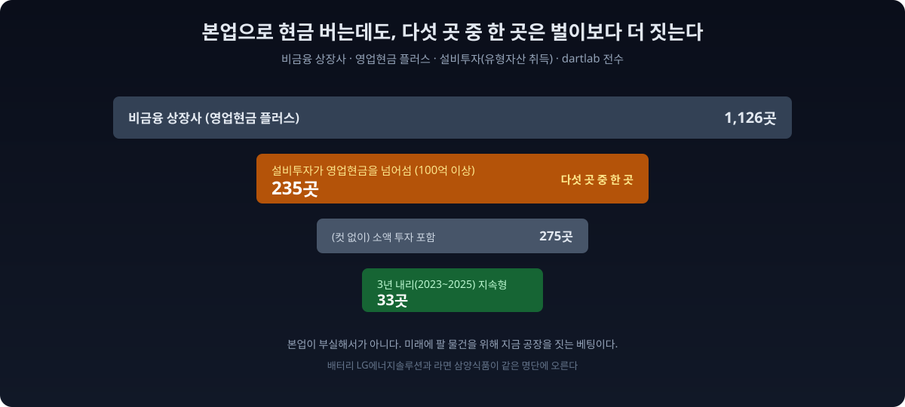
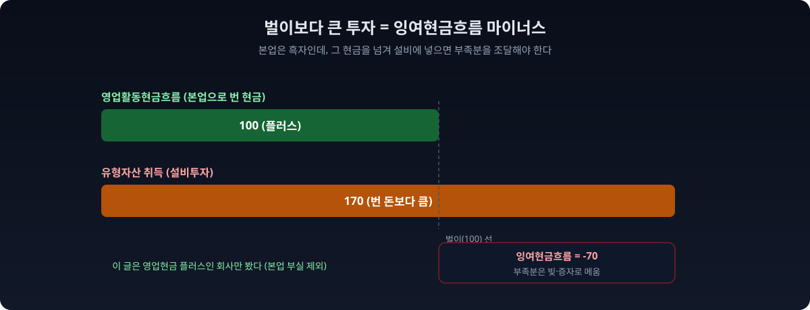
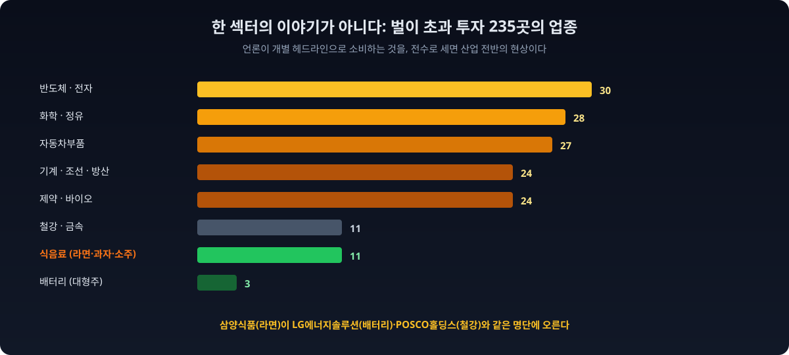
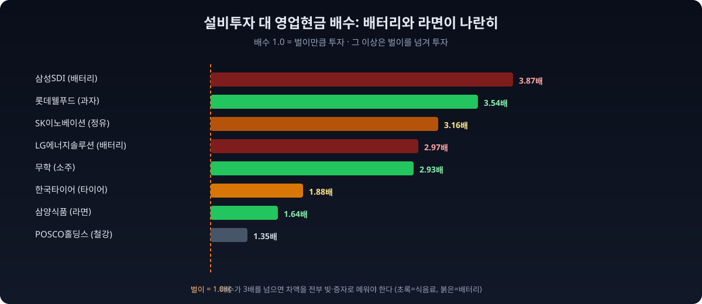
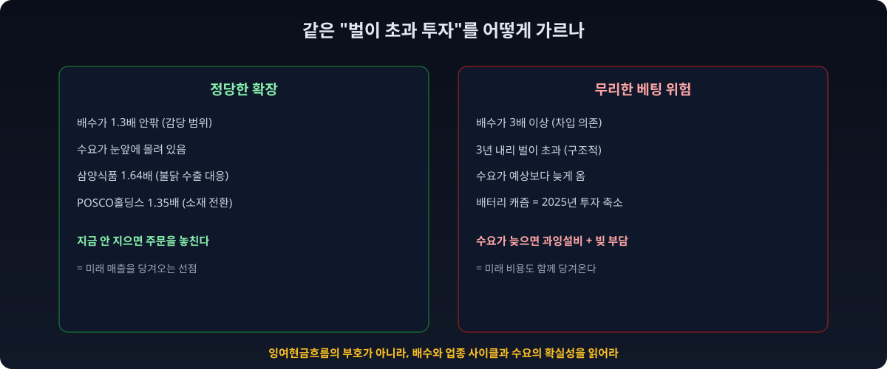

"잉여현금흐름이 적자로 돌아섰다"는 문장은 흔히 나쁜 신호로 읽힌다. 잉여현금흐름(영업으로 번 현금에서 설비투자를 빼고 남는 돈)이 마이너스라는 건, 본업으로 번 돈으로는 투자를 감당하지 못해 그 차이를 빚이나 증자로 메웠다는 뜻이기 때문이다. 실제로 [LG에너지솔루션이 대규모 투자로 잉여현금흐름 적자를 이어가고](https://www.seoul.co.kr/news/economy/industry/2025/01/27/20250127014002), [LG화학 부문의 누적 잉여현금흐름이 24조원 넘게 마이너스](https://www.bloter.net/news/articleView.html?idxno=661692)라는 기사가 우려의 어조로 나온다.

그런데 정말 잉여현금흐름 마이너스가 곧 부실일까. dartlab으로 물었다. 본업에서 멀쩡히 현금을 버는(영업활동현금흐름이 플러스인) 회사 중에서, 그 번 돈보다 더 많은 돈을 설비에 쏟아부은 곳이 얼마나 되나. 최근 회계연도(2025년)에 영업현금이 플러스였던 비금융 상장사 **1,126곳** 중, 유형자산 취득(설비투자)이 그 영업현금을 넘어선 곳이 **235곳**이었다. 본업으로 번 현금을 100원이라 하면, 그보다 더 많은 돈을 공장과 설비에 넣은 회사가 다섯 곳 중 한 곳꼴로 있었다는 뜻이다.



본업으로 번 돈을 100원이라 하면, 그보다 더 많은 돈을 미래의 생산능력에 넣은 셈이니, 이 회사들은 오늘의 여유보다 내일의 자리를 택한 것이다. 더 흥미로운 건 명단의 얼굴이다. **배터리 LG에너지솔루션(벌이의 3배)과 라면 삼양식품(벌이의 1.6배)이 같은 명단에 오른다.** 전혀 다른 산업이 "벌이보다 큰 설비투자"라는 한 지표로 같은 갈림길에 서 있다. 이 235곳을 그냥 "잉여현금흐름 적자 부실기업"으로 뭉뚱그리면, 성장을 위한 공격적 베팅과 진짜 무리한 투자를 구분하지 못한다. 이 글은 그 둘을 갈라 읽는 법이다.

## 벌이보다 큰 투자란 무엇인가

숫자를 세기 전에 무엇을 세는지 맞춘다. 회사가 한 해 본업에서 벌어들인 현금이 **영업활동현금흐름**이다. 그 돈으로 회사는 공장을 짓고 기계를 사는 데(설비투자, CAPEX) 쓰고, 남으면 빚을 갚거나 배당을 준다. 영업현금에서 설비투자를 빼고 남는 돈이 **잉여현금흐름**이다.

이 글의 조건은 단순하다. **영업활동현금흐름은 플러스(본업으로 현금을 벌었다)인데, 설비투자가 그 영업현금보다 크다.** 그러면 잉여현금흐름은 자동으로 마이너스가 된다. 본업으로 번 돈을 전부 설비에 넣고도 모자라, 그 부족분을 어디선가 조달했다는 뜻이다.

여기서 방향이 갈린다. 본업이 적자라서 현금이 마르는 것과, 본업은 멀쩡히 흑자인데 미래를 위해 벌이보다 더 크게 투자하는 것은 완전히 다르다. 이 글은 후자만 골랐다. **영업현금이 마이너스인 회사(본업 부실)는 아예 제외하고, 영업현금이 플러스인데도 그보다 더 쓴 회사만** 봤다. 그래서 이 235곳의 잉여현금흐름 마이너스는 "돈을 못 벌어서"가 아니라 "번 돈보다 더 투자해서" 생긴 것이다.



> **이 리포트가 숫자를 만든 방법 (읽고 넘어가도 되는 방법론)**
>
> - **표본** = 최근 회계연도(2025년)에 1~4분기를 모두 보고한 비금융 상장사 중 영업활동현금흐름이 플러스인 1,126곳. 설비투자 계정(유형자산의 취득)의 커버리지는 2,499곳이다.
> - **핵심 조건** = 영업활동현금흐름은 플러스이면서, 유형자산 취득이 그 영업현금보다 크고, 설비투자가 100억원 이상. 이 조건을 만족한 곳이 235곳이다. 100억 컷을 없애면 275곳이 된다.
> - **설비투자 = 유형자산의 취득만** 썼다. 무형자산, 사용권자산, 기업 인수(M&A)에 쓴 돈은 제외했다. 그래서 실제 총투자는 이보다 클 수 있다.
> - **배수** = 유형자산 취득 ÷ 영업활동현금흐름. 1을 넘으면 벌이보다 더 투자한 것이다.
> - **기준 시점** = 데이터 기준 2026-07-05 dartlab.

## 전상장사에 물었다: 235곳

dartlab은 현금흐름표의 영업활동현금흐름과 유형자산 취득을 전종목에서 한 번에 읽는다. 둘을 나란히 놓으면 어느 회사가 벌이보다 더 크게 투자하는지 시장 전체에서 드러난다.

```python
import dartlab
import polars as pl

def annual(label, year):                       # 4개 분기 합 = 연간
    df = dartlab.scan("account", label)
    qs = [f"{year}Q{q}" for q in range(1, 5)]
    ok = pl.all_horizontal([pl.col(q).is_not_null() for q in qs])
    return df.with_columns(pl.when(ok).then(pl.sum_horizontal([pl.col(q) for q in qs])).alias("v")).select(["종목코드", "v"])

ocf   = annual("영업활동현금흐름", 2025).rename({"v": "영업현금"})
capex = annual("유형자산의취득", 2025).rename({"v": "설비투자"})
L = dartlab.listing().select(["종목코드", "업종"])
FIN = r"금융|은행|보험|증권|신탁|여신|카드|캐피탈|자산운용|저축|지주"

d = ocf.join(capex, on="종목코드").join(L, on="종목코드", how="left")
d = d.filter((pl.col("영업현금") > 0) & pl.col("설비투자").is_not_null()
             & ~pl.col("업종").fill_null("").str.contains(FIN))
over = d.filter((pl.col("설비투자") > pl.col("영업현금")) & (pl.col("설비투자") >= 1e10))
print(over.height)                             # 235
```

집계를 깔때기로 줄이면 이렇다.

| 구분 | 회사 수 | 비고 |
|---|---:|---|
| 비금융 상장사 (영업현금 플러스, 4분기 완주) | 1,126 | 집계 대상 |
| 설비투자가 영업현금을 넘어섬 (100억 이상) | **235** | **약 다섯 곳 중 한 곳** |
| (컷 없이) 설비투자가 영업현금을 넘어섬 | 275 | 소액 투자 포함 |
| 3년 내리(2023~2025) 벌이 초과 투자 | 33 | 지속형 |

읽는 법은 이렇다. **본업으로 현금을 버는 상장사 다섯 곳 중 한 곳은, 그 번 돈보다 더 많은 돈을 설비에 넣었다.** 이건 본업이 부실해서가 아니다. 앞으로 팔릴 물건을 위해 지금 공장을 짓는, 미래에 대한 베팅이다. 그 베팅의 부족분은 빚이나 증자로 메운다. 그래서 이 235곳은 [빚에 눌려 이자도 못 갚는 회사](/blog/interest-coverage-zombie-firms)와는 정반대의 이유로 현금이 마이너스다. 한쪽은 벌지 못해서, 다른 한쪽은 벌이보다 더 투자해서다.

## 라면이 배터리와 같은 명단에 오른다

235곳을 업종으로 갈라보면 이 현상이 특정 산업의 이야기가 아니라는 게 드러난다.



반도체와 전자부품(30곳), 화학과 정유(28곳), 자동차부품(27곳), 기계와 조선과 방산(24곳), 제약과 바이오(24곳)가 두껍고, 철강과 금속(11곳), 식음료(11곳)도 명단에 있다. 언론이 "LG엔솔 대규모 투자" 같은 개별 헤드라인으로 소비하는 이야기를, 전수로 세어보면 배터리 한 섹터가 아니라 화학, 자동차부품, 심지어 식음료까지 걸친 넓은 현상이라는 게 보인다.



가장 상징적인 건 식음료다. **삼양식품은 설비투자가 영업현금의 1.64배**였다. 불닭볶음면의 세계적 인기로 주문이 폭발하자, 밀양에 새 공장을 짓고 라인을 늘리느라 번 돈보다 더 많이 투자한 것이다. 롯데웰푸드는 3.54배, 소주 회사 무학은 2.93배, 대상은 1.40배, 풀무원은 1.27배였다. 라면과 과자와 소주 회사가, 배터리의 LG에너지솔루션(2.97배)이나 삼성SDI(3.87배), 철강의 POSCO홀딩스(1.35배)와 나란히 "벌이보다 더 짓는" 명단에 오른다. 이 숫자들을 [숫자 뒤 맥락](/blog/beyond-the-numbers)까지 읽으면, 서로 무관해 보이는 회사들이 왜 같은 명단에 오르는지가 보인다.

이게 이 데이터의 숨은 연결이다. 산업은 제각각이지만, 이들은 하나같이 **지금 수요가 몰리는 국면에서 미래 생산능력을 선점하려 벌이보다 큰 베팅을 하는 중**이다. 삼양식품에게 그건 불닭 수출이고, LG에너지솔루션에게는 전기차와 에너지저장장치이며, POSCO홀딩스에게는 이차전지 소재다. 겉보기엔 무관한 회사들이 "사이클 피크에서의 설비 베팅"이라는 한 지표로 묶인다.

업종별로 몇 곳인지도 코드 몇 줄이면 센다. 업종 문자열을 대분류로 묶어 세어보면, 이 현상이 특정 섹터의 이야기가 아니라는 게 숫자로 확인된다.

```python
# 벌이 초과 투자 235곳을 업종 대분류로 집계
over = over.with_columns(pl.col("업종").fill_null("").alias("업종"))
sector = {"전지": "배터리", "반도체": "반도체전자", "화학": "화학정유",
          "식료품": "식음료", "1차 철강": "철강금속"}
def to_cat(u):
    for key, cat in sector.items():
        if key in u:
            return cat
    return "기타"
over = over.with_columns(pl.col("업종").map_elements(to_cat, return_dtype=pl.Utf8).alias("대분류"))
print(over.group_by("대분류").len().sort("len", descending=True))
```

반도체 30곳, 화학과 정유 28곳, 자동차부품 27곳, 기계와 조선과 방산 24곳, 제약과 바이오 24곳. 어느 한 섹터도 명단을 독점하지 않는다.

## 정당한 확장인가, 무리한 베팅인가

235곳을 그대로 "공격적 투자 = 좋음"으로 읽어도 틀린다. 벌이보다 큰 투자가 늘 옳은 건 아니기 때문이다. 정당한 확장과 무리한 베팅을 가르려면 두 가지를 더 봐야 한다.



**첫째, 배수의 크기다.** 설비투자가 영업현금의 1.3배 정도라면 번 돈을 조금 넘겨 투자한 것이라 감당 범위 안이다. 그런데 배수가 3배, 4배로 올라가면 이야기가 다르다. 삼성SDI(3.87배), 롯데웰푸드(3.54배), SK이노베이션(3.16배)처럼 벌이의 서너 배를 투자하면, 그 차액은 전부 빚과 증자로 메워야 한다. 다만 배수를 볼 때는 함정이 있다. 그해 영업현금이 유난히 작았던 회사는 배수가 크게 튄다. 예컨대 코웨이는 배수가 64배로 잡히는데, 이는 투자가 폭발했다기보다 렌탈 사업의 현금흐름 특성상 그해 영업현금이 작게 잡혔기 때문이다. 그래서 배수 하나만 보지 말고 절대 금액과 함께 봐야 한다.

**둘째, 몇 년째인가다.** 한 해만 벌이보다 크게 투자한 건 사이클 피크의 일시적 증설일 수 있다. 하지만 3년 내리 그랬다면, 그건 이 회사가 구조적으로 벌이보다 빠르게 몸집을 키우고 있다는 뜻이다. 그런 곳이 33곳이었다. POSCO홀딩스, SK이노베이션, 롯데케미칼, 넥센타이어, 이녹스첨단소재, 교촌에프앤비 등이다. 이 지속형은 성장이 그만큼 확실하다는 자신감의 표현일 수도, 캐즘처럼 수요가 꺾이면 [번 돈보다 더 투자한 설비가 짐이 되는](/blog/samsung-vs-tsmc-capex-and-depreciation) 리스크일 수도 있다.

배터리가 이 양면성을 가장 선명하게 보여준다. LG에너지솔루션과 삼성SDI는 몇 년간 벌이의 서너 배를 설비에 쏟으며 세계 곳곳에 공장을 지었다. 전기차 시대가 예상대로 빠르게 왔다면 이 선점은 압도적 우위가 됐을 것이다. 그런데 [전기차 수요가 일시적으로 정체되는 캐즘이 길어지면서](https://www.ebn.co.kr/news/articleView.html?idxno=1708558), 먼저 지어둔 공장이 가동률 부담으로 돌아왔다. 그래서 배터리 업계는 [2025년 설비투자를 크게 줄이며](https://www.thelec.kr/news/articleView.html?idxno=26518) 속도를 조절했고, [2026년에는 내실 경영으로 방향을 틀었다](https://www.goodkyung.com/news/articleView.html?idxno=282140). 벌이보다 큰 투자는 수요가 예상대로 올 때는 선점이지만, 수요가 늦으면 과잉설비가 된다. 같은 공격적 투자가 몇 년 사이에 자신감의 상징에서 부담의 근원으로 바뀐 것이다. 그래서 이 235곳을 볼 때는 "얼마나 크게 투자하는가"만큼이나 "그 투자가 겨냥한 수요가 얼마나 확실한가"를 물어야 한다.

이 판단은 [설비투자와 감가상각의 관계](/blog/samsung-vs-tsmc-capex-and-depreciation)를 함께 봐야 선명해진다. 오늘 지은 공장은 앞으로 몇 년에 걸쳐 감가상각으로 이익을 깎는다. 그래서 벌이보다 큰 투자는 미래의 매출을 당겨오는 동시에 미래의 비용도 당겨온다. 그 매출이 실제로 오느냐가 베팅의 성패를 가른다.

## 현금이 남는 회사, 현금을 태우는 회사

이 리포트는 [빚을 다 갚고도 시가총액보다 현금이 많은 회사](/blog/net-cash-above-market-cap)를 짚은 리포트의 정반대편에 있다. 그쪽은 현금이 남아도는데 안 쓰는 회사(정적 저평가)였고, 이쪽은 번 돈보다 더 태우는 회사(동적 투자)다. 같은 현금흐름표를 보는데, 한쪽은 투자활동에서 현금이 들어오는(자산을 파는) 정적인 회사고, 다른 한쪽은 투자활동에서 현금이 크게 나가는(공장을 짓는) 공격적인 회사다.

둘 중 무엇이 옳은지는 정해져 있지 않다. 성장이 멈춘 회사가 현금을 쌓아두면 저평가의 함정이 되고, 성장하는 회사가 벌이보다 크게 투자하면 미래의 성장이 된다. 하지만 성장이 멈춘 회사가 벌이보다 크게 투자하면 최악이고, 성장하는 회사가 현금만 쌓으면 기회를 놓친다. 그래서 잉여현금흐름의 부호 하나로 회사를 판단하면 안 되고, 그 현금이 어디로 왜 흐르는지를 봐야 한다. [영업현금이 마이너스인 흑자 기업](/blog/profit-without-cash)을 읽을 때와 똑같은 원리다. 부호가 아니라 이유를 읽는 것이다.

## 이렇게 읽으면 안 된다

데이터는 한 방향으로만 읽으면 위험하다. 이 집계가 **말하지 않는 것**을 분명히 해둔다.

- **"벌이보다 큰 투자 = 무모함"이 아니다.** 이 235곳의 다수는 수요가 몰리는 국면에서 미래를 선점하는 정당한 확장이다. 삼양식품이 불닭 수요에 맞춰 공장을 늘리는 건 오히려 필요한 투자다.
- **"벌이보다 큰 투자 = 안전한 성장"도 아니다.** 배수가 3배를 넘거나 3년 내리 이어지면, 수요가 예상보다 늦게 올 경우 과잉설비와 차입 부담으로 남는다. 배터리 캐즘이 그 실례다.
- **설비투자는 유형자산 취득만 봤다.** 무형자산, 사용권자산, 기업 인수는 뺐다. 그래서 실제 총투자는 이보다 크고, 이 계정을 따로 공시하지 않는 일부 회사는 표본에서 빠졌다(커버리지 2,499곳).
- **배수가 큰 회사는 영업현금이 작았던 해일 수 있다.** 코웨이(64배)처럼 배수가 튀는 경우는 투자 폭발이 아니라 그해 영업현금이 작았던 것이니, 절대 금액과 3년 평균을 함께 봐야 한다.
- **현대차처럼 영업현금이 사업모델 특성인 경우는 별개다.** 할부금융 자산 때문에 영업현금이 마이너스로 잡히는 회사는 이 프레임으로 읽으면 안 된다(그래서 이 표본에서는 영업현금 플러스만 봤다).

투자자에게 이 구분은 실전에서 바로 쓰인다. 어떤 종목의 잉여현금흐름이 마이너스라는 기사를 보면, 먼저 영업활동현금흐름의 부호를 확인한다. 그게 플러스라면 본업은 멀쩡히 돈을 벌고 있다는 뜻이니, 그 다음은 설비투자가 어디로 향하는지, 배수가 몇 배인지, 몇 년째인지를 본다. 수요가 확실한 국면에서 감당 범위의 투자라면 그 마이너스는 성장의 비용이고, 수요가 불확실한데 배수마저 크고 오래됐다면 그 마이너스는 위험의 전조다. 같은 숫자가 정반대 의미를 갖는 지점이 바로 여기다.

이 글의 결론은 "이 235곳을 사라" 또는 "피하라"가 아니다. **"음의 잉여현금흐름을 부실로 뭉뚱그리지 말고, 그게 본업 부실 때문인지 벌이 초과 투자 때문인지를 먼저 가르고, 후자라면 배수와 업종 사이클로 정당한 확장인지 무리한 베팅인지를 읽어라"**는 것이다. 라면 회사와 배터리 회사가 같은 명단에 오르는 건, 잉여현금흐름 마이너스라는 하나의 숫자가 얼마나 많은 다른 이야기를 담는지를 보여준다.

그러니 다음에 어떤 회사의 "잉여현금흐름 적자" 기사를 보거든, 먼저 이 한 가지를 물어보라. 이 회사는 못 벌어서 현금이 마르는가, 아니면 더 지으려고 현금을 태우는가. 그 답이 갈리는 지점에, 부실과 베팅을 가르는 선이 있다.

## 직접 확인해보라

이 글의 모든 숫자는 누구나 재현할 수 있다. dartlab을 설치하고 아래 몇 줄이면 같은 235가 나온다. 배수를 붙여 정렬하면 LG에너지솔루션과 삼양식품이 같은 명단에 오르는 것도 볼 수 있다.

```python
import dartlab
import polars as pl

def annual(label, year):
    df = dartlab.scan("account", label)
    qs = [f"{year}Q{q}" for q in range(1, 5)]
    ok = pl.all_horizontal([pl.col(q).is_not_null() for q in qs])
    return df.with_columns(pl.when(ok).then(pl.sum_horizontal([pl.col(q) for q in qs])).alias("v")).select(["종목코드", "v"])

L = dartlab.listing().select(["종목코드", "종목명", "업종"])
FIN = r"금융|은행|보험|증권|신탁|여신|카드|캐피탈|자산운용|저축|지주"
d = (annual("영업활동현금흐름", 2025).rename({"v": "영업현금"})
     .join(annual("유형자산의취득", 2025).rename({"v": "설비투자"}), on="종목코드")
     .join(L, on="종목코드", how="left"))
d = d.filter((pl.col("영업현금") > 0) & pl.col("설비투자").is_not_null()
             & ~pl.col("업종").fill_null("").str.contains(FIN))
over = d.filter((pl.col("설비투자") > pl.col("영업현금")) & (pl.col("설비투자") >= 1e10))
over = over.with_columns((pl.col("설비투자") / pl.col("영업현금")).round(2).alias("배수"))
print(over.height)                                                       # 235
print(over.sort("설비투자", descending=True).select(["종목명", "배수"]).head(10))
```

검증 가능하지 않은 숫자는 신뢰할 이유가 없다. dartlab의 모든 집계는 공시 데이터에서 직접 나오고, 코드가 곧 방법론이다.

## 검증표

본문의 모든 강한 수치와 dartlab 호출을 대응시킨다. 이 표에 없는 숫자는 본문에 싣지 않았다.

| 본문 수치 | 산출 방법 | 결과 |
|---|---|---|
| 영업현금 플러스 비금융 표본 1,126 | 영업현금 흑자 & 4분기 완주 | 1,126 |
| 설비투자가 영업현금 초과 & 100억+ : 235 | 유형자산취득이 영업현금보다 큼 | 235 |
| 컷 없이 275곳 | 100억 컷 제거 | 275 |
| 3년 연속(23~25) 벌이 초과 투자 33곳 | 3년 전부 | 33 |
| LG에너지솔루션 설비투자 28.7조·영업현금 9.7조·2.97배 | `scan` 373220 | 실측 |
| 삼성SDI 3.87배·SK이노베이션 3.16배 | `scan` 006400·096770 | 실측 |
| 삼양식품 1.64배·롯데웰푸드 3.54배·무학 2.93배 | `scan` 003230·280360·033920 | 실측 |
| POSCO홀딩스 1.35배·한국타이어 1.88배 | `scan` 005490·161390 | 실측 |
| 업종 분포(반도체30·화학28·자동차27·식음료11 등) | 업종 대분류 집계 | 실측 |
| LG화학 누적 잉여현금흐름 −24.4조 | 블로터 | 외부 인용 |
| 배터리 3사 2025 설비투자 축소 | 서울신문·디일렉 | 외부 인용 |

> **방법론** 데이터 출처: DART 정기보고서(영업활동현금흐름·유형자산의 취득) + KRX 상장 분류(`listing`). 집계 단위: 2025년 1~4분기를 모두 보고한 영업현금 플러스 비금융 상장사 1,126곳(설비투자 계정 커버리지 2,499곳). 배수 = 유형자산 취득 ÷ 영업활동현금흐름(4개 분기 합산). 재현: `dartlab.scan("account", ...)`. 데이터 기준 2026-07-05.
>
> 본 글은 공시 데이터에 기반한 정보 제공이며, 특정 종목의 매수·매도를 권유하지 않는다. 벌이 초과 투자는 성장 베팅일 수도, 과잉투자일 수도 있으며 그 자체로 좋고 나쁨을 단정하지 않는다.
