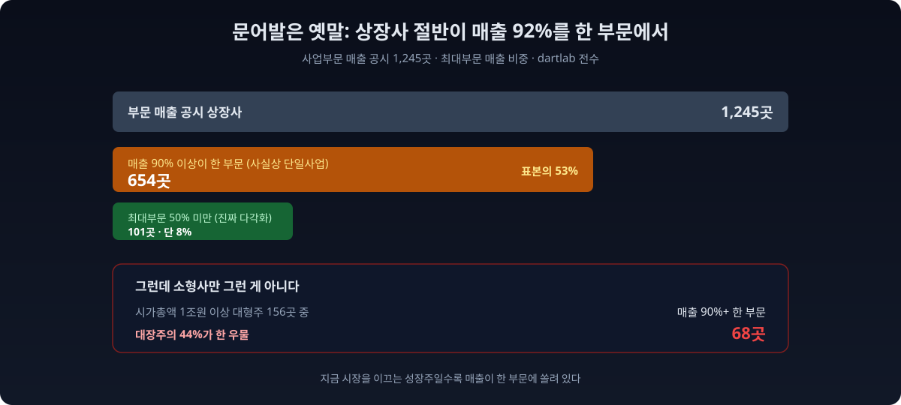
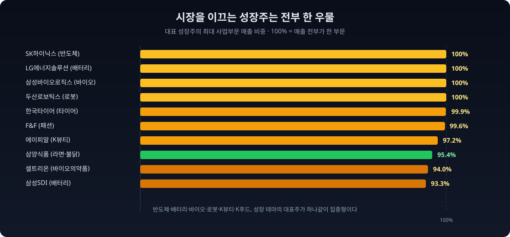
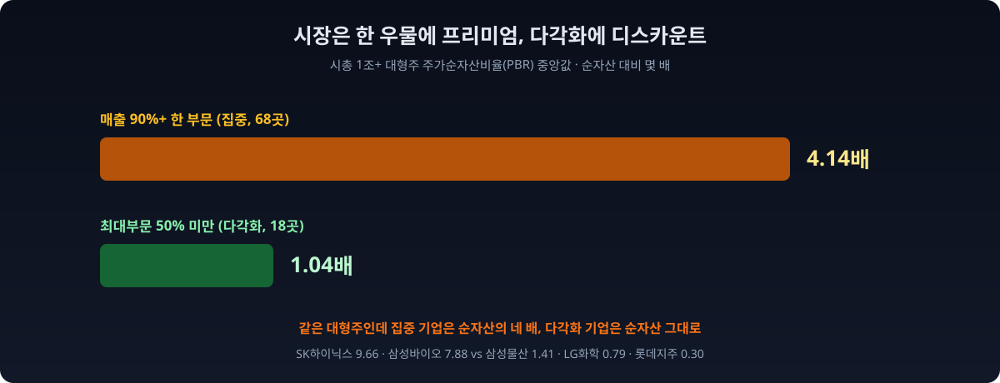
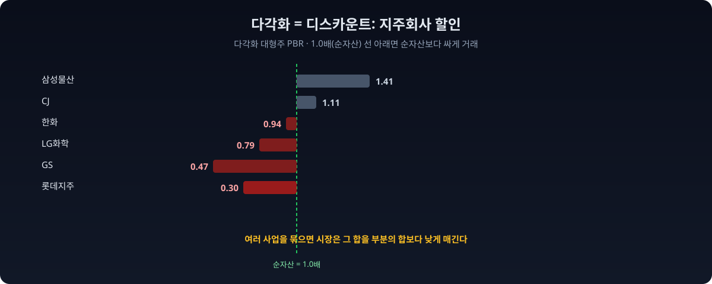
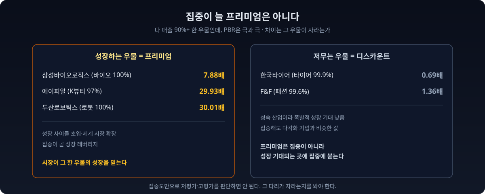

한국 대기업 하면 흔히 떠오르는 이미지는 "문어발"이다. 하나의 그룹이 반도체부터 건설, 화학, 유통, 금융까지 손을 뻗은 다각화. 그런데 실제 상장사의 매출 구성을 전수로 세어보면 정반대 그림이 나온다. **오늘 한국 증시를 이끄는 대장주들은 거의 전부 한 우물만 판다.**

dartlab으로 전상장사의 사업부문별 매출을 집계했다. 사업보고서에 부문 매출을 공시한 **1,245곳** 중, **매출의 90% 이상이 단 하나의 부문에서 나오는 곳이 654곳**이었다. 전체의 절반이 넘는다. 매출 집중도의 **중앙값은 92%**. 즉 상장사의 절반은 매출의 92% 이상을 한 부문에서 낸다. 반대로 어느 부문도 매출의 절반을 넘지 않는 진짜 다각화 기업은 **단 101곳(8%)** 뿐이었다.



문어발 다각화라는 인상은 사실 하나의 그룹이 여러 계열사로 나뉘어 각각 상장돼 있기 때문에 생긴 착시에 가깝다. 개별 상장사 하나하나를 뜯어보면, 그 대부분은 한 사업에 집중된 회사다. 여기까지는 "소형사는 원래 한 제품이겠지"라고 넘길 수 있다. 그런데 시가총액 1조원이 넘는 대형주 156곳만 봐도 **68곳(44%)이 매출 90% 이상을 한 부문에서** 낸다. 그리고 결정적인 반전이 있다. **시장은 이 한 우물 대형주에 주가순자산비율 4.14배를, 다각화한 대형주에 1.04배를 매긴다.** 집중이 프리미엄이고, 다각화가 디스카운트다. 이 글은 그 프리미엄이 무엇이고, 언제 리스크로 뒤집히는지에 관한 이야기다.

## 대장주는 다 한 우물이다

지금 시장이 가장 비싸게 값을 매기는 성장주들을 이름으로 불러보자. 전부 매출이 한 부문에 쏠려 있다.

- **SK하이닉스**: 반도체 100%
- **LG에너지솔루션**: 배터리 100%
- **삼성바이오로직스**: 바이오 위탁생산 100%
- **셀트리온**: 바이오의약품 94%
- **삼성SDI**: 배터리 93%
- **에이피알**: 뷰티 97%
- **두산로보틱스**: 로봇 100%
- **삼양식품**: 라면 등 면·스낵 95%
- **한국타이어**: 타이어 99.9%
- **F&F**: 패션 99.6%



이 집중도와 프리미엄은 코드 몇 줄로 나란히 볼 수 있다. 매출 집중도가 높은 순으로 대형주를 늘어놓고 PBR을 붙이면, 한 우물과 높은 값이 함께 간다는 게 드러난다.

```python
# 시총 1조+ 대형주: 매출 집중도 높은 순 + PBR
big = d.filter(pl.col("시가총액") > 5e12).sort("topSharePct", descending=True)
print(big.select(["종목명", "topSharePct", "PBR"]).head(12))   # SK하이닉스 100/9.66 ...
```

반도체, 배터리, 바이오, 로봇, K뷰티, K푸드. 지금 시장을 이끄는 성장 테마의 대표주가 하나같이 매출의 90~100%를 한 부문에서 낸다. 이건 우연이 아니다. 시장이 열광하는 성장 스토리는 본질적으로 **한 곳에 모든 것을 건 집중 베팅**이기 때문이다. SK하이닉스는 메모리 반도체 사이클에, LG에너지솔루션은 전기차 배터리 수요에, 삼양식품은 불닭볶음면의 세계적 인기에 회사의 운명을 걸었다. 그 한 우물이 터지면 폭발적으로 성장하고, 시장은 거기에 높은 값을 매긴다.

## 시장은 집중에 프리미엄을, 다각화에 디스카운트를 매긴다

숫자로 보면 이 프리미엄이 얼마나 큰지 분명해진다. 시가총액 1조원이 넘는 대형주를 매출 집중도로 나눠 주가순자산비율(PBR, 주가가 회사의 순자산 대비 몇 배인지)의 중앙값을 재면 이렇다.



| 구분 (시총 1조+) | 회사 수 | PBR 중앙값 |
|---|---:|---:|
| 매출 90% 이상 한 부문 (집중) | 68 | **4.14배** |
| 매출 50% 미만 최대부문 (다각화) | 18 | **1.04배** |

표시: PBR = 주가 ÷ 주당순자산. 1배면 순자산만큼, 4배면 순자산의 네 배로 거래된다는 뜻.

**같은 대형주인데 집중 기업은 순자산의 네 배, 다각화 기업은 순자산 그대로 거래된다.** 개별로 봐도 극명하다. 집중 성장주는 SK하이닉스 9.66배, 삼성바이오로직스 7.88배, 에이피알 29.93배, 두산로보틱스 30.01배로 순자산을 훌쩍 넘어선다. 반면 다각화한 대기업은 삼성물산 1.41배, LG화학 0.79배, 한화 0.94배, CJ 1.11배, GS 0.47배로 순자산 근처이거나 그 아래다. 롯데지주는 0.30배, 즉 순자산의 3분의 1도 안 되는 값에 거래된다.



이 다각화 디스카운트에는 이름이 있다. **지주회사 할인**이다. 여러 사업을 거느린 지주회사와 복합기업은 오랫동안 [보유 순자산 대비 30~60% 낮게 거래돼](https://www.m-i.kr/news/articleView.html?idxno=1384346) 왔고, 이는 복잡한 지배구조, 낮은 주주환원, 자본배분의 비효율에서 비롯된다는 게 [증권가의 오랜 분석](https://www.tossbank.com/articles/koreadiscount)이다. 여러 사업을 묶어두면 시장은 그 합을 부분의 합보다 낮게 매긴다. 반대로 한 사업에 집중한 회사는 그 사업의 성장 스토리가 온전히 주가에 반영된다. [자산 구조를 읽는 법](/blog/revenue-structure-how-to-read)에서 매출 구성이 왜 중요한지 짚었듯, 매출이 한 다리로 서 있는지 여러 다리로 서 있는지가 밸류에이션을 가른다.

> **이 리포트가 숫자를 만든 방법 (읽고 넘어가도 되는 방법론)**
>
> - **표본** = 사업보고서에 사업부문별 매출을 공시한 상장사 1,245곳(전체의 약 절반). 부문 매출을 별도로 나누지 않는 회사는 집계에서 빠졌다.
> - **집중도(topSharePct)** = 가장 큰 사업부문의 매출 비중. 이 값이 90% 이상이면 사실상 한 부문에 매출이 쏠린 것이다.
> - **부문 라벨보다 비중을 쓴다.** 사업보고서의 부문 이름은 회사마다 표기가 제각각이라(넓게 묶거나 오분류된 경우가 있다), 이 글은 부문 이름이 아니라 집중도(비중)만 census 지표로 쓰고, 실명 사례는 실제 사업 내용으로 재확인했다.
> - **PBR** = 최근 종가 기준 주가순자산비율. 집중과 다각화의 PBR 비교는 시가총액 1조원 이상 대형주로 한정했다(집중 68곳, 다각화 18곳).
> - **기준 시점** = 데이터 기준 2026-07-05 dartlab.

## 전상장사에 물었다: 중앙값 92%

dartlab은 사업보고서의 매출 및 수주 상황 표에서 전상장사의 사업부문별 매출을 파싱해 한 번에 읽는다. 언론이 몇몇 회사의 사업 구조를 개별로 다루는 것을, 우리는 전종목의 매출 집중도로 한 장에 펼친다.

```python
import dartlab
import polars as pl

s = dartlab.scan("salesByProduct")               # 전상장사 사업부문별 매출 비중
val = dartlab.scan("valuation").select(["종목코드", "시가총액", "PBR"])
d = s.join(val, on="종목코드", how="left")

print(d.height)                                   # 1245 (부문 공시 표본)
print(round(d["topSharePct"].median(), 1))        # 92.1 (매출 집중도 중앙값)
print(d.filter(pl.col("topSharePct") >= 90).height)  # 654 (한 부문 90%+)
print(d.filter(pl.col("topSharePct") < 50).height)   # 101 (다각화)
```

집계를 정리하면 이렇다.

| 매출 집중도 (최대부문 비중) | 회사 수 | 비고 |
|---|---:|---|
| 부문 매출 공시 표본 | 1,245 | 집계 대상 |
| 90% 이상 (사실상 한 부문) | **654** | **표본의 53%** |
| 80% 이상 | 778 | 62% |
| 50% 미만 (진짜 다각화) | 101 | 8% |
| 시총 1조+ 중 90% 이상 | 68 / 156 | 대형주의 44% |

읽는 법은 이렇다. **매출이 여러 부문에 고르게 퍼진 다각화 기업은 상장사의 8%에 불과하다.** 나머지는 정도의 차이일 뿐 한 부문에 매출이 쏠려 있고, 그 절반 이상은 90%가 넘는다. "한국 기업은 문어발"이라는 통념과 달리, 실제 상장사의 매출 구조는 압도적으로 집중형이다. 특히 지금 시장을 이끄는 성장주일수록 더 그렇다.

## 집중은 프리미엄이자 리스크다

한 우물이 프리미엄을 받는 이유는 명확하다. 그 사업의 성장이 온전히 주가에 반영되고, 경영진의 역량이 분산되지 않으며, 투자자가 회사를 이해하기 쉽다. 하지만 같은 이유가 리스크가 된다. **완충장치가 없다.** 그 한 부문의 사이클이 꺾이면, 회사 전체가 함께 흔들린다.

삼양식품이 이 양면성을 가장 잘 보여준다. 불닭볶음면의 세계적 인기로 면·스낵이 매출의 90%를 넘겼고, 그 집중이 폭발적 성장을 만들었다. 그런데 언론은 이를 [불닭이 만든 호황이자 불닭이 키운 리스크](https://www.industrynews.co.kr/news/articleView.html?idxno=79716)라고 부른다. 매출이 [불닭 하나에 쏠려 있어](https://www.bloter.net/news/articleView.html?idxno=662990), 소비 트렌드가 바뀌거나 수출망에 차질이 생기면 회사 전체 실적이 크게 흔들릴 수 있다는 것이다. 후속 제품이 아직 존재감을 못 내는 상황이라 [브랜드 의존이 뇌관](https://www.youthdaily.co.kr/news/article.html?no=217140)이라는 지적도 나온다. 폭발적 성장의 엔진과 가장 큰 취약점이 같은 하나, 불닭이다.

반도체도 마찬가지다. SK하이닉스는 메모리 반도체 100% 집중으로 호황기에 폭발하지만, 메모리 사이클이 꺾이면 회사 전체가 적자로 돌아선다. 실제로 2023년 메모리 불황기에 SK하이닉스는 조 단위 적자를 냈다. 다각화된 회사라면 다른 사업이 완충 역할을 했겠지만, 한 우물 회사는 그 완충이 없다. **집중은 상승장에서 프리미엄의 이유이고, 하강장에서 낙폭의 이유다.**

한 우물이 저물면 어떻게 되는지는 디스플레이 산업이 보여준다. 한때 프리미엄을 받던 디스플레이 집중 기업들은, 중국의 대규모 증설로 액정표시장치(LCD) 가격이 무너지자 다른 사업으로 피할 곳이 없어 몇 해에 걸쳐 대규모 적자를 냈다. 매출의 100%가 한 부문이라는 건, 그 부문의 업황이 곧 회사의 운명이라는 뜻이다. 반대로 여러 다리로 선 회사는 한 사업이 부진해도 다른 사업이 버텨준다. 다각화가 디스카운트를 받는 대신 얻는 게 바로 이 안정성이다. 그래서 집중과 다각화의 선택은 단순히 좋고 나쁨이 아니라, **높은 성장 잠재력과 높은 변동성을 맞바꾸느냐, 낮은 변동성과 낮은 밸류에이션을 맞바꾸느냐의 문제**다. 투자자가 봐야 할 건 회사가 어느 쪽을 택했는지, 그리고 지금 그 선택이 유리한 국면인지다.

## 집중이 늘 프리미엄은 아니다

다만 데이터를 정직하게 읽으면, 집중 자체가 프리미엄을 보장하지는 않는다. 같은 90% 이상 집중 기업 안에서도 PBR은 극과 극이다.



삼성바이오로직스(집중 100%, PBR 7.88)나 에이피알(97%, 29.93)은 높은 프리미엄을 받지만, 한국타이어(99.9%, PBR 0.69)와 F&F(99.6%, 1.36)는 똑같이 한 우물인데도 순자산 근처에서 거래된다. 차이는 무엇일까. **시장이 그 한 우물의 성장을 믿느냐다.** 타이어와 패션은 성숙 산업이라 집중해도 폭발적 성장을 기대하기 어렵고, 반도체·배터리·바이오·뷰티는 성장 사이클의 초입이거나 세계 시장 확장 국면이라 집중이 곧 성장 레버리지가 된다. 즉 프리미엄은 "집중"이 아니라 "성장이 기대되는 곳에 집중"에 붙는다. 성숙 산업에 집중한 회사는 오히려 다각화 기업과 비슷한 디스카운트를 받는다.

그래서 집중도만으로 저평가나 고평가를 판단하면 안 된다. 집중도는 그 회사가 얼마나 한 다리로 서 있는지를 보여줄 뿐이고, 그 다리가 성장하는 다리인지 저무는 다리인지는 [매출이 늘어도 위험할 수 있는지](/blog/why-rising-sales-can-still-be-risky)를 따로 봐야 안다. [사업부문 정보를 읽는 법](/blog/segment-reporting-interpretation)이 필요한 이유다.

## 왜 이 숫자를 봐야 하나

성장주를 볼 때 대부분은 매출 성장률과 이익만 본다. 하지만 그 매출이 **한 다리로 서 있는지, 여러 다리로 서 있는지**는 성장률만큼 중요하다. 한 우물 회사는 그 우물이 마르면 대안이 없고, 그래서 높은 프리미엄에는 높은 변동성이 따라온다. PBR 30배인 두산로보틱스나 에이피알은 그 성장이 이어지는 한 정당하지만, 성장이 한 번 꺾이면 프리미엄이 통째로 무너진다.

반대편의 이야기도 있다. 다각화 디스카운트를 받는 옛 지주·복합기업들은, 밸류업과 상법 개정으로 [지배구조와 주주환원이 개선되면 할인율이 축소](https://www.tossbank.com/articles/koreadiscount)될 여지가 있다. 시장이 다각화를 무조건 싸게 매기던 관행이 바뀌는 국면이라면, PBR 1배 이하의 복합기업은 재평가 후보가 된다. 이건 [순현금이 시가총액보다 많은 저평가 회사](/blog/net-cash-above-market-cap)를 짚은 리포트가 겨눈 지점과도 통한다. 집중 성장주의 프리미엄과 다각화 기업의 디스카운트는 동전의 양면이고, 밸류업은 그 디스카운트 쪽을 흔들고 있다.

이건 [흑자인데 현금이 안 들어오는 회사](/blog/profit-without-cash)나 [실효세율이 극과 극인 회사](/blog/same-profit-different-tax)를 짚은 리포트와 같은 결이다. 하나의 숫자(성장률, 순이익, 명목세율, 그리고 이번엔 매출 집중도)만 보면 회사의 진짜 그림을 놓친다. 매출이 한 다리로 서 있는지를 같이 봐야, 그 프리미엄이 성장의 값인지 위험의 값인지 판단할 수 있다.

## 이렇게 읽으면 안 된다

데이터는 한 방향으로만 읽으면 위험하다. 이 집계가 **말하지 않는 것**을 분명히 해둔다.

- **"집중 = 좋음" 또는 "다각화 = 나쁨"이 아니다.** 집중은 성장 국면에서 레버리지이자 하강 국면에서 리스크다. 다각화는 안정성이자 디스카운트의 원인이다. 어느 쪽이 옳은지는 그 회사가 선 사이클에 달렸다.
- **높은 PBR이 곧 고평가가 아니다.** 집중 성장주의 PBR 4배는 그 성장이 이어지면 정당하다. 다만 성장이 꺾이면 프리미엄이 통째로 사라진다는 뜻이기도 하다.
- **부문 매출 표본은 전체의 절반이다.** 사업부문을 별도로 공시하지 않는 회사는 빠졌고, 부문 이름은 회사마다 표기가 달라 비중(집중도)만 지표로 썼다. 실명 사례는 실제 사업으로 재확인했다.
- **PBR 비교는 시총 1조+ 대형주 한정이다.** 집중 68곳과 다각화 18곳의 중앙값 비교라, 표본이 크지 않다. 소형주까지 넓히면 값이 달라질 수 있다.
- **집중도는 정적인 스냅샷이다.** 회사는 신사업으로 다각화를 시도하고(삼양식품의 건강기능식품처럼), 다각화 기업은 사업을 정리해 집중한다. 이 명단은 이 시점의 사진이다.

이 글의 결론은 "집중주를 사라" 또는 "다각화주를 사라"가 아니다. **"성장주를 볼 때 매출 성장률만 보지 말고, 그 매출이 한 다리로 서 있는지(집중도)와 시장이 거기에 매긴 프리미엄을 같이 봐라. 한 우물은 프리미엄의 이유이자, 그 우물이 마르면 완충이 없는 리스크의 이유다"**는 것이다. 당신이 들고 있는 성장주가 있다면, 그 회사의 사업보고서에서 매출이 몇 개의 부문에서 나오는지 한번 세어보라. 하나라면, 그 하나가 앞으로도 자랄 우물인지가 당신 투자의 거의 전부다.

## 직접 확인해보라

이 글의 모든 숫자는 누구나 재현할 수 있다. dartlab을 설치하고 아래 몇 줄이면 같은 654와 PBR 4배 프리미엄이 나온다.

```python
import dartlab
import polars as pl

s = dartlab.scan("salesByProduct")
val = dartlab.scan("valuation").select(["종목코드", "시가총액", "PBR"])
d = s.join(val, on="종목코드", how="left")

big = d.filter((pl.col("시가총액") > 1e12) & (pl.col("PBR") > 0))
hi = big.filter(pl.col("topSharePct") >= 90)      # 집중 대형주
lo = big.filter(pl.col("topSharePct") < 50)       # 다각화 대형주
print(round(hi["PBR"].median(), 2), hi.height)    # 4.14 68
print(round(lo["PBR"].median(), 2), lo.height)    # 1.04 18
```

검증 가능하지 않은 숫자는 신뢰할 이유가 없다. dartlab의 모든 집계는 공시 데이터에서 직접 나오고, 코드가 곧 방법론이다.

## 검증표

본문의 모든 강한 수치와 dartlab 호출을 대응시킨다. 이 표에 없는 숫자는 본문에 싣지 않았다.

| 본문 수치 | 산출 방법 | 결과 |
|---|---|---|
| 부문 매출 공시 표본 1,245 | `scan("salesByProduct")` | 1,245 |
| 매출 집중도 중앙값 92.1% | topSharePct 중앙값 | 92.1 |
| 90% 이상 집중 654곳 | topSharePct 90 이상 | 654 |
| 다각화(50% 미만) 101곳 | topSharePct 50 미만 | 101 |
| 시총 1조+ 중 90%+ 68/156 | 시총 1조 이상 필터 | 68 / 156 |
| 집중 대형주 PBR 중앙값 4.14 | 시총 1조+ & 90%+ PBR 중앙값 | 4.14 |
| 다각화 대형주 PBR 중앙값 1.04 | 시총 1조+ & 50% 미만 PBR 중앙값 | 1.04 |
| SK하이닉스 100%·PBR 9.66 등 실명 집중도 | `scan` 종목별 | 실측 |
| 삼성물산 1.41·LG화학 0.79·롯데지주 0.30 | `scan` 종목별 PBR | 실측 |
| 삼양식품 면·스낵 매출 비중·불닭 의존 리스크 | 인더스트리뉴스·블로터 | 외부 인용 |
| 지주 NAV 대비 30~60% 디스카운트 | 매일일보·토스뱅크 | 외부 인용 |

> **방법론** 데이터 출처: DART 사업보고서 매출 및 수주 상황 표(`scan salesByProduct`) + KRX 시가총액·PBR(`scan valuation`). 집계 단위: 부문 매출을 공시한 상장사 1,245곳. 집중도 = 최대 사업부문 매출 비중. PBR 비교는 시총 1조원 이상 대형주 한정. 재현: `dartlab.scan(...)`. 데이터 기준 2026-07-05.
>
> 본 글은 공시 데이터에 기반한 정보 제공이며, 특정 종목의 매수·매도를 권유하지 않는다. 집중과 다각화는 각각 프리미엄과 디스카운트의 이유일 뿐 좋고 나쁨을 단정하지 않는다.
