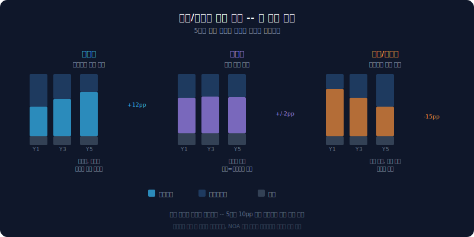
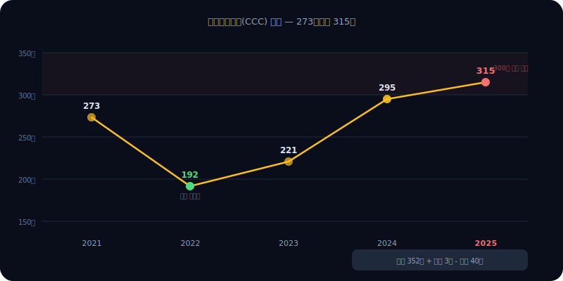
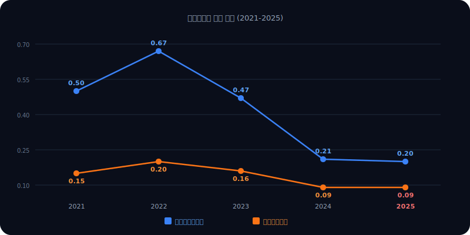

# 삼성SDI 자산 구조 분석 — 영업자산 56%, 배터리에 올인한 대차대조표

삼성SDI의 대차대조표는 5년 전과 다른 회사다. 2021년에는 자산의 44%가 영업자산, 40%가 비영업자산이었다. 투자자산과 현금을 많이 가진, 비교적 여유 있는 구조였다. 2025년에는 영업자산 56%, 비영업자산 31%다. 유형자산이 7.6조에서 19.2조로 2.5배 늘었다. 배터리 공장에 돈을 쏟아부은 결과다.

문제는 투자한 자산이 아직 매출을 만들어내지 못하고 있다는 점이다. 총자산회전율은 0.20에서 0.09로 반토막 났고, CCC(현금전환주기)는 315일이다. 1년 가까이 현금이 묶여 있다.

이 글은 [자금 구조 분석](/blog/samsung-sdi-funding-structure)의 후속이다. 자금 구조에서 "차입이 급증했다"는 사실을 확인했다면, 이 글에서는 "빌린 돈이 어디에 묶여 있는가"를 본다.


---

## dartlab으로 자산 구조 꺼내기

```python
import dartlab
c = dartlab.Company("006400")  # 삼성SDI
c.review("자산구조")
```

이 한 줄이면 영업/비영업 자산 재분류, NOA 시계열, 자산 구성 추이, CCC, 자산회전율까지 한 번에 나온다. 이 글에서 다루는 모든 숫자는 이 명령의 결과에서 나왔다.

---

## 왜 영업/비영업으로 나누는가

일반적인 대차대조표는 유동/비유동으로 나눈다. 1년 안에 현금화되는가 아닌가. 이 분류는 유동성(지급 능력)을 볼 때는 유용하지만, "이 회사가 사업에 얼마나 투자하고 있는가"를 보기에는 부족하다.

Penman의 Reformulated Balance Sheet는 자산을 **용도** 기준으로 나눈다.

| 분류 | 포함 항목 | 의미 |
|------|-----------|------|
| **영업자산** | 매출채권, 재고, 유형자산, 무형자산, 건설중인자산 | 사업 운영에 직접 투입된 자산 |
| **비영업자산** | 현금, 금융자산, 투자자산 | 사업과 직접 관련 없는 자산 |
| **NOA** | 영업자산 - 영업부채 | 순영업자산 — ROIC의 분모 |

영업자산 비중이 높다는 건 사업에 돈이 많이 묶여 있다는 뜻이다. 비영업자산 비중이 높다는 건 여유 자금이 많다는 뜻이다. 두 비중의 변화가 회사의 전략 방향을 말해준다.

---

## 5년간 영업자산 비중 변화 — 44%에서 56%로

| 연도 | 영업자산 | 비영업자산 | NOA |
|------|----------|-----------|------|
| 2021 | 44% | 40% | 10.5조 |
| 2022 | 45% | 38% | 12.1조 |
| 2023 | 49% | 34% | 15.0조 |
| 2024 | 54% | 30% | 20.7조 |
| 2025 | 56% | 31% | 22.3조 |

2021년에는 영업자산과 비영업자산이 거의 균형이었다. 투자자산(관계기업, 금융자산)을 많이 보유한 복합형 구조였다. 2023년부터 영업자산이 50%를 넘기 시작하고, 2025년에는 56%다.

NOA는 10.5조에서 22.3조로 2.1배 성장했다. 이 기간 매출은 크게 늘지 않았다. 자산이 먼저 투입되고, 매출은 아직 따라오지 못하는 구조다.



---

## 유형자산 2.5배 성장 — 배터리 투자의 무게

자산 구성의 핵심 변화를 항목별로 보면 더 선명하다.

| 항목 | 2021 | 2025 | 변화 |
|------|------|------|------|
| **유형자산** | 7.6조 | 19.2조 | +153% (2.5배) |
| **투자자산** | 7.9조 | 11.4조 | +44% |
| **재고자산** | 2.5조 | 2.9조 | +16% |
| **현금** | 2.3조 | 1.8조 | -22% |
| **매출채권** | — | 370억 | 매우 작음 |

유형자산이 압도적이다. 7.6조에서 19.2조로, 5년간 11.6조가 늘었다. 헝가리 괴드, 미국 공장 등 배터리 생산라인 투자가 여기에 집중됐다.

반면 현금은 2.3조에서 1.8조로 줄었다. 투자자산(관계기업 지분 등)은 44% 늘었지만, 유형자산 증가분(+11.6조)에 비하면 부수적이다. 재고도 거의 제자리다.


매출채권이 370억밖에 안 되는 건 삼성SDI의 사업 구조 때문이다. 주요 고객이 삼성그룹 계열사와 대형 자동차 OEM이다. 결제가 빠르거나 선수금 구조로 운영된다. 채권이 적다는 건 외상 위험은 낮지만, CCC를 해석할 때 매출채권이 아니라 재고에 주목해야 한다는 뜻이기도 하다.

---

## CCC 315일 — 현금이 1년 가까이 묶인다

CCC(Cash Conversion Cycle)는 원재료 구매부터 현금 회수까지 걸리는 시간이다.

| 연도 | 재고회전일수 | 매출채권회전일수 | 매입채무회전일수 | CCC |
|------|------------|----------------|----------------|-----|
| 2021 | 318 | 3 | 48 | 273 |
| 2022 | 221 | 2 | 31 | 192 |
| 2023 | 249 | 3 | 31 | 221 |
| 2024 | 337 | 2 | 44 | 295 |
| 2025 | 352 | 3 | 40 | 315 |

CCC 315일은 대부분의 산업에서 비정상적으로 길다. 하지만 배터리 산업의 맥락이 있다.

**재고 352일의 의미.** 배터리 셀 제조는 원재료(양극재, 음극재, 전해질) 조달부터 완제품 출하까지 리드타임이 길다. 여기에 대규모 증설 중이라 원재료 선행 확보 물량이 재고에 포함된다. 2022년에 221일로 줄었다가 다시 352일로 늘어난 건 투자 확대기의 재고 누적 효과다.

**매출채권 3일.** 앞서 본 대로 채권이 거의 없다. CCC를 줄이려면 재고를 줄이는 수밖에 없는 구조다.

**매입채무 40일.** 결제 조건이 크게 변하지 않았다.



2022년 CCC 192일은 매출이 가장 좋았던 시기와 일치한다. 재고가 빠르게 소진됐다. 2024~2025년의 300일 이상은 매출 둔화 + 재고 누적이 겹친 결과다.

---

## 자산회전율 하락 — 투자는 늘고 매출은 멈췄다

| 연도 | 총자산회전율 | 유형자산회전율 |
|------|------------|---------------|
| 2021 | 0.15 | 0.50 |
| 2022 | 0.20 | 0.67 |
| 2023 | 0.16 | 0.47 |
| 2024 | 0.09 | 0.21 |
| 2025 | 0.09 | 0.20 |

총자산회전율 0.09는 자산 1원이 0.09원의 매출을 만든다는 뜻이다. 2022년 0.20에서 2025년 0.09로, 55% 하락했다. 유형자산회전율도 0.67에서 0.20으로 70% 하락했다.

이것은 두 가지로 읽힌다.

**투자 확대기의 자연스러운 현상.** 배터리 공장은 착공부터 양산까지 2~3년 걸린다. 건설중인자산이 유형자산으로 전환되면 분모(자산)는 즉시 늘지만, 분자(매출)는 양산이 본격화돼야 따라온다. J-curve 효과다.

**효율 악화의 징후.** 다만 2024~2025년 연속으로 0.09에 머문 건 주의가 필요하다. 투자한 자산이 매출로 전환되는 속도가 예상보다 느리다는 신호일 수 있다. 배터리 시장 수요 둔화, 특히 유럽 전기차 보조금 축소와 맞물려 있다.



---

## CAPEX 추이 — 투자는 줄이기 시작했나

| 연도 | CAPEX |
|------|-------|
| 2021 | 5,892억 |
| 2022 | 8,175억 |
| 2023 | 1.6조 |
| 2024 | 2.3조 |
| 2025 | 6,694억 |

2024년 2.3조 정점 이후 2025년 6,694억으로 급감했다. 두 가지 가능성이 있다. 하나는 대형 공장 건설이 일단락된 것이고, 다른 하나는 영업이익 적자 상황에서 투자를 축소한 것이다. 아마 둘 다다.

CAPEX가 줄면 향후 유형자산 증가 속도도 둔화된다. 기존에 투입된 자산이 양산에 돌입하면서 회전율이 개선될 여지가 생긴다. 반대로, 경쟁사(CATL, LG에너지솔루션)가 계속 투자하는 상황에서 투자를 줄이면 시장 점유율이 밀릴 수도 있다.

---

## 무엇을 봐야 하는가

삼성SDI의 자산 구조가 말하는 건 명확하다. **배터리 사업에 올인했고, 아직 회수 단계에 진입하지 못했다.**

1. **영업자산 56%** — 자산의 절반 이상이 사업에 묶여 있다. 여유 자금(비영업자산)은 계속 줄었다
2. **유형자산 19.2조** — 5년간 2.5배. 배터리 공장 투자가 대차대조표를 지배한다
3. **CCC 315일** — 현금이 1년 가까이 묶인다. 재고 352일이 핵심 병목이다
4. **회전율 0.09** — 투입된 자산이 아직 매출을 만들지 못하고 있다
5. **CAPEX 감소 시작** — 투자 정점은 지났을 수 있다. 이제 회수가 관건이다

이 구조에서 가장 중요한 변수는 배터리 시장 수요 회복 시점이다. 양산이 본격화되면 회전율이 개선되고, CCC가 줄고, 영업이익이 흑자로 전환된다. 그때까지는 [자금 구조](/blog/samsung-sdi-funding-structure)에서 본 차입 의존이 계속될 수밖에 없다.

---

## 시리즈 안내

이 글은 **실전기업분석** 시리즈 4편이다. 같은 회사를 각도만 바꿔가며 분석한다.

- 1편: [수익 구조 읽기](/blog/revenue-structure-how-to-read) — 프레임워크
- 2편: [삼성SDI 수익 구조](/blog/samsung-sdi-revenue-structure) — 배터리 올인의 명과 암
- 3편: [삼성SDI 자금 구조](/blog/samsung-sdi-funding-structure) — 차입 급증의 의미
- **4편: 삼성SDI 자산 구조** — 영업자산 56%의 무게 (이 글)

다음은 비용 구조와 현금흐름 분석으로 이어진다. 자산이 얼마나 투입됐는지를 봤으니, 이제 "투입된 자산이 실제로 현금을 만들어내는가"를 본다.

---

<details>
<summary>FAQ</summary>

**Q. 영업자산 56%면 높은 편인가?**

산업에 따라 다르다. 반도체·배터리처럼 대규모 설비 투자가 필요한 업종은 60~70%도 흔하다. 삼성SDI의 56%가 주목할 만한 건 5년 전 44%에서 +12pp 급등했다는 추세 때문이다. 투자 전략이 근본적으로 바뀌었다는 신호다.

**Q. CCC 315일이면 비정상인가?**

일반 제조업에서는 비정상이다. 하지만 배터리 셀 제조는 원래 CCC가 길다. 원재료 조달 리드타임, 제조 공정 시간, 대형 고객의 납품 구조가 겹친다. 다만 같은 배터리 업종 내에서도 CATL이나 BYD보다 긴 편인지는 별도 비교가 필요하다.

**Q. 자산회전율 0.09는 위험 신호인가?**

그 자체로 위험은 아니다. 대규모 설비 투자 직후에는 자연스럽게 낮아진다. 문제는 2년 연속 개선 없이 0.09에 머문 점이다. 양산이 본격화되면 0.15~0.20 수준으로 회복되어야 정상이다. 2~3년 내에 개선되지 않으면 과잉 투자 징후로 봐야 한다.

**Q. dartlab에서 다른 회사도 같은 분석을 할 수 있나?**

```python
import dartlab
c = dartlab.Company("373220")  # 종목코드만 바꾸면 됨
c.review("자산구조")
```

어떤 상장사든 종목코드만 넣으면 동일한 영업/비영업 재분류, NOA 시계열, CCC, 회전율을 볼 수 있다.

</details>
