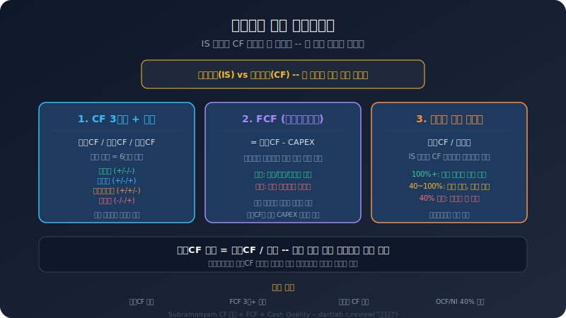
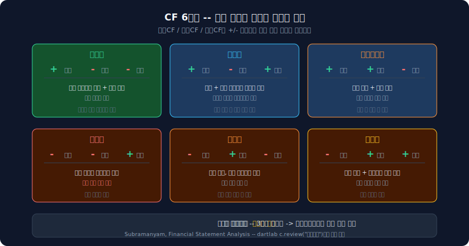
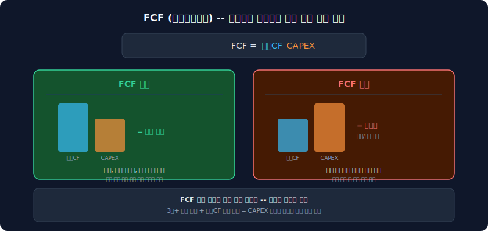
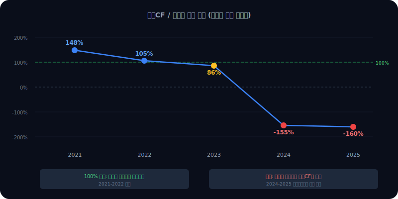

# 삼성SDI 현금흐름 분석 — 이익이 나도 현금이 안 남는 구조

손익계산서에서 이익이 나와도 현금이 안 들어오면 의미가 없다. 삼성SDI는 2021년부터 2024년까지 매년 영업활동에서 현금을 만들었지만, 한 번도 자유현금흐름(FCF)이 양수였던 적이 없다. CAPEX가 항상 영업CF를 초과했다. 배터리 공장에 쏟아붓는 투자가 벌어들이는 현금보다 컸다.

2025년에는 더 큰 변화가 생겼다. 4년간 유지한 확장형 CF 패턴이 구조조정형으로 전환됐다. 투자를 줄이고 빚을 갚는 구조로 바뀌었다는 뜻이다.

이 글은 [자금 구조 분석](/blog/samsung-sdi-funding-structure)의 후속이다. 자금 구조에서 "차입이 늘고 유보가 줄었다"는 사실을 확인했다면, 이 글에서는 "그 돈이 실제로 어떻게 흘러가는가"를 본다.



---

## dartlab으로 현금흐름 꺼내기

```python
import dartlab
c = dartlab.Company("006400")  # 삼성SDI
c.review("현금흐름")
```

이 한 줄이면 CF 3구간 시계열, FCF 추이, 영업CF 마진, 이익의 현금 뒷받침 비율, CF 패턴 판정까지 한 번에 나온다. 이 글에서 다루는 모든 숫자는 이 명령의 결과에서 나왔다.

---

## 현금흐름 3구간이란 무엇인가

현금흐름표는 세 구간으로 나뉜다. 이 세 구간의 부호 조합이 회사의 현금 순환 구조를 말해준다.

| 구간 | 의미 | 삼성SDI (2025) |
|------|------|----------------|
| **영업활동** | 본업에서 번 현금 | +3,322억 |
| **투자활동** | 설비·자산에 쓴 현금 | +828억 |
| **재무활동** | 차입·상환·배당 | -8,009억 |

영업활동에서 현금이 들어오고, 투자활동에서 나가고, 재무활동에서 부족분을 조달하거나 잉여분을 상환하는 것이 일반적인 흐름이다. 하지만 부호 조합은 회사마다, 시기마다 다르다.

---

## CF 패턴 — 부호 조합이 말하는 것

세 구간의 부호(+/-)를 조합하면 6가지 패턴이 나온다. Subramanyam의 *Financial Statement Analysis*에서 제시하는 분류법이다.

| 패턴 | 영업 | 투자 | 재무 | 의미 |
|------|------|------|------|------|
| **성숙형** | + | - | - | 자체 현금으로 투자하고 빚도 갚는다 |
| **확장형** | + | - | + | 외부 자금까지 동원해 공격적으로 투자한다 |
| **구조조정형** | + | + | - | 자산을 팔고 빚을 줄인다 |
| 축소형 | - | + | - | 영업 적자, 자산 매각으로 상환 |
| 위기형 | - | - | + | 영업 적자인데 빚으로 투자 |
| 긴급형 | - | + | + | 자산 팔고 빚도 늘림 |

가장 건강한 구조는 성숙형이다. 본업에서 번 돈으로 투자하고 부채도 줄인다. 확장형은 성장기 기업에게 자연스럽다. 문제는 확장형이 오래 지속되면서 FCF 적자가 누적될 때다.

---

## 삼성SDI 5년 — 확장형에서 구조조정형으로

| 연도 | 영업CF | 투자CF | 재무CF | CAPEX | 패턴 |
|------|--------|--------|--------|-------|------|
| 2021 | +5,804억 | -5,774억 | +6,094억 | 5,892억 | 확장형 |
| 2022 | +6,636억 | -1.2조 | +1,015억 | 8,175억 | 확장형 |
| 2023 | +4,257억 | -1.0조 | +7,700억 | 1.6조 | 확장형 |
| 2024 | +3,757억 | -2.3조 | +2.1조 | 2.3조 | 확장형 |
| 2025 | +3,322억 | +828억 | -8,009억 | 6,694억 | **구조조정형** |

2021~2024년은 전형적인 확장형이다. 영업에서 현금을 벌고(+), 그보다 훨씬 많은 투자를 하고(-), 부족분을 외부에서 조달했다(+). 배터리 공장 건설(헝가리, 미국)에 매년 수조 원을 쏟아부었다.

2025년에 패턴이 바뀌었다. 투자CF가 양수(+828억)로 전환됐다. CAPEX 자체는 6,694억으로 여전히 크지만, 투자 회수분이 이를 상쇄한 것이다. 동시에 재무CF가 -8,009억으로 돌아섰다. 빚을 갚기 시작했다.



구조조정형 전환을 어떻게 읽어야 하나. 두 가지 해석이 가능하다.

첫째, 긍정적 해석. 과도한 확장을 멈추고 재무 건전성 회복에 나선 것이다. [자금 구조 분석](/blog/samsung-sdi-funding-structure)에서 확인했듯 차입 비중이 26%까지 올라갔고 이자보상배율이 -1.6배였다. 더 이상의 차입은 위험하다는 판단이다.

둘째, 부정적 해석. 배터리 시장 회복이 늦어지면서 투자를 줄일 수밖에 없었다. 자발적 선택이 아니라 강제된 전환이다. 경쟁사가 투자를 계속하는 상황에서 삼성SDI만 속도를 줄이면 시장 점유율에 영향이 간다.

현실은 아마 둘 다다. 재무 부담을 줄여야 하는 것도 사실이고, 시장 상황이 허락하지 않는 것도 사실이다.

---

## FCF 5년 연속 적자 — 배터리 투자의 대가

자유현금흐름(FCF)은 영업CF에서 CAPEX를 뺀 것이다. 본업에서 번 현금으로 투자까지 감당하고 남는 돈이다. 이것이 양수여야 배당, 부채 상환, 추가 투자의 여력이 생긴다.

| 연도 | 영업CF | CAPEX | FCF |
|------|--------|-------|-----|
| 2021 | 5,804억 | 5,892억 | **-88억** |
| 2022 | 6,636억 | 8,175억 | **-1,540억** |
| 2023 | 4,257억 | 1.6조 | **-1.2조** |
| 2024 | 3,757억 | 2.3조 | **-1.9조** |
| 2025 | 3,322억 | 6,694억 | **-3,372억** |

5년 연속 FCF 적자다. 2023~2024년에 CAPEX가 1.6조, 2.3조로 급증하면서 적자 폭이 커졌다. 2025년에 CAPEX를 6,694억으로 줄였지만, 영업CF도 3,322억으로 줄어서 FCF는 여전히 -3,372억이다.



FCF 적자가 반드시 나쁜 것은 아니다. 성장기 기업은 미래 수익을 위해 현재 현금을 소진한다. 문제는 **기간**이다. 5년 연속은 길다. 그리고 영업CF 자체가 감소 추세라서, CAPEX를 줄이지 않으면 FCF가 개선될 경로가 보이지 않는다.

2025년에 CAPEX를 전년 대비 70% 가까이 줄인 것은 이 현실을 반영한 결정이다. 하지만 배터리 사업은 규모의 경제가 핵심이다. 투자를 줄이는 것이 장기적으로 더 큰 비용이 될 수 있다.

---

## 영업CF/순이익 — 이익과 현금의 괴리

영업CF/순이익 비율은 손익계산서의 이익이 실제 현금으로 얼마나 뒷받침되는지를 보여준다. 100% 이상이면 이익만큼 현금이 들어왔다는 뜻이다.

| 연도 | 영업CF/순이익 | 해석 |
|------|---------------|------|
| 2021 | **148%** | 양호 — 이익 이상의 현금 유입 |
| 2022 | **105%** | 양호 — 이익과 현금 거의 일치 |
| 2023 | **86%** | 주의 — 이익의 14%가 현금 미유입 |
| 2024 | **-155%** | 이상 — 순이익 적자, 영업CF 양수 |
| 2025 | **-160%** | 이상 — 순이익 적자, 영업CF 양수 |

2021~2022년은 정상이다. 이익이 나고 그만큼 현금이 들어왔다. 2023년은 약간 벌어지기 시작했다.

2024~2025년이 흥미롭다. **순이익은 적자인데 영업CF는 양수**다. 비율이 음수인 이유는 분모(순이익)가 음수이기 때문이다.

어떻게 적자 회사에서 현금이 들어올 수 있는가. 답은 **감가상각비**다. 감가상각비는 손익계산서에서 비용으로 잡히지만 실제 현금 유출이 아니다. 과거에 투자한 설비의 가치를 장부에서 깎는 것일 뿐이다. 삼성SDI는 배터리 공장에 수조 원을 투자했고, 그 감가상각비가 매년 수천억 원이다. 이 비현금 비용이 손익에서는 적자를 만들지만, 현금흐름에서는 영업CF를 양수로 유지시킨다.

이것이 현금흐름 분석의 핵심이다. 손익계산서만 보면 "적자 회사"지만, 현금흐름표를 보면 "본업에서 현금은 벌고 있는 회사"다. [수익 구조 분석](/blog/samsung-sdi-revenue-structure)에서 확인한 영업이익 적자와 여기서 확인한 영업CF 양수의 차이가 정확히 이 지점이다.



---

## 영업CF 마진 — 매출 대비 현금 창출력

영업CF 마진은 매출 100원당 실제로 남는 현금이다. 영업이익률보다 현실적인 수익성 지표다.

| 연도 | 영업CF 마진 |
|------|-------------|
| 2021 | **15.2%** |
| 2022 | **11.1%** |
| 2023 | **7.6%** |
| 2024 | **10.0%** |
| 2025 | **8.6%** |

2021년 15.2%에서 2025년 8.6%로 거의 반감했다. 매출 100원당 현금이 15원에서 9원으로 줄었다.

2024년에 10.0%로 반등한 것은 운전자본 변동 효과다. 재고 축소나 매입채무 증가 같은 일시적 요인이 영업CF를 눌러올린 것이다. 2025년에 다시 8.6%로 하락한 것을 보면 구조적 개선은 아니었다.

영업CF 마진이 10% 미만이면 현금 창출력이 약해진 것이다. 삼성SDI의 매출 규모(2025년 3.8조)에서 8.6%면 영업CF 약 3,300억이다. CAPEX 6,694억의 절반도 안 된다.


---

## 3년 연속 감소하는 영업CF

영업CF 절대액을 보면 추세가 더 명확하다.

| 연도 | 영업CF |
|------|--------|
| 2021 | 5,804억 |
| 2022 | 6,636억 (최고점) |
| 2023 | 4,257억 |
| 2024 | 3,757억 |
| 2025 | 3,322억 |

2022년 6,636억을 정점으로 3년 연속 감소 중이다. 2025년은 2022년 대비 절반 수준이다.

영업CF가 줄어드는 이유는 두 가지다. 매출이 줄거나, 매출에서 현금으로 전환되는 비율이 떨어지거나. 삼성SDI는 둘 다다. [수익 구조 분석](/blog/samsung-sdi-revenue-structure)에서 확인했듯 매출 자체가 정체되고 있고, 영업CF 마진도 하락하고 있다.

영업CF가 계속 줄면 CAPEX를 더 줄이거나, 차입을 더 늘리거나, 둘 다 해야 한다. 2025년에 이미 CAPEX를 대폭 줄였지만 FCF는 여전히 적자다.

---

## 현금흐름이 말하는 삼성SDI의 위치

현금흐름 분석 결과를 종합하면 삼성SDI의 현재 위치가 보인다.

1. **본업에서 현금은 번다** — 영업CF 3,322억, 양수. 사업 자체가 현금을 소진하는 것은 아니다
2. **하지만 투자를 감당하지 못한다** — FCF 5년 연속 적자. 배터리 투자가 현금 창출을 초과
3. **이익과 현금의 괴리가 크다** — 순이익 적자지만 영업CF 양수. 감가상각비가 현금을 보존
4. **확장을 멈추고 구조조정에 진입했다** — 2025년 CF 패턴 전환. 투자 축소 + 부채 상환
5. **현금 창출력이 약해지고 있다** — 영업CF 마진 15.2% → 8.6%. 3년 연속 영업CF 감소

배터리 사업의 본질적 딜레마가 여기에 있다. 규모의 경제를 달성하려면 대규모 투자가 필수인데, 그 투자를 감당할 현금 창출력이 부족하다. 외부 자금(차입, 유상증자)으로 메웠지만, [자금 구조 분석](/blog/samsung-sdi-funding-structure)에서 확인했듯 차입 한도에 가까워지고 있다.

관건은 영업CF의 반등이다. 배터리 시장 회복으로 매출이 늘고 마진이 개선되면 영업CF가 올라가고, FCF가 양수로 전환되고, CF 패턴이 성숙형으로 이동할 수 있다. 그때까지 버틸 재무 여력이 있는지가 핵심 질문이다.

---

## 시리즈 안내

이 글은 **실전기업분석** 시리즈 5편이다. 같은 회사를 각도만 바꿔가며 분석한다.

- 1편: [수익 구조 읽기](/blog/revenue-structure-how-to-read) — 프레임워크
- 2편: [삼성SDI 수익 구조](/blog/samsung-sdi-revenue-structure) — 배터리 올인의 명과 암
- 3편: [삼성SDI 자금 구조](/blog/samsung-sdi-funding-structure) — 차입 급증의 의미
- **5편: 삼성SDI 현금흐름** — 이익이 나도 현금이 안 남는 구조 (이 글)

수익 구조에서 "무엇으로 돈을 버는가"를, 자금 구조에서 "돈을 어디서 가져오는가"를 봤다. 이 글에서는 "번 돈이 실제로 남는가"를 봤다. 세 편을 이어 읽으면 삼성SDI의 재무 전체 그림이 잡힌다.

---

<details>
<summary>FAQ</summary>

**Q. FCF 적자가 5년이면 심각한 것 아닌가?**

성장기 기업에서 FCF 적자는 흔하다. 아마존도 수년간 FCF 적자였다. 문제는 적자 기간이 길어질수록 외부 자금 의존도가 높아진다는 점이다. 삼성SDI는 이미 차입 비중 26%, 이자보상배율 -1.6배까지 왔다. FCF가 양수로 돌아서지 않으면 추가 차입이나 유상증자가 반복될 수밖에 없다.

**Q. 순이익 적자인데 영업CF 양수가 가능한 이유는?**

감가상각비 때문이다. 감가상각비는 손익계산서에서 비용으로 잡히지만, 현금이 실제로 나가지 않는다. 삼성SDI처럼 대규모 설비를 보유한 기업은 감가상각비가 수천억 원이다. 이 비현금 비용이 순이익에서는 적자를 만들지만, 현금흐름에서는 영업CF를 양수로 유지시킨다.

**Q. 구조조정형이면 회사가 어려운 것인가?**

구조조정형은 "투자를 줄이고 부채를 상환한다"는 뜻이다. 반드시 부정적인 것은 아니다. 과도한 확장 이후 재무 건전성을 회복하는 과정일 수 있다. 하지만 경쟁사가 투자를 계속하는 산업에서 혼자 줄이면 시장 점유율을 잃을 위험이 있다.

**Q. dartlab에서 다른 회사도 같은 분석을 할 수 있나?**

```python
import dartlab
c = dartlab.Company("005930")  # 종목코드만 바꾸면 됨
c.review("현금흐름")
```

어떤 상장사든 종목코드만 넣으면 동일한 CF 3구간, FCF, 영업CF 마진, CF 패턴 판정을 볼 수 있다.

</details>
