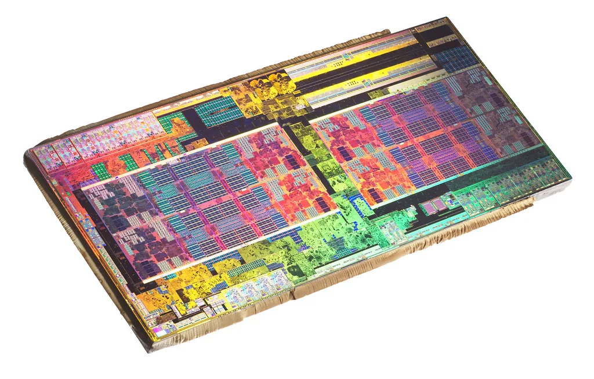
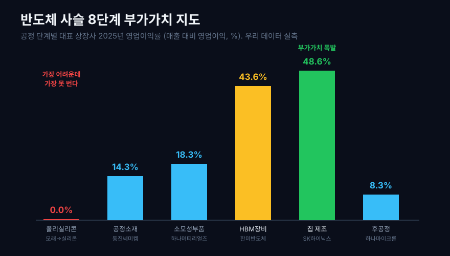
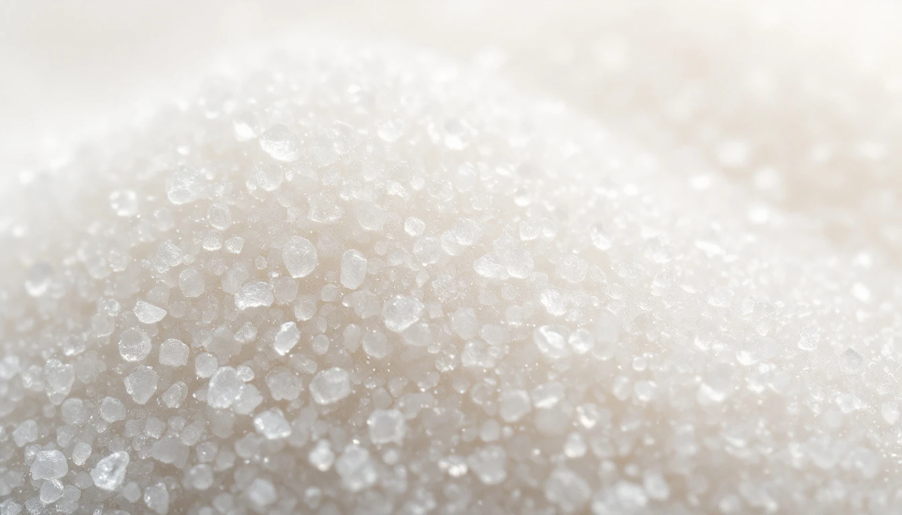
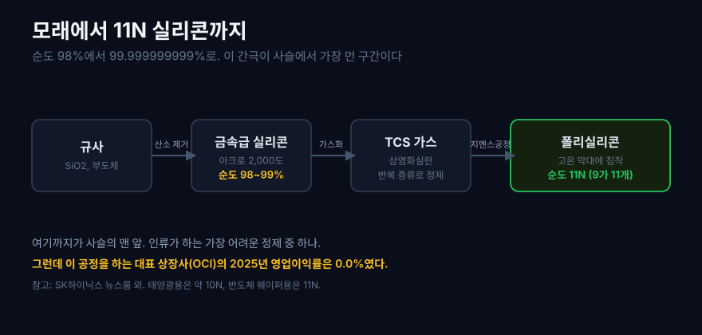
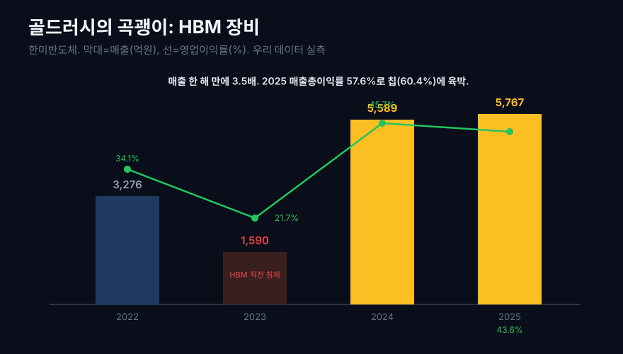
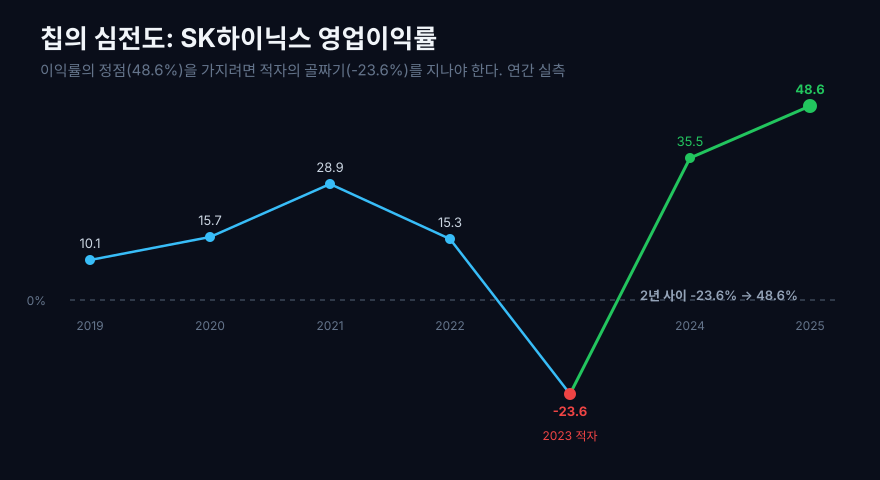
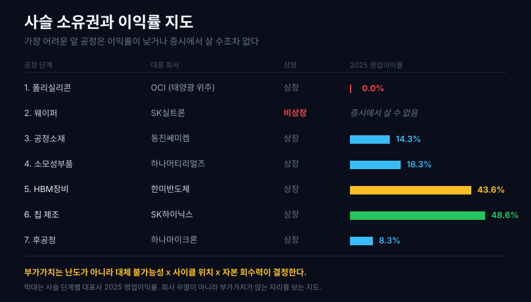

바닷가에서 한 줌 쥐면 손가락 사이로 흘러내리는 모래. 그 흔한 알갱이가 며칠 뒤 SK하이닉스의 메모리 칩이 되어, 같은 무게의 금보다 비싼 값에 팔린다. 규사(석영 모래, 이산화규소)는 지각에서 가장 흔한 광물 축에 들고 1kg에 몇 백원이지만, 그것으로 만든 반도체 웨이퍼 한 장은 수십만 원, 그 위에 얹힌 칩의 가치는 다시 수십 배로 뛴다.

그렇다면 질문 하나. **이 어마어마한 부가가치는 사슬의 어디서, 어느 회사가 가져가는가?** 상식대로라면 가장 어려운 일을 하는 회사가 가장 많이 벌어야 한다. 모래를 순도 99.999999999%(원자 10억 개 중 불순물 1개 이하)까지 정제하는 것은 인류가 상업적으로 하는 화학 공정 가운데 가장 어려운 축이다. 그러니 그 회사가 제일 잘 벌 것 같다.

우리 데이터로 8단계 사슬의 상장사 이익률을 직접 재봤더니, 정반대였다.



## 1. 모래 한 줌의 여정, 그리고 이상한 이익률 지도

먼저 결론이 되는 그림부터 보자. 규사에서 완성 칩까지 이어지는 공정을 8단계로 놓고, 각 단계를 대표하는 국내 상장사의 2025년 이익률을 실측한 것이다. 여기서 영업이익률은 매출 대비 영업이익 비율, 매출총이익률은 물건을 팔고 원가를 뺀 뒤 남는 비율(그 단계가 매긴 값의 힘)이다.



한눈에 이상한 점이 보인다. 사슬의 **맨 앞**, 모래를 고순도 실리콘으로 바꾸는 공정의 영업이익률이 사실상 0이다. 그런데 사슬을 따라 오른쪽으로 갈수록, 그리고 중간의 특정 지점에서 이익률이 솟구친다. 가장 물리적으로 어려운 정제가 가장 못 벌고, 그 실리콘 위에 회로를 새기는 칩과 그 칩을 만드는 데 필요한 특정 장비·소재가 이익을 쓸어간다.

이 글은 그 지도를 왼쪽 끝에서 오른쪽 끝까지 한 단계씩 걸으며, 기술의 원리와 우리 데이터를 나란히 놓는다. 걷다 보면 부가가치가 왜 이렇게 배분되는지, 그 규칙이 드러난다.

사슬 전체를 훑어본 첫 스크린은 `dartlab.scan`으로 떴다. 전 종목을 한 번에 세는 우리 데이터의 무기다.

```python
import dartlab
import polars as pl

# 반도체 사슬 상장사만 골라 이익률 지형을 본다
prof = dartlab.scan("profitability")   # 전 상장사 2,354곳 수익성 스크린
chain = ["456040", "005290", "166090", "042700", "000660", "067310"]
prof.filter(pl.col("종목코드").is_in(chain)).select("종목명", "영업이익률")
```

다만 `scan`의 이익률은 최신 분기를 포함한 근사 스크린이라, 사이클을 심하게 타는 반도체에서는 실제 연간 값과 벌어질 수 있다. 뒤에서 보겠지만 이 차이 자체가 하나의 교훈이다. 그래서 이 글의 모든 핵심 숫자는 `scan`이 아니라 손익계산서를 연간으로 합산한 실측으로 다시 계산했다.

## 2. 첫째 공정, 모래를 11N 실리콘으로: 가장 어려운데 가장 못 번다



규사는 이산화규소(SiO2)다. 실리콘과 산소가 붙어 있어 전기가 통하지 않는 부도체다. 반도체가 되려면 이 산소를 떼어내고, 실리콘만 극한까지 순수하게 뽑아야 한다.

첫 단계는 힘으로 한다. 규사를 탄소와 함께 전기 아크로에 넣고 약 2,000도로 가열하면 산소가 탄소와 결합해 날아가고, 순도 98~99%의 금속급 실리콘이 남는다([SK하이닉스 뉴스룸](https://news.skhynix.co.kr/silicone-from-sand/)). 여기까지는 쉽다. 문제는 그다음이다. 반도체용 실리콘은 순도 99.999999999%, 이른바 11N(일레븐나인, 9가 11개)이 필요하다. 98%와 11N 사이의 거리가 이 사슬에서 가장 먼 구간이다.

이 간극을 메우는 것이 지멘스 공정이다. 금속급 실리콘을 염산과 반응시켜 삼염화실란(TCS)이라는 휘발성 가스로 바꾸고, 이 가스를 반복 증류해 불순물을 걷어낸 뒤, 고온의 실리콘 막대 위에 다시 침착시켜 초고순도 폴리실리콘 덩어리로 키운다([실리콘 웨이퍼 제작 과정](https://thin-wide-encyclopedia.tistory.com/entry/반도체공정-SILICON-WAFER-반도체의-시작점-실리콘-웨이퍼-제작-과정)). 순도의 등급은 9의 개수로 부르는데, 태양광용은 대략 10N, 반도체 웨이퍼용은 11N으로 한 급 더 높다([잉곳 제조 공정](https://m.blog.naver.com/desperate_ant/222819538088)).

인류가 하는 정제 중 손에 꼽게 어렵다. 그럼 이걸 하는 회사는 얼마나 벌까. 국내 폴리실리콘 대표 상장사 OCI를 실측했다.

```python
c = dartlab.Company("456040")   # OCI, 폴리실리콘
c.select("IS", ["매출액", "매출총이익", "영업이익"])   # 분기 → 1년 합산
```

| 항목 (연간) | 2023 | 2024 | 2025 |
|---|---:|---:|---:|
| 매출 (억원) | 9,446 | 22,153 | 20,094 |
| 매출총이익률 (%) | 12.7 | 13.6 | **10.4** |
| 영업이익률 (%) | 4.5 | 5.0 | **0.0** |

2025년 영업이익률 0.0%. 팔긴 파는데 영업이익이 남지 않는다. 매출총이익률도 10% 안팎에 그친다. 가장 어려운 공정이 사슬에서 가장 못 버는 것이다.

이유는 두 가지다. 첫째, 폴리실리콘은 한번 만들면 회사마다 성분이 거의 같은 상품(commodity)이라, 값을 내가 정하지 못하고 시장이 정한다. 둘째, OCI의 실리콘은 대부분 반도체가 아니라 태양광 패널로 간다. 그래서 이 회사의 이익률은 반도체 수요가 아니라 태양광 업황과 중국의 증설 물량에 휘둘린다.

여기서 이 사슬의 첫 반전이 나온다. **한국 증시에서 모래를 반도체급 실리콘으로 바꾸는 회사를 사려고 하면, 살 수 있는 게 거의 없다.** 상장된 폴리실리콘 회사(OCI)는 주로 태양광용을 만들고, 진짜 반도체 웨이퍼용 실리콘과 웨이퍼를 만드는 국내 최대 회사 SK실트론은 비상장이다. 사슬의 가장 어려운 출발점은, 이익률도 낮고 독립된 투자 대상으로 존재하지도 않는다.



## 3. 둘째 공정, 실리콘을 웨이퍼로: 녹여서 다시 하나의 결정으로

폴리실리콘은 작은 실리콘 결정들이 뭉친 덩어리다. 반도체를 만들려면 이걸 녹여서, 원자가 한 방향으로 줄 맞춰 늘어선 단 하나의 결정(단결정)으로 다시 키워야 한다. 이 일을 하는 것이 초크랄스키(Czochralski) 법이다.

원리는 사탕을 뽑는 것과 닮았다. 고순도 폴리실리콘을 1,400도 넘게 녹인 도가니에 씨앗이 될 작은 단결정을 살짝 담갔다가, 천천히 돌리며 위로 끌어올린다. 그러면 녹은 실리콘이 씨앗의 결정 방향을 그대로 따라 굳으면서, 지름 30cm짜리 긴 원기둥, 잉곳(ingot)이 딸려 올라온다([초크랄스키 방법](https://yonsekoon.tistory.com/entry/고순도-다결정-실리콘이-단결정-실리콘-ingot으로-바뀌는-과정feat-쵸크랄스키-방법)). 이 잉곳을 햄 썰듯 얇게 잘라 표면을 거울처럼 갈면, 우리가 아는 동그란 웨이퍼가 된다.

기술적으로는 정점에 가까운 공정인데, 이 단계 역시 국내 순수 상장사가 마땅치 않다. 국내 웨이퍼는 앞서 말한 SK실트론이 사실상 도맡고, 세계적으로도 일본의 신에쓰와 섬코 두 곳이 절반 넘게 가져간다. 사슬의 앞쪽 두 공정, 그러니까 모래를 실리콘으로 바꾸고 그 실리콘을 웨이퍼로 키우는 가장 물리적으로 어려운 구간은 이렇게 소수의 거대 회사에 잠겨 있고, 이익률은 오히려 낮거나 밖에서 보이지 않는다.

그럼 국내 투자자가 손댈 수 있는, 그리고 실제로 잘 버는 반도체 회사들은 어디에 있을까. 사슬의 오른쪽, 웨이퍼 위에서 벌어지는 일에 있다.

## 4. 알짜는 소모품에 있다: 대체 불가능성이 만드는 이익률

웨이퍼는 그 자체로 완성품이 아니다. 그 위에 수백 번의 공정을 거쳐 회로를 새긴다. 빛으로 회로 모양을 찍고(노광), 필요 없는 부분을 깎고(식각), 얇은 막을 입힌다(증착). 이 과정에서 어마어마한 양의 특수 화학물질과 가스, 소모성 부품이 들어간다. 포토레지스트(빛에 반응하는 감광액), 식각용 고순도 가스, 공정 장비 안에서 닳아 주기적으로 갈아 끼우는 실리콘 부품 같은 것들이다.

이 소모품 회사들의 이익률을 보면, 폴리실리콘과는 딴판이다.

```python
for code in ["005290", "166090"]:      # 동진쎄미켐, 하나머티리얼즈
    c = dartlab.Company(code)
    c.select("IS", ["매출액", "매출총이익", "영업이익"])
```

| 회사 (2025 연간) | 매출 (억원) | 매출총이익률 (%) | 영업이익률 (%) |
|---|---:|---:|---:|
| OCI (폴리실리콘, 비교) | 20,094 | 10.4 | 0.0 |
| 동진쎄미켐 (포토레지스트) | 13,541 | 25.8 | **14.3** |
| 하나머티리얼즈 (실리콘 부품) | 2,735 | 31.1 | **18.3** |

소모품을 만드는 회사가 원재료를 만드는 회사보다 서너 배 잘 번다. 하나머티리얼즈의 매출총이익률 31.1%는 폴리실리콘의 세 배다. 왜 이런 역전이 일어날까.

핵심은 대체 불가능성이다. 포토레지스트나 특정 공정 부품은 삼성전자나 SK하이닉스의 특정 장비, 특정 공정 조건에 맞춰 오랜 시간 검증을 통과한 것이라, 값이 조금 오른다고 다른 것으로 바꿀 수가 없다. 한번 라인에 들어가면 쉽게 못 빼는 이 잠금(lock-in)이 값을 정하는 힘, 곧 이익률이 된다. 폴리실리콘은 누구 것이든 같아서 힘이 없고, 소모품은 아무나 못 만들어서 힘이 있다.

동진쎄미켐이 상징적이다. 2019년 일본이 반도체 핵심 소재 세 가지(포토레지스트 포함)의 한국 수출을 조인 사건 이후, 국산화가 국가적 과제가 됐고 동진쎄미켐은 그 중심에 섰다. 그 서사가 지금의 이익률에 남아 있다. 참고로 이 회사들의 설비투자(CAPEX, 공장·장비에 쓴 돈)를 보면, 2023년에 매출의 20~50%를 쏟아붓고(하나머티리얼즈는 51.7%) 2025년에는 5~7%로 줄였다. 먼저 증설로 씨를 뿌리고 뒤에 이익으로 거두는, 소재·부품 회사의 전형적인 리듬이다.

## 5. 골드러시의 곡괭이: HBM 장비가 칩만큼 번 해

AI가 데이터센터를 삼키면서, 메모리 여러 개를 수직으로 쌓아 붙인 고대역폭 메모리(HBM)가 반도체의 심장이 됐다. [엔비디아](/blog/NVDA-nvidia) 같은 회사의 AI 가속기가 팔릴수록 그 옆에 붙는 HBM 수요가 늘고, 그 HBM을 만드는 장비 주문이 아래로 흘러내린다. HBM은 칩을 위로 쌓아 아주 촘촘한 간격으로 붙여야 하는데, 이 접합을 하는 핵심 장비가 열압착 본더(TC 본더)다. 세계 HBM 라인이 이 장비를 사려 줄을 섰고, 국내에서 그걸 만드는 대표 회사가 한미반도체다.

골드러시에서 돈을 번 건 금을 캔 사람이 아니라 곡괭이를 판 사람이라는 말이 있다. 데이터로 보면 이 곡괭이 장수의 실적은 이렇게 움직였다.

```python
c = dartlab.Company("042700")   # 한미반도체, HBM용 TC 본더
c.select("IS", ["매출액", "매출총이익", "영업이익"])
```

| 항목 (연간) | 2022 | 2023 | 2024 | 2025 |
|---|---:|---:|---:|---:|
| 매출 (억원) | 3,276 | 1,590 | 5,589 | 5,767 |
| 매출총이익률 (%) | 56.5 | 49.9 | 56.3 | **57.6** |
| 영업이익률 (%) | 34.1 | 21.7 | 45.7 | **43.6** |

두 가지가 눈에 띈다. 첫째, 매출이 2023년 1,590억에서 2024년 5,589억으로 한 해 만에 3.5배가 됐다. AI와 HBM 붐이 장비 수요로 그대로 옮겨온 것이다. 둘째, 매출총이익률이 57%대다. 뒤에서 볼 칩 회사(SK하이닉스 60.4%)에 육박한다. 소재보다 한 단계 더, 곡괭이 장수의 이익률이 금을 캐는 회사에 바짝 붙었다.

다만 반대편도 정직하게 봐야 한다. 2023년 매출은 1,590억으로 쪼그라들었다. HBM이 터지기 직전의 침체기다. 장비는 칩 회사가 투자를 결정해야 팔리므로, 사이클의 진폭이 칩 회사보다 오히려 클 수 있다. 참고로 2023년 이 회사의 순이익률이 168%로 찍히는데, 이는 자회사 지분 매각 같은 일회성 이익 탓이라 영업의 힘으로 오해하면 안 된다. 영업의 진짜 체력은 영업이익률로 봐야 한다는([영업활동현금흐름과 순이익의 차이](/blog/operating-cash-flow-vs-net-income)) 원칙이 여기서도 통한다.



## 6. 칩, 이익률의 정점이자 사이클의 지옥

이제 사슬의 오른쪽 끝, 웨이퍼 위에 실제로 회로를 새겨 메모리를 완성하는 칩 회사다. 부가가치의 정점이 여기 있다. 그리고 위험의 정점도 여기 있다. SK하이닉스를 길게 실측했다.

```python
c = dartlab.Company("000660")   # SK하이닉스
isdf = c.select("IS", ["매출액", "매출총이익", "영업이익"])
cf = c.select("CF", ["유형자산의 취득"])   # 설비투자(CAPEX)
```

| 항목 (연간, 조원·%) | 2021 | 2022 | 2023 | 2024 | 2025 |
|---|---:|---:|---:|---:|---:|
| 매출 (조원) | 43.0 | 44.6 | 32.8 | 66.2 | **97.2** |
| 매출총이익률 (%) | 44.1 | 35.0 | -1.6 | 48.1 | **60.4** |
| 영업이익률 (%) | 28.9 | 15.3 | **-23.6** | 35.5 | **48.6** |
| 설비투자 (조원) | 12.5 | 19.0 | 8.3 | 16.0 | **27.5** |

2025년 영업이익률 48.6%. 매출 100원을 팔면 영업이익 49원 가까이 남는다는 뜻이다. 이 글에서 본 어떤 회사보다 높다. 사슬 끝에서 부가가치가 폭발한다. 참고로 사슬 끝의 칩을 만드는 회사는 SK하이닉스만이 아니다. [삼성전자](/blog/005930-samsung) 역시 같은 자리에서 같은 사이클을 타며, 메모리 값에 이익률이 출렁인다.

그런데 바로 왼쪽 칸을 보라. 2023년 영업이익률은 마이너스 23.6%다. 팔수록 손해였다. 매출총이익률이 마이너스라는 건 물건을 만드는 원가조차 못 건졌다는 뜻이다. 메모리 반도체는 공급이 조금만 넘쳐도 값이 폭락하는 극단적 사이클 산업이라, 같은 회사가 2년 사이에 대규모 적자에서 영업이익률 48.6%로 건너뛴다. 이익률의 정점을 가지려면 이 심장이 멎을 것 같은 사이클을 견뎌야 한다.



값은 하나 더 있다. 2025년 설비투자 27.5조원, 매출의 28%다. 번 돈의 상당 부분을 곧바로 다음 세대 공장에 쏟아부어야 자리를 지킨다. 이 회사가 왜 사이클을 목숨 걸고 견디는지, 왜 그 높은 이익률에도 마음 놓을 수 없는지는 [SK하이닉스 심층 이야기](/blog/000660-skhynix)와 [설비투자와 가동률로 읽는 법](/blog/capacity-utilization-capex)에서 더 깊이 다룬다. 이익률의 정점은 공짜가 아니라, 사이클과 자본이라는 두 개의 청구서와 함께 온다.

## 7. 다시 얇아지는 끝, 그리고 숫자를 오해하지 않는 법

칩이 완성되면 끝이 아니다. 웨이퍼에서 칩을 하나씩 떼어내 포장하고, 불량을 걸러내는 후공정(패키징·테스트)이 남는다. 이 일을 전문으로 하는 회사를 OSAT라 부른다. 사슬의 오른쪽 끝, 다시 이익률이 얇아지는 곳이다.

| 하나마이크론 (후공정, 연간) | 2023 | 2024 | 2025 |
|---|---:|---:|---:|
| 매출 (억원) | 9,680 | 12,507 | 15,344 |
| 매출총이익률 (%) | 13.1 | 15.2 | 13.8 |
| 영업이익률 (%) | 6.0 | 8.5 | 8.3 |
| 설비투자/매출 (%) | 31.8 | 11.6 | 9.3 |

매출은 3년 내리 늘었는데 영업이익률은 8%대에 머물고, 설비투자는 매출의 30%까지 갔다. 후공정은 칩 회사가 시키는 물량을 받아 자본을 많이 들여 처리하는 구조라, 아무리 바빠도 값을 정하는 힘이 약하다. 사슬의 시작(폴리실리콘)과 끝(후공정)이 나란히 얇은 것은 우연이 아니다. 둘 다 상품에 가깝고, 남이 정한 값을 받기 때문이다.

이제 이 글의 숫자를 오해하지 않는 법 세 가지를 짚고 간다. 데이터 저널리즘에서 가장 중요한 대목이다.

첫째, **스크린 값과 실측 값은 다르다.** 맨 앞에서 `dartlab.scan`은 SK하이닉스 영업이익률을 71.5%로 줬지만, 손익계산서를 연간으로 다시 합산한 실측은 48.6%였다. `scan`은 최신 분기를 포함한 근사라 사이클 정점에서 부풀 수 있다. 그래서 이 글의 표에 실린 숫자는 전부 연간 실측으로 다시 계산했다. 우리가 어떤 값을 어떻게 구했는지는 아래 검증표에 그대로 공개한다.

둘째, **한 해 단면으로 회사를 단정하지 않는다.** OCI의 2025년 영업이익률 0%는 그 회사가 나쁜 회사라는 뜻이 아니라, 태양광 사이클의 특정 국면을 찍은 것이다. 그래서 이 글은 되도록 여러 해의 경로로 이야기했다.

셋째, **이익률만으로 좋고 나쁨을 말하지 않는다.** 후공정의 낮은 이익률은 그 회사의 잘못이 아니라 사슬에서 맡은 자리의 성격이다. 부가가치가 어디 앉는지를 보는 지도일 뿐, 종목 추천이 아니다.

## 8. 부가가치 지도의 법칙

왼쪽 끝에서 오른쪽 끝까지 걸어왔다. 이제 첫 질문에 답할 수 있다. 부가가치는 사슬의 어디서 터지는가. 그리고 왜 가장 어려운 공정이 가장 못 벌었나.



지도를 다시 보면 이익률은 세 가지가 겹치는 곳에서 솟았다.

1. **대체 불가능성.** 남이 못 만드는 것일수록 값을 정하는 힘이 세다. 폴리실리콘은 누구 것이든 같아 힘이 없고(영업이익률 0%), 특정 라인에 잠긴 소재·부품·장비는 힘이 있다(14~44%).
2. **사이클 위에서의 위치.** 칩은 이익률의 정점을 가지지만(48.6%) 그 대가로 적자의 골짜기(-23.6%)를 지난다. 정점은 공짜가 아니다.
3. **자본 회수력.** 칩과 후공정은 번 돈을 곧바로 다음 공장에 쏟아부어야 한다(설비투자가 매출의 28~32%). 많이 버는 것과 남기는 것은 다르다.

가장 어려운 공정, 모래를 11N 실리콘으로 바꾸는 일이 가장 못 번 이유가 여기서 정리된다. 그 일은 물리적으로는 극한이지만, 결과물이 상품이라 대체 가능하고, 값을 시장이 정한다. **부가가치는 난도가 아니라 대체 불가능성으로 결정된다.** 노동의 크기가 아니라 협상력의 크기가 이익을 가른다.

그래서 다음에 이 사슬을 볼 때 봐야 할 것을 남긴다.

- **HBM 장비 수주.** 곡괭이 장수(한미반도체 등)의 수주는 칩 회사의 투자 결정을 앞서 비추는 신호다.
- **메모리 사이클.** 칩 회사의 이익률은 반도체 값에 달렸다. 정점의 48.6%도, 골짜기의 마이너스도 사이클이 만든다.
- **소재 국산화율.** 대체 불가능성이 이익률이라면, 국산화로 새로 대체 불가능해지는 소재가 다음 이익의 자리다. 이 문법은 반도체에만 있지 않다. 2차전지 양극재에서 [에코프로](/blog/086520-ecopro)가 걸은 길도 같은 논리, 곧 남이 못 만드는 소재를 먼저 국산화해 값을 정하는 힘을 쥐는 이야기였다.
- **설비투자 대 매출 비율.** 많이 버는 회사가 다 남기는 건 아니다. 이 비율이 이익을 현금으로 바꾸는 관문이다.

모래 한 줌은 여전히 흔하고 싸다. 그 값을 수십만 배로 키우는 여정에서, 이익은 가장 힘든 곳이 아니라 가장 대체하기 어려운 곳에 앉는다. 이 지도 한 장이, 반도체 뉴스에 나오는 수많은 회사 이름을 어디에 놓고 읽어야 할지 알려준다.

## 검증표

본문의 모든 실측 수치는 아래 호출로 재현된다. `scan`은 스크린이고, 표의 이익률·매출·설비투자는 손익계산서·현금흐름표를 연간으로 합산한 실측이다. 데이터 기준: 2026-07-04, 2025년 연간까지 반영.

| 본문 수치 | dartlab 호출 | 결과 |
|---|---|---|
| OCI 2025 영업이익률 0.0%, 매출총이익률 10.4% | `Company("456040").select("IS", [...])` 분기 합산 | 실측 |
| 동진쎄미켐 2025 영업이익률 14.3%, 매출총이익률 25.8% | `Company("005290").select("IS", [...])` | 실측 |
| 하나머티리얼즈 2025 영업이익률 18.3%, 매출총이익률 31.1% | `Company("166090").select("IS", [...])` | 실측 |
| 하나머티리얼즈 2023 설비투자/매출 51.7% | `Company("166090").select("CF", ["유형자산의 취득"])` | 실측 |
| 한미반도체 매출 1,590억(2023) → 5,589억(2024) | `Company("042700").select("IS", ["매출액"])` | 실측 |
| 한미반도체 2025 영업이익률 43.6%, 매출총이익률 57.6% | `Company("042700").select("IS", [...])` | 실측 |
| SK하이닉스 2025 영업이익률 48.6%, 매출총이익률 60.4% | `Company("000660").select("IS", [...])` | 실측 |
| SK하이닉스 2023 영업이익률 -23.6% | `Company("000660").select("IS", [...])` | 실측 |
| SK하이닉스 2025 설비투자 27.5조, 매출 97.2조 | `Company("000660").select("CF"/"IS", [...])` | 실측 |
| 하나마이크론 2025 영업이익률 8.3%, 설비투자/매출 9.3% | `Company("067310").select("IS"/"CF", [...])` | 실측 |
| SK하이닉스 scan 영업이익률 71.5% vs 실측 48.6% | `dartlab.scan("profitability")` 대 IS 연간 합산 | 스크린 대 실측 차이(본문 설명) |

기술 공정의 원리(지멘스 공정, 초크랄스키 법, 순도 등급)는 [SK하이닉스 뉴스룸](https://news.skhynix.co.kr/silicone-from-sand/), [실리콘 웨이퍼 제작 과정](https://thin-wide-encyclopedia.tistory.com/entry/반도체공정-SILICON-WAFER-반도체의-시작점-실리콘-웨이퍼-제작-과정), [웨이퍼 제조 공정](https://m.blog.naver.com/wikijeongo/223767389661), [잉곳 제조 공정](https://m.blog.naver.com/desperate_ant/222819538088), [초크랄스키 방법](https://yonsekoon.tistory.com/entry/고순도-다결정-실리콘이-단결정-실리콘-ingot으로-바뀌는-과정feat-쵸크랄스키-방법)을 참고했다. 외부 본문은 원리 참고용이며, 이익률·매출·설비투자 숫자는 전부 우리 데이터 실측이다.
