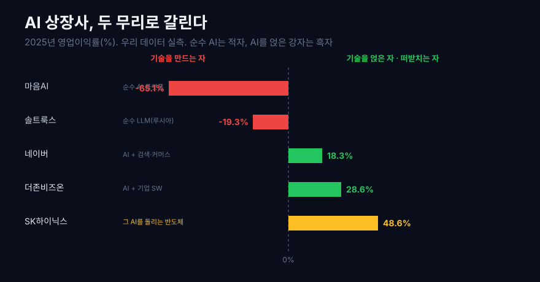
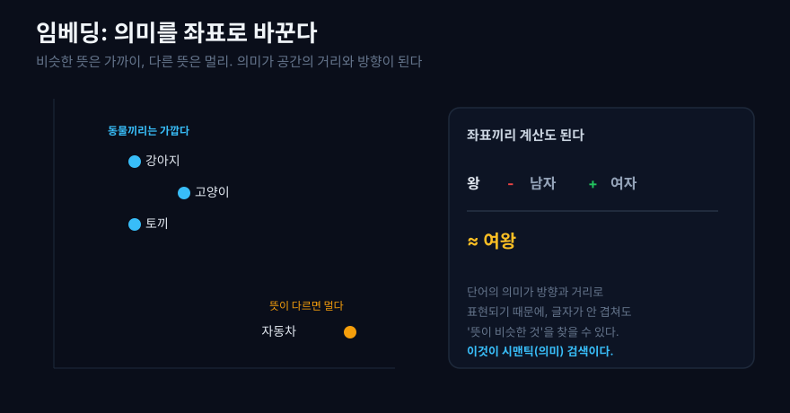
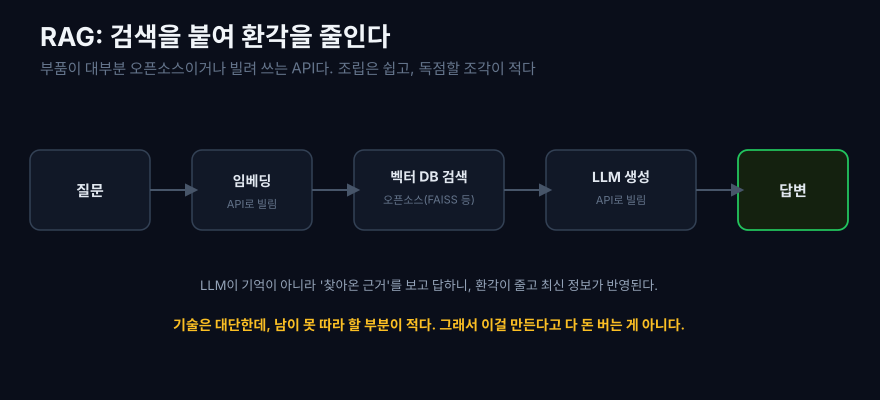
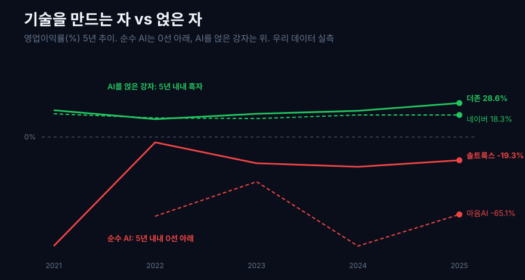
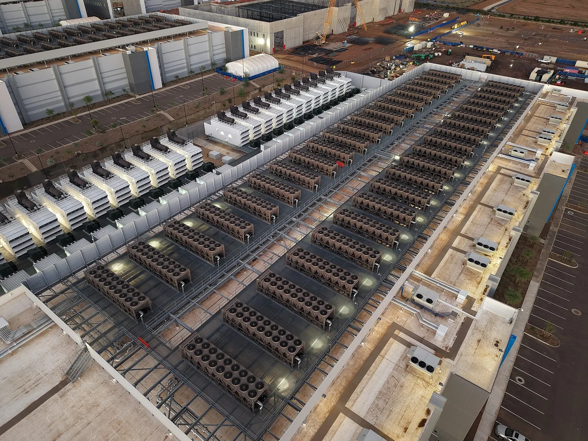
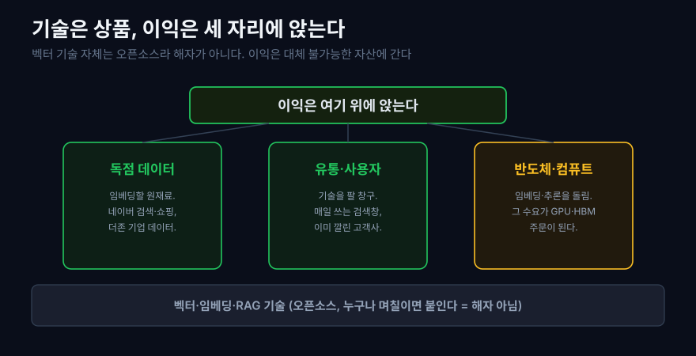

요즘 어떤 기업 소개를 봐도 'AI'라는 단어가 빠지지 않는다. 챗봇이 사람처럼 답하고, 검색창이 문장을 알아듣고, 사진 한 장으로 비슷한 상품을 찾아준다. 이 마법의 상당 부분을 떠받치는 것이 벡터(vector) 기술, 그러니까 글과 그림을 숫자 묶음으로 바꿔 '의미로 검색'하게 만드는 기술이다.

그런데 이상한 게 있다. 'AI'를 간판에 크게 내건 상장사들의 재무제표를 열어보면, 상당수가 몇 년째 적자다. 기술은 세상을 바꾼다는데, 그 기술을 만든다는 회사들은 왜 돈을 못 벌까.

이 글은 두 가지를 나란히 놓는다. 먼저 벡터 검색이 실제로 어떻게 작동하는지 원리를 풀고, 그다음 그 기술로 진짜 돈을 버는 상장사가 누구인지 우리 데이터로 실측한다. 걷다 보면, 이익이 왜 '기술을 만드는 자'가 아니라 다른 자리에 앉는지가 드러난다.

## 1. 'AI 회사'의 재무제표를 열면 보이는 것

먼저 결론이 되는 그림부터 보자. AI를 핵심으로 내세운 국내 소프트웨어 상장사들을 추려 우리 데이터로 수익성을 스크린했다. 여기서 영업이익률은 매출 대비 영업이익 비율, 곧 팔아서 남기는 힘이다.

```python
import dartlab
import polars as pl

# AI 소프트웨어 상장사만 골라 수익성을 본다
prof = dartlab.scan("profitability")   # 전 상장사 수익성 스크린
ai = ["304100", "377480", "012510", "035420"]  # 솔트룩스·마음AI·더존비즈온·네이버
prof.filter(pl.col("종목코드").is_in(ai)).select("종목명", "영업이익률", "등급")
```



한눈에 두 무리로 갈린다. 'AI·LLM'을 직접 만든다고 내세우는 순수 회사들은 매출이 수십에서 수백억에 그치고 대부분 적자다. 반면 뚜렷한 흑자는 소수, 그것도 AI를 새로 만든 회사가 아니라 원래 하던 사업(검색, 커머스, 기업용 소프트웨어)에 AI를 얹은 회사들이다.

이 스크린은 시작점일 뿐이다. 스크린 값은 근사라, 이 글에 실린 회사별 숫자는 전부 손익계산서를 연간으로 다시 합산한 실측으로 확인했다(검증표 참고). 그 전에, 이 회사들이 실제로 무엇을 만드는지, 벡터 기술의 원리부터 봐야 한다. 그래야 왜 이런 재무가 나오는지 설명이 된다.

## 2. 컴퓨터가 '의미'를 갖는 법: 임베딩

컴퓨터는 글자를 모른다. 숫자만 안다. 그래서 AI에게 '강아지'라는 단어를 이해시키려면, 먼저 그 단어를 숫자로 바꿔야 한다. 이때 단순히 번호표를 붙이는 게 아니라, 의미가 담기도록 수백에서 수천 개의 숫자로 이뤄진 좌표를 준다. 이 좌표가 임베딩(embedding), 곧 의미의 벡터다.

핵심은 비슷한 것끼리 가까이 놓인다는 점이다. '강아지'와 '고양이'의 좌표는 가깝고, '강아지'와 '자동차'는 멀다. 유명한 예로, 이 좌표들끼리 덧셈과 뺄셈이 되기도 한다. '왕'에서 '남자'를 빼고 '여자'를 더하면 '여왕' 근처가 나온다. 단어의 의미가 공간 위의 방향과 거리로 표현되는 것이다([임베딩 모델 가이드](https://www.youngju.dev/blog/llm/2026-03-13-embedding-model-vector-search-rag-sentence-transformers)).



이게 왜 대단한가. 기존 검색은 글자가 똑같아야 찾았다. '자동차 고장'으로 검색하면 그 단어가 든 문서만 나왔다. 임베딩으로 검색하면 '차가 시동이 안 걸려요'처럼 글자는 하나도 안 겹쳐도 의미가 가까우면 찾아준다. 이것이 시맨틱 검색(의미 기반 검색)이다.

같은 원리가 글에만 통하는 게 아니다. 이미지도, 음성도 같은 방식으로 벡터가 된다. 그래서 사진 한 장을 벡터로 바꿔 비슷한 상품 사진을 찾거나(이미지 검색), 취향이 비슷한 사용자를 벡터 거리로 묶어 추천하는 일이 모두 같은 기술 위에서 돌아간다. 챗봇, 시맨틱 검색, 상품 추천, 이상 탐지가 겉으로는 달라 보여도 속을 열면 전부 '벡터의 거리를 재는' 같은 엔진을 쓴다.

dartlab의 AI 엔진도 이 방식을 쓴다. 수십만 건의 공시 문장을 임베딩해두고, 사용자의 질문을 같은 공간의 벡터로 바꿔 의미가 가까운 근거를 찾아온다. 키워드가 겹치지 않아도 관련 공시를 끌어오는 힘이 여기서 나온다.

## 3. 수억 개의 벡터에서 가장 비슷한 것을 찾는 법

문제는 규모다. 문서가 수억 개면 임베딩 벡터도 수억 개다. 새 질문이 들어올 때마다 수억 개와 일일이 거리를 재면 너무 느리다. 그래서 근사 최근접 이웃(ANN, Approximate Nearest Neighbor) 탐색을 쓴다. 정확히 1등을 찾는 대신, 거의 1등을 아주 빠르게 찾는 방식이다.

비유하면 도서관에서 책을 찾는 것과 같다. 모든 책을 한 권씩 확인하는 대신, 분야별 서가로 먼저 좁히고 그 안에서만 훑는다. 벡터 세계에서는 HNSW 같은 인덱스가 이 서가 역할을 한다. 가까운 것끼리 미리 그물처럼 이어두고, 새 질문이 들어오면 그 그물을 몇 단계만 타고 내려가 후보를 좁힌다. 그래서 수억 개 중에서도 답을 밀리초 단위로 돌려준다. 검색이 즉각적으로 느껴지는 비결이 여기 있다. 이렇게 벡터를 저장하고 빠르게 검색하도록 만든 저장소가 벡터 데이터베이스다([벡터 데이터베이스란](https://kisdi.org/vector-database-rag-enterprise-embedding-search-guide-2026)).

여기서 이 글의 핵심 반전이 시작된다. 이 벡터 데이터베이스와 검색 도구들의 이름을 보자. FAISS, pgvector, Milvus, Chroma, Weaviate. 이 중 상당수가 무료 오픈소스이거나 사실상 표준화된 도구다. 다시 말해, **벡터 검색을 하는 기술 자체는 이미 상품이 됐다.** 누구나 며칠이면 붙일 수 있다. 이 사실을 기억해두자. 뒤에서 재무를 설명하는 열쇠가 된다.

## 4. 검색을 붙여 환각을 줄인다: RAG

거대 언어 모델(LLM)은 똑똑하지만 두 가지 약점이 있다. 모르는 걸 그럴듯하게 지어내고(환각), 학습한 시점 이후의 최신 정보를 모른다. 이 약점을 검색으로 메우는 방식이 RAG(검색 증강 생성, Retrieval-Augmented Generation)다.

작동은 단순하다. 사용자가 질문하면, 먼저 그 질문을 임베딩해 벡터 데이터베이스에서 관련 문서를 찾고(검색), 그 문서를 LLM에게 근거로 함께 건네 답을 만들게 한다(생성). LLM이 기억에만 의존하지 않고, 찾아온 근거를 보고 답하니 환각이 줄고 최신 정보도 반영된다([RAG 실전 가이드](https://www.youngju.dev/blog/culture/2026-04-15-rag-practical-complete-guide-retrieval-embedding-vector-db-finetuning-boundary-deep-dive-guide-2025)). 지금 기업들이 자사 문서에 챗봇을 붙일 때 거의 다 이 구조를 쓴다.

```text
질문 -> 임베딩 -> 벡터 DB에서 근거 검색 -> LLM이 근거 보고 생성 -> 답변
```



그런데 이 파이프라인의 부품을 하나씩 뜯어보면, 임베딩 모델은 API로 빌려 쓰고, 벡터 데이터베이스는 오픈소스이고, LLM도 API로 부른다. 조립은 놀랄 만큼 쉽고, 독점할 조각이 마땅치 않다. 기술은 대단한데 남이 못 따라 할 부분이 적다. 그럼 이 기술로 돈은 누가 버는가. 이제 재무제표로 내려간다.

## 5. 순수 'AI 회사'의 현실: 기술은 있는데 돈이 안 된다

먼저 LLM이나 AI 플랫폼을 직접 만든다고 내세우는 순수 회사들이다. 대표로 자체 거대 언어 모델(루시아)을 만드는 솔트룩스, AI 플랫폼을 표방하는 마음AI를 실측했다.

```python
import dartlab

c = dartlab.Company("304100")   # 솔트룩스
c.select("IS", ["매출액", "영업이익", "당기순이익"])   # 분기 -> 1년 합산
```

| 솔트룩스 (연간) | 2021 | 2022 | 2023 | 2024 | 2025 |
|---|---:|---:|---:|---:|---:|
| 매출 (억원) | 42 | 414 | 426 | 265 | 416 |
| 영업이익 (억원) | -39 | -20 | -93 | -66 | **-80** |
| 영업이익률 (%) | -91.7 | -4.7 | -21.8 | -25.0 | **-19.3** |

| 마음AI (연간) | 2022 | 2023 | 2024 | 2025 |
|---|---:|---:|---:|---:|
| 매출 (억원) | 82 | 102 | 78 | 98 |
| 영업이익률 (%) | -66.4 | -37.7 | -91.6 | **-65.1** |
| 순이익 (억원) | -48 | -56 | -87 | **-77** |

솔트룩스는 5년 내리 영업적자다. 매출은 400억대에서 멈춰 있고 영업손실은 2025년 80억이다. 마음AI는 더 극단적이다. 2025년 매출이 98억인데 순손실이 77억, 매출에 육박하는 적자다. 기술 뉴스에는 자주 등장하지만, 그 기술이 벌어들이는 돈은 아직 이 정도다.

이들이 무능해서가 아니다. 이 회사들은 대체로 자체 언어 모델과 검색·챗봇 솔루션을 만들어 기업·공공에 납품한다. 기술력은 국내 최고 수준으로 평가받는 곳도 있다. 문제는 판의 구조다. 3막에서 봤듯 벡터 검색 도구는 상품화됐고, LLM은 오픈AI, 구글, 그리고 네이버 같은 거대 자본이 수조 원씩 태워 경쟁하는 판이다. 모델을 만드는 데는 GPU와 데이터, 인재라는 막대한 비용이 드는데, 그렇게 만든 모델로 값을 정하는 힘은 약하다. 고객은 언제든 더 크고 싼 글로벌 모델로 갈아탈 수 있기 때문이다. 만드는 비용은 크고 지키는 힘은 작으니, 매출이 늘어도 적자가 이어진다. 이것이 순수 AI 회사가 처한 구조적 딜레마다.

## 6. 돈은 '얹은 자'가 번다: 강자의 재무

같은 AI인데, 돈을 버는 회사들은 결이 다르다. 이들은 AI를 새로 만들어 판 게 아니라, 원래 잘하던 사업에 AI를 얹었다. 기업용 소프트웨어(ERP)에 AI를 붙인 더존비즈온, 검색과 커머스에 자체 LLM(하이퍼클로바)을 얹은 네이버를 실측했다. 앞의 순수 AI 회사들이 5년째 적자인 것과 달리, 이 둘은 5년 내내 흑자다.

```python
c = dartlab.Company("012510")   # 더존비즈온, 기업용 SW + AI
c.select("IS", ["매출액", "영업이익"])
```

| 더존비즈온 (연간) | 2021 | 2022 | 2023 | 2024 | 2025 |
|---|---:|---:|---:|---:|---:|
| 매출 (억원) | 3,187 | 3,043 | 3,536 | 4,023 | 4,463 |
| 영업이익률 (%) | 22.3 | 15.0 | 19.5 | 21.9 | **28.6** |

더존비즈온은 5년 내내 영업이익률이 15% 아래로 내려간 적이 없고, 2025년에는 28.6%까지 올랐다. 기업의 회계·인사 시스템이라는 원래 사업이 꾸준한 이익을 내고, 그 위에 AI가 얹혔기 때문이다.

```python
c = dartlab.Company("035420")   # 네이버, 검색·커머스 + 하이퍼클로바
c.select("IS", ["매출액", "영업이익"])
```

| 네이버 (연간) | 2021 | 2022 | 2023 | 2024 | 2025 |
|---|---:|---:|---:|---:|---:|
| 매출 (조원) | 6.8 | 8.2 | 9.7 | 10.7 | 12.0 |
| 영업이익률 (%) | 19.4 | 15.9 | 15.4 | 18.4 | **18.3** |

네이버는 매출이 5년 만에 6.8조에서 12.0조로 커지는 내내 영업이익률 15~19%를 지켰다. 몸집이 두 배가 되는 동안에도 남기는 비율이 흔들리지 않았다.

한 장으로 나란히 놓으면 두 무리의 대비가 선명하다.

| 회사 (2025 연간) | 매출 | 영업이익률 (%) |
|---|---:|---:|
| 솔트룩스 (순수 LLM) | 416억 | -19.3 |
| 마음AI (순수 AI 플랫폼) | 98억 | -65.1 |
| 더존비즈온 (AI + 기업 SW) | 4,463억 | **28.6** |
| 네이버 (AI + 검색·커머스) | 12조 350억 | **18.3** |



순수 AI 회사가 매출 100~400억에 적자를 내는 5년 동안, AI를 얹은 강자는 조 단위 또는 수천억으로 벌며 20% 안팎을 남겼다. 같은 기간 같은 기술을 두고 갈린 정반대의 궤적이다.

핵심은 이들이 파는 게 'AI 기술'이 아니라는 점이다. 네이버가 파는 건 여전히 검색 광고와 커머스이고, AI는 그 사업을 더 잘 돌게 하는 도구다. 더존이 파는 건 기업의 회계·인사 시스템이고, AI는 거기 얹혀 값을 조금 더 받게 해준다. 기술은 조미료이지 주식(主食)이 아니다.

그리고 이 사슬을 한 칸 더 내려가면, AI 골드러시에서 가장 확실하게 번 곳이 나온다. 그 많은 임베딩과 추론을 실제로 돌리는 반도체다. [모래가 반도체가 되기까지](/blog/sand-to-semiconductor)에서 봤듯, [SK하이닉스](/blog/000660-skhynix)는 AI 메모리 호황에 2025년 영업이익률 48.6%를 찍었다. AI 소프트웨어 회사 대부분이 적자일 때, 그들이 쓰는 칩을 만드는 회사가 사슬에서 가장 많이 벌었다.



## 7. 기술이 재무를 설명한다: 해자는 어디에 있나

왜 이렇게 갈릴까. 답은 3막과 4막에 이미 나왔다. 벡터 검색도, RAG도, 부품이 대부분 오픈소스이거나 빌려 쓰는 API다. 기술 자체는 남이 못 따라 할 해자(경쟁자가 넘지 못하는 방어벽)가 되지 못한다. 그렇다면 해자는 어디에 있나. 세 곳이다.



1. **임베딩할 독점 데이터.** 벡터 검색은 데이터가 있어야 쓸모가 있다. 네이버는 수십 년치 검색·쇼핑·지도 데이터를, 더존은 수십만 기업의 회계·업무 데이터를 쥐고 있다. 남이 못 가진 데이터가 진짜 자산이다.
2. **그 기술을 쓸 유통과 사용자.** 아무리 좋은 AI도 쓸 사람이 있어야 돈이 된다. 네이버는 이미 전 국민이 매일 쓰는 창을 갖고 있고, 더존은 이미 그 소프트웨어를 쓰는 기업 고객을 갖고 있다. 순수 AI 회사는 좋은 기술을 만들고도 그걸 팔 창구가 없다.
3. **그 기술을 돌릴 반도체.** 임베딩과 추론은 막대한 연산이다. 그 연산 수요가 그대로 GPU와 고대역폭 메모리 주문이 되어 반도체 회사로 흘러간다.

이 셋은 서로를 강화한다. 데이터가 많으면 AI가 좋아지고, AI가 좋아지면 사용자가 더 모이고, 사용자가 모이면 데이터가 더 쌓인다. 이 바퀴가 한 번 돌기 시작하면 뒤에서 따라오는 회사가 따라잡기 어렵다. 반대로 순수 AI 회사는 이 바퀴의 어느 톱니에도 올라타지 못한 채, 기술이라는 한 조각만 쥐고 있다. 그 조각마저 오픈소스로 흔해지면 남는 게 없다.

정리하면, 순수 AI 회사는 셋 다 부족하고, 강자와 반도체 회사는 셋을 나눠 가졌다. 그래서 기술을 만드는 자가 아니라 데이터·유통·컴퓨트를 가진 자가 이익을 가져간다.

숫자를 오해하지 않도록 세 가지를 짚는다. 첫째, 적자가 곧 나쁜 회사는 아니다. 초기 투자기의 적자일 수 있다. 다만 솔트룩스는 5년, 마음AI는 4년째라 '초기'로만 보기는 어렵다. 둘째, 스크린 값과 실측은 다르다. 이 글 표의 숫자는 전부 연간 실측으로 다시 계산했다(검증표). 셋째, 매출 100억짜리 회사에 큰 시가총액이 붙어 있다면, 그 값은 지금의 실적이 아니라 미래에 대한 기대다. 기대와 실적을 섞어 읽으면 안 된다.

## 8. 이익은 기술이 아니라 자리에 앉는다

원리에서 재무까지 걸어왔다. 이제 첫 질문에 답할 수 있다. 벡터·LLM 기술로 실제 돈을 버는 회사는 누구이고, 왜 'AI 회사'일수록 적자인가.

벡터 기술 자체는 오픈소스로 상품화돼 누구나 쓴다. 그래서 그 기술만 가진 회사는 값을 정하는 힘이 없어 적자를 낸다. 이익은 기술을 만든 자가 아니라, 임베딩할 독점 데이터, 그것을 쓸 유통, 그것을 돌릴 반도체를 가진 자에게 간다.

이것은 [모래가 반도체가 되기까지](/blog/sand-to-semiconductor)에서 본 법칙의 반복이다. 거기서는 부가가치가 공정 난도가 아니라 대체 불가능성에 앉았다. 여기서는 이익이 기술 자체가 아니라 데이터·유통·컴퓨트라는 대체 불가능한 자산에 앉는다. 하드웨어든 소프트웨어든, 상품화된 것은 못 벌고 대체 불가능한 것이 번다는 같은 이야기다.

그래서 다음에 이 판을 볼 때 봐야 할 것을 남긴다.

- **순수 AI 회사의 흑자 전환 시점.** 기대가 실적이 되려면 적자가 끝나야 한다. 솔트룩스, 마음AI 같은 회사가 언제 영업흑자로 돌아서는지가 첫 시금석이다.
- **대형의 AI 매출 기여.** [네이버](/blog/035420-naver)와 [카카오](/blog/035720-kakao), [더존비즈온](/blog/012510-douzone)이 AI로 실제 매출을 얼마나 새로 만드는지. 조미료가 주식이 되는지.
- **독점 데이터의 크기.** 남이 못 가진 데이터를 가진 회사가 결국 이긴다. 데이터의 폭과 깊이가 다음 해자다.
- **추론 비용과 반도체.** AI가 쓰일수록 연산 수요가 늘고, 그 청구서는 반도체로 간다. 소프트웨어의 성장이 하드웨어의 이익으로 새는 지점을 보라.

'AI'라는 단어는 여전히 어디에나 붙는다. 하지만 그 단어가 이익이 되는 자리는 좁고 분명하다. 기술은 상품이 되고, 돈은 그 상품을 남보다 잘 쓸 수 있는 자리에 앉는다.

## 검증표

본문의 모든 회사별 수치는 아래 호출로 재현된다. 스크린(`scan`)은 방향을 잡는 용도이고, 표의 매출·영업이익률은 손익계산서를 연간으로 합산한 실측이다. 데이터 기준: 2026-07-04, 2025년 연간까지 반영.

| 본문 수치 | dartlab 호출 | 결과 |
|---|---|---|
| 솔트룩스 5년 연속 영업적자, 2025 영업이익률 -19.3% | `Company("304100").select("IS", [...])` 분기 합산 | 실측 |
| 솔트룩스 2025 매출 416억, 영업손실 80억 | `Company("304100").select("IS", [...])` | 실측 |
| 마음AI 2025 매출 98억, 순손실 77억, 영업이익률 -65.1% | `Company("377480").select("IS", [...])` | 실측 |
| 마음AI 4년 연속 적자(2022~2025) | `Company("377480").select("IS", [...])` | 실측 |
| 더존비즈온 영업이익률 22.3%(2021)~28.6%(2025) 5년 연속 흑자, 매출 3,187억→4,463억 | `Company("012510").select("IS", [...])` | 실측 |
| 네이버 영업이익률 15~19%(2021~2025) 유지, 매출 6.8조(2021)→12.0조(2025) | `Company("035420").select("IS", [...])` | 실측 |
| SK하이닉스 2025 영업이익률 48.6% | `Company("000660").select("IS", [...])` (앞 글 검증) | 실측 |
| AI 소프트웨어 상장사 14곳 스크린, 다수 적자 | `dartlab.scan("profitability")` 필터 | 스크린(방향) |

기술 원리(임베딩, 벡터 데이터베이스, ANN, RAG)는 [임베딩 모델 가이드](https://www.youngju.dev/blog/llm/2026-03-13-embedding-model-vector-search-rag-sentence-transformers), [벡터 데이터베이스란](https://kisdi.org/vector-database-rag-enterprise-embedding-search-guide-2026), [RAG 실전 가이드](https://www.youngju.dev/blog/culture/2026-04-15-rag-practical-complete-guide-retrieval-embedding-vector-db-finetuning-boundary-deep-dive-guide-2025), [RAG와 벡터 DB 비교](https://tilnote.io/pages/689b4d08a311b5922e2ddf50)를 참고했다. 외부 본문은 원리 참고용이며, 매출·영업이익 숫자는 전부 우리 데이터 실측이다.
