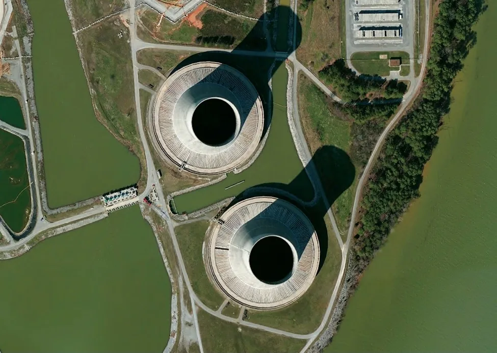
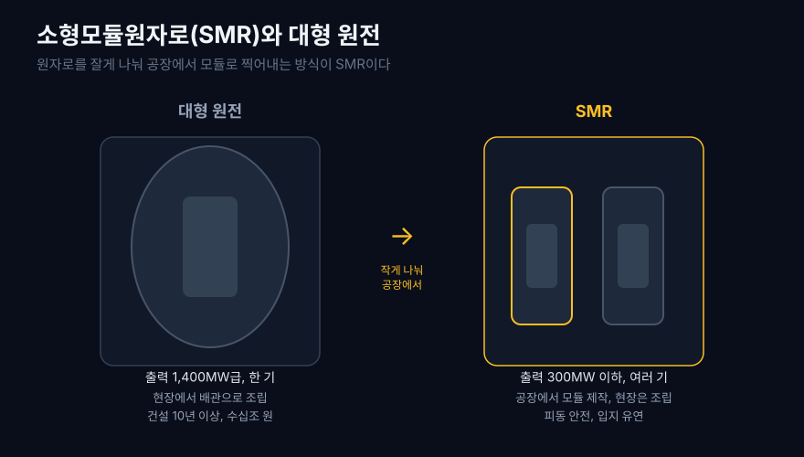
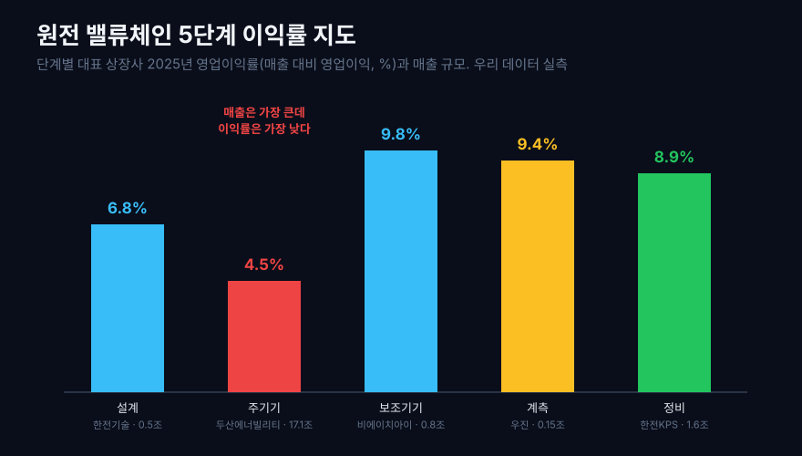
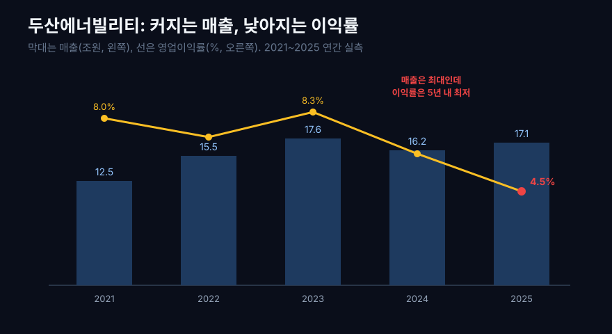
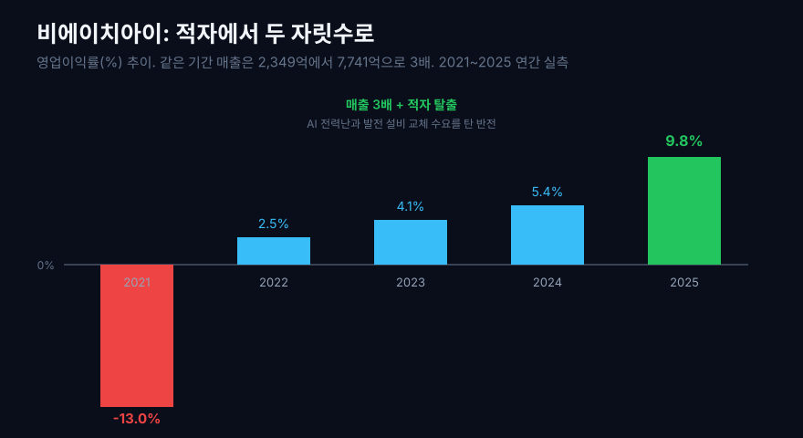
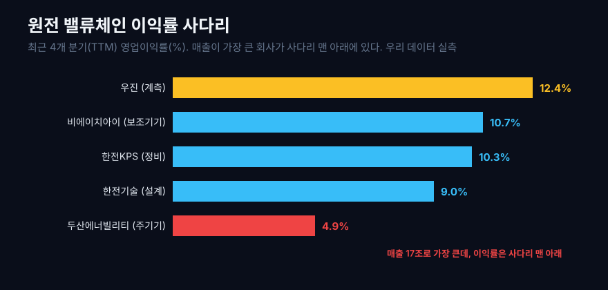

2026년 들어 세계에서 가장 전기를 많이 먹는 손님은 공장도, 도시도 아닌 데이터센터가 됐다. 인공지능 모델 하나를 학습시키고 서비스하는 데 도시 하나만큼의 전력이 들고, 그 수요는 해마다 가파르게 늘어난다. 빅테크들이 앞다투어 원자력으로 눈을 돌린 이유가 여기 있다. 바람과 햇빛은 끊기지만, 원자로는 24시간 멈추지 않고 탄소도 거의 없이 전기를 뽑아낸다.

그런데 큰 원전은 짓는 데 10년이 넘고 수십조 원이 든다. 그래서 나온 발상이 원자로를 작게 나눠 공장에서 찍어내자는 것, 곧 소형모듈원자로(SMR)다. 자동차를 손으로 한 대씩 조립하는 대신 부품을 규격화해 공장에서 대량 생산하듯, 원자로의 핵심 부품을 공장에서 모듈로 만들어 현장에서 레고처럼 조립한다.

그렇다면 질문 하나. **이 새 원자로를 우리 상장사 중 누가, 어느 공정에서 만드는가. 그 공정은 DART와 EDGAR 공시에서 어떻게 설명되는가?** 상식대로라면 원자로라는 가장 크고 어려운 물건을 직접 만드는 회사의 숫자가 가장 좋아 보일 것 같다. 우리 데이터로 밸류체인 다섯 단계의 상장사 이익률을 직접 재봤더니, 실제 지도는 훨씬 더 층위가 갈렸다.

## 1. 원자로를 공장에서 찍어낸다는 것

먼저 기술부터 정확히 세우자. SMR은 전기출력 300메가와트(MWe) 이하의 작은 원자로를 통칭한다. 우리가 아는 대형 원전 한 기가 1,400메가와트쯤 되니, 그 5분의 1 이하다. 작다는 것 자체가 목적이 아니라, 작아서 생기는 세 가지가 핵심이다.

첫째, **모듈화.** 큰 원전은 압력용기, 증기발생기, 냉각재 펌프를 현장에서 배관으로 이어 붙인다. SMR은 이 부품들을 하나의 용기 안에 통합해 공장에서 완제품에 가깝게 찍어낸 뒤 현장으로 실어 나른다. 현장 공사가 줄면 공사 기간과 비용, 그리고 지연 위험이 함께 줄어든다.

둘째, **피동 안전.** 작으면 그 안에 담긴 열도 적다. 사고가 나 펌프가 멈춰도 자연 대류와 중력만으로 열을 빼낼 수 있게 설계할 여지가 생긴다. 후쿠시마 이후 원전에 요구된 안전 기준을 구조 자체로 충족하려는 시도다.

셋째, **입지 유연성.** 작고 안전 여유가 크면 대규모 냉각수원이 없는 내륙, 혹은 전력을 쓰는 데이터센터 바로 옆에도 놓을 수 있다. AI 시대에 이 점이 결정적이다.

```python
# 이 글에 나오는 모든 이익률은 손익계산서를 분기 단위로 받아
# 연간(또는 최근 4개 분기)으로 합산해 다시 계산한 실측값이다.
import dartlab

c = dartlab.Company("034020")   # 두산에너빌리티
panel = c.panel("IS")           # 손익계산서 wide 격자 (분기별)
```



한국도 이 흐름에 올라탔다. 한국수력원자력을 중심으로 두산에너빌리티, 한전기술, 한전KPS, 한전원자력연료(비상장) 등이 참여한 컨소시엄이 한국형 혁신 SMR(i-SMR)을 개발 중이고, 표준설계 인가는 2028년, 첫 운전은 2034년을 목표로 한다. 두산에너빌리티는 미국 뉴스케일파워의 지분 투자자이자 핵심 기자재 공급사로, 창원 공장에 8,000억 원대를 들여 SMR 전용 제작 시설을 짓고 있다. 이 대목이 이 글에서 반드시 짚어야 할 정직함의 출발점이다. **SMR은 아직 도면과 실증 단계이고, 지금 이 회사들의 매출과 이익은 SMR이 아니라 기존 대형 원전과 발전 설비에서 나온다.** 우리는 SMR이 곧 얹힐 그 골조, 곧 원전 밸류체인의 이익 구조를 읽는 것이다.

## 2. 밸류체인 지도: 다섯 단계의 손익 흔적

원자로 한 기가 서기까지의 사슬을 다섯 단계로 세웠다. 각 단계의 대표 상장사를 하나씩 놓고, 그 회사의 이익률을 우리 데이터로 실측했다.

1. **설계.** 원자로를 어떻게 배치하고 계통을 짤지 도면을 그린다. 자산이 거의 없는 두뇌 노동이다. 한전기술(052690).
2. **주기기 제작.** 압력용기와 증기발생기 같은 원자로의 뼈대를 두꺼운 쇳덩이로 벼려낸다. 사슬에서 가장 크고 무겁다. 두산에너빌리티(034020).
3. **보조기기.** 열교환기, 배관, 발전 설비의 나머지 몸통을 만든다. 비에이치아이(083650).
4. **계측·제어.** 원자로 안의 온도와 중성자를 재는 눈과 신경을 만든다. 작지만 대체가 어렵다. 우진(105840).
5. **운영·정비.** 다 지은 발전소를 수십 년간 정비하고 계획예방정비를 맡는다. 한전KPS(051600).

전 종목을 한 번에 훑는 `dartlab.scan`으로 이 회사들을 스크린한 뒤, 각 회사의 손익계산서를 연간으로 다시 합산해 이익률을 구했다. 그 지도는 이렇게 생겼다.

공정별 근거 지도부터 세우면 이 사슬이 더 선명해진다. 한국사는 DART 손익계산서와 사업보고서, 미국 설계사와 전력 수요자는 EDGAR 10-K의 사업 설명을 교차해 본다.

| 공정/층위 | 기술 역할 | 대표 회사 | 공시 근거 | 재무로 보이는 흔적 |
|---|---|---|---|---|
| 설계·인허가 | 원자로 계통과 표준설계를 만든다 | 한전기술(DART), NuScale(EDGAR) | DART 사업보고서, EDGAR 10-K 개발 단계 설명 | 설계 매출은 인력 중심이라 수주 파도에 마진이 출렁인다 |
| 주기기·대형단조 | 압력용기와 증기발생기를 벼려낸다 | 두산에너빌리티(DART), GE Vernova(EDGAR) | DART 사업부문, EDGAR 원전 장비 설명 | 대형 설비와 투자 부담이 이익률을 누른다 |
| 보조기기 | 열교환기와 발전 보조 설비를 만든다 | 비에이치아이(DART) | DART 손익과 수주 설명 | 전력 설비 사이클이 매출과 마진을 동시에 흔든다 |
| 계측·제어 | 원자로 내부 온도와 중성자를 감시한다 | 우진(DART) | DART 사업보고서 계측기 설명 | 인증과 납품 이력이 대체 불가능성을 만든다 |
| 운영·정비 | 원전 수명 동안 계획예방정비를 맡는다 | 한전KPS(DART), Constellation(EDGAR) | DART 정비 매출, EDGAR 원전 운영 설명 | 한번 깔린 설비가 장기 서비스 매출을 만든다 |
| 전력 수요자 | 데이터센터 전력을 장기 조달한다 | Microsoft·Oracle·Amazon(EDGAR) | EDGAR CAPEX·전력 조달 설명 | 전력 수요가 SMR 기대를 끌어올리지만 아직 직접 매출은 제한적이다 |



| 단계 (2025 연간) | 회사 | 매출 (억원) | 매출총이익률 (%) | 영업이익률 (%) |
|---|---|---:|---:|---:|
| 설계 | 한전기술 | 5,188 | 21.7 | 6.8 |
| 주기기 | 두산에너빌리티 | 170,579 | 16.1 | **4.5** |
| 보조기기 | 비에이치아이 | 7,741 | 15.5 | 9.8 |
| 계측 | 우진 | 1,504 | 31.2 | 9.4 |
| 정비 | 한전KPS | 15,765 | 15.1 | 8.9 |

한눈에 이상하다. 매출이 압도적으로 큰 두산에너빌리티(17조 원)의 영업이익률이 4.5%로, 다섯 중 가장 낮다. 매출이 100분의 1도 안 되는 우진(1,504억 원)이 오히려 두 배 넘게 남긴다. 가장 큰 물건을 만드는 회사가 가장 못 버는 이 그림을, 한 단계씩 걸으며 풀어 보자.

## 3. 설계: 도면을 그리는 두뇌

사슬의 맨 앞은 설계다. 한전기술은 원자로 계통설계와 원전 종합설계를 하는 회사다. 공장도 대형 설비도 거의 없이, 사람과 소프트웨어로 도면을 판다. 자산이 가벼운 지식 사업의 전형이다.

```python
c = dartlab.Company("052690")   # 한전기술, 원전 설계
c.select("IS", ["매출액", "매출총이익", "영업이익"])
```

| 한전기술 (연간) | 2021 | 2022 | 2023 | 2024 | 2025 |
|---|---:|---:|---:|---:|---:|
| 매출 (억원) | 4,331 | 5,053 | 5,451 | 5,534 | 5,188 |
| 매출총이익률 (%) | 24.7 | 22.0 | 23.5 | **30.2** | 21.7 |
| 영업이익률 (%) | 2.3 | 2.8 | 5.2 | **9.9** | 6.8 |

두 가지가 보인다. 첫째, 매출총이익률(24~30%)은 높은데 영업이익률(2~10%)은 그보다 훨씬 낮다. 설계 자체의 원가는 낮지만, 인건비 중심의 판매관리비가 이익을 크게 갉아먹기 때문이다. 지식 사업의 원가는 결국 사람이다. 둘째, 2024년에 영업이익률이 9.9%로 튀었다. 신한울 3·4호기 재개 같은 대형 원전 프로젝트의 설계 물량이 몰린 해다. 설계는 이렇게 수주의 파도에 따라 마진이 출렁인다. SMR 시대에는 표준설계라는 새 물량이 이 두뇌에 얹힌다.

## 4. 주기기: 원자로를 벼려내는 대장간의 투자 국면

이제 사슬의 심장, 원자로 그 자체를 만드는 곳이다. 두산에너빌리티는 원자로 압력용기와 증기발생기 같은 주기기를 만든다. 수백 톤짜리 쇳덩이를 벼리고 깎고 용접하는, 세계에 몇 없는 대형 단조 능력이 이 회사의 무기다. 뉴스케일과 테라파워 같은 세계적 SMR 설계사들이 정작 제작은 이 회사에 맡기는 이유다.

```python
c = dartlab.Company("034020")   # 두산에너빌리티, 주기기·대형단조
c.select("IS", ["매출액", "매출총이익", "영업이익"])
```

| 두산에너빌리티 (연간) | 2021 | 2022 | 2023 | 2024 | 2025 |
|---|---:|---:|---:|---:|---:|
| 매출 (조원) | 12.5 | 15.5 | 17.6 | 16.2 | 17.1 |
| 매출총이익률 (%) | 17.1 | 16.5 | 17.2 | 16.8 | 16.1 |
| 영업이익률 (%) | 8.0 | 7.1 | 8.3 | 6.3 | **4.5** |

매출은 다섯 회사를 다 합친 것보다 크다. 그런데 영업이익률은 4.5%, 5년 내 가장 낮고 사슬에서도 가장 낮다. 왜 대형 단조라는 희소한 능력이 아직 높은 이익률로 번역되지 않았을까.

세 가지가 겹친다. 첫째, **두산에너빌리티의 17조는 원전만이 아니다.** 가스터빈, 풍력, 대형 건설(자회사), 주단조가 뒤섞인 종합 중공업의 숫자다. 이익률이 얇은 건설·플랜트 사업이 전체 마진을 끌어내린다. 둘째, **주기기는 수주 산업이다.** 한 건이 몇 년에 걸친 대형 프로젝트라, 원자재 값이 오르거나 공정이 지연되면 그 부담을 고스란히 떠안는다. 셋째, **지금은 씨를 뿌리는 국면이다.** SMR 전용 공장에 8,000억 원대를 투자하는 중이고, 이 설비가 이익으로 돌아오는 건 SMR이 실제로 팔리기 시작하는 몇 년 뒤다. 큰 몸집은 큰 고정비를 뜻하고, 물량이 차기 전까지 그 고정비가 이익률을 누른다.

특히 세 번째가 지금 이 회사를 이해하는 열쇠다. 8,000억 원대 투자는 당장은 감가상각과 고정비로 이익률을 갉아먹지만, SMR이 팔리기 시작하면 같은 설비가 이익을 찍어내는 기계로 바뀐다. 번 돈을 먼저 공장에 넣고 뒤에 물량으로 거두는 이 리듬은, [설비투자와 가동률로 회사를 읽는 법](/blog/capacity-utilization-capex)에서 다룬 중공업의 전형적인 손익 구조다. 그래서 두산에너빌리티는 매출의 크기가 아니라 이익률의 방향으로 읽어야 하고, 그 방향은 결국 SMR 물량이 정한다. 지금의 낮은 이익률은 실패의 기록이 아니라 아직 물량이 도착하지 않은 대기 상태에 가깝다.



정리하면, 두산에너빌리티는 이 사슬에서 가장 대체 불가능한 능력(대형 단조)을 가졌지만, 그 능력이 아직 이익률로 온전히 번역되지 않았다. 협상력은 세계 최고 수준이되, 몸집이 크고 사업이 뒤섞였고 투자 국면이라 마진은 얇다. 이것이 이 글의 첫 번째 교훈이다. **크고 어려운 것을 만드는 힘과, 그것으로 남기는 힘은 다르다.**

## 5. 보조기기: 죽었다 살아난 반전

비에이치아이는 발전소의 열교환기, 배열회수보일러(HRSG), 각종 보조기기를 만든다. 원자로의 주인공은 아니지만, 발전소가 서려면 반드시 필요한 몸통이다. 이 회사의 5년은 이 글에서 가장 드라마틱하다.

```python
c = dartlab.Company("083650")   # 비에이치아이, 발전 보조기기
c.select("IS", ["매출액", "매출총이익", "영업이익"])
```

| 비에이치아이 (연간) | 2021 | 2022 | 2023 | 2024 | 2025 |
|---|---:|---:|---:|---:|---:|
| 매출 (억원) | 2,349 | 3,302 | 3,674 | 4,047 | **7,741** |
| 매출총이익률 (%) | -2.7 | 10.6 | 12.0 | 14.6 | 15.5 |
| 영업이익률 (%) | **-13.0** | 2.5 | 4.1 | 5.4 | **9.8** |

2021년 영업이익률은 마이너스 13%였다. 매출총이익률까지 마이너스였다는 건, 물건을 만드는 원가조차 못 건졌다는 뜻이다. 그런 회사가 4년 만에 매출을 3배로 키우고 영업이익률을 두 자릿수 문턱까지 끌어올렸다. 최근 4개 분기로 보면 매출은 이미 9,196억 원, 영업이익률은 10.7%다.

무엇이 바꿨나. AI 전력난과 노후 발전 설비 교체가 겹치며 전 세계에서 발전소 건설과 증설이 늘었고, 그 보조기기 수요가 이 회사로 몰렸다. 죽어 가던 회사가 시대의 파도를 타고 살아난 것이다. 다만 주의할 점도 있다. 수주 산업의 매출은 대형 프로젝트 인식 시점에 따라 크게 출렁이므로, 한 해의 급증을 항상성으로 오해하면 안 된다. 이익의 진짜 체력은 여러 해의 경로로 봐야 한다는 원칙은 [영업활동현금흐름과 순이익의 차이](/blog/operating-cash-flow-vs-net-income)에서 다룬 그대로다.



## 6. 계측·제어: 인증 이력이 만드는 잠금

우진은 원자로 안의 온도와 중성자를 재는 노내 계측기, 그리고 각종 산업용 계측 기기를 만든다. 사슬에서 매출이 가장 작지만(1,504억 원), 이익률은 가장 안정적으로 높다.

```python
c = dartlab.Company("105840")   # 우진, 원자로 계측
c.select("IS", ["매출액", "매출총이익", "영업이익"])
```

| 우진 (연간) | 2021 | 2022 | 2023 | 2024 | 2025 |
|---|---:|---:|---:|---:|---:|
| 매출 (억원) | 1,077 | 1,241 | 1,291 | 1,407 | 1,504 |
| 매출총이익률 (%) | 28.4 | 30.1 | 33.5 | 33.3 | 31.2 |
| 영업이익률 (%) | 7.6 | 9.6 | 11.9 | 11.4 | 9.4 |

매출총이익률이 30% 안팎으로 사슬에서 가장 높고, 최근 4개 분기 영업이익률은 12.4%다. 두산에너빌리티(4.5%)의 세 배 가까이 된다. 매출이 100분의 1인데 이익률은 세 배다.

핵심은 대체 불가능성이다. 원자로 안에 들어가 안전을 감시하는 계측기는, 값이 조금 싸다고 검증 안 된 제품으로 바꿀 수가 없다. 원자력 안전 규제를 통과한 이력, 오랜 납품 실적 자체가 진입 장벽이다. 이 잠금(lock-in)이 값을 정하는 힘, 곧 이익률이 된다. 반도체 사슬에서 [모래를 정제하는 폴리실리콘보다 특정 라인에 잠긴 소재·부품이 더 잘 벌었던](/blog/sand-to-semiconductor) 논리가 원전에서도 똑같이 작동한다. 남이 못 만드는 작은 것이, 아무나 못 바꾸는 힘을 가진다.

## 7. 운영·정비: 원전 수명주기가 만드는 반복 매출

원전은 짓고 끝이 아니다. 한번 지으면 40년, 수명 연장을 하면 60년을 돌린다. 그동안 매년 계획예방정비를 하고 부품을 갈아 끼워야 한다. 한전KPS가 그 일을 맡는다.

```python
c = dartlab.Company("051600")   # 한전KPS, 발전소 정비
c.select("IS", ["매출액", "매출총이익", "영업이익"])
```

| 한전KPS (연간) | 2021 | 2022 | 2023 | 2024 | 2025 |
|---|---:|---:|---:|---:|---:|
| 매출 (억원) | 13,806 | 14,291 | 15,339 | 15,571 | 15,765 |
| 매출총이익률 (%) | 15.7 | 15.8 | 18.4 | 19.0 | 15.1 |
| 영업이익률 (%) | 9.0 | 9.1 | 13.0 | **13.5** | 8.9 |

매출은 1.4조 원대에서 완만하게 늘고, 영업이익률은 8~13%로 사슬에서 가장 꾸준하다. 최근 4개 분기 기준 10.3%다. 건설이 파도라면 정비는 조수(潮水)다. 새로 짓는 물량이 없어도 이미 돌아가는 발전소가 있는 한 매년 정비 수요가 들어온다. 이 예측 가능성이 안정적 이익률의 원천이다. SMR은 이 조수를 더 넓힌다. 작은 원자로가 여러 곳에 흩어져 서면, 정비할 대상도 그만큼 늘어난다.



## 8. 숫자를 오해하지 않는 법, 그리고 부가가치의 법칙

지도를 다 걸었으니, 이 글의 숫자를 오해하지 않는 법 네 가지를 짚는다.

첫째, **이 이익은 아직 SMR이 아니다.** 다섯 회사의 매출과 이익은 지금 이 순간 대형 원전, 가스터빈, 화력·복합화력 발전, 산업 설비에서 나온다. SMR은 2028년 인가, 2034년 첫 운전이 목표인 미래의 매출이다. 이 글은 SMR이 곧 얹힐 밸류체인의 이익 구조를 미리 읽은 것이지, SMR 매출을 실측한 것이 아니다.

둘째, **이 회사들은 SMR 순수 기업이 아니다.** 특히 두산에너빌리티의 17조 매출에서 원전이 차지하는 비중은 일부다. 그래서 이 글의 이익률은 각 회사 전체의 숫자이지, 원전 사업부만의 숫자가 아니다. 한 회사를 원전만으로 오해하면 안 된다.

셋째, **스크린 값과 실측 값은 다르다.** 전 종목을 훑는 `dartlab.scan`은 최신 분기를 포함한 근사치라 사이클 국면에서 부풀거나 줄 수 있다. 그래서 이 글의 표에 실린 이익률은 전부 손익계산서를 분기 단위로 받아 연간(또는 최근 4개 분기)으로 다시 합산한 실측이다. 어떤 값을 어떻게 구했는지는 아래 검증표에 그대로 공개한다.

넷째, **이익률만으로 좋고 나쁨을 말하지 않는다.** 두산에너빌리티의 낮은 이익률은 그 회사가 나쁘다는 뜻이 아니라, 사슬에서 맡은 자리와 지금의 투자 국면이 만든 그림이다. 부가가치가 어디 앉는지를 보는 지도일 뿐, 종목 추천이 아니다.

이제 첫 질문에 답할 수 있다. 부가가치는 왜 가장 큰 설비를 만드는 회사가 아니라 계측과 정비를 대는 조연에게 더 많이 앉았나. 이익률이 솟은 곳은 두 가지가 겹친 자리였다.

1. **대체 불가능성.** 원자로 안에 들어가 검증을 통과한 계측기(우진)는 값이 싸다고 바꿀 수 없다. 반면 발전 플랜트 건설은 경쟁이 치열해 값을 시장이 정한다. 남이 못 바꾸는 것일수록 이익률이 높다.
2. **서비스의 지속성.** 한번 지은 발전소는 수십 년 정비 수요를 낳는다(한전KPS). 한 번 팔고 끝나는 설비보다, 오래 먹는 서비스가 이익을 안정적으로 지킨다.

가장 크고 어려운 주기기를 만드는 힘은 두산에너빌리티에 있지만, 그 힘이 이익으로 번역되려면 SMR이 실제로 팔리고 8,000억짜리 공장이 물량으로 차야 한다. 그 전까지 이익은 사슬의 조용한 자리, 곧 대체하기 어렵고 오래 먹는 곳에 앉는다. **부가가치는 설비의 크기가 아니라 협상력과 지속성의 크기로 결정된다.** 이것은 [반도체 사슬에서 본 법칙](/blog/sand-to-semiconductor), 그리고 [벡터 검색 스택 지도](/blog/vector-search-who-profits)에서 본 답과 정확히 같은 문법이다.

그래서 앞으로 SMR 뉴스를 볼 때 함께 봐야 할 것을 남긴다.

- **SMR 실제 수주와 매출 인식.** 지금까지는 설계와 실증이었다. 두산에너빌리티의 SMR 매출이 손익계산서에 잡히기 시작하는 시점이, 이 밸류체인이 기대에서 실적으로 넘어가는 신호다.
- **주기기 회사의 이익률 회복.** 8,000억짜리 공장이 물량으로 차면 두산에너빌리티의 낮은 이익률이 올라올 수 있다. 매출이 아니라 이익률의 방향을 봐야 한다.
- **계측·정비의 꾸준함.** 원자로가 몇 기든, 안전 계측과 정비는 반드시 따라온다. 조용하지만 가장 오래 먹는 자리다.

원자로를 공장에서 찍어내는 시대가 정말 온다면, 그 돈이 사슬의 어디에 앉을지는 이 지도 한 장이 미리 알려준다. 가장 큰 것을 만드는 곳이 아니라, 가장 바꾸기 어렵고 가장 오래 먹는 곳이다.

## 검증표

본문의 모든 실측 수치는 아래 호출로 재현된다. 한국 상장사는 DART 기반 dartlab 실측, 미국 설계사·운영사·전력 수요자는 EDGAR 10-K의 사업 설명을 공정 지도 근거로 붙였다. `scan`은 스크린이고, 표의 이익률·매출은 손익계산서를 분기 단위로 받아 연간(또는 최근 4개 분기, TTM)으로 합산한 실측이다. 데이터 기준: 2026-07-04, 2025년 연간까지 반영(일부 회사는 2026년 1분기 포함 TTM 병기).

| 본문 수치 | dartlab 호출 | 결과 |
|---|---|---|
| 두산에너빌리티 2025 영업이익률 4.5%, 매출총이익률 16.1% | `Company("034020").panel("IS")` 분기 합산 | 실측 |
| 두산에너빌리티 매출 12.5조(2021) → 17.1조(2025) | `Company("034020").panel("IS")` 매출 합산 | 실측 |
| 한전기술 2024 영업이익률 9.9%, 2025 6.8% | `Company("052690").panel("IS")` | 실측 |
| 비에이치아이 매출 2,349억(2021) → 7,741억(2025) | `Company("083650").panel("IS")` | 실측 |
| 비에이치아이 영업이익률 -13.0%(2021) → 9.8%(2025), TTM 10.7% | `Company("083650").panel("IS")` | 실측 |
| 우진 2025 영업이익률 9.4%, TTM 12.4%, 매출총이익률 31.2% | `Company("105840").panel("IS")` | 실측 |
| 한전KPS 2024 영업이익률 13.5%, 2025 8.9%, TTM 10.3% | `Company("051600").panel("IS")` | 실측 |

기술 원리(SMR 정의, 모듈화·피동안전, 한국형 i-SMR 일정, 두산-뉴스케일 관계)는 [국제원자력기구(IAEA) 소형모듈원자로 개요](https://www.iaea.org/topics/small-modular-reactors), [두산에너빌리티 SMR 소개](https://www.doosanenerbility.com/en/business/smr_nuscale), [전기신문: 韓 SMR 2028년 인허가·2034년 첫 운전](https://www.electimes.com/news/articleView.html?idxno=359438), [삼일PwC SMR 가이드북](https://www.pwc.com/kr/ko/insights/industry-focus/smr-guidebook.html), [머니투데이: AI 전력 폭증과 두산에너빌리티 수주](https://www.mt.co.kr/industry/2026/05/29/2026052814244420781)를 참고했다. 외부 본문은 원리와 일정 참고용이며, 이익률·매출 숫자는 전부 우리 데이터 실측이다. 공정 지도에 붙인 미국 설계사와 전력 수요자는 EDGAR 10-K의 사업 설명을 비교 축으로 썼고, 국내 수치는 DART 기반 dartlab 실측으로 검증했다.
