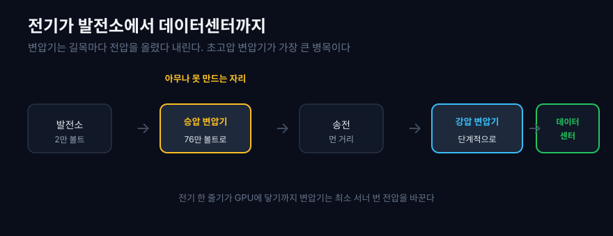
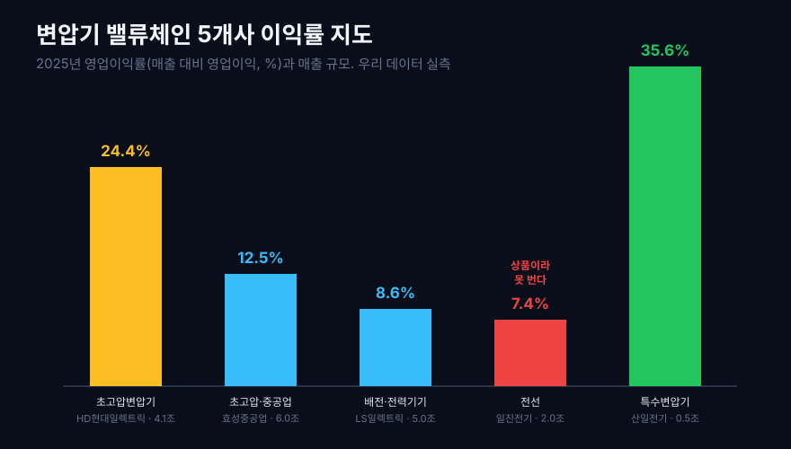
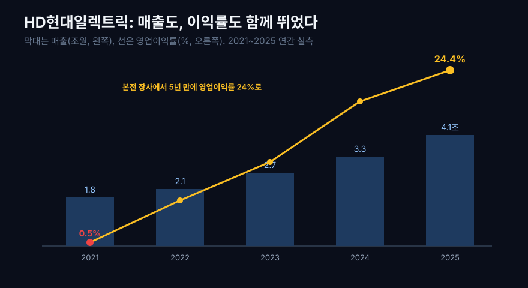
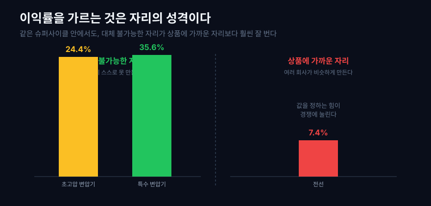
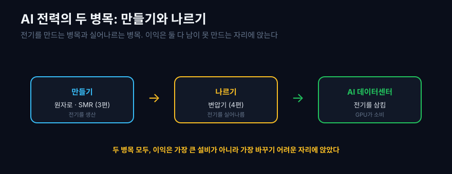

AI를 이야기할 때 우리는 늘 GPU와 모델을 말한다. 엔비디아의 칩이 몇 개 필요하고, 모델의 파라미터가 몇 조 개인지. 그런데 그 칩들이 실제로 돌아가려면 앞서 풀어야 할 더 물리적인 문제가 있다. **전기다.** 데이터센터 하나가 도시 하나만큼의 전력을 먹고, 그 수요는 해마다 26%씩 늘어난다. 가트너는 2026년 세계 데이터센터 전력 소비가 565테라와트시(TWh)에 이를 것으로 봤다.

문제는 전기를 만드는 것만이 아니라 실어나르는 것이다. 발전소에서 만든 전기를 데이터센터 서버 앞까지 옮기려면, 전압을 올렸다 내렸다 하며 먼 길을 보내는 거대한 쇠붙이들이 필요하다. 그 길목마다 서 있는 것이 변압기다. 그리고 미국의 이 쇠붙이들은 낡았다. 미국 에너지부는 자국 배전 변압기의 70%가 평균 수명 25년을 넘겼다고 분석했다. 노후 교체 수요와 AI 신규 수요가 겹치자, 미국은 스스로 변압기를 충분히 만들지 못해 수입에 기댔고, 그 수혜가 한국 전력기기 회사들에게 쏟아졌다.

이것이 2025년부터 이어진 변압기 슈퍼사이클이다. 그렇다면 질문. **AI 전력망의 어느 공정이 병목이고, 그 병목은 어느 회사의 재무제표에 남는가?** [SMR 원자로 지도](/blog/smr-reactor-value-chain)를 봤을 때는 대형 설비와 서비스 지속성이 다르게 움직였다. 이번 전력망에서도 공정별 협상력이 숫자를 갈랐다. 우리 데이터로 다섯 회사를 실측했더니, 그 이유가 선명하게 드러났다.

## 1. 변압기가 하는 일, 그리고 왜 지금 슈퍼사이클인가

전기는 만든 곳에서 쓰는 곳까지 그냥 흐르지 않는다. 발전소는 전기를 약 2만 볼트로 만든다. 이걸 그대로 멀리 보내면 전선에서 열로 다 새어 나간다. 그래서 송전 전에 초고압(34만 5천 볼트, 76만 5천 볼트)으로 확 올린다. 전압을 올리면 같은 전력을 훨씬 적은 손실로 멀리 보낼 수 있기 때문이다. 이 올리는 일이 승압 변압기다.

먼 길을 지나 소비지에 도착하면, 이번엔 위험하고 높은 전압을 다시 낮춰야 한다. 변전소에서 15만 4천 볼트로, 다시 2만 2천 9백 볼트로, 마지막에 데이터센터 수전설비에서 서버가 쓰는 낮은 전압까지 단계적으로 내린다. 이 내리는 일이 강압 변압기다. 곧 전기가 발전소에서 GPU에 닿기까지, 변압기는 길목마다 최소 서너 번 전압을 바꾼다.

```python
import dartlab

# 초고압 변압기 대표주 HD현대일렉트릭의 손익 시계열
c = dartlab.Company("267260")
c.select("IS", ["매출액", "매출총이익", "영업이익"])
```



이 가운데 특히 초고압 변압기가 병목이다. 크고 무거운 데다 제작에 오랜 시간이 걸리고, 아무 공장이나 만들 수 없다.

초고압 변압기가 왜 아무나 못 만드는지는 뜯어보면 분명하다. 수십만 볼트를 견디는 절연 설계, 수백 톤에 이르는 무게, 자성을 한 방향으로 정렬한 특수 방향성 전기강판, 그리고 완성까지 1년이 넘는 제작 기간이 필요하다. 한번 고장 나면 전력망 전체가 흔들리므로, 검증된 납품 이력이 없는 제조사는 발주처가 애초에 견적을 부르지도 않는다. 새 공장을 지어 이 시장에 들어오려 해도 설비와 숙련 인력, 실적 축적에 몇 년이 걸린다. 그래서 수요가 갑자기 터져도 공급이 그만큼 빨리 늘지 못하고, 그 시차가 지금의 값을 만든다.

미국은 이 초고압 변압기의 국내 생산이 부족해 수입에 의존하는데, 하필 AI 데이터센터가 폭증하며 수요가 터졌다. 미국 최대 전력망 PJM은 2026년 최대 전력수요가 166기가와트로 20년 만에 최고치를 넘을 것으로 봤다. 그 결과 미국 초고압 변압기 시장은 2028~2029년 인도 물량까지 주문이 밀린 공급자 우위 시장이 됐다. 만드는 쪽이 값을 정하는 시장, 이것이 이익률로 어떻게 나타났는지 보자.

## 2. 전력망 지도: 병목에 가까울수록 숫자가 달라진다

다섯 회사를 전력이 흐르는 순서대로 세웠다. 초고압 변압기(발전~송전), 배전기기(소비지), 전선(연결), 그리고 특수 변압기다. 각 회사의 2025년 영업이익률을 실측했다.

먼저 공정별 근거 지도를 세운다. 국내 전력기기 회사는 DART 손익계산서와 사업보고서, 전력 수요를 만든 미국 빅테크와 전력망 회사는 EDGAR 10-K의 데이터센터 CAPEX·전력 조달·인프라 설명을 함께 본다.

| 공정/층위 | 기술 역할 | 대표 회사 | 공시 근거 | 재무로 보이는 흔적 |
|---|---|---|---|---|
| 데이터센터 수요자 | 서버와 GPU가 전력 수요를 만든다 | Microsoft·Oracle·Amazon·Meta(EDGAR) | EDGAR CAPEX·데이터센터 설명 | 전력 설비 주문의 출발점이다 |
| 초고압 변압기 | 발전소 전기를 송전 전압으로 올리고 큰 전력을 받는다 | HD현대일렉트릭(DART), GE Vernova(EDGAR) | DART 손익, EDGAR grid 장비 설명 | 공급 부족이 매출총이익률과 영업이익률로 드러난다 |
| 중전기·배전 | 변전소와 공장·데이터센터 내부 전력을 나눈다 | 효성중공업·LS일렉트릭(DART) | DART 사업부문과 손익 | 초고압보다 넓은 시장이라 마진 개선이 완만하다 |
| 전선 | 전력을 물리적으로 연결한다 | 일진전기(DART), Prysmian(EDGAR) | DART 손익, EDGAR 케이블 사업 설명 | 구리와 경쟁 구조 때문에 협상력이 제한된다 |
| 특수 변압기 | 신재생·데이터센터 특수 사양을 좁게 맡는다 | 산일전기(DART) | DART 손익과 사업보고서 | 작은 시장이라도 검증된 공급자가 적으면 높은 마진이 가능하다 |



| 자리 (2025 연간) | 회사 | 매출 (조원) | 매출총이익률 (%) | 영업이익률 (%) |
|---|---|---:|---:|---:|
| 초고압 변압기 | HD현대일렉트릭 | 4.1 | 34.1 | **24.4** |
| 초고압·중공업 | 효성중공업 | 6.0 | 21.0 | 12.5 |
| 배전·전력기기 | LS일렉트릭 | 5.0 | 21.2 | 8.6 |
| 전선·변압기 | 일진전기 | 2.0 | 13.7 | 7.4 |
| 특수 변압기 | 산일전기 | 0.5 | 46.6 | **35.6** |

1편의 원전 지도와 정반대다. 거기선 매출이 가장 큰 두산에너빌리티가 이익률 최저였다. 여기선 이익률 1, 2위가 뚜렷하다. 놀라운 건 두 가지다. 첫째, 초고압 변압기를 전문으로 하는 HD현대일렉트릭이 영업이익률 24.4%로, 매출이 더 큰 효성중공업(6.0조, 12.5%)이나 LS일렉트릭(5.0조, 8.6%)보다 훨씬 높다. 둘째, 다섯 중 매출이 가장 작은 산일전기(0.5조)가 이익률은 가장 높은 35.6%다. 매출과 이익률이 따로 논다. 왜 이렇게 갈렸을까. 한 회사씩 보자.

## 3. 초고압 변압기: 공급 부족이 가격으로 바뀐 자리

HD현대일렉트릭은 초고압 변압기를 주력으로 하는 회사다. 이 회사의 5년은 슈퍼사이클을 한 장으로 보여준다.

```python
c = dartlab.Company("267260")   # HD현대일렉트릭, 초고압 변압기
c.select("IS", ["매출액", "매출총이익", "영업이익"])
```

| HD현대일렉트릭 (연간) | 2021 | 2022 | 2023 | 2024 | 2025 |
|---|---:|---:|---:|---:|---:|
| 매출 (조원) | 1.8 | 2.1 | 2.7 | 3.3 | 4.1 |
| 매출총이익률 (%) | 13.0 | 16.0 | 22.6 | 31.4 | 34.1 |
| 영업이익률 (%) | 0.5 | 6.3 | 11.7 | 20.1 | **24.4** |

2021년 영업이익률은 0.5%였다. 100원을 팔아 0.5원 남기는, 사실상 본전 장사였다. 그때만 해도 이 회사는 원자재 값 상승과 저가 수주 경쟁에 눌려 있었다. 그런 회사가 5년 만에 영업이익률 24.4%가 됐다. 50배 가까이 뛴 것이다. 최근 4개 분기로 보면 25.2%다. 매출도 1.8조에서 4.1조로 2배가 넘게 컸는데, 매출이 커지는 동안 이익률이 함께 뛰었다는 게 핵심이다. 보통 물량을 늘리려면 값을 깎아야 해서 이익률이 눌리는데, 여기선 반대였다. 미국이 급하고 대안이 없으니, 값을 올려도 주문이 밀려들었다. 매출총이익률이 2021년 13.0%에서 2025년 34.1%로 뛴 것이 그 증거다. 원가는 그대로인데 파는 값이 올랐다는 뜻이다.

최근에는 북미 빅테크와 최대 1조 1천억 원대 전력기기 장기 공급계약을 맺으며, 데이터센터 전력망에 직접 올라탔다. 이 회사의 이익률이 뛴 것은 경영을 잘해서만이 아니라, 미국이 스스로 초고압 변압기를 충분히 만들지 못한다는 구조 때문이다. 대체 불가능성이 곧 값을 정하는 힘이 됐다.



## 4. 승압과 배전: 큰 몸집, 완만한 마진

효성중공업과 LS일렉트릭은 둘 다 큰 회사다. 효성중공업은 초고압 변압기와 함께 초고압 직류송전(HVDC) 같은 대형 전력 설비를, LS일렉트릭은 배전기기와 전력 자동화를 주력으로 한다.

```python
for code in ["298040", "010120"]:   # 효성중공업, LS일렉트릭
    dartlab.Company(code).select("IS", ["매출액", "영업이익"])
```

| 회사 (연간 영업이익률, %) | 2021 | 2023 | 2025 |
|---|---:|---:|---:|
| 효성중공업 (매출 6.0조) | 3.9 | 6.0 | **12.5** |
| LS일렉트릭 (매출 5.0조) | 5.8 | 7.7 | 8.6 |

둘 다 슈퍼사이클을 타고 이익률이 올랐다. 효성중공업은 2021년 3.9%에서 2025년 12.5%로 세 배가 됐다. 다만 HD현대일렉트릭만큼 극적이지는 않다. 이유가 있다. 효성중공업의 6조 매출에는 이익률이 얇은 건설 부문이 섞여 있어 전체 마진을 끌어내린다. LS일렉트릭은 배전기기가 초고압 변압기만큼의 병목은 아니라, 마진 개선이 완만하다. 같은 전력 슈퍼사이클 안에서도, 얼마나 초고압이라는 좁고 어려운 자리에 집중했는가가 이익률의 차이를 만든다.

한 가지 덧붙이면, 이 두 회사가 데이터센터와 무관한 것은 아니다. 효성중공업의 초고압 직류송전(HVDC)은 먼 발전소의 전력을 손실을 최소화하며 수요지까지 끌어오는 기술이고, LS일렉트릭의 배전기기와 전력 자동화는 데이터센터 안에서 수많은 서버 랙에 전기를 안정적으로 나눠 주고 감시하는 신경망 역할을 한다. 둘 다 AI 전력 수요의 직접 수혜자다. 다만 그 자리가 초고압 변압기만큼 희소하지 않아, 슈퍼사이클의 열매를 나눠 갖는 정도가 다를 뿐이다. 전력망은 하나로 이어진 사슬이고, 그 사슬의 어느 마디에 서 있느냐가 이익률의 높낮이를 정한다. 초고압이라는 병목에 가까울수록 값을 부르는 힘이 세고, 그 병목에서 멀어질수록 경쟁이 값을 정한다.

## 5. 전선: 필수지만 상품에 가까운 자리

일진전기는 전선과 변압기를 함께 만든다. 전선은 전력망 확장에 반드시 필요하고, 이 회사의 매출도 슈퍼사이클을 타고 0.9조에서 2.0조로 2배 넘게 컸다. 그런데 이익률은 이 글에서 가장 낮다.

```python
c = dartlab.Company("103590")   # 일진전기, 전선·변압기
c.select("IS", ["매출액", "매출총이익", "영업이익"])
```

| 일진전기 (연간) | 2021 | 2023 | 2025 |
|---|---:|---:|---:|
| 매출 (조원) | 0.9 | 1.2 | 2.0 |
| 매출총이익률 (%) | 8.5 | 9.4 | 13.7 |
| 영업이익률 (%) | 2.2 | 4.9 | 7.4 |

매출은 2배가 됐는데 영업이익률은 7.4%에 그친다. 왜일까. 전선은 구리를 뽑아 감아 만드는, 상대적으로 표준화된 제품에 가깝다. 구릿값이 오르면 원가가 그대로 오르고, 값을 정하는 힘은 약하다. 초고압 변압기처럼 아무나 못 만드는 것이 아니라, 여러 회사가 비슷하게 만들 수 있어 경쟁이 값을 누른다. 반도체 사슬에서 [모래를 정제하는 폴리실리콘의 이익률이 0%에 가까웠던](/blog/sand-to-semiconductor) 것과 같은 이유다. 상품에 가까울수록 협상력이 없다. 전선은 전력망에 없어선 안 되지만, 없어선 안 된다는 것과 잘 번다는 것은 다르다.

## 6. 특수 변압기: 좁은 사양이 만드는 틈새

이 글에서 가장 흥미로운 회사는 매출이 가장 작은 산일전기다. 2024년 하반기에 상장해 긴 시계열은 없지만, 2025년 숫자가 강렬하다.

```python
c = dartlab.Company("062040")   # 산일전기, 특수·신재생 변압기
c.select("IS", ["매출액", "매출총이익", "영업이익"])
```

| 산일전기 (2025 연간) | 값 |
|---|---:|
| 매출 | 5,019억원 |
| 매출총이익률 | 46.6% |
| 영업이익률 | **35.6%** |

매출은 HD현대일렉트릭의 8분의 1인데, 영업이익률은 35.6%로 오히려 더 높다. 매출총이익률은 무려 46.6%다. 이 작은 회사가 어떻게 대형사를 이길까. 산일전기는 미국향 신재생·특수 변압기라는 좁은 틈새에 집중한다. 좁다는 것은 시장이 작다는 뜻이지만, 동시에 그 자리에서 검증된 소수만 값을 정한다는 뜻이기도 하다. 규모는 작아도 대체 불가능성은 대형사 못지않게 크다. 이익률은 매출의 크기가 아니라 자리의 성격이 정한다는 것을, 이 회사가 가장 극단적으로 보여준다. 다만 반대편도 봐야 한다. 매출이 작으면 큰 계약 하나에 실적이 크게 출렁이므로, 한 해의 높은 이익률을 항상성으로 오해하면 안 된다.



## 7. 만들기와 나르기, 그리고 숫자를 오해하지 않는 법

이제 첫 질문에 답할 수 있다. 왜 변압기에서는 큰 회사가 잘 벌었고, 원전에서는 큰 회사가 못 벌었나. 답은 같은 법칙의 다른 얼굴이다. **이익률은 매출 크기가 아니라 대체 불가능성이 정한다.** 1편의 두산에너빌리티는 세계 최고의 대형 단조 능력을 가졌지만, 그 능력이 이익률로 번역되기 전의 투자 국면이었고 저마진 건설이 섞여 있었다. 반면 HD현대일렉트릭의 초고압 변압기는 지금 이 순간 미국이 스스로 못 만드는 것이라, 대체 불가능성이 곧바로 이익률로 나타났다. 자리가 같아도 그 자리의 협상력이 지금 살아 있느냐가 이익을 가른다.

그리고 숫자를 오해하지 않는 법 네 가지.

첫째, **슈퍼사이클은 사이클이다.** 지금의 높은 이익률은 미국의 공급 부족이 만든 것이다. 미국이 자국 공장을 늘리거나 다른 나라가 진입하면 이 우위는 약해질 수 있다. 2028~2029년까지 주문이 차 있다는 것은 강점이지만, 그 이후는 아무도 장담 못 한다. 실제로 한국 전력기기 대형사들의 합산 수주잔고는 30조 원을 넘겨 5~6년치 일감에 이르지만([미주한국일보](http://www.koreatimes.com/article/20251118/1589685)), 잔고가 길다는 것은 그만큼 먼 미래의 수요와 가격을 미리 당겨 쓴다는 뜻이기도 하다. 수주잔고는 미래의 매출이지 영원한 이익이 아니다.

둘째, **이 회사들은 순수 변압기 기업이 아니다.** 효성중공업에는 건설이, HD현대일렉트릭에는 회전기기가, LS일렉트릭에는 자동화가 섞여 있다. 이 글의 이익률은 각 회사 전체의 숫자이지 변압기 사업부만의 숫자가 아니다.

셋째, **스크린 값과 실측 값은 다르다.** 전 종목을 훑는 `dartlab.scan`은 최신 분기를 포함한 근사라 사이클 정점에서 부풀 수 있다. 그래서 이 글의 표는 전부 손익계산서를 분기 단위로 받아 연간으로 합산한 실측이다. 어떻게 구했는지는 아래 검증표에 공개한다. 수주 산업의 이익을 볼 때 [영업이익과 현금흐름을 함께 봐야 하는](/blog/operating-cash-flow-vs-net-income) 이유도 여기 있다.

넷째, **이익률만으로 좋고 나쁨을 말하지 않는다.** 전선의 낮은 이익률은 그 회사의 잘못이 아니라 맡은 자리의 성격이다. 부가가치가 어디 앉는지를 보는 지도일 뿐, 종목 추천이 아니다.

이 네 가지를 쥐고 지도를 다시 보면, 슈퍼사이클이라는 말의 화려함 뒤에 냉정한 구조가 드러난다. 모두가 오르는 국면에서도 오르는 폭은 자리마다 다르고, 그 차이를 만드는 것은 결국 대체 불가능성이라는 한 가지 기준이다. 그래서 시장이 가장 뜨거울 때일수록, 뜨거움 그 자체가 아니라 그것이 식은 뒤에도 남을 협상력을 봐야 한다. 초고압 변압기의 24%와 전선의 7%를 가른 것은 슈퍼사이클이 아니라, 그 슈퍼사이클이 지나가도 남을 자리의 힘이었다.



정리하면, AI 시대의 전기는 두 개의 병목을 지난다. 만들기와 나르기다. [1편에서 본 원자로](/blog/smr-reactor-value-chain)가 전기를 만들면, 이 변압기가 그 전기를 데이터센터까지 실어나른다. 그리고 두 병목 모두에서, 이익은 가장 큰 설비를 만드는 곳이 아니라 남이 못 만드는 자리에 앉았다. AI가 [소프트웨어에서 누구의 돈을 벌어주는지](/blog/vector-search-who-profits)를 물었을 때와, 그 AI가 먹는 전기를 누가 실어나르는지를 물었을 때, 답의 문법은 같다. 대체 불가능성이 이익을 가른다.

그래서 앞으로 전력 뉴스를 볼 때 남길 것.

- **미국 현지 생산 능력.** 슈퍼사이클의 수명은 미국이 스스로 얼마나 빨리 변압기를 만들게 되느냐에 달렸다. 현지 공장 증설 뉴스가 우위의 시계다.
- **초고압 대 범용의 격차.** 같은 전력기기라도 초고압처럼 대체 어려운 자리와 전선처럼 상품에 가까운 자리의 이익률은 갈린다. 매출이 아니라 어느 자리에 있는지를 봐야 한다.
- **수주잔고의 질.** 잔고가 길수록 좋지만, 그 잔고가 값을 지킨 계약인지 물량만 채운 계약인지가 미래 이익률을 정한다.

이 세 가지를 붙들고 보면, 변압기라는 오래된 쇳덩어리가 왜 갑자기 AI 시대의 주인공이 됐는지, 그리고 그 주인공 자리에서도 왜 이익이 고르게 나뉘지 않는지가 함께 읽힌다. 전기를 만드는 일에서 나르는 일까지, 부가가치의 지도는 한결같이 대체 불가능성을 가리킨다. 다음에 AI 전력 뉴스에서 어느 회사 이름이 나오든, 그 회사가 사슬의 어느 마디에서 무엇을 대체 불가능하게 쥐고 있는지를 먼저 물으면, 그 뉴스가 이익으로 이어질지 아닐지가 조금 더 또렷하게 보인다.

## 검증표

본문의 모든 실측 수치는 아래 호출로 재현된다. 한국 상장사는 DART 기반 dartlab 실측, 미국 데이터센터 수요자와 글로벌 전력기기 비교사는 EDGAR 10-K의 사업 설명을 공정 지도 근거로 붙였다. `scan`은 스크린이고, 표의 이익률·매출은 손익계산서를 분기 단위로 받아 연간(또는 최근 4개 분기, TTM)으로 합산한 실측이다. 데이터 기준: 2026-07-04, 2025년 연간까지 반영.

| 본문 수치 | dartlab 호출 | 결과 |
|---|---|---|
| HD현대일렉트릭 영업이익률 0.5%(2021) → 24.4%(2025), TTM 25.2% | `Company("267260").panel("IS")` 분기 합산 | 실측 |
| HD현대일렉트릭 매출 1.8조(2021) → 4.1조(2025) | `Company("267260").panel("IS")` | 실측 |
| 효성중공업 영업이익률 3.9%(2021) → 12.5%(2025) | `Company("298040").panel("IS")` | 실측 |
| LS일렉트릭 영업이익률 5.8%(2021) → 8.6%(2025) | `Company("010120").panel("IS")` | 실측 |
| 일진전기 영업이익률 7.4%, 매출총이익률 13.7%(2025) | `Company("103590").panel("IS")` | 실측 |
| 산일전기 2025 매출 5,019억, 영업이익률 35.6%, 매출총이익률 46.6% | `Company("062040").panel("IS")` | 실측 |
| 미국 배전 변압기 70%가 수명 25년 초과 | 미국 에너지부(외부 인용, 본문 1절) | 외부 |

기술 원리(승압·강압, 초고압 변압기, 미국 노후 전력망과 슈퍼사이클)와 최신 수주는 [이투데이: HD현대일렉트릭 빅테크 1.1조 공급계약](https://www.etoday.co.kr/news/view/2599577), [글로벌이코노믹: 美 전력수요 166GW 돌파와 변압기 슈퍼사이클](https://www.g-enews.com/article/Global-Biz/2026/07/2026070307103559642bd56fbc3c_1), [서울신문: 美 AI 대란과 K-전력기기 슈퍼사이클](https://www.seoul.co.kr/news/economy/2026/05/07/20260507030005), [파이낸셜뉴스: 전력인프라 대규모 수주](https://www.fnnews.com/news/202606161817592402)를 참고했다. 외부 본문은 원리와 최신성 참고용이며, 이익률·매출 숫자는 전부 우리 데이터 실측이다. 공정 지도에 붙인 미국 수요자와 글로벌 비교사는 EDGAR 10-K의 데이터센터·전력망 사업 설명을 비교 축으로 썼고, 국내 수치는 DART 기반 dartlab 실측으로 검증했다.
