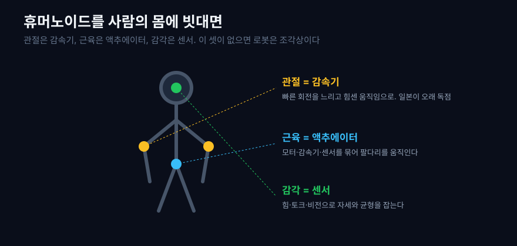
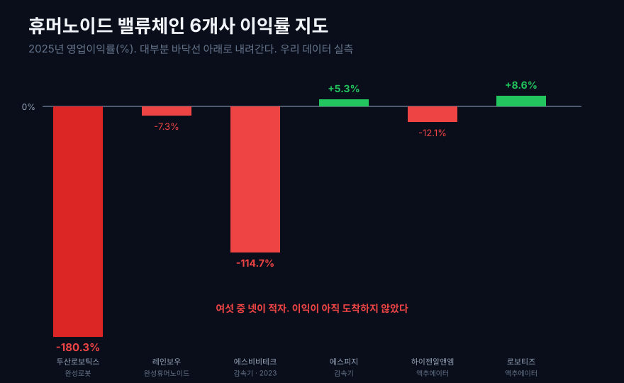
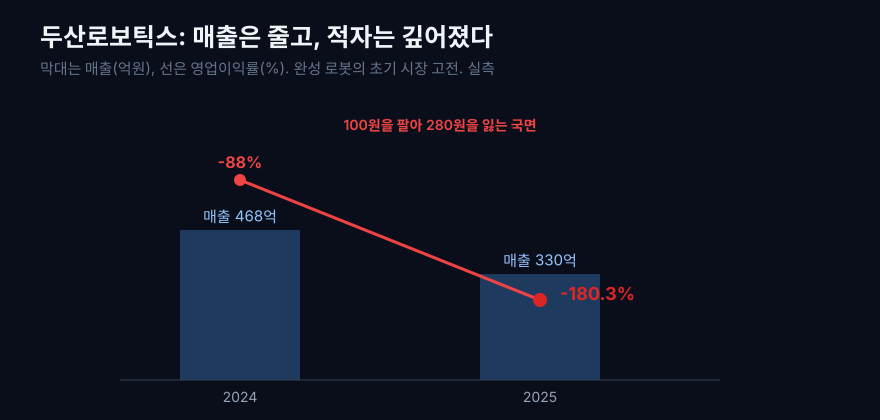
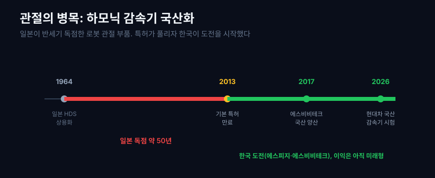
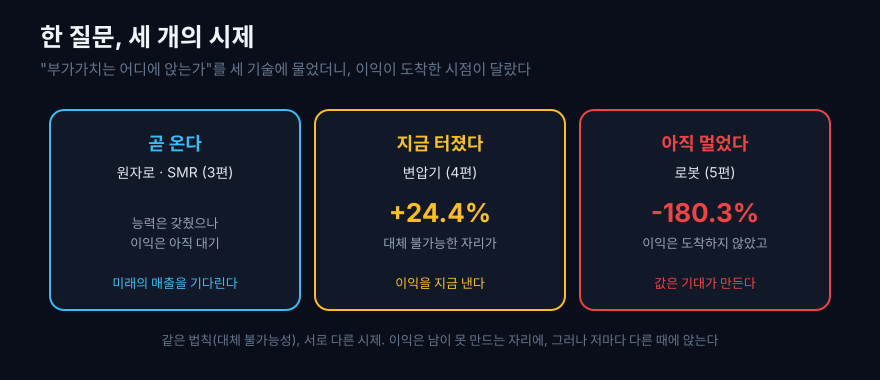

로봇 이야기는 늘 완성된 모습으로 온다. 테슬라의 옵티머스가 계단을 오르고, 삼성이 인수한 회사의 로봇이 두 발로 걷는 장면. 그런데 그 로봇이 실제로 팔을 뻗고 손가락을 접으려면, 겉으로 보이지 않는 부품들이 몸속에서 정확히 맞물려야 한다. 사람으로 치면 관절과 근육과 감각이다.

관절에는 모터의 빠른 회전을 느리고 힘센 움직임으로 바꾸는 감속기가 들어간다. 근육 자리에는 모터와 감속기와 센서를 하나로 묶은 액추에이터가 있다. 감각 자리에는 힘과 자세를 재는 센서가 있다. 이 세 가지가 없으면 로봇은 서 있는 조각상일 뿐이다. 그리고 이 부품들을 만드는 회사 상당수가 한국 증시에 상장돼 있다.

그렇다면 질문. **휴머노이드라는 이 뜨거운 기술의 관절과 근육은 어느 공정에서 만들어지고, 그 회사들은 DART와 EDGAR 공시에서 어떻게 확인되는가?** [SMR 원자로 지도](/blog/smr-reactor-value-chain)는 미래의 매출을 기다리는 공정을 보여줬고, [AI 전력망 지도](/blog/ai-power-transformer-supercycle)는 이미 터진 병목을 보여줬다. 로봇은 어느 쪽일까. 우리 데이터로 여섯 회사를 실측한 결과는, 앞의 두 편과 또 달랐다.

## 1. 로봇의 관절, 근육, 감각

휴머노이드를 사람의 몸에 빗대면 부품의 역할이 선명해진다.

첫째, **관절은 감속기다.** 모터는 빠르게 돌지만 힘이 약하다. 로봇 관절이 무거운 팔을 천천히, 정확히 움직이려면 이 회전을 느리고 힘센 것으로 바꿔야 한다. 그 일을 감속기가 한다. 특히 하모닉 감속기는 작고 정밀해 로봇 관절에 널리 쓰인다. 이 부품이 관절의 성능을 사실상 결정한다.

둘째, **근육은 액추에이터다.** 모터와 감속기, 그리고 위치를 재는 센서를 하나로 묶은 단위다. 사람의 근육이 뼈를 당기듯, 액추에이터가 로봇의 팔다리를 실제로 움직인다.

셋째, **감각은 센서다.** 힘과 토크를 재는 센서, 카메라 같은 비전 센서가 로봇의 자세와 균형을 잡아 준다.

이 셋 가운데 가장 만들기 어려운 것이 관절의 감속기다. 로봇이 사람처럼 부드럽고 정확하게 움직이려면, 감속기가 미세한 흔들림 없이 힘을 전달해야 한다. 톱니 하나의 작은 오차가 긴 팔을 거쳐 손끝에서는 큰 오차로 증폭되기 때문이다. 그래서 감속기는 정밀 가공, 열처리, 재료 기술이 오랜 시간 쌓여야 비로소 만들 수 있다. 로봇 한 대에는 관절마다 감속기가 들어가 수십 개가 필요하고, 그만큼 원가에서 큰 몫을 차지한다. 부품이면서도 아무나 못 만드는 이 자리가, 이 글이 끝까지 눈여겨보는 병목이다.

```python
import dartlab

# 완성 로봇 대표 두산로보틱스의 손익 시계열
c = dartlab.Company("454910")
c.select("IS", ["매출액", "영업이익"])
```



지금 이 시장이 뜨거운 이유는 분명하다. 테슬라가 옵티머스의 양산을 예고했고, 삼성전자는 국내 대표 로봇 회사 레인보우로보틱스의 최대주주가 됐으며, 정부는 K-휴머노이드 연합을 띄웠다. 현대차의 로봇 연구소는 양산 모델에 들어갈 감속기를 국내외 여러 회사에서 시험하며 국산 비중을 최대한 늘리려 한다. 기대는 하늘을 찌른다. 그렇다면 그 기대가 손익계산서에는 얼마나 도착했는지 보자.

공정별 근거 지도부터 세우면 완성 로봇과 부품사를 한 덩어리로 섞지 않을 수 있다. 국내 부품사는 DART 사업보고서와 손익계산서로, 테슬라 같은 글로벌 완성 로봇 수요자는 EDGAR 10-K의 자동화·로봇 관련 사업 설명으로 확인한다. 다만 테슬라의 휴머노이드 로봇은 아직 별도 매출 세그먼트가 아니므로, 여기서 EDGAR는 수요자 위치를 확인하는 근거이지 실적 실측 근거가 아니다.

| 공정/층위 | 기술 역할 | 대표 회사 | 공시 근거 | 재무로 보이는 흔적 |
|---|---|---|---|---|
| 완성 로봇 | 팔·다리·제어 소프트웨어를 통합한다 | 두산로보틱스·레인보우로보틱스(DART), Tesla(EDGAR) | DART 손익, EDGAR 사업 설명 | 양산 전에는 연구개발과 판관비가 먼저 보인다 |
| 관절 감속기 | 빠른 모터 회전을 느리고 힘센 움직임으로 바꾼다 | 에스비비테크·에스피지(DART) | DART 사업보고서와 손익 | 국산화 비용과 기존 산업용 감속기 이익을 분리해야 한다 |
| 모터·액추에이터 | 모터, 감속기, 위치 센서를 한 단위로 묶는다 | 하이젠알앤엠·로보티즈(DART) | DART 사업보고서와 손익 | 매출총이익률과 연구개발비가 기술 채택의 초기 흔적이다 |
| 감각·제어 | 힘, 토크, 자세를 읽고 균형을 잡는다 | 레인보우로보틱스·로보티즈(DART), ABB(EDGAR) | DART 기술 설명, EDGAR 로봇 사업 설명 | 부품 성능보다 양산 채택률이 이익 전환을 좌우한다 |
| 양산 수요자 | 대량 주문과 사양 표준을 만든다 | 현대차 그룹(DART), Tesla(EDGAR) | DART 사업 설명, EDGAR 10-K | 아직 실적보다 공급망 시험과 채택 가능성이 먼저 보인다 |

## 2. 공정 지도와 손익: 관절 병목은 아직 양산 전

여섯 회사를 완성품과 부품으로 나눠 세우고, 2025년 영업이익률을 실측했다. 앞선 두 편의 지도는 막대가 위로 솟았다. 이번 지도는 대부분이 바닥선 아래로 내려간다.



| 자리 | 회사 | 매출 (억원) | 영업이익률 (%) |
|---|---|---:|---:|
| 완성 협동로봇 | 두산로보틱스 | 330 | **-180.3** |
| 완성 휴머노이드·제어 | 레인보우로보틱스 | 341 | -7.3 |
| 하모닉 감속기 | 에스비비테크 (2023) | 74 | -114.7 |
| 정밀 감속기 | 에스피지 | 3,417 | **+5.3** |
| 서보모터·액추에이터 | 하이젠알앤엠 | 735 | -12.1 |
| 액추에이터·다이나믹셀 | 로보티즈 | 389 | +8.6 |

표시: 에스비비테크만 2023년 값이다. 매출 규모가 작아 완결된 마지막 연간이 2023년이고, 이후로도 2026년 1분기까지 매 분기 적자가 이어진다. 나머지는 모두 2025년 연간이다.

여섯 중 넷이 적자다. 그리고 흑자인 둘 가운데 하나(로보티즈)는 최근 분기 실적이 다시 흔들린다. 앞선 두 편에서 물었던 "부가가치는 어디에 앉는가"라는 질문 자체가, 여기서는 아직 성립하지 않는다. **이익이 아직 도착하지 않았기 때문이다.**

이것은 실망스러운 결론이 아니라, 오히려 이 시리즈에서 가장 정직한 장면이다. 앞선 두 편이 이미 이익이 앉은 자리를 지도로 그렸다면, 이 편은 이익이 아직 오지 않은 자리를 있는 그대로 보여준다. 기술 블로그는 흔히 뜨거운 기술의 밝은 면만 그리지만, 손익계산서는 그 열기가 아직 매출과 이익으로 번역되지 않았음을 냉정하게 증언한다. 중요한 것은 이 적자를 실패로 읽느냐, 아직 도착하지 않은 미래로 읽느냐다. 그 판단을 위해서는 화려한 완성품 뒤에 가려진 부품 하나하나를 뜯어봐야 한다. 왜 이런 그림이 나왔는지, 완성품부터 부품까지 걸어 보자.

## 3. 완성품의 고전: 시장을 여는 비용

완성 로봇을 만드는 두 회사, 두산로보틱스와 레인보우로보틱스부터 보자. 둘 다 이 시장의 상징이지만, 숫자는 상징과 정반대다.

두산로보틱스는 협동로봇을 만든다. 2023년 말 상장해 시계열은 짧지만, 그 짧은 구간이 이미 많은 것을 말한다.

```python
c = dartlab.Company("454910")   # 두산로보틱스, 완성 협동로봇
c.select("IS", ["매출액", "매출총이익", "영업이익"])
```

| 두산로보틱스 (연간) | 2024 | 2025 | 최근 4개 분기 |
|---|---:|---:|---:|
| 매출 (억원) | 468 | 330 | 430 |
| 매출총이익률 (%) | 20.4 | 13.4 | 18.9 |
| 영업이익률 (%) | -88.0 | **-180.3** | -138.2 |

2025년은 매출이 오히려 468억에서 330억으로 줄었는데 적자는 더 깊어졌다. 영업이익률 마이너스 180%는 100원을 팔 때마다 180원을 잃었다는 뜻이다. 완성 로봇은 아직 판매량이 적어 고정비를 나눠 낼 규모가 안 되는데, 미래를 위한 연구개발과 영업 조직에는 계속 돈을 넣어야 한다. 매출총이익률을 보면 더 분명하다. 물건을 팔아 원가만 뺀 마진이 2024년 20%에서 2025년 13%로 얇아졌다. 파는 값을 지키는 힘 자체가 아직 약하다는 뜻이다.

레인보우로보틱스는 더 긴 시계열을 가졌고, 그 시계열이 초기 시장의 출렁임을 그대로 보여준다.

```python
c = dartlab.Company("277810")   # 레인보우로보틱스, 완성 휴머노이드·협동로봇
c.select("IS", ["매출액", "매출총이익", "영업이익"])
```

| 레인보우로보틱스 (연간) | 2021 | 2022 | 2023 | 2024 | 2025 |
|---|---:|---:|---:|---:|---:|
| 매출 (억원) | 90 | 136 | 153 | 193 | 341 |
| 매출총이익률 (%) | 50.5 | 52.3 | 47.7 | 32.6 | 34.9 |
| 영업이익률 (%) | -11.5 | **+9.6** | **-292.2** | -15.4 | -7.3 |

매출은 5년 만에 90억에서 341억으로 3.8배가 됐다. 그런데 영업이익률은 롤러코스터다. 2022년에는 잠깐 플러스 9.6%로 흑자를 냈다가, 2023년에는 마이너스 292%로 곤두박질쳤다. 100원을 팔아 292원을 잃은 셈이다. 상장 이후 연구개발과 인력에 대규모로 투자하면서 비용이 매출을 압도한 국면이다. 이후 적자 폭은 2025년 마이너스 7.3%까지 좁혀졌지만, 아직 흑자 문턱을 넘지는 못했다. 매출총이익률이 초기 50%대에서 30%대로 내려온 것도, 몸집을 키우는 과정에서 원가 구조가 무거워졌음을 보여준다.

두 회사의 공통점은 분명하다. 매출은 자라는데 이익은 아직 오지 않았다. 그리고 이 적자를 버티는 힘이 삼성이라는 이름에서 나온다. 삼성이 레인보우로보틱스의 최대주주가 됐다는 사실은 그 자체로 하나의 신호다. 대기업이 이 초기 시장의 긴 적자를 감당할 체력을 대주기 시작했다는 뜻이기 때문이다. 초기 시장에서 끝까지 살아남는 힘은 기술만이 아니라, 이익이 도착할 때까지 적자를 버티는 자본이기도 하다. 이 적자가 왜 위험한지, 왜 [영업이익과 현금흐름을 함께 봐야 하는지](/blog/operating-cash-flow-vs-net-income)는 초기 시장 회사를 볼 때 특히 중요하다.



## 4. 진짜 병목은 관절: 감속기 국산화 전쟁

로봇 부품 가운데 가장 중요하고 가장 어려운 것이 관절, 곧 감속기다. 그중 하모닉 감속기는 오랫동안 한국이 넘지 못한 벽이었다. 하모닉 감속기는 미국에서 발명됐지만 일본의 하모닉드라이브시스템즈가 1964년 상용화한 뒤 반세기 동안 세계 시장을 사실상 독점했다. 기본 특허가 2013년 만료되면서 비로소 다른 나라가 도전할 문이 열렸다.

그 문으로 들어간 국내 회사가 에스비비테크와 에스피지다. 그런데 둘의 처지는 정반대다.

에스비비테크는 일본이 독점하던 하모닉 감속기를 국산화한 소부장 회사다. 2017년 양산을 시작했고 생산능력을 크게 늘리는 중이다.

```python
c = dartlab.Company("389500")   # 에스비비테크, 하모닉 감속기
c.select("IS", ["매출액", "매출총이익", "영업이익"])
```

| 에스비비테크 (연간) | 2023 |
|---|---:|
| 매출 (억원) | 74 |
| 매출총이익률 (%) | 1.5 |
| 영업이익률 (%) | **-114.7** |

2023년 영업이익률 마이너스 114.7%. 매출총이익률이 1.5%라는 건, 물건을 만드는 원가조차 거의 못 건졌다는 뜻이다. 감속기는 소재, 열처리, 톱니 설계까지 오랜 기술 축적이 필요한 분야라, 국산화의 초기 비용을 지금 치르는 셈이다. 문제는 이 적자가 일시적이지 않다는 데 있다. 매출 규모가 작아 완결된 연간 실적은 2023년이 마지막이지만, 이후 분기를 하나씩 봐도 2026년 1분기까지 매 분기 영업적자가 이어진다. 국산화 기술을 확보한 것과 그것으로 돈을 버는 것 사이의 거리가, 이 회사의 손익계산서에 고스란히 남아 있다.

에스피지는 이 글에서 뚜렷한 흑자를 낸 유일한 회사다. 그런데 여기에 이 글의 핵심 반전이 있다.

```python
c = dartlab.Company("058610")   # 에스피지, 정밀 감속기
c.select("IS", ["매출액", "매출총이익", "영업이익"])
```

| 에스피지 (연간) | 2020 | 2021 | 2022 | 2023 | 2024 | 2025 |
|---|---:|---:|---:|---:|---:|---:|
| 매출 (억원) | 3,548 | 4,163 | 4,405 | 3,938 | 3,885 | 3,417 |
| 매출총이익률 (%) | 17.6 | 16.3 | 17.3 | 16.0 | 16.4 | 19.2 |
| 영업이익률 (%) | 5.1 | 5.7 | 5.8 | 4.1 | 3.2 | **5.3** |

**에스피지의 흑자는 휴머노이드에서 나온 것이 아니다.** 표가 그것을 그대로 증언한다. 이 회사는 6년 내내 영업이익률 4~6%를 꾸준히 냈고, 정작 매출은 2022년 4,405억에서 2025년 3,417억으로 오히려 줄었다. 만약 휴머노이드가 이 회사의 이익을 새로 만들고 있다면 매출이 튀어야 하는데, 실제로는 반대다. 이 흑자는 새로 열린 로봇 시장이 아니라, 원래 하던 산업용 모터와 기어에서 나오는 오래된 이익이다. 에스피지는 하모닉과 사이클로이드(RV) 감속기까지 풀라인업을 국산화해 로봇 공급망의 중심축으로 주목받지만, 로봇용 감속기가 이 회사의 이익을 책임지는 단계는 아직 아니다. 현대차 로봇 연구소가 양산 모델에 국산 감속기 채택을 시험하는 지금, 이 회사가 기대를 받는 이유는 미래의 매출이지 오늘의 이익이 아니다.

두 회사를 나란히 놓으면 국산화의 두 얼굴이 보인다. 하모닉을 새로 국산화하는 에스비비테크는 기술을 얻는 대가로 지금 깊은 적자를 치르고, 오래된 산업용 강자 에스피지는 흑자를 내지만 그 흑자가 아직 로봇이 아니라 기존 사업에서 온다. 로봇의 관절을 국산화한다는 같은 목표를 두고, 한쪽은 미래를 위해 현재를 태우고 다른 한쪽은 과거의 본업으로 현재를 버틴다.

감속기 국산화가 국가적 과제가 된 이유는 단순한 자존심이 아니다. 로봇 원가의 큰 부분을 차지하는 부품을 통째로 일본에서 사 와야 한다면, 아무리 완성 로봇을 잘 만들어도 이익의 상당 부분이 부품값으로 빠져나간다. 반도체에서 소재를 국산화해 값을 정하는 힘을 되찾으려 했던 것과 똑같은 이유로, 로봇에서도 관절을 국산화하는 일이 곧 미래 이익을 지키는 일이 된다. 다만 국산화가 곧 흑자를 뜻하지는 않는다. 기술을 확보하는 것과 그 기술로 돈을 버는 것 사이에는, 규모라는 또 하나의 문턱이 놓여 있다. 지금 이 회사들이 서 있는 곳이 바로 그 문턱 앞이다.



## 5. 근육과 감각: 아직 규모를 못 이룬 곳

액추에이터와 모터를 만드는 회사들도 사정은 비슷하다. 하이젠알앤엠은 산업용 모터에서 출발해 휴머노이드용 스마트 액추에이터로 넓히는 중이고, 로보티즈는 다이나믹셀이라는 액추에이터로 구글과 테슬라의 로봇 시제품에 부품을 대 온 회사다.

하이젠알앤엠은 2024년 상장해 완결된 첫 연간이 2025년이다.

```python
c = dartlab.Company("160190")   # 하이젠알앤엠, 서보모터·액추에이터
c.select("IS", ["매출액", "매출총이익", "영업이익"])
```

| 하이젠알앤엠 (2025 연간) | 값 |
|---|---:|
| 매출 (억원) | 735 |
| 매출총이익률 (%) | 4.2 |
| 영업이익률 (%) | **-12.1** |

매출은 이 부품사들 중 큰 편인데도 영업이익률은 마이너스 12%다. 특히 매출총이익률이 4.2%로 얇다. 산업용 모터라는 기존 사업이 원가 경쟁이 치열한 영역인 데다, 휴머노이드용 액추에이터는 아직 매출로 이어지기 전이라 투자만 앞서는 국면이기 때문이다.

로보티즈는 더 긴 시계열을 가졌고, 그 시계열이 초기 시장의 이익이 어떻게 오는지를 보여준다.

```python
c = dartlab.Company("108490")   # 로보티즈, 액추에이터·다이나믹셀
c.select("IS", ["매출액", "매출총이익", "영업이익"])
```

| 로보티즈 (연간) | 2021 | 2022 | 2023 | 2024 | 2025 |
|---|---:|---:|---:|---:|---:|
| 매출 (억원) | 224 | 259 | 291 | 300 | 389 |
| 매출총이익률 (%) | 51.3 | 54.0 | 53.1 | 54.1 | 62.4 |
| 영업이익률 (%) | -4.2 | -8.4 | -18.2 | -9.9 | **+8.6** |

두 가지가 눈에 띈다. 첫째, 매출총이익률이 50~60%로 이 글에서 가장 높다. 다이나믹셀이라는 부품 자체는 값을 정하는 힘이 있다는 뜻이다. 둘째, 그런데도 영업이익률은 2024년까지 계속 마이너스였다. 물건은 좋은 값에 팔리는데, 그 위에 얹히는 연구개발과 판매 비용이 더 커서 영업 단계에서는 적자였던 것이다. 그러다 2025년 처음으로 영업이익률 플러스 8.6%로 흑자 전환했다.

다만 여기서 멈추면 오해한다. 최근 4개 분기(2025년 2분기~2026년 1분기)로 넓혀 보면 영업이익률이 다시 마이너스 23%로 돌아선다. 한 해의 흑자가 곧 항상성은 아니라는 뜻이다. 초기 시장 회사의 실적은 큰 계약 하나에 분기마다 크게 출렁이고, 로보티즈의 2025년 흑자도 그 출렁임의 한 봉우리일 수 있다. 이들의 매출이 꾸준히 늘고 있다는 것은 분명한 긍정 신호이지만, 그 성장이 안정적 이익으로 바뀌려면 로봇 시장 자체가 먼저 규모를 이뤄야 한다.

특히 로보티즈 같은 회사는 다이나믹셀이라는 부품으로 구글과 테슬라의 로봇 시제품에 이름을 올렸다. 기술이 세계 수준에서 인정받았다는 증거다. 그런데 시제품에 들어가는 것과 양산 라인에 들어가는 것은 물량의 자릿수가 다르다. 시제품은 몇 대, 양산은 수십만 대다. 부품 기술이 아무리 뛰어나도, 그 채택이 대량 주문으로, 다시 안정적 이익으로 건너오기까지는 로봇이 실제로 팔려 나가는 시간이 필요하다. 지금의 적자와 흑자 사이 출렁임은, 바로 그 건너오는 길목의 흔들림이다.

## 6. 양산 기대가 밸류에이션으로 먼저 온다

여기서 한 가지 이상한 점을 짚어야 한다. 이렇게 대부분 적자인 회사들의 주식 가치는, 실적에 비해 대단히 높게 매겨져 있다. 여러 로봇 부품 회사의 시가총액이 연 매출의 수십 배에 이른다. 손익계산서는 적자를 가리키는데 시장은 큰 값을 매기는, 겉보기에 모순된 상황이다.

이 모순은 사실 초기 시장의 특징이다. 시장은 지금의 이익이 아니라, 휴머노이드가 정말로 대량 보급되는 미래를 미리 사고 있다. 만약 그 미래가 오면, 관절과 근육이라는 병목을 쥔 회사들이 큰 물량을 안정적으로 공급하며 이익을 낼 수 있다. 그 가능성에 값을 매긴 것이다. 문제는 그 미래가 언제, 얼마나 크게 올지 아무도 확실히 모른다는 데 있다. 기대가 실적을 앞서 달릴 때, 그 간격은 희망이면서 동시에 위험이다. AI 소프트웨어에서 [기대가 앞섰던 회사와 실제로 번 회사가 갈렸던](/blog/vector-search-who-profits) 것과 같은 구도가, 로봇에서도 재현될 수 있다.

조금 더 들어가면, 이 기대의 근거는 두 가지다. 하나는 시장의 크기다. 세계에 팔릴 휴머노이드가 언젠가 수억 대에 이른다면, 로봇 한 대에 수십 개씩 들어가는 감속기 수요는 지금의 산업용 로봇 시장과 비교할 수 없이 커진다. 다른 하나는 대체 불가능성이다. 그 거대한 수요가 와도, 정밀 감속기를 제때 대량으로 공급할 수 있는 회사는 소수뿐이다. 이 두 가지가 겹치는 자리에 이익이 앉는다는 것이 지금 밸류에이션의 논리다. 다만 이것은 전부 조건문이라는 점을 잊으면 안 된다. 시장이 그만큼 커지고, 그 회사가 그 자리를 지켜 낼 때에만 성립한다. 조건문 위에 세운 값은, 조건이 흔들리면 함께 흔들린다.

## 7. 세 개의 시제, 그리고 숫자를 오해하지 않는 법

이제 이 세 편을 나란히 놓으면 하나의 그림이 완성된다. 같은 질문(부가가치는 어디에 앉는가)을 세 기술에 던졌더니, 세 개의 다른 시제가 나왔다.

- **곧 온다(원자로).** SMR 밸류체인은 능력은 갖췄으나 이익은 아직 오지 않았다. 미래의 매출을 기다린다.
- **지금 터졌다(변압기).** AI 전력난이 이익을 지금 이 순간 폭발시켰다. 대체 불가능한 자리가 값을 정한다.
- **아직 멀었다(로봇).** 이익이 도착하지 않았고, 지금 값을 만드는 것은 실적이 아니라 기대다.



그래서 로봇의 숫자를 오해하지 않는 법 네 가지.

첫째, **아직 초기 시장이다.** 대부분이 적자이고, 그 적자는 무능이 아니라 시장이 열리기 전 치르는 비용이다. 다만 초기라는 말이 곧 성공을 보장하지는 않는다. 열리지 않는 시장도 있다.

둘째, **흑자의 출처를 봐야 한다.** 에스피지는 흑자이지만 그 이익은 휴머노이드가 아니라 기존 산업용 사업에서 나온다. "로봇 흑자 기업"이라는 이름표를 그대로 믿으면 안 된다. 어느 사업이 이익을 냈는지 뜯어봐야 한다.

셋째, **밸류에이션은 기대이지 실적이 아니다.** 매출의 수십 배에 이르는 시가총액은 미래를 미리 산 값이다. 그 미래가 오면 정당화되고, 늦거나 작으면 조정된다. 실적과 기대의 간격을 늘 의식해야 한다.

넷째, **이익률만으로 좋고 나쁨을 말하지 않는다.** 이 글은 종목 추천이 아니라, 한 기술의 이익이 지금 어디까지 왔는지를 보는 지도다. `dartlab.scan`의 스크린 값이 아니라 손익계산서를 연간으로 합산한 실측으로, 그 도착 여부를 정직하게 표시했다.

로봇이 정말로 사람 곁에서 일하는 날이 오면, 이익은 어디에 앉을까. 세 편을 관통한 법칙대로라면, 가장 눈에 띄는 완성 로봇이 아니라 남이 못 만드는 관절, 곧 감속기를 쥔 자리일 가능성이 크다. 지금 일본의 50년 독점을 깨려는 [반도체 소재 국산화](/blog/sand-to-semiconductor)와 똑같은 문법의 싸움이 감속기에서 벌어지는 이유다. 다만 그것은 아직 미래형이다. 이 글이 남기는 것은 답이 아니라, 그 미래가 도착했는지를 확인할 좌표다. 로봇 부품 회사의 손익계산서에서 적자가 흑자로 바뀌기 시작하는 순간, 그때가 기대가 실적으로 건너오는 신호다. 그날까지 이 지도는 계속 다시 그려질 것이고, 이 글은 그 변화를 확인할 첫 좌표를 찍어 둔 셈이다. 다음 분기의 손익계산서가 그다음 좌표가 된다.

그래서 앞으로 로봇 뉴스를 볼 때 남길 것.

- **감속기 국산화율.** 현대차와 삼성의 양산 모델에 국산 감속기가 얼마나 채택되는지가, 병목이 이익으로 바뀌는 첫 신호다.
- **적자에서 흑자로.** 부품사의 손익계산서가 언제 흑자로 돌아서는지가, 기대가 실적으로 건너오는 지점이다.
- **흑자의 출처.** 로봇 흑자라는 말이 나오면, 그 이익이 로봇에서 왔는지 기존 사업에서 왔는지를 반드시 확인해야 한다.

## 검증표

본문의 모든 실측 수치는 아래 호출로 재현된다. 한국 상장사는 DART 기반 dartlab 실측, 글로벌 완성 로봇 수요자와 로봇 자동화 비교사는 EDGAR 10-K의 사업 설명을 공정 지도 근거로 붙였다. `scan`은 스크린이고, 표의 이익률·매출은 손익계산서를 분기 단위로 받아 연간(또는 최근 4개 분기, TTM)으로 합산한 실측이다. 데이터 기준: 2026-07-05, 2025년 연간까지 반영. 일부 회사는 최근 상장으로 시계열이 짧다.

| 본문 수치 | dartlab 호출 | 결과 |
|---|---|---|
| 두산로보틱스 영업이익률 -88.0%(2024) → -180.3%(2025), 최근 4개 분기 -138.2%, 매출 468→330억, 매출총이익률 20.4→13.4% | `Company("454910").panel("IS")` 분기 합산 | 실측 |
| 레인보우로보틱스 영업이익률 -11.5%(2021)·+9.6%(2022)·-292.2%(2023)·-15.4%(2024)·-7.3%(2025), 매출 90→341억 | `Company("277810").panel("IS")` | 실측 |
| 에스비비테크 2023 영업이익률 -114.7%, 매출총이익률 1.5%, 매출 74억 (완결된 마지막 연간, 이후 2026년 1분기까지 분기 적자 지속) | `Company("389500").panel("IS")` | 실측 |
| 에스피지 영업이익률 5.1%(2020)~5.3%(2025) 6년 연속 4~6%, 매출 4,405억(2022)→3,417억(2025), 매출총이익률 19.2%(2025) | `Company("058610").panel("IS")` | 실측 |
| 하이젠알앤엠 2025 영업이익률 -12.1%, 매출총이익률 4.2%, 매출 735억 | `Company("160190").panel("IS")` | 실측 |
| 로보티즈 영업이익률 -4.2%(2021)→+8.6%(2025), 최근 4개 분기 -23.0%, 매출총이익률 62.4%(2025), 매출 389억 | `Company("108490").panel("IS")` | 실측 |
| 테슬라·ABB 등 글로벌 로봇 수요자와 자동화 비교 축 | EDGAR 10-K 사업 설명 | 공정 지도 참고 |

기술 원리(감속기·하모닉 드라이브·액추에이터, 일본 독점과 국산화)와 최신 동향은 [디일렉: 현대차 휴머노이드 국산 감속기 채택](https://www.thelec.kr/news/articleView.html?idxno=52966), [이데일리: 휴머노이드 시대와 하모닉드라이브 재평가](https://marketin.edaily.co.kr/News/ReadE?newsId=01800726645383320), [비즈워치: 일본 독점 깬 에스비비테크](http://news.bizwatch.co.kr/article/market/2023/10/16/0033), [녹색경제신문: 감속기 국산화 1티어 에스피지](https://www.greened.kr/news/articleView.html?idxno=342327), [다음: 두산로보틱스 적자 지속](https://v.daum.net/v/20260219151524516)을 참고했다. 외부 본문은 원리와 동향 참고용이며, 이익률·매출 숫자는 전부 우리 데이터 실측이다. 공정 지도에 붙인 글로벌 완성 로봇 수요자와 자동화 비교사는 EDGAR 10-K의 사업 설명을 비교 축으로 썼고, 국내 수치는 DART 기반 dartlab 실측으로 검증했다.
