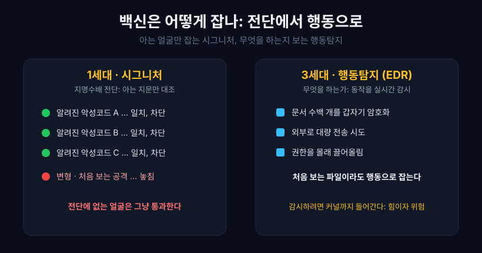
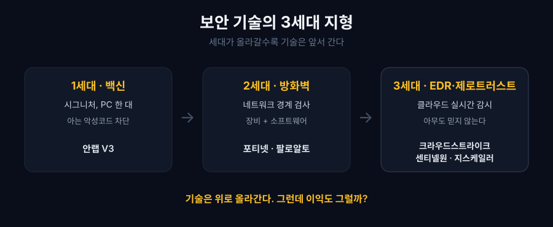
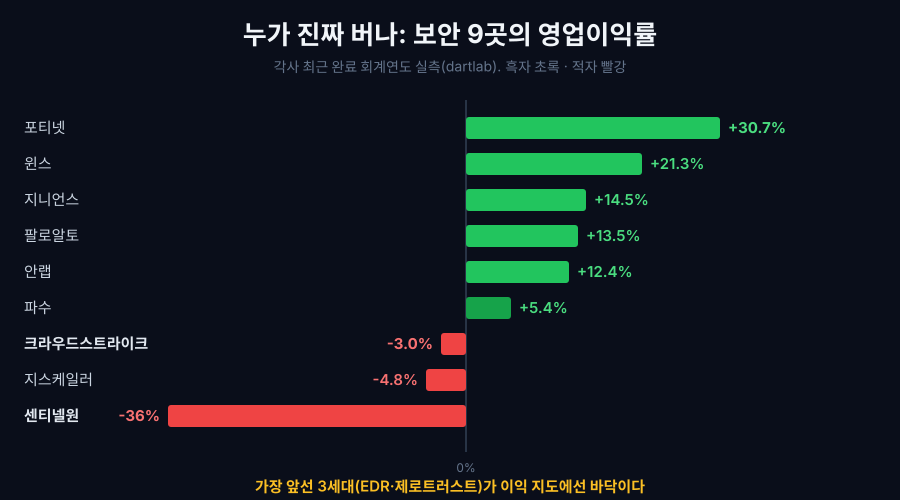
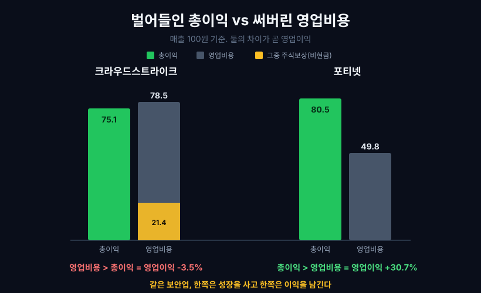
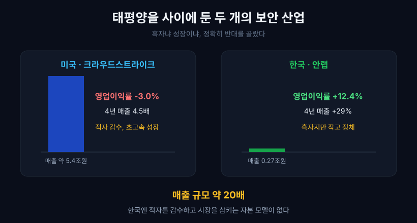

2024년 7월 19일 새벽, 세상을 지킨다는 회사가 세상을 멈췄다. 사이버보안 기업 크라우드스트라이크가 배포한 업데이트 파일 하나가 전 세계 윈도우 컴퓨터 약 850만 대를 파란 화면으로 만들었다. 공항이 멈추고 은행 창구가 닫히고 병원 시스템이 죽었다. 해커가 뚫은 게 아니라, 우리를 지키던 보안 프로그램이 스스로 무너진 것이다. 사상 최대의 IT 장애로 기록됐다.

이 사고는 이상한 질문을 남긴다. 백신 프로그램이 왜 그렇게 깊은 곳까지 들어가 있어서, 그게 넘어지자 컴퓨터 전체가 부팅조차 못 했을까? 그리고 더 이상한 사실이 하나 더 있다. 이렇게 세상을 좌우할 만큼 중요해진 최전선 보안 회사 크라우드스트라이크는, 매출총이익률이 75%나 되는데도 **회계상 영업적자**다. 반대로 아무도 첨단이라 부르지 않는 옛날 방화벽 회사 포티넷은 영업이익률 30.7%로 조용히 돈을 쓸어 담는다. 이 글은 그 두 가지 이상함을 하나로 잇는다. 답은 "백신이 어떻게 진화했는가"에 있고, 착지점은 보안 회사 아홉 곳의 손익계산서다.

## 1. 백신은 어떻게 악성코드를 잡나: 지명수배 전단의 한계

옛날 백신은 지명수배 전단으로 범인을 잡았다. 이미 알려진 악성코드의 "지문"(시그니처, 코드의 고유한 패턴)을 목록으로 잔뜩 갖고 있다가, 컴퓨터에 들어온 파일이 그 목록과 일치하면 잡아냈다. 안랩의 V3, 노턴, 맥아피가 30년간 이렇게 지켰다. 단순하고 빨랐다.

문제는 전단에 없는 얼굴이었다. 공격자가 코드를 조금만 바꾸면(다형성 악성코드) 지문이 달라져 전단을 피했고, 세상에 처음 등장한 공격(제로데이, 방어자가 아직 모르는 새 취약점)은 애초에 전단이 없었다. 지명수배 전단은 아는 얼굴만 잡는다.

그래서 보안은 질문을 바꿨다. **"이것이 무엇인가"가 아니라 "이것이 무엇을 하는가"** 를 보기로 했다. 처음 보는 파일이라도 갑자기 수백 개 문서를 암호화하기 시작하면 랜섬웨어로 판단해 멈춘다. 이 방식이 EDR(Endpoint Detection and Response, 단말 탐지·대응)이다. 크라우드스트라이크가 이 시장을 열었다.

그런데 행동을 감시하려면 컴퓨터의 모든 동작을 실시간으로 봐야 한다. 그래서 EDR 프로그램은 운영체제의 가장 깊은 층인 **커널**(하드웨어를 직접 다루는 핵심부)에 드라이버를 심는다. 응용프로그램 층에서는 볼 수 없는 은밀한 조작까지 잡으려면 이 자리가 필요하다. 이 깊은 자리가 바로 힘의 원천이자 위험의 원천이다.

행동을 감시한다는 건 구체적으로 이렇다. EDR은 커널에 자리 잡고 프로그램 실행, 파일 접근, 네트워크 연결 같은 거의 모든 사건을 실시간으로 기록한다(윈도우의 이벤트 추적 기능 ETW와 커널 콜백을 쓴다). 이 방대한 기록을 클라우드로 보내, 전 세계에서 모은 위협 패턴과 인공지능 모델에 대조해 "이 동작들의 조합은 랜섬웨어다" 같은 판단을 내리고, 곧바로 그 프로세스를 죽이거나 그 PC를 망에서 격리한다. 악성코드가 숨는 곳이 사용자 프로그램의 아래층이라, 그 아래층인 커널에서 지켜봐야 놓치지 않는다.

바로 그 커널이 2024년 사고의 무대였다. 커널은 운영체제의 가장 안쪽(ring 0)이라, 여기서 무언가 잘못되면 그 프로그램만이 아니라 컴퓨터 전체가 함께 멈춘다. 사용자 프로그램(ring 3)이 죽으면 그 앱만 꺼지고 복구되는 것과는 급이 다르다. 크라우드스트라이크가 배포한 설정 파일(채널 파일 291)은 코드가 아니라 위협 탐지 규칙을 담은 파일이었는데, 입력 항목 수가 어긋난(정의는 21개인데 실제로는 20개만 전달) 탓에 커널의 센서가 없는 메모리를 읽으려다 멈췄다. 게다가 이 파일이 부팅 때 먼저 로드되는 바람에 컴퓨터는 켜자마자 다시 죽는 부팅 루프에 빠졌고, 850만 대를 사람이 일일이 안전모드로 들어가 손으로 지워야 했다. 항공사는 하루 수천 편을 결항했고 병원과 은행, 방송이 멈췄으며 피해는 수백억 달러로 추정됐다. 해커가 뚫은 게 아니라, 감시를 위해 심장 옆에 앉은 보안 프로그램이 스스로 넘어진 대가였다.

사고 뒤 마이크로소프트는 아예 판을 바꾸기로 했다. 보안 제품이 커널에 직접 들어오지 않고 사용자 모드(앱과 같은 바깥층)에서 돌게 하는 새 플랫폼을 만들기 시작했다(윈도우 회복력 계획). 커널에서 죽으면 세상이 멈추지만 사용자 모드에서 죽으면 그 앱만 멈추고 복구되기 때문이다. 감시의 힘과 사고의 위험이 같은 자리에서 나왔다는 걸, 업계 전체가 값비싸게 배운 것이다.



## 2. 보안의 3세대 지형: 기술은 위로 올라간다

보안 회사를 기술 세대로 줄 세우면 셋으로 나뉜다. 이 순서가 뒤에 나올 돈 이야기의 뼈대다.

- **1세대, 전통 백신**: 시그니처 중심. 안랩(V3)이 대표다. PC 한 대에 깔려 아는 악성코드를 막는다.
- **2세대, 통합·차세대 방화벽**: 네트워크의 경계에서 드나드는 트래픽을 검사한다. 포티넷과 팔로알토가 여기서 컸다. 하드웨어 장비 + 소프트웨어를 함께 판다.
- **3세대, 클라우드 네이티브 EDR과 제로트러스트**: 경계가 사라진 시대(재택·클라우드)에 맞춰, 모든 단말과 접속을 클라우드에서 실시간 감시한다. 크라우드스트라이크, 센티넬원, 지스케일러가 이 세대다. "아무도 믿지 않는다(제로트러스트)"가 원칙이다.

제로트러스트(Zero Trust)라는 말은 이름 그대로다. 옛 방식은 회사 네트워크 안에 한 번 들어오면 그 안에서는 믿어 줬다. 성벽 안이면 아군으로 본 것이다. 그런데 재택근무와 클라우드로 성벽 자체가 사라지자, 안이든 밖이든 매 접속을 매번 다시 검증하는 원칙으로 바뀌었다. 한 번의 통과가 영원한 신뢰가 되지 않는다. 지스케일러가 이 접속 검증을 클라우드에서 대신 해 주는 회사다.

세대가 올라갈수록 기술은 분명히 앞서 간다. 클라우드에서 전 세계 위협 정보를 모아 인공지능으로 걸러내는 3세대는, PC에 전단을 깔아두던 1세대와 차원이 다르다. 상식대로라면 가장 앞선 3세대가 가장 좋은 회사여야 하고, 돈도 가장 잘 벌어야 한다. 그런데 손익계산서를 열면 그 상식이 깨진다.



## 3. 기술 지도와 이익 지도가 어긋난다

보안 회사 아홉 곳의 가장 최근 회계연도 영업이익률을 나란히 놓아 보자. 미국사는 결산월이 제각각이라(크라우드스트라이크 1월, 팔로알토 7월, 포티넷 12월) 각사 회계연도 기준으로 맞췄다. 영업이익률은 비율이라 결산월이 달라도 공정하게 비교된다.

```python
import dartlab
c = dartlab.Company("CRWD")   # 크라우드스트라이크 (나스닥, EDGAR)
c.select("IS", ["revenue", "gross_profit", "operating_income"])
# 분기 컬럼 반환 → 각사 회계연도 4개 분기 합산
```

| 회사 | 세대 | 최근 매출 | 영업이익률 |
|---|---|---:|---:|
| **포티넷** (FTNT) | 2세대 방화벽 | 68.0억 달러 | **+30.7%** |
| 팔로알토 (PANW) | 2~3세대 플랫폼 | 92.2억 달러 | 약 +13% |
| **안랩** (053800) | 1세대 백신 | 2,677억 원 | +12.4% |
| 윈스 (136540) | 2세대 네트워크 | 990억 원 | +21.3% |
| 지니언스 (263860) | 3세대 접근제어 | 484억 원 | +14.5% |
| **크라우드스트라이크** (CRWD) | 3세대 EDR | 39.5억 달러 | **-3.0%** |
| 지스케일러 (ZS) | 3세대 제로트러스트 | 26.7억 달러 | -4.8% |
| **센티넬원** (S) | 3세대 EDR | 8.2억 달러 | **-36%** |

표시: 적자 3곳은 모두 미국의 3세대 EDR·제로트러스트(크라우드스트라이크·지스케일러·센티넬원)다. 반대로 흑자인 곳은 방화벽·백신 같은 앞 세대이거나, 같은 3세대라도 한국의 지니언스처럼 작고 규율 있게 버는 회사다. 세대가 아니라 자본 모델이 가른다는 첫 신호다. 미국사는 각사 회계연도 실적발표(10-K) 기준, 한국사와 포티넷은 dartlab 실측이며 모두 각사 최근 완료 회계연도(FY2025)다.

지도가 어긋난다. 기술 지도에서 맨 위에 있던 미국의 3세대(크라우드스트라이크 -3.0%, 지스케일러 -4.8%, 센티넬원 -36%)가 이익 지도에서는 바닥이다. 반대로 아무도 첨단이라 부르지 않는 옛 방화벽 포티넷이 30.7%로 꼭대기에 있다. 가장 좋은 기술을 가진 회사가 가장 돈을 못 벌고 있는 것이다. 이건 실수인가, 아니면 이유가 있는가?



이 어긋남은 한 해의 우연이 아니다. 시간을 펼치면 더 분명해진다. 크라우드스트라이크는 3년 만에 매출이 22억에서 40억 달러 가까이로 불었지만, GAAP 영업이익은 흑자 문턱까지 갔다가 2024년 7월 사고가 난 회계연도에 다시 적자가 깊어졌다.

| 크라우드스트라이크 | FY2023 | FY2024 | FY2025 |
|---|---:|---:|---:|
| 매출 (억 달러) | 22.4 | 30.6 | 39.5 |
| GAAP 영업이익률 | -8.5% | -0.1% | -3.0% |

표시: FY2024(2024년 1월 결산)에 영업이익률이 -0.1%까지 올라 흑자를 코앞에 뒀다가, 7·19 사고가 포함된 FY2025에 -3.0%로 되밀렸다(고객 보상·계약 조정 여파). 시장을 이끄는 회사와 돈을 버는 회사가 자주 다르다는 건 "누가 버나"를 똑같이 물었던 [벡터 검색 편](/blog/vector-search-who-profits)에서도 본 장면이다.

## 4. 75%의 총이익은 어디로 사라지나

크라우드스트라이크의 손익계산서를 한 장씩 벗겨 보면 적자의 정체가 드러난다. 매출 100원을 기준으로 돈이 어디로 가는지 따라가 보자(최근 회계연도 실측).

```python
c = dartlab.Company("CRWD")
c.select("IS", ["revenue", "gross_profit", "research_and_development",
                "selling_general_and_administrative", "stock_compensation_expense",
                "operating_income"])
```

크라우드스트라이크는 100원을 팔면 원가를 빼고 **75원**이 매출총이익으로 남는다(매출총이익률 75%). 소프트웨어 구독이라 원가가 거의 없어서, 이 자체는 세계 최고 수준의 장사다. 문제는 그 다음이다. 이 75원을 다음 세대 기술을 만드는 연구개발과 새 고객을 잡는 영업·마케팅에 쏟아붓는데, 영업비용 총합이 **78원**으로 벌어들인 총이익을 넘어선다. 그래서 회계상(GAAP) 영업이익은 100원당 마이너스 3원, 회계연도 전체로는 1.2억 달러 적자다.

그런데 이 비용의 상당 부분이 **주식보상 같은 '현금이 나가지 않는' 비용**이다. 그것들을 뺀 조정 영업이익(non-GAAP)은 오히려 **+8.4억 달러 흑자**, 매출의 21%다. 회계상 마이너스 3%와 조정 후 플러스 21% 사이의 24%포인트 간극이 거의 다 주식보상 같은 비현금 비용이다. 회사는 현금이 아니라 주식으로 급여를 지불해 현금을 아끼고, 그 아낀 현금으로 성장을 산다.

핵심은 이 지출이 낭비가 아니라 **선택**이라는 점이다. 크라우드스트라이크는 매출이 4년 만에 약 4.5배(8.7억→39.5억 달러)로 폭발했고, 가장 최근 회계연도에도 29% 성장했다. 이 성장을 사기 위해 지금의 회계 이익을 미래로 미루는 중이다. 반면 포티넷은 이미 다 자란 사업이다. 매출총이익률은 오히려 더 높고(80.5%), 연구개발비는 매출의 12%로 절반 이하이며, 주식보상 같은 폭발적 비용이 없다. 그 규율이 영업이익률 30.7%를 만든다. 같은 보안업인데 한쪽은 성장을 사고 한쪽은 이익을 남긴다.



포티넷의 규율도 하루아침의 결과가 아니다. 영업이익률이 5년에 걸쳐 꾸준히 올라 30%를 넘겼다.

| 포티넷 | 2021 | 2022 | 2023 | 2024 | 2025 |
|---|---:|---:|---:|---:|---:|
| 영업이익률 | 19.5% | 21.9% | 23.4% | 30.3% | 30.7% |

표시: 성장을 좇기보다 이미 가진 사업에서 이익률을 끌어올린 궤적이다. 방화벽은 드나드는 트래픽을 일일이 검사하는 무거운 연산인데, 포티넷은 이 검사를 범용 CPU 대신 자체 설계한 보안 전용 칩(ASIC)에 맡겨 값싸고 빠르게 처리한다. 남이 비싼 서버로 하는 일을 전용 칩으로 하니, 매출총이익률 80%가 떠받쳐진다.

가장 극단은 센티넬원이다. 주식보상 같은 비현금 비용이 워낙 커서, 회계상 영업이익률은 마이너스 36%인데 그걸 빼면 non-GAAP은 겨우 플러스 1%다. 적자의 거의 전부가 비현금이 만든 그림자라는 뜻이다. 3세대 EDR의 깊은 적자는 게으름이 아니라, 아직 규모의 문턱을 넘지 못한 채 미래를 당겨쓰는 청년기의 모습이다.

## 5. 적자인데 왜 시장은 돈을 대주나

여기서 한 걸음 더 들어가야 이 산업이 보인다. 크라우드스트라이크는 회계상 적자인데도 곳간은 오히려 넘친다. 그 비밀은 소프트웨어 구독의 회계에 있다.

첫째, **이연매출**이다. 고객은 보통 1년치 구독료를 미리 낸다. 현금은 즉시 통장에 꽂히지만, 회계 규칙상 매출은 서비스를 제공하는 12개월에 걸쳐 나눠 인식한다. 아직 매출로 안 잡힌 이 선수금은 재무상태표에 '이연매출'이라는 부채로 쌓인다. 크라우드스트라이크의 이연매출은 약 3.7조 원(현재분 27.3억 달러 + 비유동 10.0억 달러)에 이른다. 이름은 부채지만, 이미 계약되고 돈까지 받은 미래 매출이다. 갚아야 할 빚이 아니라 채워 넣기만 하면 되는 매출 창고인 셈이다.

```python
c = dartlab.Company("CRWD")
c.select("BS", ["contract_liability", "cash_and_cash_equivalents"])
```

둘째, 그래서 **현금과 잉여현금흐름은 두둑하다.** 손에 쥔 현금성 자산이 43억 달러(약 6조 원)이고, 투자비를 빼고도 남는 잉여현금흐름은 최근 회계연도에 10.7억 달러(잉여현금 마진 27%)로 사상 최대였다. 회계장부의 '적자'는 그림자이고, 실제 현금은 콸콸 들어온다.

셋째, **주식보상의 정체**다. 앞서 본 매출의 21%짜리 주식보상은 현금이 나가는 비용이 아니다. 직원에게 현금 대신 회사 주식을 주는 것이라 통장에서는 한 푼도 빠지지 않는다. 대신 그 대가는 기존 주주의 지분이 조금씩 옅어지는 **희석**으로 치른다. 크라우드스트라이크는 현금을 아끼려 급여의 상당 부분을 주식으로 지불하고, 그렇게 아낀 현금으로 성장을 산다. 회계는 이걸 비용으로 잡아 적자로 보이게 하지만, 현금의 관점에서는 정반대다.

여기에 하나를 더하면 시장이 왜 적자를 눈감아 주는지가 풀린다. 바로 **끈적함**이다. 크라우드스트라이크의 순매출유지율은 112%다. 작년에 들어온 고객이 올해 12%를 더 쓴다는 뜻이라, 새 고객을 한 명도 안 받아도 매출이 스스로 12% 는다. 한번 커널에 자리 잡은 보안은 좀처럼 걷어내지 못한다. 여기에 '성장률 더하기 현금창출력이 40을 넘으면 건강한 구독 기업'이라는 오랜 경험칙('40의 법칙')을 대보면, 크라우드스트라이크는 매출 성장률 29%에 잉여현금흐름 마진 27%를 더해 56으로 이 선을 가뿐히 넘는다. 회계상 적자는 성장이 멈추는 순간 흑자로 뒤집힐 수 있는, 스스로 고른 적자인 셈이다. 다만 그 전제는 성장과 유지율이 계속된다는 것이고, 그게 꺾이면 이 논리도 함께 무너진다. 시장이 이 회사들에 매긴 값은 바로 그 지속에 건 베팅이다.

## 6. 태평양 건너: 한국 보안은 다 흑자인데 왜 작나

같은 잣대를 한국에 대면 정반대 그림이 나온다. 토종 보안사는 하나같이 흑자다. 안랩은 1995년 의사 출신 안철수가 개인용 백신 V3에서 출발해 세운 회사로, 30년을 지켜 온 토종 대표다. 그 안랩이 영업이익률 12.4%, 네트워크 보안 윈스는 21.3%, 접근제어의 지니언스는 14.5%다. 적자로 미래를 사는 회사가 거의 없다.

```python
c = dartlab.Company("053800")   # 안랩 (KOSDAQ, DART)
c.select("IS", ["매출액", "영업이익"])   # 분기 합산 → 연간
```

그런데 모두 작다. 안랩의 1년 매출은 2,677억 원, 약 2,700억이다. 크라우드스트라이크의 매출 39.5억 달러는 원화로 약 5.4조 원이다. **크라우드스트라이크 하나가 토종 대표 안랩의 스무 배가 넘는다.** 게다가 잘 크지도 않는다. 윈스는 매출이 4년째 1,000억 원 언저리에서 제자리걸음이고(2022년 1,014억 → 2025년 990억), 데이터보안 파수는 영업이익률이 11.8%에서 5.4%로 내려앉았다. 그나마 성장의 실마리를 보이는 곳은 접근제어에서 EDR로 사업을 넓히려는 지니언스 정도인데, 흑자는 지키되 새 세대 기술로 몸집을 키우려는 시도다. 그마저도 규모는 미국 회사의 수십 분의 일이다.

왜 이렇게 갈렸을까. 세 가지가 겹친다. 첫째는 **놀 물의 크기**다. 한국 보안 매출의 상당 부분이 공공기관과 금융권의 내수 조달이고, 해외로 나가려면 언어와 국가별 인증, 대형 레퍼런스라는 벽이 높다. 시장이 작으니 회사도 작게 머문다. 둘째는 **자본 모델**이다. 미국에는 몇 년을 적자로 버티며 주식으로 인재를 모으고 시장을 통째로 삼키는 성장 자본이 있다. 크라우드스트라이크가 매출의 4분의 1을 주식보상으로 쓰는 게 그 연료다. 한국 상장 보안사에는 그런 연료도, 그 적자를 몇 년씩 받쳐 줄 투자자도 드물다. 셋째, 그래서 한국은 **흑자를 규율로 지킨다.** 적자를 감수하고 세계를 삼키는 베팅 대신, 내수에서 꾸준히 남기는 길을 택했다. 안정적이지만, 규모의 게임은 미국이 가져간다. 흑자냐 성장이냐. 태평양을 사이에 두고 두 산업은 정확히 반대 방향을 골랐다.



## 7. 이렇게 오해하면 안 된다

이 이야기는 몇 가지로 잘못 읽히기 쉽다. 정직하게 못을 박아 둔다.

**"적자니까 나쁜 회사"가 아니다.** 크라우드스트라이크는 회계상 영업적자지만, 실제로 영업으로 번 현금은 크게 플러스다(직전 회계연도 영업활동현금흐름 약 +13.8억 달러). 주식보상처럼 현금이 나가지 않는 비용이 회계 이익을 눌렀을 뿐, 현금 사정은 튼튼하다. 회계상 영업이익과 손에 쥐는 현금은 다르다. 이 둘이 왜 갈리는지는 [영업현금흐름과 순이익 편](/blog/operating-cash-flow-vs-net-income)에서 자세히 다뤘다. 이 글이 "적자"라 부른 것은 언제나 회계상 영업이익 기준이다.

**"안랩이 뒤처졌다"고 단정하지 말자.** 규모는 작아도 30년간 흑자를 지킨 내수 강자다. 성숙한 시장에서 이익을 남기는 게임과, 적자를 감수하고 세계 시장을 사는 게임은 애초에 다른 게임이다. 어느 쪽이 옳다고 이 글은 말하지 않는다.

**기술 성숙도를 정확히 보자.** EDR과 제로트러스트는 이미 상용화돼 대기업이 널리 쓰는 성장기 기술이지, 실험실 단계가 아니다. 다만 "차세대"라는 말은 절반은 마케팅이다. 아직 산업의 이익이 이 세대로 완전히 옮겨오지 않았다는 뜻에서, 이익의 관점에서는 여전히 도착 전이다. 기술은 앞섰는데 이익이 아직 도착하지 않은 성장 시장의 모습은 [휴머노이드 부품 편](/blog/humanoid-robot-actuator)에서도 똑같이 봤다.

**크라우드스트라이크의 적자에는 2024년 장애의 그림자도 있다.** 사고 뒤 고객 보상과 계약 조정이 실적에 일부 반영됐다. 순수하게 성장 전략만으로 생긴 적자는 아니라는 점을 함께 봐야 한다.

## 8. 판단: 이익이 옮겨앉는 날

기술은 시그니처를 떠났다. 지명수배 전단으로 아는 얼굴만 잡던 시대는 지났고, 행동을 감시하는 EDR과 아무도 믿지 않는 제로트러스트가 최전선을 차지했다. 그러나 이익은 아직 그 최전선으로 따라오지 못했다. 지금 돈은 여전히 옛 방화벽(포티넷 30.7%)과 토종 백신(안랩 12.4%)에 남아 있다.

그래서 보안 회사를 볼 때 던질 질문은 "기술이 몇 세대인가"가 아니다. **"세계 최고의 매출총이익을 이익으로 남기는가, 아니면 성장에 태우는가. 그리고 주식보상이 얼마나 큰가."** 이 질문이 기술 지도와 이익 지도의 어긋남을 정확히 읽어 낸다. 밸류체인에서 이익이 어느 자리에 앉는지를 따지는 이 문법은 [반도체 편](/blog/sand-to-semiconductor)이나 [전력·변압기 편](/blog/ai-power-transformer-supercycle)에서 본 것과 다르지 않다.

이 산업의 진짜 변곡점은, 크라우드스트라이크나 센티넬원 같은 3세대가 성장을 크게 꺾지 않은 채 그 거대한 주식보상을 소화하며 회계상 흑자로 넘어가는 순간이다. 그날 이익 지도가 비로소 기술 지도를 따라잡는다. 한국에서는, 흑자의 안정 위에서 누가 EDR과 제로트러스트로 규모를 만들어 낼 것인가가 다음 장면이다. 지니언스가 접근제어에서 EDR로 넓히려는 시도가 그 실험의 하나다.

다음 공시철에 보안주를 연다면, 매출 성장률 옆에 꼭 두 줄을 같이 보자. 매출총이익률과 주식보상 규모. 그 두 줄이 "이 회사가 성장을 사는 중인지, 이익을 이미 남기는지"를 말해 준다.

## 검증표

본문 수치의 출처다. **12월 결산인 한국사와 포티넷, 그리고 크라우드스트라이크의 재무상태표(이연매출·현금)는 dartlab 실측**이다. 반면 **1월·7월 결산 미국사(크라우드스트라이크·팔로알토·지스케일러·센티넬원)의 손익계산서는 dartlab의 분기 라벨이 회계연도와 어긋나, 각사 회계연도 실적발표(10-K)를 인용**했다(이 종목들은 분기 합산이 불안정해 공시 원본을 쓴다). 기준은 각사 최근 완료 회계연도(FY2025). 데이터 기준 2026-07-05.

| 본문 수치 | 출처 | 구분 |
|---|---|---|
| 포티넷 매출 68.0억 달러 / 영업이익률 30.7% / 매출총이익률 80.5% / R&D 매출대비 12.0% (FY2025, 12월 결산) | `Company("FTNT").select("IS")` | dartlab 실측 (EDGAR) |
| 포티넷 영업이익률 궤적 19.5% → 30.7% (2021~2025) | `Company("FTNT").select("IS")` 연도별 | dartlab 실측 |
| 크라우드스트라이크 매출 39.5억 달러(+29%) / GAAP 영업손실 1.2억 달러(-3.0%) / 매출총이익률 75% / non-GAAP 영업이익 +8.4억 달러 (FY2025, 1월 결산) | CrowdStrike FY2025 실적발표 | 외부 인용 (아래 출처) |
| 크라우드스트라이크 매출 궤적 22.4 → 30.6 → 39.5억 달러 / GAAP 영업이익률 -8.5% → -0.1% → -3.0% (FY2023~FY2025) | CrowdStrike 실적발표·10-K | 외부 인용 |
| 크라우드스트라이크 잉여현금흐름 10.7억 달러(마진 27%) / 순매출유지율 112% (FY2025) | CrowdStrike FY2025 실적발표 | 외부 인용 |
| 크라우드스트라이크 이연매출 약 3.7조 원(현재 2,733M + 비유동 996M) / 현금성자산 4,323M 달러 (FY2025 기말) | `Company("CRWD").select("BS", ["contract_liability","cash_and_cash_equivalents"])` | dartlab 실측 (EDGAR, 공시와 일치) |
| 팔로알토 매출 92.2억 달러 / 영업이익률 약 13% (FY2025, 7월 결산) | 실적발표 + `Company("PANW")` | 외부 인용 |
| 지스케일러 매출 26.7억 달러 / 영업이익률 -4.8% (FY2025, 7월 결산) | Zscaler FY2025 실적발표 | 외부 인용 (dartlab과 일치) |
| 센티넬원 매출 8.2억 달러(+32%) / GAAP 영업이익률 -36% / non-GAAP +1% (FY2025, 1월 결산) | SentinelOne FY2025 실적발표 | 외부 인용 |
| 안랩 매출 2,677억 원 / 영업이익률 12.4% (2025) | `Company("053800").select("IS")` | dartlab 실측 (DART) |
| 윈스 매출 990억 원 / 영업이익률 21.3% (2025, 정체) | `Company("136540").select("IS")` | dartlab 실측 (2022 1,014억 → 2025 990억) |
| 지니언스 매출 484억 원 / 영업이익률 14.5% (2025) | `Company("263860").select("IS")` | dartlab 실측 |
| 파수 영업이익률 11.8% → 5.4% 하락 (2022~2025) | `Company("150900").select("IS")` | dartlab 실측 |

## 기술 성숙도와 출처

- **기술 성숙도**: 시그니처 백신은 성숙기(수십 년 상용), 차세대 방화벽은 성숙기, EDR과 제로트러스트(SASE/ZTNA)는 성장기(광범위 상용화 진행 중)로 표기한다. "차세대"라는 명칭은 기술 세대 구분일 뿐 이익 도착을 뜻하지 않는다.
- **2024년 장애 사실과 기술 원리 출처(외부, untrusted)**: [2024 CrowdStrike-related IT outages (Wikipedia)](https://en.wikipedia.org/wiki/2024_CrowdStrike-related_IT_outages) · [Widespread IT Outage Due to CrowdStrike Update (CISA)](https://www.cisa.gov/news-events/alerts/2024/07/19/widespread-it-outage-due-crowdstrike-update) · [CrowdStrike outage: What you should know (IBM)](https://www.ibm.com/think/news/recent-crowdstrike-outage-what-you-should-know) · [Explaining the largest IT outage in history (TechTarget)](https://www.techtarget.com/whatis/feature/Explaining-the-largest-IT-outage-in-history-and-whats-next). 850만 대 규모, 채널 파일 291의 입력 항목 불일치(21 대 20) 논리 오류는 위 출처 기준이다.
- **제로트러스트 표준 참고(외부, untrusted)**: [Zero Trust Architecture (NIST SP 800-207)](https://csrc.nist.gov/pubs/sp/800/207/final).
- **커널 정책 변화 출처(외부, untrusted)**: [Microsoft Windows Resiliency Initiative and the security kernel (Cybersecurity Dive)](https://www.cybersecuritydive.com/news/microsoft-windows-resilience-initiative-security-kernel/813416/). 보안 제품을 커널 밖(사용자 모드)에서 실행하도록 하는 새 플랫폼 방향은 위 출처 기준이다.
- **재무 수치 출처(외부, 미국사 손익)**: [CrowdStrike FY2025 실적발표](https://ir.crowdstrike.com/news-releases/news-release-details/crowdstrike-reports-fourth-quarter-and-fiscal-year-2025) · [Zscaler FY2025 실적발표](https://ir.zscaler.com/news-releases/news-release-details/zscaler-reports-fourth-quarter-and-fiscal-2025-financial-results) · [SentinelOne FY2025 실적발표](https://www.businesswire.com/news/home/20250312530689/en/SentinelOne-Announces-Fourth-Quarter-and-Fiscal-Year-2025-Financial-Results).
- 데이터 구분: 한국사·포티넷 손익과 크라우드스트라이크 재무상태표는 dartlab이 DART·EDGAR에서 런타임 직독한 실측이고, 1월·7월 결산 미국사의 손익·유지율·현금흐름은 위 실적발표를 인용했다(dartlab의 회계연도 분기 라벨이 어긋나는 것을 검산으로 잡아 정정). 종목별 출처는 검증표에 명시했다.
</content>
</invoke>
