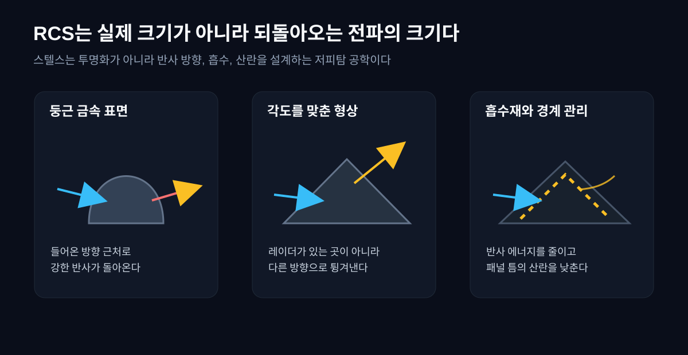
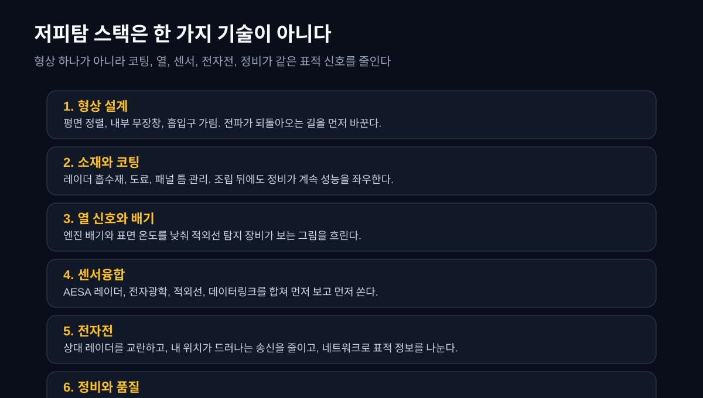
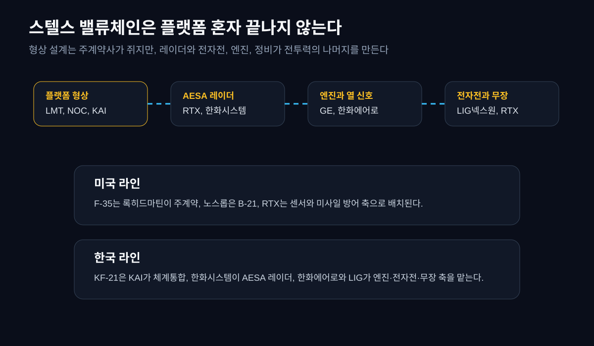
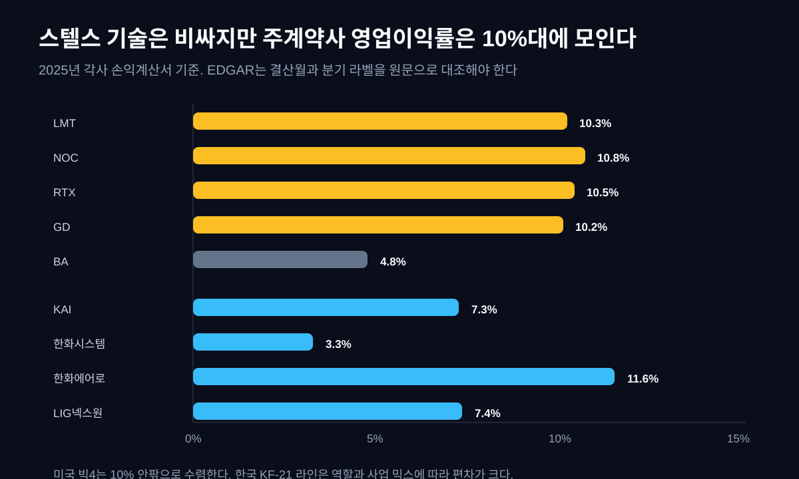
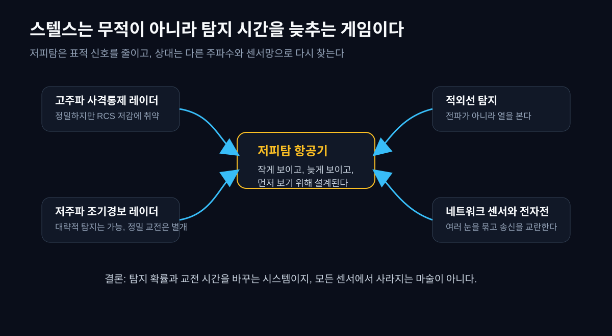

2026년 방산 뉴스를 보면 스텔스 전투기는 늘 "보이지 않는 전투기"처럼 소개된다. 그런데 이 표현은 절반만 맞다. 스텔스기는 사라지는 물체가 아니다. 레이더에 **작게 보이고, 늦게 보이고, 어느 방향에서는 더 헷갈리게 보이도록** 설계된 물체다. 투명망토가 아니라 신호를 관리하는 공학이다.

이 차이를 이해하면 전투기가 왜 각지게 생겼는지, 왜 무장을 몸 안에 넣는지, 왜 코팅 정비가 전투력의 일부가 되는지, 왜 한화시스템의 AESA 레이더나 KAI의 KF-21, 록히드마틴의 F-35, 노스롭그루먼의 B-21이 한 지도에 같이 놓이는지가 보인다. 스텔스는 한 회사의 제품명이 아니라 **형상, 소재, 센서, 전자전, 정비가 같은 표적 신호를 낮추는 시스템 기술**이다.

그리고 이 시스템은 재무제표에도 흔적을 남긴다. 미국 방산 주계약사들은 스텔스 플랫폼을 만들지만 2025년 영업이익률은 대체로 10% 안팎에 모인다. 한국의 KF-21 라인은 KAI, 한화시스템, 한화에어로스페이스, LIG넥스원이 서로 다른 층위에 배치되고, 각자의 손익이 다르게 찍힌다. 이 글은 RCS(레이더 반사면적)라는 물리 개념에서 시작해 DART와 EDGAR의 손익계산서까지 내려간다.


## 1. 스텔스는 무엇을 숨기나: RCS라는 작은 숫자의 의미

레이더는 전파를 쏘고, 표적에서 돌아오는 반사를 본다. 여기서 중요한 것은 물체의 실제 크기가 아니라 레이더가 받은 반사 신호의 크기다. 이 값을 금속 구의 면적으로 환산한 것이 RCS(Radar Cross Section, 레이더 반사면적)다. 같은 길이의 항공기라도 전파를 레이더 쪽으로 강하게 되돌리면 크게 보이고, 다른 방향으로 튕기거나 흡수하면 작게 보인다.

그러니 스텔스의 질문은 "얼마나 크냐"가 아니다. 질문은 "어느 주파수에서, 어느 각도에서, 어느 편파로, 얼마만큼 되돌아오느냐"다. RCS를 10dB 낮춘다는 것은 반사 전력을 10분의 1로 줄인다는 뜻이고, 20dB 낮추면 100분의 1이다. 숫자가 작아질수록 레이더가 같은 거리에서 표적을 구분하기 어려워진다.

하지만 이 숫자는 절대값처럼 믿으면 안 된다. RCS는 각도와 주파수에 따라 달라진다. 정면에서는 작아도 옆이나 아래에서는 커질 수 있고, 고주파 레이더에는 작아도 저주파 조기경보 레이더에는 다르게 보일 수 있다. 그래서 스텔스는 "안 보임"이 아니라 **탐지 확률과 교전 시간을 바꾸는 기술**로 읽어야 한다.

레이더 방정식으로 보면 이 차이가 더 분명해진다. 단순화하면 탐지거리는 RCS의 네제곱근에 비례한다. 반사 신호를 10분의 1로 낮춘다고 탐지거리가 10분의 1이 되는 것은 아니다. 그래도 효과는 크다. 상대가 훨씬 가까워져야 같은 확률로 잡을 수 있고, 그만큼 추적·식별·사격 계산에 쓸 시간이 줄어든다.

| RCS 변화 | 반사 전력 | 단순 탐지거리 비율 | 작전상 의미 |
|---|---:|---:|---|
| -10dB | 10분의 1 | 약 56% | 같은 레이더가 더 가까워져야 안정적으로 잡는다 |
| -20dB | 100분의 1 | 약 32% | 조기 탐지 창이 크게 줄어 교전 준비 시간이 짧아진다 |
| -30dB | 1000분의 1 | 약 18% | 단독 레이더보다 다중 센서망과 전자전 대응이 중요해진다 |

그래서 스텔스의 경제적 가치는 "사라지는 능력"이 아니라 **상대의 의사결정 시간을 깎는 능력**이다. 탐지가 늦어지면 미사일 발사 거리, 회피 기동, 전자전 대응, 아군 네트워크의 정보 우위가 모두 달라진다. 기술이야기에서 RCS를 먼저 보는 이유는 여기에 있다.



## 2. 전투기는 왜 각지게 생겼나: 형상이 먼저 숨긴다

스텔스의 첫 번째 층은 형상이다. 레이더 전파는 거울처럼 반사될 때가 많다. 표면이 레이더와 직각에 가까우면 들어온 방향 근처로 강하게 돌아가고, 표면 각도가 기울어져 있으면 다른 방향으로 튕겨 나간다. 스텔스 항공기가 날카로운 모서리, 평평한 면, 정렬된 선을 많이 갖는 이유가 여기 있다.

F-117은 이 원리를 극단적으로 드러낸 초창기 사례였다. 계산 능력이 부족하던 시절에는 곡면보다 여러 평면을 조합해 반사를 예측하는 편이 쉬웠다. 이후 F-22와 F-35는 더 매끈한 곡면을 쓰지만, 핵심은 여전히 같다. 표면의 선을 정렬하고, 레이더파가 강하게 되돌아오는 모서리와 구멍을 줄인다.

내부 무장창도 같은 이유다. 미사일을 날개 아래에 달면 그 자체가 거대한 반사체가 된다. 스텔스기는 무장을 몸 안에 넣고 필요할 때만 문을 연다. 엔진 흡입구도 문제다. 레이더파가 흡입구로 들어가 압축기 날개에 맞으면 강한 반사가 생긴다. 그래서 S자 흡입구, 레이더 차단 구조, 흡수재가 쓰인다.

여기서 중요한 것은 설계가 한 번으로 끝나지 않는다는 점이다. 항공기는 실제로 비행하고, 열을 받고, 비를 맞고, 정비를 받는다. 패널 틈, 나사, 도어 경계, 도료 손상 하나가 산란원을 만든다. 저피탐은 설계도면의 성능이 아니라 **양산과 정비가 계속 재현해야 하는 품질**이다.

## 3. 흡수재와 코팅: 보이지 않는 기술의 가장 손이 많이 가는 부분

형상이 전파를 다른 방향으로 튕긴다면, 흡수재는 일부 에너지를 열로 바꿔 반사를 줄인다. 레이더 흡수재(RAM, Radar Absorbent Material)는 금속 표면 위에 단순히 페인트처럼 칠하는 한 겹이 아니다. 주파수, 두께, 재료, 접착, 온도, 수분, 표면 거칠기까지 맞아야 한다. 항공기가 고속으로 날고, 비와 먼지를 맞고, 정비사가 패널을 열고 닫는 환경에서 이 성능을 유지해야 한다.

그래서 스텔스는 출고 뒤에 비용이 더 오래 간다. 저피탐 코팅이 벗겨지면 다시 보수해야 하고, 패널 경계가 들뜨면 봉합해야 하며, 정비 뒤에는 표면 품질을 다시 확인해야 한다. GAO(미국 회계감사원)는 F-35 프로그램에서 유지비와 가동률, 정비 부담을 반복적으로 지적해 왔다. 이는 스텔스가 전투기 가격표 하나로 끝나지 않는 기술이라는 뜻이다.

정비 부담은 재무제표에도 간접적으로 남는다. 완성기 주계약사는 항공기 판매뿐 아니라 장기 군수지원, 소프트웨어 업그레이드, 예비부품, 정비 체계를 같이 판다. 기체를 한 번 팔고 끝나는 제조업보다, 30년 운용 주기 전체가 계약의 일부가 된다. 스텔스의 진짜 시장은 기체 출고일이 아니라 운용 수명 전체에 걸쳐 열린다.


## 4. 센서융합과 전자전: 작게 보이는 것만으로는 부족하다

스텔스기는 작게 보이는 것만으로 충분하지 않다. 적보다 먼저 보고, 먼저 판단하고, 먼저 쏴야 한다. 그래서 저피탐 항공기의 두 번째 핵심은 센서융합이다. F-35가 자주 내세우는 강점도 단순한 형상이 아니라 레이더, 전자광학, 적외선, 전자지원, 데이터링크 정보를 한 화면처럼 묶는 능력이다. 록히드마틴과 F-35 공식 자료는 이 센서융합을 조종사의 상황인식으로 설명한다.

AESA 레이더(능동 전자주사식 레이더)는 이 중심에 있다. 작은 송수신 모듈을 많이 묶어 빔을 전자적으로 빠르게 움직인다. 기계식 레이더처럼 안테나를 물리적으로 돌리는 것이 아니라, 여러 방향을 빠르게 훑고 추적하며, 일부는 전자전 임무에도 쓸 수 있다. 그래서 AESA는 단순 부품이 아니라 항공기의 눈과 신경망이다.

한국 KF-21 라인에서 한화시스템이 중요한 이유가 여기 있다. KF-21의 완성 기체는 KAI가 만들지만, 레이더가 없으면 먼저 보고 먼저 쏘는 전투기가 되지 못한다. 한화시스템은 KF-21 AESA 레이더 개발과 양산 축에 서 있고, 이 포지션은 단순 전자부품 납품이 아니라 체계 성능의 핵심을 맡는 자리다.

전자전도 같은 지도에 들어간다. 스텔스기가 전파를 덜 반사해도, 스스로 강하게 송신하면 위치가 드러난다. 적 레이더가 다른 주파수와 센서망으로 찾으려 하면 이를 교란하거나 회피해야 한다. LIG넥스원이 항공전자전과 유도무기 축에서 자주 언급되는 이유는, 저피탐 항공기가 혼자 떠 있는 물체가 아니라 전자전, 데이터링크, 무장 체계와 함께 작동하기 때문이다.

실전에서는 이 과정이 하나의 사슬로 이어진다. 탐지하고, 표적인지 분류하고, 궤적을 계속 추적하고, 사격 해법을 만들고, 미사일을 유도하고, 다시 피해평가를 한다. 스텔스는 이 사슬의 모든 칸을 끊으려는 기술이다. 한 칸만 늦춰도 상대는 확신을 잃고, 두 칸 이상 흔들면 발사 결심 자체가 늦어진다.

| 교전 사슬 | 상대가 해야 할 일 | 스텔스가 흔드는 지점 | 연결 회사·기술 |
|---|---|---|---|
| 탐지 | 레이더·적외선·전자정보로 표적 후보를 잡는다 | RCS, 열 신호, 전파 방출을 낮춰 후보 포착을 늦춘다 | 형상 설계, RAM, 엔진·열 관리 |
| 분류 | 새 떴는지, 전투기인지, 미끼인지 구분한다 | 신호가 작고 불안정하면 표적 확신이 늦어진다 | 센서융합, 전자지원, 데이터링크 |
| 추적 | 위치·속도·고도를 계속 업데이트한다 | 각도와 주파수에 따라 신호가 달라 추적이 끊긴다 | AESA, 전자전, 임무컴퓨터 |
| 교전 | 사격 거리와 미사일 유도 조건을 계산한다 | 추적 시간이 짧아지면 발사 창도 좁아진다 | 유도무기, 전자전, 네트워크 |
| 재탐지 | 회피 뒤 다시 잡고 피해를 평가한다 | 기체·전자전·기동이 합쳐져 확신을 더 늦춘다 | 소프트웨어, 전자전 업데이트, 정비 |

이 표가 중요한 이유는 회사 지도를 바꾸기 때문이다. 완성기 업체만 보는 순간 스텔스의 절반을 놓친다. 레이더 모듈, 전자전 수신기, 미사일 시커, 데이터링크, 임무컴퓨터, 코팅 정비까지 모두 교전 사슬의 병목이다. 기술의 깊이는 전투기 사진이 아니라 이 사슬에서 보인다.



## 5. 공정·회사·근거 지도: 어느 회사가 어느 칸을 쥐나

기술을 회사로 옮기면 지도는 더 선명해진다. 완성 전투기 업체가 모든 것을 혼자 하지 않는다. 주계약사는 형상, 체계통합, 고객 접점, 장기 군수지원 계약을 쥔다. 센서 회사는 레이더와 전자전 모듈을 쥔다. 엔진 회사는 추력과 열 신호를 쥔다. 정비와 소프트웨어 업그레이드는 운용 기간 내내 반복된다.

| 공정/층위 | 기술 역할 | 대표 회사 | 공시 근거 | 재무로 보이는 흔적 |
|---|---|---|---|---|
| 플랫폼 형상·체계통합 | 저피탐 형상, 내부 무장창, 비행제어, 고객 계약을 묶는다 | 록히드마틴(LMT), 노스롭그루먼(NOC), KAI(047810) | EDGAR 10-K, DART 사업보고서 | 장기 개발·양산·군수지원이 10% 안팎 영업이익률과 수주잔고로 남는다 |
| AESA 레이더 | 먼저 보고 먼저 쏘는 눈이다. 빔 조향, 추적, 전자전 보조가 핵심이다 | RTX, 한화시스템(272210) | EDGAR 10-K, DART 사업보고서 | 전자 부문 개발비와 양산 램프업이 이익률 편차로 보인다 |
| 엔진·열 신호 | 추력, 배기 열, 정비성을 좌우한다 | GE Aerospace, 한화에어로스페이스(012450) | EDGAR 10-K, DART 사업보고서 | 항공엔진은 긴 인증과 부품·정비 반복 매출로 이어진다 |
| 전자전·무장 | 상대 센서를 교란하고 교전권을 만든다 | LIG넥스원(079550), RTX | DART 사업보고서, EDGAR 10-K | 유도무기·전자전 믹스와 수출 선수금이 손익과 현금흐름을 흔든다 |
| 정비·업그레이드 | 코팅, 패널, 소프트웨어, 부품을 운용 기간 내내 유지한다 | LMT, NOC, KAI와 각국 MRO 라인 | GAO, EDGAR 10-K, DART | 판매 뒤 군수지원 계약과 가동률 문제가 반복 매출과 비용으로 남는다 |

이 표의 핵심은 "누가 멋진 전투기를 만드나"가 아니다. **누가 바꾸기 어려운 칸을 잡고 있나**다. 형상과 체계통합은 고객 전환비용이 높다. AESA 레이더는 성능 검증과 항공기 통합 난도가 높다. 엔진은 인증과 수명주기 정비가 길다. 전자전은 위협 데이터와 운용 경험이 쌓일수록 강해진다. 정비는 운용 중 계속 반복된다. 이 칸들이 스텔스 기술의 재무적 자리다.

더 아래로 내려가면 "스텔스 수혜"라는 말은 여러 개의 서로 다른 공정으로 쪼개진다. 같은 방산 회사라도 어느 칸에 있는지에 따라 회계가 다르다. 설계·해석은 연구개발비와 인력으로 보이고, 생산은 재고와 진행률로 보이며, 정비는 장기 서비스 매출과 비용 안정성으로 보인다.

| 더 작은 기술 칸 | 실제로 어려운 것 | 공시에서 볼 흔적 | 왜 병목인가 |
|---|---|---|---|
| RCS 해석·형상 설계 | 각도·주파수별 산란을 계산하고 무장창·흡입구·패널선을 함께 맞춘다 | EDGAR/DART의 연구개발, 프로그램 설명, 주요 계약 | 초기 설계가 틀리면 뒤의 소재와 전자전으로 만회하기 어렵다 |
| 복합재·표면 품질 | 곡면·패널·도어 경계를 대량생산에서도 같은 품질로 반복한다 | 재고, 유형자산, 품질 비용, 양산 램프업 설명 | 실험기 성능을 양산기로 옮기는 구간이다 |
| RAM·코팅·봉합 | 주파수·두께·접착·습도·온도·정비 손상을 관리한다 | 유지보수 계약, 비용 증가, 가동률 논의 | 출고 뒤에도 성능이 계속 닳기 때문에 반복 매출과 비용을 만든다 |
| AESA 송수신 모듈 | 작은 모듈 수백~수천 개를 열·전력·신뢰성 안에서 운용한다 | 방산전자 매출, 개발비, 양산 전환 설명 | 먼저 보는 능력의 핵심이고, 항공기 통합 검증이 어렵다 |
| 임무컴퓨터·센서융합 | 레이더, 적외선, 전자정보, 데이터링크를 하나의 그림으로 합친다 | 소프트웨어·항공전자 설명, 업그레이드 계약 | 하드웨어보다 늦게 개선되며 운용 데이터가 쌓일수록 강해진다 |
| 전자전·유도무기 | 상대 센서를 속이고, 짧은 교전 창에서 무장을 유도한다 | 유도무기·전자전 수주, 선수금, 수출 허가 | 기체가 덜 보이는 것만으로는 교전 우위가 완성되지 않는다 |
| RCS 시험·정비 | 비행 전후 표면 상태와 반사 특성을 반복 확인한다 | GAO 가동률·유지비 지적, MRO 계약 | 실제 작전 성능을 유지하는 마지막 품질 게이트다 |

따라서 기술이야기의 질문은 "스텔스 전투기를 누가 만드나"에서 멈추면 안 된다. 더 좋은 질문은 "어느 회사가 이 작은 기술 칸 중 하나를 반복 가능한 품질과 계약으로 묶고 있나"다. 그때부터 KAI는 단순 조립사가 아니라 체계통합·시험의 병목으로 보이고, 한화시스템은 레이더 부품사가 아니라 센서융합의 관문으로 보이며, LIG넥스원은 주변 무장사가 아니라 짧아진 교전 창을 실제 타격으로 바꾸는 회사로 보인다.



## 6. 미국 라인: F-35와 B-21은 왜 10%대 사업인가

F-35는 세계에서 가장 큰 스텔스 전투기 프로그램이다. 록히드마틴이 주계약사이고, Pratt & Whitney 계열 엔진, RTX와 노스롭 계열 센서와 하위 체계, 각국 생산 참여가 얽힌다. F-35 공식 자료는 스텔스, 센서융합, 네트워크 연결을 함께 강조한다. 여기서 돈은 기체 한 대의 가격만이 아니라 운용, 정비, 업그레이드, 소프트웨어, 부품으로 이어진다.

노스롭그루먼의 B-21 Raider는 폭격기 쪽의 다음 세대 저피탐 플랫폼이다. 노스롭은 B-2 경험을 가진 회사이고, B-21은 장거리 침투, 저피탐, 개방형 시스템을 내세운다. 즉 스텔스 플랫폼에서 노스롭의 자리는 전투기보다 폭격기와 장거리 임무 쪽이다.

그런데 재무제표로 내려오면 미국 방산 주계약사의 영업이익률은 생각보다 높지 않다. 2025년 LMT 10.3%, NOC 10.8%, RTX 10.5%, GD 10.2%다. Boeing은 2024년 방산·상업기 품질 비용의 충격에서 벗어나 2025년 4.8%로 회복했지만 여전히 낮다.

```python
import dartlab

c = dartlab.Company("LMT")   # Lockheed Martin, EDGAR
is_df = c.select("IS")
# 12월 결산 회사라 2025Q1~2025Q4 합산을 FY2025로 사용
# EDGAR 종목은 결산월과 분기 라벨이 회사마다 달라 10-K/10-Q 기간 확인이 필수
```

| 미국 방산 대표사 | 스텔스·항공우주 연결 | 2025 매출 | 2025 영업이익률 |
|---|---|---:|---:|
| Lockheed Martin (LMT) | F-35 주계약, 항공·미사일·우주 | 750.5억 달러 | **10.3%** |
| Northrop Grumman (NOC) | B-21, 항공·우주·미션시스템 | 419.5억 달러 | **10.8%** |
| RTX | 센서, 미사일, 엔진 계열 방산 축 | 886.0억 달러 | **10.5%** |
| General Dynamics (GD) | 전투체계·해양·항공우주 | 525.5억 달러 | **10.2%** |
| Boeing (BA) | 방산 항공·우주, 품질 비용 회복 중 | 894.6억 달러 | **4.8%** |

표시: 스텔스와 항공우주 기술은 고난도지만, 미국 방산 주계약사의 회계상 영업이익률은 대체로 10% 안팎에 모인다. 이유는 기술 난도가 낮아서가 아니라 고객과 계약 구조가 특수하기 때문이다. 미국 국방부 프로그램은 cost-plus, 고정가, 장기개발, 정부 감사, 공급망 리스크가 섞인다. 기술 독점이 곧바로 30% 영업이익률로 이어지지 않는다.

이 점은 [록히드마틴 기업이야기](/blog/LMT-lockheed-martin)에서 이미 본 그림과 이어진다. 매출 100조원급 방산 1위라도 미국 정부 조달 구조 안에서는 영업이익률이 10%대에 묶인다. 스텔스는 비싸지만, 주계약사의 남는 몫은 계약서와 원가정산 구조가 정한다.



## 7. 한국 라인: KF-21은 완전 스텔스가 아니라 저피탐 학습장이다

한국의 핵심 축은 KF-21이다. 여기서 먼저 정직하게 구분해야 한다. KF-21은 F-35 같은 완전한 5세대 스텔스 전투기로 말하면 과장이다. 블록 1은 내부 무장창이 없고, 무장을 외부에 달면 RCS가 커진다. 다만 형상 설계, 복합재, AESA 레이더, 항공전자, 추후 블록 개량을 통해 저피탐 기술을 축적하는 플랫폼이다. 그래서 KF-21은 "완성된 스텔스"라기보다 **한국 항공우주 산업이 저피탐 시스템을 배우는 양산 학교**에 가깝다.

KAI는 여기서 체계통합과 최종 조립을 맡는다. 항공기는 부품을 모아 붙이는 공장이 아니라, 비행제어, 구조, 전장, 센서, 무장, 소프트웨어, 시험을 하나의 인증 가능한 시스템으로 묶어야 하는 제품이다. 그래서 KAI의 자리는 대체가 어렵다. 문제는 이 자리가 항상 높은 영업이익률을 주지는 않는다는 것이다. 2025년 KAI의 영업이익률은 7.3%다.

한화시스템은 AESA 레이더와 항공전자 쪽에서 중요하다. 스텔스 전투기는 덜 보이는 것만큼 먼저 보는 것이 중요하다. 그런데 한화시스템 전체 영업이익률은 2025년 3.3%로 낮다. 이는 AESA만의 수익성이 아니라 ICT, 위성, 방산전자, 개발비, 양산 전환 비용이 섞인 회사 전체 손익이다. 이 숫자를 "AESA가 돈을 못 번다"로 읽으면 안 된다. 다만 첨단 센서 라인이 회사 전체 이익으로 완전히 전환되기까지 시간이 걸린다는 신호로는 읽을 수 있다.

한화에어로스페이스는 엔진과 방산 체계, LIG넥스원은 전자전·유도무기 축에서 연결된다. 한화에어로의 2025년 영업이익률은 11.6%, LIG넥스원은 7.4%다. 같은 KF-21 주변 회사라도 손익이 다르다. 엔진·방산 체계, 전자전·무장, 체계통합, 센서의 회계 주기가 다르기 때문이다.

```python
import dartlab

kai = dartlab.Company("047810")      # KAI, DART
hs = dartlab.Company("272210")       # 한화시스템, DART
lig = dartlab.Company("079550")      # LIG넥스원, DART
for c in [kai, hs, lig]:
    c.select("IS")   # 2025Q1~2025Q4 합산으로 연간 손익 확인
```

| 한국 KF-21 주변 대표사 | 기술 자리 | 2025 매출 | 2025 영업이익률 |
|---|---|---:|---:|
| KAI (047810) | 체계통합, 최종 조립, 시험 | 3.70조원 | **7.3%** |
| 한화시스템 (272210) | AESA 레이더, 항공전자, ICT | 3.66조원 | **3.3%** |
| 한화에어로스페이스 (012450) | 엔진·방산 체계 | 26.70조원 | **11.6%** |
| LIG넥스원 (079550) | 전자전·유도무기·항공전자 | 4.31조원 | **7.4%** |

표시: KF-21 라인은 한 회사가 독식하는 구조가 아니다. KAI가 항공기를 묶고, 한화시스템이 눈을 붙이고, 한화에어로와 LIG가 엔진·무장·전자전의 주변 생태계를 만든다. 그래서 기술이야기에서 중요한 것은 "KF-21 수혜주"라는 단어가 아니라 각 회사가 어느 칸을 잡았는지다.

이 구조는 [한화에어로스페이스](/blog/012450-hanwha-aerospace), [LIG넥스원](/blog/079550-lig-nexone-cash-clock), [현대로템](/blog/064350-hyundai-rotem) 같은 방산 기업이야기와도 이어진다. 방산은 매출보다 수주잔고, 선수금, 진행률, 제품 믹스가 먼저 숫자를 흔든다. 스텔스도 예외가 아니다.

## 8. 시간축으로 보면: 스텔스 기술은 곧장 고마진으로 바뀌지 않는다

한 해의 영업이익률만 보면 "스텔스 주계약사는 10%대, 한국 라인은 3~12%"라는 스냅샷만 남는다. 그러나 시간축을 펼치면 더 중요한 질문이 나온다. 이 숫자는 기술 성숙의 결과인가, 아니면 프로그램 손실과 양산 전환, 고객 계약 구조가 만든 한 해의 흔적인가.

미국 방산 5곳의 2021~2025년 영업이익률을 보면, 기술 난도보다 프로그램 손실과 계약 구조가 더 크게 움직인다. LMT는 2021년 13.6%에서 2024년 9.9%까지 내려갔다가 2025년 10.3%로 조금 회복했다. NOC는 2023년 6.5%까지 내려갔다가 2025년 10.8%로 회복했다. RTX는 2023년 5.2%에서 2025년 10.5%로 올라왔다. GD는 10% 안팎을 거의 고정처럼 유지한다. BA는 2024년 -16.1%까지 무너졌다가 2025년 4.8%로 돌아왔다.

| 미국 방산 대표사 영업이익률 | 2021 | 2022 | 2023 | 2024 | 2025 |
|---|---:|---:|---:|---:|---:|
| LMT | 13.6% | 12.7% | 12.6% | 9.9% | 10.3% |
| NOC | 15.8% | 9.8% | 6.5% | 10.6% | 10.8% |
| RTX | 7.7% | 8.1% | 5.2% | 8.1% | 10.5% |
| GD | 10.8% | 10.7% | 10.0% | 10.1% | 10.2% |
| BA | 2.0% | -5.3% | -1.0% | -16.1% | 4.8% |

표시: 미국 방산 주계약사의 수익성은 "스텔스 기술이라서 높다"로 움직이지 않는다. 오히려 대형 프로그램 손실과 품질 비용, 장기 계약 구조가 더 강하게 찍힌다. 스텔스의 기술 난도는 매출과 수주잔고, 장기 군수지원의 안정성으로 먼저 보이고, 영업이익률은 정부 조달의 규칙 속에서 움직인다. 이것은 [보안 기술 편](/blog/antivirus-to-edr-who-profits)에서 본 "기술 세대와 회계 이익의 시차"와 닮았다. 앞선 기술이 반드시 그 해의 회계 이익을 바로 키우지는 않는다.

한국 라인도 마찬가지다. KAI는 2021년 2.3%에서 2025년 7.3%로 완만하게 올라왔다. 체계통합과 양산 램프업이 손익으로 들어오는 속도가 느리다는 뜻이다. 한화시스템은 2024년 7.8%까지 올라갔다가 2025년 3.3%로 내려왔다. 이는 AESA 레이더 하나의 문제가 아니라 ICT, 위성, 방산전자, 개발비가 섞인 전체 회사 손익이다. 한화에어로는 2024년 14.7%로 튄 뒤 2025년 11.6%로 내려왔지만 여전히 높은 편이다. LIG넥스원은 7~8%대에서 비교적 안정적으로 움직인다.

| 한국 KF-21 주변 대표사 영업이익률 | 2021 | 2022 | 2023 | 2024 | 2025 |
|---|---:|---:|---:|---:|---:|
| KAI | 2.3% | 5.1% | 6.5% | 6.6% | 7.3% |
| 한화시스템 | 5.4% | 1.1% | 3.8% | 7.8% | 3.3% |
| 한화에어로스페이스 | 6.0% | 6.1% | 7.7% | 14.7% | 11.6% |
| LIG넥스원 | 5.3% | 8.1% | 8.1% | 7.0% | 7.4% |

표시: 한국 라인의 핵심은 "저피탐 기술이 곧바로 높은 이익률을 준다"가 아니다. KAI는 체계통합 학습곡선이 천천히 올라오고, 한화시스템은 센서와 ICT 믹스가 함께 흔들리며, 한화에어로와 LIG는 방산 수출·무장·엔진·선수금 사이클이 손익을 만든다. 즉 스텔스 기술을 읽는 재무 렌즈는 단순 마진 랭킹이 아니라 **양산 단계, 개발비, 제품 믹스, 장기 정비, 수주잔고의 시간표**다.

이 대목이 중요한 이유는 투자 서사가 항상 기체 사진에서 출발하기 때문이다. 그러나 기업 숫자는 사진보다 늦게 움직인다. 전투기 개발은 먼저 개발비와 시험비로 나오고, 양산이 시작되면 매출로 나오며, 운용이 길어지면 정비와 업그레이드로 반복된다. 어느 회사가 어느 시점에 있는지 모르면, 같은 "스텔스 수혜"라는 말로 서로 다른 회계 시간을 섞게 된다. [전력망 기술 편](/blog/ai-power-transformer-supercycle)에서 변압기·차단기·전선이 같은 AI 전력난 안에서도 서로 다른 마진과 병목을 보였듯, 스텔스도 형상·센서·엔진·전자전·정비가 같은 시간표로 움직이지 않는다.

그래서 이 글의 결론은 숫자 하나가 아니라 읽는 순서다. 먼저 원리를 본다. 그다음 공정·회사 지도를 본다. 마지막으로 시간축을 본다. 스텔스라는 단어가 붙은 회사가 아니라, **그 회사의 기술 칸이 언제 매출이 되고 언제 이익이 되며 언제 현금이 되는지**를 확인해야 한다.

## 9. 공시를 어떻게 읽나: EDGAR와 DART는 같은 표가 아니다

스텔스 밸류체인을 공시로 읽을 때 가장 흔한 실수는 미국 10-K와 한국 사업보고서를 같은 구조의 엑셀처럼 다루는 것이다. 둘 다 기업 보고서지만, 회계연도 라벨, 분기 누적 방식, 사업부 설명, 수주·백로그 표현이 다르다. 특히 EDGAR는 회사별 결산월이 다를 수 있으므로 `2025Q4`라는 컬럼명이 보인다고 바로 2025년 달력연도라고 보면 안 된다. 먼저 10-K의 fiscal year end와 10-Q의 period를 확인해야 한다.

| 읽을 위치 | EDGAR에서 볼 것 | DART에서 볼 것 | 스텔스 글에서의 의미 |
|---|---|---|---|
| 사업 설명 | Item 1 Business, 주요 프로그램, 고객, segment | 사업의 내용, 주요 제품, 방산 부문 설명 | 회사가 플랫폼·센서·엔진·전자전·정비 중 어느 칸에 있는지 확인한다 |
| 경영진 설명 | Item 7 MD&A, program charges, backlog, contract risk | 영업실적 설명, 수주상황, 진행률, 원가 변동 | 기술 난도가 손익으로 넘어가는 시간표를 읽는다 |
| 손익계산서 | revenue, operating income, segment margin | 매출액, 영업이익, 부문 손익 | 기술 칸이 회사 전체 이익률에 얼마나 섞여 있는지 본다 |
| 재무상태표 | inventory, contract assets/liabilities, receivables | 재고자산, 계약자산, 계약부채, 매출채권 | 장기 생산·진행률·선수금이 현금흐름을 흔드는지 본다 |
| 현금흐름표 | operating cash flow, capex, working capital | 영업현금흐름, 유형자산 취득, 운전자본 | 이익이 실제 현금으로 바뀌는 시차를 본다 |
| 주석·리스크 | government contracts, fixed-price risk, supply chain | 주요 계약, 우발부채, 연구개발비 | 고정가·개발비·품질 비용이 마진을 깎는 지점을 본다 |

이 표를 적용하면 글의 결론도 달라진다. LMT의 F-35는 Aeronautics 사업부와 장기 군수지원의 문제로 읽어야 하고, NOC의 B-21은 Aeronautics와 Mission Systems, Space가 엮인 장기 프로그램으로 봐야 한다. RTX는 센서·미사일·엔진 축이 섞여 있어 "스텔스 수혜" 한 단어로 묶기 어렵다. KAI는 완성기 체계통합과 진행률, 한화시스템은 AESA·항공전자와 ICT 믹스, 한화에어로는 엔진·방산 체계와 수출 사이클, LIG넥스원은 유도무기·전자전 수주와 선수금이 중요하다.

그래서 EDGAR와 DART는 단순히 숫자 출처가 아니라 **기술 지도를 회계 시간표로 바꾸는 장치**다. 기술 칸을 찾고, 그 칸이 어느 사업부에 있고, 그 사업부가 어떤 계약 방식으로 매출을 인식하며, 그 매출이 언제 이익과 현금으로 바뀌는지까지 이어야 깊이가 생긴다.

## 10. 이렇게 오해하면 안 된다

첫째, 스텔스는 무적이 아니다. 저주파 레이더, 적외선 탐지(IRST), 다중 센서 네트워크, 전자정보 수집, 데이터링크는 저피탐 항공기를 다시 찾으려는 반대편 기술이다. 스텔스는 이 모든 것을 무력화하지 않는다. 다만 상대가 더 늦게, 더 불확실하게, 더 짧은 교전 창에서 판단하도록 만든다.

둘째, "RCS가 작다"는 말은 모든 각도와 모든 주파수에서 작다는 뜻이 아니다. 정면과 측면, 고주파와 저주파, 깨끗한 기체와 정비 뒤 기체가 다르다. 숫자 하나로 전투기 전체를 평가하는 글은 의심해야 한다.

셋째, KF-21을 F-35와 같은 스텔스기로 부르면 안 된다. KF-21은 저피탐 형상과 AESA, 국산 항공전자 역량을 축적하는 플랫폼이지, 현재 블록 1 기준으로 F-35와 같은 내부 무장창 중심 5세대 스텔스 체계라고 말하기 어렵다. 이 구분을 해야 한국 라인의 진짜 의미가 보인다. 완성된 스텔스의 수입 대체가 아니라, 다음 세대 항공전자와 체계통합의 학습 곡선이다.

넷째, EDGAR 수치를 읽을 때는 결산월과 분기 라벨을 반드시 봐야 한다. dartlab의 분기 컬럼이 `2025Q1`처럼 보이더라도 회사가 1월 결산인지, 7월 결산인지, 12월 결산인지에 따라 그 네 분기의 합이 달력연도와 다를 수 있다. 이 글의 미국 방산 5사(LMT, NOC, RTX, GD, BA)는 12월 결산이라 2025Q1~2025Q4 합산을 FY2025로 썼다. 하지만 EDGAR 전체로 확장할 때는 10-K와 10-Q의 period를 원문으로 확인해야 한다. 크라우드스트라이크나 팔로알토처럼 결산월이 다른 회사에서는 이 절차를 건너뛰면 바로 틀린다.



## 11. 판단: 스텔스는 플랫폼보다 병목을 봐야 한다

스텔스의 표면적 주인공은 전투기다. 그러나 재무제표에서 봐야 할 주인공은 조금 다르다. 형상을 잡는 주계약사, AESA 레이더를 붙이는 센서 회사, 엔진과 열 신호를 다루는 항공엔진 회사, 전자전과 무장을 잇는 방산전자 회사, 그리고 출고 뒤 수십 년 동안 저피탐 상태를 유지하는 정비 체계가 모두 병목이다.

그래서 스텔스 기술을 투자나 산업 관점으로 읽을 때 첫 질문은 "어느 전투기가 더 세냐"가 아니다. 질문은 **"어느 회사가 바꾸기 어려운 칸을 잡고 있고, 그 칸이 계약과 정비, 업그레이드로 반복되는가"**다. 록히드마틴과 노스롭은 플랫폼과 장기 군수지원의 칸을 잡고, RTX와 한화시스템은 센서의 칸을 잡고, KAI는 한국 체계통합의 칸을 잡고, 한화에어로와 LIG넥스원은 엔진·전자전·무장 생태계에 놓인다.

스텔스는 보이지 않는 기술이 아니라 **시간을 사는 기술**이다. 적이 나를 확실히 보기 전에 내가 먼저 보고, 먼저 피하고, 먼저 쏠 수 있게 만드는 기술이다. 그리고 그 시간을 사는 비용은 기체 가격표가 아니라, 형상 설계, 코팅, 센서, 전자전, 소프트웨어, 정비, 공시 속 수주잔고와 영업이익률에 나눠 찍힌다. 다음에 스텔스 뉴스를 볼 때 멋진 기체 사진에서 멈추지 말자. 그 기체의 눈은 누가 만들었고, 표면은 누가 유지하며, 그 비용이 어느 회사의 손익계산서에 남는지까지 봐야 한다.

## 검증표

본문 수치의 출처다. 한국사는 DART, 미국사는 EDGAR 기준으로 dartlab 런타임에서 `Company().select("IS")`를 호출했다. 미국 방산 5사는 모두 12월 결산이라 2025Q1~2025Q4 합산을 FY2025로 사용했다. 단 EDGAR 전체에 이 규칙을 일반화하면 안 된다. 결산월이 다른 회사는 10-K/10-Q의 fiscal year와 period를 원문으로 확인해야 한다.

| 본문 수치 | 출처 | 구분 |
|---|---|---|
| LMT 2025 매출 750.5억 달러, 영업이익률 10.3% | `Company("LMT").select("IS")` 2025Q1~Q4 합산 | dartlab 실측 (EDGAR, 12월 결산) |
| NOC 2025 매출 419.5억 달러, 영업이익률 10.8% | `Company("NOC").select("IS")` 2025Q1~Q4 합산 | dartlab 실측 (EDGAR, 12월 결산) |
| RTX 2025 매출 886.0억 달러, 영업이익률 10.5% | `Company("RTX").select("IS")` 2025Q1~Q4 합산 | dartlab 실측 (EDGAR, 12월 결산) |
| GD 2025 매출 525.5억 달러, 영업이익률 10.2% | `Company("GD").select("IS")` 2025Q1~Q4 합산 | dartlab 실측 (EDGAR, 12월 결산) |
| BA 2025 매출 894.6억 달러, 영업이익률 4.8% | `Company("BA").select("IS")` 2025Q1~Q4 합산 | dartlab 실측 (EDGAR, 12월 결산) |
| KAI 2025 매출 3.70조원, 영업이익률 7.3% | `Company("047810").select("IS")` 2025Q1~Q4 합산 | dartlab 실측 (DART) |
| 한화시스템 2025 매출 3.66조원, 영업이익률 3.3% | `Company("272210").select("IS")` 2025Q1~Q4 합산 | dartlab 실측 (DART) |
| 한화에어로스페이스 2025 매출 26.70조원, 영업이익률 11.6% | `Company("012450").select("IS")` 2025Q1~Q4 합산 | dartlab 실측 (DART) |
| LIG넥스원 2025 매출 4.31조원, 영업이익률 7.4% | `Company("079550").select("IS")` 2025Q1~Q4 합산 | dartlab 실측 (DART) |
| RCS 10dB 저감은 반사 전력 10분의 1, 20dB 저감은 100분의 1 | 레이더 공학의 데시벨 정의 | 기술 설명 |
| RCS가 10분의 1이면 단순 탐지거리 비율은 약 56%, 100분의 1이면 약 32% | 레이더 방정식의 RCS 네제곱근 관계 | 기술 설명 |
| EDGAR 수치는 결산월과 10-K/10-Q period를 먼저 확인해야 함 | `Company("LMT").fiscalYearEnd`, SEC EDGAR 원문 | 공시 해석 가드 |
| DART 수치는 사업보고서·분기보고서의 누적/분기 표시와 수주상황을 분리해야 함 | DART 원문, dartlab `Company().select("IS")` | 공시 해석 가드 |

```python
import dartlab

def annual_opm(code):
    c = dartlab.Company(code)
    df = c.select("IS")
    # 실제 계산은 revenue/sales와 operating_income/operating_profit 행을 찾아
    # 2025Q1~2025Q4를 합산한 뒤 영업이익률을 구했다.
    return df

annual_opm("LMT")
annual_opm("047810")
```

## 기술 성숙도와 출처

- **F-35 기술 설명**: 록히드마틴의 F-35 공식 페이지와 F-35 공식 사이트의 센서융합 설명을 참고했다. [Lockheed Martin F-35](https://www.lockheedmartin.com/en-us/products/f-35.html), [F-35 sensor fusion](https://www.f35.com/f35/news-and-features/f35-sensor-fusion-in-focus.html).
- **B-21 기술 설명**: 노스롭그루먼의 B-21 Raider 공식 설명을 참고했다. [Northrop Grumman B-21 Raider](https://www.northropgrumman.com/what-we-do/air/b-21-raider).
- **F-35 유지·가동률 맥락**: GAO의 F-35 sustainment 및 readiness 관련 보고서를 참고했다. [GAO F-35 sustainment reports](https://www.gao.gov/products/gao-24-106703).
- **KF-21 양산·기술 맥락**: KAI, 방위사업청, 한화시스템의 KF-21·AESA 레이더 관련 공개 자료를 참고했다. [KAI official site](https://www.koreaaero.com), [DAPA official site](https://www.dapa.go.kr), [Hanwha Systems official site](https://www.hanwhasystems.com).
- **DART·EDGAR 원문**: 한국사는 [DART 전자공시시스템](https://dart.fss.or.kr), 미국사는 [SEC EDGAR](https://www.sec.gov/edgar/search/)에서 원문 공시를 확인할 수 있다. 이 글의 수치 계산은 dartlab 런타임 직독 결과를 검증표에 분리했다.
- 데이터 기준일: 2026-07-06. 로컬 공시 데이터는 2026Q1까지 확인되며, 2025년 완료 회계연도 손익을 본문 핵심 비교로 사용했다.
