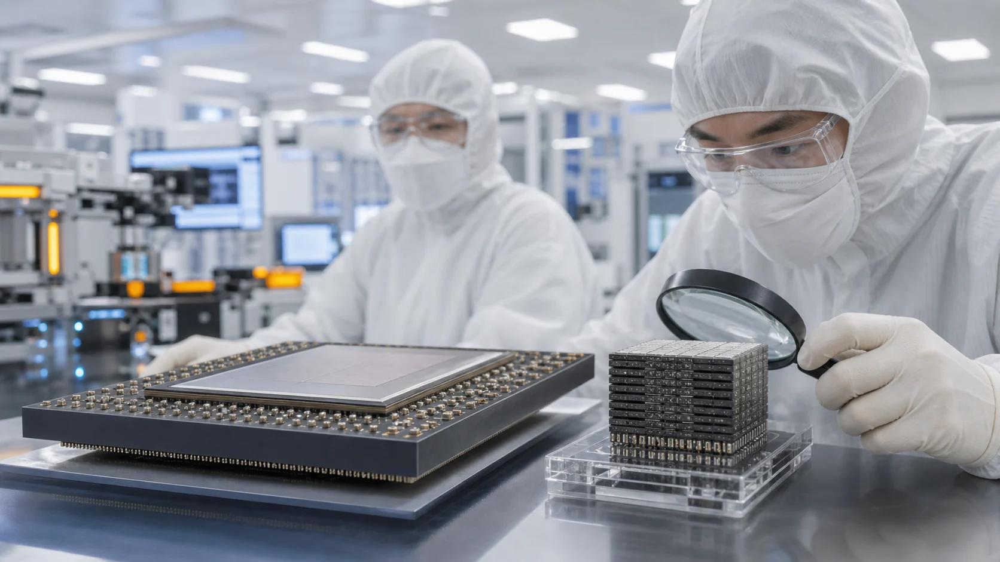
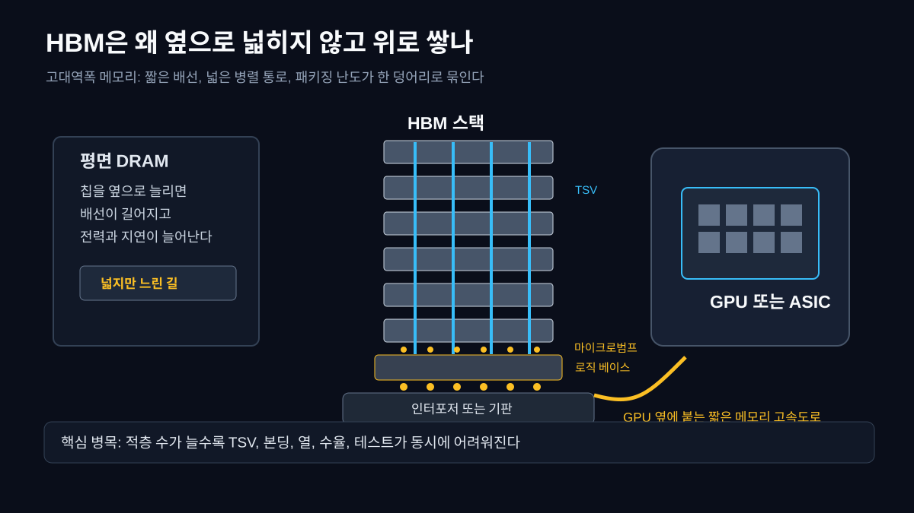
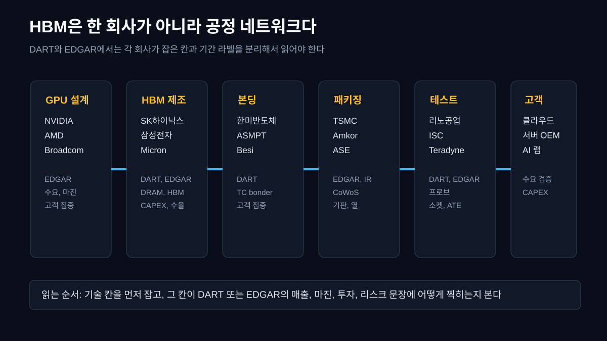
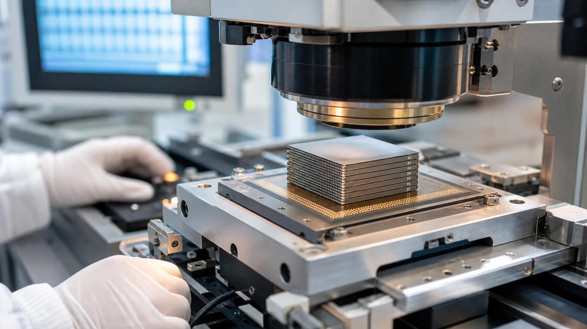
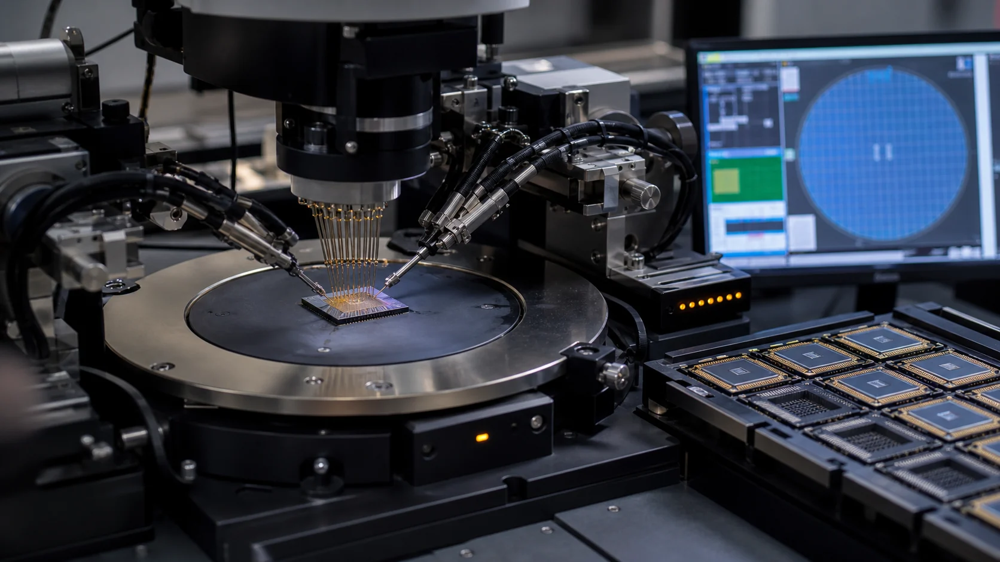
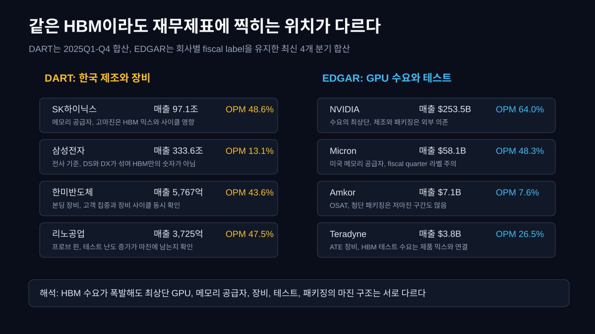
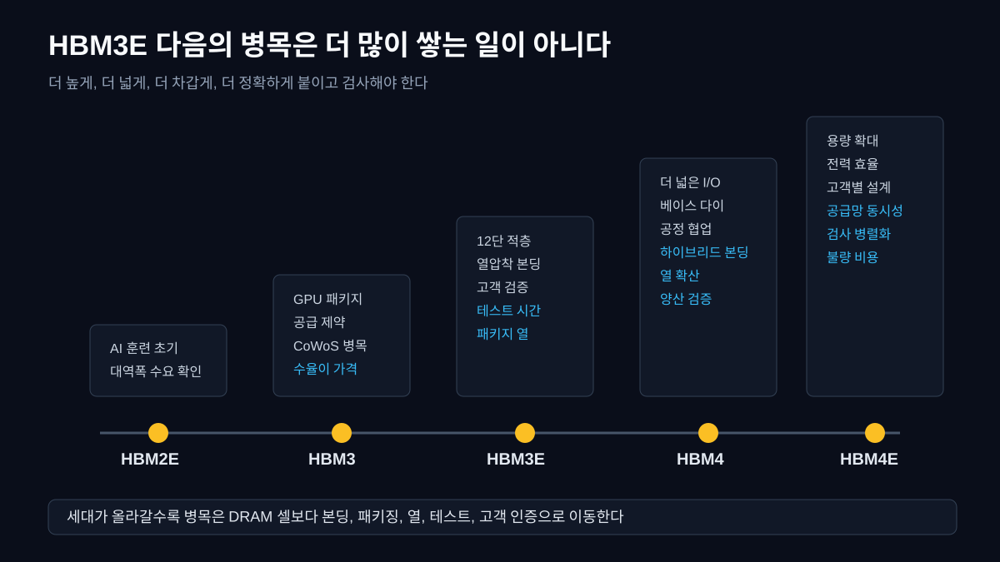

HBM(High Bandwidth Memory, 고대역폭 메모리)은 이름만 보면 메모리다. 그런데 AI 반도체 뉴스를 읽을 때 HBM을 단순히 "비싼 DRAM"으로만 보면 절반을 놓친다. HBM은 메모리 셀의 이야기이면서 동시에 패키징, 본딩, 열, 테스트, 고객 인증의 이야기다. GPU가 아무리 빠르게 계산해도 다음 토큰을 만들 데이터가 메모리에서 늦게 오면 계산 유닛은 기다린다. 그래서 AI 칩의 병목은 연산 코어만이 아니라 **GPU 바로 옆에서 얼마나 많은 데이터를 짧은 거리로 밀어 넣느냐**로 옮겨왔다.

질문은 단순하다. 메모리는 왜 옆으로 넓히지 않고 위로 쌓을까. 답은 배선 길이와 전력, 공간, 대역폭 때문이다. 평면으로 메모리를 늘리면 배선이 길어지고, 신호가 오가는 시간이 늘고, 전력도 올라간다. HBM은 여러 DRAM 다이를 수직으로 쌓고, TSV(Through Silicon Via, 실리콘을 수직으로 관통하는 전극)로 다이 사이를 연결한다. 그리고 마이크로범프(매우 작은 금속 접점)와 로직 베이스 다이를 통해 GPU 또는 AI ASIC(주문형 반도체) 옆에 붙는다. 이 구조가 짧고 넓은 데이터 고속도로를 만든다.



이 글의 관통선은 하나다. **HBM은 제품명이 아니라 공정 네트워크다.** 그래서 회사도 한 줄로 세우면 안 된다. 메모리를 만드는 SK하이닉스, 삼성전자, Micron이 있고, GPU 수요를 만드는 NVIDIA, AMD, Broadcom이 있고, 본딩 장비를 공급하는 한미반도체가 있고, CoWoS 같은 고급 패키징을 잡은 TSMC와 OSAT(외주 조립 테스트 업체)인 Amkor가 있고, 프로브 핀과 테스트 소켓을 담당하는 리노공업과 ISC, 자동 테스트 장비의 Teradyne가 있다. DART와 EDGAR를 읽을 때도 이 순서가 먼저다. 어느 회사가 어느 칸의 병목을 잡는지부터 정해야 숫자가 말이 된다.

## 1. HBM은 왜 위로 쌓나

일반 DRAM은 CPU나 GPU에서 떨어진 메모리 모듈이나 그래픽카드의 GDDR 메모리처럼 배치된다. 이 방식은 대량 생산과 비용에는 강하지만, AI 가속기처럼 짧은 시간에 엄청난 양의 행렬 데이터를 주고받아야 하는 작업에서는 한계가 보인다. 더 많은 핀을 바깥으로 뽑고 더 높은 속도로 밀어붙이면 신호 무결성, 전력, 발열이 동시에 문제된다. 넓게 펼친 도로가 계속 길어지는 셈이다.

HBM은 발상을 바꾼다. 메모리 칩을 납작하게 여러 개 만들고, 그것을 한 위로 쌓은 뒤, 칩 안을 수직으로 뚫어 통로를 만든다. 이 수직 통로가 TSV다. 칩 사이에는 마이크로범프가 붙고, 아래에는 로직 베이스 다이가 있어 명령과 신호를 정리한다. 이 스택이 GPU 옆의 인터포저(칩들을 매우 촘촘히 이어 주는 중간 기판) 위에 올라간다. 그래서 HBM은 DRAM 제조와 후공정 패키징이 분리된 부품이 아니라, 처음부터 GPU와 같이 쓰이도록 설계된 시스템 부품에 가깝다.



여기서 독자가 놓치기 쉬운 점이 있다. HBM은 "더 빠른 메모리"라는 한 문장으로 끝나지 않는다. 스택이 높아질수록 다이를 얇게 갈아야 하고, 휘어짐을 제어해야 하고, 다이 사이 간격을 균일하게 맞춰야 하고, 열을 위아래로 빼야 한다. 하나의 다이가 불량이면 스택 전체 가치가 흔들린다. 그래서 HBM에서 수율(yield, 투입한 웨이퍼나 칩 중 정상 제품이 나오는 비율)은 단순 제조 지표가 아니라 고객 인증과 공급 가능 물량을 좌우하는 핵심 변수다.

이 때문에 HBM 기사는 세대명만 보면 부족하다. HBM3E, HBM4, HBM4E라는 이름보다 중요한 것은 "몇 단을 어떤 방식으로 붙였나", "베이스 다이는 누가 어떤 공정으로 만들었나", "고객이 어떤 GPU 세대에서 검증했나", "패키징 용량은 충분한가", "테스트 시간이 늘어도 양산 속도를 유지할 수 있나"다. 기술이 재무제표로 내려오는 통로도 이 질문들에서 시작한다.

## 2. 공정 지도로 보면 회사가 달라진다

HBM을 회사 지도로 바꾸면 첫 번째 칸은 메모리 제조다. SK하이닉스, 삼성전자, Micron이 여기에 있다. 이들은 DRAM 셀, TSV, 적층, 베이스 다이, 고객 인증을 함께 관리한다. 하지만 이 칸만 보면 HBM의 절반만 본다. HBM은 GPU 옆에 붙어야 의미가 있으므로 패키징 칸이 필요하다. TSMC의 CoWoS(Chip on Wafer on Substrate, 칩을 웨이퍼와 기판 위에서 통합하는 고급 패키징)는 HBM 큐브와 로직 칩을 같은 패키지 안에 묶는 대표 기술이다. TSMC 공식 3DFabric 자료도 CoWoS가 AI와 HPC(고성능 컴퓨팅)에서 로직 칩과 HBM을 큰 인터포저 위에 통합한다고 설명한다.

두 번째 칸은 본딩이다. 여러 다이를 붙일 때 열압착 본딩(TC bonding, 열과 압력으로 미세 접점을 접합하는 방식)이 등장한다. 한미반도체는 이 칸에서 자주 언급된다. 이유는 간단하다. HBM은 단가가 높아도 불량이 나면 손실도 크다. 다이를 높게 쌓을수록 본딩 정렬 오차와 접합 품질이 수율을 흔든다. 장비가 느리면 생산량이 막히고, 장비가 흔들리면 고객 인증이 늦어진다. 그래서 본딩 장비는 "후공정 장비"라는 넓은 이름보다 "HBM 양산 속도를 정하는 병목"에 가깝다.

세 번째 칸은 테스트다. HBM은 다 쌓고 나서 "잘 되나 확인"하는 정도가 아니다. 적층 내부 어딘가의 접점이 약하거나 열 스트레스에서 문제가 생기면, 완성 패키지 단계에서 불량 원인을 찾기 어렵다. 프로브 카드, 테스트 소켓, 자동 테스트 장비, burn-in(열과 전압 조건에서 신뢰성을 확인하는 시험)이 중요해진다. 리노공업은 정밀 테스트 핀과 소켓 계열로, ISC는 테스트 소켓 계열로, Teradyne는 자동 테스트 장비 쪽으로 연결된다. HBM 적층 수가 늘수록 테스트는 뒤쪽 절차가 아니라 앞쪽 수율 설계의 일부가 된다.



| 공정/층위 | 기술 역할 | 대표 회사 | 공시 근거 | 왜 이 회사가 이 칸의 핵심인가 |
|---|---|---|---|---|
| GPU와 AI ASIC 설계 | HBM 수요를 만들고 패키지 구조를 결정한다 | NVIDIA, AMD, Broadcom | EDGAR 10-K, 10-Q | GPU 세대가 요구하는 HBM 용량, 대역폭, 전력 조건이 공급망 전체 사양을 정한다 |
| HBM 제조 | DRAM 다이, TSV, 적층, 베이스 다이, 고객 인증을 관리한다 | SK하이닉스, 삼성전자, Micron | DART 사업보고서, EDGAR 10-K | 수율과 인증이 실제 공급 가능 물량을 정하고, 메모리 사이클과 제품 믹스가 마진을 흔든다 |
| 열압착 본딩 | 마이크로범프 접합, 정렬, 압력, 열을 제어한다 | 한미반도체, ASMPT, Besi | DART, 각사 연차보고서 | 접합 품질이 HBM 스택 수율과 양산 속도를 좌우해 고객 인증 시간표에 직접 연결된다 |
| 고급 패키징 | GPU와 HBM을 인터포저와 기판 위에서 통합한다 | TSMC, Amkor, ASE | TSMC 3DFabric, EDGAR | CoWoS 같은 패키징 용량이 부족하면 GPU 다이와 HBM이 있어도 최종 AI 칩이 나오지 못한다 |
| 프로브와 소켓 테스트 | 적층 후 전기 특성, 열, 신뢰성을 검사한다 | 리노공업, ISC, Teradyne, Advantest | DART, EDGAR | 적층 수가 늘수록 검사 난도와 시간이 늘고, 테스트 병렬화가 양산 속도의 병목이 된다 |
| 최종 고객과 클라우드 | AI 서버 CAPEX와 주문 시간을 정한다 | Microsoft, Amazon, Google, Meta 등 | EDGAR, 각사 CAPEX 공시 | 최종 수요가 둔화되면 GPU와 HBM의 가격결정력도 같이 흔들린다 |

이 표가 중요한 이유는 HBM 뉴스의 읽는 순서를 바꾸기 때문이다. "HBM이 좋다"가 아니라 "어느 칸이 막혔나"를 먼저 물어야 한다. 메모리 공급이 막혔는지, 본딩 장비가 부족한지, CoWoS 용량이 부족한지, 테스트 시간이 늘었는지, 고객 인증이 밀렸는지에 따라 회사가 달라진다. 같은 HBM 기사라도 SK하이닉스의 마진 이야기일 수 있고, 한미반도체의 장비 수주 이야기일 수 있고, TSMC의 패키징 용량 이야기일 수 있고, Teradyne와 리노공업의 테스트 수요 이야기일 수 있다.

## 3. 본딩 장비는 왜 상류 병목인가

HBM 스택을 만들 때 다이는 얇고, 접점은 작고, 정렬 오차 허용 범위는 좁다. 열압착 본딩은 말 그대로 열과 압력으로 미세 범프를 맞춰 붙인다. 여기서 문제는 "붙는다"가 아니라 "대량으로, 같은 품질로, 고객이 요구하는 속도로 붙는다"다. 실험실에서 되는 것과 양산에서 되는 것은 다르다. 다이 하나를 정렬하고 누르는 시간, 접합 후 변형, 언더필(칩 사이를 채워 보호하는 재료), 열 스트레스, 장비의 반복 정밀도가 모두 수율에 반영된다.



한미반도체가 이 지점에서 중요해지는 이유가 여기에 있다. DART 2025년 합산 기준 한미반도체의 매출은 5,767억원, 매출총이익률은 57.6%, 영업이익률은 43.6%였다. 장비 회사가 이 정도 마진을 낸다는 것은 고객이 특정 장비와 공정 안정성에 값을 지불하고 있음을 보여준다. 다만 이것을 "HBM 단독 마진"으로 쓰면 과장이다. 회사 전체 장비 믹스와 고객 집중, 장비 출하 시점이 섞여 있다. 정확한 해석은 이렇게 해야 한다. **HBM 본딩 병목이 장비 회사의 가격력으로 일부 남았지만, 그 숫자는 회사 전체 손익이며 고객과 제품 믹스의 영향을 받는다.**

이 칸의 위험도 분명하다. 첫째, 고객 집중이다. 특정 메모리 고객의 HBM 로드맵이 밀리면 장비 출하도 흔들린다. 둘째, 기술 전환이다. HBM4와 HBM4E로 가면서 기존 열압착, MR-MUF(Mass Reflow Molded Underfill, 적층 후 보호재를 채워 굳히는 방식), TC-NCF(Thermo Compression Non Conductive Film, 비전도성 필름을 쓰는 열압착 방식), 플럭스리스, 하이브리드 본딩 같은 선택지가 경쟁한다. 지금 장비가 강하다는 사실과 다음 세대에서도 같은 방식이 표준이라는 주장은 다르다. 셋째, 장비 사이클이다. 고객이 증설을 앞당기면 매출이 튀고, 한 번 설치가 끝나면 다음 증설 전까지 공백이 생길 수 있다.

그래서 본딩 장비를 볼 때는 수주와 매출만 보면 안 된다. 고객별 매출 비중, 신규 장비의 gross margin(매출총이익률), 재고자산 증가, 선수금, 연구개발비, HBM4 관련 공정 전환 언급을 같이 봐야 한다. 특히 DART 사업보고서와 분기보고서의 "사업의 내용"과 "주요 고객", "매출채권", "재고자산"이 중요하다. 기술 병목은 반드시 회계의 어딘가에 흔적을 남긴다. 다만 그 흔적은 한 줄짜리 "수혜"가 아니라 매출 인식 시점과 장비 믹스와 운전자본으로 나뉘어 나온다.

## 4. 테스트는 왜 마지막 절차가 아닌가

반도체 테스트는 흔히 마지막 검수처럼 보인다. 하지만 HBM에서는 테스트가 공정의 뒤가 아니라 양산 계획의 안쪽으로 들어온다. 이유는 적층 구조 때문이다. 평면 칩 하나를 검사할 때와 다르게, HBM은 여러 다이의 접점, TSV, 베이스 다이, 패키지 열 조건이 얽혀 있다. 불량이 생겼을 때 어느 층에서, 어느 접점에서, 어느 열 조건에서 문제가 났는지 찾아야 한다. 테스트 시간이 길어지면 장비 수가 더 필요하고, 테스트 소켓과 프로브 카드의 내구성도 중요해진다.

리노공업과 ISC를 이 맥락에서 봐야 한다. 리노공업의 2025년 DART 합산 매출은 3,725억원, 매출총이익률은 52.2%, 영업이익률은 47.5%였다. ISC의 2025년 매출은 2,202억원, 매출총이익률은 44.4%, 영업이익률은 27.3%였다. 두 회사 모두 HBM 전용 숫자로 공시되는 것은 아니지만, 테스트 핀과 소켓이 고성능 반도체 검증에서 왜 중요한지 보여주는 자리다. 적층 수가 늘고 고객 인증이 까다로워질수록, 테스트 접점의 정밀도와 반복 내구성은 단순 소모품이 아니라 양산 리듬을 지키는 부품이 된다.



미국에서는 Teradyne와 Advantest 같은 자동 테스트 장비사가 이 칸에 들어온다. Teradyne는 EDGAR 최신 4개 분기 기준 매출 37.9억 달러, 영업이익률 26.5%였다. 이 숫자도 HBM만의 매출이 아니다. 하지만 HBM과 AI 가속기가 더 복잡해질수록 테스트 장비 수요가 왜 같이 움직일 수 있는지는 설명한다. GPU와 HBM이 한 패키지 안에서 더 촘촘하게 붙으면, 테스트는 단순히 칩을 통과시키는 절차가 아니라 고장 가능성을 미리 찾아내는 시스템 품질 관리가 된다.

여기서 생기는 투자자식 오해는 "테스트 회사면 다 HBM 수혜"라는 문장이다. 아니다. 테스트 소켓, 프로브 핀, ATE 장비, burn-in 장비, 메모리 테스터는 역할이 다르고, 고객도 다르고, 제품 믹스도 다르다. DART와 EDGAR에서 확인할 것은 "HBM"이라는 단어 하나가 아니라 고성능 반도체, AI, advanced packaging, memory test, probe card, socket, 고객사 CAPEX와 연결되는 문장이다. 검색어 하나로 끝내지 말고 사업부 설명과 수치가 같은 방향인지 확인해야 한다.

## 5. DART와 EDGAR로 숫자를 붙이면 다른 그림이 나온다

기술 지도를 숫자로 내려보자. 아래 DART 표는 2025Q1부터 2025Q4까지 손익계산서 분기를 합산한 것이다. 모두 연결 기준이며, 회사 전체 숫자다. 그래서 SK하이닉스의 48.6% 영업이익률은 HBM만의 이익률이 아니라 메모리 사이클과 HBM 믹스가 같이 반영된 전사 결과다. 삼성전자 역시 전사 기준이라 DS, DX, SDC, Harman이 섞여 있다. 이 제한을 먼저 걸어야 숫자가 말이 된다.

```python
import dartlab

codes = ["000660", "005930", "042700", "058470", "095340", "067310"]
rows = ["sales", "gross_profit", "operating_profit"]

for code in codes:
    c = dartlab.Company(code)
    is_table = c.select("IS", rows)
    # 2025Q1, 2025Q2, 2025Q3, 2025Q4를 합산해 연간 손익으로 검산
```

| 회사 | HBM 지도에서의 칸 | 기준 | 매출 | 매출총이익률 | 영업이익률 | 해석 |
|---|---|---:|---:|---:|---:|---|
| SK하이닉스 | HBM 제조 | DART 2025Q1-Q4 | 97.1조원 | 60.4% | 48.6% | HBM 믹스와 메모리 사이클이 전사 손익을 크게 끌어올린 구간 |
| 삼성전자 | HBM 제조와 메모리 추격 | DART 2025Q1-Q4 | 333.6조원 | 39.4% | 13.1% | 전사 기준이라 HBM만 보이지 않으며 DS와 비메모리 사업이 섞임 |
| 한미반도체 | 열압착 본딩 장비 | DART 2025Q1-Q4 | 5,767억원 | 57.6% | 43.6% | 본딩 장비 병목이 장비 회사 마진으로 일부 확인되는 구간 |
| 리노공업 | 프로브 핀과 테스트 소켓 | DART 2025Q1-Q4 | 3,725억원 | 52.2% | 47.5% | 고성능 테스트 부품의 가격력과 제품 믹스가 확인되는 구간 |
| ISC | 테스트 소켓 | DART 2025Q1-Q4 | 2,202억원 | 44.4% | 27.3% | 테스트 소켓의 수요는 보이나 고객과 제품 믹스 확인이 필요 |
| 하나마이크론 | 패키징과 테스트 서비스 | DART 2025Q1-Q4 | 1.53조원 | 13.8% | 8.3% | OSAT 성격의 서비스는 장비와 메모리 공급자보다 마진 구조가 낮을 수 있음 |

이 표의 핵심은 "높은 숫자를 가진 회사가 무조건 좋은 회사"가 아니다. 기술 칸마다 회계 구조가 다르다는 것이다. 메모리 공급자는 사이클을 크게 탄다. 장비 회사는 증설 사이클과 고객 집중을 탄다. 테스트 부품 회사는 제품 믹스와 고객 인증이 중요하다. OSAT는 설비와 인건비, 고객 단가가 마진을 누를 수 있다. 그래서 HBM 가치사슬을 볼 때는 한 표에 모아도 같은 잣대로 해석하면 안 된다.

미국사는 더 조심해야 한다. EDGAR는 calendar year로 단순히 묶으면 안 된다. NVIDIA는 fiscal year가 1월 말에 끝나고, Micron은 8월 말에 끝난다. Broadcom도 회계연도 끝일이 다르다. 그래서 이 글은 EDGAR 회사들을 "최신 4개 fiscal quarter"로 묶고, dartlab 라벨을 그대로 남긴다. 이것은 매끄럽지 않아 보이지만 정직한 방식이다. 같은 2025라는 말로 섞는 순간 기간이 어긋난다.

```python
import dartlab

tickers = ["NVDA", "MU", "AMD", "AVGO", "AMKR", "TER"]
rows = ["revenue", "gross_profit", "operating_income"]

for ticker in tickers:
    c = dartlab.Company(ticker)
    is_table = c.select("IS", rows)
    # 회사별 최신 4개 fiscal quarter를 합산한다.
    # EDGAR는 10-K와 10-Q의 fiscal year, quarter end를 먼저 확인한다.
```

| 회사 | HBM 지도에서의 칸 | EDGAR 기간 라벨 | 매출 | 매출총이익률 | 영업이익률 | 해석 |
|---|---|---|---:|---:|---:|---|
| NVIDIA | GPU 수요 최상단 | 2027Q1, 2026Q4, 2026Q3, 2026Q2 | 253.5B 달러 | 74.1% | 64.0% | AI GPU 가격력은 강하지만 제조와 패키징은 외부 의존 |
| Micron | HBM 제조 | 2026Q2, 2026Q1, 2025Q4, 2025Q3 | 58.1B 달러 | 58.4% | 48.3% | 미국 메모리 공급자의 회복, fiscal year 라벨 확인 필수 |
| AMD | GPU와 AI accelerator | 2026Q1, 2025Q4, 2025Q3, 2025Q2 | 37.5B 달러 | 50.3% | 11.7% | AI GPU 경쟁은 있지만 전사 마진은 NVIDIA와 다르게 보임 |
| Broadcom | 맞춤형 AI ASIC과 네트워크 | 2026Q2, 2026Q1, 2025Q4, 2025Q3 | 75.5B 달러 | 68.3% | 43.4% | ASIC 수요와 소프트웨어 믹스가 섞여 HBM 수요만으로 읽으면 안 됨 |
| Amkor | OSAT 패키징 | 2026Q1, 2025Q4, 2025Q3, 2025Q2 | 7.1B 달러 | 14.4% | 7.6% | 패키징 서비스는 HBM 병목이어도 마진이 낮게 남을 수 있음 |
| Teradyne | 자동 테스트 장비 | 2026Q1, 2025Q4, 2025Q3, 2025Q2 | 3.8B 달러 | 58.7% | 26.5% | 테스트 장비는 제품 믹스와 반도체 CAPEX 사이클이 중요 |



NVIDIA 공식 Blackwell Ultra 자료는 Blackwell 계열에서 HBM3E 용량과 대역폭이 얼마나 커졌는지 보여준다. [NVIDIA 개발자 블로그](https://developer.nvidia.com/blog/inside-nvidia-blackwell-ultra-the-chip-powering-the-ai-factory-era/)의 표는 H100, H200, Blackwell, Blackwell Ultra를 비교하며 HBM 용량과 대역폭을 핵심 스펙으로 놓는다. 이것은 HBM이 부품 하나가 아니라 GPU 세대의 제품 정의에 들어갔다는 뜻이다. 동시에 [NVIDIA FY2026 10-K](https://www.sec.gov/Archives/edgar/data/1045810/000104581026000021/nvda-20260125.htm)는 회사가 제조, 조립, 테스트, 패키징을 외부에 의존한다고 반복적으로 경고한다. 수요 최상단의 고마진과 공급망 병목은 같은 회사 안에서 동시에 존재한다.

SK하이닉스 쪽 공식 설명도 같은 방향이다. [SK hynix HBM4 개발 완료 발표](https://news.skhynix.com/sk-hynix-completes-worlds-first-hbm4-development-and-readies-mass-production/)는 HBM4에서 JEDEC 표준 동작 속도 8Gbps를 넘는 10Gbps 이상을 구현했다고 설명한다. [SK hynix MR-MUF 설명](https://news.skhynix.com/rulebreaker-revolutions-mr-muf-unlocks-hbm-heat-control/)은 HBM에서 열 제어와 적층 보호재가 왜 중요한지 보여준다. TSMC의 [CoWoS 공식 자료](https://3dfabric.tsmc.com/english/dedicatedFoundry/technology/cowos.htm)는 로직 칩과 HBM 큐브를 큰 인터포저 위에 통합하는 방식을 설명한다. 이 세 자료를 합치면 결론은 분명하다. HBM 경쟁은 DRAM 셀만의 경쟁이 아니라 **메모리, 베이스 다이, 본딩, 언더필, 인터포저, 테스트, 고객 패키지 설계의 동시 경쟁**이다.

## 6. HBM3E에서 HBM4로 가면 무엇이 더 어려워지나

HBM 세대가 올라갈수록 헤드라인은 보통 용량과 속도다. 몇 GB, 몇 TB/s, 몇 Gbps 같은 숫자가 먼저 보인다. 하지만 공정 관점에서 더 중요한 것은 그 숫자를 양산에서 유지하는 일이다. HBM3E에서 이미 12단 적층과 고성능 GPU 패키지가 병목이 됐다면, HBM4에서는 I/O 폭, 베이스 다이, 패키지 크기, 열, 고객별 커스텀이 더 커진다. 즉 "더 빠른 HBM"은 "더 어려운 패키징"이라는 뜻이다.



첫째, 열이다. HBM은 GPU 옆에 붙어 있고, GPU 자체도 엄청난 전력을 먹는다. HBM 스택은 높아질수록 내부 열을 빼기 어렵다. 다이를 얇게 만들면 열 확산과 기계적 안정성의 균형이 필요하다. 이때 언더필과 몰딩 재료, 방열 구조, 패키지 레벨 열 설계가 같이 움직인다. SK하이닉스가 MR-MUF와 Advanced MR-MUF를 강조하는 이유도 단순 제조 자랑이 아니라 열과 뒤틀림을 관리해야 하기 때문이다.

둘째, 베이스 다이다. HBM4부터는 베이스 다이의 역할과 제조 공정이 더 중요해질 수 있다. 베이스 다이는 스택 아래에서 신호를 모으고 제어한다. 이것이 어떤 로직 공정으로 만들어지는지, 메모리 회사가 자체로 할지, 파운드리와 협업할지, 고객별로 어떻게 커스텀할지가 가치사슬을 바꾼다. 이 부분은 기사마다 추정이 많으므로 공시와 공식 발표에서 확인되는 범위만 써야 한다.

셋째, 패키징 용량이다. HBM과 GPU 다이가 있어도 CoWoS 또는 동급 패키징 용량이 부족하면 최종 제품은 나오지 않는다. TSMC가 CoWoS 세대를 키우고 더 많은 HBM 스택을 넣는 방향을 공개하는 이유도 여기에 있다. 여기서 Amkor나 ASE 같은 OSAT가 일부 칸을 맡을 수 있지만, 마진 구조는 NVIDIA나 메모리 회사와 다르다. "패키징이 병목"이라는 말과 "패키징 업체가 고마진"이라는 말은 같은 말이 아니다.

넷째, 테스트 시간이다. 적층 수와 패키지 복잡도가 늘면 불량을 찾는 시간이 길어진다. 테스트 병렬화가 안 되면 생산량이 막힌다. 테스트 소켓은 더 높은 전류와 열 조건, 더 많은 접점, 더 짧은 교체 주기를 견뎌야 한다. 그래서 리노공업, ISC, Teradyne 같은 회사는 HBM이라는 단어가 직접 매출 항목에 크지 않게 보여도, 테스트 조건 변화의 수혜와 리스크를 같이 받는다.

## 7. 이렇게 오해하면 안 된다

첫 번째 오해는 "HBM은 SK하이닉스만 보면 된다"다. SK하이닉스는 HBM 제조의 핵심 축이고 DART 2025년 숫자도 압도적이다. 그러나 HBM이 GPU 옆에 붙는 순간 TSMC의 패키징, 한미반도체의 본딩 장비, 테스트 부품과 장비, NVIDIA의 제품 로드맵, 클라우드 고객의 CAPEX까지 같이 움직인다. 메모리 회사 하나로 모든 병목을 설명할 수 없다.

두 번째 오해는 "영업이익률이 높은 회사가 HBM 최강 수혜"라는 해석이다. 리노공업의 영업이익률이 높다고 해서 HBM 단독 효과라고 말하면 안 된다. 한미반도체의 마진이 높다고 해서 모든 본딩 장비가 계속 같은 가격력을 가진다고 말해도 안 된다. 삼성전자의 전사 영업이익률이 낮다고 해서 HBM 경쟁력이 전혀 없다고 단정하는 것도 틀리다. 회사 전체 손익과 특정 기술 칸의 경쟁력은 다르다.

세 번째 오해는 EDGAR 기간을 calendar year처럼 섞는 것이다. NVIDIA의 FY2026은 2026년 1월에 끝난 회계연도다. Micron의 회계연도는 8월 말 기준이다. Broadcom과 AMD도 기간 라벨을 확인해야 한다. 그래서 미국사 숫자는 반드시 10-K와 10-Q의 fiscal year, quarter end를 본 뒤 써야 한다. 이 글은 EDGAR 회사를 최신 4개 fiscal quarter로 묶었고, DART 한국사는 2025Q1부터 2025Q4까지 calendar year 합산으로 썼다. 두 표를 한 표처럼 말하지 않은 이유가 이것이다.

네 번째 오해는 "HBM4가 나오면 기존 병목이 사라진다"는 생각이다. 세대가 올라가면 병목은 사라지기보다 이동한다. HBM3E에서 본딩과 패키징이 막혔다면, HBM4에서는 베이스 다이, 열, 고객별 설계, 테스트 병렬화가 더 커질 수 있다. 기술 성숙도 관점에서 HBM3E는 이미 양산과 고객 인증이 진행된 구간이고, HBM4와 HBM4E는 공식 발표와 샘플, 양산 준비, 고객 검증이 섞인 구간이다. 같은 "완료"라는 단어도 개발 완료인지, 고객 인증인지, 양산 출하인지 분리해야 한다.

## 8. 기술 성숙도와 출처

기술 성숙도는 세 단계로 나눠 읽는다. 첫째, HBM3E는 이미 AI GPU 패키지에서 쓰이는 양산 기술이다. NVIDIA Blackwell 계열이 HBM3E 용량과 대역폭을 제품 설명의 중심에 둔다는 점이 이를 보여준다. 둘째, HBM4는 표준과 개발 완료, 샘플, 양산 준비, 고객 검증이 동시에 언급되는 전환기다. SK하이닉스 HBM4 발표처럼 공식 개발 완료가 나와도 그것이 모든 고객의 최종 인증과 같은 뜻은 아니다. 셋째, HBM4E와 이후 세대는 일부 공식 샘플과 로드맵이 있어도 본격 매출과 수율은 아직 확인해야 할 영역이다.

출처도 분리해야 한다. 기술 원리는 JEDEC 표준, SK하이닉스와 NVIDIA와 TSMC의 공식 설명, IEEE와 Hot Chips류 기술 발표가 우선이다. 회사 숫자는 DART와 EDGAR가 우선이다. 시장점유율, 고객 인증 여부, 특정 고객 물량은 공시보다 보도와 산업 추정이 앞서는 경우가 많다. 그런 자료는 "공시 실측"이 아니라 "업계 추정"으로 표시해야 한다. 기술 블로그가 깊어지려면 이 경계가 분명해야 한다.

```python
import dartlab

# 공시 본문에서 HBM, CoWoS, advanced packaging, memory test 같은 단어를 찾을 때
# 숫자 표와 같은 기간으로 묶지 말고 문서의 보고서 종류와 제출일을 같이 보관한다.
docs = dartlab.search("HBM advanced packaging memory test")
```

한국사는 DART 사업보고서와 분기보고서의 "사업의 내용", "주요 제품", "매출 및 수주상황", "연구개발활동", "위험관리"를 본다. 미국사는 EDGAR 10-K의 Business, Risk Factors, MD&A, 10-Q의 segment와 revenue, inventories, purchase obligations를 본다. 특히 NVIDIA처럼 fabless(직접 제조하지 않는 설계 중심 회사) 구조는 [NVIDIA 기업이야기](/blog/NVDA-nvidia)에서 설명한 것처럼 제조와 패키징 의존이 강하다. [SK하이닉스 기업이야기](/blog/000660-skhynix)는 HBM이 메모리 사이클을 어떻게 바꿨는지 보여주고, [삼성전자 이야기](/blog/005930-samsung)는 전사 숫자와 반도체 부문을 분리해야 하는 이유를 보여준다. [한미반도체 이야기](/blog/042700-hanmi-semi)는 본딩 장비와 고객 집중을, [리노공업 이야기](/blog/058470-rino-industrial)는 테스트 핀의 마진 구조를, [규소에서 반도체까지](/blog/sand-to-semiconductor)는 소재와 장비에서 패키징으로 이어지는 큰 지도를 보완한다.

## 9. 체크리스트: 다음 분기에 볼 신호

다음 분기부터 HBM 뉴스를 읽을 때는 이 순서로 보면 된다.

| 질문 | 볼 지표 | 어디서 확인하나 | 해석 |
|---|---|---|---|
| 메모리 공급이 정말 늘었나 | SK하이닉스, 삼성전자, Micron의 매출총이익률, 재고, CAPEX | DART, EDGAR, IR | HBM 가격과 범용 DRAM 사이클이 같이 움직이는지 본다 |
| 본딩 장비 병목이 계속되나 | 한미반도체 수주, 매출, 재고, 고객 집중 | DART 분기보고서 | 장비 출하가 한 번 튄 것인지 다음 세대까지 이어지는지 본다 |
| 패키징이 막혔나 | TSMC CoWoS 증설, Amkor advanced packaging 언급 | TSMC 공식 자료, EDGAR | GPU 다이와 HBM이 있어도 최종 패키지가 막히는지 본다 |
| 테스트 시간이 늘었나 | 리노공업, ISC, Teradyne의 마진과 수주, 제품 믹스 | DART, EDGAR | 테스트 소켓과 ATE가 HBM 적층 수 증가를 따라가는지 본다 |
| 고객 인증이 끝났나 | qualified, sampling, mass production, volume shipment 표현 | 공식 발표, 10-K, 10-Q | 개발 완료와 양산 출하를 구분한다 |
| 수요가 유지되나 | NVIDIA 데이터센터 매출, 클라우드 CAPEX, 재고 | EDGAR, hyperscaler 공시 | HBM 병목이 공급 문제인지 수요 과속인지 분리한다 |

이 체크리스트가 필요한 이유는 HBM이 이미 테마어가 되었기 때문이다. 테마어가 되는 순간 모든 회사가 HBM을 말하고, 모든 기사가 수혜를 말한다. 하지만 실제로는 어느 칸은 고마진이고, 어느 칸은 저마진이며, 어느 칸은 CAPEX가 먼저 들어가고, 어느 칸은 고객 인증이 끝나야 매출이 찍힌다. DART와 EDGAR는 이 차이를 확인하는 도구다.

## 10. FAQ

**HBM은 그냥 DRAM보다 비싼 메모리인가?**  
아니다. HBM은 DRAM 다이를 수직으로 쌓고 GPU 옆의 인터포저에 붙이는 시스템 부품이다. 가격이 높은 것은 결과이고, 원인은 대역폭, 적층, 본딩, 열, 패키징, 테스트 난도다.

**SK하이닉스 영업이익률 48.6%를 HBM 이익률로 봐도 되나?**  
안 된다. 이 글의 48.6%는 DART 2025Q1-Q4 전사 손익계산서 합산이다. HBM 믹스가 큰 영향을 줬을 수 있지만, 범용 DRAM과 NAND, 메모리 사이클이 섞여 있다.

**NVIDIA의 64.0% 영업이익률은 HBM 회사보다 더 좋은 신호인가?**  
다른 신호다. NVIDIA는 수요 최상단에서 GPU와 소프트웨어 생태계의 가격력을 가진다. 반면 HBM 제조와 본딩과 패키징은 원가, 수율, CAPEX, 고객 인증의 영향을 받는다. 같은 HBM 공급망이어도 마진 구조가 다르다.

**왜 EDGAR는 연도와 분기를 따로 신경 써야 하나?**  
미국 회사는 fiscal year가 다르다. NVIDIA의 회계연도와 Micron의 회계연도는 끝나는 달이 다르다. 그래서 "2025년"이라고 묶기 전에 10-K와 10-Q의 period를 확인해야 한다. 이 글은 EDGAR 회사들을 최신 4개 fiscal quarter로 묶고 라벨을 그대로 남겼다.

## 검증표

본문의 숫자는 아래 호출과 기준으로 재현된다. 한국 상장사는 DART 기반 dartlab 실측, 미국 상장사는 EDGAR 기반 dartlab 실측이다. 미국사는 회사별 fiscal label을 유지했고, 같은 calendar year로 재라벨링하지 않았다. 데이터 기준: 2026-07-07.

| 본문 수치 | dartlab 호출 | 기준 | 결과 |
|---|---|---|---|
| SK하이닉스 2025 매출 97.1조원, 영업이익률 48.6% | `Company("000660").select("IS", ["sales", "gross_profit", "operating_profit"])` | DART 2025Q1-Q4 합산 | 실측 |
| 삼성전자 2025 매출 333.6조원, 영업이익률 13.1% | `Company("005930").select("IS", ["sales", "gross_profit", "operating_profit"])` | DART 2025Q1-Q4 합산 | 실측 |
| 한미반도체 2025 매출 5,767억원, 영업이익률 43.6% | `Company("042700").select("IS", ["sales", "gross_profit", "operating_profit"])` | DART 2025Q1-Q4 합산 | 실측 |
| 리노공업 2025 매출 3,725억원, 영업이익률 47.5% | `Company("058470").select("IS", ["sales", "gross_profit", "operating_profit"])` | DART 2025Q1-Q4 합산 | 실측 |
| ISC 2025 매출 2,202억원, 영업이익률 27.3% | `Company("095340").select("IS", ["sales", "gross_profit", "operating_profit"])` | DART 2025Q1-Q4 합산 | 실측 |
| 하나마이크론 2025 매출 1.53조원, 영업이익률 8.3% | `Company("067310").select("IS", ["sales", "gross_profit", "operating_profit"])` | DART 2025Q1-Q4 합산 | 실측 |
| NVIDIA 최신 4개 분기 매출 253.5B 달러, 영업이익률 64.0% | `Company("NVDA").select("IS", ["revenue", "gross_profit", "operating_income"])` | EDGAR 2027Q1, 2026Q4, 2026Q3, 2026Q2 합산 | 실측 |
| Micron 최신 4개 분기 매출 58.1B 달러, 영업이익률 48.3% | `Company("MU").select("IS", ["revenue", "gross_profit", "operating_income"])` | EDGAR 2026Q2, 2026Q1, 2025Q4, 2025Q3 합산 | 실측 |
| AMD 최신 4개 분기 매출 37.5B 달러, 영업이익률 11.7% | `Company("AMD").select("IS", ["revenue", "gross_profit", "operating_income"])` | EDGAR 2026Q1, 2025Q4, 2025Q3, 2025Q2 합산 | 실측 |
| Broadcom 최신 4개 분기 매출 75.5B 달러, 영업이익률 43.4% | `Company("AVGO").select("IS", ["revenue", "gross_profit", "operating_income"])` | EDGAR 2026Q2, 2026Q1, 2025Q4, 2025Q3 합산 | 실측 |
| Amkor 최신 4개 분기 매출 7.1B 달러, 영업이익률 7.6% | `Company("AMKR").select("IS", ["revenue", "gross_profit", "operating_income"])` | EDGAR 2026Q1, 2025Q4, 2025Q3, 2025Q2 합산 | 실측 |
| Teradyne 최신 4개 분기 매출 3.8B 달러, 영업이익률 26.5% | `Company("TER").select("IS", ["revenue", "gross_profit", "operating_income"])` | EDGAR 2026Q1, 2025Q4, 2025Q3, 2025Q2 합산 | 실측 |

기술 원리와 외부 근거는 [NVIDIA Blackwell Ultra 설명](https://developer.nvidia.com/blog/inside-nvidia-blackwell-ultra-the-chip-powering-the-ai-factory-era/), [NVIDIA FY2026 10-K](https://www.sec.gov/Archives/edgar/data/1045810/000104581026000021/nvda-20260125.htm), [SK hynix HBM4 개발 완료 발표](https://news.skhynix.com/sk-hynix-completes-worlds-first-hbm4-development-and-readies-mass-production/), [SK hynix MR-MUF 설명](https://news.skhynix.com/rulebreaker-revolutions-mr-muf-unlocks-hbm-heat-control/), [TSMC CoWoS 공식 자료](https://3dfabric.tsmc.com/english/dedicatedFoundry/technology/cowos.htm), [Micron EDGAR filings](https://www.sec.gov/cgi-bin/browse-edgar?action=getcompany&CIK=MU&type=10-Q&dateb=&owner=include&count=10), [Teradyne EDGAR filings](https://www.sec.gov/cgi-bin/browse-edgar?action=getcompany&CIK=TER&type=10-Q&dateb=&owner=include&count=10)를 확인했다. 외부 자료는 기술 구조와 기간 라벨 확인용이고, 위 표의 매출과 이익률은 dartlab 실측으로 계산했다.
