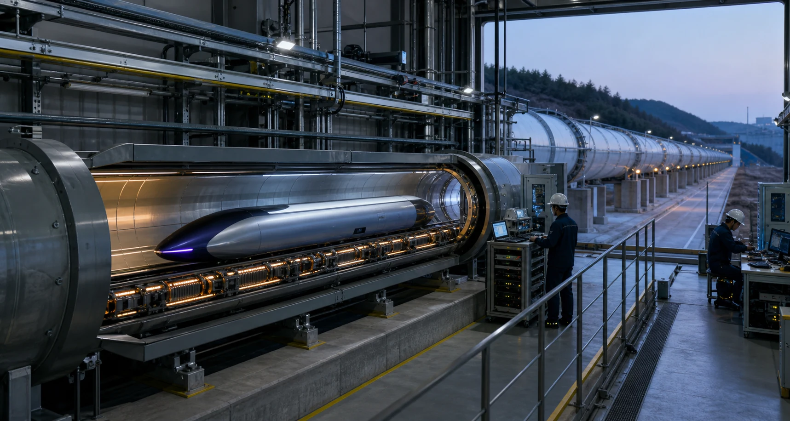
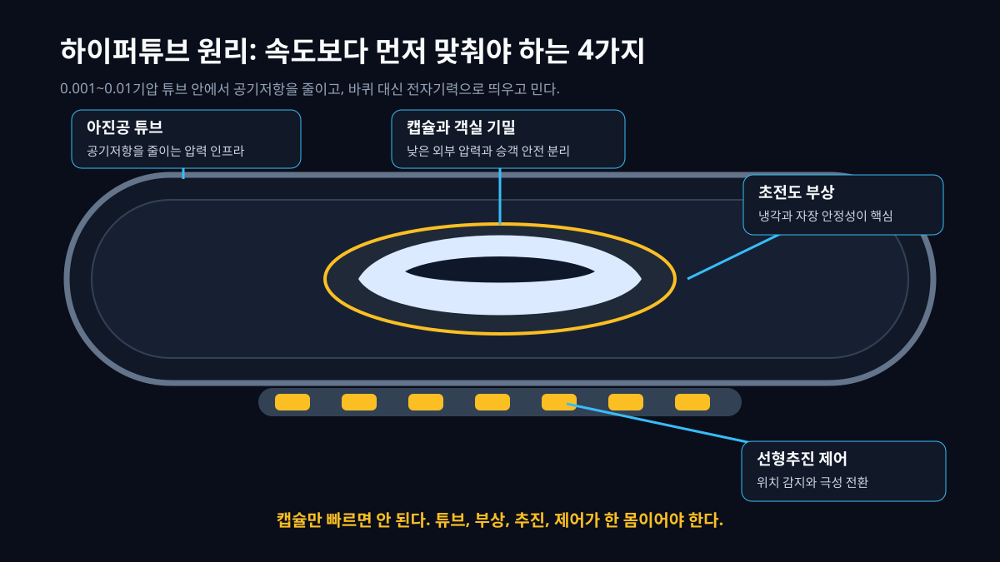
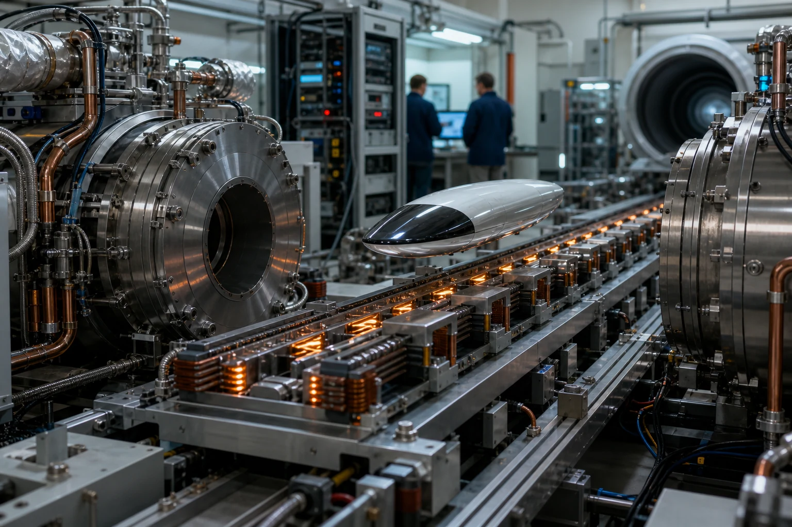
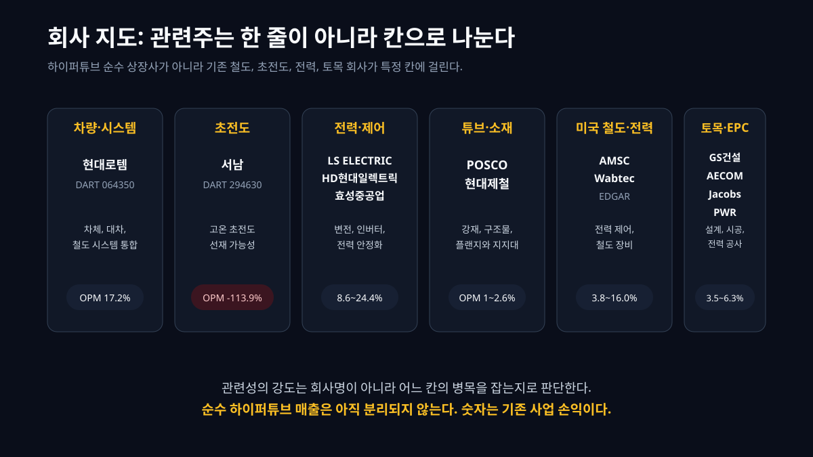
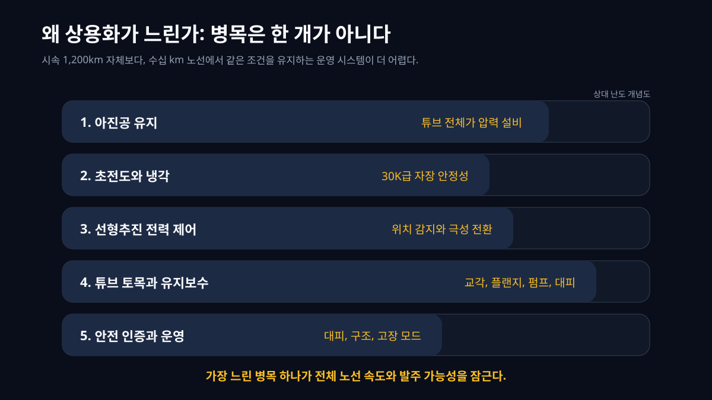
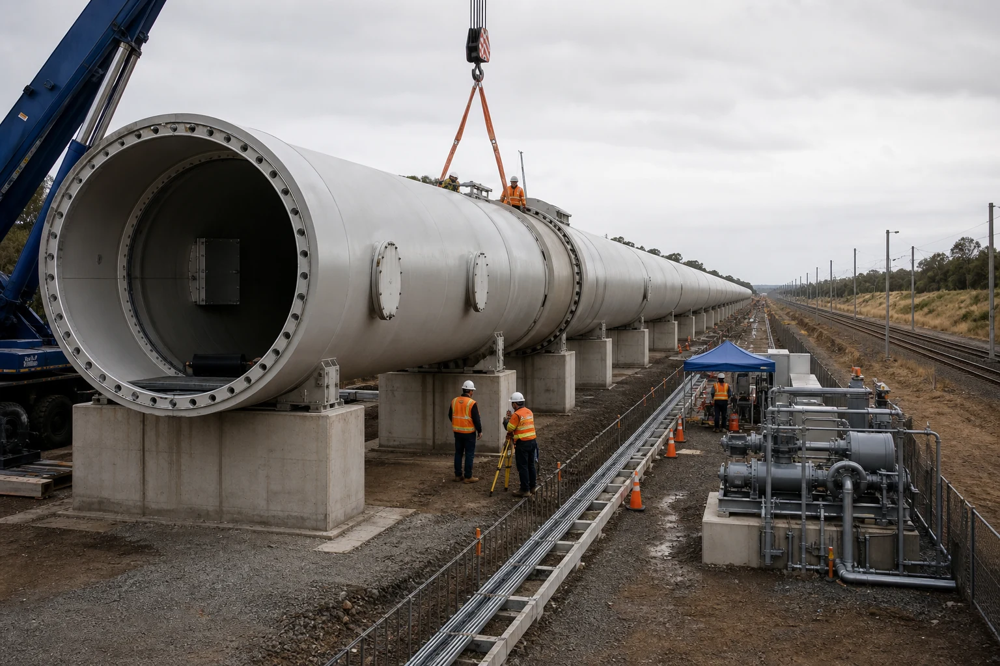
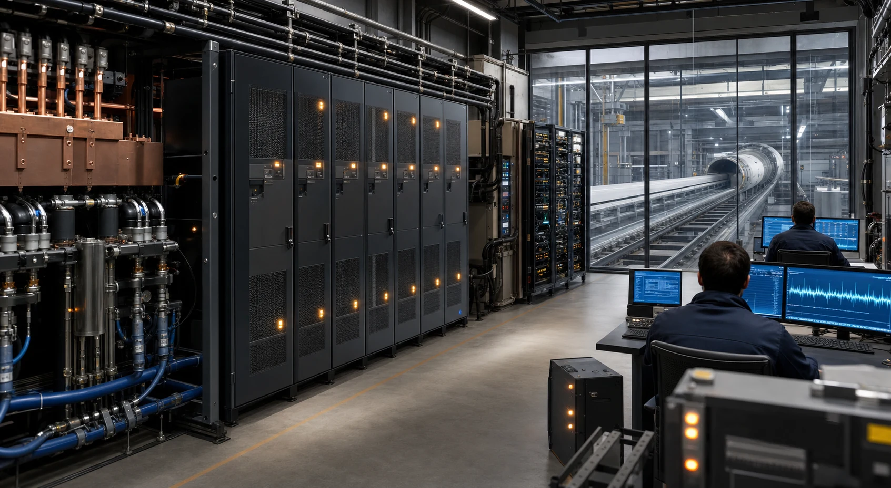
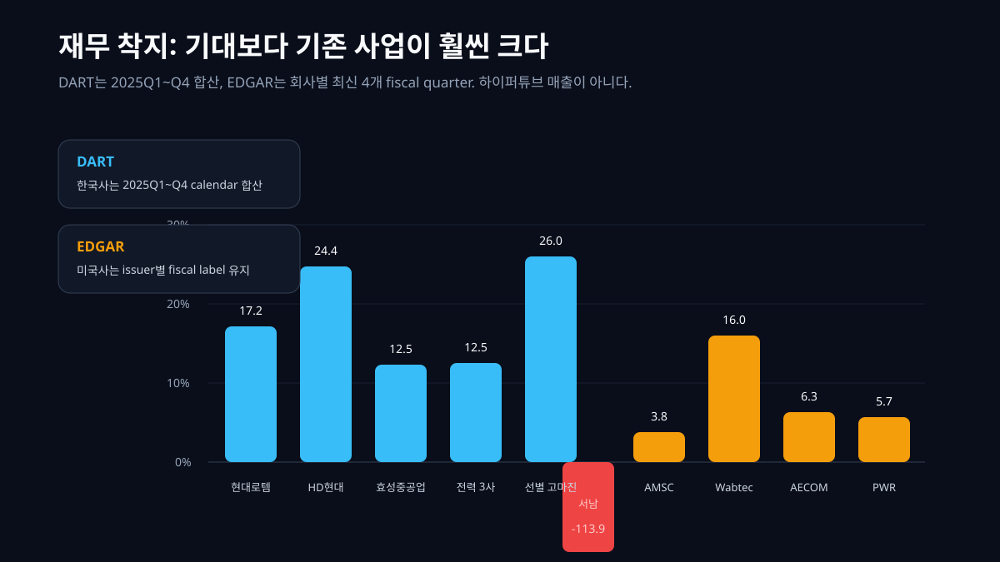
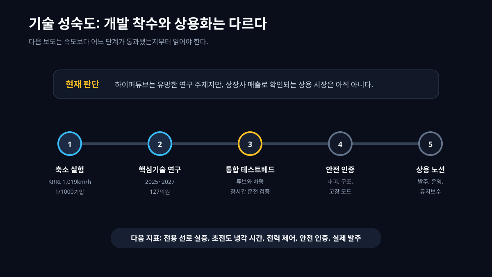

하이퍼튜브를 처음 들으면 사람은 대개 속도를 떠올린다. 시속 1,200km, 서울에서 부산까지 20분대, 바퀴 없는 캡슐. 그런데 이 기술을 정말 이해하려면 속도보다 먼저 물어야 할 질문이 있다. **그 긴 튜브 안의 공기를 어떻게 빼고, 어떻게 띄우고, 어떻게 밀고, 고장 나면 어떻게 세울 것인가.**

하이퍼튜브는 빠른 열차라기보다 압력 설비 위에 놓인 철도다. [한국철도기술연구원](https://www.krri.re.kr/web/contents/krri010101.do?id=5825&page=1&schBdcode=&schGroupCode=&schM=view&viewCount=8)은 하이퍼튜브를 1,200km/h 속도로 아진공 튜브 가이드웨이를 주행하는 신개념 육상 교통으로 설명하고, 축소모델 아진공 1/1000기압 튜브에서 1,019km/h 주행 실험을 성과로 제시했다. [국토교통부 2025년 4월 9일 보도자료](https://www.molit.go.kr/USR/NEWS/m_71/dtl.jsp?id=95090845&lcmspage=1)는 하이퍼튜브 핵심기술 개발을 2025년부터 2027년까지 총사업비 127억원으로 시작한다고 밝혔다. 여기서 중요한 말은 "상용 노선 착공"이 아니라 "핵심기술 개발과 검증"이다.



이 글의 관통선은 하나다. **하이퍼튜브는 캡슐이 아니라 공정 네트워크다.** 차량을 만드는 회사만 보면 틀린다. 아진공 튜브를 만드는 토목, 초전도 전자석과 냉각, 선형추진 전력 제어, 차체와 대차, 통신과 센서, 안전 인증, 비상 대피까지 모두 붙어야 한다. 그래서 상장사도 "하이퍼튜브 보유"가 아니라 어느 칸에 걸리는지로 읽어야 한다.

## 1. 하이퍼튜브는 왜 압력 문제인가

열차가 빨라질수록 가장 먼저 만나는 벽은 공기다. KTX나 항공기는 이미 공기저항과 싸운다. 하이퍼튜브는 접근을 바꾼다. 튜브 내부 압력을 낮춰 공기 분자를 줄이고, 그 안에서 캡슐을 달리게 한다. 국토교통부 보도자료는 하이퍼튜브의 운행 환경을 0.001~0.01기압의 아진공으로 설명한다. 바깥 대기압의 1/100에서 1/1000 수준까지 내려야 한다는 뜻이다.

여기서 "진공"이라는 단어가 사람을 속인다. 실험실의 짧은 관에서 낮은 압력을 만드는 것과 도시와 도시를 잇는 긴 노선에서 낮은 압력을 계속 유지하는 것은 다른 문제다. 수십 km 튜브가 이어지면 플랜지, 용접부, 팽창 이음, 점검구, 펌프 스테이션, 지반 침하, 온도 변화가 전부 압력 문제로 돌아온다. 작은 누설은 속도 문제이고, 큰 누설은 안전 문제다.



그래서 하이퍼튜브의 첫 번째 회사 지도는 차량이 아니라 튜브다. 튜브는 철강 구조물이면서 압력 용기이고, 철도 선로이면서 전력 설비의 지지대다. POSCO홀딩스나 현대제철 같은 철강사는 하이퍼튜브를 직접 만드는 순수 회사가 아니다. 다만 상용 노선이 현실화되면 고강도 강재, 플랜지, 지지 구조물, 용접 품질, 내식성 같은 소재·구조물 칸에 걸릴 수 있다. 이 차이를 구분해야 한다. "철강사가 수혜"가 아니라 "튜브가 강재와 시공 품질을 요구한다"가 정확한 말이다.

압력 문제는 운영으로도 이어진다. 정차역은 공기와 사람을 동시에 다뤄야 한다. 승객은 대기압에 있는 플랫폼에서 타고 내리고, 캡슐은 낮은 압력 튜브 안으로 들어간다. 그러면 에어락, 격벽, 비상 차단 구간, 압력 복구 시간, 대피 절차가 필요하다. 기존 철도역과 터널의 안전 규정만으로는 부족하다. 하이퍼튜브가 단지 빠른 차량이면 좋은데, 실제로는 선로와 역과 차량이 하나의 압력 시스템이 된다.

## 2. 바퀴를 없애면 전력이 선로가 된다

두 번째 질문은 어떻게 띄우고 어떻게 미느냐다. 하이퍼튜브는 바퀴 마찰을 줄이기 위해 자기부상과 선형추진을 쓴다. 국토교통부 보도자료는 핵심기술을 네 가지로 나눈다. 전자기 추진 선로, 초전도 전자석 시스템, 초고속 추진 제어, 부상·추진 차체 검증이다. 이름만 보면 어려워 보이지만 구조는 이렇다. 차량 쪽에는 초전도 전자석 또는 자석 시스템이 있고, 선로 쪽에는 전자석과 코일이 있다. 차량 위치를 감지하고, 가이드웨이 전자석의 극성을 아주 짧은 주기로 바꾸며 흡인력과 반발력을 만든다.

바퀴를 없앤 대가는 전력 제어다. 기존 철도에서 레일은 바퀴가 구르는 물리적 경로다. 하이퍼튜브의 가이드웨이는 물리적 경로이면서 전자석 배열이고, 전력 변환 장치이고, 센서 네트워크다. 초전도 전자석은 냉각이 필요하고, 선형추진은 전력 변환과 정밀 제어가 필요하다. 바퀴와 모터가 차량 안에 있던 철도보다, 선로 자체가 더 비싼 전기 설비가 될 수 있다.



여기서 서남 같은 고온 초전도 선재 회사가 관심을 받는다. 하지만 조심해야 한다. 초전도 선재는 하이퍼튜브의 한 칸에 걸릴 수 있지만, 곧바로 상용 하이퍼튜브 매출이라는 뜻은 아니다. 서남의 2025년 DART 합산 매출은 34억원, 영업이익률은 -113.9%였다. 이 숫자는 오히려 경고다. 초전도 소재가 기술적으로 흥미롭다는 사실과, 상장사가 지금 큰 매출을 갖고 있다는 사실은 다르다.

전력 쪽 회사도 마찬가지다. LS ELECTRIC, HD현대일렉트릭, 효성중공업은 변전, 배전, 전력 자동화, 전력기기에서 이미 사업을 하는 회사다. 하이퍼튜브가 상용 노선으로 가면 전력 변환, 전력 안정화, 변전, 제어 캐비닛이 필요하다. 그러나 현재 이 회사들의 손익은 AI 전력망, 송배전, 산업 자동화, 건설, 중전기 사이클에서 나온다. 하이퍼튜브로 읽기보다 [AI 전력 인프라 글](/blog/ai-power-transformer-supercycle)에서 다룬 전력망 병목의 한 변형으로 보는 편이 맞다.

## 3. 공정 지도로 보면 상장사가 달라진다

하이퍼튜브를 상장사 관점으로 볼 때 제일 위험한 문장은 "하이퍼튜브 관련주"다. 이 말은 모든 칸을 한 줄로 뭉갠다. 기술 글에서는 그 반대로 해야 한다. 어느 회사가 어느 칸에 놓이는지, 그 칸이 병목인지, 실제 매출로 확인되는지, 아직 연구 단계인지 나눠야 한다.



| 공정/층위 | 기술 역할 | 대표 회사 | 공시 근거 | 왜 이 회사가 이 칸의 핵심인가 |
|---|---|---|---|---|
| 아진공 튜브·구조물 | 낮은 압력을 유지하는 긴 압력 통로, 지지대, 플랜지, 점검구 | POSCO홀딩스, 현대제철, GS건설, AECOM, Jacobs, Fluor | DART, EDGAR | 상용 노선이 되면 튜브가 철도 선로이자 압력 설비가 된다. 강재, 시공, 구조 설계가 전체 CAPEX를 좌우한다 |
| 전자기 추진 선로 | 가이드웨이 전자석과 선형추진 코일 | 현대로템, LS ELECTRIC, AMSC | DART, EDGAR | 추진력이 차량 내부 엔진이 아니라 선로 전자석과 전력 제어에서 나온다 |
| 초전도 전자석·냉각 | 고온 초전도 전자석, 극저온 냉각, 자장 안정성 | 서남, AMSC, 연구기관 | DART, EDGAR | 부상과 추진 효율의 핵심이지만 아직 상용 매출보다 연구·검증 단계 성격이 강하다 |
| 차량·차체·대차 | 부상 전 차륜 주행, 차체 경량화, 객실 기밀, 승차감 | 현대로템, Wabtec | DART, EDGAR | 차량은 필요하지만 하이퍼튜브 전체 비용에서 캡슐만 주인공은 아니다 |
| 전력 변환·제어 | 인버터, 변전, 전력 안정화, 위치 감지, 제어 소프트웨어 | LS ELECTRIC, HD현대일렉트릭, 효성중공업, Quanta Services | DART, EDGAR | 바퀴를 없앤 대신 선로가 전력 설비가 되므로 전력 제어와 시공이 병목이 된다 |
| 운영·안전 인증 | 비상 대피, 압력 복구, 통신, 관제, 유지보수 | 철도 운영사, 시스템 통합사, 엔지니어링사 | 공시와 정책 자료 | 기술 실증 뒤에도 승객을 태우려면 안전 규정과 운영 검증이 별도로 필요하다 |

이 표에서 현대로템은 가장 직관적인 회사다. 기존 철도 차량과 시스템 통합 경험이 있고, 국내 상장사 중 철도 시스템을 크게 하는 회사다. 실제로 [현대로템 기업이야기](/blog/064350-hyundai-rotem)에서 봤듯 이 회사의 2025년 손익은 K2 전차와 철도 등 기존 사업이 만든 것이다. 하이퍼튜브 차체나 시스템 통합 칸에 걸릴 수는 있지만, "현대로템이 하이퍼튜브를 갖고 있다"와는 다른 말이다.

서남은 반대로 가장 오해받기 쉬운 회사다. 초전도라는 단어가 하이퍼튜브의 부상·추진과 연결되지만, 회사 규모가 작고 손익은 아직 연구형 위험을 보인다. 그러므로 서남을 볼 때는 "초전도 선재가 하이퍼튜브에 쓰일 수 있나"와 "회사가 실제 대규모 발주를 받을 준비가 됐나"를 분리해야 한다. 전자는 기술 질문이고 후자는 공시 질문이다.

## 4. 순수 하이퍼튜브 상장사는 왜 거의 없나

하이퍼튜브 시장은 아직 상용 철도 시장이 아니다. 2025년 국토교통부 사업도 핵심기술 개발과 검증 단계다. 전용 선로, 초전도 전자석, 주행 제어, 차체 검증이라는 네 칸을 연구하는 단계이지, 상업 노선을 발주하고 민간 사업자가 운영하는 단계가 아니다. 이 차이를 빼면 글은 곧장 테마주 글이 된다.

민간 하이퍼루프의 역사도 이 경계를 보여준다. 해외에서는 Virgin Hyperloop 또는 Hyperloop One 같은 민간 프로젝트가 큰 관심을 받았지만, 2023년 말 사업 정리 보도가 나왔다. 이 사실을 "기술은 실패"로 단정할 필요는 없다. 다만 상용 노선은 기술 데모보다 훨씬 어렵다는 반례로는 충분하다. 빠른 캡슐을 보여주는 것과, 승객을 매일 태우는 규제 산업을 만드는 것은 다른 일이다.



순수 상장사가 거의 없는 이유도 여기에 있다. 상용 시장이 열리기 전에는 매출을 쌓기 어렵다. 대규모 테스트베드, 정부 연구, 철도 인증, 노선 발주가 이어져야 그때부터 회사별 수주가 보인다. 그래서 지금 보이는 상장사는 대부분 기존 사업자다. 철도 차량, 초전도 소재, 전력 장비, 철강, 토목 엔지니어링, 전력 시공 회사다. 이들은 하이퍼튜브가 아니라 기존 사업으로 돈을 벌고 있다.

이 구조는 [HBM 기술이야기](/blog/hbm-stack-packaging-test)와도 닮았다. HBM도 메모리 이름 하나가 아니라 TSV, 본딩, CoWoS, 테스트, 고객 인증의 네트워크였다. 하이퍼튜브도 마찬가지다. 속도라는 이름 하나가 아니라 아진공, 초전도, 선형추진, 전력, 토목, 안전 인증의 네트워크다. 다만 차이는 HBM은 이미 대량 매출이 찍히는 기술이고, 하이퍼튜브는 아직 연구와 검증 단계라는 점이다.

## 5. 전력과 토목이 왜 더 큰 문제인가

하이퍼튜브를 상상할 때 사람은 캡슐을 본다. 실제 자본은 튜브와 전력에 먼저 묶인다. 긴 노선을 밀폐하고 압력을 낮게 유지하려면 튜브 자체가 거대한 설비다. 펌프 스테이션, 차단 밸브, 유지보수 접근구, 진동과 열팽창을 흡수하는 구조, 교각과 기초, 지진과 침하 대응이 필요하다. 이것은 철도이면서 플랜트다.



전력도 별도 문제다. 선형추진은 가이드웨이 전자석을 순서대로 켜고 끄며 차량을 민다. 그러면 전력 변환 장치, 냉각, 제어 캐비닛, 센서, 통신망이 선로 옆에 깔린다. 순간 전력, 회생제동, 고장 구간 격리, 전자기 간섭, 안전 정지까지 계산해야 한다. 전력 설비가 한 번 고장 나면 차량 하나가 멈추는 게 아니라 노선 구간이 멈춘다.



그래서 LS ELECTRIC, HD현대일렉트릭, 효성중공업 같은 전력 회사가 인접 칸에 놓인다. LS ELECTRIC은 배전과 자동화, HD현대일렉트릭과 효성중공업은 변압기와 중전기 영역에서 이미 돈을 번다. 하지만 이 글에서는 이들을 하이퍼튜브 수혜주로 부르지 않는다. 이유는 명확하다. 2025년 손익은 하이퍼튜브가 아니라 전력 인프라 사이클이 만든 숫자다. [HD현대일렉트릭 AI 전력 후속](/blog/267260-hd-hyundai-electric-ai-power)과 [LS ELECTRIC 기업이야기](/blog/010120-ls-electric)를 함께 읽으면, 전력기기 회사의 마진은 하이퍼튜브보다 데이터센터, 송배전 투자, 미국 전력망 병목에서 먼저 설명된다.

토목 회사도 같다. 국내에서는 GS건설 같은 대형 건설사가 튜브 구조물, 지하·고가 구조, 프로젝트 관리 칸에 걸릴 수 있다. 미국장에서는 AECOM, Jacobs, Fluor 같은 엔지니어링·EPC 회사와 Quanta Services 같은 전력 인프라 시공사가 인접 칸이다. 이들은 하이퍼튜브를 직접 만들고 있는 회사라기보다, 만약 큰 노선이 발주된다면 설계, 시공, 전력 공사, 프로젝트 관리 칸에 들어갈 수 있는 회사다. 하이퍼튜브가 상용화되려면 이런 회사의 역량이 필요하지만, 지금 이 회사들의 DART와 EDGAR 손익은 기존 건설·인프라 프로젝트가 만든 것이다.

## 6. DART로 보면 한국사는 이렇게 갈린다

기술 지도를 숫자로 내려보자. 아래 표는 DART 2025Q1부터 2025Q4까지 손익계산서 분기를 합산한 것이다. 모두 회사 전체 숫자다. 하이퍼튜브 매출이 아니며, 기존 사업 믹스가 섞여 있다.

```python
import dartlab

codes = ["064350", "294630", "010120", "267260", "298040", "005490", "004020"]
rows = ["sales", "gross_profit", "operating_profit"]

for code in codes:
    c = dartlab.Company(code)
    is_table = c.select("IS", rows)
    # DART 한국사는 2025Q1, 2025Q2, 2025Q3, 2025Q4를 calendar year 합산으로 검산한다.
```

| 회사 | 하이퍼튜브 지도에서의 칸 | 기준 | 매출 | 매출총이익률 | 영업이익률 | 해석 |
|---|---|---|---:|---:|---:|---|
| 현대로템 | 차량·철도 시스템 통합 | DART 2025Q1-Q4 | 5.84조원 | 23.8% | 17.2% | 철도와 방산 기존 사업의 대형 제조사. 차체와 시스템 칸에는 걸리지만 하이퍼튜브 순수 매출은 아님 |
| 서남 | 고온 초전도 선재 | DART 2025Q1-Q4 | 34억원 | -12.7% | -113.9% | 기술 키워드는 가깝지만 사업 규모와 손익은 연구형 위험을 보여줌 |
| LS ELECTRIC | 전력 변환·배전·자동화 | DART 2025Q1-Q4 | 4.97조원 | 21.2% | 8.6% | 선형추진 전력 제어와 인접하지만 현재 손익은 기존 전력·자동화 사이클 |
| HD현대일렉트릭 | 변압기·중전기 | DART 2025Q1-Q4 | 4.08조원 | 34.1% | 24.4% | 전력망 병목의 가격력이 강하게 보이나 하이퍼튜브와 직접 매출은 분리해야 함 |
| 효성중공업 | 변압기·중공업·건설 | DART 2025Q1-Q4 | 5.97조원 | 21.0% | 12.5% | 전력 설비와 건설이 섞인 회사 전체 손익 |
| POSCO홀딩스 | 강재·그룹 소재 | DART 2025Q1-Q4 | 69.09조원 | 7.5% | 2.6% | 튜브 강재와 구조물의 인접 칸이지만 전사 손익은 철강·소재 사이클 |
| 현대제철 | 강재·구조물 | DART 2025Q1-Q4 | 22.73조원 | 6.6% | 1.0% | 하이퍼튜브용 튜브가 현실화될 때 소재 칸에 걸릴 수 있으나 현재는 철강 사이클 |
| GS건설 | 토목·EPC·프로젝트 관리 | DART 2025Q1-Q4 | 12.45조원 | 10.8% | 3.5% | 튜브 노선과 역, 구조물 시공 칸에는 걸릴 수 있으나 현재 손익은 기존 건설 프로젝트 |

이 표에서 가장 중요한 숫자는 가장 높은 영업이익률이 아니다. 가장 중요한 것은 규모와 직접성의 차이다. 현대로템은 기술적으로 가까워 보이지만 2025년 실적은 방산과 기존 철도 사업이 크게 만든다. 서남은 기술 키워드가 가장 강해 보이지만 매출 규모가 작고 손익은 적자다. 전력 회사는 돈을 잘 벌고 있지만 하이퍼튜브가 아니라 전력망 슈퍼사이클이 먼저다. 철강사는 튜브라는 본체에 필요한 소재 칸이지만 전사 손익은 원자재와 철강 가격 사이클에 묶인다.

즉 하이퍼튜브 상장사를 볼 때는 "기술 거리"와 "재무 거리"를 따로 봐야 한다. 기술 거리는 초전도와 자기부상에 가까울수록 짧다. 재무 거리는 실제 매출과 마진으로 확인될수록 짧다. 서남은 기술 거리는 가까워도 재무 거리는 멀다. HD현대일렉트릭은 재무는 강하지만 하이퍼튜브 기술 거리는 멀다. 현대로템은 차량과 시스템 경험 때문에 기술 거리가 중간쯤이지만, 순수 하이퍼튜브 매출은 아직 없다.

## 7. EDGAR는 기간 라벨부터 확인해야 한다

미국장까지 넓히면 더 조심해야 한다. AMSC는 전력 제어와 초전도 이름 때문에 자주 거론될 수 있다. Wabtec은 철도 장비와 시스템 회사다. AECOM과 Jacobs는 대형 인프라 설계와 엔지니어링, Quanta Services는 전력 인프라 시공, Fluor는 EPC 칸에 가깝다. 그런데 이 회사들을 하나의 calendar year 표로 묶으면 안 된다. EDGAR 회사는 회계연도와 분기 끝일이 다르다. 아래 표는 dartlab 라벨 그대로 최신 4개 fiscal quarter를 합산했다.

```python
import dartlab

tickers = ["AMSC", "WAB", "ACM", "J", "PWR", "FLR"]
rows = ["revenue", "gross_profit", "operating_income"]

for ticker in tickers:
    c = dartlab.Company(ticker)
    is_table = c.select("IS", rows)
    # EDGAR는 회사별 최신 4개 fiscal quarter를 그대로 합산한다.
    # calendar year로 재라벨링하지 않는다.
```

| 회사 | 하이퍼튜브 지도에서의 칸 | EDGAR 기간 라벨 | 매출 | 매출총이익률 | 영업이익률 | 해석 |
|---|---|---|---:|---:|---:|---|
| AMSC | 전력 제어·초전도 인접 | 2026Q4, 2026Q3, 2026Q2, 2026Q1 | 0.30B 달러 | 30.5% | 3.8% | 전력 제어와 초전도 이름은 가깝지만 하이퍼튜브 순수 회사가 아님 |
| Wabtec | 철도 장비·시스템 | 2026Q1, 2025Q4, 2025Q3, 2025Q2 | 11.51B 달러 | 34.5% | 16.0% | 철도 시스템 경험이 있지만 하이퍼튜브 차량·운영과는 별도 |
| AECOM | 토목·인프라 설계 | 2026Q2, 2026Q1, 2025Q4, 2025Q3 | 15.99B 달러 | 7.7% | 6.3% | 대형 인프라 설계 칸. 발주가 있어야 의미가 생김 |
| Jacobs | 엔지니어링·프로젝트 | 2026Q2, 2026Q1, 2025Q4, 2025Q3 | 13.17B 달러 | 23.4% | 4.5% | 복잡한 인프라 프로젝트 경험은 있으나 순수 하이퍼튜브 매출 아님 |
| Quanta Services | 전력 인프라 시공 | 2026Q1, 2025Q4, 2025Q3, 2025Q2 | 30.12B 달러 | 15.1% | 5.7% | 선형추진 전력망과 변전 공사 인접 칸 |
| Fluor | EPC와 대형 프로젝트 | 2026Q1, 2025Q4, 2025Q3, 2025Q2 | 15.18B 달러 | -1.6% | -2.5% | 대형 프로젝트 경험은 있지만 수익성은 프로젝트 믹스에 크게 흔들림 |



미국장에서 얻을 수 있는 핵심은 "미국에도 순수주는 없다"에 가깝다. AMSC는 이름 때문에 초전도와 전력 제어의 연결성이 강해 보이지만, 2026Q4~2026Q1 합산 매출은 2.99억 달러이고 영업이익률은 3.8%다. Wabtec은 훨씬 큰 철도 장비 회사이고 영업이익률도 16.0%지만, 하이퍼튜브 사업자로 읽을 수는 없다. AECOM과 Jacobs는 발주가 생기면 설계와 엔지니어링 칸에 들어갈 수 있지만, 아직은 기존 인프라 회사다.

이 차이는 투자 언어보다 기술 언어로 설명하는 편이 더 정확하다. 하이퍼튜브가 상용화되면 승자는 하나가 아니라 여러 계약으로 나뉜다. 초전도 전자석, 가이드웨이, 전력 변환, 튜브 구조물, 펌프 스테이션, 관제, 안전 인증, 토목 EPC가 따로 발주될 수 있다. 그러면 회사별 손익도 다르게 남는다. 소재 회사는 매출은 작고 마진 변동이 클 수 있고, 전력 회사는 기존 사이클에 묻힐 수 있고, 토목 EPC는 매출은 크지만 마진은 얇을 수 있다.

## 8. 기술 성숙도와 출처

기술 성숙도를 네 단계로 나눠 보자. 첫째, 축소 실험 단계다. KRRI의 1/1000기압, 1,019km/h 실험은 의미가 크다. 공기저항을 줄이고 캡슐 안정성을 확인하는 기술 성과다. 하지만 축소 모델은 상용 노선이 아니다. 긴 튜브, 승객 안전, 유지보수, 통합 전력 설비가 빠져 있다.

둘째, 핵심기술 개발 단계다. 2025년 4월 9일 국토교통부가 밝힌 사업은 전자기 추진 선로, 초전도 전자석 시스템, 주행 제어, 차체 검증을 대상으로 한다. 이 단계는 기술 요소를 검증하는 일이다. "시속 1,200km 열차가 곧 팔린다"가 아니라 "상용화에 필요한 핵심 부품과 제어를 검증한다"에 가깝다.

셋째, 통합 테스트베드 단계다. 하이퍼튜브는 한 부품이 아니라 시스템이므로, 일정 길이의 튜브 안에서 압력 유지, 부상, 추진, 제어, 비상 정지, 열 관리, 운영 절차를 함께 검증해야 한다. 여기서 성공해야 실제 발주 논의가 가능하다. 넷째, 안전 인증과 상용 노선 단계다. 승객을 태우려면 대피, 구조, 화재, 통신, 압력 복구, 전력 장애, 지진과 침하를 모두 다뤄야 한다.



출처도 분리해야 한다. 기술 정의와 연구 단계는 KRRI와 국토교통부가 1차 근거다. 정책 설명은 [Korea.net의 하이퍼튜브 기사](https://www.korea.net/NewsFocus/Sci-Tech/view?articleId=269500)처럼 정부 공식 영문 매체도 보조 근거로 쓸 수 있다. 자기부상 기술의 성숙도는 [JR Central의 SCMaglev 공식 설명](https://scmaglev.jr-central-global.com/about/)처럼 실제 자기부상 철도 자료를 비교 축으로 볼 수 있다. 다만 SCMaglev는 하이퍼튜브가 아니다. 대기 중 자기부상 고속철이고, 하이퍼튜브는 낮은 압력 튜브까지 포함한다. 같은 기술로 묶으면 안 된다.

```python
import dartlab

# 공시 본문에서 하이퍼튜브, 자기부상, 초전도, 전력 제어, 인프라 같은 단어를 찾을 때
# 매출 표와 같은 기간으로 묶지 말고 문서 종류와 제출일을 같이 보관한다.
docs = dartlab.search("하이퍼튜브 자기부상 초전도 전력 제어")
```

기업 근거는 DART와 EDGAR가 우선이다. 현대로템, 서남, LS ELECTRIC, HD현대일렉트릭, 효성중공업, POSCO홀딩스, 현대제철, GS건설은 DART에서 사업보고서와 분기보고서의 사업 내용, 매출, 연구개발, 수주를 확인한다. AMSC, Wabtec, AECOM, Jacobs, Quanta Services, Fluor는 SEC EDGAR의 10-K와 10-Q에서 사업부 설명, backlog, risk factors, revenue와 operating income을 확인한다. 특히 EDGAR는 fiscal year와 quarter label을 그대로 보관해야 한다.

## 9. 이렇게 오해하면 안 된다

첫 번째 오해는 "하이퍼튜브는 현대로템 하나만 보면 된다"다. 현대로템은 국내 상장사 중 철도 차량과 시스템 통합 경험이 있는 중요한 회사다. 하지만 하이퍼튜브의 본체는 차량 하나가 아니다. 튜브, 전력, 초전도, 제어, 안전 인증이 동시에 필요하다. 현대로템이 가까운 칸에 있다는 말과 전체 기술을 보유했다는 말은 다르다.

두 번째 오해는 "초전도 회사면 바로 하이퍼튜브 수혜"라는 문장이다. 하이퍼튜브에는 초전도 전자석이 핵심 칸으로 들어갈 수 있다. 그러나 초전도 선재가 있다고 해서 상용 노선 발주를 곧바로 받는 것은 아니다. 서남의 2025년 DART 합산 매출 34억원과 영업이익률 -113.9%는 기술 키워드와 재무 현실이 얼마나 멀 수 있는지 보여준다.

세 번째 오해는 "전력 회사가 돈을 잘 버니 하이퍼튜브 수혜가 이미 찍혔다"는 해석이다. HD현대일렉트릭의 2025년 영업이익률 24.4%는 강력한 숫자지만, 이는 하이퍼튜브가 아니라 초고압 변압기와 전력 인프라 사이클의 결과다. LS ELECTRIC과 효성중공업도 마찬가지다. 하이퍼튜브는 미래의 전력 수요 후보일 수 있지만, 현재 손익을 설명하는 주된 원인은 아니다.

네 번째 오해는 EDGAR 기간을 섞는 것이다. AMSC의 2026Q4, Wabtec의 2026Q1, AECOM의 2026Q2는 같은 calendar quarter가 아니다. 미국 회사는 회계연도 끝일이 다르다. 그래서 EDGAR 숫자는 최신 4개 fiscal quarter로 묶되 라벨을 남겨야 한다. 라벨을 지우면 매끄러워 보이지만, 그 순간 숫자가 거짓말을 할 수 있다.

다섯 번째 오해는 "국토교통부 사업 착수는 상용화가 임박했다는 뜻"이라는 생각이다. 2025~2027년 127억원 사업은 핵심기술 개발과 검증이다. 상용 노선 발주, 안전 인증, 운영사 선정, 토지와 환경 인허가, 대규모 민간 투자와는 다른 단계다. 기술이야기의 깊이는 바로 이 단계를 구분하는 데 있다.

## 10. 체크리스트: 다음 보도에서 볼 신호

다음 하이퍼튜브 보도가 나왔을 때는 제목의 속도보다 아래 순서로 보자.

| 질문 | 볼 지표 | 어디서 확인하나 | 해석 |
|---|---|---|---|
| 아진공을 긴 구간에서 유지했나 | 압력 범위, 운전 시간, 누설률, 펌프 전력 | KRRI, MOLIT, 연구 보고서 | 짧은 실험과 노선 운영의 차이를 확인한다 |
| 부상과 추진이 동시에 됐나 | 초전도 전자석, 냉각 시간, 가이드웨이 전력, 제어 주기 | KRRI, 연구기관, DART | 부상만 성공했는지, 추진과 제어까지 통합됐는지 본다 |
| 전용 선로가 만들어졌나 | 테스트베드 길이, 전자석 배열, 전력 변환 장치, 안전 정지 | MOLIT, KAIA, DART | 실험실 부품에서 통합 시스템으로 넘어갔는지 확인한다 |
| 상장사 매출로 보이나 | 수주, 매출채권, 재고, 선수금, 연구개발비 | DART, EDGAR | 보도 키워드가 실제 재무제표로 내려왔는지 본다 |
| 토목과 전력 CAPEX가 잡혔나 | 설계 계약, EPC 계약, 변전 설비, 펌프 스테이션 | EDGAR, DART, 정책 자료 | 차량보다 노선 인프라가 먼저 돈을 쓰는지 본다 |
| 안전 인증 단계인가 | 대피, 화재, 압력 복구, 관제, 고장 모드 | 정부 자료, 철도 인증 자료 | 승객 운송으로 넘어갈 수 있는지 구분한다 |

이 체크리스트를 쓰면 하이퍼튜브를 테마어가 아니라 공정 네트워크로 볼 수 있다. "누가 수혜인가"보다 먼저 "어느 병목이 풀렸나"를 묻는다. 전용 선로가 풀리면 토목과 전력 회사가 보이고, 초전도 전자석이 풀리면 소재와 냉각 회사가 보이고, 차량 검증이 풀리면 철도 시스템 회사가 보인다. 아직 아무 병목도 상용 매출로 내려오지 않았다면, 기대는 기대로 두고 공시 숫자는 기존 사업으로 읽어야 한다.

## 11. FAQ

**하이퍼튜브와 하이퍼루프는 같은 말인가?**
큰 개념은 비슷하다. 낮은 압력의 튜브 안에서 캡슐을 고속으로 움직이는 미래형 교통 시스템이다. 국토교통부 보도자료도 2013년에 하이퍼루프라는 이름으로 도입된 개념을 우리나라와 유럽에서는 통상 하이퍼튜브라고 부른다고 설명한다.

**자기부상 철도와 무엇이 다른가?**
자기부상 철도는 바퀴 없이 뜨는 철도다. 하이퍼튜브는 여기에 낮은 압력 튜브가 붙는다. JR Central의 SCMaglev처럼 자기부상은 이미 실제 노선 기술로 발전해 왔지만, 하이퍼튜브는 낮은 압력 인프라와 안전 운영까지 추가로 풀어야 한다.

**현대로템은 하이퍼튜브 회사인가?**
아니다. 현대로템은 철도 차량과 시스템 통합 경험이 있는 상장사라 차량·시스템 칸에 걸릴 수 있다. 그러나 2025년 손익은 기존 철도와 방산 사업이 만든 회사 전체 숫자다.

**서남은 초전도라서 가장 직접적인가?**
기술 키워드로는 가까운 편이다. 하지만 2025년 매출 34억원과 영업적자는 상용 하이퍼튜브 매출이 아직 없다는 현실을 보여준다. 기술 거리와 재무 거리를 분리해야 한다.

**미국장에서는 무엇을 보면 되나?**
순수 하이퍼튜브 회사보다 칸을 봐야 한다. AMSC는 전력 제어와 초전도 인접, Wabtec은 철도 장비, AECOM과 Jacobs는 토목 설계, Quanta Services는 전력 인프라 시공, Fluor는 EPC 칸이다. 모두 EDGAR fiscal label을 유지해 읽어야 한다.

## 검증표

본문의 수치는 아래 호출과 기준으로 재현된다. 한국 상장사는 DART 기반 dartlab 실측, 미국 상장사는 EDGAR 기반 dartlab 실측이다. 한국사는 2025Q1부터 2025Q4까지 calendar year 합산이고, 미국사는 회사별 최신 4개 fiscal quarter를 그대로 합산했다. 데이터 기준: 2026-07-07.

| 본문 수치 | dartlab 호출 | 기준 | 결과 |
|---|---|---|---|
| 현대로템 2025 매출 5.84조원, 영업이익률 17.2% | `Company("064350").select("IS", ["sales", "gross_profit", "operating_profit"])` | DART 2025Q1-Q4 합산 | 실측 |
| 서남 2025 매출 34억원, 영업이익률 -113.9% | `Company("294630").select("IS", ["sales", "gross_profit", "operating_profit"])` | DART 2025Q1-Q4 합산 | 실측 |
| LS ELECTRIC 2025 매출 4.97조원, 영업이익률 8.6% | `Company("010120").select("IS", ["sales", "gross_profit", "operating_profit"])` | DART 2025Q1-Q4 합산 | 실측 |
| HD현대일렉트릭 2025 매출 4.08조원, 영업이익률 24.4% | `Company("267260").select("IS", ["sales", "gross_profit", "operating_profit"])` | DART 2025Q1-Q4 합산 | 실측 |
| 효성중공업 2025 매출 5.97조원, 영업이익률 12.5% | `Company("298040").select("IS", ["sales", "gross_profit", "operating_profit"])` | DART 2025Q1-Q4 합산 | 실측 |
| POSCO홀딩스 2025 매출 69.09조원, 영업이익률 2.6% | `Company("005490").select("IS", ["sales", "gross_profit", "operating_profit"])` | DART 2025Q1-Q4 합산 | 실측 |
| 현대제철 2025 매출 22.73조원, 영업이익률 1.0% | `Company("004020").select("IS", ["sales", "gross_profit", "operating_profit"])` | DART 2025Q1-Q4 합산 | 실측 |
| GS건설 2025 매출 12.45조원, 영업이익률 3.5% | `Company("006360").select("IS", ["sales", "gross_profit", "operating_profit"])` | DART 2025Q1-Q4 합산 | 실측 |
| AMSC 최신 4개 분기 매출 0.30B 달러, 영업이익률 3.8% | `Company("AMSC").select("IS", ["revenue", "gross_profit", "operating_income"])` | EDGAR 2026Q4, 2026Q3, 2026Q2, 2026Q1 합산 | 실측 |
| Wabtec 최신 4개 분기 매출 11.51B 달러, 영업이익률 16.0% | `Company("WAB").select("IS", ["revenue", "gross_profit", "operating_income"])` | EDGAR 2026Q1, 2025Q4, 2025Q3, 2025Q2 합산 | 실측 |
| AECOM 최신 4개 분기 매출 15.99B 달러, 영업이익률 6.3% | `Company("ACM").select("IS", ["revenue", "gross_profit", "operating_income"])` | EDGAR 2026Q2, 2026Q1, 2025Q4, 2025Q3 합산 | 실측 |
| Jacobs 최신 4개 분기 매출 13.17B 달러, 영업이익률 4.5% | `Company("J").select("IS", ["revenue", "gross_profit", "operating_income"])` | EDGAR 2026Q2, 2026Q1, 2025Q4, 2025Q3 합산 | 실측 |
| Quanta Services 최신 4개 분기 매출 30.12B 달러, 영업이익률 5.7% | `Company("PWR").select("IS", ["revenue", "gross_profit", "operating_income"])` | EDGAR 2026Q1, 2025Q4, 2025Q3, 2025Q2 합산 | 실측 |
| Fluor 최신 4개 분기 매출 15.18B 달러, 영업이익률 -2.5% | `Company("FLR").select("IS", ["revenue", "gross_profit", "operating_income"])` | EDGAR 2026Q1, 2025Q4, 2025Q3, 2025Q2 합산 | 실측 |

기술 원리와 외부 근거는 [한국철도기술연구원 하이퍼튜브 대표 연구성과](https://www.krri.re.kr/web/contents/krri010101.do?id=5825&page=1&schBdcode=&schGroupCode=&schM=view&viewCount=8), [국토교통부 2025년 4월 9일 보도자료](https://www.molit.go.kr/USR/NEWS/m_71/dtl.jsp?id=95090845&lcmspage=1), [Korea.net 하이퍼튜브 프로젝트 기사](https://www.korea.net/NewsFocus/Sci-Tech/view?articleId=269500), [JR Central SCMaglev 설명](https://scmaglev.jr-central-global.com/about/), [The Verge의 Hyperloop One 종료 보도](https://www.theverge.com/2023/12/21/24011005/hyperloop-one-shutting-down-virgin-richard-branson)를 확인했다. 외부 자료는 기술 구조와 연구 단계 확인용이고, 위 표의 매출과 이익률은 dartlab 실측으로 계산했다.

## 공시 / Filings

- [DART 전자공시](https://dart.fss.or.kr/): 현대로템, 서남, LS ELECTRIC, HD현대일렉트릭, 효성중공업, POSCO홀딩스, 현대제철, GS건설 사업보고서와 분기보고서 확인.
- [SEC EDGAR AMSC](https://www.sec.gov/cgi-bin/browse-edgar?action=getcompany&CIK=AMSC&type=10-K&owner=exclude&count=40)
- [SEC EDGAR Wabtec](https://www.sec.gov/cgi-bin/browse-edgar?action=getcompany&CIK=WAB&type=10-K&owner=exclude&count=40)
- [SEC EDGAR AECOM](https://www.sec.gov/cgi-bin/browse-edgar?action=getcompany&CIK=ACM&type=10-K&owner=exclude&count=40)
- [SEC EDGAR Jacobs](https://www.sec.gov/cgi-bin/browse-edgar?action=getcompany&CIK=J&type=10-K&owner=exclude&count=40)
- [SEC EDGAR Quanta Services](https://www.sec.gov/cgi-bin/browse-edgar?action=getcompany&CIK=PWR&type=10-K&owner=exclude&count=40)
- [SEC EDGAR Fluor](https://www.sec.gov/cgi-bin/browse-edgar?action=getcompany&CIK=FLR&type=10-K&owner=exclude&count=40)
