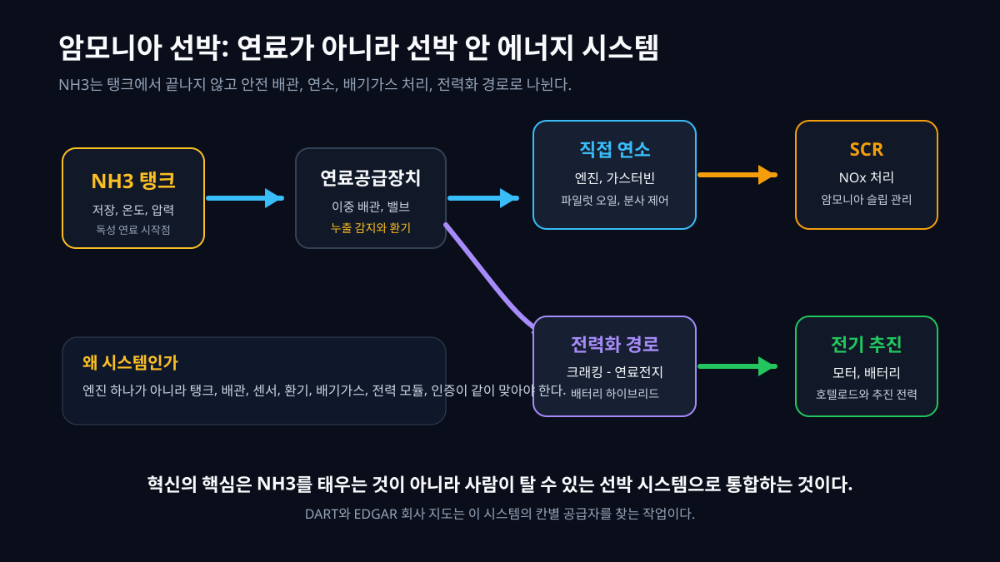
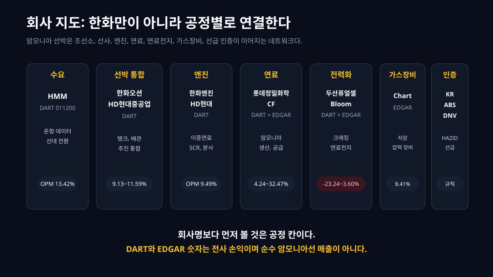
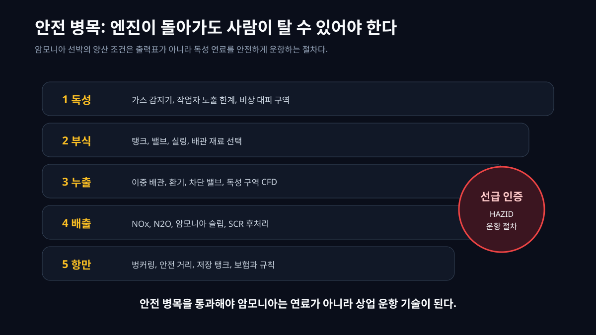
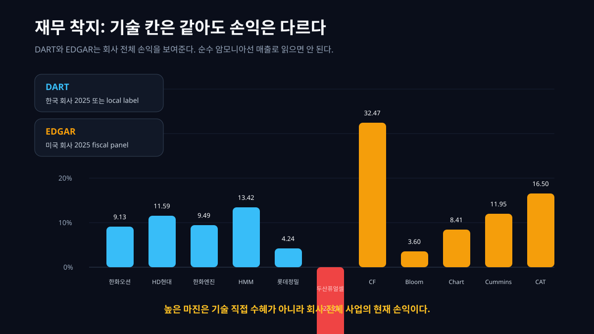
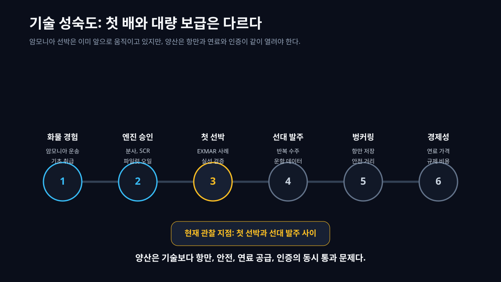

답부터 말하면, 암모니아 선박은 한화 계열만의 이야기가 아니다. 한화오션이 좋은 입구인 것은 맞다. 조선소가 있고, 한화엔진이 있고, 한화에어로스페이스의 연료전지와 Amogy의 암모니아 전력화 기술도 연결된다. 하지만 여기서 멈추면 글은 좁아진다. 암모니아 선박은 특정 그룹의 신사업이 아니라 **선박 안에 독성 연료, 엔진, 발전소, 배기가스 처리, 누출 감지, 비상 대응, 선급 인증이 같이 들어오는 기술 네트워크**다.

그러면 회사 지도도 달라진다. DART에서는 한화오션, HD현대중공업, 한화엔진, HMM, 롯데정밀화학, 두산퓨얼셀을 본다. EDGAR에서는 CF Industries, Bloom Energy, Chart Industries, Cummins, Caterpillar를 본다. 어떤 회사는 조선 통합 칸에 있고, 어떤 회사는 연료 공급 칸에 있고, 어떤 회사는 연료전지와 전력 모듈 칸에 있다. 이 글의 질문은 "한화오션이 수혜인가"가 아니다. **암모니아라는 특정 기술이 어떤 공정으로 쪼개지고, 그 공정이 어느 회사의 공시 숫자와 연결되는가**다.


[IMO](https://www.imo.org/en/mediacentre/hottopics/pages/cutting-ghg-emissions.aspx)는 2030년까지 국제해운 에너지 사용에서 zero or near-zero GHG 연료 비중을 최소 5%, 가능하면 10%까지 끌어올리는 목표를 제시했다. [DNV의 IMO 규제 해설](https://www.dnv.com/maritime/hub/decarbonize-shipping/key-drivers/regulations/imo-regulations/ghg-vision/)도 2030년 탄소집약도 40% 감축과 2050년 무렵 net zero 목표를 정리한다. 이 규제 배경이 메탄올, LNG, 수소, 암모니아 같은 대체연료 선박 논의를 밀어 올린다.

암모니아 선박은 그중에서도 난도가 높은 축이다. 이유는 단순하다. 암모니아는 탄소가 없지만, 사람이 가까이 다루기 까다로운 물질이다. 친환경 이미지와 독성 안전 문제가 한 선체 안에서 충돌한다. 그래서 이 기술의 혁신은 "탄소 없는 연료를 쓴다"는 문장보다 한 단계 깊다. **독성 연료를 사람이 탈 수 있는 선박 시스템으로 만드는 것**이 핵심이다.

## 1. 암모니아 선박은 무엇인가

암모니아는 NH3다. 질소 하나와 수소 셋으로 된 분자다. 탄소가 없으니 연료로 쓸 때 CO2가 직접 나오지 않는다. 이 말만 들으면 매우 매력적이다. 배는 오랫동안 벙커유와 디젤 계열 연료를 태워 왔고, 국제 해운은 탄소 규제를 피할 수 없다. 탄소가 없는 액체 연료를 대량으로 싣고 다닐 수 있다면, 장거리 해운의 탈탄소 후보가 된다.

하지만 초보자가 꼭 붙잡아야 할 반전이 있다. "탄소가 없다"와 "문제가 없다"는 같은 말이 아니다. 암모니아는 독성이 있고, 금속과 재료 선택을 가리며, 누출되면 작업자 안전 문제가 생긴다. 연소시키면 CO2는 줄어도 NOx, N2O, 암모니아 슬립 같은 배출 문제가 생긴다. 연료전지로 쓰려면 암모니아를 수소로 바꾸는 크래킹 장치와 정제, 전력 변환 장치가 필요하다.

[EMSA의 암모니아 선박 연료 안전 연구](https://emsa.europa.eu/publications/reports/item/5264-study-investigating-the-safety-of-ammonia-as-fuel-on-ships.html)는 암모니아의 독성 노출 한계, 부식성, 훈련과 안전 설계 필요성을 강조한다. [ABS의 Ammonia Safety Advisory](https://ww2.eagle.org/content/dam/eagle/publications/ammonia-safety-advisory.pdf)도 HAZID, 누출 감지, CFD 독성 구역 분석, 비상 대응, 승무원 훈련을 반복해서 다룬다. 이 말은 엔진 개발보다 재미없어 보이지만, 실제 상용화에서는 여기가 병목이다.

그래서 암모니아 선박은 "새 연료를 넣은 배"가 아니다. 더 정확히는 **배 안에 작은 화학 설비와 발전소를 넣는 일**이다. 연료 탱크, 연료공급장치, 이중 배관, 가스 감지기, 환기 덕트, 비상 차단 밸브, 엔진, SCR 배기가스 처리, 크래킹 장치, 연료전지, 배터리, 추진 시스템, 선급 인증이 한꺼번에 맞아야 한다.

## 2. 왜 혁신은 연료가 아니라 시스템인가

기존 선박을 떠올려 보자. 연료를 탱크에 넣고, 엔진으로 보내고, 엔진이 프로펠러를 돌린다. 물론 기존 선박도 복잡하지만 연료 자체를 "누출되면 작업자가 위험한 독성 물질"로 보는 정도는 아니다. 암모니아가 들어오면 선박 설계의 중심이 바뀐다. 연료 라인은 단순한 배관이 아니라 누출을 감지하고 격리해야 하는 안전 구역이 된다. 엔진룸은 출력만 내는 곳이 아니라 독성 농도와 환기를 관리하는 공간이 된다.



[Hanwha Group, HMM, KR의 MOU](https://www.hanwha.com/newsroom/news/press-releases/hanwha-group-hmm-and-kr-sign-mou-to-develop-next-generation-carbon-free-ship-propulsion-systems.do)는 이 구조를 잘 보여준다. 이 협력은 7,000~8,000TEU급 컨테이너선에 암모니아 가스터빈과 연료전지를 결합하는 개념 설계, 그리고 2,000TEU급 피더 컨테이너선에 연료전지와 배터리 하이브리드를 결합하는 방식을 다룬다. 한화오션만의 과제가 아니라 선사 HMM의 운항 데이터와 한국선급의 안전 검토가 같이 붙는다.

[Everllence의 ME-LGIA 암모니아 엔진](https://www.everllence.com/marine/products/two-stroke-engines/ammonia-engine)은 또 다른 경로다. 이 회사는 암모니아 에너지 비중 95%와 파일럿 오일 5% 목표를 제시하고, 첫 엔진 인도를 2026년으로 겨냥한다고 설명한다. "암모니아 100%"가 아니라 파일럿 오일과 연소 안정성, 배출 처리, 열효율이 같이 나오는 이유가 여기에 있다. 암모니아는 쉽게 착화되는 연료가 아니고, 연소하면 질소계 배출을 관리해야 한다.

[HD Hyundai Heavy Industries Engine & Machinery Division](https://www.hyundai-engine.com/en/media/newsdetail/435)은 H22CDF-LA 암모니아 이중연료 엔진을 발표하며 고압 직접분사와 SCR을 통한 NOx 및 미연소 암모니아 제어를 강조했다. 이 말도 중요하다. 혁신은 엔진 실린더 안에서만 일어나지 않는다. 엔진 앞의 연료공급장치와 엔진 뒤의 배기가스 처리까지 하나의 시스템이다.

## 3. 공정 지도: 한화 계열만 보면 놓친다

암모니아 선박을 기술 투자 이야기로 쓰려면 "관련 회사"가 아니라 "공정"을 먼저 그려야 한다. 공정 지도가 있어야 한화오션과 HD현대중공업, HMM과 CF Industries, Bloom Energy와 Chart Industries가 왜 같은 글에 들어오는지 설명된다.



| 공정/층위 | 기술 역할 | 대표 회사 | 공시 근거 | 재무로 보이는 흔적 |
|---|---|---|---|---|
| 규제와 수요 | zero or near-zero 연료 요구, 선대 전환, 운항 데이터 | HMM, EXMAR, 대형 컨테이너 선사 | DART, 공식 발표 | HMM은 2025년 DART 매출 10.89조원, OPM 13.42%. 선사가 돈을 벌고 규제가 강해질 때 새 배 발주 논리가 생긴다 |
| 선박 통합 | 선체, 탱크, 연료공급, 안전 구역, 추진 시스템 통합 | 한화오션, HD현대중공업 | DART, 회사 공식 발표 | 한화오션 2025년 매출 12.78조원, OPM 9.13%. HD현대중공업 2025년 매출 17.58조원, OPM 11.59% |
| 엔진과 연소 | 이중연료 엔진, 파일럿 오일, 고압 분사, SCR 배출 처리 | HD현대, 한화엔진, Everllence, Cummins, Caterpillar | DART, EDGAR, 회사 발표 | 한화엔진은 local dartlab 2025Q4 라벨 매출 1.37조원, OPM 9.49%. Cummins와 Caterpillar는 EDGAR 전사 손익으로 엔진과 파워 장비 규모를 본다 |
| 암모니아 연료 | 암모니아 생산, 저장, 운송, 가격 스프레드 | 롯데정밀화학, CF Industries | DART, EDGAR | 롯데정밀화학 2025년 매출 1.75조원, OPM 4.24%. CF는 2025년 EDGAR 매출 7.08B달러, OPM 32.47% |
| 전력화 경로 | 암모니아 크래킹, 수소 연료전지, 배터리 하이브리드 | 두산퓨얼셀, Bloom Energy, Amogy, 한화에어로스페이스 | DART, EDGAR, 회사 발표 | 두산퓨얼셀은 2025년 DART OPM -23.24%. Bloom Energy는 2025년 EDGAR OPM 3.60% |
| 가스장비와 저장 | 탱크, 열교환, 압력 장비, 가스 취급 장치 | Chart Industries, 조선 기자재사 | EDGAR | Chart Industries는 2025년 EDGAR 매출 4.26B달러, OPM 8.41%. 순수 암모니아선 매출은 아니다 |
| 선급과 안전 인증 | HAZID, 누출 시나리오, 독성 구역, 비상 대응, 선급 승인 | KR, ABS, DNV, Lloyd's Register | 공식 안전 자료 | 매출 테이블보다 인증 통과와 규칙 제정이 병목이다 |

이 표가 이 글의 중심이다. [한화오션 기업이야기](/blog/042660-hanwha-ocean)를 보면 조선소의 턴어라운드와 방산, 상선 믹스가 먼저 보인다. [HD현대중공업 기업이야기](/blog/329180-hd-hyundai-heavy)는 조선과 엔진, 진행기준 손익의 시간이 다르다는 점을 보여준다. [HMM 기업이야기](/blog/011200-hmm)는 선사가 사이클과 운임에 따라 새 배 발주 여력을 어떻게 얻는지 설명한다. 이 세 글은 암모니아 선박 공정 지도에서 각각 다른 칸에 놓인다.

기술이야기 문법으로 보면 이 구조는 [HBM 스택 패키징 테스트](/blog/hbm-stack-packaging-test)와 닮았다. HBM도 "SK하이닉스 하나"가 아니라 TSV, 본딩, 패키징, 테스트, 고객 인증의 네트워크였다. 암모니아 선박도 "한화오션 하나"가 아니라 탱크, 엔진, 연료전지, 연료 공급, 안전 인증의 네트워크다. [AI 전력망 병목](/blog/ai-power-transformer-supercycle)에서 전력 수요가 변압기, 차단기, 전선, 숙련공 병목으로 내려갔듯, 암모니아도 한 단어가 여러 회사의 서로 다른 손익으로 내려간다.

## 4. 연소 방식과 전기 방식은 무엇이 다른가

암모니아 선박의 에너지 경로는 크게 두 갈래로 볼 수 있다. 하나는 직접 연소다. 암모니아를 엔진이나 가스터빈에 넣고 태워 추진력을 얻는다. 이 방식은 기존 선박의 기계적 구조와 이어지기 쉽다. 하지만 암모니아는 착화성이 낮고, 연소 안정성과 미연소 암모니아, NOx, N2O 문제가 생긴다. 그래서 파일럿 오일, 고압 분사, SCR, 배기 후처리, 엔진 제어가 같이 붙는다.

다른 하나는 전기 방식이다. 암모니아를 직접 태우지 않고, 크래킹 장치에서 수소로 분해한 뒤 연료전지로 전기를 만든다. 배터리와 결합하면 추진 전력과 호텔로드를 나눌 수 있다. [Amogy와 Hanwha Ocean, Hanwha Aerospace의 협력 발표](https://amogy.co/news/hanwha-ocean-amogy-and-hanwha-aerospace-forge-partnership-to-decarbonize-maritime-sector-with-ammonia-as-a-zero-emission-fuel)는 이 방향을 보여준다. Amogy는 암모니아를 수소로 분해하고 연료전지로 전력을 만드는 시스템을 제시한다.


두 방식은 같은 암모니아를 쓰지만 회사 지도가 다르다. 직접 연소 방식에서는 엔진 회사와 배기가스 처리, 연료공급장치가 중요해진다. 전기 방식에서는 크래킹 장치, 연료전지, 전력변환, 배터리, 열관리 회사가 붙는다. [두산퓨얼셀 기업이야기](/blog/336260-doosan-fuel-cell)를 이미 읽었다면 이 차이가 더 선명하다. 연료전지 회사는 정책 기대와 기술 가능성만으로 움직이지 않는다. 원가, 수주 단가, 스택 수명, 연료 가격, 유지보수 비용이 손익을 결정한다.

EDGAR에서도 마찬가지다. [Bloom Energy의 2025 Form 10-K](https://www.sec.gov/Archives/edgar/data/1664703/000162828026006516/be-20251231.htm)는 Energy Server를 고체산화물 연료전지 기반 전력 시스템으로 설명한다. 이것은 암모니아 선박 순수 매출을 뜻하지 않는다. 다만 암모니아를 수소로 바꾸고 전기로 쓰는 경로에서 어떤 전력 장비 회사가 연결될 수 있는지 보여주는 공시적 발판이다.

## 5. 안전 병목이 기술의 중심이다

암모니아 선박을 쉽게 오해하는 지점은 여기다. 사람들은 엔진이 개발되면 상용화가 끝났다고 생각한다. 하지만 암모니아 선박에서 엔진은 필요조건이지 충분조건이 아니다. 엔진이 돌더라도 사람이 탈 수 없고, 항만에서 연료를 넣을 수 없고, 누출 시나리오가 인증되지 않으면 배는 상업 운항을 할 수 없다.


안전 병목은 여섯 가지로 나눌 수 있다. 첫째, 독성이다. 암모니아는 낮은 농도에서도 인체에 영향을 줄 수 있어 감지와 환기가 필수다. 둘째, 부식과 재료 선택이다. 어떤 금속과 고무, 실링 재료를 쓸 것인지가 설계 문제로 올라온다. 셋째, 누출 감지와 격리다. 센서가 늦으면 안전 문제가 커지고, 센서가 과민하면 운항 안정성이 흔들린다.

넷째, 연소 배출이다. CO2 직접 배출이 줄어도 NOx와 N2O, 암모니아 슬립이 남으면 규제와 실제 환경성에서 문제가 생긴다. 다섯째, 벙커링이다. 배가 항만에서 암모니아를 공급받으려면 저장 탱크, 연결 장치, 안전 거리, 비상 대응 체계가 필요하다. 여섯째, 승무원 훈련과 비상 대피다. 선박은 공장과 다르다. 바다 위에서 문제가 생기면 바로 밖으로 대피하기 어렵다.



[ABS 자료](https://ww2.eagle.org/content/dam/eagle/publications/ammonia-safety-advisory.pdf)가 HAZID와 CFD 독성 구역, 누출 감지, 비상 대응을 강조하는 이유가 여기에 있다. [EMSA 연구](https://emsa.europa.eu/publications/reports/item/5264-study-investigating-the-safety-of-ammonia-as-fuel-on-ships.html)가 노출 한계와 훈련을 다루는 것도 같은 이유다. 암모니아 선박의 핵심은 친환경 마케팅이 아니라 안전 공학이다.

그래서 투자자가 봐야 할 것은 "암모니아 엔진 승인" 한 줄만이 아니다. 어느 선급에서 어떤 조건의 AiP나 인증을 받았는지, HAZID와 위험성 평가가 어디까지 갔는지, 벙커링 프로토콜이 있는지, 배기가스 후처리와 암모니아 슬립 제어가 검증됐는지, 실제 운항 데이터가 쌓이는지 봐야 한다. 이것이 왜 조선사, 선사, 엔진사, 선급 기관이 같이 움직여야 하는지의 이유다.

## 6. DART와 EDGAR에서 숫자를 호출하는 방법

이제 dartlab에서 어떻게 보는지로 내려가자. 터미널에서는 이런 식으로 DART 한국 회사와 EDGAR 미국 회사를 같이 호출할 수 있다. 로컬 실행 기준은 2026년 7월 8일이고, 일부 로컬 데이터에는 신선도 경고가 있었다. 따라서 아래 숫자는 글의 공시 착지로 쓰되 실시간 투자 판단 숫자로 쓰면 안 된다.

```powershell
@'
import dartlab

kr_codes = ["042660", "329180", "082740", "011200", "004000", "336260"]
us_tickers = ["CF", "BE", "GTLS", "CMI", "CAT"]

for code in kr_codes + us_tickers:
    c = dartlab.Company(code)
    is_panel = c.panel("IS")
    ratios = c.panel("ratios")
    print(code)
    print(is_panel.columns[:6])
    print(ratios.columns[:6])
'@ | uv run python -X utf8 -
```

Python 파일이나 노트북 안에서는 같은 확인을 더 작게 나눠 볼 수 있다. 먼저 한화오션 하나를 열어 기간 라벨과 손익계산서, 비율 패널이 어떻게 생겼는지 확인한다.

```python
import dartlab

c = dartlab.Company("042660")
is_panel = c.panel("IS")
ratios = c.panel("ratios")

print(is_panel[["항목", "2025", "2024"]].head(10))
print(ratios[["항목", "2025", "2024"]].head(10))
```

그다음 한국 DART 회사는 조선, 해운, 화학, 연료전지 칸으로 묶어 같은 방식으로 기간 라벨을 확인한다.

```python
import dartlab

kr_codes = {
    "042660": "선박 통합",
    "329180": "선박 통합과 엔진 생태계",
    "082740": "엔진",
    "011200": "선사 수요",
    "004000": "암모니아와 정밀화학",
    "336260": "연료전지 인접"
}

for code, role in kr_codes.items():
    company = dartlab.Company(code)
    print(code, role, list(company.panel("IS").columns[:6]))
```

미국 EDGAR 회사도 같은 방식으로 보되, 회계연도와 fiscal quarter 라벨이 회사마다 다를 수 있음을 먼저 확인한다.

```python
import dartlab

us_tickers = {
    "CF": "암모니아 생산",
    "BE": "연료전지 전력",
    "GTLS": "가스장비",
    "CMI": "엔진과 파워",
    "CAT": "엔진과 파워"
}

for ticker, role in us_tickers.items():
    company = dartlab.Company(ticker)
    print(ticker, role, list(company.panel("IS").columns[:6]))
```

이 코드는 회사별 손익계산서와 비율 패널의 기간 라벨을 먼저 확인한다. 이 과정이 중요하다. 한국 DART 회사라고 모두 같은 라벨 구조가 아니고, EDGAR 회사도 fiscal year가 서로 다를 수 있다. 특히 한화엔진처럼 로컬 패널에서 2025가 아니라 2025Q4 라벨로 핵심 숫자가 들어오는 경우는 표에서 그대로 표시해야 한다. 기간 라벨을 무시하면 숫자가 그럴듯해도 해석이 틀린다.

| DART 회사 | 기술 칸 | 기준 | 매출 | 영업이익 | OPM | 읽는 법 |
|---|---|---|---:|---:|---:|---|
| 한화오션 042660 | 선박 통합 | 2025 | 12.78조원 | 1.17조원 | 9.13% | 암모니아선 순수 매출이 아니라 조선소 전사 손익이다 |
| HD현대중공업 329180 | 선박 통합, 엔진 생태계 | 2025 | 17.58조원 | 2.04조원 | 11.59% | 조선과 엔진기계가 섞인 회사 전체 숫자다 |
| 한화엔진 082740 | 엔진 | 2025Q4 local label | 1.37조원 | 0.13조원 | 9.49% | 기간 라벨을 그대로 표시해야 한다 |
| HMM 011200 | 선사 수요, 운항 데이터 | 2025 | 10.89조원 | 1.46조원 | 13.42% | 발주 여력과 운항 데이터의 칸이지 조선 장비 매출은 아니다 |
| 롯데정밀화학 004000 | 암모니아와 정밀화학 | 2025 | 1.75조원 | 0.07조원 | 4.24% | 암모니아 연료 가격과 공급망을 볼 때 참고하는 화학 회사다 |
| 두산퓨얼셀 336260 | 연료전지 인접 | 2025 | 0.45조원 | -0.11조원 | -23.24% | 전력화 경로와 연결되지만 원가와 수주 단가 위험이 먼저 보인다 |

| EDGAR 회사 | 기술 칸 | 기준 | 매출 | 영업이익 | OPM | 읽는 법 |
|---|---|---|---:|---:|---:|---|
| CF Industries CF | 암모니아 생산 | 2025 | 7.08B달러 | 2.30B달러 | 32.47% | [10-K](https://www.sec.gov/Archives/edgar/data/1324404/000132440426000007/cf-20251231.htm)에서 암모니아가 주요 제품으로 확인되는 연료 공급 칸 |
| Bloom Energy BE | 연료전지 전력 | 2025 | 2.02B달러 | 0.07B달러 | 3.60% | 고체산화물 연료전지 전력 시스템 회사지만 암모니아선 전용 매출은 아니다 |
| Chart Industries GTLS | 가스장비 | 2025 | 4.26B달러 | 0.36B달러 | 8.41% | 저온, 압력, 가스장비 칸의 전사 손익이다 |
| Cummins CMI | 엔진과 파워 | 2025 | 33.67B달러 | 4.03B달러 | 11.95% | 엔진과 전력 장비 규모를 보는 비교군이다 |
| Caterpillar CAT | 엔진과 파워 | 2025 | 67.59B달러 | 11.15B달러 | 16.50% | 선박 암모니아 전용이 아니라 대형 엔진, 파워 장비 규모의 기준점이다 |



이 표를 읽는 핵심은 순위가 아니다. CF의 OPM이 높다고 암모니아 선박 수혜가 바로 CF 이익으로 폭발한다는 뜻이 아니다. CF는 암모니아를 주요 제품으로 가진 질소 비료와 암모니아 회사이고, 암모니아선은 그 제품의 잠재 수요처 중 하나다. Bloom Energy는 연료전지 회사지만 암모니아 선박 전용 회사가 아니다. Chart Industries는 가스 장비 회사지만 전사 손익에는 여러 산업이 섞인다.

이 가드가 중요하다. 기술 서사를 투자 글로 연결할 때 가장 흔한 오류는 "기술과 회사의 거리"를 한 칸으로 줄이는 것이다. 암모니아 선박에 가깝다는 말과 회사의 이익이 그 기술로 바로 늘어난다는 말 사이에는 수주, 가격, 납기, 원가, 인증, 고객, 회계 인식이 있다. dartlab은 이 거리를 줄이는 도구가 아니라 확인하는 도구다.

## 7. 기술 성숙도와 출처: 첫 배는 나왔지만 대량 보급은 아직이다

2026년 4월 [EXMAR는 한국에서 세계 최초급 대양 항해 암모니아 이중연료 선박 명명식을 열었다](https://exmar.com/en/news-center/worlds-first-ocean-going-ammonia-dual-fuel-vessels-named-in-south-korea/). HD현대, Wärtsilä Gas Solutions, WinGD, Lloyd's Register 등이 참여한 프로젝트다. 이 사건은 중요하다. 연구실과 도면을 넘어 실제 선박 단계로 들어왔다는 신호이기 때문이다.

하지만 첫 선박은 대량 보급과 다르다. 기술 성숙도는 단계로 나눠 봐야 한다.



첫 단계는 암모니아를 화물이나 냉매로 다룬 경험이다. 해운과 화학 산업에는 이 경험이 있다. 둘째는 선박 연료로 쓰기 위한 엔진과 연료공급장치 승인이다. 셋째는 실제 선박이다. 넷째는 여러 선사가 선대 발주로 들어오는 단계다. 다섯째는 항만 벙커링이다. 여섯째는 연료 가격과 규제가 맞아 선주가 경제성을 계산할 수 있는 단계다.

현재 암모니아 선박은 셋째 단계와 넷째 단계 사이를 지나고 있다고 보는 편이 안전하다. 첫 사례와 인증은 늘어나지만, 전 세계 항만에서 암모니아를 안정적으로 공급하고 모든 선급 규칙과 운항 절차가 표준화된 상태는 아니다. 그러니 "첫 배가 나왔다"와 "대량 보급이 끝났다"는 문장을 분리해야 한다.

| 성숙도 축 | 2024 | 2025 | 2026 | 2027 이후 |
|---|---|---|---|---|
| 규제 압력 | IMO 2023 전략이 선사 계획에 반영되는 구간 | 중기 조치 논의가 선박 발주 가정에 들어가는 구간 | 탄소비용과 연료 기준을 선주가 더 구체적으로 계산하는 구간 | 실제 규칙 적용과 연료 가격이 선대 전환 속도를 결정 |
| 엔진과 추진 | 실증과 선급 승인 경쟁 | 암모니아 엔진과 연료공급장치의 상세 설계 확대 | 첫 인도와 실선 적용 사례가 늘어나는 구간 | 반복 납품과 정비 데이터가 쌓여야 대량 발주가 가능 |
| 선박 통합 | 조선소별 개념 승인과 기본설계 | 선사, 조선소, 선급 기관의 공동 프로젝트 확대 | 첫 대양 항해 선박과 개념 설계가 실제 사례로 이동 | 표준 설계, 안전 구역, 벙커링 규칙이 반복 가능해야 함 |
| 연료 공급 | 기존 화학과 비료용 암모니아가 중심 | 청정 암모니아 프로젝트가 선박 수요를 바라보기 시작 | 항만 저장과 벙커링 프로토콜 검증 필요 | 그린, 블루, 그레이 암모니아 가격 차이가 경제성을 좌우 |

이 표는 어느 해에 매출이 폭발한다는 예측표가 아니다. 오히려 반대다. 암모니아 선박은 여러 단계가 서로 다른 속도로 움직인다. 엔진 승인은 빨라도 항만 벙커링이 늦을 수 있고, 선박 설계는 준비돼도 연료 가격이 맞지 않을 수 있다. 그래서 한 회사의 보도자료 하나를 보고 전체 기술 성숙도를 판단하면 안 된다.

공시를 볼 때도 시간축을 분리해야 한다.

| 공시 추적 축 | 2024 | 2025 | 2026 | 2027 이후 |
|---|---|---|---|---|
| DART 조선사 | 친환경선과 대체연료 설계 언급 | 수주잔고와 고부가 선박 믹스 확인 | 암모니아 추진 관련 수주, 연구개발, 설비투자 주석 확인 | 실제 인도와 매출 인식이 진행기준 손익에 반영되는지 추적 |
| DART 선사 | 운임 사이클과 현금 여력 확인 | 선대 전환 계획과 장기 운항 데이터 확인 | 암모니아선 공동 개발과 발주 옵션 확인 | 연료비, 탄소비용, 운항 효율이 손익에 어떻게 들어오는지 추적 |
| EDGAR 연료 회사 | 비료와 암모니아 기존 수요가 중심 | 암모니아 가격과 생산 마진 확인 | 청정 암모니아 프로젝트와 장기 공급 계약 확인 | 선박 연료 수요가 제품 믹스와 CAPEX에 들어오는지 확인 |
| EDGAR 장비 회사 | 기존 산업용 가스와 엔진 장비가 중심 | 수주와 backlog에서 에너지 전환 노출 확인 | 암모니아, 수소, 가스 장비 프로젝트 명시 여부 확인 | 선박용 반복 납품과 서비스 매출이 분리되는지 추적 |

이 두 표를 붙인 이유는 단순하다. 기술 글은 오늘의 숫자만으로 끝나면 관련주 스냅샷이 된다. 시간축을 붙여야 독자는 다음 공시에서 무엇이 실제 진전이고 무엇이 여전히 기대인지 구분할 수 있다. 암모니아 선박의 투자 언어는 "누가 수혜인가"가 아니라 "어느 공정의 어떤 지표가 어느 해의 공시에 들어오기 시작하는가"에 가깝다.

이 지점에서 [하이퍼튜브 기술이야기](/blog/hypertube-vacuum-maglev-network)와도 연결된다. 하이퍼튜브도 축소 실험, 핵심기술 개발, 테스트베드, 인증, 상용 노선 사이에 큰 간격이 있었다. 암모니아 선박은 하이퍼튜브보다 훨씬 상업 시장에 가까이 와 있지만, 그래도 인증과 인프라와 운항 데이터의 간격은 남아 있다.

## 8. 이렇게 오해하면 안 된다

첫 번째 오해는 "암모니아는 무탄소니까 완전한 친환경"이라는 말이다. 암모니아 분자에는 탄소가 없지만 생산 과정이 그레이 암모니아인지, 블루 암모니아인지, 그린 암모니아인지에 따라 전체 배출은 달라진다. 연소 과정의 NOx, N2O, 암모니아 슬립도 따로 봐야 한다. 선박 연료로서의 암모니아는 배출 문제가 사라진 기술이 아니라 배출 문제가 바뀐 기술이다.

두 번째 오해는 "한화 계열만 보면 된다"는 말이다. 한화오션과 한화엔진, 한화에어로스페이스가 중요한 것은 맞다. 하지만 기술 지도는 거기서 끝나지 않는다. HMM 같은 선사의 운항 데이터, HD현대중공업의 조선과 엔진 생태계, 롯데정밀화학과 CF의 암모니아 공급, Bloom과 두산퓨얼셀의 전력화 경로, Chart의 가스 장비, KR과 ABS와 DNV와 Lloyd's Register의 인증이 모두 연결된다.

세 번째 오해는 "엔진 승인만 나면 양산"이라는 말이다. 엔진이 돌아가도 항만에서 연료를 넣을 수 없으면 선대 전환은 느리다. 선급 인증과 승무원 훈련, 누출 대응, 연료 가격, 선주 금융, 보험이 붙어야 한다. 암모니아 선박의 병목은 엔진 성능표 한 장보다 운영 시스템 전체에 있다.

네 번째 오해는 "DART와 EDGAR 숫자를 순수 암모니아선 매출로 읽는 것"이다. 위 표의 한화오션, HD현대중공업, CF, Bloom, Chart, Cummins, Caterpillar 숫자는 모두 전사 손익이다. 암모니아 선박과 연결되는 칸을 보여줄 뿐, 해당 기술만의 매출과 이익을 보여주지 않는다. 이 차이를 지키지 않으면 기술 글은 곧장 테마주 글이 된다.

## 9. 다음 공시에서 무엇을 볼까

다음에 암모니아 선박 뉴스를 볼 때는 다섯 가지를 확인하면 된다. 첫째, 어느 방식인가. 직접 연소인지, 암모니아 가스터빈인지, 크래킹 후 연료전지인지 봐야 한다. 둘째, 선급 단계가 무엇인가. 개념 승인인지, 위험성 평가인지, 실제 선박 인증인지 구분해야 한다. 셋째, 연료공급과 안전 시스템이 어디까지 공개됐는지 봐야 한다. 탱크, 배관, 누출 감지, 환기, SCR, 암모니아 슬립 제어가 빠져 있으면 아직 반쪽 설명이다.

넷째, 누가 운항 데이터를 제공하는지 봐야 한다. 조선소가 배를 만들 수 있어도 선사가 실제 운항 조건을 제공해야 설계가 현실화된다. 그래서 HMM이나 EXMAR 같은 선사의 역할이 중요하다. 다섯째, 회사 숫자를 기술 칸별로 나눠 봐야 한다. 조선소는 수주잔고와 진행기준 손익, 엔진사는 납기와 마진, 연료 회사는 암모니아 가격과 생산 원가, 연료전지 회사는 원가율과 수주 단가, 가스장비 회사는 수주와 납기를 봐야 한다.

검증표로 닫자.

| 주장 | 근거 | 사용 방식 |
|---|---|---|
| IMO 규제가 대체연료 선박 수요를 만든다 | IMO, DNV 공식 규제 설명 | 암모니아 선박의 수요 배경 |
| 한화오션, HMM, KR은 암모니아 가스터빈과 연료전지 추진 개념을 함께 개발한다 | Hanwha Group 공식 MOU | 조선사, 선사, 선급 협업 구조 |
| 직접 연소 방식은 파일럿 오일, 고압 분사, SCR과 묶인다 | Everllence, HD Hyundai 공식 발표 | 엔진과 배기가스 처리 병목 |
| 암모니아 선박은 독성과 누출 대응이 핵심이다 | ABS, EMSA 안전 자료 | 안전 병목과 기술 성숙도 |
| DART와 EDGAR 재무표는 전사 손익이다 | local dartlab 2026-07-08 실행 | 회사별 공정 위치를 읽되 순수 암모니아선 매출로 과장하지 않음 |

이 글의 결론은 간단하다. 암모니아 선박은 "친환경 연료 배"가 아니라 **독성 연료를 배 안의 발전소로 바꾸는 통합 기술**이다. 한화오션은 그 입구다. 하지만 기술을 제대로 보려면 한화 계열을 넘어 DART와 EDGAR의 여러 회사를 공정별로 연결해야 한다. 조선소가 배를 짓고, 선사가 운항 조건을 주고, 엔진사가 연소를 해결하고, 연료 회사가 암모니아를 공급하고, 연료전지 회사가 전력화 경로를 열고, 선급 기관이 사람이 탈 수 있는 수준의 안전을 확인한다. 그 네트워크가 맞아야 암모니아 선박은 혁신이 된다.
