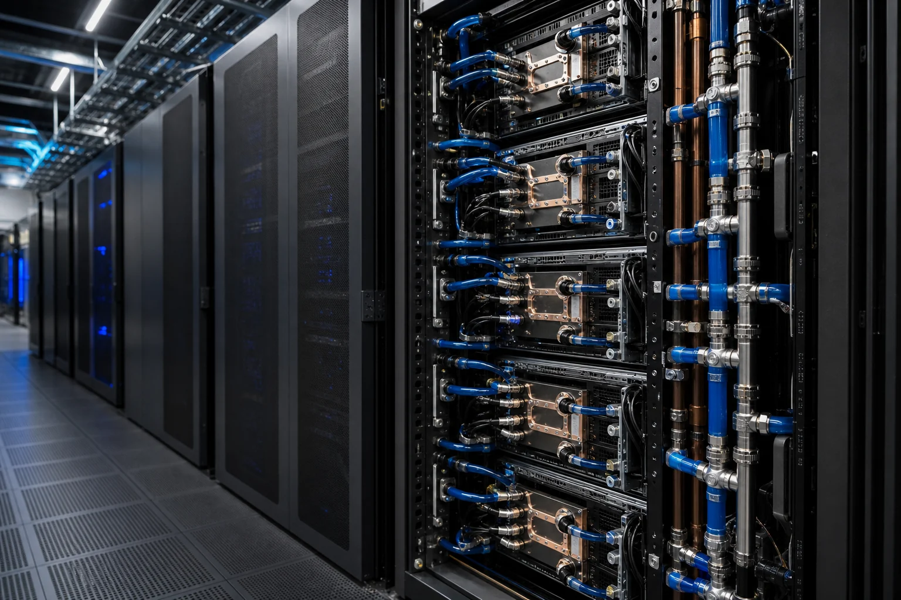
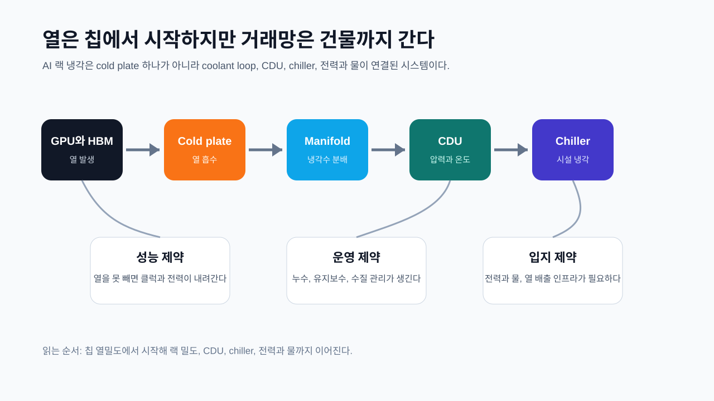
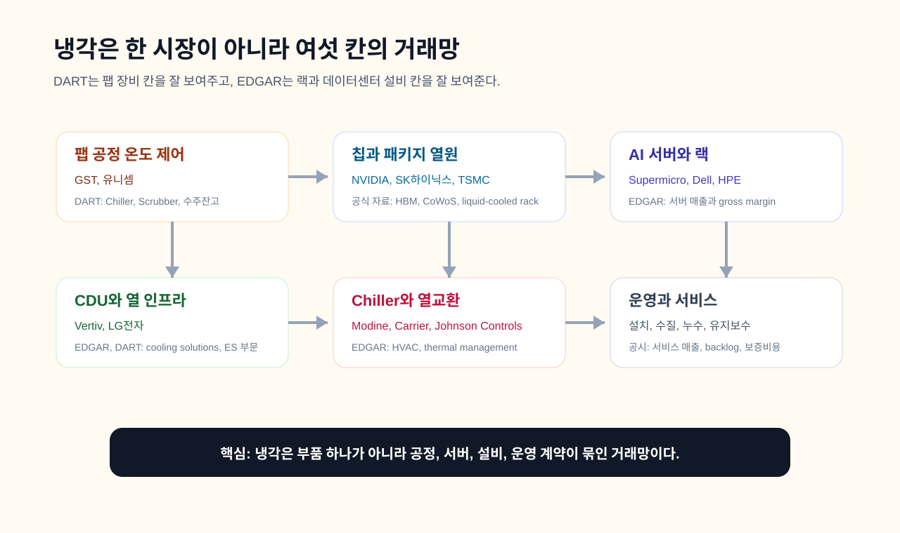
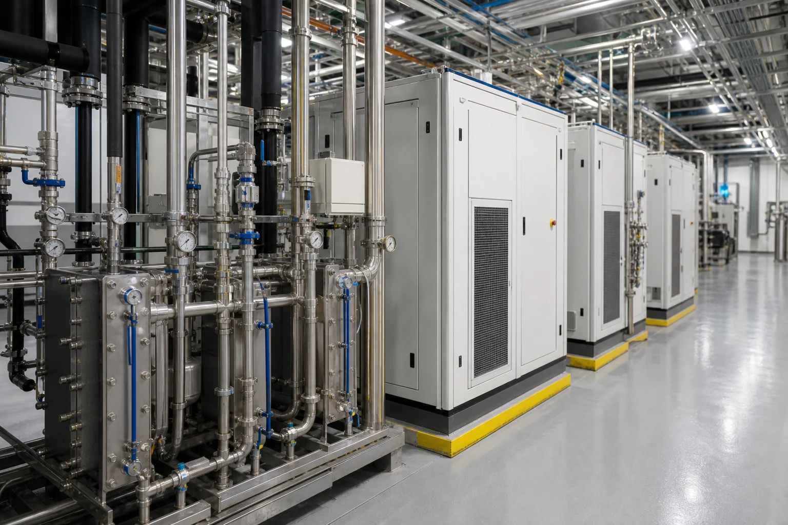
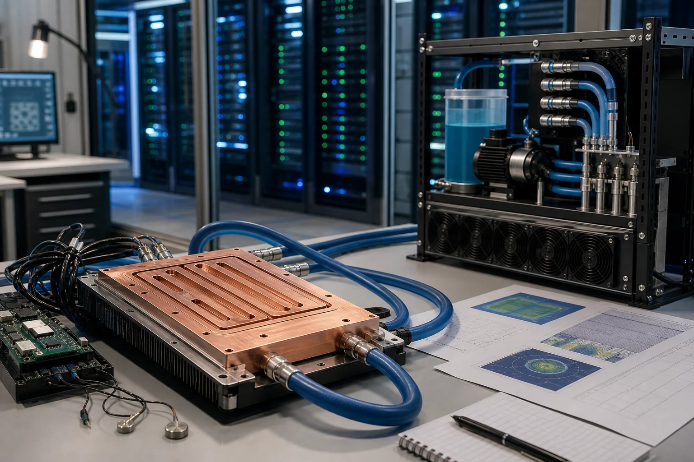
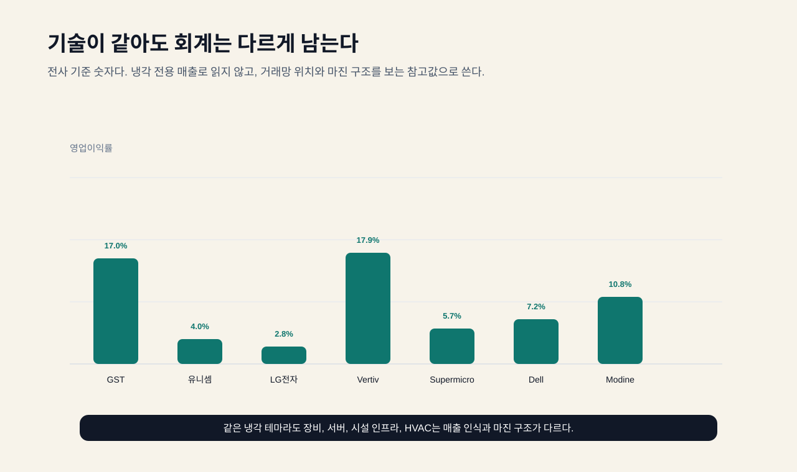
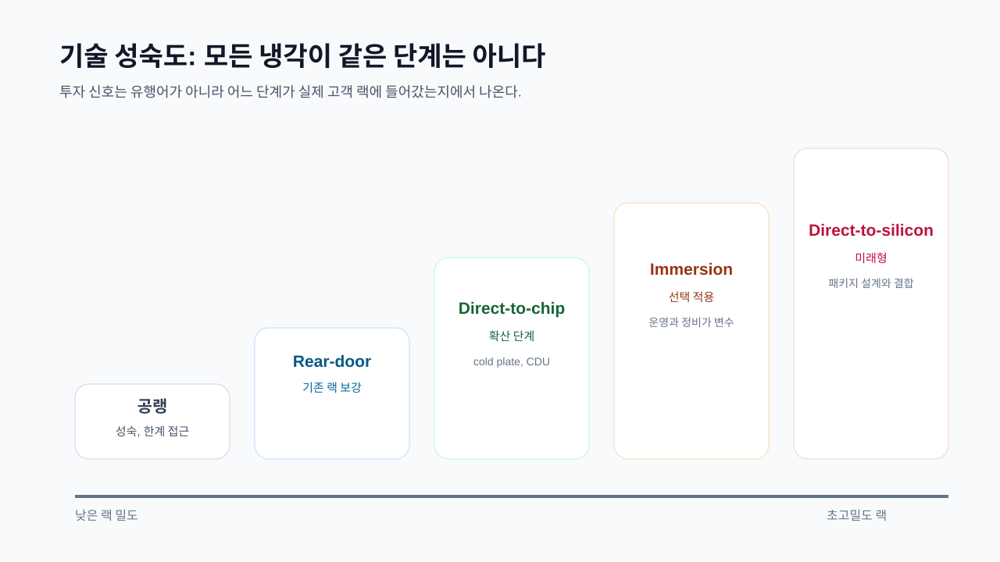

AI 반도체가 빨라질수록 이상한 일이 생긴다. 더 좋은 칩을 만들었는데, 그 칩을 마음껏 못 쓴다. 전기를 넣으면 계산은 빨라지지만 열도 같이 난다. 열을 빨리 빼지 못하면 칩은 스스로 속도를 낮춘다. 사람으로 치면 심장이 강해졌는데 땀을 못 빼서 오래 뛰지 못하는 상태다.

그래서 반도체 냉각은 이제 서버실 에어컨 이야기가 아니다. GPU와 HBM이 한 패키지 안에서 붙고, 랙 하나에 수십 개의 가속기가 들어가고, 데이터센터가 더 높은 전력 밀도로 설계되면 냉각은 칩 성능의 일부가 된다. 계산 성능은 실리콘이 만들지만, 그 성능을 계속 쓰게 해 주는 것은 열이 빠져나가는 길이다.

[HBM은 왜 쌓을까](/blog/hbm-stack-packaging-test)에서 봤듯이 AI 칩은 메모리를 옆으로 늘리는 대신 위로 쌓고, GPU 가까이에 붙인다. 데이터 길이는 짧아지지만 열은 더 어려워진다. HBM 스택, GPU 다이, 인터포저, 기판, 전원부가 좁은 공간에 모인다. 칩 안의 문제처럼 보이지만 실제 거래망은 더 넓다. 패키지에서 서버 보드로, 서버 보드에서 랙으로, 랙에서 CDU(Coolant Distribution Unit, 냉각액 분배 장치)로, CDU에서 칠러와 냉각탑, 전력과 물로 넘어간다.



이 글의 관통선은 하나다. **반도체 냉각은 부품 하나가 아니라 열이 이동하는 거래망이다.** 초보자는 열이 왜 병목인지 이해하면 되고, 깊게 볼 사람은 어느 회사가 어느 공정 칸에 있는지 보면 된다. 냉각을 수혜주 목록으로 보면 금방 얕아진다. 냉각을 열의 이동 경로로 보면 칩, 패키지, 서버, CDU, 칠러, 전력, 물, 유지보수 계약이 한 줄로 이어진다.

## 1. 열은 어디서 생기고 어디로 도망가나

칩은 전기를 먹고 계산한다. 전기는 완전히 계산으로만 바뀌지 않는다. 일부는 열이 된다. 같은 면적 안에 더 많은 트랜지스터를 넣고, 더 높은 전력으로 돌리고, HBM을 가까이 붙이면 열은 더 좁은 곳에서 더 많이 생긴다. 이걸 열밀도라고 생각하면 쉽다. 같은 방 안에 사람이 세 명 있을 때와 삼백 명 있을 때를 비교하면 된다. 방의 온도는 사람 수뿐 아니라 환기 능력으로 결정된다.

과거에는 공랭이 충분했다. 차가운 공기를 앞에서 넣고, 뜨거운 공기를 뒤로 빼면 됐다. 랙 전력 밀도가 낮을 때는 이 방식이 단순하고 싸고 익숙했다. 그러나 AI 서버는 랙 하나에 들어가는 전력이 커진다. 공기는 열을 운반하는 능력이 물보다 약하다. 더 많은 팬을 돌리면 팬 전력과 소음, 공간 문제가 생긴다. 결국 열을 더 가까운 곳에서 더 잘 잡아야 한다.

그래서 direct-to-chip liquid cooling이 나온다. GPU나 CPU 위에 cold plate(차가운 금속판과 냉각수 통로가 있는 부품)를 붙이고, 그 안으로 냉각수를 흘려 열을 가져간다. 여러 서버의 냉각수는 manifold(분배 배관)로 모이고, 랙 근처의 CDU가 온도와 압력, 유량을 조절한다. 그 다음 시설수와 열교환하고, 건물의 chiller나 냉각탑이 열을 밖으로 버린다.

NVIDIA는 [GB200 NVL72](https://www.nvidia.com/en-us/data-center/gb200-nvl72/)를 랙 스케일 시스템으로 설명하고, OCP 공개 자료에서도 GB200 NVL72 관련 [liquid-cooled design](https://developer.nvidia.com/blog/nvidia-contributes-nvidia-gb200-nvl72-designs-to-open-compute-project/)을 다룬다. 이 문장이 중요한 이유는 냉각이 옵션 액세서리가 아니라 AI 랙 설계 안으로 들어왔음을 보여주기 때문이다. GPU가 빠를수록 냉각은 더 뒤가 아니라 더 앞에 온다.



여기서 이미 거래망이 보인다. 칩 설계사는 열을 줄이려 한다. 패키징 회사는 열을 빼기 쉬운 구조를 고민한다. 서버 회사는 cold plate와 호스, quick disconnect, leak detection을 랙 안에 넣는다. Vertiv, LG전자, Schneider Electric 같은 인프라 회사는 CDU와 칠러, 열교환 설비를 판다. Modine, Carrier, Johnson Controls 같은 열관리와 HVAC 회사는 건물 쪽 열을 맡는다. 전력 회사와 물 인프라도 뒤에 붙는다.

이 거래망은 [SK하이닉스 기업이야기](/blog/000660-skhynix)나 [삼성전자 랠리 조건](/blog/005930-samsung-rally)을 읽을 때도 배경이 된다. HBM과 AI GPU 수요가 좋아도 열을 빼는 랙과 데이터센터 설비가 따라오지 못하면 실제 출하와 가동률이 제한된다. 칩 회사의 수요 서사는 냉각 인프라의 실행 능력과 분리되지 않는다.

## 2. 냉각은 두 개다: 팹 안과 데이터센터 안

반도체 냉각이라는 말은 너무 크다. 최소한 두 개로 나눠야 한다.

첫 번째는 **팹 공정용 냉각**이다. 반도체 장비 안의 챔버, 웨이퍼 홀더, 공정 가스, 플라즈마 환경은 온도에 민감하다. 여기서 chiller는 공정 온도를 일정하게 유지한다. 온도가 흔들리면 증착, 식각, 노광 보조 공정, 세정 같은 단계에서 균일도가 흔들릴 수 있다. 이 세계의 고객은 반도체 제조사와 장비사다. DART에서 GST와 유니셈이 잘 잡힌다.

두 번째는 **AI 데이터센터 액체냉각**이다. 여기서 냉각은 칩을 만드는 공정이 아니라, 완성된 GPU 서버를 운용하는 방식이다. 데이터센터 고객은 클라우드, AI 인프라 사업자, 서버 OEM, 하이퍼스케일러다. direct-to-chip, cold plate, CDU, facility water, chiller, cooling tower, maintenance가 핵심 단어다. EDGAR에서는 Vertiv, Supermicro, Dell, HPE, Modine 같은 회사가 들어온다.

두 시장은 모두 열을 다루지만 돈이 흐르는 방식이 다르다. 팹 칠러는 반도체 장비 CAPEX와 공정 안정성에 묶인다. 데이터센터 액체냉각은 AI 서버 CAPEX, 랙 밀도, 전력과 물, 설치와 유지보수 계약에 묶인다. GST의 Chiller 매출과 Vertiv의 liquid cooling 인프라 매출을 같은 냉각 시장으로 한 줄에 놓으면 오독이 생긴다.

이 구분은 [모래가 반도체가 되기까지](/blog/sand-to-semiconductor)와도 연결된다. 반도체는 웨이퍼 제조, 공정 장비, 후공정 패키징, 완제품 서버, 데이터센터 운영까지 이어지는 긴 사슬이다. 팹 칠러는 앞쪽 공정의 안정성을 돕고, 데이터센터 냉각은 완성된 칩이 실제로 계산을 계속하게 한다. 같은 열 문제지만 위치가 다르다.

## 3. 공정 지도: 대표 회사와 공시 근거

거래망을 공정 지도로 나누면 회사가 달라진다. 칩과 패키지 열원은 NVIDIA, AMD, TSMC, SK하이닉스, 삼성전자, Micron이 만든다. 서버와 랙은 Supermicro, Dell, HPE, Quanta, Foxconn 같은 회사가 설계한다. CDU와 열 인프라는 Vertiv, LG전자, Schneider Electric, nVent가 들어온다. Chiller와 HVAC는 LG전자, Modine, Carrier, Johnson Controls가 들어온다. 팹 공정용 칠러는 GST와 유니셈이 들어온다.



| 공정/층위 | 기술 역할 | 대표 회사 | 공시 근거 | 왜 이 회사가 핵심인가 |
|---|---|---|---|---|
| 팹 공정 온도 제어 | 챔버와 웨이퍼 홀더 온도를 안정화한다 | GST, 유니셈 | DART 2026Q1 사업의 내용 | 온도 안정성은 공정 균일도와 장비 가동률에 연결되며, 고객 주문형 장비로 매출이 잡힌다 |
| 칩과 패키지 열원 | GPU, HBM, 인터포저가 좁은 공간에 열을 만든다 | NVIDIA, SK하이닉스, TSMC, 삼성전자 | DART, EDGAR, 회사 공식 기술 자료 | 열밀도가 높아질수록 패키지 설계와 냉각 방식이 성능 사용 시간을 정한다 |
| AI 서버와 랙 | cold plate, manifold, quick disconnect를 랙 안에 통합한다 | Supermicro, Dell, HPE | EDGAR, 각사 liquid cooling 자료 | 서버 회사는 GPU를 조립하는 회사를 넘어 냉각 가능한 랙 시스템을 팔아야 한다 |
| CDU와 열 인프라 | 냉각수 유량, 압력, 온도를 관리한다 | Vertiv, LG전자, Schneider Electric | EDGAR, DART, 공식 솔루션 자료 | CDU는 칩 냉각과 건물 시설 냉각을 연결하는 중간 관문이다 |
| Chiller와 열교환 | 시설수의 열을 외부로 배출한다 | LG전자, Modine, Carrier, Johnson Controls | DART, EDGAR | 고밀도 AI 랙은 건물 냉각 용량과 전력, 물 제약을 함께 키운다 |
| 운영과 서비스 | 누수, 수질, 유지보수, 설치를 관리한다 | Vertiv, Dell, HPE, Schneider Electric | EDGAR 서비스와 backlog 공시 | 냉각은 설치 후에도 운영 리스크가 남아 서비스 계약과 보증 비용이 중요하다 |

이 표는 수혜주 목록이 아니다. 공정 지도다. 같은 냉각이라도 어느 칸에 있는지에 따라 매출 인식과 마진이 달라진다. 서버 회사는 매출이 크지만 마진이 낮을 수 있다. 장비와 부품 회사는 매출은 작아도 특정 병목에서 마진이 높을 수 있다. 인프라 회사는 장비 판매와 서비스 계약이 섞인다. HVAC 회사는 데이터센터만이 아니라 빌딩, 산업, 운송, 서비스 매출이 함께 들어 있다.

그래서 "왜 이 회사가 핵심인가"를 늘 물어야 한다. GST가 핵심인 이유는 AI 랙이 아니라 팹 공정 온도 제어다. Vertiv가 핵심인 이유는 GPU를 만드는 것이 아니라 랙과 시설 사이의 열 인프라를 판다는 점이다. Supermicro가 핵심인 이유는 서버를 조립하는 데서 끝나지 않고 고밀도 액체냉각 랙 통합 능력이 필요해졌기 때문이다. LG전자가 흥미로운 이유는 DART에서 ES 부문이 AI 데이터센터용 칠러와 CDU를 직접 언급하기 때문이다.

## 4. DART가 먼저 보여주는 팹 칠러

GST의 2026년 1분기 DART 사업의 개요는 명확하다. 회사는 반도체와 디스플레이 제조공정에서 사용 후 배출되는 유해가스를 정화하는 Scrubber와, 공정상 안정적인 온도 유지를 제공하는 Chiller 제조를 주요 사업으로 영위한다고 설명한다. Scrubber는 냉각 장비가 아니다. 유해가스 정화 장비다. 하지만 팹 subfab에서는 Scrubber와 Chiller가 함께 공정 설비의 후방 인프라를 구성한다.

GST의 2026년 1분기 제품 매출 비중은 Scrubber 69.0%, Chiller 12.8%, 용역 16.3%다. 같은 공시에서 2026년 1분기 누적 생산은 Scrubber 563대, Chiller 310대, 총 873대로 전년 동기 대비 총 생산량이 약 20% 상승했다고 설명한다. 또 초저온칠러, 전기식칠러, CO2칠러, 액침냉각 솔루션 개발을 언급한다. 이 문장은 팹 칠러에서 데이터센터 냉각으로 이어질 수 있는 기술 확장 가능성을 보여주지만, 아직 매출로 얼마가 잡혔는지는 따로 확인해야 한다.

유니셈도 비슷하지만 매출 구성이 다르다. 2026년 1분기 DART에서 유니셈은 반도체와 디스플레이 제조 공정에서 발생하는 유해가스 정화장치 Scrubber, 반도체 Main 공정상 안정적인 온도 유지를 제공하는 Chiller를 주요 사업으로 설명한다. 제품 표에서 Gas Scrubber는 27.3%, Chiller Unit은 40.0%, 유지보수 외 기타는 30.9%다. 유니셈의 경우 Chiller 비중이 더 크게 보인다.



이 대목은 아주 쉽다. 팹은 요리보다 더 민감한 공장이다. 웨이퍼 위에 아주 얇은 막을 입히고, 깎고, 씻고, 다시 쌓는다. 그 과정에서 온도가 흔들리면 같은 레시피를 써도 결과가 달라질 수 있다. Chiller는 이 레시피의 온도 조건을 잡아 주는 장비다. 그래서 반도체 경기가 좋아지고 신규 라인이 들어서면 이런 장비도 같이 움직일 수 있다.

그러나 여기서 오해하면 안 된다. GST와 유니셈의 Chiller는 AI 데이터센터 direct-to-chip liquid cooling과 같은 제품이 아니다. 고객도 다르고, 설치 장소도 다르고, 검증 기준도 다르다. 팹 칠러는 반도체 제조 공정 장비에 붙고, 데이터센터 액체냉각은 완성된 AI 서버 랙에 붙는다. 같은 "냉각"이라는 단어로 묶을 수는 있지만, 투자 판단에서는 반드시 분리해야 한다.

LG전자는 또 다른 연결점이다. 2026년 1분기 DART에서 LG전자는 ES(Eco Solution) 부문을 에어컨과 HVAC, AI 데이터센터 냉각 솔루션으로 설명한다. 같은 공시에서 ES 부문은 칠러와 CDU 등 핵심부품을 중심으로 AI 데이터센터용 냉각 솔루션 사업을 확대 중이라고 적는다. 제품 표에서도 ES 부문 품목에 에어컨, HVAC, 데이터센터 냉각 솔루션이 들어간다. 이건 한국 DART 안에서 데이터센터 냉각이 직접적으로 보이는 사례다.

## 5. EDGAR가 보여주는 랙과 데이터센터 냉각

AI 데이터센터 냉각은 미국 공시와 글로벌 공식 자료를 같이 봐야 한다. 서버 랙과 시설 냉각의 중심 회사들이 미국 상장사에 많기 때문이다. Vertiv는 thermal management, power, infrastructure를 묶어 데이터센터 인프라를 판다. Supermicro는 AI 서버와 랙을 판다. Dell과 HPE는 엔터프라이즈와 AI 서버, 스토리지, 서비스까지 넓은 포트폴리오를 가진다. Modine은 data center cooling과 heat exchanger 쪽에서 주목받는다.

여기서 숫자는 늘 조심해야 한다. Vertiv의 전사 매출이 늘었다고 해서 그 전부가 AI liquid cooling은 아니다. Supermicro의 매출이 커졌다고 해서 그 전부가 액체냉각 서버는 아니다. Dell의 전사 매출은 PC, 서버, 스토리지, 서비스가 섞인다. Modine도 데이터센터만 있는 회사가 아니다. 하지만 전사 숫자는 그래도 거래망의 크기와 마진 구조를 보는 첫 표지판이 된다.

dartlab EDGAR 패널 기준 Vertiv의 2025년 매출은 102.3억 달러, 매출총이익률은 36.3%, 영업이익률은 17.9%였다. Supermicro의 2025년 매출은 219.7억 달러, 매출총이익률은 11.1%, 영업이익률은 5.7%였다. Dell은 FY2026 매출 1,135.4억 달러, 매출총이익률 20.0%, 영업이익률 7.2%였다. Modine은 FY2026 매출 31.8억 달러, 매출총이익률 23.0%, 영업이익률 10.8%였다.



Supermicro의 [liquid cooling 솔루션](https://www.supermicro.com/en/solutions/liquid-cooling), Dell의 [direct liquid cooling](https://www.dell.com/en-us/dt/solutions/data-center-solutions/direct-liquid-cooling.htm), Vertiv의 [liquid cooling 자료](https://www.vertiv.com/en-us/solutions/liquid-cooling/)는 모두 같은 방향을 가리킨다. 고밀도 AI 랙에서는 서버와 냉각을 따로 설계하기 어렵다. 호스 연결, leak detection, 서비스성, 랙 배치, 시설수 조건이 서버 판매와 같이 움직인다.

LG전자도 공식적으로 [데이터센터 냉각 솔루션](https://www.lg.com/global/business/hvac/data-center-solutions/)과 [AI 데이터센터용 칠러, CDU, cold plate](https://www.lg.com/global/newsroom/news/eco-solution/lg-electronics-showcases-ai-data-center-cooling-solutions-at-data-center-world-2026/)를 전면에 내세운다. 한국 기업 중에서는 데이터센터 냉각을 DART와 공식 사업 자료 양쪽에서 같이 확인할 수 있는 사례다.

## 6. 숫자로 착지하면 더 넓게 보인다

아래 표는 냉각 전용 매출표가 아니다. 회사 전체 손익이다. 이 단서를 먼저 걸어야 한다. 전사 매출과 마진은 냉각 거래망의 어느 칸이 어떤 회계 구조를 갖는지 보는 참고값이다. 팹 장비사는 제품 믹스와 수주에 따라 마진이 크게 달라질 수 있다. 서버 회사는 매출이 크지만 gross margin이 낮을 수 있다. 열 인프라 회사는 장비와 서비스가 섞이면서 서버 조립사와 다른 마진을 보일 수 있다.



| 회사 | 거래망 칸 | 기준 | 매출 | 매출총이익률 | 영업이익률 | 읽는 법 |
|---|---|---:|---:|---:|---:|---|
| GST | 팹 Scrubber, Chiller | DART 2025 | 3,471.6억 원 | 40.6% | 17.0% | 팹 장비 제품 믹스와 수주, Chiller와 Scrubber 비중을 같이 봐야 한다 |
| 유니셈 | 팹 Scrubber, Chiller | DART 2025 | 2,733.3억 원 | 10.5% | 4.0% | Chiller 비중은 크지만 매출총이익률과 비용 구조 확인이 필요하다 |
| LG전자 | ES와 데이터센터 냉각 포함 | DART 2025 | 89.2조 원 | 23.4% | 2.8% | 전사 기준이라 AI 데이터센터 냉각만 분리되지 않는다 |
| Vertiv | 데이터센터 열 인프라 | EDGAR 2025 | 102.3억 달러 | 36.3% | 17.9% | 전력과 thermal infrastructure의 복합 포트폴리오로 읽어야 한다 |
| Supermicro | AI 서버와 액체냉각 랙 | EDGAR 2025 | 219.7억 달러 | 11.1% | 5.7% | 서버 통합 사업은 매출 규모가 크지만 부품 조달과 가격 경쟁이 마진을 누른다 |
| Dell | 서버, 스토리지, PC, 서비스 | EDGAR FY2026 | 1,135.4억 달러 | 20.0% | 7.2% | direct liquid cooling은 포트폴리오 일부라 전사 숫자로만 단정하면 안 된다 |
| Modine | 데이터센터 열관리와 HVAC | EDGAR FY2026 | 31.8억 달러 | 23.0% | 10.8% | thermal management 전문성이 데이터센터 수요와 연결되는지 봐야 한다 |

이 표가 보여주는 것은 "누가 가장 좋다"가 아니다. 같은 냉각이라도 회계가 다르게 남는다는 점이다. GST는 팹 장비 수주와 제품 믹스가 중요하다. 유니셈은 Chiller 비중이 큰데도 전사 마진은 낮게 나왔으므로 원가 구조와 고객 믹스를 더 봐야 한다. Vertiv는 인프라 회사답게 상대적으로 높은 영업이익률을 보였다. Supermicro는 AI 서버 매출이 커도 서버 통합 사업의 낮은 gross margin이 드러난다.

이런 표는 [HD현대일렉트릭은 AI 전력난의 두 번째 주도주인가](/blog/267260-hd-hyundai-electric-ai-power)를 읽을 때도 유용하다. AI 인프라는 GPU만으로 끝나지 않는다. 전력 장비, 변압기, 스위치기어, 배전, 냉각, 물, 건물 시공이 같이 움직인다. 다만 모든 인프라 회사가 같은 가격결정력을 갖지는 않는다. 병목의 깊이와 대체 가능성이 마진을 가른다.

## 7. 기술 성숙도와 오해

냉각 기술은 단계가 다르다. 공랭은 가장 익숙하고 성숙했다. 다만 고밀도 AI 랙에서는 한계가 보인다. rear-door heat exchanger는 기존 랙 뒤에 열교환 장치를 붙여 보강하는 방식이다. direct-to-chip은 cold plate를 칩 위에 붙이고 냉각수를 흘려 열을 직접 가져간다. 현재 AI 서버 고밀도화에서 가장 중요한 확산 단계다. immersion cooling은 서버를 절연 냉각액에 담그는 방식인데, 유지보수와 소재 호환, 운영 표준화 문제가 있어 모든 데이터센터의 즉시 표준으로 보긴 어렵다.



첫 번째 오해는 "액체냉각이면 다 같다"는 것이다. 물이 흐른다고 다 같은 시스템이 아니다. cold plate 안을 흐르는 1차 냉각수, CDU의 열교환, 시설수, chiller, 냉각탑, 수질 관리, 누수 센서가 모두 다르다. 어느 부품을 누가 설계하고 누가 유지보수하는지에 따라 거래망이 갈린다.

두 번째 오해는 "PUE가 좋아지면 끝"이라는 것이다. PUE(Power Usage Effectiveness, 데이터센터 전체 전력 사용 효율)는 중요하지만 충분하지 않다. 물 사용량, 지역 수자원, 열 배출, 냉각수 관리, 부식, 누수, 다운타임 리스크가 남는다. 액체냉각은 전력 효율을 돕지만 운영 복잡도를 함께 가져온다. 좋은 냉각 회사는 장비만 파는 회사가 아니라 운영 리스크를 낮추는 회사다.

세 번째 오해는 "팹 칠러와 AI 랙 냉각을 같은 매출로 보면 된다"는 것이다. 아니다. GST와 유니셈의 Chiller는 공정 장비 쪽이다. LG전자와 Vertiv의 CDU와 chiller는 데이터센터 시설 쪽이다. 이름은 모두 냉각이지만 고객, 인증, 교체 주기, 서비스 계약, 가격결정력이 다르다. DART와 EDGAR를 연결하려면 이 차이를 먼저 나눠야 한다.

네 번째 오해는 "냉각이 뜨면 냉각 회사만 본다"는 것이다. 냉각 병목은 칩 설계, 패키징, 서버 랙, 시설 설계가 같이 바뀌는 문제다. NVIDIA나 AMD가 랙 설계를 어떻게 열어 주는지, Supermicro와 Dell이 어떤 냉각 옵션을 통합하는지, Vertiv와 LG전자가 어떤 CDU와 chiller를 제공하는지 같이 봐야 한다. 냉각은 단독 테마가 아니라 AI 인프라의 한 축이다.

## 8. 다음 공시에서 봐야 할 것

첫째, DART에서는 제품 비중을 본다. GST는 Scrubber와 Chiller 비중을 분리해 공시한다. 유니셈도 Gas Scrubber와 Chiller Unit을 분리한다. LG전자는 ES 부문에서 AI 데이터센터 냉각 솔루션을 언급한다. 다음 분기에는 이 표현이 더 구체적인 매출, 수주, 생산능력, 연구개발비로 내려오는지 봐야 한다.

둘째, EDGAR에서는 backlog, gross margin, operating margin, service mix를 본다. Vertiv가 liquid cooling을 말해도 전사 숫자에서 실제 가격결정력이 보이는지는 마진과 수주잔고, 현금흐름으로 검산해야 한다. Supermicro는 매출 성장과 gross margin을 같이 봐야 한다. 서버 통합사는 매출이 빨리 커져도 부품 조달과 가격 경쟁으로 마진이 눌릴 수 있다.

셋째, 데이터센터 입지를 본다. 액체냉각은 칩 성능을 도와도 물과 전력 제약을 없애지 않는다. 고밀도 랙은 전력 인입, 변압기, 냉각수 루프, 열 배출 설비, 건물 구조가 같이 필요하다. 그래서 냉각 이야기는 전력 장비와도 연결된다. AI 데이터센터에서 전력과 냉각은 따로 움직이지 않는다.

이 지점이 냉각 서사의 깊은 부분이다. 냉각은 전기를 줄이는 기술처럼 보이지만 실제로는 전력과 물을 새 방식으로 배치하는 기술이다. direct-to-chip은 칩 가까이에서 열을 잘 잡지만, 그 열이 사라지는 것은 아니다. 열은 물로 옮겨지고, 다시 열교환기로 옮겨지고, 결국 건물 밖으로 나간다. 그러면 지역 전력망, 물 사용량, 폐열 활용, 소음, 배관 시공, 유지보수 인력까지 따라온다. AI 데이터센터 입지 경쟁은 그래서 땅값이나 전기요금만의 문제가 아니라, 열을 버릴 수 있는 도시 인프라의 문제다.

넷째, 서비스와 유지보수를 본다. 액체냉각은 설치 후에도 끝나지 않는다. 누수, 수질, 압력, 펌프, 열교환기, quick disconnect, 보증 비용이 남는다. 장비 판매만큼 서비스 계약이 중요해질 수 있다. 이 부분은 전사 매출보다 주석과 사업 설명에서 더 잘 보일 때가 많다.

다섯째, 기술 성숙도를 본다. direct-to-chip이 확산되는 것과 immersion이 전면 표준이 되는 것은 다른 사건이다. 팹 칠러 기술이 데이터센터 CDU 매출로 바로 바뀌는 것도 아니다. 좋은 기술 글은 유행어를 하나로 묶지 않는다. 어디까지 양산이고, 어디부터 파일럿이며, 어떤 고객이 실제로 설치했는지 나눈다.

## 검증표

아래 코드는 본문 숫자를 dartlab에서 재현하는 방법이다. 한국 기업은 DART 패널, 미국 기업은 EDGAR 기반 패널로 불러온다. 단위는 한국 기업은 억 원, 미국 기업은 십억 달러로 환산했다.

```python
from dartlab import Company

for code in ["083450", "036200", "066570"]:
    c = Company(code)
    print(c.corpName, c.stockCode)
    print(c.panel("1. 사업의 개요"))
    print(c.panel("2. 주요 제품 및 서비스"))
    print(c.panel("4. 매출 및 수주상황"))
```

```python
from dartlab import Company

codes = ["083450", "036200", "066570", "VRT", "SMCI", "DELL", "MOD"]
for code in codes:
    c = Company(code)
    is_y = c.panel("IS", freq="Y")
    print(code, is_y.select(["snakeId", "항목", *is_y.columns[2:6]]))
```

```python
from dartlab import Company

period = {
    "083450": "2025",
    "036200": "2025",
    "066570": "2025",
    "VRT": "2025",
    "SMCI": "2025",
    "DELL": "2026",
    "MOD": "2026",
}

def value(df, key, p):
    row = df.filter(df["snakeId"] == key)
    if row.height == 0 or p not in df.columns:
        return None
    raw = row[p][0]
    return None if raw is None else float(raw)

for code, p in period.items():
    c = Company(code)
    df = c.panel("IS", freq="Y")
    sales = value(df, "sales", p) or value(df, "revenue", p)
    gp = value(df, "gross_profit", p) or value(df, "gross_profit_on_sales", p)
    op = value(df, "operating_profit", p) or value(df, "operating_income_loss", p)
    print(code, p, "gross_margin", gp / sales * 100 if sales and gp else None, "opm", op / sales * 100 if sales and op else None)
```

## 공시와 공식 자료

- [NVIDIA GB200 NVL72](https://www.nvidia.com/en-us/data-center/gb200-nvl72/)
- [NVIDIA, GB200 NVL72 design contribution to OCP](https://developer.nvidia.com/blog/nvidia-contributes-nvidia-gb200-nvl72-designs-to-open-compute-project/)
- [LG전자 데이터센터 냉각 솔루션](https://www.lg.com/global/business/hvac/data-center-solutions/)
- [LG전자 AI 데이터센터 냉각 솔루션 공개 자료](https://www.lg.com/global/newsroom/news/eco-solution/lg-electronics-showcases-ai-data-center-cooling-solutions-at-data-center-world-2026/)
- [Supermicro liquid cooling solutions](https://www.supermicro.com/en/solutions/liquid-cooling)
- [Vertiv liquid cooling solutions](https://www.vertiv.com/en-us/solutions/liquid-cooling/)
- [Dell direct liquid cooling](https://www.dell.com/en-us/dt/solutions/data-center-solutions/direct-liquid-cooling.htm)
- [OpenDART 공시정보 활용 안내](https://opendart.fss.or.kr/)
- [SEC EDGAR Search](https://www.sec.gov/edgar/search/)

## 마지막 렌즈

반도체 냉각의 핵심은 "더 시원하게 만든다"가 아니다. 핵심은 **열이 칩에서 건물 밖으로 나가는 길이 새 거래망이 됐다는 것**이다. GPU와 HBM이 더 가까워질수록 열은 더 좁은 곳에서 생기고, 랙 밀도가 올라갈수록 열은 더 큰 설비 문제로 커진다. 그래서 냉각을 보려면 칩 회사만도, 에어컨 회사만도 볼 수 없다.

초보자는 이렇게 기억하면 된다. AI 칩은 머리가 좋아진 만큼 몸에 열이 난다. 그 열을 빼는 길이 막히면 머리를 마음껏 쓰지 못한다. 깊게 볼 사람은 그 길을 따라가면 된다. GPU와 HBM, cold plate, manifold, CDU, chiller, 전력, 물, 유지보수. 이 길이 바로 거래망이다.

다음 공시에서 봐야 할 것은 냉각이라는 단어가 몇 번 나왔는지가 아니다. 제품 비중이 바뀌었는지, gross margin이 지켜졌는지, backlog가 늘었는지, 서비스와 유지보수가 붙었는지, 전력과 물 제약을 고객이 실제로 해결하고 있는지다. 냉각은 테마가 아니라 운영 능력이다. 그리고 AI 인프라에서는 운영 능력이 곧 반도체 성능을 현실에서 쓰게 만드는 마지막 공정이 된다.
