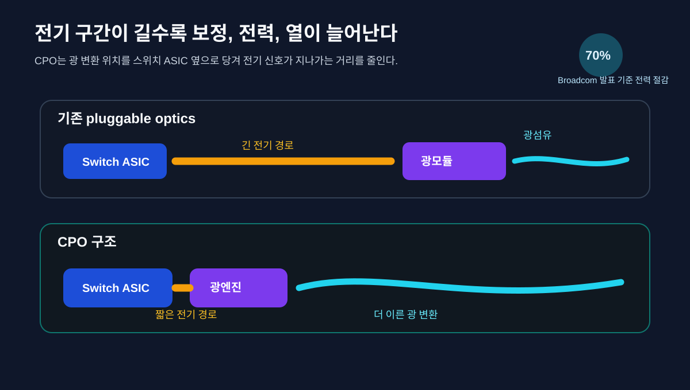
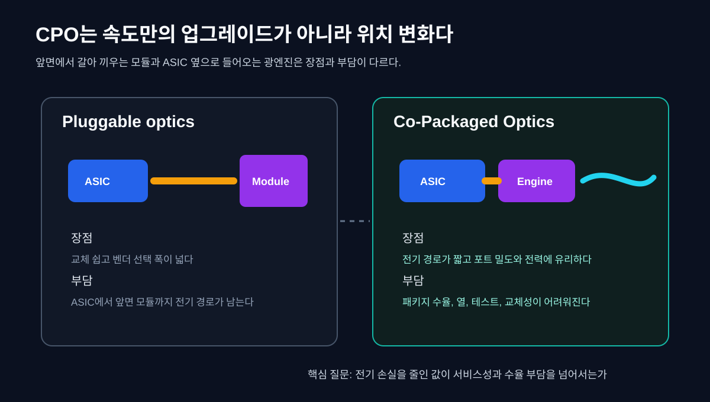
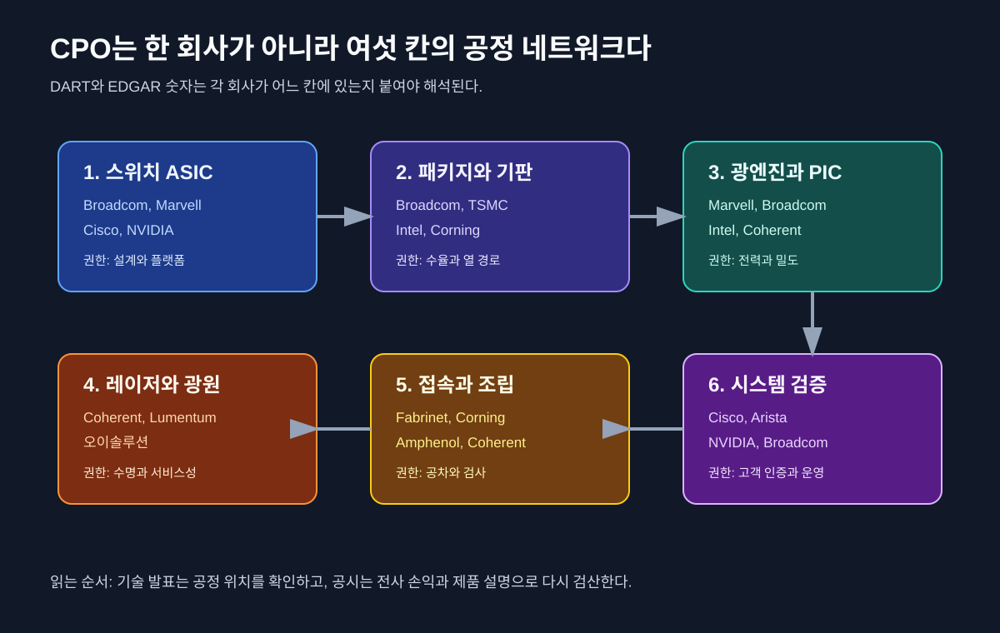
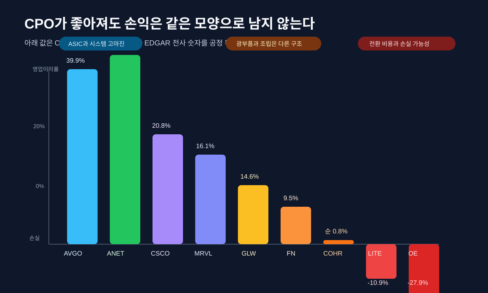
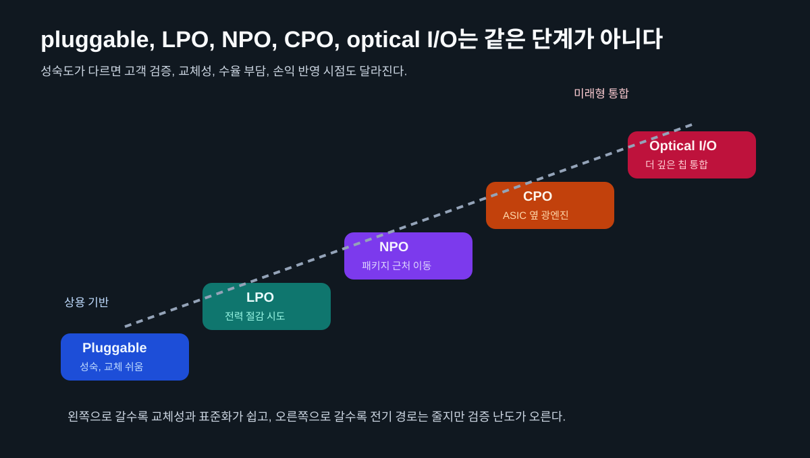

AI 서버를 많이 붙이면 계산은 빨라진다. 그런데 계산기가 늘어날수록 더 자주 막히는 길이 있다. GPU가 HBM을 읽고, 옆 랙의 GPU와 값을 주고받고, 다시 스위치를 지나 다른 서버로 넘어가는 길이다. 칩 안의 연산은 점점 빨라지는데, 칩 밖으로 나가는 전기 신호는 길이 길어질수록 전력을 먹고 열을 만든다.

[HBM은 왜 쌓을까](/blog/hbm-stack-packaging-test)에서 본 병목은 메모리 대역폭이었다. HBM은 메모리를 GPU 가까이에 붙여 데이터가 움직이는 거리를 줄인다. [AI 칩의 다음 병목은 열이다](/blog/semiconductor-cooling-network)에서 본 병목은 열이었다. 냉각은 GPU가 낸 열을 랙과 시설 밖으로 옮긴다. 이번 글의 병목은 그 사이에 있다. AI 클러스터 안에서 칩과 칩, 보드와 보드, 랙과 랙을 잇는 데이터 길이다.

여기서 CPO(Co-Packaged Optics, 공동 패키지 광학)와 실리콘 포토닉스가 등장한다. CPO는 광모듈을 스위치 앞단에 꽂는 방식에서 한 걸음 더 들어가, 광엔진을 스위치 ASIC 바로 옆 패키지로 끌어오는 구조다. 실리콘 포토닉스는 빛을 실리콘 기반 칩 위에서 나누고, 변조하고, 검출하게 해 주는 기술 묶음이다. 둘은 같은 말이 아니다. 실리콘 포토닉스는 플러그형 광모듈에도 쓰이고, CPO는 광엔진의 위치를 바꾸는 패키징 구조다.


이 글의 관통선은 하나다. **CPO는 빛을 더 멋있게 쓰는 기술이 아니라, 전기 신호가 멀리 가며 잃는 전력과 열을 줄이기 위해 광엔진을 칩 옆으로 당기는 공정 변화다.** 그래서 수혜주 목록으로 보면 금방 얕아진다. 공정 지도로 보면 스위치 ASIC, 패키지 기판, 실리콘 포토닉스 PIC, 외부 레이저, 광섬유 조립, 테스트, 네트워크 시스템 회사가 서로 다른 칸에 놓인다.

## 1. 전기 배선은 왜 멀리 가기 어렵나

칩 안의 트랜지스터는 작아졌다. HBM은 GPU 옆에 붙었다. 패키징은 더 촘촘해졌다. 그런데 서버 안팎의 데이터 이동은 여전히 전기 신호에 크게 의존한다. 전기 신호는 구리 배선과 보드, 커넥터, 케이블을 지나간다. 속도가 올라가고 거리가 길어질수록 신호 무결성 문제가 커진다. 손실을 보정하려고 equalizer, retimer, DSP가 들어가면 전력과 지연 시간이 늘어난다.

초보자는 이렇게 이해하면 된다. 말소리가 가까운 방 안에서는 잘 들리지만 긴 복도 끝까지 가면 작아지고 섞인다. 더 크게 말하거나 중간에 증폭기를 놓으면 들리지만 에너지가 더 든다. AI 네트워크의 전기 신호도 비슷하다. 800G, 1.6T, 그 다음 속도로 올라갈수록 전기 신호를 멀리 보내는 비용이 커진다.

기존 데이터센터는 스위치 앞면에 pluggable optical transceiver를 꽂았다. 스위치 ASIC에서 전기 신호가 보드 위를 지나 앞면 광모듈까지 가고, 그 안에서 빛으로 바뀌어 광섬유를 탄다. 이 방식은 교체와 유지보수가 쉽다. 고장 난 모듈을 빼고 새 모듈을 꽂으면 된다. 다만 ASIC에서 광모듈까지 가는 전기 구간은 남아 있다.

CPO는 이 전기 구간을 줄인다. 광엔진을 ASIC 옆으로 끌어와서 전기 신호가 가야 하는 거리를 짧게 만들고, 더 빨리 빛으로 바꾼다. Broadcom은 2025년 [Tomahawk 6 Davisson CPO 발표](https://investors.broadcom.com/news-releases/news-release-details/broadcom-announces-tomahawkr-6-davisson-industrys-first-1024)에서 102.4Tbps Ethernet switch와 optical interconnect 전력 70% 절감을 제시했다. 이 수치는 회사 발표 기준이다. 중요한 것은 절감률 하나보다 방향이다. 전기 경로가 길어질수록 광엔진은 ASIC 가까이 이동한다.



여기서 투자자가 먼저 걸어야 할 단서는 간단하다. CPO는 광모듈 회사만의 이야기가 아니다. 스위치 ASIC 회사가 패키지 구조를 바꾸고, 광부품 회사가 더 가까운 광엔진을 만들고, 패키징과 테스트 회사가 새로운 조립과 검증을 맡고, 시스템 회사가 서비스성을 다시 설계해야 한다. 같은 AI 네트워크라도 돈이 남는 위치는 다르다.

## 2. CPO는 광모듈의 위치를 바꾼다

플러그형 광모듈은 데이터센터가 좋아하는 부품이었다. 표준화가 잘 돼 있고, 교체가 쉽고, 여러 벤더를 쓸 수 있다. 스위치 앞면의 포트 밀도도 설계하기 쉽다. 그러나 속도가 올라가면 앞면 모듈까지 가는 전기 배선의 길이가 부담이 된다. 포트가 많아질수록 앞면 공간도 빡빡해진다.

CPO는 이 구조를 바꾼다. 광엔진이 ASIC 패키지 가까이 들어오면 신호 경로는 짧아진다. 대신 유지보수와 열, 수율, 조립 난도가 올라간다. 기존 플러그형 모듈처럼 앞에서 뽑아 바꾸기 어렵다. 패키지 안에 광엔진이 들어가면 ASIC과 광부품의 수명, 테스트, 열관리, 수율이 한 묶음으로 묶인다. 좋은 기술이지만 쉬운 기술은 아니다.

Broadcom은 2025년 [3세대 CPO 발표](https://investors.broadcom.com/news-releases/news-release-details/broadcom-announces-third-generation-co-packaged-optics-cpo)에서 200G/lane 기반, 100G/lane 볼륨 생산, 생태계 협력을 강조했다. Marvell은 [1.6T silicon photonics light engine](https://www.marvell.com/company/newsroom/marvell-demonstrates-silicon-photonics-light-engine-for-low-power-rack-scale-interconnect-in-ai-networks.html)에서 200Gbps/lane, LPO와 CPO 기반, 레이저 전력을 포함한 5pJ/bit 미만을 제시했다. 역시 회사 발표 기준이다. 다만 두 발표가 가리키는 방향은 같다. 네트워크 ASIC의 주변 광 I/O는 더 촘촘하고, 더 낮은 전력으로, 더 가까운 위치로 이동한다.



이 변화는 [모래가 반도체가 되기까지](/blog/sand-to-semiconductor)에서 본 반도체 공정 지도와도 닮았다. 기술이 한 단계 더 성숙하면 부품 하나가 아니라 공정 칸이 바뀐다. CPO는 광트랜시버가 더 빨라지는 사건이 아니라, 전기와 광의 경계선이 스위치 패키지 안쪽으로 이동하는 사건이다.

## 3. 공정 지도로 보면 회사가 달라진다

CPO와 실리콘 포토닉스를 회사 목록으로 보면 Broadcom, Marvell, Cisco, NVIDIA, Intel, Coherent, Lumentum, Corning, Fabrinet, 오이솔루션 같은 이름이 한 줄에 섞인다. 하지만 같은 줄에 놓으면 오독이 생긴다. 어떤 회사는 ASIC을 판다. 어떤 회사는 광엔진을 판다. 어떤 회사는 레이저와 광부품을 판다. 어떤 회사는 조립과 테스트를 한다. 어떤 회사는 완성 스위치와 네트워크 운영을 판다.



| 공정/층위 | 기술 역할 | 대표 회사 | 공시 근거 | 왜 이 회사가 핵심인가 |
|---|---|---|---|---|
| 스위치 ASIC과 플랫폼 | 51.2Tbps, 102.4Tbps급 스위치 칩과 CPO 패키지를 설계한다 | Broadcom, Marvell, Cisco, NVIDIA | EDGAR, 각사 CPO와 silicon photonics 발표 | 전기와 광의 경계가 ASIC 주변으로 이동할 때 설계 권한을 쥔다 |
| 패키지와 기판 | ASIC, 광엔진, 전원, 열 경로를 한 패키지 안에서 맞춘다 | Broadcom, TSMC, Intel, Corning | EDGAR, 공식 기술 자료 | CPO는 광부품만이 아니라 패키지 수율과 열 설계 문제다 |
| 실리콘 포토닉스 PIC와 광엔진 | 전기 신호를 빛으로 바꾸고, 빛을 나누고, 변조하고, 검출한다 | Marvell, Broadcom, Intel, Coherent | EDGAR, 회사 발표 | 광 I/O의 전력, 밀도, 수율을 좌우한다 |
| 레이저와 외부 광원 | 광엔진에 필요한 빛을 공급하고 열에 민감한 광원을 분리한다 | Coherent, Lumentum, 오이솔루션 | EDGAR, DART, 각사 제품 발표 | CPO에서는 레이저 위치와 안정성이 서비스성과 수명에 직접 연결된다 |
| 광섬유 접속과 조립 | fiber array, connector, FAU, 모듈 조립, 테스트를 맡는다 | Coherent, Corning, Fabrinet, Amphenol | EDGAR, 공식 자료 | 광 경로가 촘촘해질수록 조립 공차와 검사 능력이 중요해진다 |
| 시스템과 네트워크 검증 | 스위치, OS, 케이블링, 장애 교체, 고객 검증을 통합한다 | Cisco, Arista, NVIDIA, Broadcom | EDGAR, 각사 네트워크 자료 | 데이터센터 고객은 부품보다 검증된 네트워크 시스템을 산다 |

이 표는 수혜주 표가 아니다. 공정 지도다. CPO가 커져도 모든 광부품 회사가 같은 강도로 좋아지는 것은 아니다. 기존 pluggable optics 매출이 있는 회사에는 기회와 잠식이 함께 온다. CPO가 스위치 안쪽으로 들어가면 모듈 교체성은 낮아지고, 패키지와 시스템 업체의 설계 권한은 커진다. 광부품사는 더 깊이 들어갈 수 있지만, 동시에 고객 검증과 수율 부담도 더 커진다.

그래서 "왜 이 회사가 핵심인가"를 늘 물어야 한다. Broadcom이 핵심인 이유는 광섬유를 만들기 때문이 아니라 스위치 ASIC과 CPO 플랫폼을 함께 잡기 때문이다. Marvell이 핵심인 이유는 custom AI accelerator와 광 I/O 사이의 아키텍처를 말하기 때문이다. Coherent와 Lumentum은 레이저와 광부품에서 중요하지만, 전사 손익은 ASIC 회사와 전혀 다른 모양으로 남는다. 오이솔루션은 한국 상장사 중 광트랜시버와 ELSFP 흐름을 볼 수 있는 보조축이지만, 국내 CPO 대표주라고 단정하면 안 된다.

## 4. 실리콘 포토닉스는 빛을 칩 위에서 다룬다

실리콘 포토닉스는 이름 때문에 반도체와 광학이 한 번에 해결되는 기술처럼 들린다. 실제로는 더 구체적이다. 전기 신호를 빛으로 바꾸고, 빛의 세기와 위상을 조절하고, 여러 파장을 다루고, 다시 전기 신호로 읽는 소자들을 실리콘 공정 기반 위에 만든다. 핵심은 빛을 다루는 기능을 반도체 제조와 더 가까운 방식으로 대량 생산하려는 것이다.


Marvell은 [custom AI accelerator용 CPO 아키텍처](https://www.marvell.com/company/newsroom/marvell-co-packaged-optics-architecture-custom-ai-accelerators.html)에서 silicon photonics, DSP, 고속 SerDes, 패키징 경험을 묶어 설명한다. Coherent는 2026 OFC 투자자 자료에서 CPO와 near package optics를 pluggable optics 이후의 흐름으로 놓고, InP CW laser, silicon photonics PIC, FAU, external laser source 같은 부품을 한 지도에 배치했다. 이 자료가 중요한 이유는 CPO가 하나의 칩이 아니라 여러 부품이 결합된 광 I/O 스택이라는 점을 보여주기 때문이다.

실리콘 포토닉스가 좋아도 레이저는 쉽지 않다. 실리콘은 전자 회로를 만들기 좋은 재료지만, 빛을 효율적으로 만들어 내는 데는 한계가 있다. 그래서 레이저는 InP 같은 화합물 반도체 기반이 많이 쓰이고, 실리콘 포토닉스 칩에는 외부에서 빛을 넣는 구조가 자주 논의된다. CPO에서 external laser source가 중요한 이유도 여기에 있다. 뜨거운 ASIC 옆에 열에 민감한 레이저를 꼭 같이 넣을 필요가 없고, 서비스와 수명 측면에서도 분리 장점이 있다.

초보자는 이렇게 기억하면 된다. 실리콘 포토닉스는 빛의 도로와 신호등을 실리콘 위에 만드는 기술이고, 레이저는 그 도로에 차를 보내는 엔진이다. 둘은 붙어 다니지만 같은 부품은 아니다. CPO는 그 도로와 엔진 일부를 스위치 ASIC 가까이 가져오는 배치 전략이다.

## 5. 레이저는 왜 밖으로 빠지나

CPO를 처음 들으면 모든 광부품이 ASIC 옆에 들어가는 그림을 떠올리기 쉽다. 그러나 실제 설계는 더 복잡하다. 특히 레이저는 열과 수명, 교체성 때문에 외부 광원으로 분리되는 흐름이 있다. External Laser Source, 줄여서 ELS 또는 ELSFP 같은 말이 나오는 이유다. 광엔진은 ASIC 가까이에 두되, 빛을 만드는 레이저는 상대적으로 관리하기 쉬운 위치에 둘 수 있다.

오이솔루션은 2026년 [23dBm ELSFP 샘플링 발표](https://oesolutions.com/blog/oe-solutions-announces-23dbm-ultra-high-power-cooled-elsfp-sampling-begins-q3-2026/)에서 external pluggable format과 switch faceplate 위치, 열에 민감한 레이저를 hot ASIC에서 분리하는 장점을 설명했다. 이것은 곧바로 CPO 매출을 의미하지 않는다. 하지만 CPO 생태계에서 외부 광원이 왜 따로 논의되는지 보여주는 좋은 공식 자료다.


이 대목은 기술적으로도, 투자적으로도 중요하다. CPO는 전기 경로를 줄이고 싶다. 그러나 모든 것을 ASIC 옆에 붙이면 열, 수율, 고장 대응이 어려워진다. 그래서 광엔진, 레이저, fiber attach, connector, 테스트의 위치를 나눠야 한다. 어떤 구조가 표준이 되느냐에 따라 돈이 남는 칸도 달라진다. 광엔진을 잘 만드는 회사, 레이저를 잘 만드는 회사, 조립과 테스트를 잘하는 회사, 시스템 검증을 잡는 회사가 다르기 때문이다.

## 6. DART와 EDGAR 숫자로 착지하면 다른 그림이 나온다

아래 표는 CPO 전용 매출표가 아니다. 이 단서를 먼저 걸어야 한다. 대부분 회사는 CPO 매출을 별도로 공시하지 않는다. EDGAR와 DART에서 확인할 수 있는 것은 전사 매출, 매출총이익률, 영업이익률, 연구개발비, 세그먼트 설명, 제품 로드맵이다. 그래서 숫자는 기술 수혜의 확정값이 아니라 "이 회사가 어느 회계 구조를 가진 회사인가"를 보는 참고값이다.



| 회사 | 지도에서의 칸 | 기준 | 매출 | 매출총이익률 | 영업이익률 또는 순이익률 | 읽는 법 |
|---|---|---:|---:|---:|---:|---|
| Broadcom | 스위치 ASIC과 CPO 플랫폼 | EDGAR 2025 | 638.9억 달러 | 67.8% | 영업 39.9% | CPO 숫자가 아니라 반도체와 소프트웨어 전체 전사 숫자다 |
| Marvell | 광 DSP와 실리콘 포토닉스 엔진 | EDGAR FY2026 | 81.9억 달러 | 51.0% | 영업 16.1% | 연구개발비가 매출의 25.3%라 광 I/O 투자를 읽을 때 비용 구조가 중요하다 |
| Cisco | Silicon One과 시스템 | EDGAR FY2025 | 566.5억 달러 | 64.9% | 영업 20.8% | 시스템, 소프트웨어, 서비스가 섞인 전사 숫자다 |
| Arista | AI 네트워크 스위치 시스템 | EDGAR 2025 | 90.1억 달러 | 64.1% | 영업 42.8% | CPO 직접 숫자라기보다 네트워크 플랫폼 경제성을 보여준다 |
| Coherent | 레이저, PIC, 광부품 | EDGAR FY2025 | 58.1억 달러 | 35.2% | 순이익 0.8% | 제품 전환과 투자 부담이 전사 수익성에 남아 있다 |
| Lumentum | 광부품과 모듈 | EDGAR FY2025 | 16.5억 달러 | 28.0% | 영업 -10.9% | 고속 광 수요와 회사 전체 수익성은 같은 말이 아니다 |
| Fabrinet | 광모듈 조립과 제조 서비스 | EDGAR FY2025 | 34.2억 달러 | 12.1% | 영업 9.5% | 조립 서비스는 규모가 커도 마진 구조가 낮을 수 있다 |
| Corning | 광섬유와 접속 부품 | EDGAR 2025 | 156.3억 달러 | 36.0% | 영업 14.6% | AI 광 인프라는 전사 포트폴리오 일부다 |
| Aehr Test Systems | 실리콘 포토닉스와 반도체 테스트 | EDGAR 2025 | 0.59억 달러 | 40.6% | 영업 -9.6% | 테스트 시장 기대와 현재 매출 규모를 분리해야 한다 |
| 오이솔루션 | ELSFP와 광트랜시버 | DART 2025 | 573.8억 원 | 10.5% | 영업 -27.9% | 기술 로드맵은 선명하지만 전사 숫자는 전환 비용을 보인다 |

표가 말하는 것은 "광부품 회사보다 ASIC 회사가 무조건 낫다"가 아니다. 표가 말하는 것은 더 차갑다. AI 네트워크의 기술 방향이 CPO로 가도, 전사 손익은 각 회사의 위치에 따라 다르게 남는다. Broadcom과 Arista는 높은 영업이익률을 보였지만, 그 숫자는 CPO 단독이 아니라 전사 사업 구조의 결과다. Coherent와 Lumentum은 CPO에 필요한 광부품을 말하지만, 전사 마진은 전환 비용과 제품 믹스의 영향을 받는다. Fabrinet은 조립과 제조 서비스에서 중요한 위치에 있지만, 서비스형 제조의 마진 구조는 ASIC 설계사와 다르다.

이 차이가 바로 기술이야기가 필요한 이유다. 기술 이름만 보면 모두 같은 수혜처럼 보인다. 공정 지도와 재무제표를 같이 놓으면 어느 칸에 가격결정력이 있고, 어느 칸에 자본 부담과 수율 부담이 있는지 보인다. CPO가 좋아진다는 문장과 특정 회사의 손익이 좋아진다는 문장 사이에는 긴 다리가 있다. 그 다리를 DART와 EDGAR로 건너야 한다.

## 7. 기술 성숙도와 오해

CPO의 기술 성숙도는 한 줄로 말하기 어렵다. 800G와 1.6T pluggable optics는 이미 데이터센터에서 확산되고 있다. LPO(linear pluggable optics)는 전력 절감을 위해 모듈 안의 DSP를 줄이려는 흐름이다. Near package optics는 광엔진을 ASIC 근처로 가져가지만 완전한 CPO보다 서비스성과 패키지 부담을 조정하려는 중간지대다. CPO는 전기 경로를 더 줄이지만 패키지, 열, 수율, 교체성 문제가 더 어렵다. Optical I/O가 GPU와 XPU 안으로 더 깊이 들어가는 단계는 더 장기적인 문제다.



첫 번째 오해는 "CPO와 실리콘 포토닉스가 같은 말"이라는 것이다. 아니다. 실리콘 포토닉스는 빛을 다루는 칩 기술이고, CPO는 그 광엔진을 어디에 배치하느냐의 패키징 구조다. 실리콘 포토닉스는 pluggable optics에도 들어갈 수 있고, CPO도 실리콘 포토닉스 외의 레이저와 조립 기술을 함께 필요로 한다.

두 번째 오해는 "CPO는 더 빠른 광트랜시버"라는 것이다. 이것도 부족한 설명이다. 플러그형 광트랜시버는 스위치 앞면에서 교체성이 좋다. CPO는 광엔진을 ASIC 가까이 당겨 전기 구간을 줄인다. 속도만의 문제가 아니라 전력, 열, 포트 밀도, 수율, 유지보수의 균형 문제다.

세 번째 오해는 "모든 광부품 회사가 같은 수혜"라는 것이다. 기존 pluggable optics가 강한 회사는 CPO 전환에서 기회와 잠식이 함께 있다. 레이저가 강한 회사, PIC가 강한 회사, FAU와 접속이 강한 회사, 조립이 강한 회사, 테스트가 강한 회사의 위치가 다르다. 같은 광학이라는 말로 묶으면 돈이 남는 칸을 놓친다.

네 번째 오해는 "한국 상장사에서 바로 CPO 대표주를 찾을 수 있다"는 것이다. 한국 상장사는 직접 CPO 플랫폼보다 주변부가 더 많다. 오이솔루션은 ELSFP와 광트랜시버 쪽에서 볼 수 있고, 삼성전자와 한미반도체는 메모리, 파운드리, 고급 패키징 보조축으로 연결될 수 있다. 그러나 이것을 곧장 CPO 매출로 단정하면 과장이다. 국내 공시는 보조축으로, 중심 공시와 기술 발표는 EDGAR 쪽으로 두는 편이 안전하다.

## 8. 다음 공시에서 봐야 할 신호

첫째, CPO가 매출로 분리되는지 본다. 대부분 회사는 아직 CPO 매출을 별도로 내지 않는다. 그러면 제품 설명, 고객 인증, 샘플링, volume production, 세그먼트 성장, 연구개발비, 재고와 매출채권을 함께 봐야 한다. 기술 발표가 좋아도 전사 손익에 언제, 어느 폭으로 남는지는 다른 질문이다.

둘째, gross margin을 본다. CPO는 부품을 더 가까이 넣는 기술이라 수율과 조립 난도가 중요하다. 광부품 수요가 늘어도 초기에 수율 부담이 크면 마진이 먼저 눌릴 수 있다. ASIC과 시스템 회사는 설계 권한과 고객 락인이 강할 수 있지만, 그 숫자도 전사 사업 믹스의 결과다. 좋은 공시는 매출 성장과 마진을 같이 보여준다.

셋째, 외부 레이저와 서비스성을 본다. CPO가 완전히 패키지 안으로 들어갈수록 고장 대응이 어렵다. External laser source, faceplate serviceability, optical connector reliability 같은 표현은 단순 부품명이 아니라 운영 비용과 연결된다. 데이터센터 고객은 기술 데모보다 장애 교체와 uptime을 산다.

넷째, 표준과 생태계를 본다. OIF의 CPO 관련 구현 합의, Broadcom의 생태계 발표, Marvell의 광엔진 발표, Coherent의 CPO 부품 지도는 모두 한 회사가 혼자 끝낼 수 없는 문제라는 것을 보여준다. 표준, 레이저, 패키지, 광섬유, 스위치 OS, 케이블링, 검증이 맞아야 고객이 쓴다.

다섯째, HBM과 냉각 글을 같이 봐야 한다. HBM은 데이터를 GPU 가까이 붙인다. CPO는 네트워크 데이터가 전기 배선에서 잃는 전력을 줄인다. 냉각은 그 모든 계산과 데이터 이동이 낸 열을 밖으로 보낸다. 세 기술은 같은 AI 인프라 안의 다른 병목이다. 하나가 해결되면 다음 병목이 더 크게 보인다.

이 관점은 검색과 전력 글에도 이어진다. [벡터 검색은 누가 돈을 버나](/blog/vector-search-who-profits)에서 본 문제는 데이터가 많아질수록 검색 인프라와 메모리, 네트워크 비용이 같이 커진다는 점이었다. [AI 전력망 병목](/blog/ai-power-transformer-supercycle)은 GPU를 많이 꽂을수록 전력 장비와 변압기, 배전망이 병목이 된다는 이야기였다. CPO는 이 두 글 사이에 놓인다. AI 모델이 커지고 검색과 추론이 늘수록 클러스터 안 데이터 이동도 늘고, 그 데이터 이동은 전력과 열로 돌아온다. 그래서 광 I/O는 단독 테마가 아니라 AI 인프라 비용 곡선의 한 칸이다.

공시에서 이 흐름을 다시 볼 때는 표현보다 숫자를 먼저 본다. "CPO", "silicon photonics", "external laser"라는 단어가 늘었다고 바로 매출이 확정되는 것은 아니다. 실제로 볼 것은 고객 인증, volume production, 연구개발비 증가가 gross margin을 얼마나 누르는지, 재고와 매출채권이 기술 전환 속도를 따라가는지다. 특히 광부품사는 수요가 좋아져도 초기 수율과 고객별 맞춤 검증 때문에 이익이 늦게 남을 수 있다. 반대로 ASIC과 시스템 회사는 전사 마진이 높아도 CPO 자체의 비용과 서비스 리스크를 따로 공개하지 않을 수 있다. 이 차이를 남겨 두는 것이 과장 없는 읽기다.

## 검증표

아래 코드는 본문 숫자를 dartlab에서 재현하는 방법이다. 미국 기업은 EDGAR 기반 패널, 한국 기업은 DART 기반 패널로 불러온다. 단위는 미국 기업은 십억 달러, 오이솔루션은 억 원으로 환산했다. 다시 강조하지만 이 숫자는 CPO 전용 손익이 아니라 전사 손익이다.

```python
from dartlab import Company

codes = ["AVGO", "MRVL", "CSCO", "ANET", "COHR", "LITE", "FN", "GLW", "AEHR", "138080"]
for code in codes:
    c = Company(code)
    print(code, c.corpName)
    print(c.panel("IS", freq="Y").select(["snakeId", "항목", *c.panel("IS", freq="Y").columns[2:5]]))
```

```python
from dartlab import Company

period = {
    "AVGO": "2025",
    "MRVL": "2026",
    "CSCO": "2025",
    "ANET": "2025",
    "COHR": "2025",
    "LITE": "2025",
    "FN": "2025",
    "GLW": "2025",
    "AEHR": "2025",
    "138080": "2025",
}

def value(df, key, period_name):
    row = df.filter(df["snakeId"] == key)
    if row.height == 0 or period_name not in df.columns:
        return None
    raw = row[period_name][0]
    return None if raw is None else float(raw)

for code, period_name in period.items():
    company = Company(code)
    is_y = company.panel("IS", freq="Y")
    sales = value(is_y, "sales", period_name) or value(is_y, "revenue", period_name)
    gross_profit = value(is_y, "gross_profit", period_name) or value(is_y, "gross_profit_on_sales", period_name)
    operating_profit = value(is_y, "operating_profit", period_name) or value(is_y, "operating_income_loss", period_name)
    net_income = value(is_y, "net_income", period_name) or value(is_y, "profit_loss", period_name)
    print(
        code,
        period_name,
        "gross_margin",
        gross_profit / sales * 100 if sales and gross_profit else None,
        "opm",
        operating_profit / sales * 100 if sales and operating_profit else None,
        "net_margin",
        net_income / sales * 100 if sales and net_income else None,
    )
```

```python
from dartlab import Company

for code in ["AVGO", "MRVL", "CSCO", "ANET", "138080"]:
    company = Company(code)
    ratios = company.panel("ratios", freq="Y")
    cols = ["snakeId", "항목", *ratios.columns[2:5]]
    print(code, ratios.select(cols))
```

## 공시와 공식 자료

- [Broadcom Tomahawk 6 Davisson CPO 발표](https://investors.broadcom.com/news-releases/news-release-details/broadcom-announces-tomahawkr-6-davisson-industrys-first-1024)
- [Broadcom 3세대 CPO 발표](https://investors.broadcom.com/news-releases/news-release-details/broadcom-announces-third-generation-co-packaged-optics-cpo)
- [Marvell 1.6T silicon photonics light engine](https://www.marvell.com/company/newsroom/marvell-demonstrates-silicon-photonics-light-engine-for-low-power-rack-scale-interconnect-in-ai-networks.html)
- [Marvell custom AI accelerator용 CPO 아키텍처](https://www.marvell.com/company/newsroom/marvell-co-packaged-optics-architecture-custom-ai-accelerators.html)
- [Cisco Silicon One G300, systems and optics 발표](https://investor.cisco.com/news/news-details/2026/Cisco-Announces-New-Silicon-One-G300-Advanced-Systems-and-Optics-to-Power-and-Scale-AI-Data-Centers-for-the-Agentic-Era/default.aspx)
- [Coherent 2026 OFC investor presentation](https://www.coherent.com/content/dam/coherent/site/en/documents/investors/investor-presentations/2026/march-17/OFC-2026-Investor%20event-deck-vf.pdf)
- [오이솔루션 ELSFP 발표](https://oesolutions.com/blog/oe-solutions-announces-23dbm-ultra-high-power-cooled-elsfp-sampling-begins-q3-2026/)
- [OpenDART 공시정보 활용 안내](https://opendart.fss.or.kr/)
- [SEC EDGAR Search](https://www.sec.gov/edgar/search/)

## 마지막 렌즈

CPO와 실리콘 포토닉스의 핵심은 빛이라는 단어가 아니다. 핵심은 **AI 클러스터가 커질수록 전기 신호가 멀리 가는 비용을 버티기 어려워지고, 그래서 전기와 광의 경계가 칩 쪽으로 이동한다는 것**이다. 이 경계가 움직이면 회사의 자리도 움직인다. 스위치 ASIC 회사는 패키지와 광 I/O를 더 깊게 잡고, 광부품 회사는 칩 가까이 들어갈 기회를 얻지만 수율과 서비스성 부담도 같이 받는다.

초보자는 이렇게 기억하면 된다. HBM은 데이터를 GPU 가까이에 붙였고, CPO는 네트워크의 빛을 스위치 ASIC 가까이에 붙이려 한다. 냉각은 그 과정에서 생기는 열을 밖으로 옮긴다. AI 인프라는 계산, 메모리, 네트워크, 전력, 냉각이 한꺼번에 맞아야 움직인다.

깊게 볼 사람은 다음 공시에서 세 가지를 보면 된다. 첫째, CPO와 silicon photonics가 별도 매출이나 고객 인증으로 내려오는지. 둘째, 매출 성장보다 gross margin과 연구개발비가 어떻게 움직이는지. 셋째, external laser source, FAU, optical engine, near package optics 같은 단어가 실제 고객 검증과 volume production으로 이어지는지. 기술은 발표로 시작하지만, 투자 판단은 공시와 손익으로 끝나야 한다.
