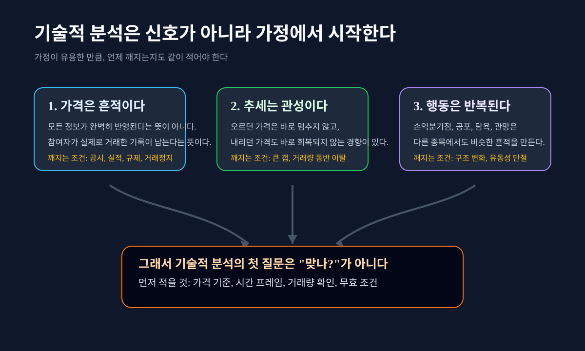
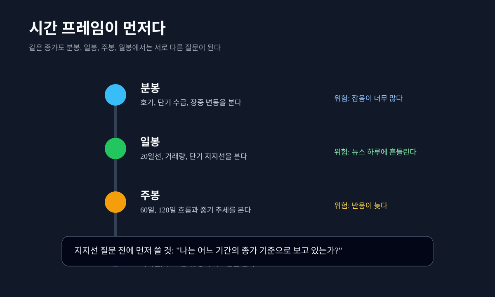
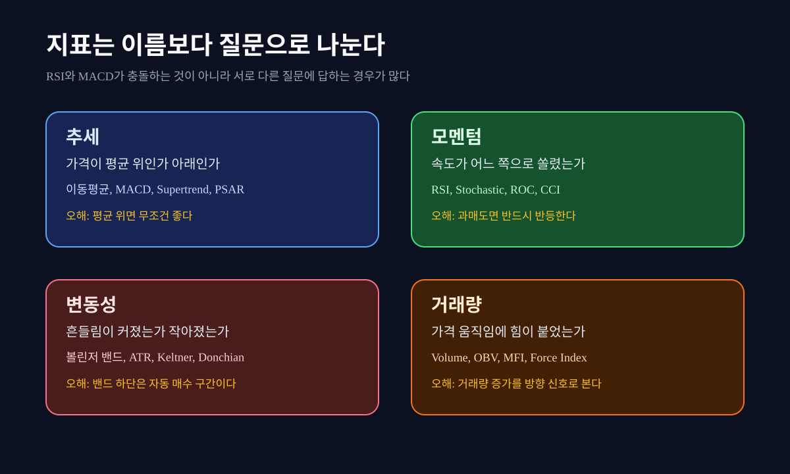

## 차트는 미래를 보여주는 화면이 아니다

기술적 분석이라는 말을 처음 들으면 사람들은 대개 차트 위의 선을 떠올린다. 빨간 캔들, 파란 캔들, 20일 이동평균, 60일 이동평균, RSI, MACD, 볼린저 밴드. 화면은 복잡하고, 누군가는 "이 선을 깨면 위험하다"거나 "RSI가 낮으니 반등한다"고 말한다. 초보자에게는 그 말이 마치 숨겨진 신호처럼 들린다.

그런데 기술적 분석을 그렇게 시작하면 첫 단추가 틀어진다. 기술적 분석은 차트가 미래를 알려준다는 믿음에서 출발하지 않는다. 더 정확히 말하면 **가격과 거래량에 남은 행동 흔적을 일정한 기준으로 다시 묻는 방법**이다. 미래를 맞히는 도구가 아니라, 지금 시장이 무엇을 이미 가격에 반영했고 무엇을 아직 확인하지 않았는지 정리하는 언어다.


여기서 "언어"라는 표현이 중요하다. 언어는 문장을 만들 수 있지만 거짓말도 만들 수 있다. 차트도 같다. 같은 차트를 보고 한 사람은 반등 후보라고 말하고, 다른 사람은 추세 이탈이라고 말한다. 둘 중 하나가 반드시 무식해서가 아니다. 기간, 기준 가격, 거래량, 뉴스, 변동성, 보유자의 손익분기점이 다르면 같은 선도 다른 뜻을 갖는다.

따라서 기술적 분석의 첫 질문은 "사야 하나, 팔아야 하나"가 아니다. 첫 질문은 "나는 무엇을 기준으로 보고 있는가"다. 일봉인지 주봉인지, 장중 고가인지 종가인지, 거래량이 동반됐는지, 이전 저점인지 이동평균인지, 새 공시가 기존 기준을 무효화했는지부터 적어야 한다. 기준이 없으면 차트를 보고 나서 마음에 드는 지표를 고르게 된다.

이번 글은 이미 있는 [기술적 투자란 무엇을 보는가](/blog/technical-investing-price-indicators)의 앞단에 놓일 글이다. 기존 1편이 DartLab에서 price 데이터를 부르고 이동평균, RSI, MACD 같은 보조지표를 확인하는 실습편이라면, 이 글은 그 전에 알아야 할 뼈대다. 기술적 분석이 무엇을 믿고, 무엇을 보며, 무엇을 절대 단정하지 말아야 하는지부터 깊게 잡는다.

## 기술적 분석은 세 가지 가정 위에 선다

기술적 분석을 쓰려면 먼저 그 가정을 알아야 한다. 가정을 모르면 지표가 맞을 때는 과신하고, 틀릴 때는 차트 탓을 하게 된다. 기술적 분석의 고전적 설명은 여러 방식으로 정리되지만, 초보자에게 필요한 것은 세 가지다. 가격은 흔적을 남긴다. 추세에는 관성이 있다. 사람의 행동은 반복된다.

첫 번째 가정은 가격이 정보를 담는다는 것이다. 여기서 오해하면 안 된다. 가격이 모든 정보를 완벽하게 반영한다는 뜻이 아니다. 실제 시장에는 지연, 오해, 정보 비대칭, 유동성 공백, 강제 매도, 프로그램 매매가 있다. 그럼에도 가격은 말보다 정직한 면이 있다. 누군가 실제 돈을 내고 샀고, 누군가 실제 물량을 팔았다. 말은 바뀌어도 체결 기록은 남는다.

두 번째 가정은 추세의 관성이다. 오르던 가격은 한 번에 멈추지 않는 경우가 많고, 내리던 가격도 바로 회복되지 않는 경우가 많다. 이유는 단순하다. 손익이 생기면 사람의 행동이 바뀐다. 수익이 난 사람은 더 버티려 하고, 손실이 난 사람은 본전 근처에서 팔고 싶어 한다. 새로 들어오려는 사람은 이전 고점과 저점을 기준으로 기다린다. 이 행동들이 모이면 가격은 선이 아니라 흐름처럼 움직인다.

세 번째 가정은 반복 행동이다. 시장 참여자는 완전히 새로운 존재가 아니다. 공포와 탐욕, 손실 회피, 본전 심리, 추격 매수, 물타기, 손절 지연은 종목이 바뀌어도 반복된다. 그래서 비슷한 패턴이 다시 나타난다. 다만 반복은 복사가 아니다. 비슷한 모양이 다시 나온다는 뜻이지 같은 결과가 나온다는 뜻이 아니다.



이 세 가정은 유용하지만 절대명제가 아니다. 공시 하나가 가정을 깬다. 실적 발표가 깬다. 금리 급등, 환율 급변, 거래정지, 유상증자, 블록딜, 대형 고객 이탈, 규제 변화가 깬다. 가격이 과거 행동을 담고 있어도, 새 정보가 들어오면 과거 행동은 더 이상 같은 의미를 갖지 못한다.

그래서 기술적 분석을 제대로 쓰는 사람은 차트 신호보다 **무효 조건**을 먼저 적는다. "20일선 회복 시 단기 반등 후보"라고 쓰기 전에 "실적 쇼크가 없고, 거래량이 줄며, 60일선이 종가 기준으로 유지될 때" 같은 조건을 붙인다. 조건이 빠진 기술적 분석은 분석이 아니라 소원에 가깝다.

외부 교육 자료도 이 점을 강조한다. Fidelity의 [technical indicator guide](https://www.fidelity.com/learning-center/trading-investing/technical-analysis/technical-indicator-guide)는 지표를 단독 결론이 아니라 가격 행동을 해석하는 도구로 다룬다. 지지선과 저항선도 Fidelity의 [support and resistance](https://www.fidelity.com/learning-center/trading-investing/technical-analysis/support-and-resistance) 설명처럼 고정 숫자보다 시장 참여자의 매수와 매도 압력이 모이는 구간으로 보는 편이 맞다.

## 재료는 가격, 거래량, 시간, 변동성 네 가지다

기술적 분석의 재료는 복잡해 보이지만 줄이면 네 가지다. 가격, 거래량, 시간, 변동성. 거의 모든 지표는 이 네 재료를 다시 계산한 결과다. 지표 이름을 외우기 전에 이 네 가지가 무엇을 묻는지 알아야 한다.

가격은 가장 먼저 보이는 재료다. 시가, 고가, 저가, 종가가 하루의 움직임을 만든다. 초보자는 종가를 과소평가하기 쉽다. 장중에는 고점도 있고 저점도 있지만, 종가는 그날 마지막에 시장이 합의한 가격이다. 그래서 "장중에 60일선을 깼다"와 "종가가 60일선 아래에서 끝났다"는 다르다. 많은 기술적 분석 문장이 종가 기준을 쓰는 이유가 여기에 있다.

거래량은 가격의 증언을 확인한다. 가격이 올랐는데 거래량이 줄었다면 참여가 약한 상승일 수 있다. 가격이 빠졌는데 거래량이 크게 늘었다면 단순 조정이 아니라 물량 정리일 수 있다. 물론 거래량도 단독 결론은 아니다. 이벤트 당일에는 거래량이 늘 수밖에 없고, 지수 편입이나 리밸런싱은 개별 회사의 의도와 무관하게 거래량을 키운다. 그래도 거래량을 보지 않는 차트 해석은 목소리만 듣고 방 안의 사람 수를 모르는 것과 비슷하다.

시간은 결론을 바꾼다. 하루짜리 하락은 일봉에서 크게 보이지만 월봉에서는 작은 꼬리일 수 있다. 반대로 일봉에서는 별일 없어 보이는 횡보가 주봉에서는 긴 박스권 상단일 수 있다. 기술적 분석에서 가장 흔한 오류가 시간 프레임 혼동이다. 단기 매매자는 분봉과 일봉을 보고, 중기 투자자는 일봉과 주봉을 보고, 장기 투자자는 주봉과 월봉을 본다. 문제는 서로 다른 시간의 문장을 한 문단에 섞을 때 생긴다.

변동성은 방향이 아니라 흔들림의 크기다. ATR이 커졌다고 해서 상승한다는 뜻이 아니다. 볼린저 밴드가 넓어졌다고 해서 상승 또는 하락을 단정할 수도 없다. 변동성은 "방향"보다 "불확실성이 커졌는가"를 묻는다. 초보자가 ATR, 볼린저 밴드, Keltner Channel 같은 지표를 방향 신호로 착각하면 위험하다. 이 지표들은 주로 포지션 크기, 손절 기준, 박스권 이탈 가능성 같은 질문을 돕는다.

이 네 가지 재료를 한 줄로 바꾸면 이렇다. 가격은 어디에서 합의됐는가. 거래량은 그 합의에 얼마나 많은 사람이 참여했는가. 시간은 그 합의가 어느 기간의 의미인가. 변동성은 그 합의가 얼마나 불안정한가. 이 네 질문을 적은 뒤에야 이동평균, RSI, MACD, 볼린저 밴드를 보는 순서가 생긴다.

## 시간 프레임이 다르면 같은 지지선도 다르다

"지금 주가가 떨어지면 지지선은 어디인가"라는 질문은 초보자가 가장 많이 묻는 질문이다. 질문 자체는 좋다. 하지만 "어느 기간에서"라는 말이 빠지면 답이 위험해진다. 일봉 기준 지지선과 주봉 기준 지지선은 다르다. 20일 이동평균과 120일 이동평균은 같은 선이 아니다. 장중 저가와 종가도 같은 가격 기준이 아니다.

예를 들어 어떤 주식이 20일선 아래로 내려왔다고 하자. 일봉만 보면 단기 추세가 깨진 것처럼 보인다. 그런데 주봉으로 보면 20주선 위에서 아직 상승 흐름을 유지하고 있을 수 있다. 이때 "추세가 끝났다"라고 말하면 너무 빠르고, "아무 문제 없다"라고 말해도 너무 느슨하다. 올바른 문장은 더 길다. "일봉 단기 추세는 약해졌지만, 주봉 중기 추세는 아직 확인 중이다." 기술적 분석의 좋은 문장은 대개 이렇게 조건이 붙는다.



시간 프레임은 투자자의 행동과 연결된다. 분봉을 보는 사람은 장중 수급과 호가를 본다. 일봉을 보는 사람은 며칠에서 몇 주의 흐름을 본다. 주봉을 보는 사람은 몇 달의 포지션 변화를 본다. 월봉을 보는 사람은 사이클과 장기 구조를 본다. 서로 다른 사람이 서로 다른 차트를 보고 있으니, 지지선과 저항선도 한 가격으로 고정될 수 없다.

이 점은 지표에도 적용된다. RSI 14가 일봉에서 30 아래로 내려왔다고 해도 주봉 RSI가 아직 50 위라면 의미가 다르다. 일봉 MACD가 음수로 돌아섰지만 주봉 MACD가 계속 상승 중이면 단기 조정일 수 있다. 반대로 일봉이 반등해도 주봉이 하락 추세면 반등은 저항선에서 막힐 수 있다.

초보자가 실수를 줄이려면 차트 앞에 세 줄을 먼저 적으면 된다. 첫째, 지금 보는 봉은 일봉인가 주봉인가. 둘째, 기준 가격은 종가인가 장중 고가와 저가인가. 셋째, 내가 보는 기간은 3개월인가 1년인가 5년인가. 이 세 줄이 없으면 차트 해석은 나중에 바뀐다. 처음에는 일봉 반등을 보다가 불리해지면 주봉 장기 추세를 말하고, 더 불리해지면 월봉 장기 성장성을 말하게 된다. 이것은 분석이 아니라 기준 이동이다.

DartLab에서도 이 기준은 중요하다. price 데이터를 불러와도 그 표는 일별 데이터인지, 주별로 리샘플했는지, 몇 개 행을 보는지에 따라 의미가 달라진다. 기존 1편인 [기술적 투자란 무엇을 보는가](/blog/technical-investing-price-indicators)에서는 `dartlab.gather("price", "005930")`로 OHLCV와 기본 보조지표를 확인하는 순서를 다뤘다. 이 글에서는 그 전에 "어느 시간의 표를 볼 것인가"를 먼저 묻는다.

## 지표는 네 가지 질문으로 나누면 덜 헷갈린다

보조지표는 많다. 이동평균, EMA, MACD, RSI, Stochastic, CCI, ROC, 볼린저 밴드, ATR, OBV, MFI, ADX. 이름만 보면 공부해야 할 목록이 끝없이 늘어난다. 하지만 지표를 질문별로 나누면 훨씬 단순해진다. 추세, 모멘텀, 변동성, 거래량이다.

추세 지표는 가격이 어느 방향으로 움직이는지 묻는다. 이동평균, MACD, Supertrend, PSAR 같은 지표가 여기에 들어간다. 이동평균은 최근 가격의 평균을 기준선으로 만든다. MACD는 짧은 EMA와 긴 EMA의 차이를 이용해 추세의 변화 속도를 본다. StockCharts의 [MACD 설명](https://school.stockcharts.com/doku.php?id=technical_indicators:moving_average_convergence_divergence_macd)도 MACD가 이동평균에서 파생되는 지표임을 전제로 한다. 그래서 MACD는 가격보다 늦다. 후행성을 이해하지 못하면 이미 움직인 가격을 보고 "이제 신호가 떴다"고 착각한다.

모멘텀 지표는 속도를 묻는다. RSI, Stochastic, ROC, CCI가 여기에 들어간다. RSI는 일정 기간 동안 상승 폭과 하락 폭의 상대적 힘을 0부터 100 사이로 바꾼다. 보통 70 위는 과열 후보, 30 아래는 과매도 후보라고 말하지만, 강한 상승 추세에서는 RSI가 오래 높게 머물 수 있고 강한 하락 추세에서는 오래 낮게 머물 수 있다. StockCharts의 [RSI 설명](https://school.stockcharts.com/doku.php?id=technical_indicators:relative_strength_index_rsi)을 볼 때도 핵심은 숫자 하나가 아니라 추세와 다이버전스, 실패 스윙 같은 맥락이다.

변동성 지표는 흔들림을 묻는다. 볼린저 밴드, ATR, Keltner Channel, Donchian Channel이 여기에 들어간다. 볼린저 밴드는 평균 주변에서 가격이 얼마나 멀어졌는지 보여준다. ATR은 평균 진폭을 보여준다. StockCharts의 [Average True Range](https://school.stockcharts.com/doku.php?id=technical_indicators:average_true_range_atr)는 ATR이 방향보다 변동성 크기를 다루는 지표임을 설명한다. ATR이 오른다고 주가가 오른다는 뜻이 아니다. 시장이 더 거칠어졌다는 뜻에 가깝다.

거래량 지표는 힘을 묻는다. OBV, MFI, Force Index가 대표적이다. 가격이 오를 때 거래량이 같이 붙는지, 가격은 횡보하는데 거래량 흐름은 누적되는지, 하락일 거래량이 더 큰지 본다. 가격은 결과이고 거래량은 참여다. 거래량 지표가 가격 지표보다 중요한 것은 아니지만, 가격 지표만 보면 참여의 크기를 놓친다.



이렇게 나누면 지표 충돌도 덜 무섭다. 가격은 20일선 아래인데 RSI가 30 근처일 수 있다. 이것은 모순이 아니다. 추세는 약하지만 단기 속도는 과매도에 가까울 수 있다는 뜻이다. MACD는 나빠졌는데 거래량이 줄어들 수 있다. 이것도 모순이 아니다. 추세는 약해졌지만 매도 압력의 힘은 줄어드는지 확인하라는 뜻이다. 여러 지표는 하나의 결론을 향해 줄 서는 부하 직원이 아니다. 서로 다른 질문을 던지는 조사관에 가깝다.

그래서 초보자는 "RSI가 좋다" 또는 "MACD가 나쁘다"라고 말하기보다, 문장을 길게 만들어야 한다. "일봉 기준 종가는 20일선 아래이고, RSI는 40대라 과매도는 아니며, MACD는 음수로 돌아섰고, 거래량은 전일 대비 줄었다." 길지만 정직하다. 이 문장 안에는 매수와 매도 결론이 없다. 대신 다음 질문이 있다. "다음 반등에서 20일선을 회복하는가", "거래량이 붙는가", "주봉 기준은 아직 살아 있는가"다.

## 패턴은 그림이 아니라 참여자 위치다

기술적 분석에서 패턴이라는 말은 자주 오해된다. 삼각수렴, 이중바닥, 헤드앤숄더, 박스권, 컵앤핸들 같은 이름을 외우면 차트를 해석할 수 있을 것처럼 보인다. 하지만 패턴을 그림으로 외우면 오래 버티기 어렵다. 더 중요한 것은 그 그림 안에서 참여자들이 어떤 위치에 있는지다.

지지선은 많은 사람이 다시 사볼 만하다고 느끼는 구간이다. 더 정확히 말하면 과거에 매수세가 매도세를 이긴 구간이다. 그 가격대에서 산 사람은 수익을 지키려 하고, 놓친 사람은 다시 기회를 기다린다. 그래서 가격이 그 구간으로 내려오면 매수와 관망이 다시 모인다. 하지만 새 악재가 나오거나 거래량이 큰 이탈이 나오면 그 심리는 무너진다.

저항선은 반대다. 과거에 매도세가 매수세를 이긴 구간이다. 그 가격대에서 물린 사람은 본전 근처에서 팔고 싶어 한다. 단기 수익을 낸 사람은 차익 실현을 고민한다. 새로 들어오려는 사람은 "이미 많이 올랐다"고 느낀다. 그래서 가격이 그 구간에 접근하면 매도 압력이 늘 수 있다. 하지만 강한 실적, 수주, 기술 서사, 지수 편입, 대형 수급이 붙으면 저항선은 뚫릴 수 있다.

돌파는 선을 넘는 일이 아니라 포지션이 바뀌는 일이다. 저항선을 뚫고 종가가 위에서 유지되면, 과거 저항 구간은 새 지지 후보가 된다. 왜냐하면 그 위에서 산 사람은 손실을 피하려 하고, 놓친 사람은 되돌림을 기다리기 때문이다. 그러나 거래량 없는 돌파는 약하다. 참여자가 적은 돌파는 쉽게 되돌려질 수 있다.

이 지점에서 기술적 분석은 회사와 산업의 이야기로 연결된다. 예를 들어 반도체 주가가 강하게 오른다면 차트만으로 설명이 끝나지 않는다. 실적 회복, 메모리 가격, HBM 공급, CAPEX, 고객 인증 같은 서사가 뒤에 있어야 한다. [삼성전자 랠리](/blog/005930-samsung-rally)는 주가 상승을 실적 회복과 기대 변화의 언어로 읽는 사례이고, [SK하이닉스 시장 견인](/blog/000660-skhynix-kospi-driver)은 한 종목의 강한 추세가 지수와 수급 언어로 확장되는 장면을 보여준다.

기술 서사가 가격으로 번역되는 방식도 따로 봐야 한다. [HBM 스택 패키징 테스트](/blog/hbm-stack-packaging-test) 같은 기술이야기는 차트에 나타난 기대가 어디에서 생겼는지 묻는다. 차트가 기대를 보여준다면, 기술 글은 그 기대가 공정 병목, 수율, 고객 인증, CAPEX와 연결되는지 확인한다. 기술적 분석은 이런 선행 질문을 대체하지 않는다. 오히려 그 질문으로 넘어가는 입구가 되어야 한다.

반대로 차트가 좋아 보여도 재무 체력이 약하면 반등은 짧을 수 있다. 가격이 저점에서 반등하고 RSI가 회복되어도 회사가 현금흐름을 만들지 못하거나 이자비용을 감당하지 못하면 가격 신호는 쉽게 무너진다. 이런 재점검은 [순현금이 시가총액보다 큰 회사](/blog/net-cash-above-market-cap)나 [이자보상배율로 보는 좀비기업](/blog/interest-coverage-zombie-firms) 같은 데이터 글과 같이 읽어야 한다. 기술적 분석은 재무분석의 대체물이 아니라 질문 목록의 앞부분이다.


차트에서 가장 위험한 순간은 마음에 드는 지표만 고를 때다. 가격은 약한데 RSI가 낮다는 이유로 반등만 보고 싶을 수 있다. 거래량이 없는데 MACD가 개선된다는 이유로 추세 전환을 말하고 싶을 수 있다. 반대로 가격은 강한데 "너무 올랐다"는 느낌 때문에 볼린저 상단만 보고 싶을 수도 있다. 기술적 분석의 핵심은 마음에 드는 신호를 찾는 것이 아니라, 서로 다른 신호를 한 문장 안에서 정직하게 배열하는 것이다.

## DartLab으로는 먼저 표를 만들고, 그 다음 차트를 본다

기술적 분석을 감각이 아니라 절차로 바꾸려면 같은 데이터를 반복해서 불러와야 한다. DartLab에서는 price 데이터를 불러오고, 필요한 열을 좁히고, 보조지표를 확인하는 흐름을 만들 수 있다. 이 부분은 기존 1편에서 더 자세히 다뤘지만, 여기서는 기술적 분석의 기준을 코드로 어떻게 고정하는지에 초점을 둔다.

```python
import dartlab

price = dartlab.gather("price", "005930")

watch = price.select([
    "date",
    "open",
    "high",
    "low",
    "close",
    "volume",
    "sma20",
    "sma60",
    "rsi14",
    "macd",
    "atr14",
    "obv",
])

print(watch.tail(5))
```

이 코드는 매수 신호를 만들기 위한 코드가 아니다. 기준을 고정하기 위한 코드다. 어떤 날짜의 종가를 보는지, 거래량이 얼마나 붙었는지, 20일선과 60일선 대비 어디에 있는지, RSI와 MACD가 어떤 상태인지, 변동성이 커졌는지, OBV가 가격과 같은 방향인지 확인한다. "무엇을 볼지"를 열 이름으로 고정하면, 나중에 마음이 흔들려도 질문이 쉽게 바뀌지 않는다.

조금 더 넓게 보려면 `Company` 객체에서 quant 지표를 확인할 수 있다.

```python
from dartlab import Company

c = Company("005930")

indicators = c.quant("지표")
print(indicators.columns)
print(indicators.tail(3))
```

여기서도 중요한 것은 열의 많고 적음이 아니다. 열이 많아질수록 마음에 드는 지표만 골라 쓰기 쉽다. 그래서 먼저 분류해야 한다. 이동평균과 MACD는 추세 쪽, RSI와 Stochastic은 모멘텀 쪽, ATR과 볼린저 밴드는 변동성 쪽, OBV와 MFI는 거래량 쪽이다. 분류가 되면 "지표가 많다"가 아니라 "내가 네 가지 질문을 모두 확인했는가"로 바뀐다.

마지막으로 요약 판단을 보더라도, 요약에서 끝내지 말고 다시 분해해야 한다.

```python
from dartlab import Company

c = Company("005930")

verdict = c.quant("판단")
print(verdict)

# 초보자에게 필요한 다음 질문
# 1. 판단 점수는 어떤 열 때문에 나왔나
# 2. 일봉 기준인가, 다른 기간을 섞었나
# 3. 거래량이 신호를 확인하나
# 4. 새 공시나 실적이 이 기준을 무효화했나
```

요약 판단은 편하지만 위험하다. "약세", "중립", "강세" 같은 단어는 생각을 줄여 준다. 하지만 기술적 분석은 단어를 받는 작업이 아니라 단어가 나온 이유를 역추적하는 작업이다. 종가가 20일선 아래인지, 60일선은 지켜졌는지, RSI가 50 아래인지, MACD가 signal 아래인지, 거래량이 어떤 방향으로 붙었는지 다시 확인해야 한다.

Terminal 화면에서도 원칙은 같다. 차트를 띄우고 보조지표를 켜는 순간, 먼저 기간과 기준을 적는다. 일봉 1년, 종가 기준, 20일선과 60일선, 거래량, RSI, MACD, ATR. 이 순서로 보고, 마음에 드는 지표만 따로 떼지 않는다. 표와 차트는 서로 다른 물건이 아니라 같은 데이터를 다른 모양으로 보는 방식이다.

## 기술적 분석이 틀리는 다섯 가지 순간

기술적 분석은 쓸모가 있지만, 잘 틀린다. 이 말을 피하면 안 된다. 오히려 기술적 분석을 오래 쓰려면 틀리는 조건을 먼저 배워야 한다. 지표가 틀렸다는 말보다 정확한 표현은, 지표의 전제가 깨졌다는 말이다.

첫 번째는 새 정보다. 실적 발표, 대규모 수주, 규제, 소송, 유상증자, 블록딜, 거래정지 같은 사건은 과거 가격과 거래량으로 만든 기준을 순식간에 무효화한다. RSI가 낮아도 악재가 새로 나오면 더 내려갈 수 있다. MACD가 좋아져도 실적 쇼크가 나오면 의미가 바뀐다.

두 번째는 유동성 변화다. 거래가 얇은 종목은 작은 물량에도 선이 쉽게 깨진다. 반대로 대형주도 지수 편입, 리밸런싱, 옵션 만기, 대규모 패시브 자금 이동이 있으면 거래량이 회사의 펀더멘털과 무관하게 커질 수 있다. 거래량은 중요하지만 항상 "왜 늘었는가"를 물어야 한다.

세 번째는 시간 프레임 혼동이다. 단기 반등을 장기 추세 전환으로 착각하거나, 장기 추세가 좋다는 이유로 단기 이탈을 무시하는 경우다. 일봉 신호는 일봉 신호이고, 주봉 신호는 주봉 신호다. 서로 보완할 수는 있지만 서로를 지워 주지는 않는다.

네 번째는 지표의 후행성이다. 이동평균은 평균이고, MACD는 이동평균의 차이다. 가격이 먼저 움직이고 지표가 따라간다. 후행 지표를 보고 선행 신호처럼 말하면 위험하다. Fidelity의 [moving average 설명](https://www.fidelity.com/learning-center/trading-investing/technical-analysis/moving-average)이나 StockCharts의 [moving averages 설명](https://school.stockcharts.com/doku.php?id=technical_indicators:moving_averages)을 볼 때도 평균이라는 성격을 잊지 말아야 한다.

다섯 번째는 서사 변화다. 어떤 종목은 기술투자 테마로 오른다. AI, HBM, 로봇, 원전, 2차전지, 바이오 같은 말이 가격에 붙는다. 이때 차트는 기대가 모인 흔적을 보여주지만, 그 기대가 실제 매출과 마진으로 이어지는지는 별도 문제다. 기술 서사가 깨지면 지표는 늦게 반응한다. 그래서 기술적 분석은 기술이야기, 기업이야기, 데이터 리포트와 연결되어야 한다.

이 다섯 조건을 기억하면 기술적 분석의 문장이 달라진다. "RSI가 낮으니 반등한다"가 아니라 "RSI는 낮지만, 실적 발표 전이고, 거래량이 아직 줄지 않았으며, 주봉 추세가 확인되지 않았으므로 반등 가설은 약하다"가 된다. "20일선을 회복했으니 상승한다"가 아니라 "20일선을 종가 기준으로 회복했고 거래량이 늘었지만, 60일선 저항과 다음 공시를 확인해야 한다"가 된다. 문장이 길어질수록 더 정직해진다.

## 다음 차트를 볼 때 남길 다섯 줄

기술적 분석이란 차트로 미래를 맞히는 기술이 아니다. 가격, 거래량, 시간, 변동성으로 시장 참여자의 행동 흔적을 정리하고, 다음에 무엇을 확인할지 정하는 프레임이다. 좋은 기술적 분석은 결론을 빨리 내리지 않는다. 오히려 결론을 늦춘다. 기준을 적고, 조건을 붙이고, 무효 조건을 둔다.

다음 차트를 볼 때는 다섯 줄만 먼저 남겨도 실수가 크게 줄어든다.

| 먼저 적을 것 | 왜 필요한가 | 틀리는 예 |
| --- | --- | --- |
| 기준 시간 | 일봉, 주봉, 월봉이 서로 다른 질문이기 때문이다 | 일봉 이탈을 장기 추세 붕괴로 단정한다 |
| 기준 가격 | 장중 저가와 종가는 의미가 다르다 | 장중 이탈만 보고 지지선 붕괴라고 말한다 |
| 거래량 | 가격 움직임에 참여가 붙었는지 봐야 한다 | 거래량 없는 돌파를 강한 돌파로 본다 |
| 지표 분류 | 추세, 모멘텀, 변동성, 거래량 질문을 섞지 않는다 | RSI와 MACD가 충돌한다고 오해한다 |
| 무효 조건 | 새 정보와 유동성 변화가 차트를 깨뜨릴 수 있다 | 공시 악재 뒤에도 과거 지지선을 고집한다 |

이 다섯 줄은 매수와 매도 결론이 아니다. 오히려 결론을 성급하게 내리지 않기 위한 안전장치다. 기술적 분석을 배울수록 많은 지표를 켜고 싶어진다. 하지만 초보자에게 더 중요한 것은 지표 수가 아니라 기준의 일관성이다. 같은 기준으로 여러 종목을 보고, 틀린 조건을 기록하고, 시간이 지나 다시 확인해야 한다.

외부 참고로는 Fidelity의 [technical indicator guide](https://www.fidelity.com/learning-center/trading-investing/technical-analysis/technical-indicator-guide), [support and resistance](https://www.fidelity.com/learning-center/trading-investing/technical-analysis/support-and-resistance), [moving average](https://www.fidelity.com/learning-center/trading-investing/technical-analysis/moving-average)를 먼저 볼 수 있다. 지표별 계산과 차트 예시는 StockCharts의 [moving averages](https://school.stockcharts.com/doku.php?id=technical_indicators:moving_averages), [MACD](https://school.stockcharts.com/doku.php?id=technical_indicators:moving_average_convergence_divergence_macd), [RSI](https://school.stockcharts.com/doku.php?id=technical_indicators:relative_strength_index_rsi), [ATR](https://school.stockcharts.com/doku.php?id=technical_indicators:average_true_range_atr)가 도움이 된다.

다만 이 글의 결론은 외부 정의가 아니라 읽는 순서다. 기술적 분석은 신호를 믿는 일이 아니다. 신호가 만들어진 재료를 분해하고, 그 신호가 깨지는 조건을 적고, 다음 데이터로 넘어가는 일이다. 차트가 말하는 것은 미래가 아니라 흔적이다. 흔적을 읽을 수는 있지만, 흔적만으로 판단을 끝내면 안 된다.
