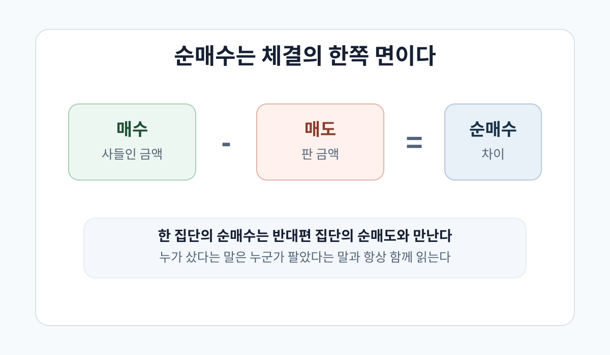
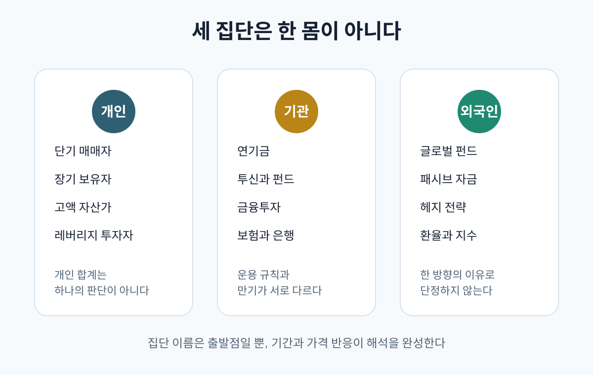
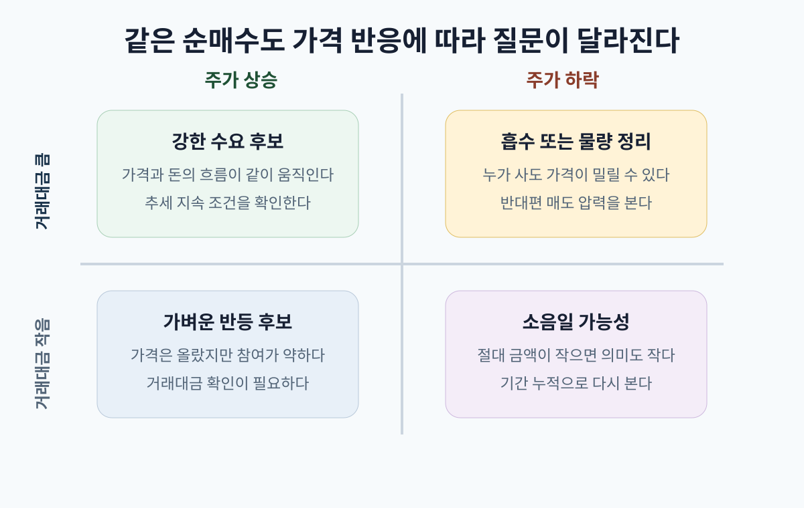
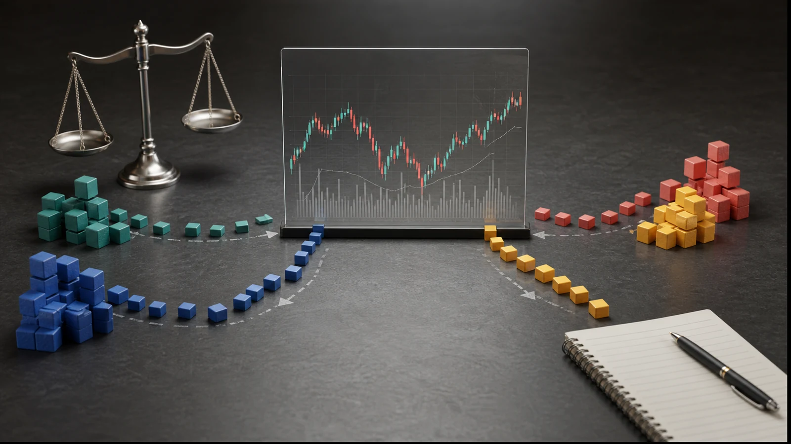
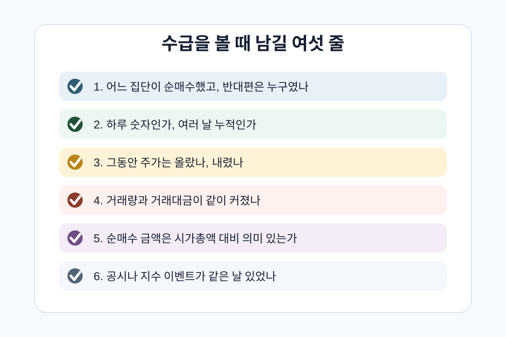

## 외국인이 샀다는 말에서 멈추면 위험하다

주식 화면을 보다 보면 거의 매일 같은 문장을 만난다. 외국인이 샀다. 기관이 팔았다. 개인이 받았다. 어떤 날은 "외국인 순매수에 상승"이라고 쓰이고, 어떤 날은 "개인 매수세 유입"이라고 쓰인다. 이 말들은 쉽고 강하다. 누가 샀는지 알면 다음 주가도 알 수 있을 것처럼 느껴진다.

하지만 수급은 예언이 아니다. 수급은 이미 체결된 거래의 흔적이다. 누군가 샀다는 말은 반드시 누군가 팔았다는 말과 같이 존재한다. 외국인이 순매수했다면 반대편에는 개인, 기관, 기타법인, 기타외국인 중 누군가의 순매도가 있다. 시장은 한쪽의 의지만으로 움직이는 곳이 아니라, 서로 다른 가격 판단이 만나는 곳이다.


그래서 수급을 읽는 첫 문장은 "누가 샀나"가 아니다. 첫 문장은 "누가 누구에게 넘겼나"다. 두 번째 문장은 "그 과정에서 가격이 올랐나, 내렸나"다. 세 번째 문장은 "그 거래가 시가총액과 거래대금에 비해 의미 있는 크기였나"다. 이 세 문장이 없으면 수급은 투자 언어가 아니라 소문에 가까워진다.

이 글은 투자권유가 아니다. 특정 종목의 매수, 매도, 목표주가를 말하지 않는다. 실제 현재 수급 숫자를 가져와 어떤 집단을 따라가라고 말하지도 않는다. 목적은 더 기초적이다. 개인, 기관, 외국인이라는 세 단어가 무엇을 뜻하고, 순매수 숫자가 어떻게 만들어지고, 왜 수급은 주가, 거래량, 거래대금, 시가총액과 함께 봐야 하는지 설명한다.

앞선 글에서 [기술적 분석이란 무엇인가](/blog/technical-analysis-foundations)는 차트를 가격과 거래량에 남은 행동 흔적으로 보자고 했다. [기술적 투자란 무엇을 보는가](/blog/technical-investing-price-indicators)는 DartLab price 표에서 주가와 거래량, 보조지표를 확인하는 흐름을 다뤘다. [주가와 시가총액은 왜 다를까](/blog/price-vs-market-cap)는 1주 가격과 회사 전체 가격표를 분리했다. 이번 글은 그 다음이다. 가격이 움직인 뒤, 그 가격 위에서 누가 사고 누가 팔았는지 읽는 언어가 수급이다.

## 수급은 매수와 매도의 균형이다

수급이라는 말은 원래 수요와 공급을 줄인 말이다. 주식시장에서는 조금 더 구체적으로 쓰인다. 어떤 기간에 어떤 투자자 집단이 얼마나 사고 팔았는지 보는 말이다. 개인, 기관, 외국인 같은 투자자 구분별 매수 금액과 매도 금액을 비교하고, 그 차이를 순매수 또는 순매도라고 부른다.

가장 기본 공식은 간단하다.



순매수는 매수 금액에서 매도 금액을 뺀 값이다. 어떤 집단이 1,000억원어치를 사고 700억원어치를 팔았다면 순매수는 300억원이다. 반대로 700억원어치를 사고 1,000억원어치를 팔았다면 순매도는 300억원이다. 이 숫자는 그 집단이 해당 기간에 얼마나 더 사는 쪽이었는지, 또는 파는 쪽이었는지 보여준다.

코드로 쓰면 더 분명하다.

```python
def net_buy(buy_amount, sell_amount):
    return buy_amount - sell_amount

foreign = net_buy(100_000_000_000, 70_000_000_000)
retail = net_buy(60_000_000_000, 90_000_000_000)

print(foreign)  # 30,000,000,000
print(retail)   # -30,000,000,000
```

중요한 것은 두 숫자가 서로 만난다는 점이다. 시장 전체를 완전히 나누어 보면 어떤 집단의 순매수는 다른 집단의 순매도와 맞물린다. 물론 실제 표에서는 기타법인, 기타외국인, 파생상품, 장외 거래, 집계 기준 차이 때문에 단순하게 한 줄로 딱 맞아 보이지 않을 수 있다. 그래도 기본 원리는 같다. 체결은 항상 매수자와 매도자가 동시에 있어야 일어난다.

그래서 "외국인이 샀다"는 문장은 절반이다. 나머지 절반은 "누가 팔았나"다. 외국인이 샀는데 개인이 팔았는지, 기관이 팔았는지, 기타법인이 팔았는지에 따라 해석이 달라진다. 더 중요한 것은 그 가격이다. 외국인이 샀는데도 주가가 하락했다면, 외국인의 매수보다 더 강한 매도 압력이 가격을 눌렀을 수 있다. 반대로 기관이 팔았는데도 주가가 올랐다면, 그 물량을 받아낸 다른 수요가 더 강했을 수 있다.

수급은 그래서 원인 확정이 아니라 질문의 출발점이다. 누가 샀나. 누가 팔았나. 가격은 어떻게 반응했나. 거래대금은 충분히 컸나. 하루짜리 숫자인가, 여러 날 누적인가. 시가총액에 비해 큰 금액인가. 이 질문들이 붙어야 수급이 분석이 된다.

공식 확인 화면은 있다. 한국 시장의 투자자별 거래실적은 [KRX 정보데이터시스템](https://data.krx.co.kr/)에서 확인할 수 있고, 시장 단위는 [투자자별 거래실적](https://data.krx.co.kr/contents/MDC/MDI/outerLoader/index.cmd?kosdaqGlobalYn=1&locale=ko_KR&screenId=MDCSTAT022), 개별 종목 단위는 [투자자별 거래실적 개별종목](https://data.krx.co.kr/contents/MDC/MDI/outerLoader/index.cmd?kosdaqGlobalYn=1&locale=ko_KR&screenId=MDCSTAT023), 순위형 화면은 [투자자별 순매수상위종목](https://data.krx.co.kr/contents/MDC/MDI/outerLoader/index.cmd?kosdaqGlobalYn=1&locale=ko_KR&screenId=MDCSTAT024)에서 찾을 수 있다. 이 글은 그 화면의 현재 숫자를 옮기지 않고, 그 숫자를 읽는 문법만 다룬다.

## 개인은 늘 틀리고 외국인은 늘 맞을까

수급 이야기에서 가장 흔한 오해는 투자자 집단을 실력 순위표처럼 보는 것이다. 외국인은 똑똑한 돈, 기관은 전문적인 돈, 개인은 뒤늦게 따라오는 돈. 이런 문장은 짧고 자극적이어서 퍼지기 쉽다. 하지만 실제 시장을 읽는 데는 너무 거칠다.

개인은 하나의 성격이 아니다. 개인 안에는 당일 매매자도 있고, 장기 투자자도 있고, 고액 자산가도 있고, 레버리지를 쓰는 투자자도 있고, 퇴직연금으로 ETF를 사는 사람도 있다. 같은 개인 순매수라도 어떤 종목에서, 어떤 가격 위치에서, 어떤 기간에 나타났는지에 따라 의미가 달라진다. 폭락장에서 개인이 계속 받는 것은 위험한 물타기일 수도 있지만, 과매도 국면에서 장기 자금이 들어오는 것일 수도 있다.

기관도 한 몸이 아니다. 기관합계에는 금융투자, 투신, 연기금, 보험, 은행, 사모펀드 등 서로 다른 주체가 섞인다. 금융투자는 파생상품과 현물 차익거래 때문에 움직일 수 있고, 투신은 펀드 자금 유입과 환매 때문에 움직일 수 있고, 연기금은 장기 배분과 리밸런싱 때문에 움직일 수 있다. 기관이 샀다고 해서 모두 같은 이유로 산 것이 아니다.

외국인도 하나의 두뇌가 아니다. 글로벌 장기 펀드, 헤지펀드, 패시브 ETF, 지수 리밸런싱 자금, 환율을 보는 매크로 자금, 한국 시장 전체를 바스켓으로 사고파는 자금이 모두 외국인으로 잡힐 수 있다. [SEC의 institutional investor 설명](https://www.sec.gov/resources-small-businesses/glossary)이나 [FINRA의 기관투자자 교육 자료](https://www.finra.org/investors/insights/institutional-investors-and-smart-money)를 보면 기관투자자라는 말 자체도 은행, 펀드, 보험, 연기금, 투자자문사처럼 여러 주체를 포함한다. 외국인이라는 분류는 더 넓다.



그래서 "개인이 샀으니 위험하다" 또는 "외국인이 샀으니 좋다"는 식의 문장은 분석이 아니다. 때로는 맞을 수 있지만 이유가 약하다. 수급을 제대로 읽으려면 집단 이름을 결론으로 쓰지 않고, 그 집단이 움직인 맥락을 봐야 한다. 대형주인가 소형주인가. 지수 편입과 리밸런싱이 있었나. 환율이 급변했나. 실적 발표 전후인가. 공매도와 대차잔고가 같이 움직였나. 거래대금이 평소보다 커졌나.

특히 외국인 수급은 한국 시장에서 강한 인상을 준다. 대형 반도체, 자동차, 금융, 인터넷 플랫폼처럼 글로벌 투자자가 익숙하게 보는 업종에서는 외국인 매매가 주가와 지수에 큰 영향을 줄 수 있다. [SK하이닉스 시장 견인](/blog/000660-skhynix-kospi-driver)에서 본 것처럼 시가총액이 큰 종목의 강한 흐름은 지수 전체의 언어가 된다. 하지만 이것도 외국인이 항상 맞는다는 뜻이 아니다. 큰 돈이 움직이면 시장에 영향이 크다는 뜻이다.

## 기관합계 안에는 서로 다른 이유가 섞인다

수급 화면에서 기관합계만 보면 한 집단처럼 보인다. 하지만 기관합계는 여러 운용 주체의 합이다. 같은 날 기관합계가 순매수라도 그 안에서 연기금은 사고 금융투자는 팔 수 있다. 투신은 펀드 환매 때문에 팔고, 보험은 장기 포트폴리오 조정 때문에 살 수 있다. 사모펀드는 이벤트 드리븐 전략으로 움직이고, 금융투자는 선물과 현물의 가격 차이를 이용한 차익거래 때문에 움직일 수 있다.

이 차이가 중요한 이유는 지속성이 다르기 때문이다. 연기금의 매수는 장기 배분 변화일 수 있다. 투신의 매수는 펀드로 돈이 들어온 결과일 수 있다. 금융투자의 매수는 다음 날 바로 반대로 풀리는 차익거래일 수 있다. 기관합계라는 한 줄 안에 오래 가는 흐름과 하루짜리 흐름이 같이 들어갈 수 있다. 그래서 기관합계만 보고 "전문가가 샀다"라고 말하면 너무 빠르다.

특히 지수 이벤트가 있는 날은 조심해야 한다. KOSPI200, MSCI, FTSE 같은 지수 편입과 제외, 정기 변경, 비중 조정이 있으면 기관과 외국인의 매매가 회사 자체 판단보다 지수 규칙에 더 가깝게 움직일 수 있다. 어떤 회사가 갑자기 좋아져서 산 것이 아니라, 지수 안에서 그 회사의 비중이 바뀌었기 때문에 사고파는 경우가 있다. 이때 수급은 투자 판단의 결과라기보다 운용 규칙의 실행 기록이다.

또 하나는 패시브 자금이다. ETF와 인덱스펀드는 특정 종목을 깊게 분석해서 매수한다기보다 지수를 따라가기 위해 산다. 대형주에서는 이 힘이 작지 않다. 시가총액이 커지고 지수 비중이 올라가면 패시브 자금이 더 많이 따라올 수 있다. 반대로 지수에서 비중이 줄거나 제외되면 회사의 펀더멘털과 별개로 물량이 나올 수 있다. 이 흐름을 이해하지 못하면 기관과 외국인 수급을 모두 "좋게 봤다" 또는 "나쁘게 봤다"로 오해하게 된다.

그래서 기관 수급을 볼 때는 적어도 세 질문이 필요하다. 첫째, 기관합계 안에서 어떤 세부 주체가 움직였나. 둘째, 그 움직임이 여러 날 이어졌나. 셋째, 같은 기간 지수 이벤트나 파생상품 만기가 있었나. 세 질문을 통과해야 기관 수급이 단순한 하루 잡음인지, 의미 있는 포지션 변화인지 조금 더 분리된다.

## 외국인 순매수와 외국인 보유는 다르다

외국인 수급을 볼 때 또 하나 헷갈리는 것이 흐름과 잔고다. 외국인 순매수는 일정 기간 동안 외국인이 더 산 금액이다. 외국인 보유는 기준일에 외국인이 들고 있는 주식의 규모나 비중이다. 하나는 흐름이고 하나는 잔고다. 강물이 오늘 얼마나 흘렀는지와 저수지에 물이 얼마나 쌓여 있는지는 다른 질문이다.

외국인이 오늘 순매수했다고 해서 외국인 보유 비중이 크게 바뀌었다고 단정할 수 없다. 시가총액이 큰 종목에서는 하루 순매수 금액이 보유 잔고에 비해 작을 수 있다. 반대로 외국인 보유금액은 주가가 오르면 매수하지 않아도 커질 수 있고, 주가가 내리면 순매수했더라도 보유금액 증가가 작게 보일 수 있다. [지표누리의 외국인 증권투자 현황](https://www.index.go.kr/unity/potal/main/EachDtlPageDetail.do?idx_cd=1086)도 외국인 보유금액이 시황에 따라 변동된다는 점을 유의사항으로 둔다. 금액과 비중, 흐름과 잔고를 나누어 보아야 한다.

이 차이는 뉴스 해석에서도 중요하다. "외국인 보유율 상승"은 장기간 누적된 보유 구조 변화일 수 있다. "외국인 순매수"는 오늘 또는 최근 며칠의 거래 흐름일 수 있다. 보유율이 높은 종목에서 외국인이 조금 순매도했다고 해서 장기 관점이 모두 바뀌었다고 볼 수 없고, 보유율이 낮은 종목에서 하루 순매수했다고 해서 구조적 진입이 시작됐다고 볼 수도 없다.

외국인 수급은 환율과도 연결된다. 원화가 약세일 때 외국인은 주식 수익률뿐 아니라 환차손까지 고려할 수 있다. 글로벌 위험 회피가 커지면 한국 주식 자체가 좋아 보여도 신흥국 비중을 줄이는 과정에서 팔 수 있다. 반대로 반도체 사이클이나 한국 대형주의 이익 전망이 좋아지면 환율 부담이 있어도 살 수 있다. 그러므로 외국인 순매수는 종목 분석, 환율, 글로벌 자금 배분, 지수 비중이 겹친 결과다.

결국 외국인 수급을 읽는 문장은 이렇게 길어져야 한다. 외국인이 샀다. 그런데 이 매수는 하루짜리인가 누적인가. 보유율도 같이 올라가는가. 환율과 시장 전체 외국인 흐름은 어떤가. 대형주 지수 비중 변화가 있었나. 그 기간 주가와 거래대금은 어떻게 반응했나. 이 질문이 붙어야 외국인 수급은 신화가 아니라 데이터가 된다.

## 기간을 빼면 수급은 소음이 된다

수급 숫자는 기간을 빼면 거의 의미가 없다. 하루 외국인 순매수 100억원과 20거래일 누적 순매수 100억원은 완전히 다르다. 하루 100억원은 이벤트성 거래일 수 있고, 20거래일 100억원은 매우 약한 흐름일 수 있다. 반대로 하루 1,000억원 순매도는 충격처럼 보이지만, 전날 5,000억원 순매수 뒤 일부 차익 실현일 수도 있다.

그래서 수급은 누적으로 봐야 한다. 1일, 5일, 20일, 60일을 나누어 보면 다른 이야기가 나온다. 하루 숫자는 뉴스와 이벤트에 민감하다. 5일은 한 주 동안의 방향을 보여준다. 20일은 한 달의 흐름을 보여준다. 60일은 분기 단위 포지션 변화를 대략 보여준다. 어느 기간을 보느냐에 따라 같은 외국인 순매수도 단기 트레이딩인지, 중기 포지션 구축인지, 단순 리밸런싱인지 다르게 보인다.

간단한 누적 계산은 이렇게 생각할 수 있다.

```python
daily_net_buy = [120, -40, 80, 30, -10]  # 억원 단위 예시

five_day_total = sum(daily_net_buy)
positive_days = sum(1 for value in daily_net_buy if value > 0)

print(five_day_total)  # 180
print(positive_days)   # 3
```

여기서 합계만 봐도 부족하다. 5일 합계가 180억원이어도 첫날 300억원을 사고 나머지 4일을 팔았는지, 매일 조금씩 샀는지에 따라 의미가 다르다. 꾸준한 누적은 포지션 구축처럼 보일 수 있고, 하루 큰 거래는 블록딜, 이벤트, 지수 리밸런싱, 파생상품 만기와 연결될 수 있다.

수급은 가격 위치와도 함께 봐야 한다. 고점 돌파 구간에서 외국인과 기관이 누적으로 사고 거래대금이 커지면 강한 수요 후보일 수 있다. 하지만 장기 하락 중에 같은 집단이 조금씩 사는 것은 손실 구간에서 물량을 흡수하는 과정일 수 있다. 반대로 저점 부근에서 개인이 순매수했다고 해서 무조건 나쁜 것도 아니다. 가격이 충분히 빠졌고 거래대금이 줄며 매도 압력이 소진되는 구간일 수 있다.

결국 기간은 수급의 문법이다. "외국인 순매수"라고만 쓰면 너무 짧다. "외국인이 최근 20거래일 동안 거래대금 증가와 함께 순매수했다"라고 쓰면 질문이 생긴다. "그 기간 주가는 얼마나 올랐나", "시가총액 대비 순매수 금액은 큰가", "공시나 실적 이벤트가 있었나", "다른 집단은 무엇을 했나"다. 좋은 수급 해석은 늘 이렇게 길어진다.

## 금액은 시가총액과 거래대금으로 나누어야 한다

순매수 금액의 절대값도 착시를 만든다. 100억원 순매수는 커 보인다. 하지만 시가총액 100조원짜리 회사에서 100억원은 매우 작은 흔적일 수 있다. 반대로 시가총액 2,000억원짜리 회사에서 100억원은 큰 힘일 수 있다. 그래서 수급 금액은 시가총액과 거래대금으로 나누어 봐야 한다.

[주가와 시가총액은 왜 다를까](/blog/price-vs-market-cap)에서 본 것처럼 주가는 1주 가격이고, 시가총액은 회사 전체 가격표다. 수급도 마찬가지다. 한 집단의 순매수 금액이 회사 전체 가격표의 몇 퍼센트인지 봐야 한다. 시가총액 대비 0.01%인지, 1%인지에 따라 의미가 다르다.

거래대금 대비로도 봐야 한다. 하루 거래대금이 1,000억원인 종목에서 100억원 순매수는 거래의 10%에 해당한다. 하루 거래대금이 10억원인 종목에서 100억원 순매수는 일반적인 장내 거래만으로 설명하기 어려울 수 있다. 거래대금이 얇은 종목은 작은 금액에도 가격이 크게 움직이고, 큰 금액은 들어오고 나가기가 어렵다.

정규화는 어렵지 않다.

```python
def flow_ratios(net_buy_amount, market_cap, trading_value):
    return {
        "market_cap_ratio": net_buy_amount / market_cap,
        "trading_value_ratio": net_buy_amount / trading_value,
    }

large_cap = flow_ratios(10_000_000_000, 100_000_000_000_000, 800_000_000_000)
small_cap = flow_ratios(10_000_000_000, 200_000_000_000, 20_000_000_000)

print(large_cap)
print(small_cap)
```

이 코드는 투자 판단을 대신하지 않는다. 단지 같은 100억원이 어떤 종목에서는 작은 흔적이고, 어떤 종목에서는 큰 힘일 수 있음을 보여준다. 수급을 볼 때 절대 금액만 보는 것은 주가만 보고 회사 크기를 판단하는 것과 비슷하다. 숫자는 반드시 분모가 있어야 의미가 생긴다.

거래대금 기준은 기술적 분석과도 연결된다. [기술적 분석이란 무엇인가](/blog/technical-analysis-foundations)에서 강조한 것처럼 거래량과 거래대금은 가격 움직임에 얼마나 많은 참여자가 붙었는지 보여준다. 외국인이 순매수했더라도 거래대금이 평소보다 작고 주가 반응도 약하면 의미는 제한적이다. 반대로 거래대금이 크게 늘고 주요 저항선을 돌파했다면 그 수급은 더 많은 참여자의 행동 흔적일 수 있다.

## 가격 반응이 수급 해석을 바꾼다

같은 순매수라도 가격 반응이 다르면 해석이 달라진다. 외국인이 1,000억원 순매수했고 주가가 크게 올랐다면, 외국인 매수와 가격 상승이 같은 방향으로 나타난 것이다. 하지만 외국인이 1,000억원 순매수했는데 주가가 내렸다면 질문이 달라진다. 누가 더 강하게 팔았는가. 외국인이 낮은 가격에서 물량을 받았는가. 아니면 매수에도 불구하고 시장 전체 매도 압력이 더 컸는가.

기관 순매도도 마찬가지다. 기관이 팔았는데 주가가 올랐다면, 그 매도 물량을 다른 집단이 더 강하게 받아냈다는 뜻일 수 있다. 기관이 팔았고 주가도 내렸다면, 기관 매도가 가격 하락과 같은 방향으로 나타난 것이다. 하지만 그 역시 원인 확정은 아니다. 실적 발표, 금리, 환율, 지수 리밸런싱, 블록딜, 공매도, 시장 전체 위험 회피가 함께 있었을 수 있다.



수급과 가격을 함께 볼 때 가장 좋은 질문은 네 가지다. 첫째, 순매수와 주가 상승이 같이 나타났는가. 둘째, 순매수에도 주가가 밀렸는가. 셋째, 순매도에도 주가가 버텼는가. 넷째, 이 움직임이 거래대금 증가와 함께 나타났는가. 이 네 질문만으로도 "외국인이 샀다"라는 한 문장보다 훨씬 많은 것을 볼 수 있다.

특히 대형주는 수급과 지수의 관계를 같이 봐야 한다. 대형주 외국인 순매수는 그 종목 하나의 이야기이면서 동시에 한국 시장 전체, 신흥국 비중, 환율, 반도체 사이클, MSCI나 KOSPI200 리밸런싱과 연결될 수 있다. [삼성전자 랠리](/blog/005930-samsung-rally)는 주가 상승을 수급만이 아니라 실적 기대와 반도체 서사로 함께 읽어야 한다는 사례다. 랠리를 설명할 때 수급은 중요하지만, 수급만으로 끝내면 원인을 너무 좁게 잡는다.

반대로 소형주는 수급이 가격을 더 크게 흔들 수 있다. 유통주식수가 적고 거래대금이 얇으면 특정 집단의 순매수가 가격에 큰 영향을 줄 수 있다. 하지만 그만큼 되돌림도 빠를 수 있다. 수급이 들어왔다고 해서 그 회사의 이익, 현금흐름, 재무 체력이 좋아지는 것은 아니다. 수급은 시장의 발자국이고, 펀더멘털은 회사의 체력이다. 둘은 연결될 수 있지만 같은 말은 아니다.

## 네 가지 장면으로 읽으면 훨씬 쉽다

수급은 정의보다 장면으로 배울 때 더 빨리 잡힌다. 아래 예시는 실제 특정 종목의 현재 수급이 아니라, 수급 화면에서 자주 만나는 가상 장면이다. 숫자는 원리를 설명하기 위한 단순 예시다.

첫 번째 장면은 외국인 순매수, 주가 상승, 거래대금 증가가 함께 나온 날이다. 겉으로는 가장 강해 보인다. 외국인이 사고, 가격도 오르고, 돈도 많이 돌았다. 이때는 "강한 수요가 들어왔다"는 가설을 세울 수 있다. 하지만 여기서 끝내면 안 된다. 그날 실적 발표가 있었는지, 지수 편입이 있었는지, 환율이 급변했는지, 같은 업종 전체가 같이 올랐는지 봐야 한다. 외국인이 원인인지, 외국인도 같은 이벤트를 따라 움직인 결과인지는 아직 확정되지 않았다.

두 번째 장면은 외국인 순매수인데 주가는 하락한 날이다. 초보자는 이 장면을 잘 놓친다. "외국인이 샀으니 좋다"라고 말하고 싶은데, 가격은 내려갔다. 이때 핵심 질문은 외국인이 아니라 반대편이다. 누가 더 강하게 팔았나. 기관의 대규모 매도가 있었나. 블록딜이나 보호예수 해제가 있었나. 외국인이 낮아진 가격에서 물량을 받아낸 것인지, 아니면 매수에도 불구하고 시장 전체 매도 압력이 더 컸는지 구분해야 한다.

세 번째 장면은 개인 순매수, 주가 하락, 거래대금 증가가 같이 나온 날이다. 흔히 "개인이 받았다"는 말로 소비된다. 위험한 장면일 수 있다. 하락하는 가격을 개인이 계속 받아내고, 반대편에서 기관이나 외국인이 꾸준히 팔고 있다면 손실 구간에서 물량이 개인에게 넘어가는 과정일 수 있다. 하지만 이것도 확정은 아니다. 과매도 구간에서 장기 개인 자금이 들어온 것일 수도 있고, 배당이나 자사주 같은 이벤트를 보고 들어온 것일 수도 있다. 그래서 개인 순매수 자체가 문제가 아니라 가격 위치와 반대편 매도의 지속성이 문제다.

네 번째 장면은 기관 순매수, 주가 보합, 거래대금 감소다. 숫자만 보면 기관이 샀으니 좋아 보인다. 하지만 거래대금이 줄었고 가격이 움직이지 않았다면, 시장 전체 참여가 약한 상태에서 일부 기관 수급만 잡힌 것일 수 있다. 펀드 설정, 리밸런싱, 프로그램 매매, 분기 말 포트폴리오 조정일 수도 있다. 이 장면에서는 "기관이 샀다"보다 "왜 가격이 움직이지 않았나"가 더 좋은 질문이다.

이 네 장면을 기억하면 뉴스 문장이 덜 무섭다. 외국인 순매수는 무조건 호재가 아니고, 개인 순매수는 무조건 악재가 아니며, 기관 순매수도 무조건 전문성의 신호가 아니다. 수급은 집단 이름보다 조합이다. 누가 샀는가, 누가 팔았는가, 가격은 어떻게 반응했는가, 거래대금은 충분했는가, 사건은 있었는가. 이 조합이 해석을 만든다.

## 수급은 공시와 이벤트를 만나야 해석된다

수급을 볼 때 가장 자주 빠지는 것이 같은 날의 사건이다. 실적 발표, 대규모 수주, 유상증자, 전환사채 전환, 자사주 매입과 소각, 블록딜, 보호예수 해제, 지수 편입 같은 이벤트는 수급 숫자의 의미를 바꾼다. 외국인이 팔았다고 해서 회사가 나빠졌다고 단정할 수 없고, 기관이 샀다고 해서 회사가 좋아졌다고 확정할 수도 없다. 그날 어떤 사건이 있었는지 먼저 봐야 한다.

예를 들어 유상증자 발표 뒤 기관이 순매수했다면 해석은 복잡해진다. 싸게 나온 신주를 받기 위한 포지션 조정일 수도 있고, 할인 발행 뒤 가격 안정화를 기대한 매수일 수도 있고, 기존 주주의 희석을 우려한 매도와 동시에 나타난 흐름일 수도 있다. 자사주 소각 공시 뒤 외국인이 샀다면 주당 몫 개선을 본 장기 매수일 수 있지만, 단기 이벤트 매매일 수도 있다. 공시와 수급을 분리하면 이런 차이가 사라진다.

그래서 수급 화면을 본 뒤에는 DART나 EDGAR에서 같은 기간의 공시를 확인하는 습관이 필요하다. 공시 읽기 자체가 이 글의 주제는 아니지만, 수급은 공시와 만나야 해석이 닫힌다. 가격은 움직였고, 누군가는 샀고, 누군가는 팔았다. 그다음 질문은 "그들이 무엇을 보고 움직였을 가능성이 있는가"다. 이 질문이 빠지면 수급은 원인처럼 보이지만 사실은 원인을 찾기 전의 흔적일 뿐이다.

흔적은 출발점이지 결론이 아니다.

## DartLab으로는 price 반응을 먼저 확인한다

DartLab에서 투자자별 수급 숫자를 임의로 재현해 발행하지 않는다. 이 글에서 DartLab은 가격, 거래량, 거래대금 같은 price 데이터를 확인하는 역할이다. 투자자별 거래실적은 KRX의 공식 화면에서 확인하고, DartLab에서는 그 기간에 주가와 거래량이 어떻게 반응했는지 본다. 역할을 분리해야 데이터 출처가 흐려지지 않는다.

먼저 price 표를 확인한다.

```python
import dartlab

price = dartlab.gather("price", "005930")

print(price.columns)
print(price.tail(5))
```

그다음 수급을 확인한 기간에 맞춰 주가와 거래량, 거래대금을 본다. 실제 열 이름은 데이터 버전에 따라 다를 수 있으므로 `price.columns`를 먼저 확인하고 맞춘다.

```python
import dartlab

price = dartlab.gather("price", "005930")

wanted = ["date", "close", "volume", "trading_value", "market_cap"]
available = [name for name in wanted if name in price.columns]

print(price.select(available).tail(20))
```

이 표로 할 일은 매수 신호를 만드는 것이 아니다. 수급 숫자의 맥락을 확인하는 것이다. 외국인이 20거래일 동안 순매수했다면, 같은 20거래일 동안 종가는 올랐는가. 거래량은 늘었는가. 거래대금은 평소보다 커졌는가. 시가총액 대비 그 순매수는 의미 있는가. 이 질문을 확인한다.

조금 더 절차적으로 쓰면 이렇게 된다.

```python
def flow_question(net_buy, market_cap, trading_value, price_change_pct):
    cap_ratio = net_buy / market_cap
    value_ratio = net_buy / trading_value

    return {
        "시가총액 대비": cap_ratio,
        "거래대금 대비": value_ratio,
        "가격 반응": price_change_pct,
        "첫 질문": "순매수와 가격이 같은 방향인가?",
    }
```

이 함수는 답을 주지 않는다. 질문을 고정한다. 초보자에게는 이 차이가 중요하다. 수급 데이터는 단독으로 결론을 주는 표가 아니다. 수급은 가격 표와 나란히 놓을 때 의미가 생긴다. price 데이터는 수급의 반응판이고, KRX 투자자별 거래실적은 주체별 체결 기록이다. 둘을 합쳐야 "누가 샀다"에서 "그 매수가 가격을 어떻게 바꾸었나"로 넘어갈 수 있다.

## 수급이 틀리는 다섯 가지 순간

수급은 유용하지만 자주 틀린다. 더 정확히 말하면 수급을 해석하는 사람이 자주 과하게 단정한다. 오해를 줄이려면 수급이 틀리는 순간을 먼저 알아야 한다.

첫 번째는 하루 숫자 과대해석이다. 하루 외국인 순매수만 보고 추세 전환을 말하면 위험하다. 이벤트, 지수 리밸런싱, 만기, 블록딜, 단기 차익거래가 하루 숫자를 크게 만들 수 있다. 하루 숫자는 뉴스가 아니라 단서다.

두 번째는 집단 서열화다. 외국인은 항상 맞고 개인은 항상 틀린다는 말은 편하지만 위험하다. 개인 안에도 장기 자금이 있고, 외국인 안에도 단기 자금이 있다. 기관 안에도 서로 반대 방향으로 움직이는 주체가 있다. 집단 이름은 이유가 아니라 분류다.

세 번째는 가격 반응 무시다. 순매수가 컸는데 주가가 하락했다면 그 자체로 중요한 질문이다. 매수가 있었는데도 가격이 밀렸다는 뜻이기 때문이다. 반대로 순매도가 컸는데 주가가 버텼다면 매도 물량을 받아낸 수요가 있었다는 뜻일 수 있다. 수급은 가격과 따로 읽으면 반쪽이다.

네 번째는 분모 없는 금액 해석이다. 100억원은 어떤 종목에서는 큰돈이고 어떤 종목에서는 작은 흔적이다. 시가총액, 거래대금, 유통주식수, 평균 거래량을 보지 않으면 수급 금액의 크기를 알 수 없다.

다섯 번째는 원인 확정이다. 주가가 올랐고 외국인이 샀다고 해서 주가 상승의 원인이 외국인이라고 확정할 수는 없다. 실적 기대가 먼저였을 수 있고, 환율이 먼저였을 수 있고, 반도체 업황이 먼저였을 수 있고, 지수 편입이 먼저였을 수 있다. 수급은 원인을 말해 주는 판결문이 아니라 원인을 찾게 하는 발자국이다.



이 한계를 알면 문장이 달라진다. "외국인이 샀으니 오른다"가 아니라 "외국인이 최근 20거래일 누적으로 샀고, 같은 기간 거래대금이 늘었으며, 주가는 저항선을 넘었는지 확인해야 한다"가 된다. "개인이 받았으니 위험하다"가 아니라 "개인 순매수가 하락 구간에서 이어졌고, 반대편 외국인 매도가 지속되는지 확인해야 한다"가 된다. 문장이 길어질수록 더 정직해진다.

## 수급 기사 문장을 이렇게 바꿔 읽는다

수급을 공부한 뒤에는 뉴스 문장을 바로 결론으로 받아들이지 말고, 질문 문장으로 번역해야 한다. 같은 문장도 번역하면 전혀 다르게 보인다.

| 기사 문장 | 바로 믿으면 생기는 오해 | 바꿔 읽을 문장 |
| --- | --- | --- |
| 외국인 순매수에 상승 | 외국인이 원인이고 앞으로도 오른다 | 외국인 순매수와 가격 상승이 같은 날 나타났다. 기간 누적과 거래대금을 확인한다 |
| 기관 매도에 약세 | 기관이 나쁘게 봤으니 끝났다 | 기관 세부 주체와 지수, 파생상품, 리밸런싱 이벤트를 확인한다 |
| 개인이 저가 매수에 나섰다 | 개인이 받으면 위험하다 | 가격 위치, 반대편 매도 주체, 하락 기간, 거래대금 축소 여부를 확인한다 |
| 외국인 매수세 지속 | 스마트머니가 들어왔다 | 보유율, 환율, 시장 전체 외국인 흐름, 업종 동반 흐름을 같이 본다 |
| 수급 공백으로 급락 | 사는 사람이 없어서 끝났다 | 거래대금이 얇은 구간인지, 공시 악재가 있었는지, 다음 지지 구간에서 거래가 붙는지 본다 |

이 번역표의 목적은 결론을 느리게 만드는 것이다. 투자에서 느린 결론은 약점이 아니다. 특히 수급처럼 숫자가 빠르게 바뀌는 화면에서는 느린 결론이 오히려 안전장치다. 빠른 문장은 대개 집단 이름으로 끝난다. 느린 문장은 기간, 가격, 거래대금, 시가총액, 공시, 이벤트로 이어진다.

## 다음 수급 화면에서는 여섯 줄만 남긴다

수급은 투자자가 시장을 읽을 때 유용한 언어다. 하지만 수급을 매수와 매도 신호표로 쓰면 바로 위험해진다. 수급은 누가 더 똑똑한지 알려주는 순위표가 아니다. 수급은 누가 어느 기간에, 어느 가격에서, 얼마만큼 사고팔았는지 보여주는 체결의 흔적이다.



다음 수급 화면에서는 여섯 줄만 먼저 적어 보자. 첫째, 어느 집단이 순매수했고 반대편은 누구였나. 둘째, 하루 숫자인가 여러 날 누적인가. 셋째, 그 기간 주가는 올랐나 내렸나. 넷째, 거래량과 거래대금은 평소보다 커졌나. 다섯째, 순매수 금액은 시가총액 대비 의미 있는가. 여섯째, 같은 날 공시, 실적, 지수, 환율 이벤트가 있었나.

이 여섯 줄은 결론이 아니다. 결론을 늦추는 장치다. 초보자에게 가장 필요한 것은 빠른 신호가 아니라 나쁜 단정을 막는 질문이다. 외국인 순매수는 볼 가치가 있다. 기관 순매도도 볼 가치가 있다. 개인 순매수도 볼 가치가 있다. 다만 그 가치는 집단 이름에서 나오지 않는다. 가격, 거래량, 거래대금, 기간, 시가총액, 이벤트를 같이 놓을 때 나온다.

수급을 이렇게 읽으면 시장 뉴스가 달라 보인다. "외국인이 샀다"는 문장은 이제 끝이 아니라 시작이다. 누가 팔았나. 가격은 버텼나. 거래대금은 붙었나. 시가총액 대비 의미가 있나. 왜 지금 이 집단이 움직였나. 이 질문을 할 수 있다면, 수급은 소문이 아니라 투자자의 언어가 된다.
