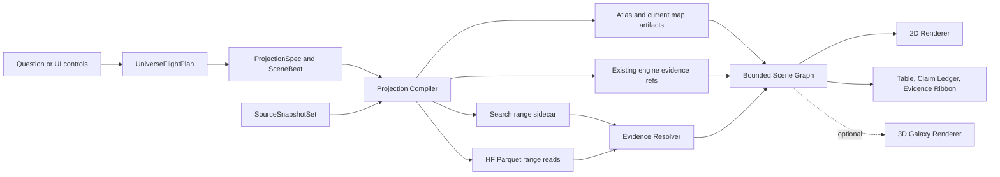

# 03. Runtime and Public Architecture

## 1. 목표 구조



public `/universe` path에는 graph server가 없다. 브라우저가 기존 DataCore로 작은 map JSON과 필요한 Parquet range만 읽는다. `/map`은 기존 시장 지도 route로 남고, 두 route는 map artifact와 loader를 공유한다.

## 1.1 route 경계

```text
/map
  현재 시장 지도 제품
  기존 동작과 deep link 유지

/universe
  ontology, evidence, time, lens를 묶은 독립 제품
  share URL과 scene state의 owner

shared runtime
  HF origin, cache, request dedup, map artifact loader, evidence resolver
```

`/universe`가 `/map` route component를 import하거나 반대로 import하지 않는다. 재사용 단위는 route 아래가 아니라 contracts, runtime, renderer adapter다.

## 2. semantic LOD

| level | 사용자 질문 | 읽는 데이터 | 기본 한도 |
|---|---|---|---:|
| L0 Universe | 어디가 변하고 있는가 | `meta.json`, `atlas.json`, lazy timeline 및 movers | 34 industry territory |
| L1 Market | 어느 공정과 산업이 연결되는가 | atlas flows, industryStats lazy | 120 cluster, 180 flow |
| L2 Industry | 회사는 분포의 어디에 있는가 | `industries/{id}.json` | desktop 500 node |
| L3 Company | 이 회사는 누구와 연결되는가 | `companies/{code}.json` | desktop 500 node, 1,000 edge |
| L4 Filing | 왜 연결됐고 어떤 assertion이 충돌하는가 | search range + cited panel rows | evidence 20개 |
| L5 Observation | 원문과 수치는 정확히 무엇인가 | finance, panel, price, scan column projection | viewport 기반 |

Zoom은 장식이 아니라 query boundary다. L0에서 ecosystem 전체를 받지 않는다.

## 3. 공유 loader 분리

현재 `marketMap()`의 일괄 `Promise.all`을 다음 의미로 나눈다. `/map` compatibility 호출과 `/universe` projection runtime이 이 함수를 함께 소비한다.

```text
loadUniverseMeta()
loadMarketAtlas()
loadIndustryProjection(industryId)
loadCompanyProjection(stockCode)
loadEvidence(ref or edgeHint)
loadObservationSeries(entityId, metricId, range)
```

이 함수는 모두 `DataCore`를 주입받는다. raw `fetch`, 독자 HF base URL, landing 전용 cache를 만들지 않는다.

## 4. Projection Compiler

`compileProjection(spec, sources)`는 다음 순서로만 동작한다.

1. schema, SourceSnapshotSet, legacy buildId 호환 확인
2. publicOnly와 redistributionClass fail-closed 검사
3. seed ID 해소
4. semantic LOD source 선택
5. availableAt에 knowledgeAsOf를 적용하고 valid interval에 validAt 적용
6. evidence class 및 status filter
7. maxDepth, maxNodes, maxEdges 적용
8. stable sort와 deterministic truncation
9. lens evidence를 node attribute 또는 overlay로 결합
10. claim, evidence, gap receipt 결속
11. scene hash 발급

truncation은 degree 순 임의 cutoff가 아니다. seed, evidence class, direct relation, selected lens priority 순서의 stable policy를 쓴다. 잘린 수는 `omittedNodes`, `omittedEdges`로 공개한다.

## 5. Evidence on Demand

U0~U2는 새 graph artifact 없이 근거를 해소한다.

1. 현재 company edge를 `EdgeHint`로 읽는다.
2. subject, object, type, evidence title을 search query와 constraint로 바꾼다.
3. `filingSearch.ts`가 postings와 top-k meta range만 읽는다.
4. exact sourceRef 후보를 얻는다.
5. 필요한 경우 회사 panel의 cited filing 및 section row를 읽는다.
6. entity boundary, section, direction, period를 검증한다.
7. 통과하면 session-scoped `UniverseAssertion`을 만든다.
8. 실패하면 candidate 상태를 유지하고 "근거 미확인"을 반환한다.

확인 결과는 browser memory와 versioned local cache에 둘 수 있지만 HF truth나 map artifact를 자동 수정하지 않는다.

## 6. runtime 한계와 U3 승인 조건

다음이 실제 reference browser에서 반복 측정될 때만 existing map artifact의 additive assertion pointer를 제안한다.

- evidence cold P95가 5초를 초과
- shared search cold bootstrap 포함 첫 evidence transfer 4MB를 초과
- bootstrap 이후 edge 1건 incremental transfer 2MB를 초과
- mobile peak heap 250MB를 초과
- exact sourceRef resolution 성공률이 gold 300건에서 95% 미만

그때도 새 `graph/` warehouse를 만들지 않는다. 기존 `companies/{code}.json` edge에 `assertionRefs`, `eventAt`, `sourcePublishedAt`, `availableAt`, `validFrom`, `validTo`, `status`, `redistributionReceiptId` optional 필드를 추가하는 최소 확장만 검토한다. 수정 전 운영자 명시 승인이 필요하다.

## 7. public 및 local 공통 배선

| 기능 | public | local | 계약 |
|---|---|---|---|
| atlas, industry, company | HF 직독 | 동일 HF 직독 | common |
| finance, panel, price | HF range | 동일 HF range | common |
| search evidence | HF sidecar range | 동일 | common |
| deterministic projection | browser | browser | common |
| AI question to spec | 사용 가능 환경의 기존 Web AI 또는 API | `/api/ask` | optional |
| live provider | 없음 | local server | localOnly |
| heavy recompute | 없음 | local server | localOnly |

AI가 없어도 완전한 제품이어야 한다. public 기본은 seed search, Lens Tray, filter builder로 ProjectionSpec과 작은 UniverseFlightPlan을 만든다.

## 8. renderer abstraction

```text
UniverseRenderer
  mount(container, accessibilityBridge)
  setScene(scene)
  applyScenePatch(atomicPatch)
  setSelection(ids)
  setLabelPolicy(policy)
  setCameraPreset(preset)
  hitTest(point)
  focusById(id)
  measure()
  recoverContext()
  destroy()
```

기본 포트폴리오는 산업 atlas와 evidence fan의 SVG, bounded company ego의 current `@cosmograph/cosmos` adapter, exact evidence의 DOM table이다. 현재 `EcosystemMap` 화면 전체를 복제하지 않는다. 선택적 2.5D와 3D는 동일 interface를 구현하고 2D 대비 task uplift를 증명해야 하는 lazy adapter다.

renderer가 ontology type을 소유하거나 fetch하지 않는다. package 교체는 adapter 하나로 제한한다. 모든 interactive mark는 keyboard focus ID를 가진다. dependency version, license, bundle size, browser support를 분기마다 점검한다.

### SourceSnapshotSet과 LensAvailability

projection compiler는 map buildId 하나를 replay 정본으로 쓰지 않는다.

1. map, search, panel, finance, capability catalog, recipe catalog의 source version을 `SourceSnapshotSet`으로 묶는다.
2. source version을 구할 수 없으면 `unreplayable`로 표시한다.
3. lens는 scalar, series, table, ranking, distribution, scenario output archetype과 public, local, unavailable 환경을 선언한다.
4. public에서 unavailable인 lens를 client가 임의 재계산하지 않는다.
5. redistribution receipt가 없거나 만료된 source lane은 projection admission에서 차단한다.

같은 SourceSnapshotSet과 flight plan만 exact replay를 주장할 수 있다. legacy map buildId는 map artifact compatibility와 rollback에만 사용한다.

## 9. cache와 저장

- cache key: `snapshotSetId + schemaVersion + projectionId + sourcePath + byteRange`
- in-flight dedup은 기존 `RequestDedup` 사용
- memory cache는 bounded LRU 사용
- large scene의 영구 OPFS 저장은 기본 off
- share URL은 데이터 자체가 아니라 canonical flight plan, ProjectionSpec, snapshotSetId를 담음
- legacy buildId만 있고 SourceSnapshotSet이 없으면 exact replay를 약속하지 않음
- source version이 다르면 재현 불가를 숨기지 않고 "현재 데이터로 재실행"과 "원 source snapshot 없음"을 분리
- negative evidence resolution은 짧은 TTL로 cache해 반복 요청을 막되 영구 부재로 취급하지 않음

## 10. 성능 예산

| 항목 | desktop | mobile |
|---|---:|---:|
| initial map data gzip | <= 150KB | <= 150KB |
| active scene node | <= 500 | <= 250 |
| active scene edge | <= 1,000 | <= 500 |
| peak JS heap | <= 512MB | <= 250MB |
| evidence cold P95 | <= 5s | <= 6s |
| evidence first cold transfer | <= 4MB provisional | <= 3MB provisional |
| evidence incremental transfer | <= 2MB | <= 1MB |
| interaction frame | P95 >= 45fps | P95 >= 30fps |

초과하면 node 수를 숨기지 않고 lower LOD와 table view로 degrade한다. first cold transfer는 postings뿐 아니라 shared stats와 meta initialization을 포함한다. U2-R01 실측 후 provisional budget을 확정하며, bootstrap과 edge incremental bytes를 분리 기록한다.

## 11. 장애 격리

| 실패 | 사용자 동작 | 금지 |
|---|---|---|
| meta 실패 | cached build 또는 오류 | 오래된 dataAsOf 숨김 |
| ecosystem 실패 | atlas-only 유지 | 전체 route crash |
| company JSON 실패 | 회사 기본 data와 검색 유지 | 빈 우주를 정상처럼 표시 |
| evidence resolver 실패 | candidate 유지, reason 표시 | fact 승격 |
| panel range 실패 | search sourceRef와 재시도 제공 | source 없는 요약 |
| AI 실패 | deterministic controls 유지 | 제품 전체 비활성 |
| WebGL 실패 | SVG/table renderer | 빈 canvas |
| 3D 실패 | 2D 복귀 | 별도 데이터 재요청 루프 |

## 12. 비용 모델

- GitHub Pages 또는 현재 static hosting 유지
- HF dataset과 range read 유지
- always-on server 0
- graph DB 0
- vector DB 0
- public GPU server 0
- client GPU는 optional renderer만 사용

비용 증가 지점은 새 데이터 복제보다 요청 수와 browser heap이다. LOD, range, cache, deterministic limits로 관리한다.

## 13. 관측 가능성

외부 유료 telemetry 없이도 다음을 노출한다.

- snapshotSetId, source별 version, buildId, schemaVersion, dataAsOf
- source별 load duration, bytes, cache hit, retry count
- scene node/edge/omitted counts
- claim, receipt, unresolved gap counts
- evidence resolution status와 reason code
- renderer FPS 및 context loss
- local-only diagnostics export JSON

사용자 query 원문과 투자 관심사는 기본 수집하지 않는다.

## 14. public route artifact

- SvelteKit route owner: `landing/src/routes/universe/`
- surface owner: `ui/packages/surfaces/src/universe/`
- data contract owner: `ui/packages/contracts/src/universe.ts`
- runtime owner: `ui/packages/runtime/src/data/universe/`
- public URL state owner: `ui/packages/surfaces/src/universe/url.ts`
- `/map`은 Universe URL state나 Evidence Drawer를 소유하지 않는다.
- active frontend 대량 삭제가 해소되기 전 U1 production 파일은 만들지 않는다. U0 attempts는 이 경계와 무관하게 진행한다.
