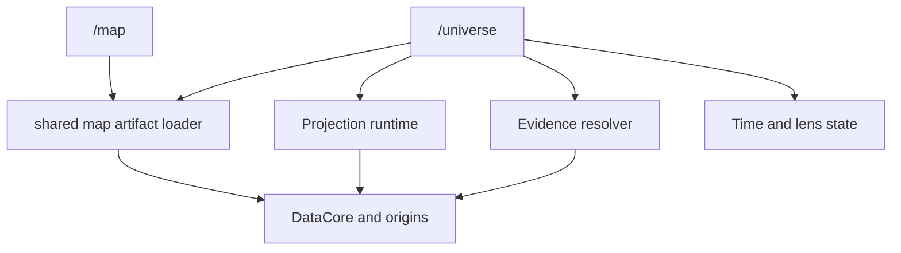

# 09. Public Route and Release Contract

## 1. route 결정

public 제품 경로는 `/universe`다.

| route | 제품 역할 | owner state | 유지 원칙 |
|---|---|---|---|
| `/map` | 현재 시장 및 산업 지도 | map selection과 기존 deep link | 기존 사용자 작업 회귀 금지 |
| `/universe` | ontology, evidence, time, engine lens 탐색 | ProjectionSpec과 selected assertion | 독립 제품으로 진화 |

두 route를 합치거나 하나를 다른 하나로 redirect하지 않는다. `/map`은 Universe의 축소판이 아니고 `/universe`는 map의 이름 변경이 아니다.

## 2. 공유와 분리



공유:

- HF origins
- `data/fetch.request()`
- cache와 request dedup
- atlas, industry, company artifact loader
- search range와 panel range primitives
- renderer adapter가 소비하는 low-level scene primitives

분리:

- route state
- URL schema
- page shell
- Lens Tray
- Evidence Drawer
- Time Lens
- Universe onboarding과 share UX

## 3. URL 계약

canonical URL 예:

```text
/universe?v=1&build=20260714-195628&seed=kr:dart:corp:00126380&validAt=2025-12-31&knownAt=2026-03-31T00:00:00Z&pred=suppliesTo,classifiedIn&status=observed,corroborated&lens=engines.credit&group=industry&selected=relation:...
```

허용 state:

- schema version
- buildId
- canonical seed IDs
- validAt
- knownAt
- predicate와 status
- lens capabilityRef
- grouping, colorBy, sizeBy
- selected node 또는 relation ID

금지 state:

- raw 질문
- API key
- 원문 전체
- 사용자 history
- localOnly source path
- renderer vendor camera binary

URL decode 실패, unknown predicate, unknown redistributionClass는 fail closed다. 유효한 seed만 남겨 임의로 부분 복구하지 않고 오류와 수정 가능한 필드를 표시한다.

## 4. route load 계약

### server load

`+page.ts`는 meta와 atlas에 필요한 작은 자료만 반환한다. ecosystem, company, panel, search postings를 eager load하지 않는다.

### client load

1. meta와 atlas
2. URL seed resolution
3. selected industry 또는 company projection
4. 사용자가 relation을 열 때 evidence
5. lens를 켤 때 observation과 engine output
6. 사용자가 명시적으로 Galaxy를 켤 때 3D chunk

### cache

cache key는 `buildId + schemaVersion + sourcePath + byteRange + projectionId`다. `/map`과 `/universe`가 같은 source를 읽으면 같은 runtime cache namespace를 사용한다.

## 5. navigation과 발견

- primary navigation에 `Universe`를 독립 항목으로 둔다.
- `/map`에는 `Universe에서 근거와 시간으로 탐색` CTA를 둔다.
- `/universe`에는 `시장 지도 열기` link를 둔다.
- 동일 기능 버튼을 두 route에 복사하지 않는다.
- beta 기간에는 Universe label에 Beta를 표시한다.

## 6. SEO와 share metadata

- canonical path는 `/universe`다.
- 기본 metadata는 제품 설명, dataAsOf, public entity count만 포함한다.
- 사용자 선택 종목과 질문을 server log나 OG image 생성 요청으로 보내지 않는다.
- share preview는 seed label과 public aggregate만 사용한다.
- stale buildId URL은 현재 재실행과 원본 재현 불가를 구분한다.

## 7. release state

같은 `/universe` route에 다음 state를 적용한다. 별도 `/lab/universe` route를 만들지 않는다.

| state | 접근 | 목적 | push 조건 |
|---|---|---|---|
| localReview | local production build만 | 눈검수와 performance | push 없음 |
| publicBeta | public `/universe`, Beta 표시 | real browser SLO와 usability | 운영자 눈검수 승인 |
| ga | public `/universe` | 정식 제품 | beta 14일 gate |
| disabled | 유지보수 안내 또는 nav 숨김 | incident 격리 | runtime config 또는 route rollback |

release state는 UI 복제나 별도 build를 만들지 않는다. 하나의 route가 같은 contracts와 runtime을 소비한다.

## 8. public beta gate

필수:

- U0 gold 통과
- atlas first data 예산 통과
- fact sourceRef 100%
- public localOnly leak 0
- `/map` regression 0
- keyboard, reduced motion, table equivalent
- mobile heap 250MB 이하
- rollback drill
- 실제 화면 눈검수

beta에서 수집 가능한 운영 지표:

- buildId와 schemaVersion
- load duration과 transfer bytes
- cache hit
- scene node, edge, omitted count
- evidence resolution reason code
- renderer context loss

수집 금지:

- raw query
- 종목 watchlist
- evidence 원문
- 사용자 URL 전체
- local file path

## 9. GA gate

- beta 14일 동안 critical incident 0
- fact sourceRef coverage 100%
- hard negative false acceptance 1% 이하
- evidence cold P95 5초 이하
- atlas availability 99.9%
- schema current와 previous reader 검증
- public policy audit
- dependency license audit
- rollback 15분 이내 훈련

## 10. 장애와 rollback

| 장애 | 즉시 조치 | 보존 기능 |
|---|---|---|
| bad relation lane | predicate/source lane off | atlas, entity, other predicates |
| evidence resolver failure | candidate-only | atlas와 table |
| schema mismatch | atlas-only | seed search와 dataAsOf |
| renderer failure | SVG/table | evidence와 URL state |
| map artifact bad build | previous buildId | route와 cache namespace |
| license issue | source lane fail closed | 다른 public source |
| route UI regression | `/universe` disabled 또는 prior commit | `/map` 전체 |

`/map`을 Universe rollback surface로 사용하지 않는다. Universe가 실패해도 map은 원래 제품으로 계속 동작한다.

## 11. 장기 유지보수

### 주간

- assertion canary
- hub anomaly
- unresolved evidence rate
- source freshness
- route performance

### 월간

- gold와 hard negative 추가
- dependency and browser matrix
- accessibility spot check
- `/map`과 loader compatibility

### 분기

- schema compatibility
- predicate owner review
- public policy와 license
- route usage보다 task completion과 evidence open 품질 검토
- dead lens 및 dead UI 제거

### 연간

- major schema 필요성
- renderer vendor 교체 가능성
- share URL compatibility
- 3D 유지 ROI
- `/map`과 `/universe` 역할 중복 여부

## 영향 파일

- `landing/src/routes/universe/+page.ts`
- `landing/src/routes/universe/+page.svelte`
- `ui/packages/surfaces/src/universe/**`
- `ui/packages/runtime/src/data/universe/**`
- navigation owner 파일
- `/map` CTA 파일 1개

active frontend refactor가 끝나기 전 exact navigation owner는 P0-01에서 현재 경로로 다시 고정한다.

## 영향 함수/심볼

- `decodeUniverseUrl`
- `encodeUniverseUrl`
- `loadUniverseRoute`
- `UniverseSurface`
- `UniverseReleaseState`

## 테스트

- URL round trip과 invalid fail closed
- `/map` deep link regression
- `/universe` refresh, back, forward
- shared loader cache dedup
- route load network waterfall
- public policy leak test
- beta/disabled state
- Playwright visual and keyboard flow

## 롤백

route state를 disabled로 바꾸거나 prior UI commit으로 복귀한다. data artifact와 `/map`은 건드리지 않는다. contract major failure는 current/previous reader로 이전 scene을 읽고, 읽을 수 없으면 atlas-only로 닫는다.

## 평가

### 전문 개발자 평가

독립 route는 제품 코드를 복제하면 유지보수 부채가 된다. 이 계약은 route state와 UX만 분리하고 loader, cache, evidence primitive를 공유한다. `/map`과 `/universe`가 서로 import하지 않아 한쪽 회귀가 다른 쪽에 전파되는 범위를 줄였다. 같은 route에서 localReview, beta, GA를 운영해 preview surface 증식을 막았다.

### 전문 PM 평가

Universe는 map보다 넓은 사용자 약속을 가진다. 독립 navigation과 share URL이 있어야 대표 제품으로 성장할 수 있다. 동시에 map을 없애지 않아 기존 사용자의 익숙한 작업을 지킨다. beta 성공 기준을 방문 수보다 evidence open, task completion, fact coverage에 둔 것이 제품의 핵심 가치와 맞다.
