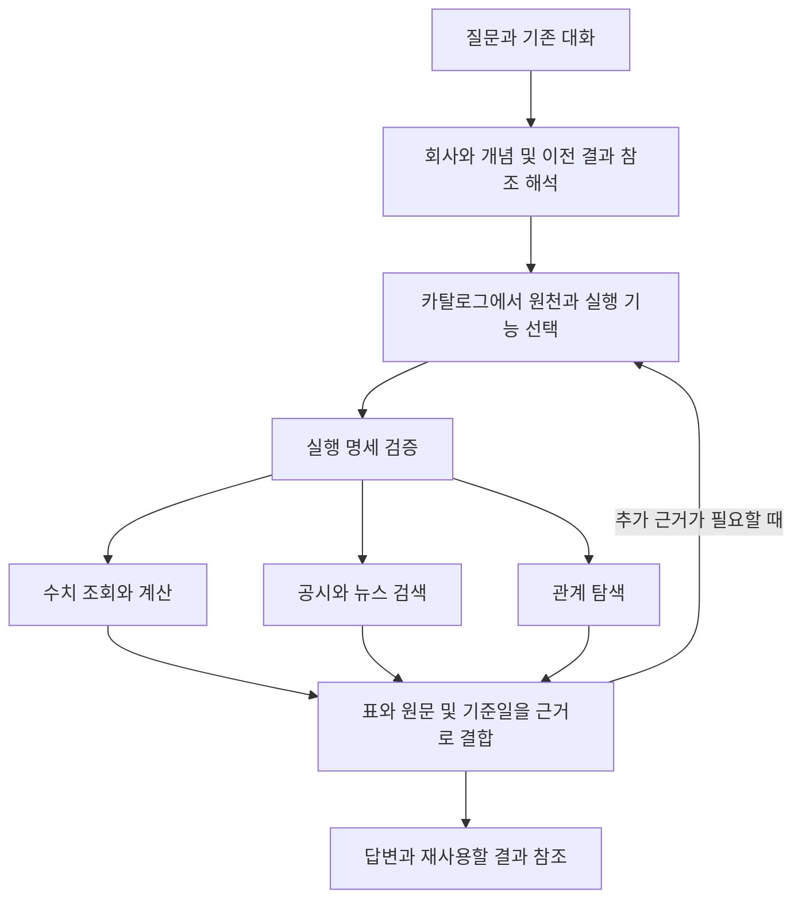

# DartLab 전체 데이터 자연어 질의 조사

2026-09-30, 코드 기준 `e15aedb1ef851a6291e6ef6717da990a260fbdde`의 작업 트리에서 조사했다. 아래 수량은 이 환경에서 관측한 값이며 제품의 고정 경계가 아니다.

목표는 사용자가 DartLab의 API나 데이터 종류를 몰라도 “삼성전자만큼 큰 회사는?”이라고 묻고, “그중 직원이 적은 회사”, “무슨 사업을 하는데?”, “공시에는 왜 투자한다고 나와?”로 이어갈 수 있게 하는 것이다. 재무 스크리너만으로 범위를 축소하지 않는다.

결론은 **기존 데이터 실행기와 검색기를 재사용하고, 개념의 의미와 기준 기업, 비교 대상 집합, 시간, 근거를 연결하는 질의 계층을 보강하는 방향이 적합하다**는 것이다. 실제 API 조합으로 크기 비교, 직원 수, 공시 검색, 관계 그래프를 실행했다. 자연어 대화 전체가 자동으로 성공한다는 검증은 아직 하지 않았다.

이 문서는 조사 결과와 구현 제안이다. production 코드, 공개 API, AI runtime을 변경하거나 Universe 실험 전체를 제품에 승격하지 않았다.

## 무엇을 확인했는가

| 구분 | 확인 범위 | 해석 한계 |
|---|---|---|
| 코드 | root API, DataHub, scan, extractionCatalog, frame, search, 설치형 AI runtime, EngineCall, Universe U4 planner | 전체 저장소의 모든 기능을 실행한 감사는 아니다 |
| 실제 데이터 | 카탈로그, 로컬 파일 존재, 상장 목록, 전 종목 매출·자산, 시가총액, 삼성전자 직원·topic, 공시 검색, 관계 엔진 | 원 공시와 숫자를 전수 대사하지 않았다 |
| AI 연결 | 질문별 coverage 안내와 EngineCall 근거 반환 | 설치형 에이전트의 실제 다중 턴 답변 품질은 미측정 |
| 외부 조사 | Microsoft, Databricks, Snowflake의 공식 문서와 Spider 2.0 프로젝트 | 외부 제품의 성능이 DartLab에 그대로 재현된다는 뜻이 아니다 |

최초 공개 API 실행에서 기본 freshness 정책에 따라 로컬 scan 파일의 원격 재확인과 갱신이 발생했다. 이후에는 `DARTLAB_NO_REFRESH=1`, `DARTLAB_NO_HF_DOWNLOAD=1`로 재측정했다. 갱신 전 시가총액 snapshot은 2026-08-07, 최종 비교에 사용한 snapshot은 2026-09-30이었다. 파일 수정 시각, 시장 관측일, 수집 시각은 같은 의미가 아니다.

## 현재 데이터와 실행 기반

### 데이터 발견

`dartlab.dataHub("catalog")` 실행 결과는 자산 **344개**, `queryable=True` **172개**, owner **14종**이다. 기존 DataHub 계획 문서의 355개는 과거 수량이다. `queryable`은 실행 경로가 선언됐다는 뜻이며, 모든 기업·기간의 자료가 수집되거나 한 번에 질의된다는 뜻이 아니다.

| 영역 | 기존 기반 | 이번 확인 |
|---|---|---|
| 회사·시장 | `listing`, `searchName`, ticker·corpCode·CIK 해소 | 한국 상장 목록 2,663행, 삼성전자 이름 검색 성공 |
| 재무·비율 | `scan("account")`, `scan("ratio")`, 계정 별칭, CFS 우선 처리 | 매출·자산 연간 전 종목 계산 성공 |
| 정형 공시 | report, workforce, governance, capital 등 | 일반 employee 필드와 인력 전용 집계의 차이 확인 |
| 공시 본문·주석 | `Company.panel`, `Company.topics`, frame inventory, narrative | 삼성전자 topic 87개, panel 81개와 finance 6개 |
| 가격·가치평가 | KRX raw, valuation prebuild | 로컬 KRX 가격 parquet는 없고 valuation snapshot은 존재 |
| 산업·지분 관계 | industry와 `scan("network")` | 출자·법인 주주·인물 관계 표 생성 성공 |
| 뉴스·공시 검색 | 통합 content index, BM25, source/facet/answerability 처리 | 삼성전자에 한정한 본문 검색 성공 |
| 거시·수집·계산 | gather, macro, quant, credit, analysis | 카탈로그와 실행 계약 확인, 모든 축의 live 실행은 미측정 |
| 시뮬레이션·블로그·미디어 | 별도 owner 및 Universe 실험 adapter | 관측 사실과 구분할 대상, 이번 질의 실행 범위 밖 |

로컬 파일 존재 조사에서는 DART finance 1,029개, report 303개, panel 48개 parquet를 관측했다. EDGAR finance와 docs는 각각 2개, KRX prices와 DART allFilings의 parquet는 0개였다. **로컬 raw 파일 수로 전체 서비스 범위를 판정하면 안 된다.** 통합 prebuild와 content index에 다른 범위의 데이터가 있고, 별도 다운로드·수집 경로도 존재한다. 이번에는 HF 전체 inventory를 다시 수집하지 않았다.

`scan("fields")`는 5,072개 필드를 반환했다. finance 873, report 4,084, krx 41, krxIndex 24, note 30, axis 11, valuation 6, docs 3개다. report는 schema 기반 열거이므로 non-null coverage나 업무상 유효한 측정값 개수를 보장하지 않는다. employee만 170개 필드를 노출했다.

### 의미 정의도 이미 일부 존재한다

새로운 의미 사전을 처음부터 만들 필요는 없다.

- [extractionCatalog 모델](../../src/dartlab/core/extractionCatalog/models.py)은 conceptId, DART·EDGAR source, 축 형태, 값 종류, narrative anchor, 구조적 부재 사유를 정의한다. 실행 시 개념 88개를 관측했다.
- [frame inventory](../../src/dartlab/frame/inventory.py)는 보고서 단위를 자동 열거하고 개념과 연결한다. 명시한 범위는 BUILD가 포착한 단위이며, 이미지·첨부·다차원 셀 전체를 완전히 해석했다는 계약이 아니다.
- [frame narrative](../../src/dartlab/frame/narrative.py)는 정성 개념을 보고서 섹션에 연결한다.
- [계정 별칭](../../src/dartlab/core/accounts/aliases.py), [회사명 해소](../../src/dartlab/frame/resolve.py), [검색 제약 해석](../../src/dartlab/providers/dart/search/semanticConstraints.py), [스크리닝 필드](../../src/dartlab/scan/builders/kr/report/fieldCatalog.py)도 이미 있다.

현재 부족한 부분은 이 정의들을 “규모가 비슷함”, “꾸준히 증가”, “그중에서” 같은 비교·시간·대화 연산과 일관되게 결합하는 계약이다. source 위치를 아는 것과 올바른 지표를 계산하는 것은 다른 요구다.

### 실행과 근거

[DataHub 계약](../../src/dartlab/dataHub/contracts.py)은 native, records, factor, graph, narrative, resource projection과 budget, coverage, gap, lineage, snapshot, continuation을 이미 제공한다. [scan 실행기](../../src/dartlab/scan/builders/kr/report/fields.py)는 필터·결합뿐 아니라 제한된 수식 AST로 CAGR, slope, YoY, percentile 등을 계산한다. [cross scan](../../src/dartlab/scan/io/cross.py)에는 Parquet에 조건을 미는 Polars·DuckDB 경로가 있다.

따라서 별도 숫자 계산 엔진이나 동일 원천을 복제한 거대 지식 DB를 먼저 만드는 것은 현재 발견한 문제를 해결하지 못한다. 다만 DataHub의 선언된 paging 지원과 개별 호출의 실제 지원은 구분해야 한다. 이번 `resource.finance` 단일 삼성전자 조회는 `maxRows=10`에서 10행을 반환했지만 `partial`, `CONTINUATION_UNSUPPORTED`, `LATEST_ONLY`를 함께 반환했다. 모든 partial 결과를 이어 읽을 수 있다고 가정할 수 없다.

## 대표 질문의 실제 결과

### 삼성전자만큼 큰 회사

실험용 비교 범위를 **삼성전자 값의 0.5배 이상, 2배 이하**, 기준 기업 자신은 제외로 고정했다. 이는 결과 차이를 보기 위한 연구 가정이며 “만큼”의 제품 기본값으로 채택한 것이 아니다.

| 규모 기준 | 기준 시점·모집단 | 삼성전자 값 | 같은 범위의 관측 결과 |
|---|---|---:|---|
| 시가총액 | valuation snapshot `2026-09-30 01:45:07.663`, 2,556행 | 약 1,584.34조 원 | SK하이닉스 약 1,314.89조 원 |
| 연간 매출 | 2025, 현재 로컬 한국 상장 목록과 교집합, 값 존재 2,348개 | 약 333.61조 원 | 현대자동차 약 186.25조 원 |
| 자산총계 | 2025, 같은 상장 목록, 값 존재 2,419개 | 약 566.94조 원 | 8개. KB금융·신한지주·하나금융지주·우리금융지주·기업은행·현대자동차 등이 포함 |

숫자는 로컬 DartLab 결과이며 이번 조사에서 거래소·원 공시와 별도로 대사한 현재 시세 안내가 아니다. valuation의 `snapshotAt`에는 timezone이 없고, 이 컬럼만으로 거래 기준일을 확정할 수 없다. 연간 재무는 CFS 우선이라는 기존 owner 정책을 사용했다. 현재 상장 목록과 과거 재무의 교집합은 당시 상장 모집단을 복원한 PIT 결과가 아니다.

이 결과는 질문 해석이 왜 필요한지 보여 준다. 자산 규모로 금융회사와 제조회사가 함께 잡히는 것은 계산 오류가 아닐 수 있지만 사용자가 기대하는 경쟁사나 사업 규모와는 다를 수 있다. “크다”를 하나의 고정 필드로 치환하기보다 기준을 설명하고, 필요하면 시가총액·매출 등 대안을 나란히 보여 주는 방식이 적합하다.

기업 값에서 비교 조건을 만드는 작업은 두 단계다. 먼저 기준 기업의 값을 기간·단위와 함께 읽고, 그 값으로 전체 모집단을 비교한다. 현재 screen spec의 상수 조건만으로 이 의존 관계가 자동 선언되지는 않는다.

### 회사 이름과 질문 안내

`searchName("삼성전자")`는 005930을 반환했다. 반면 기존 `resolveStockCodeFromText("삼성전자만큼 큰 회사는?")`는 회사 코드를 찾지 못했다. 같은 프로세스의 대조 질문 “삼성전자 매출은?”과 “삼성전자 만큼 큰 회사는?”는 005930으로 해소됐다. 이 helper는 공백·조사·별칭 규칙에 의존한다. 이 결과만으로 설치형 에이전트가 회사명을 이해하지 못한다고 결론내릴 수는 없지만, 사용자 예문이 결정론적 해소 경로의 평가 항목이어야 한다는 근거는 된다.

`coveragePacketForQuestion`과 `buildConversationGuide`의 첫 질문 결과는 `research`였다. 반환된 capability 후보에는 `credit`, `search`, 여러 analysis 축 등이 있었고 `scan`은 없었다. “그중에서 매출은 비슷한데 직원은 적은 회사”는 `screening`으로 분류됐다. 이는 강제 계획이 아니라 에이전트에 주는 안내다. 현재 안내만으로 기준 회사, 비교 척도, 이전 결과 집합이 완성된 실행 명세가 되지는 않는다.

### 직원 수는 열 이름만으로 계산하면 틀릴 수 있다

같은 삼성전자에 대해 다음 결과를 관측했다.

| 조회 | 반환 값 | 의미 |
|---|---:|---|
| `scan("screen")`의 `report.employee.sm` | 94,485 | 최신 기간의 마지막 행. 로컬 원천에서는 남성 합계 |
| 원천 최신 기간 성별 합계 | 남 94,485, 여 34,715 | 두 행 합계 129,200 |
| 기존 `scan("workforce", "005930")` | 129,200 | 인력 전용 owner의 직원 수 |

일반 report 필드 경로는 회사·기간 정렬 후 마지막 행을 선택한다. 사업부·성별·합계가 있는 표를 회사 단위 지표로 축약하는 의미를 대신하지 않는다. “직원이 적은 회사”는 기존 workforce 집계로 연결해야 한다. 별도 직원 계산기를 복제할 필요가 없다. 회사 전체, 연결 그룹, 국내 법인, 고용 형태 등 원천의 범위도 비교 조건에 들어가야 한다.

### 공시와 관계까지 이어지는 경로

`search("HBM 투자", corp="005930", scope="content", limit=3)`는 삼성전자 공시 3건과 `sourceRef`, `sourceDataAsOf`, 원문, DART URL, answerability 관련 컬럼을 반환했다. 정정 공시와 원 공시가 함께 포함됐다. 검색 결과의 `answerable=True`는 해당 문장이 특정 인과 주장 전체를 입증했다는 뜻이 아니다. 정정 관계와 실제 인용 구간을 확인해야 한다.

`search.indexInfo()`는 문서 577,144건을 보고했다. source별로 allFilings 174,612, news 370,877, panel 17,990, edgar-panel 13,665건이다. source 기준일은 각각 2026-08-03, 2026-08-02, 2026-07-31, 2026-06-30이다. 최신 시가총액과 이 검색 인덱스를 합친 답에는 시점 차이가 드러나야 한다. 인덱스에 EDGAR 문서가 있어도 공개 `search(corp="AAPL")`는 US 안내 분기를 가지므로, 통합 수록과 동일 검색 인터페이스 지원을 혼동하면 안 된다.

`scan("network")`는 출자 2,263행, 법인 관계 3,403행, 인물 관계 15,308행을 반환했다. 이미 존재하는 표를 관계 탐색에 활용할 수 있다. 다만 각 관계의 정확도·완전성을 이번에 전수 검증한 것은 아니며, 지분 관계가 공급 관계나 인과 관계를 뜻하지 않는다. 반환 edge의 연도만으로 정밀한 이벤트 선후관계도 입증할 수 없다.

## AI와 Universe의 현재 연결 상태

현재 production AI owner는 [설치형 runtime](../../src/dartlab/ai/runtime/engine.py)과 [aiEngine 운영 계약](../../src/dartlab/skills/specs/operation/aiEngine.md)이다. 사용자의 설치형 에이전트가 모델·인증·대화 세션을 소유하며, DartLab은 MCP 도구와 데이터·근거를 제공한다. 기존 [Universe 질의 설계](05-query-rag-and-multimodal.md)의 `WorkbenchLoop`·`runGate` 중심 연결 표는 이 현재 경로와 다르므로 구현 시 그대로 복사하면 안 된다.

[analysisCapsule](../../src/dartlab/ai/runtime/analysisCapsule.py)은 16 KiB 이내의 허용 context와 질문별 coverage 안내를 만든다. 허용 context에는 stockCode, period 등이 있지만 기준 기업의 비교값·이전 결과 집합·선택한 크기 정의를 위한 명시적 전용 항목은 없다. native session이 대화를 기억하는 것과 실행 대상 집합을 snapshot에 고정하는 것은 다른 보장이다. 대화 전문을 또 저장하는 memory 시스템을 추가하는 대신 기존 세션·evidence 저장소가 가리키는 결과 참조를 재사용하는 방안을 검토해야 한다.

[EngineCall](../../src/dartlab/ai/tools/engineCall.py)은 DataHub와 scan을 호출할 수 있다. 이번 시가총액 screen 실행은 성공했지만 refs는 `tableRef` 한 개였고 표에 기준일 컬럼도 없었다. 다른 경로가 value/date/source ref를 지원한다는 사실만으로 이 표의 시점과 원천까지 자동 검증됐다고 주장할 수 없다.

[Universe U4 planner](../../tests/_attempts/dartlabUniverse/query/planner.py)는 exact, structured, lexical, graph, contradiction 레인을 고정 배치한다. capability 실행은 명시적 `CapabilityRequest`가 있을 때만 추가한다. 재사용할 수 있는 retrieval·provenance 실험이지만, 질문에서 기준 기업 값을 읽어 비교 연산을 만들어 내는 범용 자연어 compiler는 아니다. 이번에는 과거 U0~U6 live gate를 재실행하지 않았고, 기존 README의 통과 기록을 이번 측정으로 표현하지 않았다.

## 외부 기술에서 가져올 부분

| 공식 근거 | 확인한 내용 | DartLab에 대한 제안 |
|---|---|---|
| [Azure agentic retrieval](https://learn.microsoft.com/en-us/azure/search/agentic-retrieval-overview) | 대화 context를 활용한 하위 질의 계획, 병렬 검색, 재랭킹, source reference와 activity log. LLM planning은 문서상 preview | 복합 공시 질문의 반복 검색과 근거 추적에 참고. 구조화 수치의 계산 계약은 DartLab owner가 담당 |
| [Databricks structured retrieval](https://docs.databricks.com/aws/en/agents/custom-agents/structured-retrieval-tools) | 자연어 데이터 질의, SQL MCP, 미리 정의한 함수 실행을 구분. Genie MCP 호출에는 history가 전달되지 않는 제약도 명시 | MCP로 도구를 연결한 것만으로 후속 질문의 대상 집합이 유지된다고 가정하지 않기 |
| [Genie knowledge store](https://docs.databricks.com/aws/en/genie-agents/tune-quality) | 업무 용어·동의어·실제 값 매칭·join 관계·측정식과 검증된 예제 | DartLab의 원천/개념/집계 owner에 의미를 붙이고 필요한 부분만 질문 context에 공급 |
| [Snowflake semantic views](https://docs.snowflake.com/en/user-guide/views-semantic/overview) | entity, relationship, fact, metric, dimension의 업무 의미 정의 | 회사·기간·단위뿐 아니라 행의 입도와 집계 규칙을 명시 |
| [Verified Query Repository](https://docs.snowflake.com/en/user-guide/views-semantic/verified-query-repository) | 검증한 질문과 SQL 쌍을 유사 질문의 참고로 사용 | 정답 문장 암기 대신 질문·실행 경로·기대 결과를 가진 DartLab 평가 사례 축적 |
| [Microsoft GraphRAG](https://www.microsoft.com/en-us/research/project/graphrag/) | 비정형 텍스트에서 관계와 community 정보를 추출해 corpus 수준 질문 지원 | 전체 공시의 넓은 주제 질문에는 후보. 이미 구조화된 지분·기간·계정을 다시 LLM으로 추출하는 기본 경로로 삼지 않기 |
| [Spider 2.0](https://spider2-sql.github.io/) | 대규모 schema와 실제 업무 흐름을 다루는 text-to-SQL 평가 | SQL이 실행됐다는 검사보다 최종 결과와 업무 의미의 일치를 평가 |

위 표의 마지막 열은 외부 문서의 제품 보장이 아니라 현재 코드와 실측을 종합한 제안이다. 특정 서비스 도입, 새 vector DB, GraphRAG 전체 적용이 선행 조건이라는 증거는 이번 조사에서 얻지 못했다.

## 적합한 제품 구조

사용자에게는 기존 `dartlab.ask`와 대화 UI가 하나의 진입점이다. 아래는 구현 제안이며 새 공개 엔진이나 고정 AI loop를 확정한 것이 아니다.



모든 질문을 숫자 필터부터 시작하지 않는다. “투자를 줄이겠다고 밝힌 회사”는 공시 검색으로 후보를 만들고 수치로 확인할 수 있다. “현금흐름이 나빠진 이유”는 계산과 원문을 결합한다. “반도체 업계 공시의 공통 변화”는 문서 집합 전반의 검색·요약이 먼저다.

구현에 필요한 의미는 다음과 같다.

1. **개념과 연산**: “큰”의 후보 척도, “비슷한”의 거리·허용 범위, “꾸준히”의 연속성, “최근”의 기간. 사실 정의와 제품 기본 가정을 구분한다.
2. **측정값의 계약**: canonical 개념, 계산 owner, 행의 입도, 합산 가능 여부, 기간, 연결/별도, 통화·단위, 적용 모집단, 결측 처리, 출처. 특히 employee 같은 다차원 원천을 단일 열로 오해하지 않게 한다.
3. **기준값을 참조하는 계획**: 회사 식별 → 같은 정의로 기준값 조회 → 다른 회사와 비교. 상수 대신 검증된 이전 결과의 셀/열을 참조한다.
4. **후속 질문의 대상**: “그중”은 이전 답의 표시 상위 몇 개와 전체 후보 집합 중 무엇을 뜻하는지 보존한다. 후보 테이블을 기존 결과 저장 경로에 두고 참조·조건·snapshot을 전달한다.
5. **근거의 결합**: 계산식과 입력 셀, 기준 기간, 원 공시·정정 관계, 인용 구간, gap을 같은 답변에 연결한다. 관측·계산·추론·예측은 구분한다.

의미 정의는 기존 extractionCatalog·계정·field·capability owner에서 관리하고 DataHub가 발견하도록 하는 것이 적합하다. 모든 원천 행을 새로운 JSON 객체나 graph node로 복제할 필요는 없다. 숫자·결과 집합은 DataFrame/Arrow/Parquet 형태를 유지한다.

임베딩은 문서 검색뿐 아니라 **질문과 관련된 개념·기능·검증 예제 후보를 찾는 용도**에도 시험할 수 있다. 우선 기존 별칭과 BM25 기반 결과를 기준선으로 측정한다. 숫자 비교나 연속 증가 계산을 임베딩 유사도로 대체하지 않는다. 수록 전체를 한 번에 LLM context에 넣는 방식도 피한다.

## 구현을 시작한다면 우선순위

첫 사용 가능 결과는 기존 대화창에서 아래 흐름을 데이터 근거와 함께 끝까지 수행하는 것이다. 전체 데이터 제품의 첫 평가 사례이지 금융 스크리너로 제품 범위를 제한하는 것이 아니다.

> 삼성전자만큼 큰 회사는? → 매출 기준으로 봐줘 → 그중 직원이 적은 곳은? → 무슨 사업을 해? → 최근 투자 이유를 공시에서 보여줘

| 순서 | 기존 owner에서 할 일 | 확인할 결과 |
|---|---|---|
| 1 | 실제 질문으로 회사·개념·시간 해소와 capability 선택을 평가 | “삼성전자만큼”, “삼전 정도”, “규모가 비슷한”을 같은 기준 기업으로 해소 |
| 2 | 기준값 참조·모집단·기간·단위를 실행 명세에 결합 | 크기 척도를 바꾸면 실제 후보도 바뀌고 근거 수치를 재현 |
| 3 | 기존 session과 evidence/result 참조로 후속 질문 범위를 유지 | “그중”이 임의로 전체 시장이나 표시된 일부 기업으로 바뀌지 않음 |
| 4 | 숫자 결과에서 회사 topic·본문·관계로 이동 | 사업 설명과 투자 이유에 실제 출처·인용 구간이 붙음 |
| 5 | 다른 영역의 질문을 추가해 의미와 coverage를 넓힘 | 지분 이벤트, 업계 서술 변화, 한국·미국 비교, 거시 연계 질문 평가 |

진행 전 우선 해결하거나 명시해야 할 관측된 경계는 다음과 같다.

- `screen`은 US와 `asOf`를 실제로 거부한다. 다른 지원 경로를 선택하거나 범위를 설명해야 한다.
- 최신 재무 필드는 회사마다 최신 non-null 기간을 선택한다. 같은 기간 비교에는 기간을 보존한 `scan("account", freq="Y")` 등 다른 경로가 필요하다.
- slope 계산에서 결측 기간이 빠질 수 있다. 음의 기울기가 “5년 연속 악화”의 증명은 아니다.
- 검색 top-k 회사 집합은 전수 모집단이 아니다. 그 집합에서 비율이나 전체 건수를 단정하지 않는다.
- partial, continuation 부재, 원천 갱신 실패를 “해당 회사 없음”으로 바꾸지 않는다.
- 한국·미국 비교는 통화, 회계연도, 연결 범위, 업종별 정의까지 맞춘다. 계정 별칭만으로 비교 가능성이 완성되지 않는다.
- 시가총액 snapshot, 재무 결산기, 공시 접수일, 검색 sourceDataAsOf를 하나의 최신 날짜로 합치지 않는다.

평가 기준은 질의 실행 성공률에 그치지 않는다. **해석 일치, 결과 집합의 정답성, 값·단위·기간 일치, 후속 질문 범위 유지, 인용이 주장을 지지하는지, 누락 설명, 지연과 메모리**를 함께 본다. 대표 대화에 대한 현재 native ask의 실제 baseline을 먼저 측정해야 개선 여부를 주장할 수 있다.

이번 제안에서는 새 공개 API 축, 별도 AI loop, 전체 데이터 JSON 복제, 전체 GraphRAG 변환, 3D 선행 작업을 제외했다. 현재 확인한 대화 질의의 정확도를 먼저 개선하는 데 필요한 의존성이 아니기 때문이다.

## 재현과 남은 검증

다음 호출들은 이번 조사에서 실행한 경로다. 실행 환경의 데이터 snapshot이 달라지면 결과도 달라진다.

로컬 자료만 비교하려면 실행 프로세스에 `DARTLAB_NO_REFRESH=1`, `DARTLAB_NO_HF_DOWNLOAD=1`을 설정한다. 이는 오래된 데이터를 최신으로 만드는 설정이 아니며, 필요한 파일이 이미 있어야 한다.

```python
import dartlab
import polars as pl

catalog = dartlab.dataHub("catalog")
fields = dartlab.scan("fields")
company = dartlab.searchName("삼성전자")
sales = dartlab.scan("account", "매출액", freq="Y")
listed = dartlab.listing().select("종목코드").unique()
sales = sales.join(listed, on="종목코드", how="semi")
anchor = sales.filter(pl.col("종목코드") == "005930")["2025"][0]
peers = sales.filter(
    pl.col("2025").is_between(anchor / 2, anchor * 2)
    & (pl.col("종목코드") != "005930")
)
employees = dartlab.scan("workforce", "005930", verbose=False)
hits = dartlab.search("HBM 투자", corp="005930", scope="content", limit=3)
```

로컬 단일 실행에서 연간 매출·자산 추출은 각각 약 0.3초, 시가총액 screen은 0.08초, 관계 엔진은 0.92초였다. 본문 검색은 11.75초, 공개 workforce 호출은 22.41초였다. 캐시 상태와 수행 범위가 서로 다르므로 직접적인 성능 우열이나 서비스 p95로 해석하지 않는다. 특히 직원 하나를 보여 주는 호출도 내부에서는 여러 전 종목 계산을 수행한다.

전체 테스트, 전 원천 데이터의 최신성, EDGAR live 비교, 20년 공시 전수 비교, native ask 다중 턴, 사용자 화면 흐름, 전체 원 공시 대사는 이번 조사에서 검증하지 않았다. 코드를 추가하기 전에 다음으로 측정할 가장 중요한 항목은 **현재 ask가 위 다섯 턴에서 실제로 어떤 도구를 고르고 어떤 근거를 반환하는가**다.
